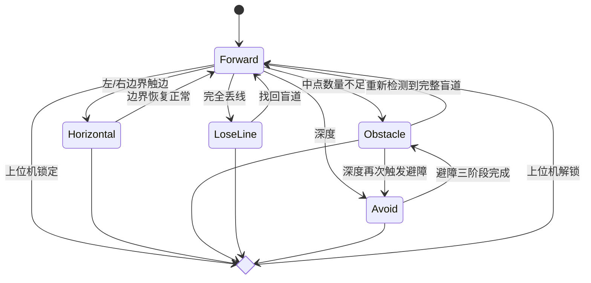

# 导盲既有工作调研
这个主要是答辩讲故事比较方便，写文章的话，还要去额外调研不适用传统方法而是 **LLM 的 3D-aware** 的工作

| 工作方向 | 技术核心 | 调研侧重 |
| --- | --- | --- |
| 导盲盲道 | 传统视觉/A1控制 | 盲道识别算法、跟随平稳性、系统架构 |
| RoboGuide | VLM/高级认知 | 语言指令-动作转换、实时推理、泛化能力 |
| InternDog | 具身智能/多中枢 | 高中低中枢分工、离线化技术、实际应用场景 |
| Guide-Cane | 低成本/ESP32 | 传感器配置、精简算法逻辑、人机交互方式 |

## BlindGuideDog

一言以蔽之，项目用 **PP-LiteSeg 语义分割盲道、几何拟合出中线，再把误差喂给 PID 和状态机**，让宇树 A1 在 Jetson NX 上靠视觉反馈沿盲道自主行走并避障。

本质上虽然说是导盲，但是其实更类似于那种机器小车比赛，沿着既定的轨迹（盲道）走。导盲需求主要体现在两部分——**视觉模型专门识别盲道区域、RobotController 根据盲道中线决定前进/横移/旋转模式**，同时 **深度图** 触发避障并通过远程锁定与录像控制保障人机协作，使机器狗具备导盲犬所需的循迹、避障与人机交互能力。

](/blog/2025/BlindGuideDog.png)

### 视觉侧
A1 的摄像头 Realsense 同时给我们 RGB 帧和深度帧，经过处理之后进入 **语义分割** 部分。

相比检测、分割小目标，语义分割是逐像素地给图像贴标签。盲道通常纹理复杂、光照多变，但整体还是连续区域，用语义分割可以减少后续几何步骤的噪声，而这里所使用的是 **PP-LiteSeg（百度飞桨）**，结构里用了 PPM-Lite、U-Net 风格的特征融合和轻量解码头。本项目把相机帧做预处理（BGR→RGB、归一化、Resize），通过 **Paddle Inference GPU** 版本推理，输出 640×480 的单通道掩膜（1 表示盲道，0 表示背景）。

下一步 **种子扫描** 提取左右边界与中点，映射到鸟瞰坐标。
种子扫描的流程为：
（1）从图像下半部分往上，每隔 20 像素取一行；起始种子是图像中线位置。
（2）如果这一行的种子位置在盲道上，就向左、向右扫描，一直走到遇到背景像素 (0) 为止，这两个点就是左、右边界。
（3）如果种子不在盲道上，就从最左或最右端开始扫描找到盲道边，再确定另一边。
（4）左右边界的平均值就是这一行的“盲道中点”。把所有行的中点收集起来，就是中线的离散点集。

得到的中点还是原图坐标，直接在原图上测角度会受到透视影响：靠近相机的区域和远处宽度不同，线条看起来有弯曲。为了解决这个问题，要先选定四个像素点和它们在“理想鸟瞰图”上的位置，求得一个 **3×3 的单应矩阵 H**。这个矩阵可以把图像坐标 (x, y) 映射到“鸟瞰平面坐标”，好比把斜着看的地面拉平。结果就是：一个“鸟瞰下的中点坐标”和一个“中线偏转角度”，送给 PID 算速度。

> BTW全能扫描王不会是一种BEV吧？

彩色帧跑语义分割，同时 Realsense 深度帧用于 **检测前方障碍**，被拿来做 ROI 分析：
（1）**Get_MinDistance** 会在一个矩形区域（例如图像中间偏右的一块）内取样，忽略深度为 0 的无效值，返回最小距离（毫米）。
（2）**Get_AverageDistance** 返回平均距离，可用于调试。
（3）在 Task_infer 里，如果最小距离在阈值（比如 1000 mm）以内，就调用 **RobotController::Judge_Avoid**。它会把模式切换到 Avoid，并记录当前位姿和避障方向（向左或向右平移）。
（4）避障模式下，**mode_choose2** 会按“平移 → 直行 → 反向平移”的顺序执行，直到重新回到盲道附近，再把模式切回 Obstacle/Forward。

计算出的前进/横移/转向速度通过 Unitree SDK 的高层接口发给 A1，实现“看→想→走”的闭环。

### 控制侧
整个程序在 main.cpp 里启动三个线程，共享一个 **RobotController 实例和 Custom（Unitree SDK 包装类）**，用 mutex mtx 做速度计算的互斥。
（1）**Task_infer（视觉线程）**
负责从 Realsense 取帧、调用 PP-LiteSeg、做 BEV 拟合、中线状态判断、深度 ROI 分析。
每个循环把 robot_a1 的模式、PID 输入、avg/min 深度等字段更新完，再锁住 mtx 调 calculate_speed()，释放锁后进入下一帧。
还顺便做录像（VideoWriter）、FPS 统计。

（2）**Task_walk（控制线程）**
RobotController 里预先定义了六种模式：Forward（正常循迹）、Horizontal（临时横移）、Obstacle（开环直走）、LoseLine（自转找线）、Avoid（三段式绕障）、STOP。

视觉线程把中线/深度信息写到 robot_a1，控制线程 Task_walk 每 5 ms 把这些模式翻译成速度。
**mode_choose1** 根据中点数量、左右边界是否触到图像边缘判定场景：点太少→LoseLine；左/右边界选择数很高→说明靠墙，进 Horizontal；正常情况→Forward。
**calculate_speed** 里两个 PID：side_pid 让中点落在 320 像素位置，对应控制横向速度（&gt;0 左移，&lt;0 右移）；yaw_pid 让中线角度回到 0°，输出 yawSpeed。前进速度在 Forward/Horizontal 模式分别固定为 0.4 和 0.3。
深度触发 Avoid：stage_flag = 1 时平移，2 时直行，3 时反向平移。每个阶段都用自定义条件退出（最小深度 > 阈值、平移距离够、回到原横坐标），最后把模式切回 Obstacle。
如果 LoseLine，就保持前进速度 0，只靠 yawSpeed 和 sideSpeed 小幅旋转/平移去把盲道找回来。
PID 的 **set_Limitval** 把输出限制在 SDK 允许范围内，避免速度命令超界；**RobotController::isLocking** 则允许上位机直接把速度清零（安全停驻）。

（3）**Task_recv（通信线程）**
在 7778 端口上阻塞 recvfrom，监听上位机发送的简单指令：0xAA/0xBB 控制 robot_a1.isVideo（视觉线程据此开/关录像），0x44/0x55 控制 isLocking（控制线程读到后把速度清零或恢复）。
这让上位机可以远程操作录制、紧急停机，不用直接干预视觉/控制逻辑。

## 基于ESP32-S3的多模态智能导盲杖
这里主要是回归质朴，Github 仓库检索一大堆是在开发板上部署 YOLO 做的，参考一下这个最小元开发的思想应该能给我带来不少启发。

系统基于 **FreeRTOS 多任务架构**，主要包含以下任务：

- 超声波检测任务：负责障碍物检测
- 视觉检测任务：负责盲道识别
- 红绿灯检测任务：负责交通信号灯识别
- 语音处理任务：负责语音交互
- 警报任务：负责整合各类警报并通过振动和声音提醒用户
- 导航任务：负责提供路径导航

1. **开机后**，系统将自动连接 WiFi 并初始化各个模块
2. **超声波传感器** 会持续检测前方障碍物，当检测到障碍物时会通过振动和蜂鸣器提醒用户
3. **摄像头** 会实时检测盲道和红绿灯，并在必要时提供警报
4. **按下语音按钮** 可以进行语音交互：
- 导航指令：例如"导航到江西理工大学"
- 天气查询：例如"今天南昌天气怎么样"
- 一般问题：可以询问任何问题，系统会通过大模型提供回答

## InternDog
逼格非常高的工作，说是我国首个应用在导盲任务/场景下的四足机器人，但实际上很开源出来看也很难评，首先是这篇工作的主体是光电学院的，而不是机械或者计院等，我看到有一些评论指出【这里的光电包括光信号和电信号的意思，更偏向视觉的那种含义】，但是这里用的是 YOLO 啊？不是说 YOLO 不优秀，但是多模态大模型更符合直觉和发展，这个 2024 年的工作估计也受限于当时的算力。
README 将将工程整体架构划分为三个层次：
* **高级中枢**：推理速度相对较慢，因此主要负责对时效性要求不高但对模糊意图理解能力要求较强的工作，如人机自然语言交互、复杂任务规划等；
* **中级中枢**：推理速度适中，基于YOLO系列目标检测算法、OCR算法对场景进行视觉感知，基于科大讯飞语音模块内置的模型进行离线语音识别、语音合成等任务；
* **低级中枢**：传感器数据接收、控制电机等硬件实时运动等。

但实际开源出来的只有 **高级中枢**，中级/低级中枢在开源代码里并没有真正实现。无论是 agent/task_room_funcs.py 还是 Gradio 回调，只是要求真人或脚本输入状态字符串，根本没有 YOLO、OCR、语音、运动控制等算法代码。

它的 B 站 DEMO 看起来不错，但他开源的场景模拟器其实只是一个 **基于规则的对话脚本生成器**：它循环构造 [用户消息]、[底层程序消息] 等纯文本，再把大模型预期输出组织成 JSON。这里既没有 3D 图形也没有图像标注，完全是时序对话数据。

所以实际看上去没那么有逼格，就是边缘部署了 **InternLM2-Chat-1.8B**，使用 Function Call 去编排动作序列而已，就 Robotics 和 Embodied AI 方面学不到多少知识。不过倒是让我了解了 Unitree GO2 居然相比 Go1 更新了一个跟随模式，这个官方的 **跟随模式** 将来可以去研究一下。

## RoboGuide
我关键词试了个遍找到了一篇 “Accessible Interfaces for an Assistive Quadruped Robot” 的论文（arXiv 2402.11125v2），“工业四足机器人用于辅助导航视障人士”的研究。这与“用四足机器人＋多传感器＋人-机交互界面辅助视障导航”非常接近。但并未明确提及格拉斯哥大学的 RoboGuide 项目或 Popoola 博士团队。

也有其他研究例如 “Transforming a Quadruped into a Guide Robot for the Visually Impaired: Formalizing Wayfinding…”（arXiv 2306.14055）以及 “DogSurf: Quadruped Robot Capable of GRU-based Surface Recognition for Blind Person Navigation”（arXiv 2402.03156）。这些也属于“使四足机器人辅助视障人士”的研究范畴，但并非明确由格拉斯哥大学或者以 “RoboGuide” 名称所开展。最权威的官方信息就来自这篇[新闻稿](https://www.gla.ac.uk/news/archiveofnews/2024/february/headline_1043333_en.html)了。

不过至少这里只是找一点故事讲，技术实现还是得从下面的工作进一步调研：

## 下一步
**“纯 2D 视觉伺服 (Visual Servoing) 与现实 3D 环境（障碍物）之间的 Gap”**

把前面几套方案拆完，我脑子里最先浮现的是：LOVON 仍旧停留在 **Reactive 策略**，看到什么就反应什么，完全没把周边环境内部化成模型。要把它拉出实验室，就不得不走向 **model-based（环境模型）** 。

顺着这个思路，我给这层定位成“介于视觉伺服与全局 SLAM 之间”的 **“基于感知的局部运动规划 / 反应式障碍物规避”**。它关注的是**眼前 5 米** 的 **Egocentric Perception**：不用建全局地图，但要让机器狗知道“门框、可行区域、目标人”分别在哪。于是，真正的计划自然被拆成几个互相衔接的领域。

#### 1. 领域一：BEV (Bird's-Eye-View) 实时感知与规划

首先得把“俯视图”补齐。**BEV** 是将 3D 世界“拍扁”成 2D 俯视栅格地图的标准手段，非常适合后端规划。

* **核心思想：** 利用 Go2 的深度相机（或 LiDAR），将点云数据实时投影到一个以机器人为中心 (Egocentric) 的 BEV 栅格图上。在这个图上，“门框”是障碍物，“人”是目标点。
* **检索关键词：**
    * `"BEV Perception for Navigation"` (BEV 感知与导航)
    * `"Depth-based Local Planner"` (基于深度的局部规划)
    * `"Occupancy Grid Map"` + `"Real-time"` (实时占用栅格图)
    * `"Robot Person Following with Obstacle Avoidance"` (带避障的人员跟随)
    * `"BEV Segmentation"` (BEV 分割，用于区分可通行区域和障碍物)

#### 2. 领域二：局部路径规划算法 (Local Planning)

当 BEV 搭好之后，LOVON 的定位也随之改变。它不该再直接输出 `(vx, wy)`，而是**降级为一个高层 Goal**，把“怎么走”交给专门的规划器。

然后，一个**局部规划器 (Local Planner)** 在 BEV 地图上，计算出一条从“我”到“目标点”的、*不会撞到障碍物*的、安全的 `(vx, vy, vyaw)` 指令。这才是“分层决策”真正落地的方式。

* **核心思想：** “分层决策”
* **检索关键词 (经典算法)：**
    * `"Dynamic Window Approach (DWA)"` (动态窗口法，工业界和学术界最常用的局部规划器之一)
    * `"Trajectory Rollout"` (DWA 的别称)
    * `"Velocity Obstacle (VO)"` (速度障碍法)
    * `"ROS Navigation Stack"` (虽然你可能不用 ROS，但其 `local_planner` 的设计思想值得借鉴)

#### 3. 领域三：视觉-语言-导航 (VLN)

在感知和规划之外，还要回到 LOVON 所属的 **VLN** 大类。毕竟它的卖点是开放词汇，问题只是它停留在 2D 仿真。下一步得去对标那些**真正处理 3D 环境**的 VLN 工作，学习他们怎么把语言、视觉、几何 glue 在一起。

* **核心思想：** 看看其他 SOTA 模型是如何融合 3D 信息来执行开放词汇导航任务的。
* **检索关键词：**
    * `"Vision-Language-Navigation"` + `"3D"` 或 `"Depth"`
    * `"Open-Vocabulary Object Navigation"` (开放词汇目标导航)
    * `"Grounded Navigation"` (基于语言指令的导航)

> CSDN 还是很好用的，直接给你一系列[具身导航的汇总](https://blog.csdn.net/qq_41204464/article/details/148337859)

理清了三条主线，接下来就可以带着“我要解决什么问题”去搜文献，而不是漫无目的翻论文。

**检索方向一：如何将深度/BEV用于足式机器人避障 (解决“撞门框”)**

1.  **论文方向：** `query: "real-time depth-based obstacle avoidance for legged robots"`
    * **相关工作 (示例)：** 这类工作（例如来自 ETH Zurich, MIT 等实验室）通常使用机载深度相机创建**局部高程图 (Elevation Map)** 或 **BEV 成本图 (Costmap)**。它们会实时评估地形的可通行性 (traversability)，并将其与运动规划器（如 DWA 或 MPC）结合。
    * **启发：** 可以借鉴它们如何**从深度图（Go2有）生成 BEV 占用图**，并实现一个轻量级的 DWA 算法来“覆盖”LOVON 的原始运动指令。

2.  **论文方向：** `query: "Dynamic Window Approach (DWA) with depth camera"`
    * **相关工作：** 大量论文讨论了如何将 DWA 算法与传感器（激光雷达或深度相机）的输入相结合。DWA 的核心是在速度空间 `(v, w)` 中采样，模拟未来几秒的轨迹，然后用一个成本函数（Cost Function）来评估每条轨迹。
    * **启发：** 成本函数可以**融合 LOVON 的指令和 BEV 地图**：
        * **成本项1 (来自LOVON)：** 轨迹的终点是否朝向 LOVON 检测到的目标方向？（`heading` 成本）
        * **成本项2 (来自BEV)：** 轨迹是否会碰撞到 BEV 上的障碍物（门框）？（`obstacle` 成本）
        * **成本项3 (效率)：** 轨迹是否在快速前进？（`velocity` 成本）
        * **你的贡献：** 通过这个融合了“2D 视觉目标”和“3D 障碍感知”的成本函数，机器狗在看到门框时，会因为 `obstacle` 成本过高而自动减速或停止，完美解决“撞门框”问题。

**检索方向二：如何处理目标丢失 (解决“门后搜索”)**

1.  **论文方向：** `query: "target prediction for robot following"`
    * **相关工作：** 当目标（人）丢失时，LOVON 的“原地旋转”策略非常低效。更高级的方法是使用一个简单的**运动预测器**（如 **卡尔曼滤波器, Kalman Filter**），哪怕只预测 0.5 秒。
    * **启发：** 当目标消失在门后时，卡尔曼滤波器会预测目标继续“直行”。高层策略不应该是“旋转”，而应该是**“导航至目标最后出现和预测的 3D 位置”**。结合 DWA 局部规划器，机器狗会**安全地走到门口**（而不是撞上门框），然后才在门口执行更智能的搜索（比如检查门的两侧）。

基于以上分析，我们的课题创新点（相较于 LOVON）可以清晰地定义为：

**"我们提出了一种融合 3D 局部感知与分层运动控制的开放词汇目标追踪框架，以解决现有 2D 视觉伺服策略 (如 LOVON) 在真实环境中因缺乏障碍物理解而导致的 sim2real gap 问题。"**

具体来说，这里的系统由两层构成：

1.  **高层策略 (High-Level Policy)：** 沿用 LOVON 的开放词汇检测器 (YOLO)，但其输出**不再是 `(vx, wy)` 运动指令**，而是**目标在图像（或 3D 空间）中的矢量 (Goal Vector)**。
2.  **低层规划器 (Low-Level Planner)：**
    * **感知模块：** 使用 Go2 的深度相机实时构建一个**局部 BEV 占用栅格图 (Local BEV Occupancy Grid)**。
    * **规划模块 (如 DWA)：** 接收高层传来的“目标矢量”，并结合 BEV 栅格图，计算出一条**安全、平滑且指向目标**的最优 `(vx, vy, vyaw)` 指令，并发送给 Go2。

这样一来，“愿景—路径—落地”三段式逻辑就完整串起来了。先把 `BEV Perception`、`Dynamic Window Approach (DWA)`、`Depth-based Local Planner` 这些关键字一一扫过，再逐步动手搭系统。
