盲走，即机器人无需感知地形细节，仅凭本体感知（Proprioception）与控制律即可在非结构化环境中保持稳定。

```mermaid
flowchart TD
    A[<b>根：动态平衡的物理本源与解耦控制</b><br>确立无需地形感知<br>仅凭本体感知保持稳定的可行性]
    
    A --> B1[<b>M1: Legged Robots That Balance</b><br><i>Raibert, 1986</i><br>• 动态稳定范式奠基<br>• 三部分解耦控制<br>• 落足点规划公式]

    B1 --> B2[<b>M2: BigDog</b><br><i>Boston Dynamics, 2008</i><br>• 虚拟模型控制<br>• 液压驱动与力控<br>• 确立工程鲁棒性范式]
    
    B2 --> Branch1
    B2 --> Branch2
    
    subgraph Branch1 [<b>分支 I：高动态模型预测控制</b>]
        direction LR
        C1[<b>M3: MIT Cheetah 2</b><br><i>2017</i><br>• 冲量缩放力控<br>• 本体感知驱动器]
        C1 --> C2[<b>M4: MIT Cheetah 3</b><br><i>2018</i><br>• 凸模型预测控制<br>• 实时QP求解<br>• 高频重规划反应]
    end

    subgraph Branch2 [<b>分支 II：深度强化学习的爆发</b>]
        direction LR
        D1[<b>M5: Sim-to-Real</b><br><i>Google, 2018</i><br>• 高保真执行器建模<br>• 域随机化标准范式]
        D1 --> D2[<b>M6: Learning Agile Skills</b><br><i>ETH RSL, 2019</i><br>• 数据驱动执行器网络<br>• 混合仿真突破Sim-to-Real]
    end

    D2 --> Branch3
    
    subgraph Branch3 [<b>分支 III：特权学习与本体感知历史</b>]
        direction LR
        E1[<b>M7: Learning over Terrain</b><br><i>Science Robotics, 2020</i><br>• 教师-学生蒸馏框架<br>• TCN处理感知历史<br>• 隐式地形推断]
        E1 --> E2[<b>M8: Learning by Cheating</b><br><i>2020</i><br>• 形式化“作弊学习”<br>• 分解探索与表示难度]
    end

    E2 --> Branch4
    
    subgraph Branch4 [<b>分支 IV：在线适应与大规模并行</b>]
        direction LR
        F1[<b>M9: RMA</b><br><i>2021</i><br>• 快速电机适应<br>• 隐式环境编码<br>• 异步适应模块]
        F2[<b>M10: Legged Gym</b><br><i>2022</i><br>• GPU大规模并行仿真<br>• 分钟级训练<br>• 地形课程]
        F3[<b>M11: Walk These Ways</b><br><i>2022</i><br>• 步态条件策略<br>• 行为多样性<br>• 连续步态流形]
        F1 & F2 & F3 --> Branch5
    end

    subgraph Branch5 [<b>分支 V：前沿演进——隐式感知与去特权化</b>]
        direction TB
        G1[<b>M12: DreamWaQ</b><br><i>2023</i><br>• 隐式地形想象<br>• 非对称Actor-Critic<br>• “触觉扫描”地形]
        G2[<b>M13: Concurrent Teacher-Student</b><br><i>2024</i><br>• 并发师生训练<br>• 缩小蒸馏损失<br>• 寻找可模仿策略]
        G3[<b>M14: Extreme Parkour Baseline</b><br><i>2024</i><br>• 界定盲走能力边界<br>• 视觉规划，本体稳定<br>• 定义反应型障碍SOTA]
        G4[<b>M15: SLR</b><br><i>2025</i><br>• 自监督潜在表示<br>• 去特权化训练<br>• 基于状态转换的监督]
        G5[<b>M16: Proprioceptive State Estimation</b><br><i>2024</i><br>• 不变扩展卡尔曼滤波<br>• 打滑检测与鲁棒估计<br>• 纯本体感知定位SOTA]
        
        G1 --> G2
        G2 --> G3
        G3 --> G4
        G4 -.-> G5
    end
    
    %% 关键连接与注释
    B1 -.-> C1
    C2 -.-> D1
    C2 -.-> E1
```

## 1
[Legged Robots That Balance](https://github.com/legged-robots-that-balance/-legged-robots-that-balance-/blob/master/Legged-Robots-That-Balance.pdf)

作为现代动态足式机器人的鼻祖，Marc Raibert（后来的Boston Dynamics创始人）在CMU Leg Lab和MIT Leg Lab的这项工作是整个领域的基石。在此之前，步行机器人多采用静态平衡（Static Stability），即重心始终投影在多边形支撑区域内，导致运动缓慢且僵硬。Raibert通过单腿跳跃机器人（One-Legged Hopper）证明了动态稳定（Dynamic Stability）的可行性，并提出了至今仍具影响力的三部分解耦控制器（Three-Part Control Decomposition）。

