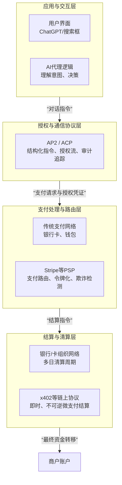

在互联网架构的演进史中，支付功能的缺失被广泛认为是其“原罪”。传统的超文本传输协议（HTTP）在设计之初就预留了 402 状态码（Payment Required），但由于缺乏原生的数字价值传输手段，该状态码在过去三十年间一直处于闲置状态 。

随着 AI Agent 的崛起，这种架构性的缺陷变得愈发显著：自主运行的智能体需要能够独立地购买数据、支付算力并结算服务，而传统的信用卡体系和法币支付网关因其高昂的摩擦成本、严格的身份验证以及无法实现程序化即时结算，已成为限制智能体经济规模化的核心瓶颈 。

2025 年 9 月，Coinbase 联合 Cloudflare、Visa 等行业巨头正式推出了 x402 协议及 x402 基金会，旨在激活 HTTP 402 状态码，构建一个基于区块链和稳定币的互联网原生支付层 。该协议允许任何 API 或 Web 服务在提供内容前要求支付，实现“支付即结算”的即时交互体验 。在 x402 的愿景中，互联网的经济行为将从“点击与订阅”转向“请求与即时支付”，从而释放高达 30 万亿美元的机器对机器（M2M）经济潜力 。

## 1 x402 协议

在深入分析具体项目之前，有必要理清 [x402 协议的技术支柱](https://docs.x402.org/core-concepts/network-and-token-support)，其技术本质是**将HTTP协议层的“支付需求状态”与区块链层的“价值结算功能”进行原生耦合**，构建一个机器可读、可自动执行的支付通信框架。

协议的核心创新点在于：它**复活并重新定义了HTTP/1.1标准中早已存在但从未被有效实现的402（Payment Required）状态码**，将其从一个预留的、无实际意义的代码，转变为驱动价值转移的机器可读指令。协议本身是链无关的，但初期实践主要基于以太坊Layer2网络Base，使用USDC稳定币作为结算单位，以实现低成本和价格稳定。

| 对比维度 | x402 协议工作流程 | 传统支付或API调用 |
| :--- | :--- | :--- |
| **1. 发起请求** | AI或客户端请求访问一个受保护的资源（如API、数据） | 用户登录、提交信用卡/API密钥 |
| **2. 支付请求** | 服务器返回 **HTTP 402** 状态码及支付详情（金额、收款地址） | 用户手动在支付页面操作 |
| **3. 执行支付** | 客户端（AI钱包）自动签名，通过 Facilitator 服务在链上结算（如支付 USDC） | 通过银行、信用卡网络等中心化机构清算，耗时数天 |
| **4. 获得资源** | 支付验证后，服务器即时返回请求的资源 | 支付确认后，才能获得服务或商品 |


### 1.1 原始HTTP 402为何从未被采用

理解X402协议，必须追溯其试图解决的原始问题。HTTP/1.1标准（RFC 2616）在1999年就定义了402状态码，但在此后超过25年的时间里，它几乎完全未被使用。其根本性失败原因在于：

1.  **语义空洞**：标准仅规定此状态码表示“需要付款”，但未定义服务器应如何向客户端传达具体的支付参数（金额、货币、收款方）。这导致每个试图实现它的服务都必须发明自己的、非标准的响应体格式（可能是HTML、纯文本或自定义JSON），无法形成跨客户端的通用解析逻辑。
2.  **缺乏结算通道**：即便客户端解析出“需要支付1美元”，支付动作本身也与HTTP协议栈完全分离。客户端必须跳出当前的技术上下文（如跳出API调用流程），转向一个完全异构的系统（如在线银行、信用卡支付页面）进行手动、异步的支付操作。这个过程无法由程序自动化完成。
3.  **没有可信证明机制**：客户端完成支付后，缺乏一种标准化的、可机器验证的方式，向服务器证明“我已付款”。传统Web支付依赖支付网关的回调（Webhook），这种机制复杂、不稳定，且建立在服务商之间的私有商业合约上，无法作为协议层的基础设施。

因此，原始的HTTP 402实际上是一个**不完整的技术半成品**，它识别了“网络资源需要付费”这一需求，但完全没有提供实现这一需求的标准化工具链，最终被更粗暴但实用的方案（如付费墙、订阅制、API密钥）所彻底取代。

### 1.2 工作流程

x402 是一个建立在现有 HTTP 协议之上的支付握手标准。其核心架构由四个主体构成：
客户端（Client/Agent）、资源服务器（Resource Server）、促进者（Facilitator）以及区块链结算层（Settlement Layer） 。

整个协议的工作流程是一个清晰的**状态机**，完全遵循HTTP请求-响应范式。

**1. 支付指令的生成与传递**
x402明确定义，当服务器需要收费时，必须返回HTTP 402状态码，**并在响应体中携带一个结构化的、机器可读的JSON对象**。该对象包含了完整的支付元数据，例如：
```json
{
  "price": "0.001",
  "currency": "USDC",
  "network": "eip155:8453",
  "address": "0x...",
  "expires_at": 173...
}
```
这使得“支付要求”成为了一种客户端可以无歧义解析的**标准数据格式**，而非供人阅读的自然语言文本。

**2. 客户端的支付执行与证明生成**
**客户端**解析402响应后，通过指定使用特定的区块链（如Base，CAIP-2标识为`eip155:8453`）和特定资产（如USDC），x402将“价值转移”这一动作也标准化了。支付不再需要跳转到外部系统，而是变成了在同一个技术范式（区块链交易）内执行一个标准操作：**向指定地址转账指定数量的通证**。客户端（尤其是AI代理）的程序逻辑可以无缝衔接“解析支付指令”和“执行支付交易”这两个步骤。
区块链交易天然提供了一种全局公开、密码学安全、可即时验证的支付收据——**交易哈希（Transaction Hash）**。x402协议定义，客户端在完成链上支付后，必须将包含此交易哈希等信息的支付凭证，封装在`PAYMENT-SIGNATURE`请求头中，重新发起请求。服务器或它委托的第三方验证服务（Facilitator）可通过查询该区块链，独立验证支付是否真实发生且符合要求。验证通过后，服务器在返回资源时，可在`PAYMENT-RESPONSE`头中携带结算确认信息。

**3. 头部编码与工作流**
x402 V2协议对支付通信的两个关键头部进行了精确定义：

*   **`PAYMENT-SIGNATURE`头**：由客户端在收到402响应后设置。其值是一个**Base64编码的JSON字符串**。编码目的并非加密，而是确保JSON中的特殊字符（如引号、换行符）在HTTP头部这一特殊环境中能安全传输，避免解析错误。该JSON负载至少包含交易哈希、签名等证明支付授权完成的必要信息。
*   **`PAYMENT-RESPONSE`头**：由服务器在验证支付成功并返回资源时设置。其值同样是一个Base64编码的JSON字符串，用于向客户端确认支付已被验证并结算，可包含清算ID等信息。

**完整的技术工作流如下：**
1.  **请求**：`客户端 --(GET /resource)--> 服务器`
2.  **要求支付**：`服务器 --(HTTP 402 + JSON 支付详情)--> 客户端`
3.  **支付与证明**：客户端解析详情，用钱包签名并发起链上USDC转账。获得交易哈希后，构建支付凭证，进行Base64编码。
4.  **验证请求**：`客户端 --(GET /resource, 头部: PAYMENT-SIGNATURE=<凭证>)--> 服务器`
5.  **验证与响应**：服务器或Facilitator验证链上交易。成功则：`服务器 --(HTTP 200 + 资源, 头部: PAYMENT-RESPONSE=<确认>)--> 客户端`；失败则再次返回402。

```mermaid
sequenceDiagram
    participant C as 客户端
    participant S as 资源服务器
    participant F as Facilitator (可选)
    participant B as 区块链 (如Base)

    Note over C,S: 初始请求阶段
    C->>S: GET /resource
    S-->>C: HTTP 402 Payment Required<br/>Body: {价格、收款地址等JSON}

    Note over C,B: 链上支付阶段 (异步)
    C->>C: 解析支付详情，构建交易
    C->>B: 签名并发送USDC转账交易
    B-->>C: 返回交易哈希 (tx hash)
    C->>C: 使用tx hash等构建支付凭证

    Note over C,S,F: 验证与获取资源阶段
    C->>S: GET /resource<br/>Header: PAYMENT-SIGNATURE={凭证}
    
    alt 使用Facilitator验证
        S->>F: 提交支付凭证进行验证
        F->>B: 查询交易状态
        B-->>F: 交易确认结果
        F-->>S: 返回验证结果 (成功/失败)
    else 服务器自行验证
        S->>B: 直接查询交易状态
        B-->>S: 交易确认结果
    end

    alt 验证成功
        S-->>C: HTTP 200 OK<br/>Body: 请求的资源<br/>Header: PAYMENT-RESPONSE={确认}
    else 验证失败
        S-->>C: HTTP 402 Payment Required (返回步骤1)
    end
```
### 1.3 名词解释
1.  **CAIP (Chain Agnostic Improvement Proposals)**
    *   **是什么**：一套旨在使区块链应用能够跨不同区块链网络进行互操作的技术标准。你可以把它理解为区块链世界的“ISO标准”或“通信协议”。
    *   **为什么重要**：在x402中，`network: “eip155:8453”` 就是一个CAIP-2格式的标识符。`eip155` 代表以太坊虚拟机（EVM）生态系统，`8453` 代表Base链。这种标准化格式让协议和工具能无歧义地识别目标区块链，是实现多链支持的基础。

2.  **USDC (USD Coin)**
    *   **是什么**：一种由受监管金融机构持有的等值美元资产（如现金和短期国债）作为全额抵押的**稳定币**。1 USDC 的设计目标始终等于 1 美元。
    *   **为什么重要**：它是x402协议中主要的支付结算资产。使用USDC可以避免比特币、以太坊等其他加密货币的价格剧烈波动带来的结算风险，使得支付金额确定，适用于需要稳定定价的API调用、内容付费等场景。

3.  **Base**
    *   **是什么**：由加密货币交易所Coinbase构建并支持的以太坊**第二层扩展网络**。它旨在提供比以太坊主网更快的交易确认速度和低得多的交易成本（Gas费），同时继承了以太坊主网的安全保障。
    *   **为什么重要**：x402协议主要由Coinbase推动，因此天然优先深度集成Base链。其低成本特性使得几美分甚至更低额的微支付变得经济可行。

4.  **Facilitator**
    *   **是什么**：在x402协议中，一个可选的、提供支付验证和结算服务的**第三方服务组件**。
    *   **为什么重要**：它极大地简化了资源服务器（卖家）的集成难度。服务器无需自己运行区块链节点、监控交易和实现复杂的验证逻辑，只需将客户端提供的支付凭证转发给Facilitator即可获得可靠的验证结果。这降低了采用x402协议的技术门槛。

5.  **Gas费**
    *   **是什么**：在以太坊及类似区块链（如Base）上，用户为执行交易或智能合约操作所支付的**计算资源费用**。这笔费用支付给验证交易的网络节点。
    *   **为什么重要**：即使使用x402协议支付0.01 USDC，发送方（客户端）也需要额外支付一小笔Gas费来完成这笔USDC的链上转账。这是区块链操作的内在成本。

### 1.4 局限

尽管架构清晰，X402协议在走向大规模采用的道路上仍面临严峻的技术挑战：

1.  **验证延迟与中心化风险**：服务器验证链上交易需要时间（从几秒到数分钟，取决于区块链的最终确定性）。虽然协议引入了“Facilitator”这种预验证服务来加速，但这实际上引入了一个新的、可能中心化的信任依赖点，与去中心化精神有所背离。
2.  **私钥管理的复杂性**：协议要求客户端（AI代理）自主管理区块链私钥以签名支付。这在带来自主权的同时，也带来了私钥安全、丢失、泄露以及 gas 费管理等一系列复杂的密钥管理问题，对AI系统的安全性设计提出了极高要求。
3.  **协议层面的退款与争议处理缺失**：协议目前只定义了成功的单向支付流程。如果用户支付后未收到资源（由于服务器故障或欺诈），或需要退款，协议层没有定义任何标准机制。这需要依赖应用层或法律层去解决，留下了巨大的用户体验和商业纠纷隐患。
4.  **网络兼容性与成本波动**：协议虽宣称链无关，但不同区块链的性能、成本和生态碎片化是不争的事实。在以太坊主网拥堵时，Gas费可能远超微支付金额本身，使协议经济模型失效。虽然Base等L2缓解了此问题，但将协议绑定于特定链也带来了新的中心化风险。

### 1.5 总结

X402协议是一次具有深刻洞察力的技术整合尝试。它敏锐地识别出，**区块链的可编程资产与公开可验证性，恰好能补全HTTP协议在价值传输维度上的原生缺陷**。它不是要取代现有的应用层支付工具，而是要成为互联网基础协议栈中缺失的“价值传输层”。

其技术意义在于，它试图将“支付”从一个需要跳出当前技术上下文（HTTP）去完成的“外部动作”，转变为在同一个上下文内可被原生处理的一个“标准步骤”。这对于以AI代理为代表的自动化程序至关重要，因为自动化系统难以处理需要跳出既定流程、进行非结构化交互的任务。

然而，该协议目前仍处于非常早期的阶段。当前生态的热度很大程度上是由基于其进行代币铸造（如$PING）的投机行为所驱动，这掩盖了其在微支付、AI经济等核心应用场景上的真实进展和障碍。真正的成功与否，将取决于它能否在保持去中心化精髓的同时，妥善解决支付验证效率、密钥安全管理、纠纷处理机制等底层工程难题，并吸引足够多的资源提供方（而不仅仅是代币发行方）将其作为默认的支付集成方案。

从更广阔的视角看，X402协议是Web3思想向互联网基础协议渗透的一个典型案例。它的探索方向，即如何将信任最小化的价值结算能力嵌入到现有的、广泛应用的网络协议中，可能比它当前的具体实现更为重要。无论X402本身最终成败，这条技术路径都值得我们持续关注。

- **[x402.org](https://www.x402.org)**

## 2 Agent Payments Protocol (AP2)


Agent Payments Protocol（AP2）是一个**开放、可互操作的支付协议层**，专为AI智能体自主发起和完成商业交易而设计。其核心不是一个具体的支付工具或应用，而是一套定义在现有智能体交互协议（如A2A、MCP）之上的**规则、数据格式和密码学原语的集合**。

简单来说，AP2为不同公司开发的、代表不同利益的AI智能体提供了一套“安全交易的语言和公证流程”，使它们能够在缺乏中心化平台担保的情况下，可信地完成从询价到支付的全过程。

### 2.1 传统支付系统在智能体场景下的信任缺口

当前所有主流支付系统（卡组织、第三方支付）均基于一个根本假设：**一个真实的人类，正在一个可信的界面（如经过TLS加密的电商网站或官方App）上手动发起交易**。当AI智能体成为交易发起者时，这一假设被彻底打破，导致三个无法回避的失败案例：

1.  **授权与审计的失败**
    *   **问题**：支付网络收到一笔来自“智能体”的支付请求。网络无法区分这是用户本人的明确指令，还是智能体的擅自行动或错误决策。
    *   **后果**：用户可能拒绝为未授权的交易买单（拒付），而商户和发卡行之间将陷入无休止的纠纷，因为缺乏判定责任的客观证据。

2.  **意图真实性的失败**
    *   **问题**：商户的智能体收到一个来自用户智能体的购买请求。由于AI存在“幻觉”或对复杂指令的理解偏差，该请求可能歪曲了用户的本意（例如，用户要“红色、棉质T恤”，智能体下单了“红色、丝绸衬衫”）。
    *   **后果**：商户履行了错误订单，导致退货、差评和物流损耗。责任在用户（其指令模糊）、智能体开发者（其模型出错）和商户之间难以划分。

3.  **责任界定的失败**
    *   **问题**：一笔问题交易发生后，涉事各方（用户、智能体开发者、商户、支付机构）都只能提供自身的日志和声称，这些证据是孤立的、可被内部篡改的，无法交叉验证。
    *   **后果**：支付网络为控制风险，可能选择**全面限制或禁止由智能体发起的交易**，从而扼杀整个智能体商务生态。

这些“失败案例”的根源在于，传统支付链路中缺失了针对“机器代表人类”这一行为的**标准化、防篡改、可验证的授权证据链**。

AP2对智能体交易场景的设想是，人们使用购物智能体（也可以是具备购物功能的Personal Agent）来购买商品，购物智能体帮助人们从商家端（也可以是具备销售功能的商家智能体）挑选商品、谈判价格、下单支付。

这里的购物智能体和商家智能体，是不同公司开发和运营的智能体，AP2要解决的，就是不同公司智能体之间如何建立信任，并且低成本的完成交易。
### 2.2 AP2的技术原理与架构

AP2的解决方案并非修补旧系统，而是引入一套新的、原生于智能体交互的信任构建机制。其核心是两个部分：**角色隔离架构**和**可验证数字凭证链**。

#### 2.2.1 角色隔离架构
AP2明确划分了交易中的角色，确保没有任何单一实体能掌握完整权力，从系统设计上限制作恶可能。

*   **用户（User）**：就是**要买东西的人**，即最终授权者，不直接管理支付密钥。
*   **购物智能体（Shopping Agent，SA）**：负责理解需求、搜索、比价、组单、帮用户挑选商品、和商家谈判、组装购物车等。**被严格禁止接触任何形式的支付凭证（如卡号、令牌）**。它的输出是一份经过协商的、待授权的“购物车清单”。
*   **凭证提供商（Credentials Provider，CP）**：一个独立、安全的服务（如升级后的Google Pay或银行钱包）。它持有用户的支付工具，但**不参与购物决策**。它的职责是：a) 接收来自购物智能体的交易请求；b) 向用户请求对**特定购物车**的授权；c) 仅在获得有效授权后，执行支付。
*   **商户端（Merchant Endpoint，ME）**：可能是一个网页、一个MCP server，也可能是一个商家智能体，负责提供商品、确认库存并**对其承诺的购物车详情（商品、价格）进行数字签名**。
*   **支付网络与发卡行**：接收包含新元数据（AP2支付授权）的交易，据此识别智能体交易，调整风控策略。

这种分离确保即使购物智能体被攻破，攻击者也无法直接盗刷；同时，凭证提供商也无法滥用权限替用户购买未同意的商品。

#### 2.2.2 可验证数字凭证链
这是AP2的技术核心，简单理解成某种电子小票（能证明你确实买了什么、花了多少钱、什么时候买的，出了问题可以拿着小票去退货）。可验证数字凭证（Verifiable Digital Credentials，VDCs）是基于公钥密码学（如RSA、ECC）签名的结构化数据对象，具有防篡改、可独立验证的特性。AP2定义了三种关键凭证，它们按顺序形成证据链：

*   **意图授权**
    *   **生成场景**：用户向智能体下达一个长期或复杂的购物任务时（“人不在场”）。
    *   **生成方**：购物智能体起草（包含任务、约束条件、有效期），**用户用私钥签名**。
    *   **作用原理**：这份签名凭证证明用户**在某个时间点，向这个特定智能体，授予了在明确边界内代为购物的权力**。智能体后续的行动必须严格匹配此授权条款。

*   **购物车授权**
    *   **生成场景**：每一次具体购买发生前（无论是“人在场”实时确认，还是“人不在场”自动触发）。
    *   **生成方**：商户端点生成（包含**最终、精确**的商品、价格、税费详情），**用户用私钥签名**。在“人不在场”时，若符合《意图授权》条款，可由智能体代理签名（该代理权本身可被验证）。
    *   **作用原理**：这是交易中最关键的证据。它是一份**经用户数字签名的、商户背书的“最终订单合同”**。它锁定了“谁同意以何价格购买何物”，从根本上解决了意图真实性争议。

*   **支付授权**
    *   **生成场景**：支付执行前。
    *   **生成方**：凭证提供商生成。
    *   **作用原理**：此凭证不包含支付细节，而是向支付网络声明：“本笔交易由智能体发起，其背后已存在一条由《意图授权》和《购物车授权》构成的可验证证据链，交易模式为‘人在场’或‘人不在场’。” 这为发卡行提供了关键的上下文，使其能做出更精准的风控决策（例如，对合规AP2交易适用更宽松的风控规则）。

**信任的建立流程**：
当发生纠纷时，裁判方（如发卡行、仲裁机构）可以要求提供并验证这条凭证链：
1.  验证《支付授权》的签名来自可信的凭证提供商。
2.  顺着《支付授权》找到对应的《购物车授权》，验证其用户签名有效性，并确认商户签名与订单一致。
3.  如果需要，进一步追溯至《意图授权》，验证用户最初的授权范围是否覆盖了本次购物行为。
任何一环签名无效或内容不匹配，都能精确定位问题环节和责任方。

#### 2.2.3 核心支付流程
有了上面的铺垫之后，AP2的支付流程设计就能够理解了，人类在场交易核心流程如下：

1. 设置阶段：用户为其购物智能体设置一个第三方的凭证提供商，可能需要在凭证提供商的可信页面上进行身份验证。

2. 发现与协商：用户向购物智能体提交购物任务，购物智能体与一个或多个商家交互，根据用户的喜好、价格、品牌等信息组合合适的购物车。

3. 商家验证购物车：关键步骤——商家必须对创建的购物车进行签名，表明他们有能力履行该购物车中的商品和服务，这为后续纠纷提供了责任界定依据。

4. 提供支付方式：购物智能体向凭证提供商提供支付上下文并请求适用的支付方法（以引用或加密形式共享），同时获取可能影响支付方法选择的忠诚度/折扣信息。

5. 展示购物车：购物智能体在可信界面向用户展示最终购物车和适用的支付方法，用户通过身份验证过程进行批准。

6. 签名与支付：用户确认购物车，然后使用签名对购物车信息进行签名、授权。该授权与商家共享作为纠纷时的证据。同时，创建支付授权，并且可能与网络和发卡机构共享以进行交易授权。

7. 支付执行：购物车授权的支付部分必须传达给凭证提供商和商家以完成交易。这可能通过多种方式实现：
- 购物智能体(SA)可能请求凭证提供商与商家完成支付，或者
- 购物车可能向商家提交订单，触发支付授权流程，商家/PSP从凭证提供商请求支付方法
8. 发送交易给发卡机构：商家或PSP将交易路由到发卡机构或支付方法运营的网络。交易数据包可能附加AI智能体参与信号，确保网络/发卡机构了解智能体交易。

9. 挑战机制：任何参与方（发卡机构、凭证提供商、商家等）都可以通过现有机制（如3DS2）选择挑战交易。挑战需要由用户智能体呈现给用户，可能需要重定向到可信界面完成。

10. 解决挑战：用户应该有办法在可信界面（如银行应用、网站等）上解决挑战。

11. 授权交易：发卡机构批准支付并确认成功。这会传达给用户和商家，以便订单可以履行。支付收据与凭证提供商共享，确认交易结果。

上面支付过程，可以理解为是一个信用卡的使用过程，会更好的理解。相当于你把信用卡给商家，商家使用POS机刷卡。它和我们在淘宝中使用资金托管的交易方式是不同的。

上面是人类在场的支付过程。AP2也支持人不在场的支付，比如用户对购物智能体说："从<这个商家>为7月的拉斯维加斯演出购买2张<这场音乐会>的票，一旦有票就买。预算是1000美元，我们希望尽可能靠近主舞台"。购物智能体拿着用户的意图授权，实时监控商家订单，有库存的时候，直接向商家申请创建订单，后续的支付流程与人在场交易相同。

- https://ap2-protocol.org/topics/ap2-and-x402/#payment-agnosticism-and-future-proof-design
- https://cloud.google.com/blog/products/ai-machine-learning/announcing-agents-to-payments-ap2-protocol
- [AP2协议深度解读](https://zhuanlan.zhihu.com/p/1954871515398018726)

## 3 ACP (Agentic Commerce Protocol)

ChatGPT 拥有 7 亿活跃用户，他们都在试图通过 AI 获取信息或服务。虽然目前网页版还没有改成淘宝京东那样的代理界面直接买卖商品，但很多人已普遍用它来「发现」商品 —— 用 AI 进行比价。如果能在同一个界面直接购买，无疑方便得多。当用户通过自然语言指令AI代理“帮我预订下周去纽约的机票和酒店”时，这个代理如何安全、可靠、且被商户接受地完成支付？

传统电商支付流程（用户浏览网站-加入购物车-跳转至支付页面-输入卡信息）在此场景下完全失效。代理无法“跳转”，用户也绝不可能将信用卡CVV码告知AI。因此，需要一种全新的协议，让代理能在获得用户有限授权的前提下，代表用户发起支付，同时保障安全与合规。

OpenAI与Stripe合作推出的自主代理商业协议（Agentic Commerce Protocol, ACP），正是为解决此问题而设计的一套开放技术规范。它并非一个具体的产品，而是一组API标准、数据格式和交互流程的定义。

### 3.1 ACP协议概述

Stripe 是一家全球性的金融基础设施即服务（Infrastructure-as-a-Service）科技公司，核心功能分层如下：

- **支付处理（核心层）**：
  - **功能**：安全地接受、处理来自全球客户的在线支付，支持信用卡、借记卡、银行转账、电子钱包（如支付宝、Apple Pay）等数百种支付方式。
  - **价值**：企业无需与全球各地的银行、卡组织逐一建立合作关系和进行技术对接，只需接入 Stripe 一套 API 即可。
- **财务运营与合规层**：
  - **功能**：自动化处理对账、税务计算与申报（VAT、Sales Tax）、欺诈检测与预防（Stripe Radar）、符合各地区金融监管要求（如 PCI DSS、PSD2）。
  - **价值**：将企业从复杂、易错的财务合规工作中解放出来，降低风险。
- **商业拓展层**：
  - **功能**：提供订阅计费管理、发票开具、优惠券、销售点（POS）解决方案、电商平台工具等。
  - **价值**：支持企业从初创到规模化整个生命周期的商业模式。

ACP 依赖 Stripe 的支付令牌化技术来生成安全的“共享支付口令”，并依赖其全球支付网络来完成最终的资金结算。

#### 3.1.1 核心实体与角色

- **用户**：最终消费者，在ChatGPT等界面中操作。
- **AI代理**：代表用户意图的执行体，如ChatGPT。
- **商户**：商品或服务的提供方，拥有自己的电商后端和支付处理系统（如Stripe, Adyen等）。
- **支付服务商**：为商户处理支付的基础设施，本例中Stripe扮演了协议制定者和潜在处理者的双重角色。

#### 3.1.2 工作流程

1. **商品发现与信息获取**：
   商户需要预先按照ACP规范，向AI代理平台（如OpenAI）提供结构化的商品目录、库存和价格信息。这可以通过产品信息源（Product Feeds）API实现。
   当用户询问“我想买一双跑鞋”时，AI代理在自身界面内查询这些信息源，并以自然语言形式呈现商品选项。此时，AI代理扮演的是一个增强版的“比价引擎”或“商品目录浏览器”。

2. **用户授权与支付令牌生成**：
   当用户选择具体商品并确认购买时，关键的一步发生：用户需要在一个安全的上下文中（例如，弹出由支付服务商Stripe提供的托管验证页面），进行本次购买的最终授权。
   授权成功后，支付服务商（如Stripe）会生成一个共享支付令牌。这是一个有时效性、有金额上限、且单次或有限次使用的支付凭证。它的本质是一个令牌化的支付指令，绑定了本次交易的特定商户、金额和用户支付方式（但该支付方式细节对AI代理完全隐藏）。

3. **代理发起支付与订单传递**：
   AI代理获得这个支付令牌后，代表用户向商户的后端系统发起支付请求。这个请求通过ACP API发送，包含订单详情（商品、数量、收货地址）和支付令牌。
   **重要**：AI代理不处理资金，也不存储用户的完整支付信息。它只是传递一个被临时赋权的“支付指令”。

4. **商户履行与结算**：
   商户的后端系统收到ACP API请求后，执行以下操作：
   - 验证订单信息的有效性（库存、价格是否匹配）。
   - 将收到的支付令牌提交给自己的支付服务商（可以是Stripe，也可以是其他支持该令牌格式的服务商） 进行扣款。
   - 支付服务商验证令牌有效性并完成资金从用户账户到商户账户的转移。
   - 商户随后处理发货、开票等标准电商流程。

整个过程中，商户始终是交易的法律和商业主体，负责客服、退款、争议处理，就像处理来自自己网站或App的订单一样。

> **技术本质**：ACP是一个授权中继协议。它将用户的支付授权从AI代理界面，安全地、标准化地传递到商户的支付处理系统。它解决了“代理如何获得支付权限”以及“商户如何信任来自代理的订单”这两个基础问题。

### 3.2 与AP2的区别以及协议栈

| 维度 | OpenAI ACP (Agentic Commerce Protocol) | Google AP2 (Agent Payments Protocol) |
| :--- | :--- | :--- |
| **主导方与定位** | 由 OpenAI 与 Stripe 主导，是 **为现有支付设施设计的安全代理连接层**。 | 由 Google 牵头，联合60+家金融与科技企业推出的 **开放、全栈式协议**。 |
| **核心目标** | 在对话界面内实现安全结账，降低从“对话发现”到“完成购买”的摩擦。 | 建立 AI 代理跨平台支付的通用语言与标准，实现互操作性、可审计性和责任追溯。 |
| **核心架构** | 基于支付令牌的授权中继。用户在 Stripe 托管页授权，AI 代理获得单次/有限次支付令牌并传递给商家后端。 | 基于加密签名的授权指令链。采用 “意向授权” → “购物车授权” 的双重批准流程，形成不可篡改的审计追踪。 |
| **支付方式侧重** | 最初集成于 Stripe，主要兼容其支持的银行卡、电子钱包等传统支付方式。 | 协议设计上支付方式中立，明确兼容信用卡、实时银行转账及稳定币等，并开发了专门的 x402 扩展以支持加密货币支付。 |
| **生态策略** | 以 OpenAI 生态（如 ChatGPT）为起点，通过与 Stripe 的现有商户网络集成，推动快速落地。 | 构建广泛的产业联盟，旨在成为跨 AI 平台、支付系统和商家的 **行业基础协议**。 |

ACP 更像一个高效的“连接器”，专注于在特定生态内将代理意图安全地桥接到现有支付系统。AP2 则更像一个雄心勃勃的“操作系统”，旨在为整个 AI 代理经济定义从交互、授权到结算的全栈标准。

与此同时，ACP 与 x402 协议没有直接集成或技术关联。它们处于协议栈的不同层次，解决不同的问题。

- **x402 协议** 是由 Coinbase 与 Cloudflare 等推动的 **互联网原生微支付标准**。它复活了 HTTP 402 状态码，让服务器在资源需要付费时，能向 AI 代理或客户端返回一个结构化的链上支付报价。代理用稳定币完成支付后即可获取资源，实现毫秒级、按次付费的机器对机器（M2M）结算。
- **ACP** 主要处理的是 **有用户明确授权、金额相对较大的商品/服务购买**，其支付结算依赖传统金融网络（通过 Stripe）。

x402 与 AP2 存在直接联系：Google 将 x402 作为 AP2 协议的扩展或底层结算通道 进行整合。在这种协同中，AP2 处理需要人类授权和合规审查的高价值交易，而 x402 则负责其后端海量、高频的机器间微支付（如为完成一笔旅行预订，代理需付费调用多个航班、酒店 API）。有分析将 AP2 视为 “合规层”，而 x402 则是其下的 “机器结算层”。

> **对 ACP 的启示**：虽然 ACP 目前未集成 x402，但后者代表的 “按次付费”微支付能力，是未来自主代理执行复杂任务（需组合多个付费 API）时所必需的。因此，x402 或其类似协议，是 ACP 若要支持更高自主性时，必须考虑补充或集成的底层基础设施。



#### 协议分层详解

**第4层：结算与清算层**
- **职责**：完成资金在所有相关金融机构（发卡行、收单行、中央银行）之间的最终、不可撤销的转移。这是金融价值流动的“终点站”。
- **关键协议/实体**：
  - **传统轨道**：银行卡组织网络、银行间清算系统。特点是结算周期长，但配套争议仲裁机制。
  - **新兴轨道**：x402协议（使用稳定币等加密货币）。特点是结算近乎即时、成本极低、不可逆转。这是为机器对机器经济设计的原生结算层。

**第3层：支付处理与路由层**
- **职责**：处理支付指令的路由、安全、合规和优化。它决定一笔交易通过哪个网络、以何种方式、遵循什么规则发送给结算层。
- **关键协议/实体**：Stripe、Adyen、Braintree 等支付服务商。它们在这一层提供核心服务：
  - **支付路由**：智能选择成功率最高、成本最低的支付渠道。
  - **令牌化与安全**：将敏感支付信息转化为令牌。
  - **合规与风控**：进行反洗钱检查、欺诈评分。

**第2层：授权与通信协议层**
- **职责**：定义AI代理、用户、商户系统之间如何就“购买意图”和“支付授权”进行安全、结构化的沟通。它不直接处理资金，而是生成和传递“谁授权了多少钱给谁”的标准化指令。
- **关键协议**：
  - **ACP**：专注于生成和传递一个面向传统支付网络的安全支付令牌。指令是：“请根据令牌X，从用户U的账户扣款Y给商户M”。
  - **AP2**：定义了更丰富的代理间支付意图表达、双重授权流程和审计日志标准。它更关心授权的完整性和可追溯性。

**第1层：应用与交互层**
- **职责**：这是用户直接感知的层面，处理自然语言交互、任务规划、工具调用和决策呈现。
- **关键实体**：ChatGPT、Gemini、Claude 等AI应用界面，以及在其内部运行的AI代理逻辑。

> - Stripe 主要活跃在 **第3层（支付处理）**，并为 **第2层（ACP协议）** 提供关键的令牌化安全基础设施和支付路由能力。
> - ACP 是一个典型的 **第2层（授权与通信）** 协议，它依赖下层（Stripe）的支付处理能力，并服务于上层（ChatGPT）的商业化需求。
> - AP2 同样是一个 **第2层** 协议，但其设计更宏大，旨在成为跨平台通用标准，并且通过集成 x402，直接触及了 **第4层（结算层）** 的另一种选择（加密货币结算）。
> - x402 本质上是一个 **第4层（结算层）** 协议，它直接定义了机器间如何完成最终的、不可逆的价值转移。它需要被上层的支付处理或授权协议（如AP2）调用才能发挥最大效用。


- [Payments in the Agentic Economy](https://www.gate.com/zh/post/status/17053802)

## 4 其他

### 4.1 Firecrawl

#### 4.1.1 基本定位与产品逻辑
Firecrawl 是一个专为 AI 智能体和大型语言模型（LLM）设计的开源网页爬虫与数据提取平台。其核心产品是一套强大的 API，能够将复杂的网页内容（包括需要动态渲染的 Javascript 页面）转换为干净、结构化的 Markdown、JSON 或图像数据。

在 x402 生态中，Firecrawl 扮演着关键的“资源服务端点”角色。它推出了支持 x402 协议的 /agent（/search） 端点，允许任何拥有加密钱包的智能体在不进行账号注册或 API Key 管理的情况下，通过即时支付 USDC 来进行全网搜索、导航和深度抓取。

#### 4.1.2 解决的核心痛点
Firecrawl 瞄准了 AI 开发中的“数据孤岛”与“访问门槛”问题。传统的网页抓取需要开发者针对每个目标网站编写脆弱的爬虫脚本，并管理复杂的代理网络和验证码绕过。对于自主运行的智能体而言，传统的 SaaS 订阅模式极不友好：智能体往往具有爆发性的、跨领域的随机数据需求，若为每个可能访问的数据源都配置订阅账户，其操作成本和财务冗余将不可接受。

Firecrawl 通过 x402 实现的“按请求付费”模式，让智能体能够像人类使用现金一样，在全网按需购买数据。

#### 4.1.3 技术栈与 x402 集成实现
Firecrawl 的技术栈高度依赖于其自研的“Fire-Engine”系统，该系统在 2024 年上线后，将网页抓取成功率提升了 40%，并缩短了三分之一的抓取时间。

在集成层面，Firecrawl 部署在 Base 网络上，支持 USDC 结算。当智能体调用其 /agent 端点时，Firecrawl 的后端会发出 402 挑战，智能体签署授权后，交易由 Facilitator 处理，Firecrawl 验证结算成功后立即返回结构化的网页结果。

#### 4.1.4 商业模式与市场表现
Firecrawl 采取“API 调用计费”的商业模式，同时保持其核心代码开源以吸引开发者社区。目前，Firecrawl 尚未发行代币。其市场表现极为强劲：2024 年在仅有 10 名员工的情况下实现了 150 万美元的收入，显示出极高的人均产出和产品市场契合度。

#### 4.1.5 融资与生态数据
Firecrawl 已完成 1620 万美元的融资，其中最新的一轮是 2025 年 8 月由 Nexus Venture Partners 领投的 1450 万美元 A 轮融资。其投资者阵容包括 Y Combinator、Shopify 首席执行官 Tobias Lütke 以及其他知名天使投资人。目前，Firecrawl 拥有超过 35 万用户，GitHub 星数高达 4.3 万，合作伙伴包括 Zapier、Shopify 和 Replit 等巨头。

### 4.2 Heurist

#### 4.2.1 基本定位与产品逻辑
Heurist 是一个去中心化的 AI-as-a-Service（AIaaS）云平台，其目标是实现 AI 基础设施的民主化。Heurist 的核心产品包括 Heurist Mesh（一个由专门 AI 智能体组成的协作市场）、Heurist Chain（为自主 AI 系统提供支付轨道的 ZK Layer 2 架构）以及 x402 促进者服务（Facilitator）。

在 x402 生态中，Heurist 扮演着“基础设施服务商”与“支付处理器”的双重角色。它不仅提供 AI 推理能力，还运行着生态中最活跃的 Facilitator 节点之一。

#### 4.2.2 解决的核心痛点
Heurist 解决了 AI 模型推理的中心化垄断与支付壁垒。传统的云算力供应商（如 AWS、Azure）通常要求高昂的月租费或预付费点数，且对地理位置和账户身份有严格限制。Heurist 通过去中心化网络将全球闲置的 GPU 资源聚合起来，并利用 x402 协议实现了微支付（Micropayments），让智能体可以按秒、按 token 或按次购买算力，彻底消除了预付费的资金沉淀风险。

#### 4.2.3 技术栈与 x402 集成实现
Heurist 基于 ZK Stack 构建了其 Layer 2 基础设施，确保了极高的结算速度和极低的燃料费成本。其 x402 促进者（facilitator.heurist.xyz）提供了名为 x402-express 的中间件，允许开发者通过一行代码将其 API 接入 x402 支付网络。该系统集成了 OFAC 筛选功能，能够自动屏蔽受制裁的钱包地址，满足企业级合规需求。目前其主要支持 Base 网络，并已宣布即将支持 BNB Chain 和 X Layer。

#### 4.2.4 商业模式与代币经济学
Heurist 的商业模式涵盖了 API 抽成、 Facilitator 服务费以及网络激励。
- **代币信息**：HEU 代币总供应量为 10 亿枚。
- **质押机制**：持有者可质押 HEU 获得 stHEU，不仅能获得基础 50% 的 APR 排放奖励，还能分享协议从 API 信用额度销售中获得的动态收益。
- **自动转换**：Heurist 即将推出一项功能，允许项目方在结算时自动将获得的 USDC 收入转换为其原生代币，实现价值的直接捕获。

#### 4.2.5 市场与生态数据
Heurist 在 2024 年 11 月完成了 200 万美元的 Pre-Seed/Seed 轮融资，领投方包括 Amber Group、Contango Digital、Selini Capital 等 10 余家风投机构。运营数据方面，该平台已累计处理了超过 13 亿次推理请求，吸引了 1.3 万余名 GPU 提供商，并支持了 20 多个主流 AI 模型的在线部署。其代币 HEU 目前已上线 MEXC、Gate.io 等交易所，流通市值约 220 万美元。

### 4.3 t54.ai

#### 4.3.1 基本定位与产品逻辑
t54.ai（由 t54 Labs 开发）是智能体经济（Agentic Finance）的信任层。其核心产品 x402-secure 是一套开源的 SDK 和代理网关，专门用于为 AI 智能体支付提供安全保障。

#### 4.3.2 解决的核心痛点
t54.ai 瞄准了自主支付中的“意图确认”与“欺诈防范”痛点。当一个智能体被授予支付能力时，开发者面临巨大的风险：如果智能体遭到提示词注入攻击（Prompt Injection）并恶意消费，或者因为逻辑漏洞产生非预期的巨额支出，谁来承担责任？ t54.ai 提出了“推理轨迹采集”（Trace Collection）方案，通过记录智能体做出支付决定前的所有逻辑链条，为交易提供合规证据和争议解决基础。

#### 4.3.3 技术栈与实现
t54.ai 的核心技术栈是其名为“Trustline”的智能体原生风险引擎。
- **逻辑层评估**：Trustline 不仅监控链上交易，还分析智能体的完整逻辑链条以识别异常。
- **x402 集成**：x402-secure 作为一个透明的代理服务器，介于智能体和资源服务器之间。当智能体发起支付时，t54.ai 会验证其 X-RISK-SESSION，只有风险评分为“低”的交易才会被放行至后续的 Facilitator 进行结算。
- **区块链支持**：目前主要部署在 Base 上，并与 XRP Ledger 建立了深度的技术合作。

#### 4.3.4 商业模式与市场表现
t54.ai 采取“生产级基础设施租赁”与“合规服务费”模式。它为企业提供经过压力测试的风险控制台和证据存储服务。目前尚未发行代币。其价值主张是提高资源服务器的转化率——通过降低对未知智能体的恐惧，让商家敢于接受更大规模的自动支付。

- [Solana x402 交易激增](https://meme-insider.com/zh-cn/article/solana-x402-transactions-explode-as-t54ai-protocols-capture-25-market-share/)

### 4.4 Corbits

#### 4.4.1 基本定位与产品逻辑
Corbits 是一个专注于“智能体商业”（Agentic Commerce）的开源 x402 端点仪表盘与开发者工具集。他对自己的定义就是: `Corbits is a production-ready facilitator developed by ABK Labs, designed to empower developers and enterprises to build the next generation of agentic, payment-enabled APIs with rapid integration and global reach. It leverages the Faremeter framework to enable seamless, instant payments and next-generation API monetization for both humans and AI agents.`

#### 4.4.2 解决的核心痛点
Corbits 解决了 x402 商家在实际运营中的“数据盲区”。虽然 x402 简化了收费流程，但商家往往难以实时追踪跨多条链、多个 Facilitator 的交易分布，也无法轻松地对现有的 Web2 接口进行无代码化的 x402 封装。Corbits 让商家可以在几分钟内为现有 API 建立代理，并获得实时的开发运维（DevOps）和营收运维（RevOps）决策支持。

#### 4.4.3 技术栈与集成实现
Corbits 基于其自研的“Faremeter”框架构建，该框架具有高度的模块化和插件化特征。
- **Faremeter 框架**：支持通过简单的插件接入任何支付标准、网络或钱包。
- **Solana 优先**：虽然支持多链，但 Corbits 在 Solana 生态中具有深厚积累，提供了针对 Solana RPC 请求的支付集成示例。
- **x402 集成**：它既提供客户端 SDK 用于处理支付流，也提供服务器端代理工具。

#### 4.4.4 商业模式与代币
Corbits 目前以开源工具和黑客松项目起步。尚未发行代币。

#### 4.4.5 市场与生态数据
Corbits 在 Solana 的 Colosseum 黑客松中获得了第二名的佳绩，获得了行业内的高度认可。它被公认为 x402 生态中的“实干派”，其工具被广泛用于加速传统 API 的 Web3 化转型。

- [meme corbits](https://meme-insider.com/zh-cn/article/corbits-launch-revolutionizing-apis-with-x402-protocol/)
- [bitget wallet](https://web3.bitget.com/en/dapp/corbits-32178)

### 4.5 thirdweb

#### 4.5.1 基本定位与产品逻辑
thirdweb 是全球领先的 Web3 开发者平台，旨在简化在多条区块链上创建、部署和管理去中心化应用程序（dApps）的过程。

#### 4.5.2 解决的核心痛点
thirdweb 解决了 Web3 开发中长期存在的“工具碎片化”和“用户体验门槛”问题。传统的 x402 集成需要开发者自行处理 402 错误捕捉、签名构造以及链上交易监控。thirdweb 将这些复杂的流程封装成了极简的 API，让即便是不熟悉区块链的传统 Web2 开发者也能在几分钟内为他们的服务加上“付费墙”。

#### 4.5.3 技术栈与实现逻辑
thirdweb 的技术栈以其强大的 TypeScript SDK 为核心，并结合了先进的区块链基础设施。
- **EIP-7702 实现**：thirdweb Facilitator 率先利用 EIP-7702 标准实现无感（Gasless）交易，由服务器钱包代付燃料费，极大提升了智能体的支付成功率。
- **广泛的网络支持**：支持超过 170 条 EVM 兼容链和 4000 多种代币。
- **智能合约集成**：通过 settlePayment 函数，开发者可以灵活定义支付逻辑，支持固定金额（Exact）和动态计费（Upto）两种模式。

#### 4.5.4 商业模式
thirdweb 采用 SaaS 订阅模式，分为 Starter（免费）、Growth、Scale 和 Pro 级别。目前尚未发行代币。其核心价值在于通过免费的高性能工具吸引开发者，并从企业级支持和高阶服务中获利。

#### 4.5.5 市场与生态数据
thirdweb 已累计融资数千万美元，投资方包括 Haun Ventures、Coinbase Ventures、Shopify 等行业顶级机构。其 x402 工具已在多个 AI 智能体推理和微服务场景中得到实际应用。

#### 4.5.6 竞争分析与独特优势
在 Facilitator 市场，thirdweb 的直接竞争对手是 Coinbase 官方的 CDP Facilitator。thirdweb 的核心优势在于“多链兼容性”和“全栈能力”：Coinbase CDP 侧重于 Base 网络，而 thirdweb 几乎涵盖了所有的 EVM 生态。此外，它的 React 钩子（如 useFetchWithPayment）提供了生态内最流畅的客户端集成体验。

- [什么是Thirdweb](https://www.gate.com/zh/learn/articles/what-is-thirdweb/3943)

### 4.6 Mogami

#### 4.6.1 基本定位与产品逻辑
Mogami 专注于为 x402 协议构建开源的 Java 软件栈。其核心产品包括 Mogami Java Client SDK、x402 支付网关（Facility Server）以及 x402 控制台。

#### 4.6.2 解决的核心痛点
Mogami 解决了 x402 生态在“企业级编程语言”覆盖上的空白。当前绝大多数 x402 工具集中在 TypeScript、Python 和 Go 语言，而大量的银行、保险和大型企业后端系统运行在 Java 环境中。Mogami 让这些重量级的后端服务能够无缝接入智能体支付网络，而无需重写其核心架构。

#### 4.6.3 技术栈与实现
Mogami 紧密拥抱 Java 生态，尤其是 Spring Boot 框架。
- **Spring Boot Starter**：开发者只需通过一个简单的 @X402Payment 注解，即可完成 API 支付逻辑的注入。
- **自动化处理**：SDK 在后台自动处理过期检查、授权逻辑和签名验证，让开发者可以专注于业务代码。
- **设施服务器**：提供高性能的 Facility Server 用于链上结算，确保在企业级高并发场景下的稳定性。

#### 4.6.4 商业模式
Mogami 是一个纯粹的开源项目，采用 Apache-2.0 协议。其商业模式可能倾向于为企业客户提供定制化的 x402 后端解决方案和技术支持。

#### 4.6.5 市场与生态数据
Mogami 被官方 x402 生态页面列为主要的客户端集成方案之一。虽然其社区规模较 TypeScript 等项目略小，但其在 Java 细分领域具有绝对的独占性。

#### 4.6.6 竞争分析与独特优势
Mogami 的独特优势在于其“细分市场的深度渗透”。在清单的所有项目中，它是唯一一个能够让传统大型企业的 Java 后端在“几行代码内”变身为 x402 资源服务器的项目。这种能力对于 x402 从加密原生世界走向传统商业世界至关重要。

- [官网](https://mogami.tech/)

### 4.7 AurraCloud

#### 4.7.1 基本定位与产品逻辑
AurraCloud 是一个 AI 智能体工具化与 MCP（Model Context Protocol）托管平台，提供开箱即用的 Coinbase 智能钱包集成。它允许用户在几分钟内构建、部署并货币化 AI 智能体，而无需任何编程基础。

#### 4.7.2 解决的核心痛点
AurraCloud 解决了智能体开发的“门槛障碍”。对于非技术用户和创作者来说，配置智能体的支付逻辑、托管 MCP 服务器以及集成社交平台（如 Telegram 或 Discord）是一个极其复杂的过程。AurraCloud 提供了一个直观的 Web 界面，让用户通过拖拽和开关即可完成智能体的全套配置。

#### 4.7.3 技术栈与实现
AurraCloud 深度整合了 x402 协议，并将其封装在 MCP 服务器中。
- **智能钱包功能**：为每个生成的智能体配备自动化的智能钱包。
- **支付控制**：用户可以为智能体设置支出限额、白名单端点等策略。
- **协议集成**：它是 Virtuals Protocol 的关键组成部分，支持通过 $AURA 代币进行生态内的价值循环。

#### 4.7.4 商业模式与代币
AurraCloud 采取“平台服务费”与“代币经济”相结合的模式。
- **代币信息**：AURA 代币，目前流通量和最大供应量均为 10 亿枚。
- **市场地位**：目前流通市值约 35 万至 48 万美元，属于生态早期的长尾项目。
- **用途**：AURA 用于支付平台托管费用、激励优质智能体开发者以及作为生态内的治理凭证。

#### 4.7.5 市场与生态数据
AurraCloud 主要活跃在 Base 生态中，并在 Uniswap V2 上拥有活跃的交易对。虽然目前的交易额（24 小时约 5 万美元）相对较小，但其社交媒体情绪指数极高（5/5），显示出强劲的社区关注度。

#### 4.7.6 竞争分析与独特优势
与清单中侧重底层工具的项目不同，AurraCloud 是一个“应用平台”。其竞争对手是 Questflow 等智能体编排平台。它的独特优势在于其“极致的易用性”和与 Virtuals 生态的深度绑定，这使其在获取创作者流量方面具有先发优势。

- [AurraCloud 为 DeFi 协议免费提供 MCP，以增强 AI 代理集成](https://meme-insider.com/zh-cn/article/aurra-cloud-offers-free-mcp-for-defi-protocols-ai-agent-integration/)