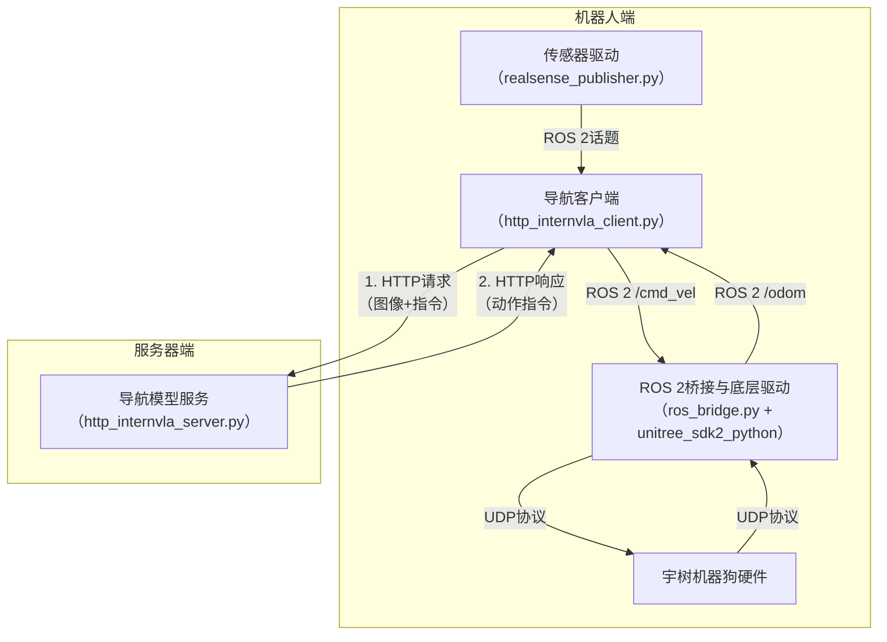

Unitree Go2只有Edu版本才支持二次开发，这里记录一下备忘操作，首先罪大恶极的就是只支持Ubuntu不支持Windows，迫使我把卸载了的VMWare重装回来。下载支持的[Ubuntu 22.04](https://pan.baidu.com/s/1xJaJ93XqMUGGDck6nRtDIw#list/path=%2Fsharelink3688237133-323219781516957%2FUbuntu&parentPath=%2Fsharelink3688237133-323219781516957)映像。

我们只需要**两台设备**：
1. **一台高性能的服务器电脑**（可以在本地，也可以在云端）：
  - 运行“中央厨房”程序 (`python3 scripts/realworld/http_internvla_server.py
  - `)，负责核心的AI导航计算。
  - 这里我们在华硕（ASUS）的 ExpertCenter Pro ET500I W8 工作站上运行服务端（它的4090竟然是49GB的！）
2. **机器人身上的算力设备**（如板载算力盒）：
  - 运行“后厨”程序 (`./start_robot.sh`)，负责感知和底层控制。
  - 运行“传菜员”程序 (`PYTHONPATH=/home/ubuntu1/InternNav:/home/ubuntu1/InternNav/src/diffusion-policy:$PYTHONPATH python http_internvla_server.py --model_path /home/ubuntu1/InternNav/checkpoints/InternVLA-N1 --port 8000`)，负责连接服务器并驱动任务循环。





### 机器人端 (Robot End / Edge)
部署在**机器狗身上**的那台计算机（板载算力盒或外接的NUC/Jetson）。它的职责是“感知”和“执行”。
*   **硬件**: 机器狗本体 + 算力设备 + 深度相机。
*   **核心软件**:
    1.  **底层驱动与控制**: 宇树官方提供 **`unitree_sdk2_python`**。它负责与机器狗的底层硬件（通过UDP协议，端口8899）通信，发送运动指令（如线速度、角速度），并读取机器狗的状态（如里程计、姿态）。
    2.  **ROS 2桥接**: `InternNav` 中的 `ros_bridge.py` 是一个关键的适配层。它订阅ROS 2的通用速度话题（`/cmd_vel_bridge`），并将其转换为宇树SDK能理解的UDP指令；同时，它也将宇树SDK获取的里程计信息转换为ROS 2的通用话题（`/odom_bridge`）发布出来。这样做的好处是，上层的导航算法可以完全不用关心底层是宇树还是其他机器人，只要会发ROS 2的`cmd_vel`就行。
    3.  **传感器驱动**: 即 `realsense_publisher.py`。它使用Intel的`pyrealsense2`库驱动深度相机，获取图像，并将其发布为ROS 2图像话题。
    4.  **导航客户端 (Nav Client)**: 这是最重要的一环。它就是InternNav在机器人端运行的 `http_internvla_client.py`。它的作用是：
        *   订阅机器人的ROS 2话题（图像、里程计）。
        *   将这些数据通过HTTP协议打包，发送给“服务器端”。
        *   接收服务器端返回的动作指令。
        *   将这个高级动作指令（如“向前移动0.5米”）转换成ROS 2的`/cmd_vel_bridge`速度指令，从而驱动底层。

### 服务器端 (Server End)
这是一台**独立的高性能计算机**（通常带有强大的GPU），可以与机器狗不在同一物理位置，但需要在同一局域网内。
*   **核心软件**: `http_internvla_server.py`。
*   **职责**: 它运行着**InternNav的核心模型**`InternVLA-N1`。这个模型是真正的“大脑”，它接收从机器人端发来的图像和指令，进行复杂的视觉语言导航（VLN）推理，然后计算出下一步该执行什么动作，并将这个动作通过HTTP响应返回给机器人端的客户端。

### 客户端 (Client) 
在InternNav的架构里，“客户端” **不是一个独立的硬件端，而是一个明确的软件角色**，它运行在“机器人端”。它的角色就是 **“数据中转与任务协调者”**：
*   它是ROS 2世界的“**消费者**”：从ROS 2话题获取数据。
*   它是HTTP世界的“**请求者**”：向服务器端的模型服务发起请求。
*   它也是ROS 2世界的“**生产者**”：将服务器返回的指令重新发布回ROS 2，让底层驱动去执行。

对了[3D打印](https://github.com/InternRobotics/InternNav/tree/main/assets/3d_printing_files)也不要忘了。

### Debug
第一次：onboard跑着跑着出现这样的Realsense camera问题:
```bash
unitree@ubuntu:~/InternNav-deploy/onboard$ ./start_robot.sh 
=========================================
   Launching OpenLegged Robot System
=========================================
   Target Interface: eth2
=========================================
[1/3] Starting Unitree Driver...
=== Starting Unitree Driver (10Hz Optimized) ===
[State] Monitoring Remote Controller...
[Robot] Robot control initialized.
[Network] UDP Listening on 8899
[System] Priority Mode: REMOTE > UDP SCRIPT
[2/3] Starting ROS Bridge...
1772949294.880327 [0]    python3: config: //CycloneDDS/Domain/General: 'NetworkInterfaceAddress': deprecated element (CYCLONEDDS_URI+0 line 1)
[3/3] Starting RealSense Publisher...
=========================================
   All Systems GO! Press Ctrl+C to stop.
=========================================
[INFO] [1772949295.459982318] [unitree_ros_bridge]: ROS Bridge Started.
[INFO] [1772949295.462598958] [unitree_ros_bridge]:  -> Forwarding /cmd_vel_bridge to UDP 127.0.0.1:8899
[INFO] [1772949295.463074469] [unitree_ros_bridge]:  -> Relaying /utlidar/robot_odom to /odom_bridge
1772949297.442179 [0]    python3: config: //CycloneDDS/Domain/General: 'NetworkInterfaceAddress': deprecated element (CYCLONEDDS_URI+0 line 1)
[INFO] [1772949297.775351720] [realsense_publisher]: RealSense publisher node initialized. Waiting for camera...
[INFO] [1772949297.776902955] [realsense_publisher]: Attempting to connect to RealSense camera...
[INFO] [1772949298.105170718] [realsense_publisher]: RealSense connected successfully: 640x480@30fps
[Control] Script active.
[Control] Stopping.
[Control] Script active.
[ERROR] [1772949811.880074060] [realsense_publisher]: Error during frame retrieval: Frame didn't arrive within 1000
[WARN] [1772949811.880754531] [realsense_publisher]: Resetting camera connection...
[WARN] [1772949812.903154212] [realsense_publisher]: RealSense disconnected/stopped.
[INFO] [1772949812.905497909] [realsense_publisher]: Attempting to connect to RealSense camera...
```
由于 Client 依赖 `/camera/camera/color/image_raw` 和 `/camera/camera/aligned_depth_to_color/image_raw`，相机停止发布后，`rgb_depth_down_callback` 不再被调用，`new_image_arrived` 一直为 False，`planning_thread` 持续等待，Clietn 就一直不执行罢工。

| 推测原因 | 说明 |
|------|------|
| **USB 供电/带宽** | 板载 USB 在长时间或高负载下不稳定，易掉线 |
| **相机过热** | D415/D435 连续运行易发热，触发保护或丢帧 |
| **USB 线材** | 线缆质量差、过长或接触不良 |
| **RealSense 固件** | 旧固件存在稳定性问题 |

第二次：nomachine无响应，无法进一步调试查看客户端原因。关机重启，nomachine依旧连不上，但是`ssh unitree@192.168.1.193`可以连上？


通过 `scp unitree@192.168.1.193:~/backup/InternNav/scripts/realworld/logs/internvla_client_*.log ./` 把 Client 的日志拉到本机来。
instruction 的话跑的时候没改比较诡异：`Cross the open area while avoiding the group of people. Go around the edge of the crowd instead of passing through the middle, and keep a safe distance from people.` 不过不影响 Server 与 Client 的通讯以及我们要排查的准命题。

因为 Client 的 `planning_thread()` **不是逐帧排队**，而是只看一个 `new_image_arrived` 布尔标志；`rgb_depth_down_callback()` 每来一对 RGB/Depth 就直接覆盖 `self.rgb_bytes`/`self.depth_bytes`；而 `requests.post(...)` 又是**阻塞式**等 Server 返回。这样只要推理一次比相机来帧慢，旧帧就会被新帧覆盖，表现出来很像“丢帧”，但本质上是**处理不过来导致跳帧**。与此同时，`ApproximateTimeSynchronizer([rgb, depth], 1, 0.1)` 的队列大小只有 1，也确实可能让真正的同步配对变差。

> `rgb_time` 用的是 `rgb_msg.header.stamp`，但 `odom_queue` 里存的是 `time.time()`，然后 planning 线程拿这两个去做**最近匹配**。也就是说，现在在用两个不同来源的时间戳去找“最近 odom”。如果相机 header 时间和主机 wall-clock 有偏移，或者驱动时间源不一致，这个最近匹配就会错，轻则延迟，重则朝向/轨迹对不上。

所以这里我在这 5 个位置打印同一套时间信息，把每一帧从相机进入，到 server 推理，再到 client 发布控制的全过程串起来：

| 位置 | event | 主要字段 | 说明 |
|------|-------|----------|------|
| `rgb_depth_down_callback()` | `rgb_depth_down_callback` | callback_count, rgb_ts_header, depth_ts_header, t_encode_start, t_encode_end | 代表 RGB 和深度已成功配对并进入 client 端；计数用于查看前端传感器是否稳定送入可用 RGB-D 帧；记录时间戳用于检查 RGB 与深度同步误差、统计 client 端图像编码耗时 |
| `odom_callback()` | `odom_callback` | odom_ts_header, odom_cnt | 代表里程计数据到达时刻；记录时间戳用于后续 planning 线程为当前图像匹配最近里程计，避免图像与里程计不同步导致控制错位 |
| `planning_thread()` 发请求前 | `planning_before_send` | frame_id, rgb_ts_header, depth_ts_header, odom_ts_used, t_http_send | client 端准备将对应帧送入推理的关键节点；frame_id 和 t_http_send 可区分实际被消费的帧，避免仅到达 callback 就被覆盖 |
| Server `/eval_dual` 收到及推理 | `server_recv`, `server_model_end` | frame_id, t_server_recv, t_model_start, t_model_end, action_type, action_value, pixel_goal, traj_len, server_recv_count | 分别对应请求到达服务端、模型推理完成；用于拆分服务端耗时，区分收包/解码阶段与模型推理阶段的延迟 |
| Client 收到 response 后、发布前 | `client_recv` | frame_id, t_client_recv, action_type, action_value, pixel_goal, traj_len, post_count | 代表当前帧的推理结果返回至 client 端 |
| Client 发布新控制目标 | `client_publish` | frame_id, action_type, traj_len, publish_count | 代表推理结果最终转换为控制输出；与 client_recv 结合可判断服务端返回结果后 client 是否正常下发控制 |

**统计目标：**
- `rgb_depth_down_callback` 被调用多少次
- `planning_thread` 真正发了多少次 `requests.post`
- Server `/eval_dual` 收到了多少次
- Client 实际发布了多少次新控制目标

**假设推断：**
- 如果 callback 次数本来就低或不稳，那更像**传感器/驱动侧掉帧**。
- 如果 callback 很高，但 POST 次数明显更低，那就是**处理慢导致跳帧**。
- 如果 POST 次数和 Server 收到次数差很多，那才更像**通信层丢包/阻塞**。
- 如果都差不多，但动作还是乱，那就更该怀疑**推理/标定/输入质量**。

接下来运行脚本分析：

```bash
python3 scripts/realworld/analyze_frame_logs.py [client_log] [server_log]
# 不传参数时，会使用 `logs/` 下最新的 client 和 server 日志。
```

最终 14:30 的结果如下：

```bash
【1. 基础计数】
  [Client] /home/ubuntu1/backup/InternNav/scripts/realworld/logs/internvla_client_20260308_143113.log
    rgb_depth_down_callback: 2163
    planning_thread POST:    243
    client 发布新控制目标:    243
  [Server] /home/ubuntu1/backup/InternNav/scripts/realworld/logs/internvla_server_20260308_143049.log
    /eval_dual 收到:         244

【2. 延迟拆账 (按 frame_id)】
  A. RTT (client 往返) = t_client_recv - t_http_send
     均值: 410.8 ms,  p95: 1513.8 ms,  最大: 1697.4 ms
  B. T_model (server 模型推理) = t_model_end - t_model_start
     均值: 384.5 ms,  p95: 1479.9 ms,  最大: 1543.2 ms
  C. T_server_pre (收包/解码/预处理) = t_model_start - t_server_recv
     均值: 13.4 ms,  p95: 17.0 ms,  最大: 213.4 ms
  D. T_other ≈ RTT - T_model (网络+编解码等)
     均值: 26.3 ms,  p95: 31.0 ms,  最大: 225.6 ms

【3. 同步误差】
  |rgb_ts_header - depth_ts_header| (s)
    均值: 7.8 ms,  p95: 34.5 ms,  最大: 99.4 ms
  |rgb_ts_header - odom_ts_used| (s)
    均值: 14.9 ms,  p95: 29.1 ms,  最大: 161.9 ms

【4. callback 间隔 (rgb_depth_down_callback)】
    均值: 57.0 ms,  p95: 66.9 ms,  最大: 457.7 ms

【5. 动作分布】
  trajectory 次数:     133
  discrete_action 次数: 111
  其中 [0] STOP:      74
  [2] 左转:           15,  [3] 右转: 22
  有 pixel_goal 比例: 23/133 = 17.3%
  traj_len 分布: 均值 1.634 m,  min 0.480,  max 2.642

【6. STOP 相关性分析】
  STOP 共 74 次
  STOP 前 RTT: 均值 431 ms,  p95 441 ms
  STOP 前 rgb-odom 差: 均值 14.5 ms
  STOP 时 pixel_goal 非空比例: 0/74
  -> STOP 在延迟正常时也出现，更像模型/输入/标定问题
```

| 分类 | 指标 | 计算公式/数值 | 含义解释 | 关键结论 |
| ---- | ---- | ---- | ---- | ---- |
| **核心时延指标** | RTT | `t_client_recv - t_http_send`<br>均值：410.8 ms | 一帧从 client 发出到收到结果的总往返时间，是完整推理闭环总耗时 | 直接决定控制频率上限，是整帧闭环总耗时 |
| | T_model | `t_model_end - t_model_start`<br>均值：384.5 ms | Server 端模型纯推理耗时，不含收包、前处理 | RTT 中大头是模型推理，而非 HTTP 网络 |
| | T_server_pre | `t_model_start - t_server_recv`<br>均值：13.4 ms | Server 收请求到启动模型前的耗时（收包、解码、数据转换） | Server 前处理非系统主要瓶颈 |
| | T_other | `≈ RTT - T_model`<br>均值：26.3 ms | 除模型推理外的剩余开销（网络、编解码、杂项） | HTTP 与编解码仅占小头，瓶颈在模型本身 |
| **同步误差指标** | RGB-D 时间差 | `\|rgb_ts_header - depth_ts_header\|`<br>均值：7.8 ms，p95：34.5 ms | 推理用彩色图与深度图的时间错位 | 同步误差存在但不大，非当前主矛盾 |
| | RGB-odom 时间差 | `\|rgb_ts_header - odom_ts_used\|`<br>均值：14.9 ms，p95：29.1 ms | 推理图像与控制用里程计的时间错位 | 图像与位姿无大规模错时，非核心问题 |
| **回调频率指标** | RGB-D callback 间隔 | 均值：57 ms，p95：66.9 ms，最大：457.7 ms | 相邻两次RGB-D配对回调的时间间隔 | 前端回调频率约17~18Hz，频率不低，瓶颈在后端消费能力 |
| **动作与轨迹指标** | 动作模式 | trajectory / discrete_action | trajectory：返回连续轨迹，走MPC<br>discrete_action：返回离散动作，走PID | 与客户端代码逻辑完全匹配，两种控制模式切换执行 |
| | STOP 动作 | [0] STOP = 74 次 | 模型主动输出的离散停止动作 | 系统非停不下来，反而频繁主动停机 |
| | 转向动作 | [2] 左转=15，[3] 右转=22 | 模型输出的离散纠偏动作 | 模型多以离散纠偏为主，稳定连续轨迹输出不足 |
| | pixel_goal 比例 | 23/133 = 17.3% | 带有效 grounded pixel 的轨迹占比 | 符合DualVLN理想逻辑的 grounded 目标输出极少，是模式异常的核心证据 |
| | traj_len 均值 | 1.634 m | 连续轨迹终点与当前位姿的距离 | 轨迹规划尺度不短，问题非轨迹过短，而是模式切换与grounded plan不稳定 |


理论上 **S2 是 VLM 做较慢但稳健的推理**，输出 pixel goal；**S1 是轻量扩散策略**，结合 S2 给的显式 pixel goal 和 latent 特征，实时生成平滑轨迹。但是目前感觉像是退化成**主要靠 S2 顶着跑**：
因为 **T_model ≈ 384.5 ms**，而 **T_other ≈ 26.3 ms**，总 RTT 大头基本就是模型本身。
所以“是不是 HTTP 让它慢成这样”这个问题，现在基本可以先放下；**主要慢在 S2/VLM 推理本身，不是通信**。

在 `internvla_n1_agent_realworld.py` 里，`step()` 的分支条件为：

```python
if (episode_idx - last_s2_idx > PLAN_STEP_GAP) or look_down or no_output_flag:
    # 走 S2
    output_action, output_latent, output_pixel = step_s2(...)
else:
    # 不重新跑 S2，走 S1 / 或者消费上次结果
```

也就是说，正常双系统运行时，应该是：
1. 某一帧跑一次 S2
2. S2 给出 `latent` + `pixel_goal`
3. 接下来的几帧不再跑 S2，而是用 `step_s1(...)` 根据这个 latent 和当前短时观察生成轨迹
4. 到了 `PLAN_STEP_GAP` 之后，再重新跑一次 S2

然而 real-world agent 里，`step_s2(...)` 有两种输出模式：

#### **情况 A：S2 输出了坐标数字**
代码会解析成像素点，然后：
`return None, traj_latents, pixel_goal`

这才是**真·双系统模式**：S2 给 latent/pixel，然后后续帧由 S1 接着跑。

#### **情况 B：S2 没输出坐标，而是输出动作词**
例如：`STOP`, `←`, `→`, `↓`。代码会：
`return action_seq, None, None`

这就意味着：
*   **没有 latent**
*   **没有 pixel_goal**
*   **后续就没法走 S1**

`no_output_flag = self.output_action is None and self.output_latent is None`
然后在 `else` 分支里：
*   如果 `self.output_action is not None`，就把这个 action 发出去，随后 `self.output_action = None`
*   如果 `self.output_latent is not None`，才走 `step_s1(...)`

这意味着：一旦 S2 输出的是离散动作（比如这次是 STOP）：
1.  **当前帧**：S2 输出 `[0]`
2.  **下一帧**：进入 `else` 分支，把 `[0]` 发出去，然后 `self.output_action = None`
3.  **再下一帧时**：`self.output_action is None` and `self.output_latent is None` -> `no_output_flag=True`
4.  **于是又重新触发 S2**

也就是说：**只要 S2 给的是 action 而不是 latent，系统就会在下一轮再次调用 S2，而不是进入一段由 S1 接管的“快执行窗口”。**

数据佐证：
*   `STOP` = 74 次
*   左右转 = 37 次
*   也就是离散动作里这三类就占了 **111 次** 里的绝大部分。
*   **pixel_goal 非空比例只有 17.3%**

这说明在相当多的时刻，**S2 没有给出可供 S1 使用的 pixel/latent，而是直接给了离散动作**。
于是就会出现这种体感：S2 在想：停一下、转一点、再看一下。S1 很少拿到稳定的 latent 连续执行。外在表现就是：**走走停停、转圈、动作很“想了再想”**。这跟论文里“System 2 低频规划 + System 1 高频平滑执行”的理想形态，就差得比较远了。

从当前链路看：
*   实际 POST 频率大概只有 **243 / 测试时长**。
*   单次 RTT 均值已经到 **410 ms**。
*   而 `PLAN_STEP_GAP=4`。

理论上，如果 S2 这次给了 latent，那么接下来几帧应该主要由 S1 跑，S2 不必每次都想。
但现实里，因为很多时候 S2 只给 `STOP`/左右转/`look_down`，没有 latent，所以 **S1 接不住，系统就一直被 S2 拉回去重算**。

*   STOP 前 RTT 正常，均值 **431 ms**。
*   STOP 前 rgb-odom 差也正常，均值 **14.5 ms**。
*   STOP 时 pixel_goal 非空比例 **0/74**。

这几乎就在说：这些 STOP 不是因为链路卡住了，而更像是 **S2 在当前输入下自己判断“该停”或“不知道去哪”**。
也就是：**不是通信先把它搞坏了，而是它在视觉/几何/语义层面没有稳定地产生 pixel plan，于是 S1 自然也接不上。**

现在不要只问“有没有 S1”，而要问“**为什么 S2 这么少给出能让 S1 接管的 latent/pixel plan**”。

### 走的更快
现场最直观的现象就是狗走得慢。即使把 desired_v 调高到比较激进的数值，实机速度还是明显低于预期。所以结合yq老师的提示，先把控制链路理顺。更具体地说，就是做两件事：第一，让 MPC 愿意跑得更快，也更接近我们在参数里设想的速度区间；第二，提供一个完全绕开 Server 的固定轨迹测试模式，用来回答一个非常基础但非常关键的问题：如果现在不给模型任何参与机会，只给机器人一条干净的 L 形轨迹，底盘到底能不能稳定跟上。

在当前的 http_internvla_client.py 里，控制链路其实分成两层。规划线程负责拿图像、深度和里程计去请求 Server；控制线程负责把“当前控制器算出来的速度”持续发给 /cmd_vel_bridge。当 Server 返回的是 trajectory 时，Client 会先把 body 系下的轨迹点变换到 world 系，再喂给 Mpc_controller。当 Server 返回的是 discrete_action 时，Client 不走 MPC，而是调用 incremental_change_goal() 更新一个增量目标，然后交给 PID 去追。也就是说，当前系统并不是“一个控制器包打天下”，而是轨迹类输出走 MPC，离散动作类输出走 PID。

desired_v 的名字看起来像“机器人就会按这个速度跑”，但在 controllers.py 里，它其实不是一个直接发给底盘的速度命令。Mpc_controller 初始化时保存了 desired_v，随后在 find_reference_traj() 里用它计算 desire_arc_length = self.desired_v * self.ref_gap * self.T，也就是说，它真正控制的是“从当前最近点往前取参考轨迹时，参考点之间沿轨迹间隔多远”。说得更直白一点，desired_v 决定的是 MPC 眼里“前方参考点应该铺得多快”，它是参考轨迹采样节奏的一部分，而不是电机的最终油门值。

真正发给机器人的是谁？是在 control_thread() 里，每次调用 mpc.solve(np.array(odom)) 之后，从优化结果 opt_u_controls 里取第一个控制量，也就是 opt_u_controls[0, 0] 和 opt_u_controls[0, 1]，分别作为当前时刻的线速度 v 和角速度 w。Client 随后再调用 manager.move(v, 0.0, w)，把它们作为 Twist 发布出去。

如果只看 `controllers.py`，`Mpc_controller` 用的是一个标准的差速/独轮车近似运动学模型：

[
x_{t+1} = x_t + v_t \cos\theta_t \cdot T
]

[
y_{t+1} = y_t + v_t \sin\theta_t \cdot T
]

[
\theta_{t+1} = \theta_t + w_t \cdot T
]

代码里预测时域长度是 `N=20`，步长 `T=0.1`，也就是一次优化大概往前看 2 秒。优化变量是未来 20 个时刻的 `(v, w)` 和对应状态 `(x, y, theta)`。约束条件：线速度被限制在 `0 <= v <= v_max`，角速度被限制在 `-w_max <= w <= w_max`。求解器用的是 CasADi + IPOPT。也就是说，MPC 并不是“告诉机器人必须按某个速度跑”，而是在这些边界之内，找到一组最划算的速度序列，让自己尽量贴着参考轨迹走。

代价函数同样很典型。它一边惩罚状态误差，一边惩罚控制量本身。状态误差权重是 `Q = diag([10.0, 10.0, 0.0])`，说明重点盯的是平面位置误差，而不是朝向误差；控制权重是 `R = diag([0.01, 0.2])`，其中对线速度 `v` 的惩罚被调小到了 `0.01`。
当 `R[0,0]` 较大时，优化器会觉得“多跑一点速度本身就很贵”，于是更倾向于慢慢走；当 `R[0,0]` 变小后，优化器更愿意用更高的线速度来换取更小的轨迹误差。

总体而言，我把 `Mpc_controller` 的创建参数改成了 `desired_v=1.2, v_max=1.5`，同时改参考点前瞻节奏和线速度上限。另一方面，我在 `controllers.py` 里把 `R[0,0]` 调小到了 `0.01`。
```bash
cd ~/backup/InternNav/scripts/realworld
python3 http_internvla_server.py
```

如果这次的目的不是联调整个 DualVLN，而是单独验证底盘对固定轨迹的跟踪能力，那么直接启用固定轨迹模式即可：

```bash
cd ~/backup/InternNav/scripts/realworld
INTERNVLA_FIXED_TRAJ_TEST=1 python3 http_internvla_client.py
```
在这个模式下，不需要启动 Server。机器人会直接跟踪那条 L 形轨迹，也就是“先直走 4 米，再左转 90 度，再继续向左走 2 米”的测试路线。


## 参考文章
- [安装虚拟机（VMware）保姆级教程（附安装包）](https://blog.csdn.net/weixin_74195551/article/details/127288338)
- [宇树机器狗 python 操控](https://zhuanlan.zhihu.com/p/708682160)
- [宇树机器狗go2开发记录](https://blog.csdn.net/u013006974/article/details/148463542)
- [Linux论坛宇树G1的开发体验](https://linux.do/t/topic/1298363/4?page=3)
- [go2 SDK 开发 快速开始](https://support.unitree.com/home/zh/developer/Quick_start)
- [机器狗具身智能导航初体验（附教程）-ailab的vln模型太牛了](https://www.bilibili.com/video/BV1AnmnBjEgA/?spm_id_from=333.1387.homepage.video_card.click&vd_source=2c8a191726cb019c16737188a8d0b3ac)
- [从仿真到真机：导航模型部署全流程｜冠军队伍经验分享](https://zhuanlan.zhihu.com/p/1969046543286907790)
- [在宇树 Go2 / Go2W / B2 上部署 InternNav：我的完整实战笔记](https://zhuanlan.zhihu.com/p/1981801239487456368)，其对应了一个[github仓库](https://github.com/cmjang/InternNav-deploy/blob/main/Readme_zh.md)

