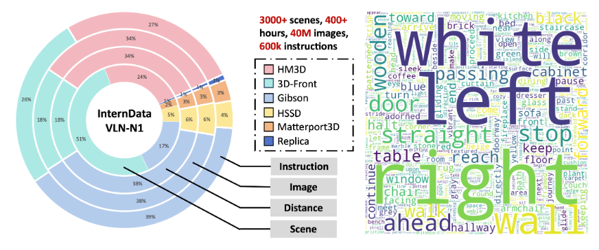
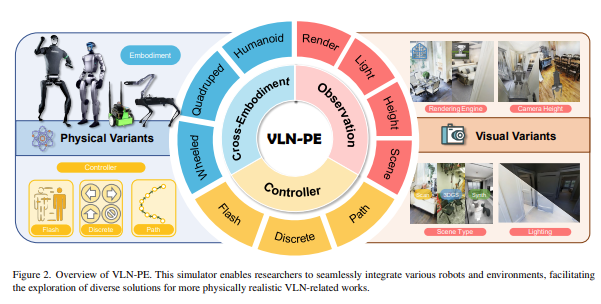
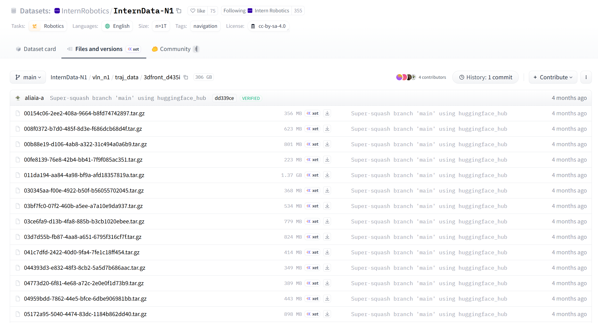
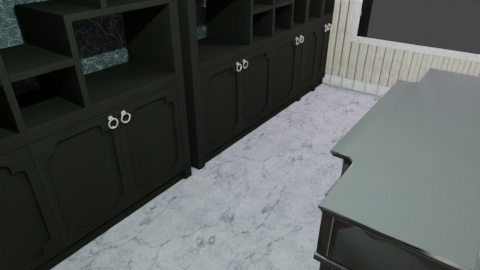
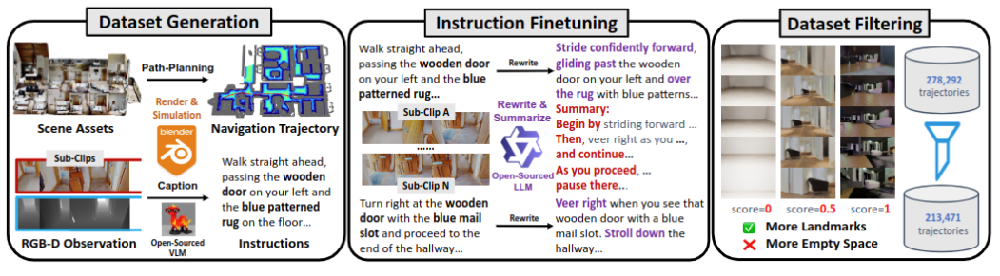

InternData-N1 不是单纯的3D 场景包，而是围绕场景资产生成的视觉语言导航轨迹数据集。它把 RGB/Depth/视频、机器人位姿或动作、任务指令、相机内外参和元数据统一包装为 LeRobot v2.1 风格的数据目录。

## InternData-N1 是什么
InternVLA-N1/DualVLN 的训练逻辑可以概括为 **“System 2 慢推理 + System 1 快执行”**。  
- System 2 使用 VLM 做指令理解和像素级/隐式中期目标预测；  
- System 1 使用目标条件扩散策略把这些目标转换为短时、连续、可执行的轨迹。  

因此 InternData-N1 中最关键的数据不是单张图片，而是 **“任务指令 - 历史/当前观测 - 目标/动作/轨迹 - 场景/相机/机器人状态”** 的成套 episode。

- **对 System 2**：需要包含语言指令、历史/当前 RGB 观测，以及可学习的像素目标或停止判断监督。  
- **对 System 1**：需要包含 RGB/Depth/目标条件、机器人状态或相机位姿，以及连续轨迹/动作监督。  
- **对 InternNav**：数据被组织成统一 LeRobot 风格后，训练、评测和可视化模块才能复用同一套读取逻辑。

| 项目 | 说明 |
|------|------|
| 定位 | 大规模统一 VLN 数据集，服务于 InternNav 训练与评测；官方数据页将其描述为整合多基准的 standardized navigation dataset。 |
| 规模 | 数据页写有 240K+ trajectories、3,000+ scenes；InternVLA-N1 项目页进一步强调 50M+ egocentric images、4,839 km navigation experience。 |
| 核心格式 | LeRobot v2.1 风格：`data/parquet` + `videos/images` + `meta/jsonl/json`。InternNav 文档明确说每个 episode 既有 parquet 结构化数据，也有 mp4/图片用于可视化。 |
| 三个主组成 | `vln_ce`、`vln_pe`、`vln_n1`：分别对应连续环境导航、物理真实导航平台、InternVLA-N1 合成训练数据。 |

### 整体目录


| 目录 | 含义 | 主要内容 / 用途 |
|------|------|----------------|
| `vln_ce` | VLN-CE / Habitat 风格连续环境导航 | `raw_data` + `traj_data`；包含 R2R、RxR 等任务来源。适合在 Habitat 中训练/评测指令导航。 |
| `vln_pe` | VLN-PE / 物理真实导航平台 | `raw_data` + `traj_data`；面向带物理控制误差、机器人本体差异、Isaac/InternUtopia 等物理仿真的 VLN。 |
| `vln_n1` | InternVLA-N1 合成训练数据 | 只有 `traj_data`；按 scene dataset 和 camera/embodiment 命名，例如 `3dfront_zed`、`hm3d_d435i`、`matterport3d_zed`。包含 `images`、`videos`、`pointcloud.ply` 等。 |

其中：
- `scene_data` ≈ 场景资产 / 仿真资产（如 MatterPort3D 的几个）
- `raw_data` ≈ 原始任务定义，比如 R2R/RxR 的 instruction、start/goal、split
- `traj_data` ≈ 已经跑出来的训练样本：RGB/depth/pose/action/trajectory/task metadata

#### VLN-CE
VLN-CE 就是 Continuous Environment，本质上是 Facebook 把早期离散图导航的 R2R/RxR 放进连续空间里跑。
使用 Habitat 平台，支持 R2R 和 RxR；场景用 Matterport3D 的重建，提取形式是 `data/scene_datasets/mp3d/{scene}/{scene}.glb`。
```
VLN-CE
├── 场景：Matterport3D / Habitat-compatible glb + navmesh
├── 仿真：Habitat-Sim / Habitat-Lab
├── 任务：R2R / RxR instruction-path pairs
└── 轨迹：在 Habitat 里采出来的 RGB/depth/pose/action 数据
```

> Habitat 里的 MP3D 常见问题是 mesh 洞、碰撞体粗糙、光照静态、材质/反射不真实、机器人动力学近似，更像带真实贴图的视觉导航模拟”，不是物理级机器人仿真器。

#### [VLN-PE](https://arxiv.org/abs/2507.13019)
不得不提大名鼎鼎冉冉升起的一颗新星，AILAB 从 NVIDIA 的 Isaac 所改编而来的 InternUtopia。

PE 是 Physically Embodied，也即一个 physically realistic VLN platform，支持 humanoid、quadruped、wheeled robots，并指出现有 VLN 的理想化运动/控制假设无法反映真实具身部署。
```
VLN-PE
├── 场景：改造后的 MP3D / interiornav / 其他可进物理仿真的资产
├── 仿真：InternUtopia / Isaac Sim
├── 机器人：轮式、四足、人形等 embodiment
├── 任务：R2R 风格 instruction-path
└── 轨迹：物理机器人控制器实际跑出来/渲染出来的数据
```

#### VLN-N1
是他们大规模合成的数据，所谓`660K+ instructions / 210K+ videos / Synthetic Data for InternVLA-N1`。



这里我们可以看到，合成数据没有 `raw_data`，只有`traj_data`，每一个文件夹对应着的应该是一个场景，其中有很多打包成`tar.gz`的符合Lerobot 2.1格式的数据。它规定的是：
- 一段轨迹 episode 怎么切；
- 每一帧有哪些 observation/action/state/task；
- 图像/视频放哪；
- 低维状态和动作放哪；
- metadata 怎么描述这些东西。

一个典型 v2.1 episode-based 数据集：
```
some_dataset/
├── meta/
│   ├── info.json
│   ├── tasks.jsonl
│   ├── episodes.jsonl
│   └── episodes_stats.jsonl
├── data/
│   └── chunk-000/
│       ├── episode_000000.parquet
│       ├── episode_000001.parquet
│       └── ...
└── videos/
    └── chunk-000/
        ├── observation.images.rgb/
        │   ├── episode_000000.mp4
        │   ├── episode_000001.mp4
        │   └── ...
        └── observation.images.depth/
            ├── episode_000000.mp4
            ├── episode_000001.mp4
            └── ...
```

> 一个 episode 一个 parquet + 一组 episode 对应的视频/图片 + meta 描述所有 schema

## 具体实例
### VLN-N1
以00fe8139-76e8-42b4-bb41-7f9f085ac351为例，这个数据集的根目录下包含 **3 个主文件夹** + **5 个元数据文件**，共组织 2112 帧数据：

```
dataset/
├── meta/                                    # 元数据文件夹 (5个文件)
│   ├── info.json                           # 数据集全局配置 (39行)
│   ├── tasks.jsonl                         # 36条任务描述 (36行JSONL)
│   ├── episodes.jsonl                      # 18个episode定义 (18行JSONL)
│   ├── episodes_stats.jsonl                # 逐episode统计信息 (18行JSONL)
│   └── pointcloud.ply                      # 点云场景数据 (3.0MB)
│
├── data/                                    # 低维数据文件夹
│   └── chunk-000/                          # 第0个数据分块
│       ├── episode_000000.parquet          # 8,982 bytes, 97帧
│       ├── episode_000001.parquet          # 8,085 bytes, 80帧
│       ├── episode_000002.parquet          # 9,121 bytes, 100帧
│       ├── episode_000003.parquet          # 10,093 bytes, 129帧
│       ├── episode_000004.parquet          # 10,437 bytes, 126帧
│       ├── episode_000005.parquet          # 10,677 bytes, 128帧
│       ├── episode_000006.parquet          # 9,837 bytes, 124帧
│       ├── episode_000007.parquet          # 10,343 bytes, 124帧
│       ├── episode_000008.parquet          # 10,343 bytes, 124帧
│       ├── episode_000009.parquet          # 7,947 bytes, 77帧
│       ├── episode_000010.parquet          # 9,744 bytes, 122帧
│       ├── episode_000011.parquet          # 10,100 bytes, 120帧
│       ├── episode_000012.parquet          # 9,839 bytes, 124帧
│       ├── episode_000013.parquet          # 10,768 bytes, 144帧
│       ├── episode_000014.parquet          # 10,751 bytes, 129帧
│       ├── episode_000015.parquet          # 9,833 bytes, 124帧
│       ├── episode_000016.parquet          # 10,471 bytes, 104帧
│       └── episode_000017.parquet          # 11,301 bytes, 136帧
│
└── videos/                                  # 视觉数据文件夹
    └── chunk-000/                          # 第0个视频分块
        ├── observation.images.depth/       # 深度图 - PNG逐帧格式
        │   ├── episode_000000_000.png      # 第0episode第0帧
        │   ├── episode_000000_001.png      # 第0episode第1帧
        │   ├── ...                         # 共2112张PNG (命名格式: episode_XXXXXX_XXX.png)
        │   └── episode_000017_135.png      # 最后一张深度图
        │
        ├── observation.images.rgb/         # RGB图 - JPG逐帧格式
        │   ├── episode_000000_000.jpg      # 第0episode第0帧
        │   ├── episode_000000_001.jpg      # 第0episode第1帧
        │   ├── ...                         # 共2112张JPG
        │   └── episode_000017_135.jpg
        │
        ├── observation.video.depth/        # 深度视频 - MP4格式
        │   ├── episode_000000.mp4          # 97帧深度视频
        │   ├── episode_000001.mp4          # 80帧深度视频
        │   ├── ...                         # 共18个MP4文件
        │   └── episode_000017.mp4          # 136帧深度视频
        │
        └── observation.video.rgb/          # RGB视频 - MP4格式
            ├── episode_000000.mp4          # 97帧RGB视频
            ├── episode_000001.mp4          # 80帧RGB视频
            ├── ...                         # 共18个MP4文件
            └── episode_000017.mp4          # 136帧RGB视频
```

#### meta/info.json - 数据集总配置

这是最重要的元数据文件，定义了整个数据集的全局属性：

```json
{
  "codebase_version": "v2.1",
  "robot_type": "unknown",
  "total_episodes": 18,
  "total_frames": 2112,
  "total_tasks": 36,
  "total_videos": 18,
  "total_chunks": 1,
  "chunks_size": 1000,
  "fps": 30,
  "splits": {
    "train": "0:1"
  },
  "data_path": "data/chunk-{episode_chunk:03d}/episode_{episode_index:06d}.parquet",
  "video_path": "videos/chunk-{episode_chunk:03d}/{video_key}/episode_{episode_index:06d}.mp4",
  "features": {
    "observation.camera_intrinsic": {
      "dtype": "float32",
      "shape": [3, 3]
    },
    "observation.camera_extrinsic": {
      "dtype": "float32",
      "shape": [4, 4]
    },
    "action": {
      "dtype": "float32",
      "shape": [4, 4]
    }
  }
}
```


| 字段 | 值 | 含义 |
|------|-----|------|
| `codebase_version` | "v2.1" | LeRobot格式版本 |
| `robot_type` | "unknown" | 机器人类型（本数据集是模拟VLN环境，故为unknown）|
| `total_episodes` | 18 | 总共18条轨迹 |
| `total_frames` | 2112 | 总共2112帧 |
| `total_tasks` | 36 | 36个任务定义（每个episode对应2个task：sub+sum）|
| `chunks_size` | 1000 | 每个chunk最多1000个episodes |
| `fps` | 30 | 采集帧率30fps |
| `data_path` | 模板字符串 | parquet文件路径模板，支持格式化插入 |
| `video_path` | 模板字符串 | 视频文件路径模板 |
| `features` | 字典 | **核心**：定义了parquet中存储的所有字段及其数据类型 |

#### Features 详解

本数据集的 `features` 只包含3个字段（注意：视觉数据不在这里定义，因为它们存在视频/图像文件夹中）：

1. **`observation.camera_intrinsic`** - 相机内参矩阵
   - dtype: float32
   - shape: [3, 3] (标准的相机内参矩阵 K)
   - 实际值示例: `[355.81464, 0, 240, 0, 351.687, 135, 0, 0, 1]`

2. **`observation.camera_extrinsic`** - 相机外参矩阵（相机位姿）
   - dtype: float32
   - shape: [4, 4] (齐次变换矩阵 T_world_cam)
   - 实际值示例: `[1, 0, 0, 0, 0, 0.22, -0.975, 0, -0, 0.975, 0.22, 0.738, 0, 0, 0, 1]`

3. **`action`** - 动作（4x4变换矩阵表示的相机运动）
   - dtype: float32
   - shape: [4, 4] (每个动作是一个4x4变换矩阵)
   - 注意：这是一个**VLN数据集**的特殊设计，用SE(3)矩阵表示相机的目标位姿

#### meta/tasks.jsonl - 任务定义

36 行 JSON Lines，每行定义一个任务。本数据集采用双层级任务结构：

```jsonl
{"task_index": 0, "task": {"sub_instruction": "Walk straight ahead, passing the black cabinet on your left...", "sub_indexes": [0, 96], "revised_sub_instruction": "Stroll forward, keeping that sleek black cabinet to your left..."}}
{"task_index": 1, "task": {"sum_instruction": "Stroll forward, keeping that sleek black cabinet to your left...", "sum_indexes": [0, 96]}}
{"task_index": 2, "task": {"sub_instruction": "Walk straight ahead towards the black cabinet with white handles...", "sub_indexes": [0, 79], "revised_sub_instruction": "Let your path unfurl straight ahead..."}}
...
```

#### 任务结构特点

每条任务包含两种类型：

| 类型 | 字段名 | 用途 |
|------|--------|------|
| **子指令** (sub_instruction) | 详细的逐步导航指令 | 用于细粒度监督 |
| **摘要指令** (sum_instruction) | 概括性的整体目标描述 | 用于高层语义理解 |

每个任务还包含：
- `sub_indexes` / `sum_indexes`: `[start_frame, end_frame]` 指示该任务适用的帧范围
- `revised_sub_instruction`: 经过语言增强/改写后的指令（数据增强）

**示例任务对：**
- Task 0 (sub): `"Walk straight ahead, passing the black cabinet on your left and the white potted plant on your right, until you reach the brick wall with the window. Stop at the window."`
- Task 1 (sum): `"Stroll forward, keeping that sleek black cabinet to your left and the charming white potted plant to your right. Continue onward until you find yourself before the brick wall adorned with a window. Pause there, gazing out."`

#### meta/episodes.jsonl - Episode定义

18 行 JSON Lines，每行描述一个episode（轨迹）：

```jsonl
{"episode_index": 0, "tasks": [{"sub_instruction": "...", "sub_indexes": [0, 96], "revised_sub_instruction": "..."}, {"sum_instruction": "...", "sum_indexes": [0, 96]}]}
{"episode_index": 1, "tasks": [{"sub_instruction": "...", "sub_indexes": [0, 79], "revised_sub_instruction": "..."}, {"sum_instruction": "...", "sum_indexes": [0, 79]}]}
...
```
- `episodes.jsonl` 是**任务实例化**：每个episode将tasks中的指令复制过来，形成该episode的具体任务上下文
- 本数据集中每个episode引用2个task（一个sub、一个sum）
- `sub_indexes` / `sum_indexes` 指示该任务在episode内的有效帧范围

**Episode 0 示例：**
- 帧数: 97帧 (对应 `sub_indexes: [0, 96]`)
- 子任务: 从黑柜子旁走过，经过白色盆栽，到达砖墙窗户
- 总任务: 同上，但语言更文学化

#### meta/episodes_stats.jsonl - Episode统计

18 行 JSON Lines，存储每个episode的统计信息，用于数据加载时的快速索引：

```jsonl
{"episode_index": 0, "task_index": {"min": 0, "max": 1, "count": 2}, "image_index": {"min": 0, "max": 96, "count": 97}}
{"episode_index": 1, "task_index": {"min": 2, "max": 3, "count": 2}, "image_index": {"min": 97, "max": 176, "count": 80}}
...
```

| 字段 | 含义 |
|------|------|
| `episode_index` | Episode序号 (0-17) |
| `task_index.min/max/count` | 该episode使用的task索引范围和数量 |
| `image_index.min/max/count` | 该episode对应的全局图像索引范围和帧数 |

**注意 `image_index` 的全局连续性：**
- Episode 0: image_index [0, 96] → 97帧
- Episode 1: image_index [97, 176] → 80帧（注意97是连续的）
- Episode 2: image_index [177, 276] → 100帧
- ...以此类推，所有2112帧图像在全局上是连续编号的

#### data/chunk-000/episode_*.parquet - 逐帧数据
18 个 Parquet 文件，每个文件是一个表格，存储该episode的逐帧低维数据。
Parquet 没那么好读，这里用 Python 打开：
```python
import pandas as pd
df = pd.read_parquet('data/chunk-000/episode_000000.parquet')
print(df.shape)        # (97, 4) - 97帧，4列
print(df.columns)      # ['index', 'observation.camera_intrinsic', 'observation.camera_extrinsic', 'action']
```

| 列名 | 数据类型 | Shape | 说明 |
|------|----------|-------|------|
| `index` | int64 | scalar | 帧在episode内的索引 (0, 1, 2, ...) |
| `observation.camera_intrinsic` | float32 | [3, 3] | 相机内参矩阵（通常固定不变）|
| `observation.camera_extrinsic` | float32 | [4, 4] | 相机在world坐标系下的位姿（齐次矩阵）|
| `action` | float32 | [4, 4] | 下一时刻的目标相机位姿（SE(3)动作表示）|

**Frame 0:**
```python
index: 0
observation.camera_intrinsic: [[355.81464,   0.     , 240.     ],
                               [  0.     , 351.687  , 135.     ],
                               [  0.     ,   0.     ,   1.     ]]
observation.camera_extrinsic: [[ 1.    ,  0.    ,  0.    , -0.    ],
                               [ 0.    ,  0.221 , -0.975 ,  0.    ],
                               [-0.    ,  0.975 ,  0.221 ,  0.738 ],
                               [ 0.    ,  0.    ,  0.    ,  1.    ]]
action: [[ 0.432 , -0.199 ,  0.879 , -3.602 ],
         [ 0.902 ,  0.095 , -0.422 ,  2.020 ],
         [-0.    ,  0.975 ,  0.221 ,  0.738 ],
         [ 0.    ,  0.    ,  0.    ,  1.    ]]
```
各Episode帧数统计下来是：
| Episode | 帧数 | Episode | 帧数 | Episode | 帧数 |
|---------|------|---------|------|---------|------|
| 0 | 97 | 6 | 124 | 12 | 124 |
| 1 | 80 | 7 | 124 | 13 | 144 |
| 2 | 100 | 8 | 124 | 14 | 129 |
| 3 | 129 | 9 | 77 | 15 | 124 |
| 4 | 126 | 10 | 122 | 16 | 104 |
| 5 | 128 | 11 | 120 | 17 | 136 |

#### videos/ - 视觉数据
视觉数据采用**双格式存储策略**：
##### 逐帧图像格式 (observation.images.*)

- **`observation.images.depth/`**: 2112张 PNG 深度图
  - 命名: `episode_XXXXXX_XXX.png` (episode索引_帧索引)
  - 示例: `episode_000000_000.png`, `episode_000000_096.png`, `episode_000001_000.png`

- **`observation.images.rgb/`**: 2112张 JPG RGB图
  - 命名: `episode_XXXXXX_XXX.jpg`
  - 与深度图一一对应

**用途：** 方便随机访问任意帧，无需解码视频

##### 视频格式 (observation.video.*)

- **`observation.video.depth/`**: 18个 MP4 深度视频
  - 命名: `episode_XXXXXX.mp4`
  - 每个视频对应一个episode的全部深度帧

- **`observation.video.rgb/`**: 18个 MP4 RGB视频
  - 命名: `episode_XXXXXX.mp4`
  - 每个视频对应一个episode的全部RGB帧

**用途：** 节省存储空间，适合顺序读取

对于 Episode 0 (97帧):

```
Parquet:      data/chunk-000/episode_000000.parquet (97行数据)
                 ↓
PNG Images:   videos/chunk-000/observation.images.rgb/episode_000000_000.jpg
                                         ...
                                     episode_000000_096.jpg (共97张)
                 ↓
MP4 Video:    videos/chunk-000/observation.video.rgb/episode_000000.mp4 (97帧视频)
```
#### 完整数据流示例

以 Episode 0, Frame 42 为例，展示所有数据如何对齐：

```python
# 1. 从 episodes.jsonl 获取 episode 信息
episode_index = 0
episode_info = {
    "tasks": [
        {"sub_instruction": "Walk straight ahead...", "sub_indexes": [0, 96]},
        {"sum_instruction": "Stroll forward...", "sum_indexes": [0, 96]}
    ]
}

# 2. 从 episodes_stats.jsonl 获取全局索引
stats = {"image_index": {"min": 0, "max": 96, "count": 97}}
global_frame_idx = stats["image_index"]["min"] + 42  # = 42

# 3. 从 parquet 读取低维数据
parquet_df = pd.read_parquet('data/chunk-000/episode_000000.parquet')
row = parquet_df.iloc[42]
# row.index = 42
# row.observation.camera_intrinsic = 3x3矩阵
# row.observation.camera_extrinsic = 4x4矩阵 (当前相机位姿)
# row.action = 4x4矩阵 (下一时刻目标位姿)

# 4. 从 images 文件夹读取对应图像
rgb_image = Image.open(f'videos/chunk-000/observation.images.rgb/episode_000000_042.jpg')
depth_image = Image.open(f'videos/chunk-000/observation.images.depth/episode_000000_042.png')

# 5. 或者从 video 文件解码第42帧
rgb_video = cv2.VideoCapture('videos/chunk-000/observation.video.rgb/episode_000000.mp4')
rgb_video.set(cv2.CAP_PROP_POS_FRAMES, 42)
_, rgb_frame = rgb_video.read()
```
#### Action 的 SE(3) 表示

本数据集的 `action` 是一个 4×4 齐次变换矩阵：

```
action = [ R(3×3)  t(3×1) ]
         [  0(1×3)   1    ]
```

其中：
- `R`: 旋转矩阵 (SO(3))，表示目标朝向
- `t`: 平移向量，表示目标位置

这种表示允许网络学习在3D空间中的相机运动（前进、旋转、平移等）。

### VLN-CE
前面提到，AILAB 它们将所有格式都对齐到了 Lerobot 2.1，所以他俩的 `traj_data` 理论上都是一样的格式。

以 VLN-CE 中的`YmJkqBEsHnH`为例：

| 方面 | 一致 |
| --- | --- |
| 目录结构 | `meta/ + data/ + videos/` |
| 元数据文件 | `info.json`, `tasks.jsonl`, `episodes.jsonl`, `episodes_stats.jsonl` |
| parquet 组织 | `data/chunk-000/episode_XXXXXX.parquet` |
| 版本号 | `"codebase_version": "v2.1"` |

但是受限于 Habitat 仿真器的局限，在下面的具体内容还是不一样：

| 差异点 | VLN-N1 | VLN-CE (YmJkqBEsHnH) |
| --- | --- | --- |
| Episodes | 18 个 | 9 个 |
| 总帧数 | 2112 帧 | 390 帧 |
| 相机数量 | 1 个相机 | 5 个相机配置 |
| 视频文件夹 | `observation.images.rgb`, `observation.images.depth` | `observation.images.rgb.125cm_0deg`, `.125cm_30deg`, `.125cm_45deg`, `.60cm_15deg`, `.60cm_30deg` (5种高度角度组合) |
| Parquet 列数 | 4 列 | 21 列 |
| Action 类型 | SE(3) 矩阵 [4,4] 表示相机位姿 | int32 [1] 离散动作索引 |
| Pose 存储 | `observation.camera_extrinsic` | `pose.125cm_0deg`, `pose.125cm_30deg`... (每个相机一个) |
| Tasks 结构 | 复杂对象（sub_instruction + sum_instruction + revised） | 简单字符串 |
| 视频文件 | 同时有 images + video 双格式 | 只有 images，没有 mp4 (total_videos: 0) |

前面提到，features 很关键，这里他俩也不一样：

**当前数据集（3 个 features）：**

```json
{
  "observation.camera_intrinsic": {"dtype": "float32", "shape": [3, 3]},
  "observation.camera_extrinsic": {"dtype": "float32", "shape": [4, 4]},
  "action": {"dtype": "float32", "shape": [4, 4]}
}
```

**VLN-CE（17 个 features）：**

```json
{
  "action": {"dtype": "int32", "shape": [1]},
  "pose.125cm_0deg": {"dtype": "float32", "shape": [4, 4]},
  "goal.125cm_0deg": {"dtype": "int32", "shape": [2]},
  "relative_goal_frame_id.125cm_0deg": {"dtype": "int32", "shape": [1]},
  "pose.125cm_30deg": {},
  "pose.125cm_45deg": {},
  "pose.60cm_15deg": {},
  "pose.60cm_30deg": {},
  "timestamp": {"dtype": "float32", "shape": [1]},
  "frame_index": {"dtype": "int64", "shape": [1]},
  "episode_index": {"dtype": "int64", "shape": [1]},
  "index": {"dtype": "int64", "shape": [1]},
  "task_index": {"dtype": "int64", "shape": [1]}
}
```

但是对于 `raw_data` 来说：
| 维度 | raw_data/ | traj_data/ |
| --- | --- | --- |
| 内容 | 任务定义（起点、终点、指令） | 专家轨迹（逐帧图像+动作） |
| 格式 | 单个 train.json (10819条) | 按场景分文件夹的 LeRobot v2.1 |
| 大小 | 31MB (纯文本) | 每个场景数GB（含图像/视频） |
| 用途 | 评估/测试、定义任务 | 训练、模仿学习 |
| 示例数 | 10819 episodes | 单个场景仅9 episodes |

VLN 评估的核心指标：
- **SR (Success Rate)**：是否到达目标区域（距离 < 3m）
- **SPL (Success weighted by Path Length)**：成功率 ÷ 路径长度比
- **nDTW/CLS**：路径相似度
这些只需要知道：
- 起点位置 (start_position)
- 目标位置 (goals)
- 智能体实际走过的路径
- **不需要** 每一帧的RGB/Depth图像
因此纯评估/在线学习时只需要 raw_data。

### VLN-PE
我记得 VLN-PE Benchmark 是只用来评估 VN（System1）任务的，因此其虽然也是 Lerobot 2.1 的格式但是和上面俩非常不同：
1. 视频用 .npy 存储（而非图像/视频）
```
videos/chunk-000/observation.images.rgb/
├── episode_000000.npy   # 不是 .jpg!
├── episode_000001.npy
└── ...
```
1. Parquet Schema
```json
['observation.camera_position',      # 相机位置 [x,y,z]
'observation.camera_orientation',   # 相机朝向 [quaternion]
'observation.camera_yaw',           # 相机偏航角
'observation.robot_position',       # 机器人位置
'observation.robot_orientation',    # 机器人朝向
'observation.robot_yaw',            # 机器人偏航角
'observation.progress',             # 任务进度 0-1
'observation.step',                 # 当前步数
'observation.action',               # 上一动作（不是要执行的动作！）
'timestamp', 'frame_index', 'episode_index', 'index', 'task_index']
```
关键区别：
- 有 robot_position 和 camera_position 分离（机器人本体 vs 相机视角）
- progress 字段：任务完成百分比
- observation.action（注意命名空间）：记录的是上一个执行的动作，而非目标动作
- 没有明确的 action 列来预测！

3. Tasks 结构含失败标记
```json
{
 "task_index": 10,
 "task": "Go straight and stop before the staircase.",
 "instruction_tokens": [...],
 "finish_status": "fail",           // ← 有完成状态！
 "fail_reason": "goal_in_obstacle"  // ← 失败原因
}
```
常见的 finish_status / fail_reason：
- "success" / "success" - 成功
- "fail" / "goal_in_obstacle" - 目标在障碍物中
- "fail" / "fall" - 机器人跌落

4. Features 定义更完整
```json
{
 "observation.camera_intrinsic": {
   "dtype": "float32", "shape": [3, 3],
   "names": ["intrinsic_0_0", "intrinsic_0_1", ...]  // 每个元素有名字
 },
 "action": {
   "dtype": "float32", "shape": [4, 4],
   "names": ["action_0_0", "action_0_1", ...]  // 矩阵每个位置命名
 },
 "timestamp": {"dtype": "float32", "shape": [1], "names": null},
 ...
}
```
## 数据生成
### VLN-CE
这部分比较传统。论文说它来源于 VLN-CE、EnvDrop、ScaleVLN 等 benchmark；用 Habitat 渲染 Matterport3D 和 HM3D 场景；然后 replay episodes，用 Habitat 内置的 ShortestPathFollower 沿 predefined reference paths 生成轨迹。动作空间是 Habitat 默认 VLN 配置：
```
MOVE_FORWARD: 0.25m
TURN_LEFT: 15°
TURN_RIGHT: 15°
STOP
```
每个 episode 记录 RGB observation 和 action sequence；论文说他们收了 332,179 episodes，覆盖 856 个 Matterport3D/HM3D scenes。之后为了训练 System 2，又把 raw trajectories 切成 clips，并把 agent position 投影到 2D image plane 作为 pixel goal label。
```
R2R/RxR/EnvDrop/ScaleVLN-style instruction-path
→ Habitat scene render
→ ShortestPathFollower replay
→ RGB + action sequence
→ segment clips
→ project future waypoint to pixel goal
```
### VLN-PE
这个主要是 InternUtopia physical simulation platform 这个仿真我不太了解，它是为了 bridge sim-to-real gap，显式把 robot embodiment 和 locomotion policy 纳入采集。机器人包括 Unitree AlienGo、Unitree H1/G1、Jetbot 等，使用现有 learning-based locomotion controllers。语言指令和路径主要来自 R2R，但做了修改，比如去掉上/下楼梯，因为当前 locomotion policy 不能稳定处理。
```
R2R instruction/path
→ remove stair cases etc.
→ InternUtopia / physical simulation
→ robot embodiment: quadruped / humanoid / wheeled
→ locomotion controller follows path
→ egocentric observation
```
### VLN-N1

主要是对 VLN-N1 这条 VLN-N1 synthetic data generation pipeline 的探讨，对应原始技术报告的第 3.1 节。
> 或许可以参考这个[博客](https://axi404.top/blog/lerobot)，不过因为没开源我也不知道是什么样的。

具体而言这个 Pipeline 类似：
```
3D 场景资产 → 构建可导航几何表示 → 采样起点和终点 → 路径规划 → 轨迹优化和平滑 → 渲染 RGB-D 观测 → 自动生成语言指令 → 过滤低质量样本 → 封装成 LeRobot / InternData 轨迹数据
```

#### Scene Assets
场景资产就是机器人要“走进去”的三维环境。这些场景通常包含：
- 几何结构：墙、地板、门、桌子、柜子等物体的 3D 形状
- 纹理材质：墙面颜色、地板纹理、家具外观
- 相机可渲染信息：从某个位置看过去能生成 RGB 图像
- 空间尺度：场景里 1 个单位对应现实中多少米
VLN-N1 使用的是大规模开源 3D 场景资产，例如 Replica、Matterport3D、Gibson、3D-Front、HSSD、HM3D 等。这些数据源的共同特点是：它们不仅能提供视觉外观，还能提供一定程度的几何结构。
> 话说回来 3DGS 怎么生成 navmesh？
#### Mesh
场景的三角面片模型。比如一张桌子、一个墙面、一段地板，在 3D 里都可以由很多三角形拼出来。它可以告诉我们哪里是地板？ 哪里是墙？ 哪里是障碍物？ 机器人身体会不会和场景发生碰撞？ 两个位置之间是否连通？

VLN-N1 先把场景按楼层（floor）拆开，再根据这一层的几何结构，生成一个适合路径规划的数据结构（ESDF）。

ESDF，全称是 Euclidean Signed Distance Field，欧氏符号距离场，一张“离障碍物有多远”的地图。假设我们把一层楼的地面切成很多小格子。每个格子都存一个数字：​这个位置离最近的墙、家具、障碍物还有多远？
例如：​
```
离障碍物 1.5 米：比较安全
离障碍物 0.2 米：很贴边，容易撞
离障碍物 0 米：就在障碍物边界
负数：已经在障碍物内部
```
所以，普通占据地图只告诉我们这里能不能走，而 ESDF 进一步告诉我们 **这里不仅能走，而且离障碍物有多远**。

这对轨迹优化很重要。因为我们不只是想找一条能走的路径，还想找一条更安全、更平滑、更不像贴墙走的路径。​
可以类比成：​
- A* 先找出一条大概能走的路线；
- ESDF 再告诉优化器：这段太贴墙了，往中间挪一点；那里离障碍物太近，避开一点。
所以 ESDF 在 VLN-N1 里的作用，不只是碰撞检测，而是帮助生成“collision-free and smooth trajectories”，也就是不撞、平滑、比较像机器人真实会走的轨迹。

#### Start / Goal Sampling
传统 R2R 数据集的路径通常是人工或已有导航图给好的，而 VLN-N1 更偏自动生成。它会在可导航区域里随机采样起点和终点。
- 在这个房子里随机选一个可站立位置作为起点；
- 再选另一个可到达的位置作为终点；
- 要求两者之间不要太近，也不要完全不可达；
- 然后让规划器生成一条从起点到终点的路径。
当然有几个隐含限制：
- 起点不能在墙里；
- 终点不能在桌子下面；
- 路径中间不能穿墙；
- 路径最好有一定长度，否则样本太简单；
- 路径最好经过一些有语义地标的区域，否则后面不好生成语言指令。

这也是为什么后面还需要 dataset filtering。不是所有随机路径都有训练价值。有些路径可能只是在一片空地上走几步，画面里没有门、柜子、沙发、路标，这种数据对语言导航训练帮助不大。
#### Waypoint Optimization
A* 是一种经典路径搜索算法，会在可走格子上搜索一条从 S 到 G 的路径，同时尽量减少路径长度。它比盲目搜索聪明，因为它会估计“我离目标还有多远”，优先探索更有希望到达目标的方向。

不过，A* 找出来的路径通常是比较“格子化”的，可以理解成一串 waypoint：​
`p0 → p1 → p2 → p3 → ... → pn`

每个 waypoint 是路径上的一个中间点。A* 负责保证这串点大体能从起点走到终点，但这条路径不一定舒服、不一定安全、不一定平滑。​
ESDF 在这里会参与优化。因为 ESDF 能告诉优化器每个点离障碍物多远，所以优化器可以做类似这样的事情：​
- 如果某个 waypoint 离墙太近，就把它往空旷处推；
- 如果某段路径拐弯太急，就调整中间点；
- 如果某段路径穿过障碍物，就强烈惩罚；
- 如果路径绕得太远，也要适当拉直。
所以，waypoint optimization 的目标大致是平衡几个因素：​
- 到达目标：不能偏离终点
- 避障安全：不能撞墙，最好离障碍物有一定距离
- 路径长度：不要绕太远
- 轨迹平滑：不要频繁急转
即使 waypoint 已经优化过，一串离散点仍然不一定适合直接当机器人轨迹。真实机器人走路不是“瞬移到下一个点”，而是连续运动。所以 **trajectory smoothing** 会把离散 waypoint 变成更平滑的轨迹。最后得到的不是简单的格子路线，而是一条更像机器人可以执行的连续导航轨迹。​

对于训练 System 1 这种局部轨迹生成器来说，平滑轨迹尤其重要。因为 System 1 学到的不是“离散动作文字”，而是更接近连续控制或局部轨迹的行为模式。如果训练数据里充满锯齿状路径，模型也会学到不自然的控制风格。
#### BlenderProc
一个基于 Blender 的自动化合成数据生成工具。Blender 本身是 3D 建模和渲染软件，而 BlenderProc 给它加了一层程序化接口，让我们可以用脚本批量加载场景、设置相机位姿、设置光照和材质，然后渲染出 RGB、depth、normal、segmentation 等数据。

在 VLN-N1 里，前面的路径规划已经得到了一条相机/机器人轨迹。接下来需要把这条轨迹变成模型训练能看到的第一人称观测：
```
机器人在第 0 帧的位置和朝向
→ 渲染 RGB 图像和 depth 图

机器人在第 1 帧的位置和朝向
→ 渲染 RGB 图像和 depth 图

机器人在第 2 帧的位置和朝向
→ 渲染 RGB 图像和 depth 图
```
最后就得到了一段 egocentric RGB-D observation，也就是机器人第一人称视角的视频和深度序列。

一条完整导航轨迹可能很长，比如从客厅走到走廊，再进卧室，最后停在书桌旁边。如果直接让 VLM 看完整视频并生成一句完整指令，很容易出现两个问题：​
- 视频太长，模型看不过来；
- 指令太粗，缺少细节。
所以 VLN-N1 会根据轨迹几何信息抽取关键帧，比如急转弯发生的位置，然后把整条轨迹切成多个 sub-clips。​
例如一条路径可以被切成：​
- 片段 A：从客厅入口走到蓝色地毯旁
- 片段 B：在木门处右转
- 片段 C：沿走廊前进到柜子旁
- 片段 D：停在卧室门口
这样做的好处是：每个片段比较短，VLM 更容易描述清楚；最后再由 LLM 把这些局部描述总结成一条长程指令。

#### VLM Caption
VLN 训练数据不仅要有轨迹，还要有语言指令。人工写指令成本很高，所以 VLN-N1 使用开源多模态模型给 sub-clip 自动生成 caption 或 instruction。

这里 VLM 负责把视觉内容翻译成语言，尤其是识别画面中的 reference objects，也就是导航指令里常见的参照物。没有这些视觉地标，语言指令就会很空。

当然直接生成的 caption 往往有几个问题：
- 句式单一
- 描述生硬
- 局部片段之间不连贯
- 可能重复
- 不像真实人类导航指令

所以 VLN-N1 再用 LLM 做两件事：

1. 对每个 sub-clip 的指令进行 rewrite，让语言更自然、更丰富。

例如：

原始描述：
Walk forward past the wooden door.

改写：
Stride forward, passing the wooden door on your left.

2. 把多个 sub-clip 的局部描述 summarize 成完整长程指令。

例如：
```
片段 A：向前走，经过左侧木门。
片段 B：在蓝色地毯处右转。
片段 C：沿走廊走到尽头。
片段 D：停在白色柜子旁。
```
总结成：
Begin by walking straight ahead past the wooden door on your left. Then turn right near the blue patterned rug and continue down the hallway until you reach the white cabinet, where you should stop.

这样就能得到既有局部细节、又能覆盖完整路径的 long-horizon navigation instruction。

#### Dataset Filtering
自动生成的数据一定会有噪声。VLN-N1 的图里展示了一个很直观的过滤标准：保留 landmark 更多、empty space 更少的样本。​
原因是，有些轨迹虽然几何上可行，但视觉上没什么可描述的东西。例如：​
- 一直沿着空墙走；
- 画面里大部分是地板；
- 没有门、沙发、柜子、路标等参照物；
- 语言指令只能写成“向前走”。
这种样本对训练语言导航模型帮助有限，甚至会让模型学到很弱的语言-视觉对齐关系。​
高质量 VLN 数据应该包含足够多的可见地标：​
```
门
地毯
桌子
沙发
柜子
走廊转角
厨房台面
楼梯口
墙上装饰
```
因此，filtering 的作用可以理解成 **从几何可行的轨迹里，筛出更适合语言导航训练的轨迹**。
它不是只看路径能不能走，而是看这条路径是否有足够的视觉语言价值。

#### 最终数据
经过前面的流程，一条 VLN-N1 样本大概包含：​
```
scene_id：来自哪个场景
episode_id：第几条轨迹
language_instruction：自然语言导航指令
RGB observation：机器人第一人称彩色视频或图片序列
Depth observation：对应深度图
Pose：每一帧机器人位置和朝向
Action / trajectory：机器人要执行的动作或局部轨迹
Task metadata：任务、起点、终点、成功标记等信息
```
这些数据最后会被封装到 InternData-N1 的 vln_n1/traj_data中，通常包括：​
```
data/chunk-*/episode_*.parquet
meta/info.json
meta/tasks.jsonl
meta/episodes.jsonl
meta/episodes_stats.jsonl
videos/ 或 images/
pointcloud.ply
```
其中 parquet 主要存低维状态、动作、索引、时间戳等结构化数据；RGB/depth 通常以图片或视频形式保存；meta 负责描述整个数据集的 feature schema 和 episode/task 信息。

因此最大的技术难点是，能提供稳定可用的导航几何？渲染出的 depth 是否足够可靠？如何判断路径经过了有语义价值的地标？ 如何过滤掉只看见墙、地板、空走廊的低价值样本？这一套他们是没有开源在 toolbox 里的。