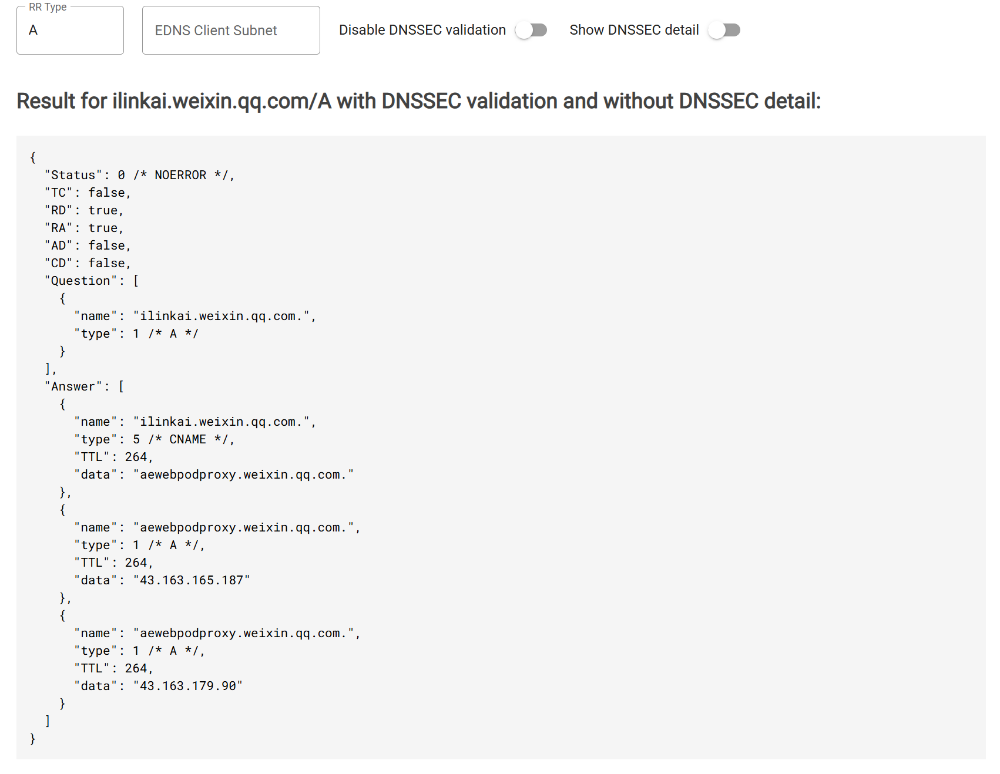

## 问题现场

今天[给 Hermes Gateway 配置 Weixin / WeChat](https://hermes-agent.nousresearch.com/docs/user-guide/messaging/weixin) 时，第一眼看到的失败非常含糊：

```powershell
(base) PS C:\Users\bubblevan> hermes gateway setup
```

进入 Gateway Setup 后选择：

```text
3. Weixin / WeChat  (not configured)
```

Hermes 提示会打开 Tencent iLink QR login：


这里最容易误判的是：看起来像是“扫码没完成”，但实际上二维码都还没有成功拿到。终端只给了一个汇总提示，真正有用的信息被写进日志里。

## 先定位 Hermes 的实际 home

Hermes Desktop / Windows installer 这套环境实际使用的是：

```text
C:\Users\bubblevan\AppData\Local\hermes
```

Hermes 可执行文件也在这里：

```text
C:\Users\bubblevan\AppData\Local\hermes\hermes-agent\venv\Scripts\hermes.exe
```

可以直接用完整路径调用：

```powershell
& "C:\Users\bubblevan\AppData\Local\hermes\hermes-agent\venv\Scripts\hermes.exe" --help
```

返回里能看到 `gateway` 和 `logs` 这些子命令：

```text
Hermes Agent - AI assistant with tool-calling capabilities

positional arguments:
  {chat,model,...,gateway,...,logs,...}
    gateway            Messaging gateway management
    logs               View agent.log (last 50 lines)
```

后面所有 `.env`、日志、gateway service 脚本都在 `AppData\Local\hermes` 下面。

## 找到真正的错误日志

先看日志目录：

```powershell
Get-ChildItem -Path "C:\Users\bubblevan\AppData\Local\hermes\logs"
```

当时能看到这些文件：

```text
agent.log
errors.log
gateway-exit-diag.log
gui.log
desktop.log
bootstrap-installer.log
```

Hermes 自带的日志命令更方便：

```powershell
& "C:\Users\bubblevan\AppData\Local\hermes\hermes-agent\venv\Scripts\hermes.exe" logs list
```

输出类似：

```text
Log files in ~/AppData\Local\hermes/logs/:

  agent.log                   30.6KB   8m ago
  bootstrap-installer.log    110.2KB   1h ago
  desktop.log                  1.1KB   1h ago
  errors.log                   5.7KB   8m ago
  gateway-exit-diag.log        2.1KB   32m ago
  gui.log                       578B   1h ago
```

然后过滤 gateway 错误：

```powershell
& "C:\Users\bubblevan\AppData\Local\hermes\hermes-agent\venv\Scripts\hermes.exe" logs errors -n 20 --component gateway
```

关键错误终于出现了：

```text
2026-07-19 20:40:55,197 ERROR gateway.platforms.weixin:
weixin: failed to fetch QR code:
Cannot connect to host ilinkai.weixin.qq.com:443 ssl:default [None]

2026-07-19 20:41:19,033 ERROR gateway.platforms.weixin:
weixin: failed to fetch QR code:
Cannot connect to host ilinkai.weixin.qq.com:443 ssl:default [None]

2026-07-19 20:55:17,365 ERROR gateway.platforms.weixin:
weixin: failed to fetch QR code:
Cannot connect to host ilinkai.weixin.qq.com:443 ssl:default [信号灯超时时间已到]

2026-07-19 20:56:45,151 ERROR gateway.platforms.weixin:
weixin: failed to fetch QR code:
Cannot connect to host ilinkai.weixin.qq.com:443 ssl:default [信号灯超时时间已到]
```

这一步直接改变了问题定义：不是 WeChat 扫码失败，而是 Hermes 获取 Tencent iLink 二维码失败。

## 对照源码：失败发生在 QR 获取阶段

我在 Hermes 安装目录里搜索 Weixin adapter：

```powershell
rg -n "failed to fetch QR|ilinkai|QR login did not complete|account_id|token" `
  "C:\Users\bubblevan\AppData\Local\hermes\hermes-agent\gateway" `
  "C:\Users\bubblevan\AppData\Local\hermes\hermes-agent\hermes_cli"
```

能看到两个关键位置。

第一处是 setup 里的表层提示：

```python
credentials = asyncio.run(qr_login(str(get_hermes_home())))

if not credentials:
    print_warning("  QR login did not complete.")
    return
```

第二处是 Weixin adapter 里真正访问 iLink 的地方：

```python
ILINK_BASE_URL = "https://ilinkai.weixin.qq.com"
EP_GET_BOT_QR = "ilink/bot/get_bot_qrcode"
EP_GET_QR_STATUS = "ilink/bot/get_qrcode_status"
QR_TIMEOUT_MS = 35_000
```

`qr_login()` 里先请求二维码：

```python
qr_resp = await _api_get(
    session,
    base_url=ILINK_BASE_URL,
    endpoint=f"{EP_GET_BOT_QR}?bot_type={bot_type}",
    timeout_ms=QR_TIMEOUT_MS,
)
```

如果这个请求异常，就只记日志并返回 `None`：

```python
except Exception as exc:
    logger.error("weixin: failed to fetch QR code: %s", exc)
    return None
```

所以 CLI 里的 `QR login did not complete` 是一个二次包装后的结果，根因要看 `errors.log`。

## 网络第一轮：TCP 通，但 TLS 不通

先解析域名：

```powershell
Resolve-DnsName ilinkai.weixin.qq.com
```

当时本机返回：

```text
Name                   Type  TTL  Section  IPAddress
----                   ----  ---  -------  ---------
ilinkai.weixin.qq.com  A     0    Answer   198.18.0.109
```

再测 TCP 443：

```powershell
Test-NetConnection ilinkai.weixin.qq.com -Port 443 -InformationLevel Detailed
```

结果表面上是通的：

```text
ComputerName          : ilinkai.weixin.qq.com
RemoteAddress         : 198.18.0.109
RemotePort            : 443
InterfaceAlias        : BoostNet
SourceAddress         : 198.18.0.1
NetRoute (NextHop)    : 198.18.0.2
TcpTestSucceeded      : True
```

这个输出意味着 TCP 能连，但走的是 `BoostNet` 网卡，而且地址是 `198.18.0.109`。

继续用 curl 测 HTTPS：

```powershell
curl.exe -v --connect-timeout 10 https://ilinkai.weixin.qq.com/ilink/bot/get_bot_qrcode?bot_type=3
```

输出里连接建立了，但 TLS 握手失败：

```text
* Host ilinkai.weixin.qq.com:443 was resolved.
* IPv4: 198.18.0.109
*   Trying 198.18.0.109:443...
* Connected to ilinkai.weixin.qq.com (198.18.0.109) port 443
* schannel: disabled automatic use of client certificate
* ALPN: curl offers http/1.1
* schannel: failed to receive handshake, SSL/TLS connection failed
* Closing connection
curl: (35) schannel: failed to receive handshake, SSL/TLS connection failed
```

到这里可以先下一个小结论：这不是简单的“端口不通”。TCP 连接可以建立，但 TLS 握手拿不到正常响应，问题更靠近代理、TUN、Fake-IP 或 TLS 转发。

## 第二轮：Hermes 的 aiohttp 实际走了本地代理

Weixin adapter 创建 HTTP session 的方式是：

```python
aiohttp.ClientSession(trust_env=True, connector=_make_ssl_connector())
```

`trust_env=True` 意味着 aiohttp 会读取系统/环境里的代理设置。为了确认它到底走了哪里，我用 Hermes venv 里的 Python 和 aiohttp 复现请求：

```powershell
@'
import asyncio
import socket
import ssl
import aiohttp
import certifi

print("dns", socket.getaddrinfo("ilinkai.weixin.qq.com", 443, type=socket.SOCK_STREAM))

async def main():
    ctx = ssl.create_default_context(cafile=certifi.where())
    try:
        async with aiohttp.ClientSession(
            trust_env=True,
            connector=aiohttp.TCPConnector(ssl=ctx),
        ) as s:
            async with s.get(
                "https://ilinkai.weixin.qq.com/ilink/bot/get_bot_qrcode?bot_type=3",
                headers={
                    "iLink-App-Id": "bot",
                    "iLink-App-ClientVersion": str((2 << 16) | (2 << 8) | 0),
                },
                timeout=aiohttp.ClientTimeout(total=20),
            ) as r:
                txt = await r.text()
                print("status", r.status)
                print(txt[:200])
    except Exception as e:
        print(type(e).__name__, repr(e))

asyncio.run(main())
'@ | & "C:\Users\bubblevan\AppData\Local\hermes\hermes-agent\venv\Scripts\python.exe" -
```

这次输出更具体：

```text
dns [(<AddressFamily.AF_INET: 2>, <SocketKind.SOCK_STREAM: 1>, 0, '', ('198.18.0.109', 443))]

ClientConnectorError
ClientConnectorError(
  ConnectionKey(
    host='ilinkai.weixin.qq.com',
    port=443,
    is_ssl=True,
    ssl=True,
    proxy=URL('http://127.0.0.1:7892'),
    proxy_auth=None,
    proxy_headers_hash=None,
    server_hostname=None
  ),
  ConnectionResetError()
)
```

这就是关键突破：Hermes 的 aiohttp 请求实际使用了 `http://127.0.0.1:7892` 代理，然后连接被 reset。

查系统代理：

```powershell
Get-ItemProperty -Path "HKCU:\Software\Microsoft\Windows\CurrentVersion\Internet Settings" |
  Select-Object ProxyEnable,ProxyServer,ProxyOverride,AutoConfigURL
```

输出：

```text
ProxyEnable  ProxyServer
-----------  -----------
1            127.0.0.1:7892
```

再看 7892 是谁：

```powershell
Get-NetTCPConnection -LocalPort 7892 -ErrorAction SilentlyContinue |
  Select-Object LocalAddress,LocalPort,RemoteAddress,RemotePort,State,OwningProcess
```

能看到它在监听：

```text
LocalAddress  LocalPort  RemoteAddress  RemotePort  State   OwningProcess
------------  ---------  -------------  ----------  -----   -------------
127.0.0.1     7892       0.0.0.0        0           Listen  189020
```

查进程：

```powershell
Get-Process -Id 189020 | Format-List Id,ProcessName,Path,StartTime
```

输出：

```text
Id          : 189020
ProcessName : BoostNetCore
Path        :
StartTime   :
```

所以这条链路变得很清楚：

```text
Hermes Weixin adapter
  -> aiohttp trust_env=True
  -> Windows user proxy 127.0.0.1:7892
  -> BoostNetCore
  -> ilinkai.weixin.qq.com
  -> TLS handshake reset / timeout
```

## 第三轮：DNS 证据把 Fake-IP 坐实

最迷惑的一点是：本机解析一直是 `198.18.0.109`。这个地址并不像一个普通公网解析结果。

用 Google DNS 查询真实结果：



也就是说，真实解析应该是：

```text
ilinkai.weixin.qq.com
  -> aewebpodproxy.weixin.qq.com
  -> 43.163.165.187 / 43.163.179.90
```

而本地解析是：

```text
ilinkai.weixin.qq.com -> 198.18.0.109
```

`198.18.0.0/15` 经常出现在代理软件的 Fake-IP 模式里。它的意义不是“腾讯真实服务器 IP”，而是代理/TUN 为域名分配的一个虚拟地址。

为了确认“只绕过 HTTP proxy 是否足够”，我又测试了 `NO_PROXY=*`：

```powershell
$env:NO_PROXY="*"

@'
import asyncio
import socket
import ssl
import aiohttp
import certifi
import os

print("NO_PROXY", os.environ.get("NO_PROXY"))
print("dns", socket.getaddrinfo("ilinkai.weixin.qq.com", 443, type=socket.SOCK_STREAM))

async def main():
    ctx = ssl.create_default_context(cafile=certifi.where())
    try:
        async with aiohttp.ClientSession(
            trust_env=True,
            connector=aiohttp.TCPConnector(ssl=ctx),
        ) as s:
            async with s.get(
                "https://ilinkai.weixin.qq.com/ilink/bot/get_bot_qrcode?bot_type=3",
                headers={
                    "iLink-App-Id": "bot",
                    "iLink-App-ClientVersion": str((2 << 16) | (2 << 8) | 0),
                },
                timeout=aiohttp.ClientTimeout(total=20),
            ) as r:
                txt = await r.text()
                print("status", r.status)
                print(txt[:200])
    except Exception as e:
        print(type(e).__name__, repr(e))

asyncio.run(main())
'@ | & "C:\Users\bubblevan\AppData\Local\hermes\hermes-agent\venv\Scripts\python.exe" -
```

返回：

```text
NO_PROXY *
dns [(<AddressFamily.AF_INET: 2>, <SocketKind.SOCK_STREAM: 1>, 0, '', ('198.18.0.109', 443))]

ClientConnectorError
ClientConnectorError(
  ConnectionKey(
    host='ilinkai.weixin.qq.com',
    port=443,
    is_ssl=True,
    ssl=True,
    proxy=None,
    proxy_auth=None,
    proxy_headers_hash=None,
    server_hostname=None
  ),
  ConnectionResetError()
)
```

这说明即使不走 HTTP proxy，DNS 仍然被 Fake-IP/TUN 接管了。问题不是单纯的 `HTTP_PROXY`，而是 BoostNet 对这个域名的整条链路处理不对。

## 修复：让 iLink 域名绕开 Fake-IP/TUN

最终修复思路不是改 Hermes，而是改代理规则。

需要让这些域名不要进入 Fake-IP/TUN 异常链路：

```text
ilinkai.weixin.qq.com
aewebpodproxy.weixin.qq.com
novac2c.cdn.weixin.qq.com
*.weixin.qq.com
```

如果是 Clash 类配置，一般要同时照顾两件事：

1. 规则上走 `DIRECT`
2. Fake-IP 过滤里排除这些域名

示意配置：

```yaml
fake-ip-filter:
  - ilinkai.weixin.qq.com
  - aewebpodproxy.weixin.qq.com
  - novac2c.cdn.weixin.qq.com
  - "*.weixin.qq.com"

rules:
  - DOMAIN,ilinkai.weixin.qq.com,DIRECT
  - DOMAIN,aewebpodproxy.weixin.qq.com,DIRECT
  - DOMAIN,novac2c.cdn.weixin.qq.com,DIRECT
  - DOMAIN-SUFFIX,weixin.qq.com,DIRECT
```

修改后先验证 DNS。理想情况下，本机不应该再解析到 `198.18.x.x`：

```powershell
Resolve-DnsName ilinkai.weixin.qq.com
```

期望看到类似：

```text
ilinkai.weixin.qq.com       CNAME  aewebpodproxy.weixin.qq.com
aewebpodproxy.weixin.qq.com A      43.163.165.187
aewebpodproxy.weixin.qq.com A      43.163.179.90
```

然后重新跑 Hermes setup：

```powershell
& "C:\Users\bubblevan\AppData\Local\hermes\hermes-agent\venv\Scripts\hermes.exe" gateway setup
```

## 成功后的结果

修复后，Hermes 能成功拿到二维码链接，并在终端渲染二维码：

```text
请使用微信扫描以下二维码：
https://liteapp.weixin.qq.com/q/<redacted>?qrcode=<redacted>&bot_type=3
```

扫码确认后：

```text
微信连接成功，account_id=<redacted>@im.bot
```

接着配置 DM 策略：

```text
How should direct messages be authorized?

1. Use DM pairing approval (recommended)
2. Allow all direct messages
3. Only allow listed user IDs
4. Disable direct messages

Choice [default 1]: 1
DM pairing enabled.
Unknown DM users can request access and you approve them with `hermes pairing approve`.
```

配置 group 策略：

```text
How should group chats be handled?

1. Disable group chats (recommended)
2. Allow all group chats
3. Only allow listed group chat IDs

Choice [default 1]: 1
Group chats disabled.
```

设置 home channel 后，Weixin 配置成功：

```text
Weixin configured!
Account ID: <redacted>@im.bot
User ID: <redacted>@im.wechat
```

平台列表里也从 `not configured` 变成了 `configured`：

```text
3. Weixin / WeChat  (configured)
```

最后启动 gateway：

```text
Start the gateway service? [Y/n]: Y
Gateway started via direct spawn (PID <redacted>)
```

第一次 approve pairing code 时，我还手滑把反引号也带进去了：

```powershell
hermes pairing approve weixin <code>`
```

Hermes 当然找不到这个 code：

```text
Code '<code>`' not found or expired for platform 'weixin'.
Run 'hermes pairing list' to see pending codes.
```

去掉反引号后成功：

```powershell
hermes pairing approve weixin <code>
```

返回：

```text
Approved! User <redacted>@im.wechat (<redacted>@im.wechat) on weixin can now use the bot~
They'll be recognized automatically on their next message.
```

到这里，Hermes 和 WeChat 的链路才算真正跑通。之后装点官方技能：

```
hermes skills install official/general/plan
hermes skills install official/general/systematic-debugging
hermes skills install official/general/spike
hermes skills install official/github/github-pr-workflow
hermes skills install official/github/codebase-inspection
hermes skills install official/github/requesting-code-review
hermes skills install official/design/sketch
hermes skills install official/design/architecture-diagram
hermes skills install official/research/arxiv
hermes skills install official/research/blogwatcher
```

## 复盘：这次排障的判断链

这次问题很典型：表面上是一个应用配置失败，根因却在网络代理层。

完整判断链是：

```text
QR login did not complete
  -> 查看 errors.log
  -> failed to fetch QR code
  -> 请求 ilinkai.weixin.qq.com:443 失败
  -> TCP 443 可连，但 TLS handshake 失败
  -> aiohttp 暴露 proxy=127.0.0.1:7892
  -> 7892 属于 BoostNetCore
  -> 本地 DNS 返回 198.18.0.109
  -> Google DNS 返回真实腾讯 IP
  -> Fake-IP/TUN 链路异常
  -> 给 iLink / Weixin 域名配置直连与 fake-ip-filter
  -> QR 获取成功
  -> Weixin configured
```

这里最值得沉淀的不是某一条命令，而是几个排障习惯。

第一，不要停在 CLI 的最终提示。`QR login did not complete` 是用户友好的表层描述，真正的因果信息在 `errors.log`。

第二，要区分 TCP、TLS、HTTP 三层。`Test-NetConnection` 成功只说明 TCP 建连成功，不代表 TLS 握手和 HTTP 请求正常。

第三，代理软件的 Fake-IP 会改变很多直觉。你以为自己在请求真实服务器，其实本机拿到的是虚拟 IP；你以为 `NO_PROXY=*` 绕开了代理，其实 DNS 已经被 TUN 接管。

第四，对比本地 DNS 和公共 DNS 很有用。这次就是 `198.18.0.109` 和 `43.163.165.187 / 43.163.179.90` 的差异，把问题从“域名不可达”推进到了“Fake-IP 链路异常”。

以后遇到类似“某个 CLI 登录二维码刷不出来”的问题，可以直接按这个顺序排：

```powershell
# 1. 看应用日志
hermes logs errors -n 50 --component gateway

# 2. 看 DNS
Resolve-DnsName ilinkai.weixin.qq.com

# 3. 看 TCP
Test-NetConnection ilinkai.weixin.qq.com -Port 443 -InformationLevel Detailed

# 4. 看 TLS/HTTP
curl.exe -v --connect-timeout 10 https://ilinkai.weixin.qq.com/

# 5. 看系统代理
Get-ItemProperty -Path "HKCU:\Software\Microsoft\Windows\CurrentVersion\Internet Settings" |
  Select-Object ProxyEnable,ProxyServer,ProxyOverride,AutoConfigURL
```

这次的小坑，最后变成了一条还挺清楚的经验：当 Agent、IM Gateway、OAuth/QR 登录和本地代理同时出现时，别太早怀疑应用层 token；先确认二维码 endpoint 有没有真的走到正确的网络出口。
