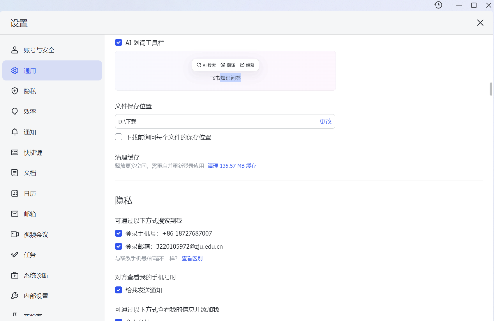
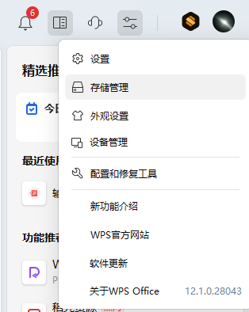
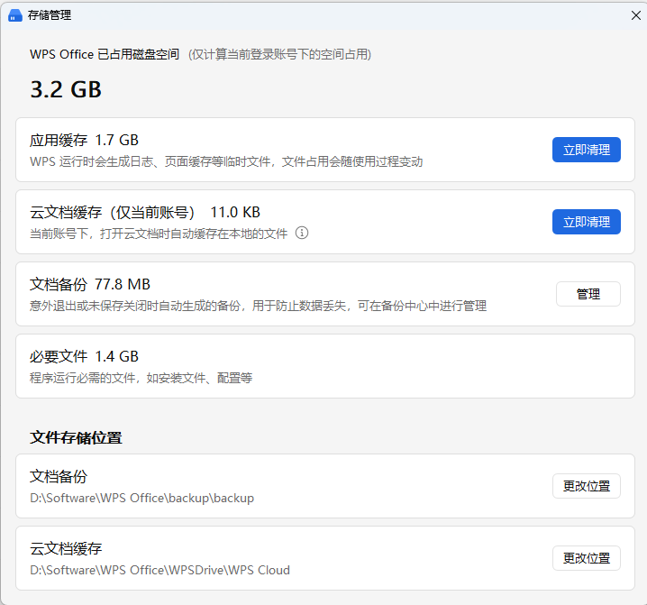

## 一、触发：C盘只剩 10.01GB，我第一次扫描看到了什么

C 盘总容量 200GB，2026 年 7 月 30 日剩余 10.01GB。我先用工具快速扫了一遍各目录占用，结论立刻清楚了：最值得处理的不是 pip、npm 或 Hugging Face 缓存，而是 Cursor、Chrome、VS Code、即时通讯软件、WPS、Android SDK、Temp、Yarn 以及 Windows 组件存储这几大块。

以下是我第一轮扫描后整理出的主要占用项，也是后续清理动作的直接依据。

| 项 | C 盘位置 | 占用 | 初步判断 |
|---|---:|---|---|
| Cursor | `C:\Users\bubblevan\AppData\Roaming\Cursor` | 10.98GB | 重点看 `User\globalStorage` 8.40GB，疑似扩展或 AI 工具状态缓存 |
| Chrome | `C:\Users\bubblevan\AppData\Local\Google\Chrome\User Data` | 8.29GB | `Default\Service Worker` 3.65GB，`OptGuideOnDeviceModel` 3.98GB |
| WPS/金山 | `AppData\Roaming\kingsoft` + `AppData\Local\kingsoft` | 约 7.58GB | 缓存与临时文件大户，需从软件内部清理 |
| 微信/QQ | `AppData\Roaming\Tencent` 等 | 约 4.19GB+ | 含 `xwechat` 1.88GB、`WeChat` 0.97GB，文档目录另有 `Tencent Files` 0.21GB |
| 飞书/Lark | `AppData\Roaming\LarkShell` + `AppData\Local\Feishu` | 约 3.78GB | 可尝试在设置中清理缓存或迁移文件位置 |
| Android SDK | `C:\Users\bubblevan\AppData\Local\Android\Sdk` | 4.07GB | 如果不做安卓开发可直接移除或迁移 |
| Yarn cache | `C:\Users\bubblevan\AppData\Local\Yarn\Cache` | 2.22GB | 可清理或迁移 |
| VS Code | `C:\Users\bubblevan\AppData\Roaming\Code` | 3.08GB | `CachedExtensionVSIXs` 1.42GB 可直接清，`workspaceStorage` 需进一步排查 |
| 本地 Temp | `C:\Users\bubblevan\AppData\Local\Temp` | 3.00GB | 大部分为临时浏览器或安装残留 |
| Hermes | `C:\Users\bubblevan\AppData\Local\Hermes` | 2.02GB | 主要来自 `hermes-agent` 1.86GB |
| Codex | `C:\Users\bubblevan\.codex` + `.cache\codex-runtimes` | 约 2.56GB | runtime、插件、日志等 |
| 微信开发者工具 | `C:\Users\bubblevan\AppData\Local\微信开发者工具` | 2.37GB | 可从工具内清缓存 |

pip 的缓存只有 38.6MB，npm 缓存主目录早已迁移到 `E:\cache\npm-cache`，C 盘仅残留 75MB 和 208MB 无关紧要的旧目录。Hugging Face 默认缓存目录 `C:\Users\bubblevan\.cache\huggingface` 根本不存在，`.cache` 下的 1.41GB 实际是 Codex 的 runtime。这些开发者常关注的目录都不是本次瓶颈。

WSL 和 VMware 同样不占空间。`wsl.exe --list --verbose` 返回无默认发行版，也未找到 `.vhdx` 虚拟磁盘；`C:\Program Files (x86)\VMware` 仅有 0.10GB，虚拟机文件未在本次扫描中出现。

Windows 系统目录虽大，但 `WinSxS` 22.54GB、`DriverStore` 6.90GB、`Installer` 3.50GB 不能直接手工删除，需通过系统工具处理。

基于这些数据，我决定先从 Chrome 和 Cursor 这两个意料之外的大户入手，接着批量处理 VS Code 缓存和 Android SDK。


## 二、Chrome 的两个意外大户

### 2.1 `OptGuideOnDeviceModel` 为什么占了 3.98GB

扫描到 `Chrome\User Data\OptGuideOnDeviceModel` 占 3.98GB 时，我并不知道这个目录是做什么的。查了 Chromium 源码才确认，它存放的是 Chrome Optimization Guide 所用的本地 AI 模型，用于诸如 Gemini in Chrome、写作辅助、标签整理等功能。谷歌也太恶心了！不知道 Edge 有没有同样的内容。

删除前，先在 Chrome 地址栏输入 `chrome://settings/ai`，关闭了所有我实际不用的本地 AI 功能（具体可参考  ）。然后打开任务管理器，确认所有 `chrome.exe` 进程已结束。执行：

```powershell
Remove-Item "C:\Users\bubblevan\AppData\Local\Google\Chrome\User Data\OptGuideOnDeviceModel" -Recurse -Force
```

重新启动 Chrome，常用网站浏览正常。该目录占用的约 **3.98GB** 被释放。

需要注意：这个目录属于 Chrome 组件更新体系，未来 Chrome 更新有可能重新下载。我当时的判断是，只要关闭对应的 AI 功能入口，重下的概率会降低，但不能保证永久消失。谷歌帮助社区有大量相同体积的模型占用报告，说明这是一个普遍现象。

### 2.2 `Service Worker` 里 3.65GB 到底是什么，以及为什么不能直接删

`Default\Service Worker` 目录 3.65GB 不在普通网页缓存里。它可能包含离线资源、PWA 数据、IndexedDB / Cache Storage、后台 Worker 等，甚至某些网站的大文件缓存也会落在这里。直接删除可能导致正在使用的 Web 应用出问题。

我先打开 `chrome://settings/content/all`，检查了占用最大的站点。发现主要是 Larksuite 相关域，也就是 Stablepay 的相关文档。在 Chrome 设置里针对这些站点单独清理了缓存后，占用下降有限。

于是采用更安全的重命名法。完全退出 Chrome 后执行：

```powershell
Rename-Item `
  "$env:LOCALAPPDATA\Google\Chrome\User Data\Default\Service Worker" `
  "Service Worker.backup"
```

重新启动 Chrome，正常使用了半天，没有出现预期外的登出、报错或页面异常。确认无问题后，删除备份：

```powershell
Remove-Item `
  "$env:LOCALAPPDATA\Google\Chrome\User Data\Default\Service Worker.backup" `
  -Recurse -Force
```

这一步释放了约 **3.65GB**。代价是部分网站的离线缓存和登录状态丢失，但书签和浏览历史不受影响。整个过程没有直接删目录，也没有依赖 Chrome 的内部清理菜单，因为当时无法确认哪些数据属于哪些站点。


## 三、Cursor：从 10.98GB 到 0.5GB，以及把整个 globalStorage 迁出 C 盘

### 3.1 为什么不能直接清空 `globalStorage`

第一轮扫描显示 `C:\Users\bubblevan\AppData\Roaming\Cursor` 占用 10.98GB，其中 `User\globalStorage` 占了 8.40GB。我最初的反应和对待普通缓存一样：关掉 Cursor，直接删除整个 `globalStorage`。动手前我在 Cursor 论坛搜索了一下，发现 2026 年已经有大量用户报告 `state.vscdb` 异常膨胀到 8GB 以上，官方工作人员认为这不正常，并建议对数据库执行 `VACUUM`，而不是直接删除文件。另外有用户反馈，删除 `state.vscdb` 后旧项目的聊天历史一直卡在 “Loading Chat”，无法恢复。

这说明 `globalStorage` 不是临时缓存，删掉会让 Agent 历史、Composer 会话和扩展状态永久丢失。我决定不走捷径，先搞清楚这 8.40GB 的组成再动手。

### 3.2 `state.vscdb` 和 `state.vscdb.backup`：4.1GB + 4.1GB 的镜像

关闭 Cursor 后，我用 PowerShell 统计了 `globalStorage` 下每个子文件夹和文件的大小：

```powershell
$cursorGlobal = "$env:APPDATA\Cursor\User\globalStorage"
Get-ChildItem $cursorGlobal -Force |
    ForEach-Object {
        $size = if ($_.PSIsContainer) {
            (Get-ChildItem $_.FullName -Recurse -Force -File -ErrorAction SilentlyContinue |
                Measure-Object Length -Sum).Sum
        } else {
            $_.Length
        }
        [PSCustomObject]@{
            Name   = $_.Name
            SizeGB = [math]::Round($size / 1GB, 3)
            Path   = $_.FullName
        }
    } |
    Sort-Object SizeGB -Descending |
    Format-Table -AutoSize
```

输出结果让我意外：最大的不是某个扩展目录，而是两个数据库文件——

```
Name                  SizeGB Path
----                  ------ ----
state.vscdb           4.123  ...\globalStorage\state.vscdb
state.vscdb.backup    4.096  ...\globalStorage\state.vscdb.backup
moonshot-ai.kimi-code 0.134  ...
...
```

两个文件合计 8.2GB，占据了 `globalStorage` 的绝大部分。`state.vscdb.backup` 在论坛里被工作人员明确称为备份文件，可以安全删除。我先处理它：

```powershell
Remove-Item "$env:APPDATA\Cursor\User\globalStorage\state.vscdb.backup" -Force
```

这一步直接释放了约 4GB。

接着处理 `state.vscdb`。按照论坛建议，我先用 DB Browser for SQLite 打开数据库，准备执行 `VACUUM` 回收碎片空间。在操作前，我把原库复制到 D 盘备份：

```powershell
Copy-Item `
  "$env:APPDATA\Cursor\User\globalStorage\state.vscdb" `
  "D:\Cursor-Backup\cursor-state-before-vacuum.vscdb"
```

然后对**备份副本**执行 `VACUUM`（因为当时不确定直接操作原文件是否安全，决定先在副本上试）。

[VACUUM Cursor vscdb](image-1.png)

DB Browser 输出“查询执行成功，耗时 46556ms”。然而，检查备份文件大小时，我发现了问题：

```powershell
Get-Item "D:\Cursor-Backup\cursor-state-before-vacuum.vscdb" |
    Select-Object Name, @{Name="SizeGB";Expression={[math]::Round($_.Length/1GB,3)}}
```

结果：4.112 GB。对比原文件 4.123 GB，`VACUUM` 只缩小了约 11MB。

此时我确认了两件事：第一，`VACUUM` 几乎没有效果，说明数据库内部没有大量废弃页（之后用 `PRAGMA freelist_count;` 查得 0 也证实了这一点）；第二，这 4.1GB 是真实存储的数据，而不是碎片或历史删除残留。我的判断是：Cursor 把大量 Agent 会话数据实打实地写进了数据库。

### 3.3 定位真正的数据大户：`cursorDiskKV` 表

我需要知道这 4.1GB 到底存了什么。用 DB Browser 浏览 `ItemTable` 表，发现它只占约 4MB。真正的空间都在 `cursorDiskKV` 表中。执行一个快速统计：

```sql
SELECT COUNT(*) FROM cursorDiskKV;
-- 结果：247639 行
```

计算平均每行约 13.7 KB，说明不是几个大文件，而是二十多万个小对象累积出的 3.3GB。

接着我按 key 前缀分组，看每类数据占多少空间：

```sql
SELECT
    CASE
        WHEN instr(key, ':') > 0
        THEN substr(key, 1, instr(key, ':') - 1)
        ELSE key
    END AS prefix,
    COUNT(*) AS rows,
    ROUND(SUM(length(value)) / 1024 / 1024, 2) AS MB
FROM cursorDiskKV
GROUP BY prefix
ORDER BY MB DESC
LIMIT 50;
```

输出结果非常清晰：

| prefix | rows | MB |
|---|---|---|
| checkpointId | 30346 | 1274.0 |
| bubbleId | 137629 | 1234.0 |
| agentKv | 51850 | 398.0 |
| codeBlockDiff | 15702 | 208.0 |
| messageRequestContext | 5486 | 92.0 |
| composerData | 1321 | 70.0 |
| ... | ... | ... |

这六类数据合计约 3.2GB，几乎就是整个数据库的体积。对照 Cursor Agent 的行为，这些 key 的含义很容易对应上：

- **checkpointId**：Agent 每次修改文件前后保存的检查点，用于 Undo。
- **bubbleId**：Composer/Agent 对话的每个“气泡”节点，记录用户请求、工具调用和 Agent 回复的完整上下文。
- **agentKv**：Agent 运行时的临时状态、工具调用缓存等。
- **codeBlockDiff**：代码修改的 diff 快照。
- **messageRequestContext**：每次 Agent 请求的上下文信息。
- **composerData**：Composer 会话的元数据。

我的判断：最近几年高强度用 Cursor 做 Hermes、Codex、Go 项目和博客的自动化修改，Cursor 把每一次 Agent 操作的历史轨迹全部落盘在了这些 key 里。3.3GB 的体量与我的使用频率匹配。

### 3.4 分步清理：先砍确定性高的，再评估高风险部分

按风险程度，我把清理分成两个阶段。

**第一阶段：清除明确的 Agent 操作缓存**。`checkpointId`、`codeBlockDiff`、`messageRequestContext` 这三类数据有一个共同点：它们的主要价值在于支持“撤销修改”和“查看历史 diff”，而我在日常使用中几乎不依赖 Agent 的 Undo 功能，也不需要翻阅旧的 diff 快照。`bubbleId` 和 `composerData` 直接关联 Composer 对话历史的可读性，暂不删除。

执行 SQL：

```sql
BEGIN TRANSACTION;

DELETE FROM cursorDiskKV WHERE key LIKE 'checkpointId:%';
DELETE FROM cursorDiskKV WHERE key LIKE 'codeBlockDiff:%';
DELETE FROM cursorDiskKV WHERE key LIKE 'messageRequestContext:%';

COMMIT;
VACUUM;
```

操作后，数据库大小从 4.123 GB 降到了约 2.6 GB（当时没有记录精确值，后续完整清理后才得到最终数值）。释放约 1.5GB，Cursor 启动后一切正常，Agent 仍可发起新对话。

**第二阶段：处理 `bubbleId` 和 `composerData`**。这两项合计 1.3GB，删除的代价是 Composer 历史列表会变空，旧对话无法恢复，但不会丢失任何项目代码或 Git 历史。对我来说，Composer 历史主要用于当前任务的上下文，旧对话很少回顾，这个代价可以接受。

另外，`agentKv` 虽然占 398MB，但从命名看它可能保存了 Agent 的当前运行状态，398MB 不足以让我冒破坏 Agent 功能的风险，我选择暂时保留。

执行第二轮清理：

```sql
BEGIN TRANSACTION;

DELETE FROM cursorDiskKV WHERE key LIKE 'bubbleId:%';
DELETE FROM cursorDiskKV WHERE key LIKE 'composerData:%';

COMMIT;
VACUUM;
```

之后，`state.vscdb` 的大小降到了 0.559 GB。算一下：原始 4.123GB，先删 backup 4.096GB，再通过两次 SQL 清理把主库从 4.1GB 减至 0.56GB，C 盘累计释放约 7.7GB（4.1GB backup + 3.5GB 数据库缩减）。此时 C 盘 `Cursor\User\globalStorage` 目录剩余体积约 0.7GB。

### 3.5 把清理后的 `globalStorage` 整体迁往 D 盘

单次清理不是终点。按照我现在的使用强度，Cursor 的 Agent 数据还会持续增长。我决定把整个 `globalStorage` 迁到 D 盘，通过目录链接让 Cursor 无感访问。

操作顺序很关键：如果先建链接再放数据，或者用错了覆盖方向，可能导致 Cursor 启动时重新在 C 盘生成目录，白费功夫。

**第一步**：完全关闭 Cursor，确认无后台进程。

```powershell
taskkill /F /IM Cursor.exe
Get-Process | findstr Cursor   # 应无输出
```

**第二步**：把当前 C 盘的 `globalStorage` 重命名为备份。

```powershell
Rename-Item `
  "$env:APPDATA\Cursor\User\globalStorage" `
  "globalStorage.old"
```

**第三步**：在 D 盘创建目标目录，并把整个旧目录（包含清理后的数据库和其他扩展文件夹）复制过去。

```powershell
New-Item -ItemType Directory -Force "D:\CursorData\globalStorage"
robocopy `
  "$env:APPDATA\Cursor\User\globalStorage.old" `
  "D:\CursorData\globalStorage" /E
```

**第四步**：用之前清理好的数据库覆盖 D 盘中的 `state.vscdb`。这一步确保不会错误地恢复旧的大文件。

```powershell
Copy-Item `
  "D:\Cursor-Backup\cursor-state-before-vacuum.vscdb" `
  "D:\CursorData\globalStorage\state.vscdb" -Force
```

确认 D 盘文件大小：

```powershell
Get-Item "D:\CursorData\globalStorage\state.vscdb" |
    Select-Object Name, @{n="GB";e={[math]::Round($_.Length/1GB,3)}}
# 输出：state.vscdb  0.559 GB
```

**第五步**：删除 C 盘的备份目录，释放空间。

```powershell
Remove-Item "$env:APPDATA\Cursor\User\globalStorage.old" -Recurse -Force
```

**第六步**：以管理员身份运行 PowerShell，创建目录联接。

```powershell
cmd /c mklink /J `
  "C:\Users\bubblevan\AppData\Roaming\Cursor\User\globalStorage" `
  "D:\CursorData\globalStorage"
```

输出：`为 C:\Users\bubblevan\AppData\Roaming\Cursor\User\globalStorage <<===>> D:\CursorData\globalStorage 创建的联接`。

用 `dir` 验证：

```powershell
dir "$env:APPDATA\Cursor\User"
```

结果中 `globalStorage` 的模式显示为 `d----l`，并带有 `[D:\CursorData\globalStorage]` 的目标提示，确认联接生效。

**第七步**：启动 Cursor，检查 Agent、Composer 历史、扩展功能均正常，打开已有项目无报错。

### 3.6 额外回收：清掉 Cursor 自身的缓存目录

在完成 `globalStorage` 迁移后，我还对 Cursor 目录下的几个真正缓存文件夹进行了清理：

```powershell
$cursor = "$env:APPDATA\Cursor"
$cursorCaches = @(
    "$cursor\Cache",
    "$cursor\CachedData",
    "$cursor\Code Cache",
    "$cursor\GPUCache",
    "$cursor\CachedExtensionVSIXs"
)
foreach ($path in $cursorCaches) {
    if (Test-Path $path) {
        Remove-Item "$path\*" -Recurse -Force -ErrorAction SilentlyContinue
    }
}
```

这些目录在 Cursor 论坛被标注为可安全删除并会自动重建，不会影响设置和已安装扩展。由于此时 `globalStorage` 已经链接到 D 盘，这部分清理回收的空间并不大，主要目的是保持 C 盘 Cursor 目录的干净。

### 当前结果与限制

Cursor 相关数据从最初占 C 盘约 10.98GB，缩减到 C 盘本体只保留少量配置文件（`settings.json`、`keybindings.json`、`snippets` 等几十 MB），核心的 Agent 数据库和扩展状态全部落在 `D:\CursorData\globalStorage`，大小为 0.56GB。后续即使 Cursor 再次膨胀，也不会再侵占系统盘空间。

一个仍未确认的点是：清理后的 `state.vscdb` 里 `agentKv` 的 398MB 完全没有动，里面具体保存了哪些运行状态我还没逐一拆解。目前 Agent 功能正常，暂时没有深入的必要，但如果未来再次膨胀，可以从 `agentKv` 的 key 分布开始排查。

## 四、第二轮稳定释放：VS Code 与 Android SDK

### 4.1 VS Code 的 `CachedExtensionVSIXs` 和 `workspaceStorage` 能清多少

VS Code 占用 3.08GB，第一眼可安全清理的是 `CachedExtensionVSIXs`（1.42GB）等缓存。关闭 VS Code 后执行：

```powershell
$code = "$env:APPDATA\Code"
$codeCaches = @(
    "$code\Cache",
    "$code\CachedData",
    "$code\Code Cache",
    "$code\GPUCache",
    "$code\CachedExtensionVSIXs",
    "$code\Service Worker\CacheStorage"
)
foreach ($path in $codeCaches) {
    if (Test-Path $path) {
        Remove-Item "$path\*" -Recurse -Force -ErrorAction SilentlyContinue
    }
}
```

这些缓存目录删除后均会自动重建，当前安装的扩展本体不受影响。

`workspaceStorage` 更复杂，它保存了各工作区的扩展状态、索引和调试数据，不能整体删除。我先按大小列出了所有子目录：

```powershell
$ws = "$env:APPDATA\Code\User\workspaceStorage"
Get-ChildItem $ws -Directory -Force |
    ForEach-Object {
        $size = (Get-ChildItem $_.FullName -Recurse -File -Force -ErrorAction SilentlyContinue |
                 Measure-Object Length -Sum).Sum
        [PSCustomObject]@{
            Folder = $_.Name
            SizeMB = [math]::Round($size / 1MB, 1)
            Path   = $_.FullName
        }
    } |
    Sort-Object SizeMB -Descending |
    Select-Object -First 20 |
    Format-Table -AutoSize
```

输出中最大的是：

```
Folder                           SizeMB Path
------                           ------ ----
b34564939ccf63447d390a6ac487c0d4    186  ...
64c95b29ae6ee7ebdf819fe9f51bab73  116.2  ...
76dded55efe98c6f6178e45eac18eb90   52.5  ...
7db1ba90c3870607a6207a86abbe83ce   47.2  ...
...
```

这些文件夹名是工作区哈希，需要凭记忆或通过 VS Code 的“最近打开”列表才能对应到具体项目。我暂时不知道应该删除什么，因为无法立即确认对应哪个活跃项目，暂时保留。C/C++ 等扩展可能在这里存放大型 IntelliSense 数据库，误删会导致重新索引，但不会损坏项目本身。

### 4.2 Android SDK：直接删除

`C:\Users\bubblevan\AppData\Local\Android\Sdk` 占 4.07GB。我已经不从事安卓开发，没有相关项目依赖它。因此直接执行：

```powershell
Remove-Item "C:\Users\bubblevan\AppData\Local\Android\Sdk" -Recurse -Force
```

同时清理了环境变量 `ANDROID_HOME` 和 PATH 中相关条目。

## 三、微信、飞书、WPS：不要粗暴删整个 Roaming 目录

这些软件的数据目录通常混合了：

* 聊天记录；
* 接收的文件；
* 图片缩略图；
* 登录状态；
* 小程序和网页缓存；
* 自动备份；
* 文档恢复文件。

### 微信

优先打开微信：

```text
设置 → 文件管理
设置 → 通用设置 → 存储空间管理
```

分别清缓存、查看聊天文件占用，并把默认文件保存位置迁到 D 盘。

不要直接删除整个：

```text
AppData\Roaming\Tencent
AppData\Roaming\xwechat
Documents\WeChat Files
Documents\Tencent Files
```

尤其新旧微信并存时，可能同时存在多个聊天数据库。

### 飞书

使用：

```text
头像 → 设置 → 通用/存储 → 清理缓存
```

再把下载目录和文件保存路径改到：

```text
D:\UserData\Feishu
```
> TODO...
### WPS




## 四、Hermes 和 Codex 应该怎么处理(TODO)

### Hermes

你已经把新 Hermes 安装到了：

```text
D:\Software\Hermes\hermes-agent
D:\HermesData
```

所以 C 盘的：

```text
C:\Users\bubblevan\AppData\Local\Hermes\hermes-agent
```

很可能是旧版本，但不要仅凭目录名删除。先运行：

```powershell
Get-Command hermes -All | Format-List Source
where.exe hermes
Get-CimInstance Win32_Process |
    Where-Object {
        $_.Name -match "hermes|python" -and
        $_.CommandLine -match "Hermes"
    } |
    Select-Object Name, ProcessId, ExecutablePath, CommandLine
```

再检查计划任务：

```powershell
Get-ScheduledTask |
    Where-Object TaskName -match "Hermes" |
    Get-ScheduledTaskInfo
```

如果所有执行路径都指向 D 盘，先把旧目录改名：

```powershell
Rename-Item `
  "$env:LOCALAPPDATA\Hermes" `
  "Hermes.old"
```

重启并使用 Hermes，确认微信接入、Gateway、Skills 都正常后，再删除 `Hermes.old`。

### Codex

`.codex` 不建议整体迁移或删除，因为可能包含：

* 配置；
  -登录状态；
  -会话；
  -日志；
  -扩展状态。

但 `.cache\codex-runtimes` 更像可重新构建的 runtime 缓存。先退出 Codex/Cursor/VS Code，再列出明细：

```powershell
$paths = @(
    "$env:USERPROFILE\.codex",
    "$env:USERPROFILE\.cache\codex-runtimes"
)

foreach ($root in $paths) {
    Write-Host "`n== $root =="

    Get-ChildItem $root -Force -ErrorAction SilentlyContinue |
        ForEach-Object {
            $size = if ($_.PSIsContainer) {
                (
                    Get-ChildItem $_.FullName -Recurse -File -Force `
                        -ErrorAction SilentlyContinue |
                    Measure-Object Length -Sum
                ).Sum
            } else {
                $_.Length
            }

            [PSCustomObject]@{
                Name   = $_.Name
                SizeMB = [math]::Round($size / 1MB, 1)
                Path   = $_.FullName
            }
        } |
        Sort-Object SizeMB -Descending |
        Format-Table -AutoSize
}
```

优先删除明确命名为 `logs`、`tmp`、`cache` 的内容，不碰配置、凭证和会话数据库。

---

## 五、Windows 组件存储：最后再做

管理员 PowerShell：

```powershell
(base) PS C:\Users\bubblevan> DISM.exe /Online /Cleanup-Image /AnalyzeComponentStore

部署映像服务和管理工具
版本: 10.0.26100.8737

映像版本: 10.0.26200.8875

[==========================100.0%==========================]

组件存储(WinSxS)信息:

Windows 资源管理器报告的组件存储大小 : 18.27 GB

组件存储的实际大小 : 16.80 GB

    已与 Windows 共享 : 7.98 GB
    备份和已禁用的功能 : 8.81 GB
    缓存和临时数据 :  0 bytes

上次清理的日期 : 2026-07-15 01:08:49

可回收的程序包数 : 7
推荐使用组件存储清理 : 是

操作成功完成。
```

它会告诉你：

* 组件存储实际大小；
* Windows 共享部分；
* 备份和已禁用功能；
* 缓存与临时数据；
* 是否建议清理。

资源管理器显示的 `WinSxS 22.54GB` 并不等于真正可回收 22.54GB，因为其中存在硬链接和系统共享文件。

如果显示建议清理：

```powershell
(base) PS C:\Users\bubblevan> DISM.exe /Online /Cleanup-Image /StartComponentCleanup

部署映像服务和管理工具
版本: 10.0.26100.8737

映像版本: 10.0.26200.8875

[===========================91.3%====================      ]

错误: 5

拒绝访问。

可以在 C:\WINDOWS\Logs\DISM\dism.log 上找到 DISM 日志文件
```

微软明确要求不要手动删除 WinSxS，应使用系统内置组件清理工具。

暂时**不要加**：

```text
/ResetBase
```

因为 `/ResetBase` 会把当前更新设为新的基础版本，使已经安装的更新无法卸载。对你这种只是磁盘紧张的情况，没有必要第一轮就使用它。

绝对不要手动删除：

```text
C:\Windows\WinSxS
C:\Windows\Installer
C:\Windows\System32\DriverStore
```

其中 `Windows\Installer` 还涉及已安装软件的修复、更新和卸载；乱删后经常会出现软件无法更新或卸载的问题。

---

## 六、我给你的实际执行顺序

### 第一轮：今天直接做，风险最低

1. 删除 Chrome `OptGuideOnDeviceModel`：约 4GB。
2. 从 Chrome 按网站清 Service Worker/站点数据：预计 1–3GB。
3. 清 Cursor 的 `Cache`、`CachedData`、`CachedExtensionVSIXs`。
4. 检查 Cursor `globalStorage` 明细；只删除超大的 `.backup`，对 `state.vscdb` 做备份加 `VACUUM`。
5. 清 VS Code `CachedExtensionVSIXs`：约 1.42GB。
6. `yarn cache clean`：约 2.22GB。
7. Windows 临时文件和 `%TEMP%`：预计 1–3GB。

仅这一轮，按你提供的占用，比较现实的释放量是 **10–16GB**，C 盘应能恢复到约 **20–26GB 可用**。

### 第二轮：确认系统稳定后

1. Android SDK 迁到 D 盘：约 4GB。
2. 微信、飞书、WPS 在应用内清缓存并迁移下载目录。
3. 确认 Hermes 已完全运行于 D 盘，清旧安装。
4. 分析 Codex runtime 缓存。
5. 管理员运行 DISM 分析和组件清理。

最终目标不是长期维持 10GB，而是让 200GB 的系统盘至少保持 **30GB 左右的缓冲空间**，避免 Windows 更新、浏览器模型、Cursor 数据库和临时构建同时增长时再次爆盘。
