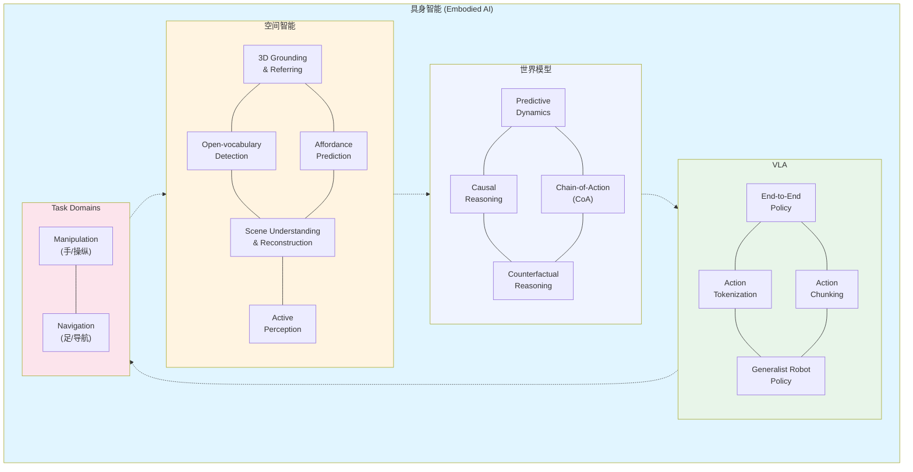

## 今日总结

### 综述横向

- **MoE-Loco** (Mixture of Experts for Multitask Locomotion)：由清华大学赵行团队发表于 IROS 2025 的最新开源工作
- **PIE** (Parkour with Implicit-Explicit Learning)：由浙江大学朱秋国团队于 2024 年提出的一项前沿工作，专门针对足式机器人在复杂跑酷场景下的感知与控制瓶颈

看这两篇，ddl 是周末。

### 多模态大模型 vs 具身智能

参考：[多模态大模型还是具身智能](http://xhslink.com/o/8Y9sYW7roHp)

目前的 LLM/AI 领域主要分为以下几个阶段（参考 `content\blog\2025\2025-12-19-ai-work.md`）：

- **Pre-training**：数据工程（清洗、配比）、基架（分布式训练、算力优化）、架构（MoE、Context、Memory 等）
- **Post-training**：SFT、Alignment（RLHF、DPO）、推理能力强化（CoT、Reflect 等）
- **MLLM**：模态对齐、统一表示、时序理解
- **Inference Optimization**：量化、算子、vLLM 调度/KV Cache 等
- **Agent**：PE/FE、DSL、MCP、RAG、MAS

### 具身智能的四个核心方向

在 2025 年的当下，具身智能已经不仅仅是"Perception, Reasoning, Control"这么简单的三分法了。

#### 1. 空间智能

李飞飞创立 World Labs 后力推的方向。目前的尖端分类还包括：

- **3D Grounding & Referring**：在三维空间中定位物体（"把那个蓝色的杯子拿给我"）
- **Open-vocabulary Detection**：识别训练集之外的新物种、新道具
- **Affordance Prediction（功能可供性预测）**：不仅是识别物体，还要识别"哪里可以抓"、"哪里可以踩"（比如不仅知道这是个"杯子"，还要知道杯子的哪个部位可以抓取，盖子是否可以拧开；椅子的座面）
- **Scene Understanding & Reconstruction**：语义地图构建（Semantic Mapping）、场景图生成（3D Scene Graph）——理解空间内物体的拓扑关系（如"钥匙在电视柜左侧的抽屉里"）
- **Active Perception（主动感知）**：机器人发现视角被遮挡时，主动移动位置来获取更多信息，而不是被动等待输入

#### 2. 世界模型

- **Predictive Dynamics（动力学预测）**：给定当前图像和动作序列，预测未来的视频流（例如：如果我推这个杯子，它会倒吗？）
- **Causal Reasoning（因果推理）**：理解物理规律（重力、摩擦力、刚体碰撞），而不仅仅是视觉上的对齐
- **Chain-of-Action (CoA)**：将复杂指令拆解为物理动作序列。不仅仅是文本拆解，而是带有物理约束的拆解
- **Counterfactual Reasoning**："如果刚才我没抓住，球会滚向哪里？"这种能力对机器人的鲁棒性至关重要

#### 3. VLA 模型（Vision-Language-Action）：端到端的"小脑"

- **End-to-End Policy**：直接从图像输入到关节力矩/末端位姿输出（如 OpenVLA, RT-2）
- **Action Tokenization（动作分词）**：将机器人的 7 自由度或全身运动序列转化为 LLM 能理解的 Token
- **Tokenization of Action**：关键技术点。如何把机器人的连续动作（角度、速度）像文字一样"分词"化，让大模型能像预测下一个字一样预测下一个动作
- **Action Chunking（动作块处理）**：比如 ACT 或 Diffusion Policy，解决动作平滑度和连贯性的问题
- **Generalist Robot Policy（通用策略）**：目标是训练一个模型，能同时操控机械臂、人形机器人和四足狗

#### 4. Manipulation（手/操纵）和 Navigation（足/导航）

目前论文和就业的"两座大山"：

- **Manipulation（最火/天花板高）**：核心看点是灵巧操作和长程任务（Long-horizon tasks）
- **Navigation（相对成熟/业务量大）**：扫地机器人、巡检机器人、配送机器人

> 其他一些我自动忽略了，不是很想去做的，比如人形机器人的 Whole Body Control，Sim-to-Real Alignment，以及一些纯数据工程相关的（尽管这是目前最大的 bottleneck）

### LLM 与具身智能的映射关系

| LLM 阶段 | 具身智能 (Embodied AI) 对应项 | 核心痛点 / 启发 |
|---------|---------------------------|---------------|
| Pre-training | Sim-to-Real / Robot Foundation Models | 物理模拟器（Isaac Sim/Genesis）的数据生成能力 |
| Post-training | VLA Fine-tuning / Imitation Learning | 如何用极少量的**专家示范（Teleoperation）**教会机器人 |
| MLLM | Spatial Semantic Understanding | 3D 空间、深度、触觉与语言的对齐 |
| Inference Opt. | On-device Real-time Control | 机器人需要 20Hz-100Hz 的控制频率，延迟是致命的 |
| Agent | Long-horizon Task Planning | 将"去厨房给我泡杯咖啡"拆解为几百个原子动作 |

### 个人研究方向

而我现在主要就是从具身导航与交互（Embodied Nav & Interaction）这样一个相对较小的 scope 去切入了：

- **Social Navigation（社交导航）**：考虑人的舒适度和社交距离（比如导盲犬不能从两人中间穿过）
- **VLN-Continuous（连续空间视觉语言导航）**：在复杂、未见的动态环境中根据指令寻找目标

> Human-Robot Mutual Adaptation：机器人如何理解人的手势、眼神和模糊指令。

还需要找到更小的 scope 才行。

---

参考：[上海 ailab-Agent 算法-面经](http://xhslink.com/o/AaWBouazT9a)

| 一面 | 二面 |
|------|------|
| 以项目拷打为主 | 项目拷打为主 |
| 项目部署后，推理的流程是怎么样的 | 思维链是怎么构建的，数据怎么来的 |
| 反思验证具体怎么做的 | 思维链怎么检验其质量 |
| Reward function 怎么设计 | Reward function 怎么设计的 |
| 介绍你的 agent 系统，是怎么工作的 | 这个项目中哪些东西是你做的 |
| Agent 实际运行时有上下文问题吗 | AIGC 项目中的数据是哪里来的 |
| Memory 空间是怎么管理的 | Agent 搭建用了什么模块/包 |
| 全模态意图识别怎么做的 | 新建一张 ppt，手写 GRPO 公式并详细介绍 |
| 你微调怎么做的，用了什么库、工具之类的 | 介绍 CLIP |
| 是否部署过模型 | 手撕：单头注意力 |
| SFT 数据集质量怎么评估 | 手撕力扣：括号生成，给定 n，输出所有可能的括号组合 |
| 是否了解大规模 SFT 数据集，例如某些通用的 benchmark | |
| 对于人工核验数据有什么心得 | |
| 手撕题，写一个 softmax 函数 | |

### 面经分析

做不到。简而言之就是做不到。这份面经到底在考什么？

#### 1. Agent 架构设计（最核心）

**关键词**：反思（Reflection）、验证、Memory 管理、上下文管理。

**考点**：考查你是否真的思考过 Agent 的稳定性。Agent 运行起来很容易"幻觉"或者"死循环"，你怎么管理它的记忆？当上下文太长时，你是直接截断还是做 RAG 检索？

#### 2. 强化学习与奖励设计（RL 基础）

**关键词**：Reward Function 设计、GRPO 公式。

**考点**：现在的 Agent 越来越倾向于通过 RL（强化学习）来微调（比如 DeepSeek-R1 走通的路线）。如果你不懂 Reward（奖励函数）怎么写，你就无法让 Agent 进化。GRPO 是近期非常火的算法（DeepSeek 提出），能手写它说明你紧跟前沿。

#### 3. 数据工程能力

**关键词**：SFT 数据评估、CoT 数据构建、人工核验、数据集质量。

**考点**：大模型领域"数据决定上限"。面试官想确认你是否有处理大规模、高质量数据的经验，还是只会用开源数据集跑跑脚本。

#### 4. 底层模型知识

**关键词**：CLIP、Softmax、Attention。

**考点**：无论 Agent 多高级，底层还是 Transformer 和多模态对齐。考这些是看你的基础是否扎实。

#### 5. 代码工程（手撕）

**关键词**：基础算子（Softmax/Attention）、LeetCode。

**考点**：算法岗的基础，逃不掉的。

### 解决方案

也不能不去解决，针对三大不会：

#### 1. 不会手写代码

这是算法岗特有的 ML 算子实现。我的想法是跟着《李沐学深度学习》肌肉记忆以下代码（不限于）：

- Softmax 的实现（注意数值稳定性，要减去 Max）
- Self-Attention 的矩阵运算实现
- NMS（非极大值抑制，具身/视觉常考）
- 简单的 IoU 计算

每天强迫自己手写实现一个算子，不要在 IDE 里写，在白纸上写。

#### 2. 不会手撕算法

这里主要是针对 LeetCode 这种，像面经里的"括号生成"属于中等难度。理论上不需要刷 1000 题，只需要把《代码随想录》或者类似的经典分类题（动态规划、回溯、搜索）刷一遍，掌握套路。

#### 3. 不会手推公式

面经里的 GRPO 和 RL 公式要理解它的物理意义。例如 GRPO 为什么不需要 Critic 模型？因为它用了组内平均。

重点复习对象：Transformer 推导（维度变换）、常用的 Loss 函数（Cross-Entropy）、强化学习基础公式（PPO/DPO）。

找个白板，尝试自己推导一遍从输入向量到输出概率的全过程。

#### 4. 系统设计（项目拷打）

- 画出系统架构图（画到纸上，能讲清楚数据流）
- 针对每一个环节问自己：为什么用这个模型？有没有更好的？如果报错了，系统怎么自愈（反思机制）？

## 技术文档

### 今日论文

不知道是 Zotero 的哪个插件坏掉了，总之调用全文翻译失败，有点糟糕。

### 今日练习

- [Group Anagrams](../../leetcode/group-anagrams.md)

### 今日调研

- [Locomotion MoE Double](../../blog/2025/2025-12-24-locomotion-moe-double.md) 明天接着干，顺带熟读一下这两篇 Locomotion 的文章

### 今日课程

无

### 今日项目

把 cyh 他们同学列的 bug 解决了一大部分，就剩下一个会员卡不能订场的问题，因为没有日志所以有点奇怪。微信开发者工具还没有提交代码更新体验版

## 明日计划
