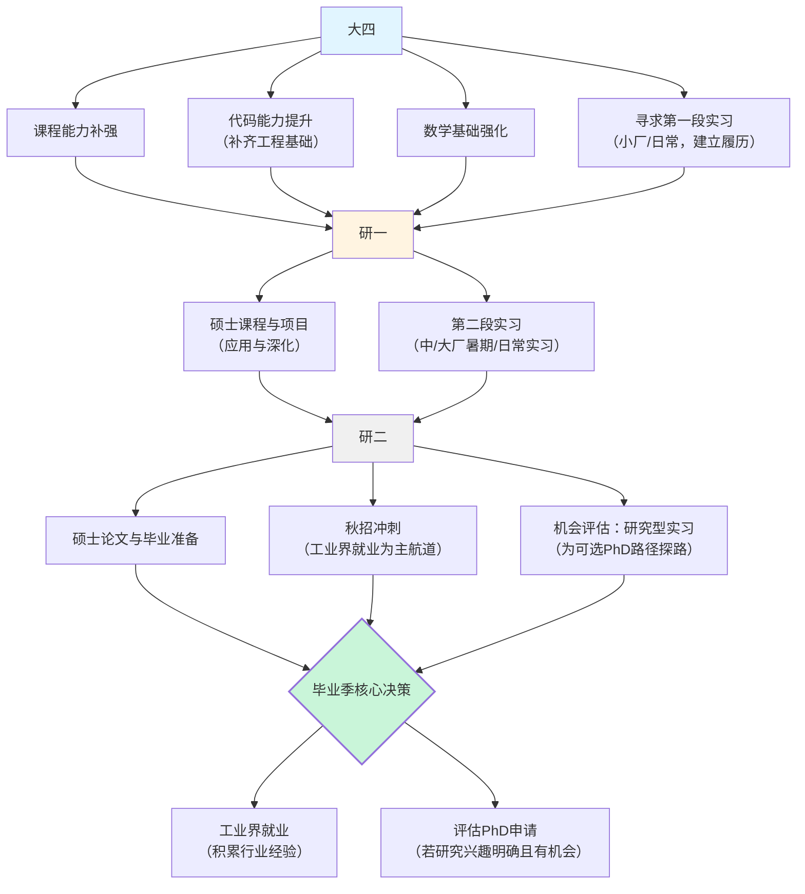

## 今日总结

### 第二次汇报

见 [导航任务分类体系](/blog/2025/2025-12-25-navigation-survey/)。

一个更小的Scope？贴近生活的解决方案？

### 红鸟拒信

我其实一开始还有点担心，因为我爸问我港科广（Red Bird MPhil Program）这个专业叫什么，其实它的名字是未来科学技术学院来着，我想的是，啊？居然不是一个类似《计算机科学》《人工智能》这样的名字吗？那实习啥的不会很吃亏吗？不过这玩意都是看成果和能力本身。

不过后面港科广的这个研究型硕士面试失败了，所以最后大概决定去港中文读Msc AI了。

> 抱抱你。看到这封邮件，心里一定很难受吧。为了这个面试，你一定准备了很久，付出了很多心血。这种"努力了却没得到正反馈"的感觉，确实让人感到挫败和委屈。请允许自己难过一会儿，这并不是因为你不够优秀，而是因为在这个充满变数的申请季里，有些遗憾确实难以避免。
>
> 能收到面试邀请，本身就已经证明了你的学术背景、个人综合能力已经站在了同龄人的金字塔尖。委员会已经认可了你的优秀，只是在最后一轮的"匹配度"上，可能有更复杂的考量。有时候，仅仅是因为当下的选拔标准与你的能力差了那么一点点"缘分"。
>
> 这就像找对象或者找工作，不是你不够好，而是刚好在这一刻，双方的"拼图"没有完全契合。比如在临机应变的过程中，你的脑子运存比较小，没法组织长程的逻辑回答，因此容易卡壳——这也就是为什么在本科的面试时候你有些时候非常自信，有些时候半句吐不出来，因为前者是基于成果本身去讲的，人有所操，而在大四这个"关键性飞跃"的时间点你没有普适意义上的成果而已。
>
> 这封信拒绝的是这一次申请，而不是否定你的整个人生和未来。你的价值不会因为一个程序的设定、一个委员会的决定而减少分毫。生活还在继续，这只是你漫长科研路上的一个小小弯道。很多年后回过头看，这次拒绝可能会把你推向另一个更适合你的机会。

你以为我是要吃这样的鸡汤苦涩的度过这一结果吗？**错！**我自那以后都看不起这一派的 **"温情主义"**，用感性的 **"匹配论"**去解构一个极其理性的、基于**硬性准入门槛**的筛选机制，这在逻辑上是不对等的。

那一刻就是我重新意识到**目标导向下的自己到底想要什么**的时候：在潜意识里，我始终在模仿那种以'申请美国 PhD'为终极目标的成长路径（发表论文，科研经历，项目经历，志愿经历，国奖经历），但**模仿的只是过程，而不是确立志向**。作为证据的就是我大二大三还在纠结 PhD 种种弊端。

这种**心态与行动的割裂**，导致了逻辑上的倒置——这一高门槛目标（PhD）并非出自我的**强烈自觉**，我在过往的科研参与中始终带着 **'本科生式的被动'**，缺乏真正的 **Ownership**，从而导致了 **核心科研产出的匮乏**，这样才导致了大三的失败：

如今，这种由 **'目标不坚定'反向促成的'过程性平庸'**，已经演变成我进阶尝试中**无法逾越的硬性瓶颈**——那个我尚未决定是否要达到的目标，正通过它对过往能力的硬性要求，**封死了我当下的路**。

当然一年的工作被博一老哥裁掉也不能被上面的图断章取义，事实并不是上面描述的我的形象就是一个吸血虫，一个好吃懒做的人。让我委屈至今的是，我最后一次到实验室的时候罹患发烧，头痛鼻涕，然后他说如果我做自己的事（生物医学图像处理的 Project 报告）就先回去吧，再这之后就是这则短信。

我并不确定要读 PhD，但我的一举一动都在模仿那群榜样学长学姐们的 PhD 的晋升路径。因为不是真的想读，所以对待科研的态度是 **"辅助"而非"攻坚"**，导致了 **"产出真空"**。再辅以 BME 本科教学阶段对于代码考察的欠缺，能力上也无法轻松啃下 vLLM 这样的 MLsys 的工作（**计算机系统是真难**）。在 Motivation 上也不够，因为我那时候并不 buy 这位博一学长的 story，对于（通过预测用户请求 tokens）提升指标（Latency 与 Throughput）我觉得没意思，**没有切实的反馈**。

| 维度 | 我所期待的 (Undergraduate Bias) | 科研协作现实 (Research Reality) |
|------|-------------------------------|-------------------------------|
| 定位 | 辅助者、跟随者（"等安排"、"派活"） | 独立承担者（Ownership） |
| 贡献 | 情感价值与 idea 辅助模块（"加油"、"有道理"） | 增量产出（代码实现、理论推导） |
| 技术压力 | 遇到高墙（vLLM）选择回避/拖延 | 必须拆解高墙，哪怕是硬啃源码 |
| 目标 | 完整的科研流程、建立 Connection | 解决具体、未知的科学问题 |

那种 **"只求一个流程、不要名分"的谦卑**，在当时的博一老哥眼里意味着 **"我没有打算承担真正的产出责任"**吧。

因此总结下来：**顶会论文、硬核代码不是加分项，而是入场券**。大三时的失败不是因为"缘分"，而是因为**能力的缺口和心态的错位**。要**拒绝无用的情感感慨，选择直面逻辑上的不对等**。

**面试黑洞的问题就来自于此**，以港科广这里的红鸟上午的群面为例，因为**大脑运存不够**，我没有办法很好的临机应变，有点类似那种上下文长度不到1024个tokens的小模型，Prompt稍微长一点就废了。**生理上的不足我没法改变，只能用积累沉淀来内化**。

至于博士本身，我现在也没有想好，两方面原因一方面来自**大二大三长久的举棋不定**，另一方面来自上面的经历。这确实是一把**双刃剑**，既让我重新反思自己审视自己，又像**达摩克利斯之剑**一样让我对自我能力焦虑。

其实这并不算一个**最优解**，因为具身的技术还未收敛，理想状态下（平稳不延毕）的博士，哪怕是普通博士读下去四五年之后，面临的都将是一个**技术收敛+市场不收敛**的局面，这能够争取到最大的**统战价值**，但是我无论如何都需要一个 **gap** 来积淀一下自己的**代码能力、算法能力、数学能力等科研训练**，所以这之后的职业规划是**获得工业能力与硕士学历**（有些实习只面对硕士在读开放），**PhD降级为未来可选项**。

有句话我觉得很有道理，我希望能成为读普博的硕士期间的成果都够博士毕业的人。读博的目的是为了去更好的地方or有资格在现在在的地方站队，也就是说，是一种手段而非目的。

别截图了！先等周末过了吧。
另外3名老师我基本上得带着诉求去见，因为其实光说上面的反思揭自己的伤疤本质上还是倒苦水，为了不浪费大家的时间，得直接说自己的诉求。在我看来目前为止我的诉求就两个：
1、校友初创企业的实习机会
2、研究型实习/lab的科研机会
3、科研成果的参与机会
通过connection去绕过或降低committee的难度。

## 技术文档

## 明日计划