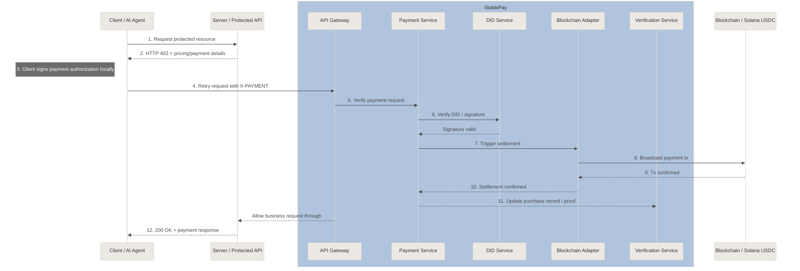
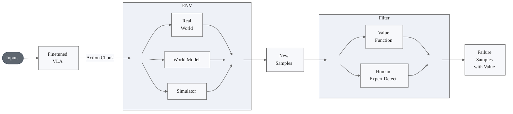
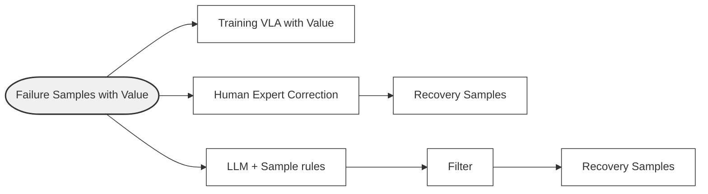

## 今日总结
### Stablepay
#### 注册买家DID
```bash
curl -s -X POST "${GW}/api/v1/did/register" \
  -H "Content-Type: application/json" \
  -d '{
    "user_type": "agent",
    "public_key": "C2vKSxoDErVhhLrKZvXHMmJcNKqKapx9MNQZrDab33vS",
    "wallet_address": "C2vKSxoDErVhhLrKZvXHMmJcNKqKapx9MNQZrDab33vS",
    "wallet_id": "stablepay-bubblevan2-fixed",
    "wallet_name": "stablepay-bubblevan2-fixed",
    "metadata": {
      "source": "ows",
      "sign_runtime": "ows-sdk"
    }
  }'
```
#### openclaw复现
1、检查一下当前你安装的stablepay-agentpay-dev 插件暴露的方法包括哪些，以及当前运行时状态
2、为我绑定钱包 stablepay-agent，地址是 2gL5tHKBp2ZWGX9chgcHFtEqLcwG2GT76CimizqFqXXF
3、通过Solana RPC官方方法查询我的钱包USDC余额，并设置支付限额，自动购买的阈值是0.6USDC，单次购买不能超过10USDC
4、为我注册该钱包DID，我要买下面这个商品：
- skill_did: did:solana:2kZGwkLnVdSxjjNueeUQmqBf3tRKMn7y1bbktRZkJWdR
- default_price_usdc: 1.00
- currency: USDC
如果没买的话(402)就买下来，买过了的话(200)就如实告知

- skill_did: did:solana:7RNToQXAU5KjTx3HAxZB7auvWViD37rN1ByQV7QhqqB9
- default_price_usdc: 1.00
- currency: USDC
5、通过插件方法查询我的钱包USDC余额

6、请从 ClawHub 安装 skill `showmethemoney-pro`，然后告诉我安装结果。
7、请使用 `showmethemoney-pro` 执行 premium action，q=demo。
如果 merchant backend 返回 402，就按 skill 说明完成 StablePay 支付；支付成功后重试一次 `/execute`，然后把最终返回的 proof token 展示给我。

---

stablepay_query_balance 在 README 和工具定义里都写的是“走网关 GET /api/v1/balance，查的是 StablePay 后端口径余额，不是 Solana RPC 原生余额”
查 /api/v1/balance 时，参数要是 agent_did=...，canonical 串是
```
GET
/api/v1/balance
agent_did=<AGENT_DID>
<EMPTY_HASH>
```
然后真正拿去签的是 `CANONICAL + GW_TS + GW_NONCE`
再把签名放到这些头里：
- X-StablePay-DID
- X-StablePay-Signature
- X-StablePay-Timestamp
- X-StablePay-Nonce
而且这个签名必须由买家钱包来做。然而 stablepay_query_balance 已封装了完整的签名链路。
  从代码可见：                                                                                               
  - 描述明确写了：Signs the gateway canonical (DID auth) like pay; not raw RPC
  - 使用了 buildGatewayDidAuthHeaders(runtime, params.did, "GET", path, rawQuery) 生成签名头
  - 和支付流程的网关鉴权签名方式完全一致
  所以调用 stablepay_query_balance 时会自动完成：
  1. 构建 canonical（METHOD + PATH + QUERY + BODY_HASH）
  2. 拼接 timestamp + nonce
  3. OWS 签名
  4. 设置 X-StablePay-DID/Signature/Timestamp/Nonce 头

#### ACK 调试
今天排查半天发现具体原因竟然可能出自云效流水线没有把新镜像真正推到 ACK 上，气笑了，浪费了我3个小时以上的时间
```bash
export NS=zheda-agent
export REG=stablepay-registry.cn-shanghai.cr.aliyuncs.com/stablepay-dev
export TAG=debug-20260413-1519
```
上面环境变量的tag要改的
```bash
docker build -t ${REG}/api-gateway:${TAG} ./api-gateway
docker push ${REG}/api-gateway:${TAG}
kubectl -n ${NS} set image deploy/stablepay-api-gateway api-gateway=${REG}/api-gateway:${TAG}
kubectl -n ${NS} rollout status deploy/stablepay-api-gateway
kubectl -n ${NS} get pod -l app=stablepay-api-gateway -o jsonpath='{range .items[*]}{.metadata.name}{" "}{.status.containerStatuses[0].imageID}{"\n"}{end}'

docker build -t ${REG}/blockchain-adapter:${TAG} ./blockchain-adapter
docker push ${REG}/blockchain-adapter:${TAG}
kubectl -n ${NS} set image deploy/stablepay-blockchain-adapter blockchain-adapter=${REG}/blockchain-adapter:${TAG}
kubectl -n ${NS} rollout status deploy/stablepay-blockchain-adapter
kubectl -n ${NS} get pod -l app=stablepay-blockchain-adapter -o jsonpath='{range .items[*]}{.metadata.name}{" "}{.status.containerStatuses[0].imageID}{"\n"}{end}'

docker build -t ${REG}/did-service:${TAG} ./did-service
docker push ${REG}/did-service:${TAG}
kubectl -n ${NS} set image deploy/stablepay-did-service did-service=${REG}/did-service:${TAG}
kubectl -n ${NS} rollout status deploy/stablepay-did-service
kubectl -n ${NS} get pod -l app=stablepay-did-service -o jsonpath='{range .items[*]}{.metadata.name}{" "}{.status.containerStatuses[0].imageID}{"\n"}{end}'

docker build -t ${REG}/payment-service:${TAG} ./payment-service
docker push ${REG}/payment-service:${TAG}
kubectl -n ${NS} set image deploy/stablepay-payment-service payment-service=${REG}/payment-service:${TAG}
kubectl -n ${NS} rollout status deploy/stablepay-payment-service
kubectl -n ${NS} get pod -l app=stablepay-payment-service -o jsonpath='{range .items[*]}{.metadata.name}{" "}{.status.containerStatuses[0].imageID}{"\n"}{end}'

docker build -t ${REG}/verification-service:${TAG} ./verification-service
docker push ${REG}/verification-service:${TAG}
kubectl -n ${NS} set image deploy/stablepay-verification-service verification-service=${REG}/verification-service:${TAG}
kubectl -n ${NS} rollout status deploy/stablepay-verification-service
kubectl -n ${NS} get pod -l app=stablepay-verification-service -o jsonpath='{range .items[*]}{.metadata.name}{" "}{.status.containerStatuses[0].imageID}{"\n"}{end}'
```
#### 插件与技能发布
```bash
clawhub package publish . --family code-plugin --name stablepay-agentpay-dev --display-name "StablePay OpenClaw Plugin" --version 0.3.11 --changelog "change gateway to aliyun" --tags "payment,solana,blockchain" --source-repo "Bubblevan/openclaw-plugin-tryon" --source-commit "$(git rev-parse HEAD)"

openclaw plugins install clawhub:stablepay-agentpay-dev@0.3.11 --force --dangerously-force-unsafe-install

clawhub publish ./skills/showmethemoney-pro --slug showmethemoney-pro --name "showmethemoney-pro" --version 1.0.2
```
#### 真实调试
```bash
curl -s -X POST "https://ai.wenfu.cn/api/v1/did/register"   -H "Content-Type: application/json"   -d '{
    "user_type": "developer",
    "public_key": "4p8F5YAJM8fdrNyvWfb3p6XHx8rboFVV3xn279VXo2j7",
    "wallet_address": "4p8F5YAJM8fdrNyvWfb3p6XHx8rboFVV3xn279VXo2j7",
    "wallet_id": "0e2bce2f-4783-427a-8afb-8ca591653add",
    "wallet_name": "stablepay-skill-seller-1775647480",
    "metadata": {
      "source": "ows"
    }
  }'

curl -s -X POST "https://ai.wenfu.cn/api/v1/did/register"   -H "Content-Type: application/json"   -d '{
    "user_type": "developer",
    "public_key": "6vhFRAY7FBruLdvtztAUfne1F77aFsVCHhwPuu4JAoox",
    "wallet_address": "6vhFRAY7FBruLdvtztAUfne1F77aFsVCHhwPuu4JAoox",
    "wallet_id": "6789e5dd-5ac6-4898-8cbd-945328b9fd3e",
    "wallet_name": "stablepay-bubblevan",
    "metadata": {
      "source": "ows"
    }
  }'

curl -s -X POST "https://ai.wenfu.cn/api/v1/did/register"   -H "Content-Type: application/json"   -d '{
    "user_type": "developer",
    "public_key": "EBv2e3SjceE6dkxSs5qbbhtFVvsrux5dgmM2cAJw9RsF",
    "wallet_address": "EBv2e3SjceE6dkxSs5qbbhtFVvsrux5dgmM2cAJw9RsF",
    "wallet_id": "cfa4161c-68c4-4e28-919b-a3c9dfb56d32",
    "wallet_name": "stablepay-bubblevan2",
    "metadata": {
      "source": "ows"
    }
  }'
```

#### 架构图非完美复现

### ZJU具身大学习
我认识的在大厂的。感觉每天都战战兢兢的。
心里压力都比较大
感觉这种都是分级虽然文字上看起来明确，但是实际上在组内执行的时候，主要看mentor
mentor自己承担多大压力，以及他给你分配了多大压力，以及他为你能兜底多少内容
以上的共同决定了，你是实际上处在1-2 和 2-1的归一化区间（0~1连续区间）里面什么位置
是这样的，开发岗还能好一点，算法岗尤其是大模型相关的算法岗（也包括具身哈），基本上都是8个月一个交付周期，4~6个月的时候，看着做不出来了，就可以收拾东西走人了
整个8个月的交付周期，中间还有各种交付小节点，压力蛮大的，但是薪资确实很夸张
一分钱一分压力
我们组做交付 现在组内老师还在加班
模型还有炼丹的压力，要是炼丹不成功就更惨了
创业公司是这样的，尤其是刚起步不久的
这种东西玄学不可控啊，咋搞
其实还好，现在的大模型基模能力很强，大部分post training loss曲线的收敛都很稳定
需要对大模型预训练的人事很少的
大规模预训练的时候，也可以不断关注Loss的情况，来中断和resume继续训练的，所以超参这个现在不是难搞的东西了
就没有模型设计本身不是最优，但又想不出更好的设计方案的时候吗
会有的，但是这个和“超参玄学”“炼丹”没啥关系
我感觉除了顶级基模组 其他你只要策略保守一点炼丹效果都能完成
像具身这种 只要数据好 用啥模型结果都不会太差
而且说实话，顶级基模组也是遵循客观规律的在干活，比如有一个非常nice的想法，对模型修改很大，但是也会用这个想法的最简实现（极致阉割版）在原有的模型基础上进行改进，然后看效果，效果好了，才会继续往下吧想法的剩下的部分一点点补进来，每补一点，做一次实验，然后迭代出来一个还算solid的工作
所以整个过程会非常追求可控和可解释可分析和可追溯
因为是从一个验证过的baseline上出发，保持过程的可控可追溯，所以就不会让模型训练的时候“跑偏”，即Loss grad 大幅度震荡
头疼的是模型效果不好，又没想法
那是真痛苦，然后最最痛苦的是，各种训练指标很好看，实际部署的时候，效果不好，这种最难搞，可分析的手段太少了
我一个朋友说 LLM 里面有很多人研究 训推不一致问题的，我感觉具身后面的时候，这个问题也会成为热点topic
我们一般激进的idea让实习生去跑 跑不通实习生跑路就行
还是得说，具身算系统工程。越做越觉得全栈能力挺重要的。
能有源源不断的idea去尝试也还好，就怕尝试完所有idea后模型效果还不行
那做啥
我倾向于觉得具身现在还得做范式创新
老vla
这是常态
经典vla根本不work
那最后做不出来咋搞，走人吗
直接follow新sota
实习生多换几个地方实习不是挺正常的
我感觉后训练更重要 很多失败case就是 比如瓶子掉了他不会去捡 呆在那了
但是后训练只能暂时的解决问题，其实就是把ood给拿到ind里来
总不可能每次遇到一个新case就后训练一次吧，还有参数遗忘问题
能在一个task上达到99%就可以落地了
泛化那是下一步的事情
嗯嗯，如果做类似于task specific的，后训练还是给力
现在问题是 一个普通工人的岗位 vla都很难做到99%
wm这边也不行
可能wam泛化稍微会好一点
maybe视觉泛化好一点
哈哈，一般不会让实习生去跑，除非是已经lead过 或者 交付过项目的实习生
pi05 不work么？
为啥 探索性的可以接受失败 要交付的那必须成功 就得正编干
language follow有点差 我一直觉得可能是基模不行
ailab的一个同组的同学，去了seed robotic里面了，基本不会让他碰核心代码，甚至仓库都不对他开放的
原因一，防止出现代码泄露事件，seed之前出现过
原因二，让你去探索，需要给你分配更多的资源，不然你没有任何探索的本钱
原因二补充：字节这种以盈利为驱动的企业文化，导致科研探索部门，能分配的资源是有限的，所以不会那么支持实习生
原因三，投资实习生探索是一个收益很低的事，先不说能力无法保证，最重要的是实习生的利益诉求和目标与公司or部门的利益目标有很大程度是不一致的
其实我觉得真不能小看数据处理和数采 对结果还挺重要的
他主要在里面帮忙搭建训练pipeline，然后起训练服务和看表
具身洗数据做成熟的，我猜也不多
有时会帮忙分析一下idea和实验结果
就是各种task到底需要什么样的数据
seed里面洗数据的是专门的一拨人在干的
管的好严
具身探索 给个16张卡就行了吧
符合字节的企业文化，我mentor之前走的时候，还面过seed robotic，后来没去，虽然给开的很多，但是他打听到张一鸣是没有“机器人梦想的”，典型的企业家思维：啥赚钱做啥，所以不会给太多的资源到robotic的部门
你，去把robotw刷到98%
啊？肯定是要训基模，才会让你的身价水涨船高的啊
确实啊
200 张 H200，应该是搞基模比较中等的配置
pi05 from scratch要多少张
需要那么多吗
需要
这是训啥的基模啊
wam 64张就够了
要是做单一任务场景不用这么多吧
我们组之前是112张H200 + 300张A100
吓哭了，什么实习生拿200张哇
搞得也很慢
robotw那点数据又不多 
pretrain是需要很多卡的，batch size基本都是1024
如果是后训练的话，确实不需要那么多卡，比如做一些小一点的research
开梯度累计
就是训的慢点
实习生嘛 一个月等得起
梯度累计的本质是时间换空间
pertain会特别慢
现在具身pretrain真的有提升吗
但是这都说远了，对于一般的实习生不需要pretain
vla一训基本全都忘完了
去年12月的时候，我也认为预训练没什么用
也看你分辨率多大
真机是有用的 
robotwin不需要pretrain也行
我感觉肯定吧
但是最近我们组内在研究pi05的预训练，发现了很多令人深刻的结论
generalistai
第一条就是好的预训练，对于unseen 下游任务的收敛和表现，十分的重要
还有就是随着通用基座越来越强  具身pretrain重要性也在下降
第二条，就是越简单的tokenizer对于任务的帮助越大
这个非常赞同
这也是为什么要用FAST的tokenizer + 离散动作序列 和 flow-based aciton expert的动作序列 一起训练
其他还有一些华点结论，不便多透露
还有就是对pretrain的定义  一万小时跨本体cotrian 我认为也是pretrain了
因为组里有同学在做相关的research
本质是和LLM的tokenizer表征保持靠近，甚至一致
非常合理，那能不能直接结构化文本呢
本质是模态对齐的程度得到了提升
组里也有同学复现lingbot-VA，发现在预训练数据中的unseen task上，lingbot-VA finetune后的成功率很低，但是pi05 finetune 后依旧非常稳定
失败case是怎么样失败的？
但是generalistai 公布的GEN-1技术细节太少了，我个人觉得很难验证其真实性
基本不会，其他公司也面临商战，而且其他公司都不傻，大家都在公开一部分技术细节保留一部分技术细节，但是gen-1几乎没有公开技术细节
动作抖动大，且有时候会陷入停滞
空间定位能力差
我倾向于认为vla学的是轨迹克隆
至少目前
那不说白了 benchmark图一乐 真机表现自成一派
肯定啊，现在vla把llm部分去掉，vit直接接action expert都差不多
去年12月的时候，我们也是这么看的，但是最近有了改观，VLA很多人没有关注如何挖掘VLM的能力，比如尽量让新的模态表征要尽量对齐LLM，就可以让效果提升很多
我们这边也有train lingbot va的，ft之后感觉没有抖动 空间能力差这么离谱嘞，但是我没自己复现过
pi05的很多致命华点就在文章里面，推荐可以细读，我们跑了很多实验，最后还是发现pi05在finetune后的效果最好
这个顶级idea，但我更感觉是大家其实注意到是vlm的模态对齐问题，只是做不出来，只能在rl上面搞东西
可以试下lingbot-VA中预训练数据中不存在的任务，比如我们有一个化妆品装包
哦，应该确实不是unseen的
回头有机会我试下
稍等我找个视频给你发
比如这个任务，lingbotVA完成的很不好，尤其是拉拉链的这个操作
这个是我们的模型的效果
robotics是需要这种工程能力的，但是以后万一无敌的基模出来了，不知道。。。迷茫～
佬，请问有没有什么多模态对齐的文章或博客推荐，这一块一直搞不太明白
Mind the gap，这个偏奠基性的文章，可以读一下，我最近也在学习，不过我主要精力还是提升下游任务的成功率和鲁棒性，以及吞吐量，所以在看offline rl
最近看了RLtoken，挺好奇他们为啥让RL的actor直接输出可执行的动作，而不是像以往直接输出残差动作，不知道有什么优势
简单化稳定化，现在所有的RL的算法其实都在趋于这个就是越简单越好，然后越稳定越好的这个方向在做，但是这个不是我的结论，这个是我和就是AI lab这边有一个做R的大佬。那那个大佬非常强，他应该是个三十五六岁的一个哥。然后这个哥他已经做I非常多年了，然后也是科班儿出身，然后做做这个现在做巨神的IL非常猛。然后我跟他交流的过程中，他跟我说现在所有的这种。V+L的算法在R、L侧都在趋于一个简单化、鲁棒化的一个趋势。然后I token的话，它本质上就是那那个大佬，他说I token其实它本质没有什么创新，它只是一个捏合的工作，只不过是派这个公司，就是philosophy AI, 它发出来之后，大家对于它的这个有一层这个滤镜。就是有相当于有有他去背书，所以说大家看这个l token感觉挺惊艳的。但是其实这个工作他其实没有太大一个创新，他用的这些算法什么其实都是之前的对吧？你看他用的SAC，然后包括他。做这种工程的优化，就是只采最后那个关键阶段的那个窑槽，或者说这关键阶段的这个dagger。然后其实那个大佬是VRAC的作者，就是翟少恒老师，他VLAC是派0.6的一个引用文章，对这个这个分量确实挺强，然后跟他交流下来就是觉得。第一点，就像我刚才说的，现在所有的R算法越来越趋于简单化，这个原因就是基模的能力越来越强，它会收敛的更快，因为本身原来R、L的这个算法是需要很复杂的设计的。然后，包括reward也是，然后现在的话，就是因为基模能力足够强了。基于这种，就是steering的引导式的这种IL，其实算法应该越简单越好。然后第二点，他觉得有几个本质的工作，就是本本质的一个topic，现在是VRA+L的领域，应该关注的一个就是language following的一个能力。然后还有一个就是说利用负样本学习的一个能力，前者是在解决探索效率的事儿，后者在解决这个样本效率的事儿，就是拿到样本之后，我如何去提高他的学习效率。
rlt 不是td3嘛
我感觉现在的rl都是dagger，额说白了就是后训练启动器
文章里写的是TT3，但是TT3它是他的这个loss的方法。
现在做人形和做操作的感觉已经是两派了 操作两个臂硬件很成熟
感觉理论上来说生成残差动作训练起来会更容易
他那个insight在于把vla的知识蒸到一个rl token里，就可以去训一个actor critic了
主要是低成本的ac训练

在机器人里面还挺新的

是没什么创新，但是有insight
你看他其实就是model based rl那一套
pi最后也会收敛到world model
你看他就是拿vla的先验去train一个actor critic，model-based rl是拿wm去train一个policy


这个是去年年底画的图，就是在派0 star和rice，就是K0的后训练的RL版本上。然后出来之后，然后画了一个图，整理了一下，就大概是整个流程都都是类似的。包括后面RT出来，其实也是这个流程，只不过可能里面的environment换一下，然后filter换一下。
但是目前做绳驱的好像还是很少。不过我觉得可能最重要的还是大脑。话说机器人除了替代普通人的工作，有没有什么增量场景呢，就是比较有市场潜力，既能让企业活下来，又能让普通人不丢掉工作的增量
我们这边复现pi06效果和dagger差不多 所以我感觉极致简单就是dagger启动
现在很多机器人走的就是替代存量的人力。
pi06我第一眼看完第一反应就是dagger
从最先的serl、serl-hil系列开始就在dagger
就是做这件事的
所以我下一步想做的就是wam+dagger
可以看看imitation learning的理论，rlhf一定程度上做的就是安全高效的dagger
或者说irl/ail
可以了解下RISE这篇文章，类似的思路
单纯learn from demo，offline的learning受distribution shifting和compounding error影响太大
有了
是的，rise
液压驱动特点是力气大成本高，伺服电机驱动特点是精度高成本中低档
其实world model本身就是rl的人提出的
rise是acwm路线吧
RISE就是我画的这个图里的env选择world model，filter选择value function，最后training with value
wm本身不输出policy
用wm当simulator靠谱么
这篇irl+wm结合的，也挺有意思的
这是我们的研究
就是目前任务设置很简单
我爱irl
https://uwrobotlearning.github.io/mpail2/
图里看到了哈哈哈
个人认为不靠谱 sim2real gap还没解决，wm能不能蒸馏policy二说
字里行间都看得出来是il人了，好帅
感觉wm作为先验在线改善ood也不是不行，我之前做了一下尝试，可是我太菜了，效果很烂
wm路线也很多 纯生成 还是仿真+生成 要不要考虑物理dynamics 都还没统一
去年感觉涉及到wm的工作 主流就这么用的 
老老实实遥操去吧 别净想着偷懒
遥操作业界一般是怎么实现的
用vr或者主从臂吧
群佬有做过遥操的嘛
如何评价可遥操的wm
两者交互
vr问题是采集数据如果是包括gripper 7dof，ik反解，可能有双臂协作，难一点的任务完成不了
主从臂会好一点，低成本可以看看gello
rlt那个玩意，有没有大佬看看这个
For the screw installation and zip tie fastening tasks, wefirst start the RL training in the critical-phase setting only. Wethen advance to a full task phase, first running the base modelto complete the non-critical phase of the task, and switchingto the RL policy when the critical phase is reached. Thistwo-phase training strategy improves training efficiency whileensuring the RL policy is robust to the initial distributionsinduced by the base policy on the earlier part of the task. Wereport the policy performance after gathering about 5 hours of data.
这一段有一些是两个部分缝起来的感觉
感觉类似于现在的智驾
用过PICO 感觉PICO做的相应的包比较好 但是控制的realman真机效果有点小奇怪 不知道是不是realman的求解器有问题
Gello对于真机的安装形态要求高嘛xdm 想要搞一个 有没有商业化比较好的
0.6 model card里面有一些其他东西的，论文没说model card说了，一个分辨率到448一个可以多一个相机
而且他用的是td error，我测试来看感觉用td和他看起来critic的value function看起来是pre train就训了一个可以用的很有关系
我直接sft的话，看起来是mc会好很多
mount位置不影响的，主从一样mount就行了，好的商用不太知道，如果会机械的改打印机适配不同机械臂应该是最低成本的
我发现wam里  policy收敛了  视频生成都没完全收敛，所以ACWM路线 先做视频生成收敛再去做policy rollout是不是有点绕远路了
换换任务试试呢

### 运控综述
- 补充RL部分的架构发展图
- 将HIMLOCO补充在了DreamWaQ中进来，参考[ChatGPT对话](https://chatgpt.com/c/69dd33a6-76d0-832a-9311-a500285da8a8)
- 晚点汇报进度

> 找不到idea的话就直接去找张算了
### 本科毕设
5.16前上传本科毕设Paper
## 技术文档

## 明日计划
