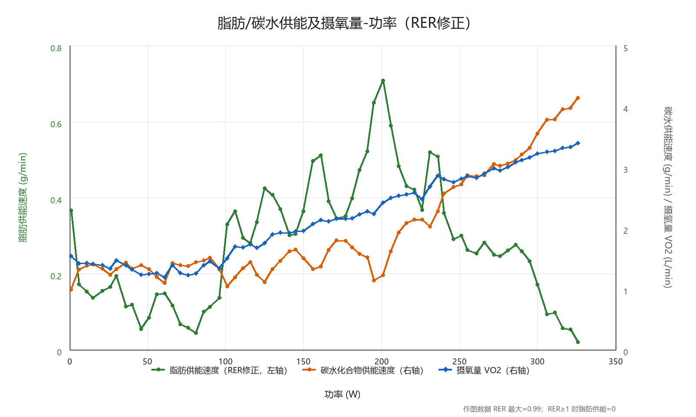

## 今日总结
### 具身大学习
#### 具身的发展与收敛
```
无敌了
生数科技前两个月才完成20亿人民币融资
突然让我不是很想搞具身了
未来几年肯定厮杀成血海了
淘汰率90%+
xd清醒
生数的技术负责人挺牛的
下一个智谱的感觉
朱军确实很有名气
融资多的，好多都是清华的
几年前的新能源
感觉清华具身这一块是 投资和下场创业 集体抱团
[破涕为笑][破涕为笑]
生数技术确实好啊
大模型和具身这波让我感受到清华确实还是有点东西的
相当有东西呀
有种厚积薄发的感觉
生数主要用于干嘛
感觉普通人用不到
灵心巧手我看融资也挺高的，但没看到有自己的具身模型，他是偏硬件的？
一个同学在里面，他主要是做视频生成
灵心巧手我还挺想让实验室买一个让我玩玩的
实验室做灵巧手方向的不多，不过我比较看好这个方向
我有一些不同的看法，因为新能源汽车这个行业，相当于诞生之初，就是进入到了工程化落地的进程中，所以短短几年内，就已经市场相对成熟，目前车企逐渐收敛
但是，具身这个行业，2年内都很可能不会开启工程化落地的进程，而一直处于科研进程中，这样的时候，就会导致公司百花齐放，而没涉及到关注成本、效率、产品力的时候，还会有很多公司活在市场上
因为说实话，新能源汽车，诞生之初，技术门槛不高，而且有很多造车的经验可以借鉴，是一条“目的地”相对清晰和固定的工程化之路
但是具身的“目的地和路线”是不清晰和不固定的
所以我判断未来两年仍然像一个新生儿，体内的细胞快速死亡与重生，也就是新公司和死亡公司都会很多，处于一个流动的过程
我也觉得会有一波波倒闭和初创潮[捂脸][捂脸]现在行业落地太混乱了
现在已经估值上百亿的中场估计是最痛苦的
真的不会再过2年做不出来就泡沫炸了吗
ai 大模型先炸
感觉离具身智能进入家庭还有很久啊
哇兄弟 进入家庭可太远了
会炸，但不会全炸
llm 可是已经盈利了。
工厂都落地不了
进入家庭确实太远了，进入工厂就不错了
Ai大模型起码已经落地很多场景了
LLM是这个时代的核心，具身只是LLM发展的一个产物
太真实了
所以我比较相信的是，具身仍然会长期存在，且不会太落寞
现在就高校研究，舞台表演
因为LLM不会落寞
所以我还是赞同之前群里哪位说的，具身接下来最重要的就是工厂落地场景
另外就是出海
所以具身就不会，因为具身相当于是是LLM发展的产物
出海能解决ce认证的问题，其他都相对小事情
我觉得先进入酒店比较实际
酒店叠叠被子
收收毛巾，动作还算简单
这就太不划算了
只是工厂里面的少部分场景，这部分场景的核心特征是“有安全风险、对人健康有害、工作条件艰苦、难以招人”，这个也是我和Genesis AI中国区负责人张时深入聊了2个小时共同认可的结论
下一步我觉得看谁能拿到更多工厂的订单了
就像LLM比谁能拿到更多coding需求一样
可以关注下车企跳出来的具身公司，这部分订单比较多
有些特种场景对硬件要求很高
确实，尤其国内，这是真实的需求
海外人力成本更高，劳动力素质较低的地区也可能会有真实需求
海外人力成本高，其实也算是能出海的充分条件
国内找到必须要用具身机器人去做的场景还是比较难的
给大学生开个实习证明有的时候都能解决需求
嗯，最起码短期是找不到那么多真实需求
所以企业本身国际化背景我觉得也比较重要的，需要海外名校的PhD，国内海外学习工作的人开拓
拿到足够的订单，撑到2030年
（也可能更久）
难绷
现在一些小公司实习就是不给工资
人还是太多了
这个太变态了
dnys
要说需求
陪伴型机器人
有搞头[旺柴]
这个我觉得有点太花头了，虽然长期来看我来西湖就是为了做女仆机器人的，但现在炒这个概念有点太急了
前段时间好像出了个什么文件
约束了陪伴机器人
而且我怎么感觉这东西不适合在国内做呢
可能也得出口转内销，等风向变
确实
其实这么看来似乎也没看到很match的落地场景
资本真能支持到跑通的那一天吗
想做落地来我们这啊
可以的，这个大家都相信是能落地的，只不过对于具体的初创和事业部的团队来说有不确定性
佬做的是哪个领域的落地
佬做的是哪个领域的落地
[苦涩]真想来了，鸽过了还能来吗
谁在相信落地
为啥我不太相信了，我感觉过两年我可能得转行
挖掘机和推土机
现在的不靠谱么[发呆]
网易啊
一年几千万营收
```
#### 人体健康疲劳管理
```
哥们 mmt吗
强度听说非常人可及
包的
摸摸头一年抵人间三年
mmt什么水平
行动起来
差点去了
快上市了是不是有机会
这是在修仙吗
据说现在不是了，现在强度还比较亲民
曾经非常夸张
我的那个组有人脑血管爆了的（这是委婉说法，其实就是脑卒中）
我倒是比较好奇这几个股东为啥脸型都还算正常（理论上压力应该巨大，人均碳水脸），可能私人健康师发力了吧 [旺柴]
主要是钱养人
抗压是有技巧的 [旺柴]
疲劳管理是运动科学里很重要的 topic
可惜大部分现在打工人没看过
领导只要结果，不懂疲劳管理的
其实应该把领导看作是自己的教练。如果水平不行要把自己练废了，就要及时更换。
我这几天看了几个 HP 的轴
- HPA
https://en.wikipedia.org/wiki/Hypothalamic–pituitary–adrenal_axis
- HPT
https://en.wikipedia.org/wiki/Hypothalamic–pituitary–thyroid_axis
- HPG
https://en.wikipedia.org/wiki/Hypothalamic–pituitary–gonadal_axis
- Hypothalamic–neurohypophyseal system
https://en.wikipedia.org/wiki/Posterior_pituitary
内分泌的
要看英文的维基页面，可以机翻
英文页面最全
比如昨天看到 HPA，压力应激的时候，HPA 会把免疫系统关掉的 [捂脸]
直接明白了为啥之前压力达到应激的时候就发烧
十点可以不睡，但是十点不要开会 [Doge] 开会要激活交感神经的，这个不利于能量回复
除非允许 cue 到之后可以再复述一遍问题来着哈哈哈，那这样也可以。
晚上尽量别运动这倒是真的，因为啥运动即便是脂肪氧化，也会激活交感系统，不利于睡眠的
运动完了交感系统要过一段时间才能镇静下来
全完了
基本十点才练完
下班到健身房已经七点钟了怎么办
练完吃快碳
可以降低皮质醇，防止晚上睡不着
当脱脂牛马好累[Emm]
下班之前去[旺柴]练到七点下班
我自有妙计
骑自行车去健身房要半个小时 再别说了
太牛了
专业
这是真有用
可以看看吗
直接搞个台子，骑最大脂肪氧化啊
台子好，手机放上面还稳，可以看课
边骑最大脂肪氧化边看课，效果比坐着看要好
实则是骑共享单车去健身来的
因为开骑之后，交感会被适度激活，晚餐前刚好抵消饥饿的负面影响。脂肪供能通路也激活了，糖原可以留给大脑用。
最近就复习 silver 的 rl courses ，温故而知新
最大脂肪氧化是小车的一个模式么？还是得自己慢慢调速度过去。
看绿线，平滑之后应该是一个倒U形曲线，会有一个峰值
这个对应的横轴（功率）就是最大脂肪氧化功率
```


#### 依旧读博
```
浙大海宁适合读博吗 好毕业吗 人工智能 计算机通信方向
上班上的
累趴了
[失望]
西湖大学联培呢
这些比浙大紫金港玉泉的 好毕业吗
[捂脸]
工作了再申博容易吗
没联培了吧
读博别问学校，问人，如果还不理解，那建议别读，上班可以赚钱
[可怜]
没联培了
毕业看老板吧
读博真比上班轻松吗
读博不更累吗？
你不如找一个不加班的工作去上班呀。
[可怜]
bur现在多想不开读博啊
去港校读phd
很多funding会是公司给
想读先申申看呗
我感觉博士也越来越难申了
卡不卡工作一年呀
拿到手再考虑去不去
OK
[失望]
好像是求职群 问错群了哈哈
我是申不到好博，好老师都看不上我，还不如工作
现在的具身博感觉也是卷的一笔
我之前申的时候0个老师鸟我
虽然申的不多。
嗯，我就是这个意思，名额很少的
说真的，想法还停留在去哪个学校读博，不适合读，自己先调研完再说
想问问海宁和联培情况[捂脸]
那也不完全是，学校给的钱也不一样，导师有的时候外面判断不好
主要是想了解下海宁和浙大本部是不是都是盲审
我是海宁的
但不了解这个专业
不是说扩招很多么一届5000啥的
看趋势盲审越来越严了，浙大本来就很严
具体到想去的组，人家也没扩啊[捂脸]
读博这个事情感觉还是要好好忖度啊
有点赌的成分在里面
还是看组，最重要的就是这个，时间太长了
名额都去哪了
读博后去
```

#### 依旧加班
```
内推一下智元机器人[旺柴]
投递链接：https://agirobot.jobs.feishu.cn/s/vn21shHxXbM
听说干到晚上12点，属实嘛[让我看看]
具身初创基操吧
没这么轻松[旺柴]
没那么早下班
强度这么小
小小实习生可以按时下班，我的mentor抗压力
内推一个给1w吗
那必须给他产出了
我隔壁哥们来了一个月就走了[吃瓜]
不知道是被挖走了还是受不了强度
正职
那还挺好，没给竞业
太狠了
按时是几点[旺柴]
弹性打卡：如果是早上8：30打卡晚上6点下班
早上9：30打卡晚上七点下班
[破涕为笑]智元到底有多少我浙的人
感觉全是
智元有全世界的人
我们组好像只有我一个[睡]
智元有2000人了吗
jrm，如果可以分别选择提高个人缴纳的公积金比例，也能选择降低社保基数，这俩有啥影响吗，怎么搞比较好
真的假的，我当时面，那个面试官直接问我能不能加班了，平时10点起，周六能来更好，演都不演了
可能我mentor人比较好，没问我加班的事情
社保交的多，退休金多
我实习生的工号已经3千多了
这么多人了
好家伙 反正当时hr和面试官都画饼说hc很多的 转正很容易 然后能不能多实习一段时间（意思是别急着回去秋招）
来了发现实习生真的多
现在每天还有入职的
我想问下，智元现在是打算走什么路线
现在很多公司都是招实习生和外包
感觉他们这个路数不是很看得明白
我和创始人说我缺人
她说实习生外包随便招
我之前的公司，实习生比正式员工多
笑死我了
我知道小红书有个组 正职七八个 。实习生三十个
有人面过破壳机器人吗 
小公司 软件团队就几个人
这转正率怎么样
小鹏吗
感觉demo还可以 优化基建都有的看起来
实习生比正职多不是很正常吗
我们1：1
确实，很正常
缺人是这样
智元3000多人，大公司来的[发呆]
智元有多少卡啊？
这么多人了？？
感觉已经不能算初创了
中厂了
现在市面上千卡的公司都有哪些啊
这个软件团队包括算法吗？
还是说算法全是 harry 老师的学生在做 [旺柴]
不包括算法
```
#### 算法讨论
```
懂不懂挖掘机技术的含金量啊
佬带带我们
我去，真是挖掘机
挖掘机技术哪家强
中国杭州找网易。
今天他们还开源了个 simulator
https://github.com/LoneWolfDog/hydrasim
非常 graphics
具身的操作数据并不能对挖掘机有用
这个角度上讲 ego其实也很扯淡
开挖
egovla 这块，大家看好吗
要么就是需要很牛逼的技术来洗干净
不然分布差太多感觉没用
目前没有一个工作是能证明ego data可以独立pre train or post train的
我们最近做pretrain的时候，发现了市面上大家对于这个问题都避而不谈
去做co train with robotic data是有效的
danfei xu 他们貌似在 all in 做这个，不知道路子是什么样的
ego数据纯噪声。
应该没有任何一家训work了
egowam来了一句，cotraining doesn't work 
那egoverse egoscale egobridge dreamzero 在干什么
无奖竞猜下一个给danfei egoxxx的词是什么
另外有个很有意思的是 纯action diffusion也能work的不错
RL100
那有rl，不管
我觉得整个几层mlp，sac from scratch，都能work
RL 本质是 让模型区别化学习不同价值的样本

进而将上述的本质拆分成三个问题：
数据从哪里来  -- Data
如何评价数据的价值  -- Value Function
对于评价后不同价值的数据进行学习 -- Learning

这个是我准备做Offline RL的核心出发点，要做一流的infra和数采管理，就有一流的场景可部署模型
这是我最近总结的
大家感兴趣的，可以随时来讨论
其实做到这一点也不一定非要rl
rl的话这奖励是不是有点稀疏了
最近想奖励函数已经想脑力竭了
如何理解“这一点”中的点呢？以及除了RL外，是指做数据工程么？我理解offline RL本质上就是一个数据工程的底色，online RL在多数场景确实并非必要
试下来value model本身要做泛化感觉跟action难度差不多
而且value真的好难打标[捂脸]
但是offline RL我认为对于这些场景是必须的，我在JD这确实和很多公司合作交流过，也深入考究了他们的针对单一场景的千级别小时的真机数据，但是发现只做数据工程会导致实际部署中的concer case出现评测震荡
能不能下次在上班时间讨论
评测的方式是什么
哈哈哈，人在还公司呢
还没下班呢
现场产线评测
这才几点
exactly
value确实很难搞，我最近在研究进化算法，找验证器找的头疼
有value model为什么不直接mpc了
世界模型
很难评估哪个fitness高
走访过一些产线，他们采了很多单一场景的真机数据
rl也是这个问题
我理解pi就逐渐在尝试把rl做到pre train/test time里吧
PI07是在尝试
我之前在做这种，pi0.6那个-1  -c  和 0可以层进式作为两个v头，甚至online次数也可以，不需要额外标注，这种dagger肯定是可以模型性能提升的，只是怎么样设计v模型训练收敛更快，数据online rollout更少
星动纪元貌似有点东西
我们最近就是和他交流比较多
有在关注 cosmos3 的 uu 吗
大哥能展开说说不
online次数指什么呀？
我arxiv挂了，介入数目这个当时没有work还在试，本来是想最3 v头
-c是啥
如果有兴趣可以私聊什么的?
pi0.6reward设计
reward to go吧
是失败给很大一个penalty
online rollout样本效率问题是不是hil sery是best practice了
某种dagger
我个人理解是，不一定对，hil serl都是q learning吧，应该是value只关于s，q就关于s，a了，q难训练好多，毕竟需要sample出action,但主要是这个可以超出人的数据本身，可以训练over demo数据，v只能说推动分布到v高的地方，q就可以超过demo数据了
题外话 rl100有什么启发
有没有人跑过瑞信微的板子部署大模型
求指点
跑过阿加犀的板子部署过
rl100是pi06之前的工作了吧
rk3576
deepseek 
qwen蒸馏1.5B
其实很好理解rl为什么work，你用online数据去训比offline demo会更好
我读研的时候玩过
语音对话
数据分布cover的更广，而且他还有一个model/critic去指导
rk3588也行
zeromq玩微服务
后训练本质上在做数据增强嘛，只是rl onpolicy sft offpolicy的区别
是性能资源问题吗
llm那边所谓的opd 不就是这回事
pretrain有时候是cjb
真work还得靠rl
训的不好就是cjb
但是rl work 我们要foundation model做什么呢
multitask需要
参数越大越吃的下数据
hil serl就是rl from scratch
我觉得还有reward model可能是个伪命题的问题
所以需要demostration嘛just bc it
就是这个！
```
#### 大佬的发文
```
AC-WM是对的
再也不喷了
AC是指action conditioned？
指的是哪个工作？
实际推进落地 发现wam在orin上推理加速到工程级别难度极大
反过来看小模型 AC-WM 走RL 更有落地可行性
这个用的是哪个模型？
ac-wm有哪些代表呢  以前的dreamer系列嘛
这边手搓的多传感器融合的dp模型
在我们场景上比pi效果好
加入规则兜底 基本上可以实现10-%人工接管
也不一定，看看muyao老师的异步架构新作 ahawam，推理频率也在20Hz了
那个idea感觉一般 还是大小脑异步推理
对 确实是新瓶装老酒 但是我感觉 20hz 还是能用了
20hz是 5090D推的
工程落地不可能配个5090
thor这种够嘛，可以做一个fp的量化，目前thor适配了g1了
thor还没买到
量化和tensorRT还在做 阻力比较大
thor也蛮贵的
而且裸机还很难用
泪目了，g1上只有thor[苦涩]
其实我觉得如果效果好 走server也可以
不知道WM量化后效果如何
感觉可能比vla影响更大
server怕是通讯延迟瓶颈明显哦
相比3s的orin推理延迟
通信延迟可以忽略不计
3s就太变态了
thor应该会好不少
可能跟通讯延迟打个五五开 看看整体能不能突破5Hz吧。 fast应该就是5Hz左右吧
AHA-WAM继承了fastwam的核心创新点
工程上感觉挺不错
蒸馏也做了
文章发这么快的吗
感觉一两周就有好几篇
手慢无
```
> 给人看出学术热情来了。。。
### 简历与项目showcase
打算整这3个项目然后去9月份找实习：
- Stablepay 后端Cloudwego+Agent
- 医疗Agent harness + Agentic RL
- search-r1类似复现

为此需要优先攻克的包括：
- CS336-A5 DPO部分
- Hello Agent全篇
- 技术报告
- 力扣 Hot100

## 技术文档
### Leetcode

### Agent

### Agentic RL


## 明日计划

