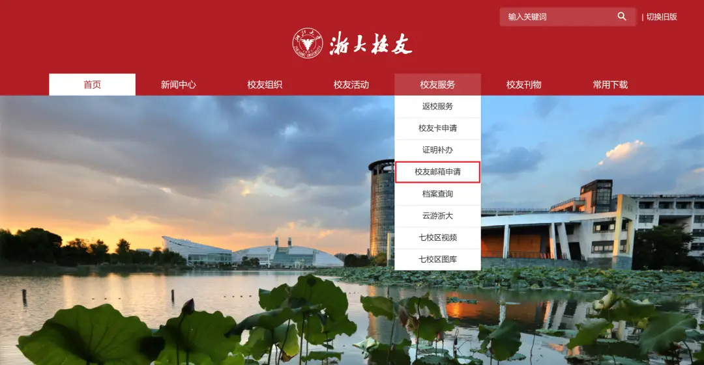

## 今日总结
明明名义上是奶奶的生日，但是她的两个儿子和女儿都把重心放在两个新生的双胞胎姐妹上，也许是人本能的趋利避害————趋向年轻与新生、远离衰老和死亡？故事的主角并不是奶奶。

但是不能怪舅舅们，他们是实打实的每天下班离开家庭陪这个老人睡觉照顾起居的。最大的问题还是衰老影响的听力————如果她的听力依然健在，大家一定不会排斥和她交谈。哪怕她说的方言小辈听不懂觉得尴尬，但是她能听懂普通话就好。可是她也不愿意带助听器————老人特有的固执。

小舅舅意义不明的给了我一个红包，我只能交给妈妈让她交还，这实在是不对劲，因为就算给红包也是宴会的主人给而不是他。因此我们最后吃完中饭就开车回来了。最后晚饭吃的烤玉米和老廖夜市，烧烤油实在太重了，得把健身与有氧捡起来。

### 真正的今日总结
上午我的盐酸多西环素肠溶胶囊到了，他有一个光敏性的问题，而盛夏这一点就很烦人。
- 早晨
    - 温和洁面
    - 保湿
    - 防晒
- 早餐后：
    - 多西环素100mg
- 中午
    - 克林霉素
- 晚上
    - 洗脸
    ↓
    - 活动痘：班赛点涂
    ↓
    - 红痘印：积雪草苷/多磺酸粘多糖

> 钙离子会结合四环素所以近期不要喝牛奶喝拿铁。

### 健身减脂
体重怎么僵持在70kg又回来了？感觉体脂秤不行了，精度有问题。我体脂也测不出来了。
今天练肩。发现反向飞鸟连26kg都做不动了！只能换成19kg。
有氧也是坚持30min做不了了，没办法背心全部汗湿扒在身上，如果没有这个debuff的话会坚持更久。

### 电脑清灰液金换硅脂
我的设备是联想拯救者Y9000P 2023至尊版，配置为Intel i9-13900HX和RTX 4090 Laptop GPU，原厂CPU和GPU均采用液金散热方案。这次操作是在联想授权服务中心进行的清灰、散热维护和导热材料更换。维修师傅特意提醒我“不要说你来过”以及“不要提换材料原因”，这让我产生了三个疑虑：是否偷换了硬件？是否违规把液金换成了普通硅脂？换硅脂后性能和安全性如何？

经过分析，我认为更可能的问题是维修人员为了施工方便违规简化了维修流程，而不是偷换硬件。正规联想授权服务中心有维修记录、序列号绑定和总部监管，偷换CPU、GPU或内存等核心部件属于严重违规，成本远高于收益，所以硬件被调换的风险极低。但将液金换成普通硅脂确实可能是违规操作，因为该机型原厂设计依赖液金实现高性能散热，标准清灰流程应当清理旧液金并重新涂布液金，而非用普通硅脂替代。维修师傅不让如实反馈，更像是担心总部回访、服务考核或授权处罚，而非为了掩盖偷换零件。

液金、普通硅脂和相变导热片各有特点。液金导热能力最强，高负载性能最佳，但导电且有流动风险，维护难度高，适合高性能游戏本旗舰机。普通硅脂安全、施工简单、不导电，但导热能力低于液金，且1~2年可能老化，在低负载时与液金几乎没有差别，高负载下可能导致温度升高、功耗墙提前触发、性能略微下降。相变导热片常温为固态，高温软化贴合，寿命长且不易干，比普通硅脂更稳定，但极限导热能力一般不及优秀硅脂或液金，普通售后清灰通常不会主动使用相变片。

目前我的机器待机温度表现：CPU约59℃，负载5%，风扇2200 RPM，对于i9-13900HX来说，核心多、待机功耗不低，移动端旗舰CPU积热明显，50~60℃属于正常范围。GPU温度47℃，负载0%，风扇2300 RPM，说明散热接触正常、风道和风扇工作良好。但当前低负载温度并不能证明硅脂好坏，因为待机发热量低，两种导热材料都能轻松散热，真正区别要在高负载下才能体现。

建议进行高负载测试以判断实际散热效果。CPU测试可使用AIDA64的系统稳定性测试，只勾选FPU，运行10分钟，正常情况功耗应在110~130W左右，温度90~95℃左右，不会持续撞100℃降频；若温度快速达到100℃、功耗明显下降或核心温差巨大，则可能硅脂覆盖不均或散热器压合异常。GPU测试可用FurMark，1080P分辨率运行10分钟，RTX4090 Laptop正常功耗约175W，温度80~85℃。同时，目前无法拆机确认液金是否清理干净，但从能正常开机、无蓝屏、无异常死机且温度正常这些信号来看，液金没有造成主板短路或核心异常。后续若核心温差小于5℃，说明接触基本正常。

关于是否继续使用，我认为继续使用更划算。因为主力性能机是台式机，笔记本主要用于办公、学习和远程桌面，液金换硅脂带来的性能损失在日常使用中几乎感知不到。相比重新购买MacBook至少花费3000元以上，当前方案更经济。长期维护策略建议正常使用，不必立即重新拆机或强行恢复液金，但可在8~12个月后观察待机温度、满载温度和风扇噪音，如果温度上涨5~8℃，说明硅脂开始老化，届时再考虑维护。

最后，当前状态大概率只是从旗舰液金散热降级到普通硅脂散热，没有明显证据表明硬件被调换。处理策略是：不主动举报，也不用替维修点隐瞒，客观反馈“设备目前使用正常”即可；回家跑一次AIDA64 FPU和FurMark，记录温度作为后续对比基线；然后正常使用。
对于“RTX4090台式机主力 + Y9000P移动办公”的使用场景，换硅脂的性能损失远小于重新购机成本，最合理的策略是接受现状、建立温度基线、观察长期变化。

### 浙大校友

#### 校友邮箱
邮箱账号:
baobowen@zuaa.zju.edu.cn
登录地址:
https://mail.zuaa.zju.edu.cn/
> 密码包含大小写字符特殊符号等

### 断网问题
Boostnet这个VPN客户端有很大的问题！以前DNS问题不是没遇到过，但是这次居然影响到我连不上家里的WiFi！！！运行`ipconfig /flushdns`之后才好转。
要么就是列一个定时任务自动运行`ipconfig /flushdns`，要么就是让codex或其他coding Agent框架研究一下这个客户端配置是怎么做的，然后覆写不让他弄乱我的DNS。
```
已完成只读诊断脚本：collect_network_state.ps1

  它会为每次运行创建独立时间戳目录，收集：

  - ipconfig /all
  - Get-DnsClientServerAddress
  - Get-NetIPInterface
  - Get-NetRoute
  - netsh namespace show policy
  - 汇总日志 network-state.txt

  建议用管理员 PowerShell 分阶段采集：

  cd D:\MyLab

  powershell -NoProfile -ExecutionPolicy Bypass `
    -File .\collect_network_state.ps1 `
    -SnapshotName before-vpn

  # BoostNet 连接后
  powershell -NoProfile -ExecutionPolicy Bypass `
    -File .\collect_network_state.ps1 `
    -SnapshotName vpn-connected

  # BoostNet 退出且故障出现后
  powershell -NoProfile -ExecutionPolicy Bypass `
    -File .\collect_network_state.ps1 `
    -SnapshotName after-vpn-exit

  日志默认写入：

  D:\MyLab\network-state-logs\<时间戳>-<快照名称>\

  脚本已通过 PowerShell 语法和实运行验证。它不会修改 DNS、路由、网卡、NRPT 或 BoostNet 文件；单项命令失败时也会继续采
  集，并将异常写入日志。当前机器禁止直接执行脚本，因此示例中的 ExecutionPolicy Bypass 只对该次 PowerShell 进程生效，不会
  更改系统执行策略。
```
### [CUHK亲戚](https://baike.baidu.com/item/%E5%BC%A0%E5%AF%84%E5%86%80/67122032)
这也太远了，是外婆的姐妹的孙子。

## 技术文档
### Leetcode Hot100
两道Easy两道Medium

说起来我还没见过Hard
### Hi-Agent
这个思路是不错的，但是不能断，断了就不知道怎么resume了。现在迁移过来有编码问题。
## 明日计划
