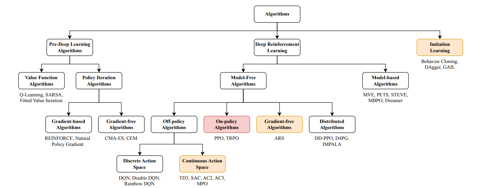
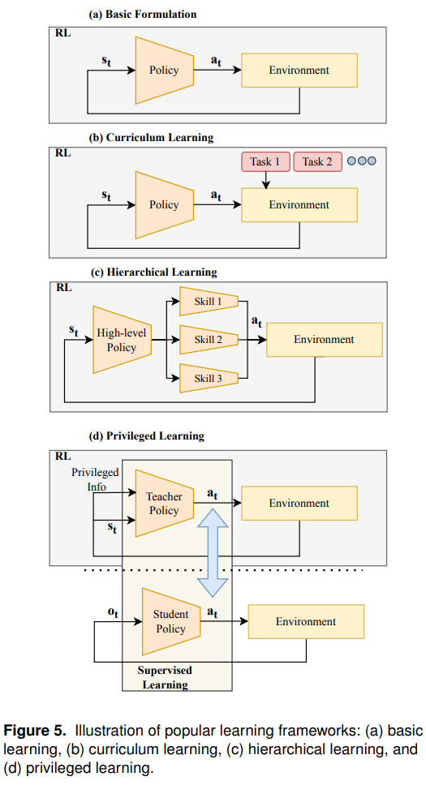

## 今日总结
### Stablepay
今后可以不用那个腾讯会议直接飞书会议了。
去实践K8S等服务器相关事宜，思考一下怎么把API-gateway网关给挪过去

### 本科毕设
哦不得不提那个GCD。我得找一个综述的图来抄。我就给你两张图好了，一张taxonomy，一张framework

需要晚点给体现我的工作量一类的。
然后是vllm的学习。
以及参考那个最新的Dynamic Navigation的预印本去给PPT编故事。

### Yuedong
在SerachResults、HomePage用后端description替换评论文案并做单行省略
C端搜索后的评分和首页场馆的评分和评价条数不一致（“xx+预约”、“xx/人”与首页的格式不一致），把评分全部改为5.0，去掉搜索后显示的“xx条”
有一个小沟子就是BookVenuePage有一个tag，然后HomePage一个tag不知道是怎么来的

我去没想到啊没想到，Trae有一个进程资源管理器，就是左下角那个DISK 97%，里面点开看到它竟然占用了C盘5.58GB（日志文件）+1.37GB（代码索引存储）+2.37GB（其他）的空间！！！那cursor不会也一样吧？！

## 技术文档

## 明日计划
