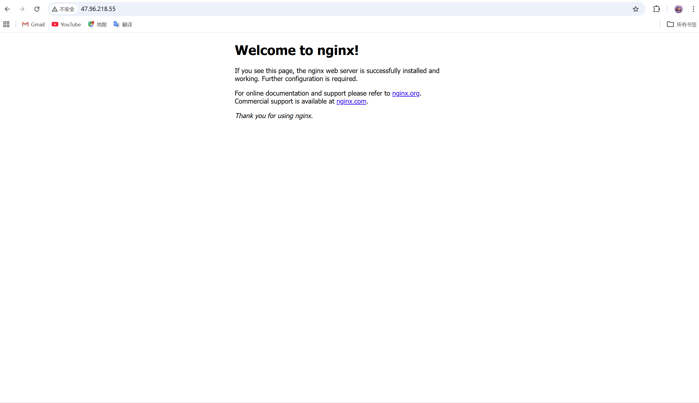
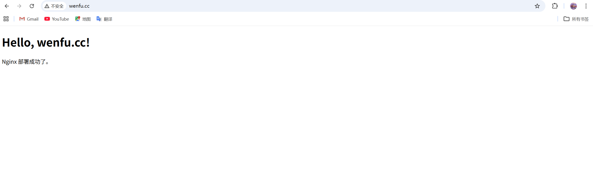

## 今日总结
### Stablepay
#### DNS 域名与 Nginx
```bash
root@iZbp1dehcuxg57ct9anm9wZ:~# systemctl start nginx
root@iZbp1dehcuxg57ct9anm9wZ:~# systemctl status nginx
● nginx.service - A high performance web server and a reverse proxy server
     Loaded: loaded (/lib/systemd/system/nginx.service; enabled; vendor preset: enabled)
     Active: active (running) since Sat 2026-03-28 19:15:44 CST; 19s ago
       Docs: man:nginx(8)
   Main PID: 861001 (nginx)
      Tasks: 3 (limit: 4275)
     Memory: 8.4M
        CPU: 31ms
     CGroup: /system.slice/nginx.service
             ├─861001 nginx: master process /usr/sbin/nginx -g daemon on; master_process on;
             ├─861004 nginx: worker process
             └─861005 nginx: worker process

Mar 28 19:15:44 iZbp1dehcuxg57ct9anm9wZ systemd[1]: Starting A high performance web server and a reverse proxy server...
Mar 28 19:15:44 iZbp1dehcuxg57ct9anm9wZ systemd[1]: Started A high performance web server and a reverse proxy server.
```
Nginx配好后，在浏览器里先访问`http://47.96.218.55`可以看到 Nginx 默认欢迎页，80 端口通了。


然后先建一个最简单的网页目录:
```
mkdir -p /var/www/wenfu.cc
cat > /var/www/wenfu.cc/index.html <<'EOF'
<!doctype html>
<html>
<head>
  <meta charset="utf-8">
  <title>wenfu.cc</title>
</head>
<body>
  <h1>Hello, wenfu.cc!</h1>
  <p>Nginx 部署成功了。</p>
</body>
</html>
EOF
```
并创建 Nginx 配置:
```
cat > /etc/nginx/sites-available/wenfu.cc <<'EOF'
server {
    listen 80;
    listen [::]:80;

    server_name wenfu.cc www.wenfu.cc;

    root /var/www/wenfu.cc;
    index index.html;

    location / {
        try_files $uri $uri/ =404;
    }
}
EOF
```
随后启用这个站点:
```bash
root@iZbp1dehcuxg57ct9anm9wZ:~# ln -s /etc/nginx/sites-available/wenfu.cc /etc/nginx/sites-enabled/
root@iZbp1dehcuxg57ct9anm9wZ:~# nginx -t
nginx: the configuration file /etc/nginx/nginx.conf syntax is ok
nginx: configuration file /etc/nginx/nginx.conf test is successful
root@iZbp1dehcuxg57ct9anm9wZ:~# systemctl reload nginx
```

下一步是让 Nginx 把访问 wenfu.cc 的请求转发到 Go 服务。这里我有点疑惑到底是应该用自己写的 API-Gateway 还是所谓的阿里云买的 API-Gateway？然后具体端口应该怎么做？
如果我想编辑这个默认的前端页面的话（并且用一些高级的react框架之类的），怎么做？


#### Clawhub 与 Openclaw plugin 测试
首先安装Clawhub并登录：
```
npm i -g clawhub
clawhub login
clawhub whoami
```
然后上传skill：
```
(base) PS D:\MyLab\StablePay\stablepay-openclaw-plugin\showmethemoney-skill> clawhub publish . `
>>   --slug showmethemoney-skill `
>>   --name "showmethemoney skill" `
>>   --version 1.0.0 `
>>   --changelog "Initial public release" `
>>   --tags latest
√ OK. Published showmethemoney-skill@1.0.0 (k97dx35werbxxj1kbtjpb1dbth83rv03)
(base) PS D:\MyLab\StablePay\stablepay-openclaw-plugin\showmethemoney-skill> clawhub search "showmethemoney"
showmethemoney-skill  showmethemoney skill  (2.500)
```

### 本科毕设

## 技术文档

## 明日计划
