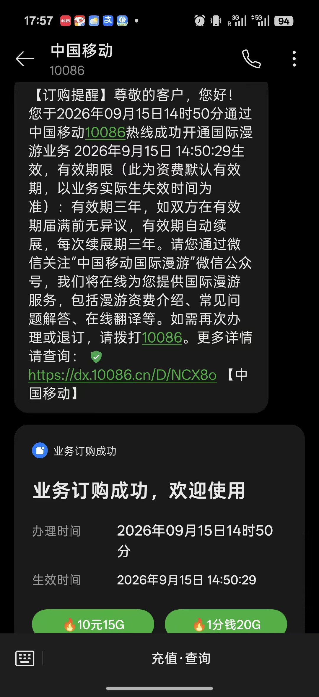

## 今日总结

### 勇者之章3

- [3.13.13女仆线小教程](https://www.mcmod.cn/post/6007.html)
- [3.13.4 四职业单女仆配置（龙前）](https://pd.qq.com/g/pd18186716/post/B_d560186a0bbd03001441152189522236560X60)
- [勇者之章3 所有饰品栏位推荐饰品](https://www.mcmod.cn/post/5805.html)

魔法石英权杖攻略的饰品核心就是 **堆幸运 + 保命 + 投射物速度**，词条最终走向 **全强运**；同时靠 **魔法石英戒指/魔法石英花、战法师戒指、真理刻蚀板、笼中心、终结之镜** 这些关键件撑住输出和生存。

#### 一、词条优先级

| 部位 | 推荐 |
|---|---|
| 饰品词条 | 前期：全鹰眼，但注意速度别太低 中期：强运 : 鹰眼 = 2 : 1 龙后/最终：**全强运** |
| 装备词条 | 箭术 → 急速 → 生息/神秘 → 神秘 神化后刷 **幸运值词条** |
| 石英花正面buff | 最推荐 **箭矢强化**（每级+20%投射物伤害） 其次 **控脑术**（每级+0.04神化暴击） |
| 石英花免疫 | 刷 **免疫神圣城堡**，后面破坏方块要用 |
| 石英花属性词条 | 全刷 **神化暴击** 或 **全属伤** |
| 宝石 | 武士、闪电、战神、辉煌、完美；武器要 **星裂词条** |

#### 二、栏位与关键机制

- **魔法石英戒指**：做2个，一个自己戴，一个放魔法石英花里，提高正面buff等级和高属性概率。
- **魔法石英花**：最多生效3朵；背包只生效1朵，另外2朵要放 **古旧书袋**。当前阶段1朵够用。
- **古旧书袋**：可放额外石英花、倒转之启、无止之言。
- **栏位扩展**：
  - 原始珍珠换饰品栏
  - 树海化章节换一个
  - 羊皮卷换塔罗牌栏位
  - 猎人腰带加护符栏位
  - 天体果实 +1 戒指栏位
  - 咒法左下角任务给魔戒栏位兑换券

#### 三、核心饰品/配饰

| 饰品 | 获取 | 作用/备注 |
|---|---|---|
| 魔法石英戒指 | 制作 | 提高权杖发射频率/速度 |
| 魔法石英花 | 新月蔓生神庙雕像萤石→阿普切祝福→海妖精核 | 缩短冷却、免疫buff、正面buff |
| 战法师戒指 | 制作 | 法力转护盾，核心生存 |
| 奥术之戒 ×3 | 咒法任务魔戒栏 | 共300魔力护盾 |
| 真理刻蚀板 | 幽匿诅咒骑士掉恶魔之心后带 | 保命 |
| 笼中心 | 巨颌怪不灭苞荚等制作 | 保命 |
| 终结之镜 | 刷末影处刑者 | 免疫弹射物伤害，推荐 |
| 天使之祝 | 刷恼鬼 | 投射物速度加成非常恐怖 |
| 大恶魔之咒 | 刷恼鬼 | 后面做猩红手环 |
| 猩红手环 | 大恶魔之咒制作 | 吃压血饰品增伤 |
| 口袋饰品 + 黄金马蹄 | 合成 | +6基础幸运，可带两个=12 |
| 血肉指虎 | 猪灵蛮兵 | +5幸运 |
| 猎人腰带 | — | 加护符栏位 |
| 发光花粉罐 | — | 加幸运，多余项链栏可带 |
| 创造者恩惠 | 末影守卫掉古旧书袋后做 | 飞行 |
| 倒转之启 | 末影守卫相关 | 放古旧书袋 |
| 无止之言 | 选择性做 | 放古旧书袋 |
| 精美戒指 | 末地城天体果实后 | 戒指栏 |
| 被咒者的图腾 | 海盗船长 | 保命图腾 |
| 万腐之心 + 深渊之眼 | 远古渊兽领主等 | 一起佩戴+10%全属性 |
| 月之石 + 波塞冬的早餐 | 水晶构造体 / 亡骸之海蓝宝石箱 | 食物多样性200，星灵之力五，箭矢增强 |
| 星云之眼 | 刷恼鬼 | 可带 |
| 终焉刻蚀板 ×8 | 末影龙带5负面buff击杀 | 切热分解抑制，培养皿64%幸运乘区 |
| 天使的祈愿 | — | 与创造者恩惠冲突时，攻略推荐终结之镜 |

#### 四、分阶段速查

##### 大前期 / 弓过渡

精灵手环、石巨人之眼、莫里斯脑子、幸运马掌、命戒、怨影吊坠、塔罗牌战车、星星项链、混沌战斧、骤雨、七剑修罗之心、游侠徽章、突变骷髅胸甲、精灵箭袋、精灵花冠、医药箱、塔罗牌力量、魔法箭袋、恩赐卷轴、口袋饰品 + 黄金马蹄。

##### 龙前

魔法石英戒指、魔法石英花、战法师戒指、奥术之戒×3、十字章护身符、笼中心、精灵项链、塔罗牌倒吊者、六分仪、噩梦基座、暴食徽章、毁灭者勋章、红心项链、海上流浪者套、玻璃胸针、扭曲无常符文、祷告者冠冕、怪物猎人勋章、侦察镜、樱花发簪、血肉指虎、猎人腰带、潜行者箭袋、狂战士手套、原始纹章、英雄护盾、灵质幸运星、绝缘体、复仇之心、弱化聚晶、Necora病毒、强心符文、珍钻手环、咒魂套、恶魔之心、真理刻蚀板、诺克萨斯纹章、狙击镜、魔灵箭袋、大血怒晶体、战神晶体、铁之王牌、混沌魔戒、巫古项链、唤士项链、破败兵刃、终焉刻蚀板×8。

##### 龙后

精美戒指、龙皮魔导书、狂暴之心、切割者之骰、铁之王牌、灵魂方舟、天空之城奖杯、神秘龙蛋、天使之祝、大恶魔之咒、星云之眼、绝望共鸣、终结之镜、毁灭者徽章、火焰箭袋、猩红手环、机械眼、无止之言、王室宝石、焰护之戒、死亡塔罗牌、熔火箭袋、渊碎灵质虫、发光花粉罐、审判塔罗牌、被咒者的图腾、召唤之钟、波塞冬的早餐、月之石、自修正强化基因、深渊意志徽章、玻璃之手、万腐之心、深渊之眼、双生魂、完美宝石、万钧之护卷轴、血战沙场之征、以太套、地狱刃片护符、无尽图腾、世界之魂、末世之脑、厄难毒眼、犬牙钓竿、恩惠之典、无尽催化剂。

#### 五、几个重要提醒

1. **上下级饰品可同时佩戴**，比如毁灭者勋章别忘了。
2. **Necora病毒** 加坦度，但打亡灵生物会降伤害，视情况戴。
3. **终结之镜** 免疫弹射物，但和创造者恩惠冲突时，攻略推荐终结之镜。
4. **无尽图腾** 记得打永恒，不要放置灵魂方舟。
5. **魔法石英花** 当前阶段一朵就够，别急着堆三朵。
6. **饰品词条最终全强运**，生存主要靠战法师戒指、真理刻蚀板、笼中心、终结之镜、瞬间回复法力2等。

### 中银香港失败
今天兴冲冲的去开了中国移动的国际服务：

但是中银线上居然不行？不给我过是吧，那就晚点收到真HKID之后再线上申请一次，实在不行就walkin。其他汇丰恒生也一样。
还有学生八达通的申请这么久没音信。

### AIMS5710 课程记录

今天上了 AIMS5710。确认本节课重点是线性模型复习、多分类 softmax/交叉熵、计算图、全连接层、激活函数、MLP、反向传播和梯度消失/爆炸。

课程大纲确认这门课是 3 学分，每周二 18:30–21:30 面授，共 13 次；9 月 15 日所在周的正式主题是 Multi Layer Perceptron I。大纲的评价表写 Homework 50% 和 essay test/exam 50%，但教学安排又列出 Quiz 1、Quiz 2，具体权重还要去 Blackboard 核对。

课堂白板补充写明：Homework 1 截止 9 月 29 日，覆盖 Lectures 1–2；Quiz 1 在 10 月 27 日（Week 8），覆盖 Lectures 1–6。具体提交时间、入口和最终规则仍以 Blackboard 为准。

新照片主要记录黑笔部分：从 softmax 分式开始，分 \(i=j\) 和 \(i\ne j\) 推出 Jacobian，再接到全连接层的输入梯度与多层链式法则。完整的逐步推导和 PDF 课件截图已整理进技术文档。

说实话，add/drop 没有选上选修，心里有点担心。今天先把这门课的学习主线和考核疑点记录下来，长篇公式整理放在技术文档里；目前还没有运行 MLP/CNN 代码，也没有把课件内容当成已经完成的实验结果。

### 两门课的重要时间线

**AIMS5710：每周二 18:30–21:30，Yasumoto Int'l Acad Park LT4。**

- 9 月 22 日：多层感知机；9 月 29 日：卷积神经网络。
- 10 月 6 日：深度网络优化；10 月 13 日：循环神经网络；10 月 20 日：Transformer I。
- 10 月 27 日：Quiz 1；11 月 3 日：Transformer II；11 月 10 日、17 日：生成网络。
- 11 月 24 日：高级主题；12 月 1 日：课程总结与 Quiz 2。
- Homework 1 截止 9 月 29 日，覆盖 Lectures 1–2；Homework 2 在第四周、Homework 3 在 Quiz 1 周发布，后两项具体截止时间尚未确认。

**AIMS5702：每周四 19:00–22:00，ELB LT1。**

- 9 月 17 日：向量运算、数据表示、NumPy；9 月 24 日：基础网络设计、PyTorch。
- 10 月 1 日：国庆假期停课；10 月 8 日：Deep Learning Practice 1 / 第一次 in-class lab。
- 10 月 15 日：loss、训练设置、数据创建；10 月 22 日：卷积、Transformer；10 月 29 日：设备端部署与模型优化。
- 11 月 5 日：第二次 in-class lab；11 月 12 日：GPU、CUDA、Triton、自定义算子与 Coding Quiz 1。
- 11 月 19 日：第三次 in-class lab；11 月 26 日：高级主题。
- 12 月 3 日：Coding Quiz 2 与 Individual Project Q&A；12 月 24 日：Individual Project 截止提交。

### 课程事件的提前提醒

- AIMS5702 的 10 月 8 日、11 月 5 日、11 月 19 日 lab：前一晚和当天出门前各提醒一次，带满电 laptop、充电器，并确认 Google Colab、浏览器和账号可用。
- AIMS5710 的 10 月 27 日 Quiz 1、12 月 1 日 Quiz 2：前一晚和当天各提醒一次，提前复习并确认 Blackboard 的最终安排。
- AIMS5702 的 11 月 12 日 Quiz 1、12 月 3 日 Quiz 2：前一晚和当天各提醒一次；课程记录称为纸笔手写、不能使用电脑，仍以老师最终通知为准。

## 技术文档

- [AIMS5710：反向传播、MLP 与激活函数](../../../../blog/2026/2026-09-15-aims5710-neural-networks/)
- [AIMS5702：从张量、训练到部署的 AI 工程实践](../../../../blog/2026/2026-09-10-aims5702-ai-in-practice/)

## 明日计划

- [ ] 每周首次上课前检查 Blackboard：AIMS5710 的 assessment 权重、Homework 1（9 月 29 日）提交入口与具体截止时间，以及 Homework 2/3；AIMS5702 的 Assignment 1/3 截止时间与 lab rubric。
- [ ] 在 9 月 17 日 AIMS5702 课程前确认第一份 coding assignment 是否已经发布。
- [ ] 用一个小型 PyTorch MLP 跑通一次 forward、loss、backward，并记录每个张量形状。
- [ ] 继续健身与减脂，同时记录脱发和痤疮养护情况。
