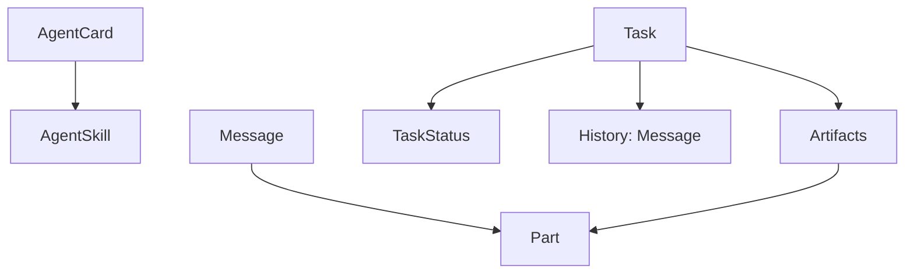
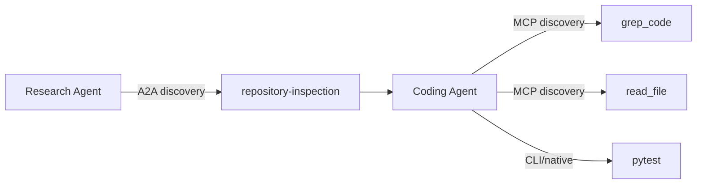
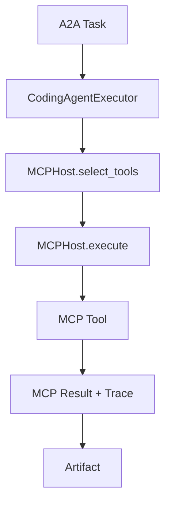
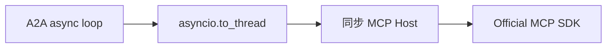
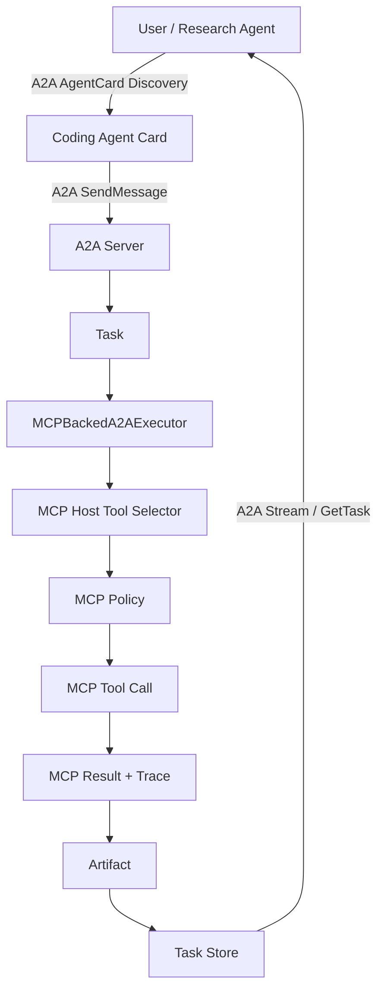
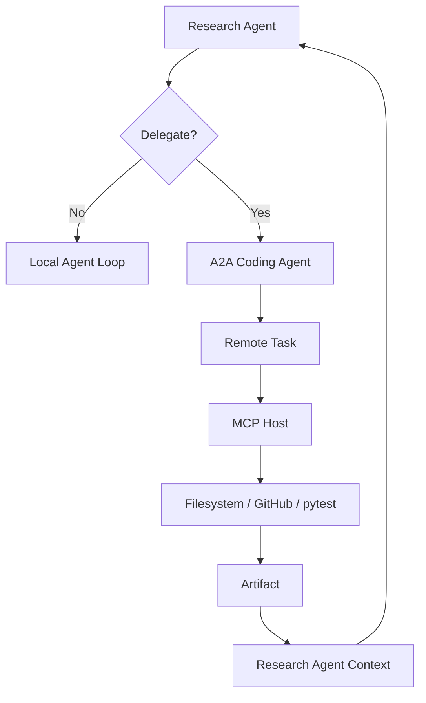
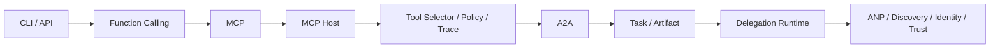

MCP 做完以后，我原本很容易顺着 HelloAgents 的思路继续写一个“Researcher Agent + Writer Agent”的 demo，但真正值得学习的问题其实不是“两个 Agent 怎么互相发字符串”，而是：**一个 Agent 把目标交给另一个 Agent 以后，这项工作如何被表示、跟踪、失败和交付？**

这也是 A2A 和 MCP 最根本的分界。MCP 的核心动作是一项能力调用：

```text
call_tool("grep_code", {"query": "selector"})
    ↓
result
```

A2A 的核心动作则是一项可以持续一段时间的任务委托：

```text
SendMessage("检查仓库并修复问题")
    ↓
Task(SUBMITTED)
    ↓
Task(WORKING)
    ↓
调用多个内部工具
    ↓
Artifact(patch + test report)
    ↓
Task(COMPLETED)
```

如果说 MCP 让我理解了“Agent 如何接工具”，A2A 则让我开始理解“Agent 之间如何把工作交出去”。这一篇把 Mini-A2A 和官方 SDK 两阶段合在一起，重点不再是记录某次提交，而是整理出以后可以直接复习的协议心智模型、代码路径和工程边界。

## 1. A2A 学到什么程度算完成

这次依然采用和 MCP 相同的路线：先手搓最小 contract，再切回官方 SDK。

```text
Mini-A2A
    ↓
理解 AgentCard / Message / Task / Artifact / Stream
    ↓
Official a2a-sdk v1
    ↓
Server / Client / Task Store / EventQueue
    ↓
Hi-Agent Coding Agent
    ↓
MCP Host
    ↓
Artifact + Trace
```

目前这两层都已经跑通。Mini-A2A 负责协议学习；正式工程代码位于：

```text
protocols/a2a/integration/
├── __init__.py
├── client.py
└── server.py
```

官方 SDK 集成已经覆盖 Agent Card discovery、JSON-RPC streaming、Task Store、GetTask，以及 A2A Executor 到现有 MCP Host 的桥接。换句话说，A2A 这一阶段已经从“我理解 Task/Artifact”进入了“官方 Client 和 Server 真正完成一次端到端委托”。

因此现在的停止线也比较清楚：**不继续给 Mini-A2A 增加 HTTP、认证、gRPC 或所有状态；不自己重写 A2A SDK；把精力留给真正的委托 runtime。**

## 2. 为什么 Agent 不能简单当成一个 Tool

这是整个 A2A 学习阶段最值得回答的问题。一个 Tool 往往只需要“输入参数 → 执行能力 → 返回结果”，例如：

```python
result = call_tool(
    "grep_code",
    {"query": "protocol"},
)
```

但一个远端 Coding Agent 可能会理解任务、制定计划、搜索代码、阅读文件、修改代码、运行测试、失败后重试，最后再生成 patch 和报告。这时候调用方至少还需要知道任务是不是已经接受、是不是正在执行、是否失败、最终成果在哪里，以及之后能不能再查询。

所以 A2A 引入了比 Tool result 更丰富的语义：

```text
AgentCard = 对外名片
Message   = 一次交流
Task      = 一项可跟踪的工作
Status    = 当前生命周期状态
Artifact  = 最终或阶段性交付物
```

一句话可以记成：**Tool 更像“执行能力”，Agent Task 更像“接受目标并对结果负责”。**

## 3. Mini-A2A 为什么只保留五个核心对象

Mini-A2A 没有一开始就实现 HTTP、认证、Push Notification、gRPC 或所有状态，而是先把最核心的对象关系固定下来：

```text
AgentCard
Message
Task
TaskStatus
Artifact
```

实际代码还包含 `AgentSkill` 和 `Part`，但它们分别服务于 AgentCard 和 Message/Artifact，所以整体仍然可以理解成五类核心概念。



这个设计的重点不是“对象数量少”，而是让每一个对象只回答一个问题。

## 4. AgentCard：描述 Agent 能完成什么，而不是内部有哪些工具

一个 Coding Agent 的 Mini AgentCard 可以是：

```python
AgentCard(
    name="hi-agent-coder",
    description="Inspects repositories and returns evidence.",
    version="0.1.0",
    protocol_version="1.0",
    url="http://localhost:9001",
    skills=[
        AgentSkill(
            id="repository-inspection",
            name="Repository Inspection",
            description=(
                "Inspect code and return a structured artifact."
            ),
        )
    ],
)
```

这里故意没有 `grep_code`、`read_file`、`pytest`，因为这些是 Coding Agent 的内部实现手段，而不是对外能力。A2A discovery 想回答“这个 Agent 能帮我完成什么目标”，MCP discovery 想回答“这个 Agent 内部可以调用哪些外部能力”。



如果把 `grep_code` 直接写进 AgentCard，就等于把“Agent 能做什么”和“Agent 怎么做到”混成了一层。

## 5. Message：一次通信 turn，而不是一个长任务

Mini-A2A 的 Message：

```python
Message(
    message_id="message-bridge",
    role=Role.USER,
    parts=[
        Part(
            text="Inspect the repository code and prepare a report."
        )
    ],
)
```

`Part` 第一版只支持 `text` 和 `data`，而且二者必须恰好出现一个。这不是为了完整模拟官方类型系统，而是为了把 Message 的内容承载边界固定下来。

Mini-A2A 还特意区分“直接 Message 响应”和“Task 响应”。例如用户问“你支持什么？”时，Agent 可以直接返回 `Message(role=agent)`；但收到“检查这个仓库并准备报告”时，则创建 `Task(SUBMITTED)`。不是每个请求都需要长任务，但真正需要持续工作的目标也不能假装成一次普通 RPC。

## 6. Task：A2A 真正的核心对象

Task 至少需要保存：

```text
id
context_id
status
history
artifacts
```

例如：

```python
Task(
    id="task-001",
    context_id="context-001",
    status=TaskStatus(TaskState.SUBMITTED),
    history=[message],
)
```

`task_id` 标识的是一项具体工作，而 `context_id` 更像连续协作上下文。即使 Mini-A2A 还没有把多轮 context 做完整，区分两者本身就很重要，否则以后“同一个工作”和“同一个协作上下文”会被混成一个 ID。

## 7. Task 状态机：完成不是随便赋值一个字符串

Mini-A2A 第一版只实现四种状态：

```text
SUBMITTED
WORKING
COMPLETED
FAILED
```

合法路径：

```text
SUBMITTED → WORKING → COMPLETED
SUBMITTED → WORKING → FAILED
```

状态机集中写成：

```python
_ALLOWED_TRANSITIONS = {
    TaskState.SUBMITTED: {
        TaskState.WORKING,
        TaskState.FAILED,
    },
    TaskState.WORKING: {
        TaskState.COMPLETED,
        TaskState.FAILED,
    },
    TaskState.COMPLETED: set(),
    TaskState.FAILED: set(),
}
```

因此 `COMPLETED → WORKING`、`FAILED → WORKING` 都会被拒绝。这里真正值得学的是：**Task lifecycle 不应该散落在业务代码里。** 如果各个 Executor 都能自由修改状态，很快就会出现非法状态跳转和“伪完成”。

## 8. Artifact：为什么“done”不是交付物

一个 Mini-A2A Artifact：

```python
Artifact(
    artifact_id="artifact-001",
    name="repository-research",
    description="Evidence collected through MCP.",
    parts=[
        Part(
            data={
                "selected_tool": "filesystem.grep_code",
                "result": "protocols/mcp/mini_mcp/protocol.py",
            }
        ),
        Part(
            text="Coding Agent completed repository inspection."
        ),
    ],
)
```

有一句特别适合作为八股：**“完成了”是 Message；patch、测试报告、代码、分析报告、证据集才是 Artifact。**

Mini-A2A 后来还加入了一个值得保留的 invariant：Task 进入 `COMPLETED` 前必须至少已经有一个 Artifact。这个约束提醒我，终态不是 UI 上的绿色图标，而是应该对应可审计结果。

## 9. Stream：为什么不能“想 yield 什么就 yield 什么”

Task stream 的最小事件顺序：

```text
Task(SUBMITTED)
TaskStatusUpdateEvent(WORKING)
TaskArtifactUpdateEvent(Artifact)
TaskStatusUpdateEvent(COMPLETED, final=True)
```

Message mode 则只返回一个 Message。Mini-A2A validator 会拒绝 Message 和 Task 事件混用、Task stream 不以 Task 开头、event.task_id 不一致、没有 Artifact 就 COMPLETED、`final=True` 后继续发事件，以及 Task stream 没有 terminal final event。

严格 stream mode 不是协议“啰嗦”，而是在降低互操作成本。客户端必须稳定知道：这是即时回答还是长任务、需不需要保存 task_id、什么时候结束，以及是否应该等待 Artifact。

## 10. 为什么第一条 Task 要 deepcopy

Streaming 中有一个典型 Python mutation 坑。如果先 `yield task`，后面继续把同一个对象从 `SUBMITTED` 改成 `WORKING`、`COMPLETED`，消费者如果稍后才查看之前保存的对象引用，可能发现第一条事件也“变成了 COMPLETED”。

因此 Mini-A2A 第一条事件使用：

```python
yield deepcopy(response)
```

这样第一条事件是 `SUBMITTED` 快照，后面的 server-side Task 可以继续变化。这不是 A2A 规范字段，却是事件系统里非常典型的对象生命周期问题。

## 11. Executor：协议层和 Agent 行为必须分开

Mini-A2A 定义：

```python
class AgentExecutor(ABC):
    @abstractmethod
    def execute(
        self,
        message: Message,
        task: Task,
    ) -> Artifact:
        raise NotImplementedError
```

测试用 `StaticArtifactExecutor`，真实桥接用 `CodingAgentExecutor`。A2A protocol 只关心 Message、Task、Status、Artifact、Stream，而“Coding Agent 到底怎么完成任务”属于 application/runtime。这和 MCP 阶段的 wire protocol vs Host runtime 是同一种分层原则。

## 12. Mini-A2A 如何复用 MCP Host

CodingAgentExecutor 的关键路径：

```python
selection = self.mcp_host.select_tools(message.text)

entry = next(
    (
        candidate
        for candidate in selection.selected
        if candidate.original_tool_name == "grep_code"
    ),
    selection.selected[0],
)

execution = self.mcp_host.execute(
    entry.canonical_tool_name,
    {"query": message.text},
    selected_by="a2a_coding_executor",
    selection_reason=selection.reasons[
        entry.canonical_tool_name
    ],
)
```

最终 Artifact 保存 `selected_tool`、`result` 和 `trace`。所以两层协议组合成：



最重要的是两个协议没有互相污染：A2A 不关心 MCP headers、ToolRegistry 和 `resultType`；MCP Host 不关心 TaskState、Artifact 和 A2A Stream。中间只靠 Executor 组合。

## 13. Mini-A2A 到这里为什么应该停止扩展

Mini-A2A 没有实现 `input-required`、`auth-required`、`canceled`、`rejected`、CancelTask、ListTasks、Push Notification、OAuth/mTLS/JWS、HTTP+JSON 或 gRPC。这些不是遗漏，而是学习边界。

Mini-A2A 已经回答了最关键的问题：Agent 对外如何描述自己、Message 和 Task 有什么区别、Task 为什么要有生命周期、Artifact 为什么不能只是文本回复、Stream 为什么需要明确模式，以及 Agent 内部如何继续使用 MCP。继续往下手搓，就开始重复官方 SDK 的工作。

## 14. 从 Mini-A2A 切到官方 a2a-sdk v1

正式工程代码位于：

```text
protocols/a2a/integration/
```

当前项目依赖官方 `a2a-sdk[http-server]>=1.0,<2`，最新提交里已经形成官方 v1 Server / Client 集成，并使用 Agent Card route、JSON-RPC route、EventQueue、TaskUpdater、InMemoryTaskStore 和 Client。

这意味着真正工程实现已经从“手写对象”切换到了“使用官方协议模型和 binding”。

## 15. 官方 AgentCard：从 url 升级到 supported_interfaces

官方 v1 AgentCard 的核心形状：

```python
return AgentCard(
    name="hi-agent-coder",
    description="Inspects repositories through Hi-Agent MCP Host.",
    version="0.1.0",
    supported_interfaces=[
        AgentInterface(
            protocol_binding="JSONRPC",
            protocol_version="1.0",
            url=f"{base_url}/a2a/jsonrpc",
        )
    ],
    capabilities=AgentCapabilities(
        streaming=True,
        push_notifications=False,
    ),
    default_input_modes=["text/plain"],
    default_output_modes=[
        "text/plain",
        "application/json",
    ],
    skills=[
        AgentSkill(
            id="repository-inspection",
            name="Repository Inspection",
            description=(
                "Inspect repository code and return an evidence artifact."
            ),
            tags=[
                "repository",
                "coding",
                "inspection",
            ],
        )
    ],
)
```

这里比 Mini-A2A 多了两个重要概念。第一，`supported_interfaces` 同时描述 protocol binding、protocol version 和 endpoint；第二，`capabilities` 明确告诉客户端是否支持 streaming、push notification 等能力。AgentCard 已经不只是“业务介绍”，也是协议协商入口的一部分。

## 16. 官方 Server：Executor 不 return Artifact，而是发布事件

Mini-A2A 的 Executor 可以直接：

```python
return Artifact(...)
```

官方 SDK 则是事件驱动：

```python
class MCPBackedA2AExecutor(AgentExecutor):
    async def execute(
        self,
        context,
        event_queue,
    ):
        ...
```

第一步发布 Task：

```python
await event_queue.enqueue_event(
    new_task_from_user_message(
        context.message
    )
)
```

再创建：

```python
updater = TaskUpdater(
    event_queue=event_queue,
    task_id=context.task_id,
    context_id=context.context_id,
)
```

然后 `await updater.start_work(...)`，执行内部 Agent runtime，再 `await updater.add_artifact(...)` 和 `await updater.complete()`。这就从“函数返回对象”的教学模型，进入了真正的事件流 runtime。

## 17. 为什么这里用了 asyncio.to_thread

官方 A2A Executor 运行在 async event loop 中，而当前 Hi-Agent MCP Host 为了兼容已有 MyTool 体系仍然有同步调用路径。如果在官方 A2A async executor 里直接调用一个内部可能再次 `asyncio.run()` 的同步 Manager，就会撞到 event loop 嵌套问题。

当前集成用：

```python
execution = await asyncio.to_thread(
    self.mcp_host.execute,
    entry.canonical_tool_name,
    {"query": query},
    selected_by="official_a2a_coding_executor",
    selection_reason=...,
)
```

把同步 MCP Host 调用移到线程。它不是理想终点，但它是清晰的 compatibility boundary：



未来如果 Hi-Agent runtime 全面 async 化，这层桥就可以消失。

## 18. 官方 Server 的 Task-first stream

当前真实测试观察到的 oneof 顺序：

```text
task
status_update
artifact_update
status_update
```

状态顺序：

```text
TASK_STATE_SUBMITTED
TASK_STATE_WORKING
TASK_STATE_COMPLETED
```

这正好验证 Mini-A2A 建立的心智模型没有偏离官方 SDK，只是官方 SDK 使用 wire-ready 的 `StreamResponse` oneof 封装事件。

## 19. Capability question 为什么仍然直接返回 Message

官方 Executor 里仍然保留能力问答的 Message mode：

```python
if self._is_capability_question(query):
    await event_queue.enqueue_event(
        new_text_message(...)
    )
    return
```

所以“你支持什么？”仍然不会创建 Task。这说明 Mini-A2A 里“Message 和 Task response 分开”不是随便造出来的教学抽象，而是能直接映射到官方 SDK 的真实行为。

## 20. 官方 Client：先发现 AgentCard，再创建 Client

客户端侧先通过：

```python
resolver = A2ACardResolver(
    httpx_client,
    "http://testserver",
)
card = await resolver.get_agent_card()
```

读取：

```text
/.well-known/agent-card.json
```

然后：

```python
client = await create_client(
    card,
    client_config=ClientConfig(
        streaming=True,
        httpx_client=httpx_client,
    ),
)
```

这条链是：

```text
发现 Agent
    ↓
理解对方能力和 interface
    ↓
创建协议客户端
    ↓
发送任务
```

而不是业务代码里把 endpoint、binding 和 capability 全部写死。

## 21. Task Store：InMemory 不代表没有持久化语义

当前实验用 `InMemoryTaskStore()`，只是为了不引入数据库。Stream 完成后，Client 仍然可以通过 GetTask 读回 Task、Status 和 Artifacts。

所以真正的 contract 是：

```text
Task Store
```

而不是：

```text
必须是数据库
```

未来可以把实现换成 PostgreSQL、Redis 或其他 Store，但 Task / Artifact / GetTask 的上层语义不应该改变。

## 22. 一次真实的 A2A → MCP 结果

当前 integration test 已经跑通：

```text
Research Agent / test client
    ↓ official A2A Client
Coding Agent
    ↓ official A2A Server
MCPBackedA2AExecutor
    ↓
Hi-Agent MCP Host
    ↓
filesystem.grep_code
    ↓
Artifact + Trace
```

Artifact 中可以读到：

```text
selected_tool = filesystem.grep_code
trace.selected_by = official_a2a_coding_executor
trace.status = completed
```

这说明 Artifact 不是人为写死的 `"done"`，而是真正携带下游工具执行证据和 trace。

## 23. Mini-A2A 和官方 SDK 的差异应该怎么理解

Mini-A2A：

```text
同步
进程内
dataclass
直接返回 Task / Artifact
手写状态机
手写 stream validator
```

官方 SDK：

```text
proto / generated types
HTTP / JSON-RPC binding
EventQueue
TaskUpdater
StreamResponse oneof
Task Store
route factories
Client
```

两者不需要字节级一致。真正应该比较的是核心语义：AgentCard 是否描述高层能力、Message 是否可以即时返回、长任务是否先产生 Task、状态是否 SUBMITTED → WORKING → COMPLETED、完成前是否产生 Artifact、Task 是否之后可 GetTask，以及 stream 是否区分 Message mode 和 Task mode。

## 24. A2A 与 MCP 的组合边界



现在可以把三层职责分得比较清楚：

```text
A2A
    管 Agent → Agent 的委托和 Task

MCP
    管 Agent 内部 → 外部能力调用

Hi-Agent Runtime
    管 selection / policy / trace / execution
```

三者各自有边界，才不会最后变成一个什么都负责的 AgentManager。

## 25. 几个最容易踩坑的点

AgentCard 不应该泄露内部 MCP Tools；Message 和 Artifact 不能混；`COMPLETED` 不应该只是一个状态字符串；Stream 不能变成日志大杂烩；AgentExecutor 不应该复制 MCP Runtime；InMemoryTaskStore 只是 persistence 的一种实现；SDK 示例也会过时，必须先核对版本再照着写。

这些看起来都是细节，其实共同指向一条原则：**协议层的价值主要在边界和不变量，而不是 happy path。**

## 26. A2A 高频八股

### Q1：A2A 和 MCP 的本质区别是什么？

MCP 主要是 Agent 与工具、资源、外部能力之间的标准化调用；A2A 是独立 Agent 之间的能力发现、目标委托、任务状态跟踪和成果交付。一句话：MCP 调用能力，A2A 委托工作。

### Q2：为什么 Agent 不能简单包装成 MCP Tool？

如果远端 Agent 只是一次立即执行并返回结果，Tool 抽象可能够用。但真正独立 Agent 往往有自己的计划、工具、长时间执行、失败恢复、状态、进度和 Artifact，这些语义已经超出一次 Tool call。

### Q3：AgentCard 是什么？

AgentCard 是 Agent 对外的能力与通信名片，描述身份、版本、skills、supported interfaces、protocol version、capabilities 和 input/output modes。它不应该泄露 Agent 内部的 MCP tools。

### Q4：Message 和 Task 的区别？

Message 表示一次交流 turn；Task 表示一项需要持续跟踪的工作。即时问答可以只返回 Message，长任务则应创建 Task。

### Q5：Task 和 Artifact 的区别？

Task 表示工作本身，包括状态、上下文和历史；Artifact 是这项工作的可交付成果。例如 Task 是“修复 selector bug”，Artifact 是 patch + test report。

### Q6：为什么需要 Task lifecycle？

因为远端工作不是原子 RPC。调用方需要区分刚收到、正在处理、已经完成和执行失败，状态机还能阻止非法状态跳转。

### Q7：为什么 completed Task 应该有 Artifact？

因为 completed 应该意味着已经有成果可以交付，否则任务可能只是状态被错误标绿。Artifact invariant 可以减少伪成功。

### Q8：A2A Stream 为什么区分 Message mode 和 Task mode？

为了让客户端稳定判断这是不是长任务、需不需要保存 task_id、什么时候结束，以及是否要等待 Artifact。两种语义混在一起会显著提高互操作复杂度。

### Q9：EventQueue 和 TaskUpdater 的作用是什么？

官方 Server 中 AgentExecutor 不直接 return Task。它把标准事件发布到 EventQueue，TaskUpdater 帮助 Executor 更新 Task 状态、添加 Artifact、完成或失败任务。

### Q10：Task Store 的作用是什么？

Task Store 保存可被之后查询的任务状态和 Artifact，使 GetTask 能在 streaming 结束后重新获得任务结果。InMemoryTaskStore 只是其中一个实现。

### Q11：为什么 A2A Executor 里使用 asyncio.to_thread？

因为官方 A2A Executor 在 async event loop 中运行，而当前 Hi-Agent MCP Host 仍有同步桥。使用线程隔离同步调用，可以避免在已有 event loop 中再次运行同步 async bridge 的冲突。

### Q12：A2A AgentCard 和 ANP discovery 有什么区别？

A2A AgentCard 解决“找到一个 Agent 之后，如何描述它的能力和接口”；更大规模开放网络中的 Agent 搜索、去中心化身份和信任问题，更接近 ANP。

### Q13：A2A 是 Multi-Agent Framework 吗？

不是。A2A 更像互操作协议。AutoGen、CAMEL 或自研 runtime 决定 Agent 如何规划和编排，而 A2A 负责让独立实现的 Agent 按标准方式通信。

### Q14：为什么 A2A 不应该复制 MCP 的 Tool Catalog？

MCP Host 面对大量 Tool schema，所以 Catalog/Selector 很重要；A2A 的核心问题是 Task lifecycle、Agent discovery、delegation、Artifact、Task Store、failure 和 cancellation。两种协议不应该为了目录对称机械复制架构。

## 27. 当前 A2A 完成度

```text
Mini-A2A
├── AgentCard                    ✅
├── AgentSkill                   ✅
├── Message / Part               ✅
├── Task / TaskStatus            ✅
├── Artifact                     ✅
├── model validation             ✅
├── lifecycle                    ✅
├── terminal invariant           ✅
├── completed requires Artifact  ✅
├── Message mode                 ✅
├── Task stream                  ✅
├── stream validation            ✅
├── MCP bridge                   ✅
└── 中文教学注释                 ✅

Official A2A integration
├── a2a-sdk 1.x                  ✅
├── AgentCard route              ✅
├── /.well-known discovery       ✅
├── JSON-RPC route               ✅
├── official AgentExecutor       ✅
├── EventQueue                   ✅
├── TaskUpdater                  ✅
├── InMemoryTaskStore            ✅
├── streaming Client             ✅
├── GetTask                      ✅
├── MCP Host bridge              ✅
├── Artifact + Trace             ✅
└── differential / integration   ✅
```

当前明确没有做真实 Research Agent 委托策略、`delegated_by`、remote task persistence、timeout/retry、cancellation token 贯穿 MCP 长任务、remote failure normalization、OAuth/mTLS、signed Agent Card、push notification、multi-tenancy 和 gRPC。这些都不阻塞当前 A2A 协议学习收口。

## 28. 下一步应该做什么

A2A 的下一步已经不是继续“实现协议”，而是进入真正的委托 runtime。当前只是测试客户端发“Inspect this repository...”，下一步应该让真实 Research Agent 自己决定这个任务是本地做还是委托给 Coding Agent。

新的问题会变成：

```text
什么时候 delegate？
delegate 给谁？
如何把当前 Context 变成 Message？
如何记录 delegated_by？
remote task_id 怎么关联本地 trace？
远端 FAILED 怎么归一化？
Artifact 怎样重新进入 Research Agent Context？
timeout 怎么处理？
用户取消时怎样传到远端 Task，再继续传到 MCP 长任务？
```

完整链路最终应该是：



这时候 A2A 才真正从“协议实验”进入 Agent Runtime。

## 29. 整个协议学习阶段的最终地图



对 Hi-Agent 来说，学习路线现在可以浓缩成：

```text
Mini-MCP
    学 wire contract

MCP Host
    学工具接入和 Agent Runtime

Mini-A2A
    学 Task / Artifact / 生命周期

Official A2A
    学真实 Agent interoperability

Delegation Runtime
    学何时把目标交给其他 Agent

ANP
    学更开放网络中的发现、身份与信任
```

A2A 到这里也已经可以收口。下一阶段真正值得写的，不是更多 A2A protocol code，而是 **Research Agent 如何把一个目标可靠地委托给 Coding Agent，并把远端 Artifact 带回自己的 Context 与 Trace**。
