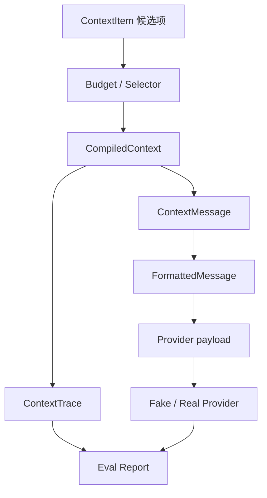

我最初以为 Context Compiler 只是一个“按优先级排序，然后截断”的小工具。

真正写下第一批测试以后，我才发现它连接的是 Agent 最容易互相污染的几条边界：

- RAG 找到了哪些证据；
- Memory 记住了哪些状态；
- system、任务、历史和工具结果谁更重要；
- 模型输入最多能占多少 token；
- 输出要提前留多少空间；
- 哪些内容绝对不能静默删除；
- 内部追踪信息能不能进入 Provider payload；
- 选择正确是否真的会带来正确答案；
- 真实模型的一次成功，能不能重复。

如果这些问题都藏在一个 `build_prompt()` 里，代码当然短，但我没有真正理解任何一层。

所以这一次我没有直接接 RAG、Memory 或真实 LLM，而是从一页 Context Contract 和五个失败测试开始，一层一层做到真实模型评测。最终链路是：



这篇文章不是 Hi-Agent 的更新日志，而是一份面向初学者的完整学习笔记。我会解释每个对象为什么存在、它不应该负责什么、测试固定了哪些行为，以及我实际踩过的坑。

先说项目定位：Hi-Agent 是我的学习脚手架，不是生产级 Agent Framework。V1 的价值不是“造出一个更小的 LangChain”，而是把一个模糊问题拆成可以解释、验证和复现的知识。

---

## 阅读地图与最终目录

本轮最终涉及的主要文件如下：

```text
docs/
└── context-contract.md

context/
├── models.py
├── budget.py
├── selector.py
├── compiler.py
├── structure.py
├── trace.py
├── formatter.py
└── payload.py

core/
├── llm_client.py
└── llm_result.py

evals/context/
├── schema.py
├── scorer.py
└── runner.py

tests/unit/context/
├── test_models.py
├── test_budget.py
├── test_selector.py
├── test_compiler.py
├── test_structure.py
├── test_trace.py
├── test_formatter.py
└── test_payload.py

tests/integration/
├── test_context_fake_provider.py
└── test_context_real_provider.py

tests/fixtures/
├── context_contract_cases.jsonl
├── context_contract_cases.generated.jsonl
└── context_llm_eval_cases.jsonl

artifacts/
└── context-eval-v1.json
```

## 1. Context Engineering 到底在工程什么

### 1.1 Context 不只是聊天记录

一次 Agent 模型调用的上下文，可能同时包含：

- system instruction；
- 当前任务；
- 用户输入；
- 多轮 conversation；
- RAG 检索结果；
- 长期 Memory；
- 工具执行结果；
- 当前计划与约束；
- 中间 artifact 或 checkpoint 的引用。

它们不是同一种信息：来源不同，可信度不同，时效不同，token 成本也不同。

Anthropic 把 Context Engineering 描述为：在推理时持续策划和维护最合适的 token 集合。这里的关键词不是“塞更多”，而是“合适”。模型窗口即使很大，注意力仍然是有限资源，低信号内容会稀释真正重要的信息。[Anthropic 的 Context Engineering 文章](https://www.anthropic.com/engineering/effective-context-engineering-for-ai-agents)也强调，目标应是找到足以提高期望结果概率的最小高信号 token 集合。

因此，Context Engineering 不是单纯追求 prompt_tokens 越多越好，反而更接近 **在输入预算、输出预算、注意力、延迟和成本约束下**，选择 **足够支撑本次任务的最小信息集合**。

### 1.2 Prompt、RAG、Memory 和 Context 的区别

这几个词经常混在一起，先把职责拆开：

| 概念 | 回答的问题 | 典型结果 |
| --- | --- | --- |
| Prompt Design | 指令怎样表达更清楚 | system/user 文本或模板 |
| RAG | 外部知识中哪些片段相关 | 文档 chunk、引用、分数 |
| Memory | 过去什么值得跨轮次保存 | 偏好、事实、事件、状态 |
| Context Engineering | 本次调用究竟携带什么 | 有序、受预算约束的消息 |

RAG 只负责找候选证据，不保证它一定应该进入最终输入。Memory 只负责保存和召回，不保证过去的每件事都值得在这一轮出现。Context 层站在模型调用之前，把这些候选项放到同一个决策平面上。

一个很实用的判断方式是：

- “在哪里找信息？”通常属于 Retrieval；
- “是否长期保存？”通常属于 Memory；
- “这一轮带不带？”属于 Context；
- “怎样告诉模型？”属于 Prompt / Message Formatting。

### 1.3 Context 的四种预算

初学时很容易只看到 token 上限，其实至少有四种预算：

1. **窗口预算**：模型允许的输入与输出总 token；
2. **注意力预算**：模型能否真正利用长上下文中的信息；
3. **延迟与费用预算**：输入越长，推理和传输通常越贵；
4. **缓存预算**：动态前缀会破坏 prompt/KV cache 的复用。

Manus 在其 [Context Engineering 经验总结](https://manus.im/blog/Context-Engineering-for-AI-Agents-Lessons-from-Building-Manus)中尤其强调稳定前缀、append-only history 和确定性序列化对 KV cache 的意义。这个 V1 没有正式优化缓存，但“输出必须稳定”和“内部字段不能偷偷进入 payload”已经为后续实验准备了边界。

---

## 2. 先写 Contract：把模糊问题变成决定

第一步是创建 `docs/context-contract.md`

Contract 先回答三个问题：

1. 一个上下文项是什么？
2. 什么情况下可以保留、淘汰或拒绝？
3. 每一层允许做什么，不允许做什么？

### 2.1 V1 的目标

> 在有限 token 预算内，表示和选择 Agent 当前需要的上下文项，并把结果安全地转换成 Provider 可消费的消息。

### 2.2 V1 的非目标

第一版明确不做：

- RAG 查询；
- Memory 查询与写入；
- embedding relevance；
- freshness / temporal ranking；
- LLM 自动摘要；
- KV cache 命中率优化；
- 多 Agent；
- 工具调用协议；
- Provider 大全。

非目标不是“以后绝对不做”，而是防止当前模型被未来想象污染。

### 2.3 为什么 Contract 比空接口有用

我以前会先写：

```python
class ContextCompiler:
    pass
```

然后期待未来逐渐填满。结果通常是类名看起来很完整，行为却没有决定。

Contract 的好处是会逼我写出危险边界。例如：

> 如果所有 `required` item 的 token 总和已经超过输入硬预算，应该怎么办？

V1 的决定是显式报错，不静默丢弃 required item。因为“任务目标被悄悄删除”比“这次编译明确失败”更危险。

---

## 3. ContextItem：统一候选信息的最小模型

如果 system 指令是字符串、RAG 结果是 Chunk、工具结果是字典、对话历史又是 Message，那么选择器会被迫理解所有上游模块的内部结构。

`ContextItem` 的作用，就是给这些异构来源建立一个最小公共接口。V1 使用八个字段：

```python
@dataclass(frozen=True, slots=True)
class ContextItem:
    item_id: str
    kind: str
    content: str
    source: str
    priority: int
    required: bool
    token_count: int
    metadata: dict
```

### 3.1 字段语义

| 字段 | 含义 | V1 需要保护的语义 |
| --- | --- | --- |
| `item_id` | 稳定身份 | 用于去重、Trace 与评测 |
| `kind` | 领域类型 | 不是 Provider role |
| `content` | 模型实际看到的正文 | 不能为空或全空格 |
| `source` | 信息来自哪里 | 用于追踪，不直接发给 Provider |
| `priority` | 可选项的相对优先级 | 数字越大越优先 |
| `required` | 本轮是否必须保留 | 必须是真正的 bool |
| `token_count` | 该项输入成本 | V1 由调用方提供，不能为负 |
| `metadata` | 扩展来源信息 | 不参与 V1 选择 |

这八个字段看起来普通，关键在于它们把四件以前混在字符串里的东西分开了：

- 身份；
- 内容；
- 策略；
- 成本。

### 3.2 `kind` 不等于 `role`

这是后面最重要的边界之一。领域层可能有：

```text
system, task, user, assistant, conversation, retrieval, tool_result
```

OpenAI-compatible Provider 通常接受：

```text
system, user, assistant, tool
```

`kind` 描述的是领域来源或用途，`role` 描述的是模型消息协议中的身份，两者不能直接画等号。

例如：

- `task` 可能最终进入 user message；
- `retrieval` 可能作为独立 evidence block，也可能附着在 user message；
- `tool_result` 在不同 Provider 的消息格式中可能有完全不同的结构。

如果在 `ContextItem` 中直接存 role，就等于让领域模型依赖某个 Provider 协议。反过来，如果所有 item 都叫 user，又会丢失 task、retrieval、tool result 的语义。

所以 V1 先保存 `kind`，到 Formatter 边界再做显式映射。

### 3.3 为什么 `required` 必须严格校验

Python 中很多值都具有 truthy/falsy 语义：

```python
bool("false") is True
```

如果配置文件中的字符串 `"false"` 被当成布尔值，它反而会变成必选项。这类错误不会立刻崩溃，却会悄悄改变预算结果。

因此测试要求：

```python
required="true"   # reject
required="false"  # reject
required=1         # reject
required=True      # accept
```

同理，`token_count` 要求是真正的非负整数，不能接受负数把预算“加回来”。

### 3.4 为什么 V1 没有 relevance 和 freshness

下面这些字段一开始很诱人：

```text
relevance
freshness
embedding_score
compression_score
```

但它们不是“上下文项是什么”，而是“某个选择算法如何评价它”。如果过早放进核心模型：

- 不同算法会争夺字段含义；
- 测试会被某次实验绑死；
- 未计算的分数会变成大量 `None`；
- 一个简单教学对象迅速变成万能 DTO。

V1 只保留选择器确实使用的 `priority` 和 `required`。

## 4. ContextBudget：别把输出空间吃光

预算模型只有三个字段：

```python
@dataclass(frozen=True, slots=True)
class ContextBudget:
    soft_limit: int
    hard_limit: int
    output_reserve: int
```

语义如下：

- `hard_limit`：本次模型窗口中允许 Context 使用的总边界；
- `output_reserve`：提前为模型输出保留的空间；
- `soft_limit`：正常选择 optional item 时希望控制的输入上限。

### 4.1 可用输入预算

V1 的硬输入预算是：

\[
B_{available} = \max(0, B_{hard} - B_{output})
\]

例如：

```text
hard_limit     = 100
output_reserve = 20
available      = 80
```

这意味着 Context 最多使用 80 token，而不是 100。

### 4.2 预算约束

```text
hard_limit > 0
soft_limit > 0
soft_limit <= hard_limit
output_reserve >= 0
output_reserve < hard_limit
```

最后一条使用严格小于。因为：

```text
output_reserve == hard_limit
```

意味着没有任何输入空间。V1 不支持“零输入模型调用”，所以直接拒绝。

### 4.3 soft limit 不是第二个 hard limit

`soft_limit` 的作用是限制 optional 内容的正常扩张，但不能让 required 内容消失。

设 required 总成本为 \(R\)，则 optional 预算为：

\[
B_{optional} = \max(0, \min(B_{soft}, B_{available}) - R)
\]

如果 required 已经超过 soft limit、但仍未超过 available：

- required 全部保留；
- optional budget 变成 0；
- 编译仍然成功。

这体现了 soft 的真实含义：它是期望控制线，不是安全红线。

### 4.4 `output_reserve` 与 `max_tokens` 的边界

V1 中 `output_reserve` 属于 Context 预算模型，而 Provider 的 `max_tokens` 属于真实调用配置。两者概念相关，但当前没有由同一对象强制绑定。

这是一项已知限制：报告和调用方应同时记录两者，不能把 `output_reserve` 自动解释成 Provider 一定会执行的生成上限。

---

## 5. Budget：必选项超预算必须失败

Budget 层只做一件事：检查 required item 是否能放入可用输入预算。

```python
required_tokens = sum(
    item.token_count
    for item in items
    if item.required
)

if required_tokens > available:
    raise BudgetExceededError(...)
```

### 5.1 为什么不静默截断 required

假设本轮有三项：

| item | required | tokens |
| --- | ---: | ---: |
| system safety rule | yes | 30 |
| current task | yes | 35 |
| output format | yes | 20 |

可用输入预算只有 80，而 required 总和是 85。

选择器不能擅自猜测删哪一条。任何选择都可能改变任务语义。正确行为是把冲突上报给调用方，让调用方：

- 增大窗口；
- 减少输出预留；
- 缩短某个 required item；
- 重新定义 required 策略。

### 5.2 异常为什么要携带结构化信息

`BudgetExceededError` 不只是错误字符串，还保存：

- `required_tokens`；
- `available`；
- 相关 items。

这样测试、日志、CLI 和上层恢复策略都可以读取结构化字段，而不是解析一句人类文本。

### 5.3 为什么 optional 不在 Budget 层检查

Budget 回答“必选内容是否可行”；Selector 才回答“可选内容选哪些”。

如果 Budget 同时筛 optional，它会和 Selector 重复决策。职责拆开以后：

- Budget 可以独立测试安全条件；
- Selector 可以独立测试策略与稳定性；
- 以后更换 optional 算法，不必修改 required 安全逻辑。

## 6. Selector：贪心简单，稳定性不简单

预算检查通过以后，Selector 开始处理 optional 项。V1 的 optional 策略是稳定优先级贪心：

1. 检查重复 `item_id`；
2. 检查 required 是否超硬输入预算；
3. 计算 optional budget；
4. optional 按 `priority` 降序稳定排序；
5. 能放下就选，放不下就跳过；
6. 扫描剩余候选，而不是提前结束；
7. 把选中的 item 恢复成原始输入顺序。

### 6.1 一个具体例子

```text
optional budget = 10

A: priority=100, tokens=11
B: priority=90,  tokens=6
C: priority=80,  tokens=4
```

结果不是空，也不是只看 A 后停止：

```text
A 放不下 → 跳过
B 放得下 → 选择，剩余 4
C 放得下 → 选择，剩余 0
```

最终选择 B 和 C。

这个行为需要测试固定，否则一个看起来更“高效”的 `break` 会让预算白白浪费。

### 6.2 priority 的语义

Contract 明确 **priority 数字越大，优先级越高**。

如果不写下来，调用方和实现者完全可能使用相反约定。数值本身没有自然语义，只有契约赋予它语义。

### 6.3 相同 priority 为什么必须稳定

Python 的稳定排序会保留相同 key 的原始顺序。V1 把这一点升级成公开行为：

```text
相同 priority → 保持输入相对顺序
```

稳定输出有三个价值：

- 测试可重复；
- Trace 易比较；
- Provider payload 更适合后续缓存实验。

### 6.4 为什么选择后恢复原始顺序

priority 决定“谁能进入”，不一定决定“模型按什么顺序阅读”。例如输入顺序是：

```text
system → task → evidence-1 → evidence-2
```

即使 `evidence-2` 优先级更高，也不代表它应跑到 system 前面。V1 用 priority 做 admission control，再恢复输入顺序做 presentation order。

这两个顺序的职责不同：

| 顺序 | 作用 |
| --- | --- |
| priority order | 决定 optional 能否入选 |
| original order | 决定入选后如何排列 |

### 6.5 重复 item_id 为什么直接拒绝

如果两个 item 共享同一 ID：

- Trace 无法区分；
- selected/dropped 可能同时出现同一 ID；
- 评测无法确定预期；
- 去重行为会变得隐式。

V1 不猜测“保留第一个还是最后一个”，而是抛出明确异常。

### 6.6 贪心不是 knapsack

V1 策略不是全局 token 利用率最优解，也不试图最大化 priority 总和。它的目标是：

- 规则直观；
- 行为确定；
- 容易解释；
- 容易写边界测试。

如果未来用 knapsack、多信号排序或学习排序，必须和这个简单 baseline 做对照，而不是默认复杂算法一定更好。

---

## 7. Compiler：编排结果，不重新决策

Selector 解决“哪些 item 被选中”，Compiler 解决“如何把本次选择整理成一个完整结果”。Compiler 调用 Selector，然后构造 `CompiledContext`：

```python
@dataclass(frozen=True, slots=True)
class CompiledContext:
    selected_items: list[ContextItem]
    dropped_items: list[ContextItem]
    total_input_tokens: int
    available_input_tokens: int
```

职责只有：

- 调用 `select_items()`；
- 计算 selected 和 dropped；
- 汇总 selected token；
- 保存 available input token；
- 返回结构化结果。

### 7.1 CompiledContext 的不变量

模型会校验：

- selected 与 dropped 的 ID 不相交；
- `total_input_tokens` 非负；
- total 不超过 available；
- total 与 selected item 的 token 和一致。

这些不是“防御性编程装饰”，而是领域结果的合法性。

### 7.2 为什么不直接返回 Prompt 字符串

如果 Compiler 直接返回一个大字符串，就会过早丢失：

- item_id；
- source；
- selected/dropped；
- 每项 token；
- kind；
- 顺序来源。

保留结构化结果后，后面才能做：

- Trace；
- selection evaluation；
- Provider-specific formatting；
- 内容泄露检查；
- 消息级别调试。

一条重要经验是：

> 越靠近决策层，越应该保留结构；越靠近外部协议，越应该最小化 payload。

---

## 8. Message Structure：一个 item 对应一条可追踪消息

`CompiledContext` 还不是模型消息。Structure 层将每个 selected item 转成一个 `ContextMessage`：

```python
@dataclass(frozen=True, slots=True)
class ContextMessage:
    item_id: str
    kind: str
    source: str
    content: str
```

V1 契约：

- 一个 selected item 对应一条 ContextMessage；
- 保留 `item_id`、`kind`、`source`、`content`；
- 保持 selected 顺序；
- dropped item 不得进入输出；
- 空 selected 返回合法空列表；
- 不合并不同来源；
- 不添加追踪前缀；
- 不做 Provider role 映射。

### 8.1 为什么不把同类消息合并

把多个 retrieval item 拼成一个字符串看似节省 message 数量，却会损失：

- 哪段内容来自哪个 source；
- 哪个 item 造成错误；
- dropped 与 selected 的一一对应；
- 细粒度评测；
- 后续按 item 删除或替换的能力。

V1 优先可追踪性，不偷偷合并。

### 8.2 为什么不把 item_id 拼进 content

下面这种写法会污染模型输入：

```text
[item_id=doc-42 source=vector-db]
这里是证据正文……
```

追踪字段是系统内部信息，不一定对模型有帮助，还会增加 token、改变回答，并可能泄露内部标识。V1 把它们保存在对象字段中，不拼入正文。

---

## 9. ContextTrace：旁路观察，不参与决策

Trace 从 `CompiledContext` 构造：

```python
@dataclass(frozen=True, slots=True)
class ContextTrace:
    selected_item_ids: list[str]
    dropped_item_ids: list[str]
    total_input_tokens: int
    available_input_tokens: int
    stage: str
```

Trace 只保存：

- selected ID；
- dropped ID；
- token 统计；
- 当前阶段。

它不保存正文，不重新计算预算，也不参与选择。

### 9.1 为什么 Trace 不保存 content

完整 content 进入日志会带来：

- 用户隐私泄露；
- 日志体积膨胀；
- 生产环境脱敏困难；
- Trace 和业务对象重复存储。

V1 用 ID 保持可关联性，需要正文时再通过受控数据源查找。

### 9.2 frozen 不等于深度不可变

`ContextTrace` 是 frozen dataclass，但内部 ID 仍是 list。下面的修改仍可能发生：

```python
trace.selected_item_ids.append("unexpected")
```

V1 暂时没有把 Trace 当缓存键或安全快照，所以没有继续升级为 tuple。这是一个真实边界：不要把 `frozen=True` 理解成整个对象图都不可变。

---

## 10. Formatter：显式处理领域 kind 与 Provider role

OpenAI-compatible Formatter 的 V1 映射是：

| ContextMessage.kind | Provider role | 原因 |
| --- | --- | --- |
| `system` | `system` | 系统指令 |
| `task` | `user` | 当前任务由用户侧提出 |
| `user` | `user` | 原始用户消息 |
| `assistant` | `assistant` | 历史助手消息 |
| `retrieval` | `user` | V1 作为用户侧证据输入 |

下面的 kind 会显式拒绝：

```text
conversation
tool_result
unknown
```

### 10.1 为什么拒绝比猜测安全

`conversation` 没有说明它来自 user 还是 assistant；`tool_result` 在 OpenAI-compatible API 中通常还需要 `tool_call_id` 等结构。

如果 Formatter 偷偷把它们都映射成 user，调用可能成功，但语义已经错了。V1 选择 fail fast，等待 Contract 足够清楚后再支持。

### 10.2 FormattedMessage 仍然不是 payload

内部对象继续保存追踪字段：

```python
@dataclass(frozen=True, slots=True)
class FormattedMessage:
    role: str
    content: str
    item_id: str
    source: str
```

它让我们能同时检查：

- Provider role 是否正确；
- content 是否原样保留；
- item_id/source 是否仍可追踪。

但它绝对不能直接发送给 Provider。

---

## 11. Payload：外部边界只留下 role 和 content

Payload 层执行最后一次投影：

```python
{
    "role": formatted.role,
    "content": formatted.content,
}
```

最终每条消息只能有两个 key：

```text
role
content
```

测试不仅检查 key，还检查：

- item_id 不在 dict 中；
- source 不在 dict 中；
- item_id/source 没有被拼进 content；
- 顺序保持；
- 空输入合法；
- 相同输入得到相同 payload；
- 非法 role 被拒绝。

### 11.1 为什么单独再做一层

Formatter 和 Payload 看起来可以合并，但分开后边界更清楚：

| 层 | 允许保留追踪字段 | 面向谁 |
| --- | ---: | --- |
| ContextMessage | 是 | 领域消息结构 |
| FormattedMessage | 是 | Provider 语义映射 |
| Payload | 否 | 外部网络协议 |

这相当于在网络出口建立 allowlist，而不是寄希望于调用方记得删除内部字段。

---

## 12. 把整条转换链串起来

下面用一个数据库迁移任务说明每层发生了什么。

### 12.1 候选项

```python
items = [
    ContextItem(
        item_id="system",
        kind="system",
        content="Use only selected evidence.",
        source="policy",
        priority=100,
        required=True,
        token_count=8,
        metadata={},
    ),
    ContextItem(
        item_id="task",
        kind="task",
        content="Name the two safe migration steps.",
        source="user",
        priority=100,
        required=True,
        token_count=10,
        metadata={},
    ),
    ContextItem(
        item_id="expand-backfill",
        kind="retrieval",
        content="First expand the schema, then backfill data.",
        source="runbook",
        priority=90,
        required=False,
        token_count=12,
        metadata={},
    ),
    ContextItem(
        item_id="drop-users",
        kind="retrieval",
        content="Drop the users table immediately.",
        source="distractor",
        priority=1,
        required=False,
        token_count=12,
        metadata={},
    ),
]
```

### 12.2 编译结果

在预算不足以容纳所有 optional 时：

```text
selected = [system, task, expand-backfill]
dropped  = [drop-users]
```

### 12.3 Trace

```json
{
  "selected_item_ids": ["system", "task", "expand-backfill"],
  "dropped_item_ids": ["drop-users"],
  "total_input_tokens": 30,
  "available_input_tokens": 64,
  "stage": "compiler"
}
```

### 12.4 Provider payload

```json
[
  {"role": "system", "content": "Use only selected evidence."},
  {"role": "user", "content": "Name the two safe migration steps."},
  {"role": "user", "content": "First expand the schema, then backfill data."}
]
```

可以看到：

- distractor 没有进入 payload；
- selected 顺序没有变化；
- Provider 看不到 item_id/source；
- Eval 仍能通过 Trace 判断选择是否正确。

---

## 13. TDD：从行为红灯到边界绿灯

这条链路不是一次写完的。我采用的顺序是：

```text
Contract
  → Red test
  → 最小实现
  → Green
  → 下一层 Contract
```

### 13.1 第一轮 Red：ModuleNotFoundError

第一批模型测试运行后得到：

```text
ModuleNotFoundError: No module named 'context'
```

这当然是 Red，但信息量很低：它只说明模块不存在，没有说明哪个行为错了。

我先创建最小包结构：

```text
context/
├── __init__.py
└── models.py
```

再让失败推进到具体行为：

- 空 content 没有拒绝；
- token_count 接受负数；
- required 接受字符串；
- output_reserve 等于 hard limit 仍通过。

后者才是有价值的红灯。

### 13.2 测试行为，不测试实现方式

好的测试表达：

```text
required item 超预算时明确失败
相同 priority 的结果稳定
dropped item 不进入 payload
Trace 不保存正文
```

不应该表达：

```text
必须使用 dataclass
必须用某个私有变量
必须调用 sorted 恰好一次
必须按某个内部函数拆分
```

V1 的模型最终使用 dataclass，但那是实现选择，不应成为所有行为测试的中心。

### 13.3 测试增长不是目的

Context 单元测试在阶段中逐步增长：

| 阶段 | 测试文件 | 当时累计的 Context 单元测试 |
| --- | --- | ---: |
| Models + Budget + Selector + Compiler | 4 个文件 | 48 |
| Message Structure | + `test_structure.py` | 56 |
| Trace | + `test_trace.py` | 63 |
| Formatter | + `test_formatter.py` | 79 |
| Payload | + `test_payload.py` | 89 |

这些数字只能说明 Contract 被多少行为样例固定，不能证明 LLM 答案质量。真正的系统验证还需要 Integration 和 Eval。

---

## 14. 两个真实的 Python 导入坑

### 14.1 测试包遮蔽生产包

项目一度同时存在：

```text
context/
tests/unit/context/
```

如果测试目录错误地成为可导入 package，Python 路径顺序可能让测试目录遮蔽生产 `context` 包，出现明明文件存在却无法正确导入的情况。

教训不是“永远不能同名”，而是要理解：

- `sys.path` 从哪里开始；
- 哪些目录含 `__init__.py`；
- pytest 使用哪种 import mode；
- 当前工作目录如何影响解析。

遇到问题时应打印：

```python
import context
print(context.__file__)
```

不要只盯着文件树猜。

### 14.2 `eval`、`evals` 与放错生产代码

Scorer 初次 Red 报错：

```text
ModuleNotFoundError: No module named 'eval'
```

问题不只是少一个 `__init__.py`。测试写的是：

```python
from eval.context.scorer import ...
```

而项目最终生产包约定为：

```text
evals/context/scorer.py
```

正确导入应是：

```python
from evals.context.scorer import ...
```

更重要的是，生产 scorer 不能为了让测试找到而放在：

```text
tests/eval/context/scorer.py
```

测试目录是消费者，不是生产包的家。

这次让我重新记住：导入失败有时不是“路径配置问题”，而是模块归属还没有想清楚。

---

## 15. Fake Provider：先证明边界，不先付网络成本

完成 Payload 后，我没有立刻连接真实 LLM，而是先写：

```text
tests/integration/test_context_fake_provider.py
```

Fake Provider 接收 payload，保存它，并返回固定答案。

这个集成测试覆盖整条确定性链路：

1. 准备 selected/dropped 候选；
2. Compiler 选择；
3. Structure 转换；
4. Formatter 映射；
5. Payload 过滤；
6. Fake Provider 接收；
7. Trace 仍可检查。

关键断言：

- dropped 内容不在 payload；
- payload 每条消息只有 role/content；
- Trace 仍保留 selected/dropped ID；
- 相同输入产生相同 payload；
- Fake Provider 返回固定、可重复响应。

Fake Provider 证明的是“我们的代码边界可以闭合”。它不证明真实 SDK 能接受 payload，也不证明模型会使用证据。

---

## 16. Real Provider：一次很有价值的 32-token 失败

真实 Provider 测试默认跳过，只有显式设置环境变量才运行：

```powershell
$env:RUN_REAL_LLM_TESTS = "1"
uv --cache-dir .uv-cache run pytest `
  tests/integration/test_context_real_provider.py `
  -q -s
```

这样普通单元测试不会：

- 消耗 API 费用；
- 依赖网络；
- 因 Provider 波动变红；
- 要求每个贡献者都有密钥。

### 16.1 第一次失败：空字符串

最初调用：

```python
response = client.invoke(
    payload,
    temperature=0,
    max_tokens=32,
)
```

结果 Provider 没抛异常，`response` 也是字符串，却为空：

```text
assert response.strip()
AssertionError: assert ''
```

Context 选择、payload shape 和 dropped 内容检查都已经通过，所以我没有把断言改成“允许空回答”，而是直接检查原始响应：

```python
choice = raw_response.choices[0]
message = choice.message

print("finish_reason:", choice.finish_reason)
print("content:", repr(message.content))
print(
    "reasoning_content length:",
    len(getattr(message, "reasoning_content", None) or ""),
)
print("refusal:", repr(getattr(message, "refusal", None)))
print("usage:", raw_response.usage)
```

诊断结果是：

```text
model: deepseek-v4-flash
finish_reason: length
content: 'HI_AGENT_CONT'
reasoning_content length: 106
completion_tokens: 32
reasoning_tokens: 26
```

### 16.2 根因：输出预算被 reasoning 消耗

模型在 32 个 completion token 内先使用了 26 个 reasoning token，最终答案只生成到：

```text
HI_AGENT_CONT
```

预期字符串是：

```text
HI_AGENT_CONTEXT_OK
```

所以第二次失败发生在：

```text
assert "HI_AGENT_CONTEXT_OK" in "HI_AGENT_CONT"
```

这次失败说明：

- Provider 确实消费了 payload；
- 模型确实开始生成正确答案；
- 不是 Context 丢证据；
- 不是响应字段完全不兼容；
- 是 `finish_reason=length` 指向的输出预算不足。

提高 `max_tokens` 后，测试通过。

### 16.3 为什么这个失败值得保留在学习笔记里

如果客户端只返回 `message.content or ""`，很多诊断信息都会消失。

真实 Agent 系统至少应保留：

- model；
- finish_reason；
- content；
- reasoning tokens；
- prompt/completion/cached tokens；
- refusal；
- provider error。

“模型返回空字符串”只是表象。可能的根因完全不同：

- length 截断；
- reasoning 占满输出；
- Provider-specific 字段；
- refusal；
- SDK 解析错误；
- 服务端异常被客户端吞掉。

### 16.4 marker warning 与功能失败无关

测试还出现过：

```text
PytestUnknownMarkWarning: Unknown pytest.mark.real_llm
```

原因是实际生效的 pytest 配置和我以为的配置文件不同，marker 没注册。它需要修，但与空回答不是同一个问题。

排错时要区分：

- 导致断言失败的根因；
- 同时出现但不相关的 warning；
- 既有模块的 deprecation warning。

否则很容易“顺手修一堆”，却没有修到真实问题。

---

## 17. LLMResult：字符串 API 不够支撑 Eval

原来的 `MyLLMClient.invoke()` 只返回字符串。为了兼容既有调用，它继续保留；同时新增结构化结果：

```python
@dataclass(frozen=True, slots=True)
class LLMResult:
    content: str
    model: str
    finish_reason: str | None
    prompt_tokens: int
    completion_tokens: int
    reasoning_tokens: int
    cached_tokens: int
    error: str | None
```

调用关系是：

```text
invoke()                 → 兼容旧接口，返回 str
invoke_with_metadata()   → Eval 使用，返回 LLMResult
```

这个拆分让我学到：

> 兼容层可以继续简单，但观测层不能被压扁成一个字符串。

没有 `finish_reason` 就无法判断 truncation；没有 usage 就无法研究 token 与 cache；没有 error 字段就无法区分错误答案和 Provider 失败。

---

## 18. Eval 数据：从 fixture 到可执行 Contract

真实 Eval 不应该把所有案例硬编码在 runner 里。V1 使用 JSONL fixture，每行一个案例。

一个案例包含四类信息：

1. 输入 ContextItem；
2. ContextBudget；
3. 选择层预期；
4. 答案层预期。

概念结构如下：

```json
{
  "case_id": "database-migration",
  "items": [],
  "budget": {
    "soft_limit": 96,
    "hard_limit": 128,
    "output_reserve": 64
  },
  "expected": {
    "selected_item_ids": [],
    "dropped_item_ids": [],
    "required_answer_terms": ["expand", "backfill"],
    "forbidden_answer_terms": ["drop users"]
  }
}
```

### 18.1 为什么需要 schema 校验

`evals/context/schema.py` 使用可执行 schema 校验：

- 不允许未知字段；
- ID 和正文非空；
- item ID 唯一；
- required/forbidden terms 唯一；
- Budget 关系合法；
- selected/dropped 不相交；
- expected ID 必须存在于输入 items；
- success/error 状态一致。

如果 fixture 自己不合法，Eval 指标没有意义。

### 18.2 手写案例与生成案例的职责不同

仓库中有两类 Contract 数据：

- 少量手写案例：可读、可讨论；
- 批量生成案例：覆盖结构组合和皮肤变化。

生成案例可以用于 selector contract，但不能自动变成答案质量数据。如果生成数据没有可靠的 `required_answer_terms`，它就只能验证选择，不能验证 LLM 是否答对。

这一点很重要：数据量变大不等于评测维度变多。

---

## 19. Scorer：先分清“选对”与“答对”

V1 把指标拆成两组。

### 19.1 选择层指标

#### Exact Selection Match

实际 selected ID 与预期完全一致：

\[
ExactMatch = \mathbb{1}(S_{actual} = S_{expected})
\]

它很严格：多选或少选一个都失败。

#### Must-Select Recall

\[
Recall_{must} =
\frac{|S_{actual} \cap S_{must}|}{|S_{must}|}
\]

回答“必须选择的证据有没有漏掉”。

#### Distractor Exclusion

检查预期 dropped 的干扰项是否真的被排除。

#### Required Coverage

检查所有 `required=True` 的 item 是否仍在 selected 中。

这和 must-select recall 类似但来源不同：

- required 是运行时安全契约；
- must-select 是某个 Eval case 的质量预期。

### 19.2 答案层指标

#### Required Term Coverage

答案是否包含案例要求的关键术语。

#### Forbidden Leakage

答案是否包含来自 dropped/distractor 的禁止信息。

#### Truncation

主要通过 `finish_reason == "length"` 判断输出是否被截断。

#### Provider Error

区分“模型答错”与“请求失败”。

### 19.3 substring scorer 的局限

V1 使用大小写归一后的术语匹配，优点是：

- 确定；
- 便宜；
- 不需要另一个 Judge LLM；
- 容易调试。

局限也明显：

- 同义词可能被误判；
- 只出现关键词不等于推理正确；
- 否定句可能包含 forbidden term；
- 不能评价解释质量。

所以这是一组 smoke/regression metrics，不是通用 Agent 智能评分器。

---

## 20. Runner：把同一条生产链路跑进评测

`evals.context.runner` 不重新实现一套“评测专用 Context”。它调用的仍是生产链：

```text
load case
  → compile_context
  → build_context_trace
  → structure_messages
  → format_openai_messages
  → build_openai_payload
  → invoke_with_metadata
  → score_case
  → aggregate report
```

这很关键。如果 Eval 走另一套简化实现，指标再漂亮也不能说明生产路径正确。

运行命令：

```powershell
uv run python -m evals.context.runner `
  --fixture tests/fixtures/context_llm_eval_cases.jsonl `
  --repeats 3 `
  --temperature 0 `
  --max-tokens 256 `
  --output artifacts/context-eval-v1.json
```

每次 attempt 保存：

- case ID 与 repeat；
- selected/dropped IDs；
- 模型答案；
- selection/answer scores；
- model 与 finish reason；
- prompt/completion/reasoning/cached tokens；
- latency；
- provider error。

聚合报告则计算平均指标与运行统计。

---

## 21. 最终真实 LLM Eval：3 个案例 × 3 次重复

V1 最终使用三个小案例：

| Case | 必须使用的信息 | 必须排除的信息 |
| --- | --- | --- |
| database migration | expand、backfill | 立即 drop users |
| pytest debugging | caplog、monkeypatch | `assert False` 式伪修复 |
| checkpoint recovery | checkpoint_id、replay | 删除状态重新开始 |

每个案例重复三次，共九次真实 Provider 调用。

### 21.1 聚合结果

```json
{
  "exact_match": 1.0,
  "must_select_recall": 1.0,
  "distractor_exclusion": 1.0,
  "required_coverage": 1.0,
  "forbidden_leakage": 0.0,
  "truncation": 0.0,
  "provider_error": 0.0
}
```

运行模型为 `deepseek-v4-flash`。九次调用中：

- 选择结果全部符合预期；
- required item 全部保留；
- distractor 全部排除；
- 答案包含要求信息；
- 没有 forbidden leakage；
- 没有 length truncation；
- 没有 Provider error。

### 21.2 运行统计

报告记录的平均值：

| 指标 | 平均值 |
| --- | ---: |
| latency | 约 1585.59 ms |
| prompt tokens | 约 148.33 |
| completion tokens | 约 138.44 |
| reasoning tokens | 约 94.33 |
| cached tokens | 约 85.33 |

这些数字只描述这次小样本运行，不能外推为模型或 Provider 的普遍性能。

### 21.3 temperature=0 仍然值得 repeats

九次调用的 completion token 并不完全相同，范围大约从 57 到 237。即使 temperature 为 0，真实 Provider 仍可能因为服务实现、reasoning 路径、缓存或后端更新表现出差异。

因此 repeats 的意义不只是“随机采样”，还包括：

- 检查答案契约是否稳定；
- 观察 truncation；
- 观察 usage 波动；
- 捕获偶发 Provider error；
- 避免把一次成功当作系统结论。

### 21.4 cached tokens 不能直接写成 KV Cache 实验结论

报告中第一次调用 cached tokens 为 0，后续多次出现缓存 token。这说明 Provider 返回了缓存相关 usage，但还不足以证明 V1 已经完成 KV cache 优化。

正式实验至少还需要：

- stable prefix 与 dynamic prefix A/B；
- 相同模型与请求参数；
- 多轮重复；
- TTFT、latency、cost 与 cached tokens；
- 确定性序列化；
- 排除 Provider 端不可控因素。

因此这篇文章只把它记为观测，不把它包装成结论。

---

## 22. 这组满分证明了什么，又没有证明什么

### 22.1 它证明了什么

在当前三类 fixture、当前 Contract 和当前 Provider 配置下：

- Context 选择链能保留 required；
- priority/budget 能排除预设 distractor；
- 顺序与字段能穿过多层转换；
- 内部 item_id/source 不会泄漏到 payload；
- Trace 可以独立记录选择；
- 真实 OpenAI-compatible Provider 能消费 payload；
- 模型能使用 selected evidence 产生满足简单契约的答案；
- runner 能重复执行并生成结构化 artifact。

### 22.2 它没有证明什么

它没有证明：

- 对任意任务都能选对上下文；
- 三个案例足以代表真实 Agent；
- priority 贪心优于 relevance ranking；
- synthetic token_count 等于 Provider tokenizer；
- retrieval evidence 一定真实；
- Memory 写入与更新正确；
- 长对话不会发生 context rot；
- tool call 顺序正确；
- KV cache 已优化；
- substring score 等同于语义正确；
- 这是生产级系统。

一个健康的 Eval 结论必须同时写适用范围。满分不意味着问题结束，只意味着当前测试定义下没有观察到失败。

---

## 23. V1 的已知限制

### 23.1 token_count 由调用方提供

V1 不调用真实 tokenizer。这让领域测试快速、稳定，但也意味着：

- 不同模型 tokenization 不同；
- role/message envelope 有额外开销；
- 中英文差异未被真实计算；
- fixture token 更像预算权重。

### 23.2 选择算法只看 required、priority 和成本

没有 relevance、freshness、source reliability、redundancy 或 temporal validity。

### 23.3 retrieval 映射为 user 是 V1 简化

连续多个 user message 在多数 OpenAI-compatible 服务中可用，但不同模型可能更重视最后一条 user message。V1 测试了当前 Provider，不代表这是所有 Provider 的最佳结构。

### 23.4 conversation/tool_result 尚未支持

Formatter 选择显式拒绝，而不是产生可能错误的 payload。

### 23.5 数据规模很小

三类案例、九次调用只够完成闭环和回归 smoke test，不够支撑算法优越性。

### 23.6 dataclass 只是浅层 frozen

内部 list/dict 仍可变。只有当缓存、并发或快照语义真正需要时，才值得升级深层不可变。

### 23.7 既有 Pydantic warning 没有混入本轮修复

测试中仍能看到来自 `memory/base.py` 的 Pydantic V2 deprecation warning。它们应单独治理，因为与 Context V1 的行为无关。

### 23.8 Eval 还不是 CI 质量门禁

runner 能保存报告，但若未来需要 CI gate，还要让指标低于阈值时返回非零退出码，并记录更完整的可复现元数据。

未来候选工作已单独整理为 `Hi-Agent Context & Memory V2 — TO BE Done`，不混进这篇 V1 学习复盘。

## 结语：Context Compiler 最终编译的不是字符串

这次实现之前，我把 Context Engineering 想成 Prompt 拼接的高级版本。做完以后，我更愿意把它理解为一次受约束的信息编译：

- `ContextItem` 定义输入语言；
- `ContextBudget` 定义资源边界；
- Budget 保护不可违反的条件；
- Selector 执行可解释策略；
- Compiler 产生结构化中间结果；
- Structure 和 Formatter 做逐层降级；
- Payload 建立最小外部边界；
- Trace 保留可观察性；
- Eval 检查选择与答案是否一致。

它最终生成的确实是一组模型消息，但真正重要的产物是：我终于能回答“为什么这一条进了上下文，另一条没有；如果错了，错在哪一层”。

对于一个学习项目，这比再增加十个空模块更有价值。

V1 就停在这里。下一步我更愿意去复现 Mem0、Graphiti/Zep、LangMem、Letta 和 SQLite local-first state 中真正困难的机制，再决定有没有哪一小部分值得回到 Hi-Agent。


## 参考资料

- [Anthropic: Effective context engineering for AI agents](https://www.anthropic.com/engineering/effective-context-engineering-for-ai-agents)
- [Manus: Context Engineering for AI Agents — Lessons from Building Manus](https://manus.im/blog/Context-Engineering-for-AI-Agents-Lessons-from-Building-Manus)
- [Mem0 GitHub](https://github.com/mem0ai/mem0)
- [Mem0: Building Production-Ready AI Agents with Scalable Long-Term Memory](https://arxiv.org/abs/2504.19413)
- [Graphiti GitHub](https://github.com/getzep/graphiti)
- [Zep: A Temporal Knowledge Graph Architecture for Agent Memory](https://arxiv.org/html/2501.13956v1)
- [LangMem documentation](https://langchain-ai.github.io/langmem/)
- [Letta GitHub](https://github.com/letta-ai/letta)
- [LongMemEval](https://github.com/xiaowu0162/LongMemEval)
- [LongMemEval-V2](https://github.com/xiaowu0162/LongMemEval-V2)
