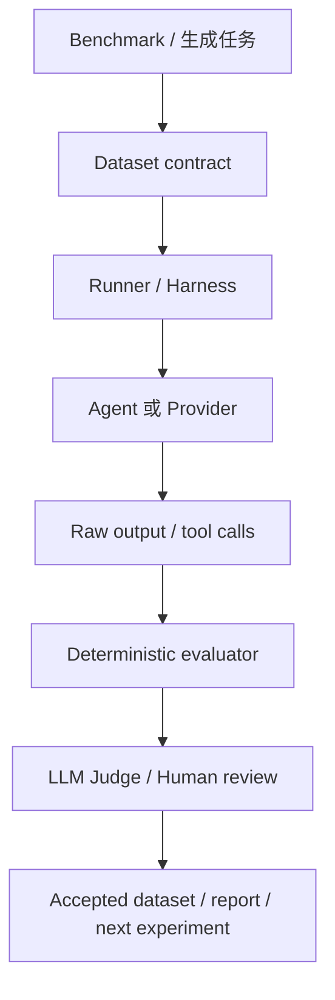
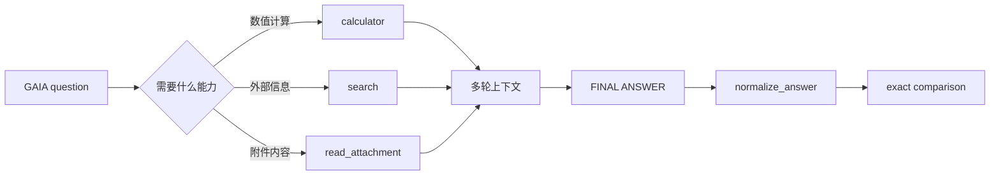
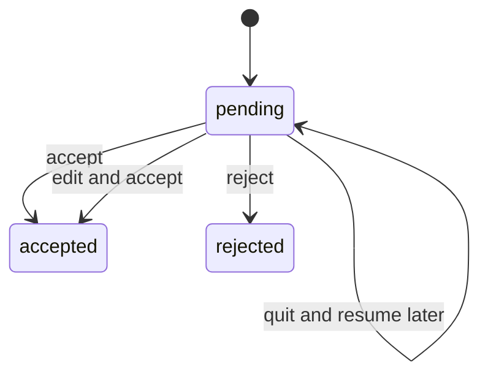
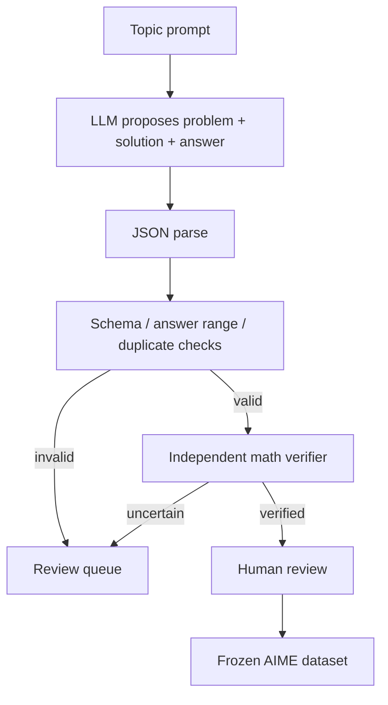

我原本只是想照着 Hello Agents 的第十二章，把 BFCL 和 GAIA 跑起来。

真正写完以后，我发现“跑出一个分数”其实是最不重要的部分。重要的是，我能不能回答下面这些问题：

- 这个分数究竟在测模型、Agent，还是测我写的 harness？
- BFCL 为什么要拿到模型的原始 tool call，而不是 Agent 执行完工具后的最终文本？
- GAIA 的一个 40% 到底说明了什么，又没有说明什么？
- 生成出来的 RAG/AIME 数据，怎样才不是模型自己给自己出题、自己说答案正确？
- LLM Judge、人工审核和确定性 evaluator 应该如何分工？
- 如果 provider SDK 改了返回对象，我怎样知道是模型退化，还是解析器坏了？

这篇不是运行报告，而是我把这几轮工作揉在一起后的学习笔记。主线可以概括成一句话：

> 先定义被测对象和边界，再保存可审计 artifact；先用确定性规则挡住硬错误，再把主观判断交给 LLM Judge 或人工。

## 阅读地图：从 benchmark 分数回到工程问题

这一轮最终形成了下面这条流水线：



| 层 | 它回答什么 | 典型结果 |
| --- | --- | --- |
| Dataset | 输入和标准答案是什么 | BFCL JSON、GAIA Parquet、AIME JSONL |
| Harness | 如何调用模型或 Agent | tool schema、工具循环、附件读取 |
| Raw output | 模型实际输出了什么 | tool_calls、最终文本、reasoning trace |
| Deterministic evaluator | 硬契约是否满足 | AST checker、exact match、schema 校验 |
| LLM Judge | 主观质量如何 | correctness、clarity、completeness |
| Human review | 是否值得进入冻结数据集 | accept、reject、edit、pending |

如果把这些层混在一个 run 函数里，代码可能很快，但实验很难解释。一个“模型答错”的记录，可能实际是附件没有读到、工具名被改坏、答案单位丢失，或者 evaluator 的 normalization 有 bug。

## 1. BFCL：评测的是原始函数调用，不是最后一句话

### 1.1 为什么不能直接调用 MyFunctionCallAgent.run

Hi-Agent 的普通 Agent 流程大致是：

```text
用户问题
  ↓
模型返回 tool call
  ↓
执行工具
  ↓
把工具结果放回上下文
  ↓
继续循环
  ↓
最终只返回文本
```

但是 BFCL 要测的是：模型有没有选择正确的函数，以及参数是不是正确。它并不想知道工具执行完之后 Agent 最后解释了什么。

所以 BFCL runner 使用 provider 的原始请求：

```python
response = llm._client.chat.completions.create(
    model=llm.model,
    messages=first_turn_messages(prompt["question"]),
    tools=tools,
    tool_choice="auto",
    temperature=args.temperature,
    max_tokens=args.max_tokens,
)

message = response.choices[0].message
prediction, parse_errors = extract_tool_result(
    message,
    wire_name_by_input,
)
```

正确的链路是：BFCL question → provider native tools → raw assistant message → BFCL prediction → official AST checker。

如果改成只调用 Agent 的最终文本，再从字符串里用正则找函数名，就把 provider 的协议语义压扁成了字符串匹配，既容易漏掉并行调用，也无法准确判断参数类型。

### 1.2 Provider schema 兼容层

BFCL 数据里的类型命名不一定能直接交给 OpenAI-compatible provider：

```python
PROVIDER_TYPE_MAP = {
    "dict": "object",
    "float": "number",
    "tuple": "array",
}
```

递归转换时还要小心参数名本身叫 type 的情况：

```python
if key == "type" and isinstance(item, str):
    if item == "any":
        continue
    normalized[key] = PROVIDER_TYPE_MAP.get(item, item)
else:
    normalized[key] = _normalize_schema_types(item)
```

最外层的 type 是 schema 元字段，properties.type 却是合法用户参数。判断它是不是类型字段，不能只看键名，还要看它的值是不是字符串。

### 1.3 函数名兼容与冲突

BFCL 里有 math.factorial 这样的函数名，而有些 provider 对函数名中的点号不友好：

```text
math.factorial  →  math_factorial
```

但 a.b 和 a_b 会映射到同一个 wire name。我没有选择静默覆盖，而是主动抛错：

```python
previous_original = original_by_wire_name.get(wire_name)
if previous_original is not None and previous_original != original_name:
    raise ValueError(
        "Function name collision after provider normalization"
    )
```

这类错误如果不在入口处暴露，后面可能表现成“模型选错工具”，实际上是 harness 把两个函数映射成了同一个名字。

### 1.4 从 SDK 对象提取 tool call

不同 SDK 或 fake client 可能给出对象或普通字典，因此用一个适配函数统一读取：

```python
def _get_field(value, name, default=None):
    if isinstance(value, dict):
        return value.get(name, default)
    return getattr(value, name, default)
```

参数还必须满足 JSON object 契约：

```python
arguments = json.loads(raw_arguments)
if not isinstance(arguments, dict):
    errors.append("arguments are not an object")
    arguments = {}
```

JSON 合法和函数调用协议合法，是两件不同的事。json.loads("[1, 2]") 成功，并不代表它是合法函数参数。

### 1.5 simple、multiple、parallel 和 irrelevance

```text
simple       一个函数调用是否正确
multiple     多个候选函数和参数是否整体正确
parallel     是否发出了正确的多个并行调用
irrelevance  不相关请求是否拒绝调用工具
```

parallel 要在请求层显式打开：

```python
if category == "parallel":
    request_kwargs["parallel_tool_calls"] = True
```

irrelevance 则反过来：空 prediction 才是正确行为。这个类别提醒我，Agent 评测不仅要测“会不会调用工具”，也要测“什么时候不应该调用工具”。

### 1.6 BFCL 运行结果应该怎样读

本轮实际跑过的结果包括：

```text
simple_python  5/5  = 100%
multiple       5/5  = 100%
parallel       4/5  = 80%
irrelevance    5/5  = 100%
```

不能据此得出“模型函数调用能力是 95%”。更准确的表述是：在当前模型、provider schema、提示词、函数名兼容层和 BFCL checker 组合下，parallel 类别暴露了一个可复现的失败样本。

## 2. GAIA：从调用工具进入真实任务闭环

### 2.1 GAIA 比 BFCL 多了哪些变量



GAIA 的失败可能来自搜索后端、附件读取、工具循环、答案单位，也可能来自最终输出协议。它测到的是 model + harness 的综合结果，而不是模型本身的纯能力。

### 2.2 数据边界：validation 可以评分，test 不能偷看

对于 validation，metadata 里的 Final answer 可以用来做本地诊断；对于 test，即使本地快照里存在答案列，也必须主动丢弃：

```python
final_answer = (
    None
    if self.split == "test" or raw_answer is None
    else str(raw_answer)
)
```

否则本地 evaluator 可能无意中把隐藏答案写进 artifact，之后任何结果都不再可信。

### 2.3 附件路径不能逃出 split root

统一解析附件后必须做边界检查：

```python
if self.split_root != resolved and self.split_root not in resolved.parents:
    raise ValueError(
        f"GAIA attachment escapes split root: {value!r}"
    )
```

我专门为 ../../secret.txt 写了测试。数据集读取器不只是把字符串拼成 Path，它还承担了 evaluator 的安全边界。

### 2.4 附件预处理的真实含义

当前 GAIA 的 read_attachment 通过 MarkItDown 把 PDF、DOCX、PPTX、XLSX、CSV、JSON、XML、TXT 和常见图片转换成可阅读文本：

```text
attachment file
      ↓
MarkItDown
      ↓
text
      ↓
Agent context
```

所以当前实验更准确地说是 Hi-Agent + MarkItDown text conversion，而不是严格意义上的原生多模态 Agent。这个边界必须写在报告里。

### 2.5 GAIA normalization 不是普通清洗

答案提取和答案规范化，是 evaluator 的一部分：

```python
assert normalize_answer("$1,234.56") == "1234.56"
assert normalize_answer("The United States") == "united states"
assert normalize_answer("Paris, London, Berlin") == "berlin,london,paris"
assert normalize_answer("  12% ") == "12"
```

这些规则包括小写化、去除货币符号和百分号、去除数字内部逗号、去除开头冠词、列表排序和去除末尾标点。17 和 17000 不是同一个答案；题目要求单位转换时，输出协议本身就是正确性的一部分。

### 2.6 GAIA 的一次真实小样本

本轮跑了 Level 1 validation 的 5 个样本：

```text
2/5 = 40%
```

其中一个失败案例中，模型调用了搜索和计算器，计算过程得出了约 17000 的数量级，但最终答案的单位和题目要求没有完全对齐。

因此更准确的结论是：在当前 search 后端、工具 schema、最大迭代次数、提示词、附件预处理和答案 normalization 下，5 个 Level 1 validation 任务中有 2 个完整通过。

## 3. 为什么要做通用 LLM Judge

BFCL 和 GAIA 有明确的硬标准，但数据生成质量经常不是二值问题。一条候选可能格式正确，却问题含糊、解答不完整、证据关联弱，或者 AIME 答案只是模型猜的。

### 3.1 通用 Judge 的输入契约

我把 Judge 设计成 suite-agnostic：

```python
class JudgeItem(BaseModel):
    item_id: str
    candidate: Any
    reference: Any | None = None
    context: Any | None = None
    metadata: dict[str, Any] = {}
```

核心接口刻意没有写死 gold_evidence、expected_terms 或 answer_type。RAG 可以把证据放进 context，AIME 可以把题面和参考解放进 reference，Context 可以把 oracle 输出放进 reference。

### 3.2 Rubric 和本地决策

默认 rubric 的四个维度是 correctness、relevance、clarity、completeness。模型只返回维度分数，整体分数和最终决策由代码计算：

```python
overall = fmean(scores.values())
if overall >= accept_threshold:
    decision = "accept"
elif overall >= review_threshold:
    decision = "needs_review"
else:
    decision = "reject"
```

模型不能通过直接返回 accept 绕过 rubric 阈值。LLM Judge 的输出也必须像普通数据一样被验证和审计。

### 3.3 Judge 的正确位置

```text
硬约束：代码判断
主观质量：LLM Judge
最终冻结：人工审核
```

以 RAG 为例，先由 rag_validator 检查 schema、quote、source_id 和 duplicate，再用 Judge 评价 relevance、clarity、completeness，最后才进入人工审核。

AIME 也不能让 Judge 单独决定数学正确性：

```text
answer ∈ [0, 999]
        ↓
独立解题器 / 精确答案 evaluator
        ↓
LLM Judge 评价解法清晰度和完整性
        ↓
人工确认
```

## 4. 人工审核：把 review queue 变成真正的闭环

早期 RAG 人工修正脚本里的 CORRECTIONS 字典只能修固定数据，很难复用到 AIME、Context 或下一批候选。因此新增了通用 ReviewSession：



每次决定都会写入 state JSONL：

```json
{
  "review_id": "aime-001",
  "candidate": {"answer": 42},
  "errors": ["请核对数学正确性"],
  "decision": "pending",
  "reviewer": "bubblevan",
  "note": "",
  "updated_at": ""
}
```

启动审核：

```powershell
uv run python -m evals.data_generation.manual_review review --queue artifacts/aime-review.jsonl --state artifacts/aime-review.state.jsonl --reviewer bubblevan --accepted-output artifacts/aime.accepted.jsonl --rejected-output artifacts/aime.rejected.jsonl --pending-output artifacts/aime.pending.jsonl
```

每条候选可以接受、拒绝、编辑后接受、跳过或退出。人工接受不等于最终冻结，导出后仍需重新跑对应的确定性 validator。

## 5. Pairwise Win Rate：比较两个答案，而不是迷信绝对分数

### 5.1 输入与盲评

```json
{
  "pair_id": "case-001",
  "prompt": "Solve the task",
  "candidate_a": {"answer": "..."},
  "candidate_b": {"answer": "..."},
  "reference": {"answer": "..."},
  "metadata": {"suite": "aime"}
}
```

如果 A 永远显示在左边，模型可能学到左边就是答案。实现里用 seed + pair_id 做稳定 SHA-256 打乱，结果再映射回原始 A/B，报告还保留 display_a_was_original 方便审计。

### 5.2 两个 Win Rate 口径

平局折半后的总体胜率：

```python
a_win_rate = (a_wins + 0.5 * ties) / total_pairs
```

排除平局后的 decisive win rate：

```python
decisive_a_win_rate = a_wins / (a_wins + b_wins)
```

我还计算 decisive 结果的 Wilson 95% 区间。小样本下，A 胜 3 场、B 胜 2 场不足以说明 A 稳定领先。

运行：

```powershell
uv run python -m evals.data_generation.pairwise_judge --input artifacts/pairs.jsonl --output artifacts/pairwise-results.jsonl --report artifacts/pairwise-report.json --model deepseek-v4-flash --temperature 0 --seed 17
```

当前实现已经处理了位置偏差，但多 Judge 一致性、重复评审和人工校准适合放到 V2。

## 6. AIME Generator：生成结构，不伪造数学证明

### 6.1 最小结构和答案边界

```python
class AIMECandidate(BaseModel):
    case_id: str
    problem: str
    solution: str
    answer: int
    topic: str
    difficulty: str
```

AIME 答案必须满足 0 <= answer <= 999，还要防止 Python 把 True 当成整数 1：

```python
@field_validator("answer", mode="before")
@classmethod
def reject_boolean_answer(cls, value):
    if isinstance(value, bool):
        raise ValueError("AIME answer must be an integer in 0..999")
    return value
```

### 6.2 生成到冻结



运行：

```powershell
uv run python -m evals.data_generation.aime_generator --topic algebra --topic geometry --count-per-topic 5 --difficulty medium --output artifacts/aime.accepted.jsonl --review-output artifacts/aime-review.jsonl --model deepseek-v4-flash --temperature 0.4
```

AIME Generator 只保证题面、解答、答案字段、答案范围、重复 ID 和重复题面等结构约束，不把模型声称的答案当成数学证明。

## 7. P1：给核心 evaluator 补确定性单元测试

写完 runner 后，我又发现一个明显缺口：AIME、Manual Review 和 Pairwise 有测试，但 BFCL 测试文件缺失，GAIA 只有基础覆盖。

### 7.1 BFCL 测试兼容层

新增的 test_bfcl_simple_python.py 固定了：

```text
dict → object
float → number
tuple → array
math.factorial → math_factorial
a.b 与 a_b 碰撞时主动失败
SDK object 和 dict 都能读取
非法 JSON 参数进入 errors
irrelevance 不能发出 tool call
```

测试使用 SimpleNamespace 模拟 SDK 对象，不调用真实 provider，却可以保护 provider 边界最容易发生的回归。

### 7.2 GAIA 测试 evaluator 自己的判断

GAIA 测试现在覆盖：

- normalization 契约；
- 附件路径不能逃出 split root；
- 附件 prompt 必须暴露 read_attachment；
- Agent 抛异常时保留 error；
- 没有公开答案的 test case 为 scorable=False；
- 导出的 JSONL 不携带 expected answer。

normalization 不是测试辅助代码，而是 correctness contract。它一旦改变，benchmark 分数就可能改变，因此必须被单元测试冻结。

### 7.3 测试结果和边界

运行：

```powershell
uv run pytest tests/unit/evals -q
```

结果：

```text
81 passed, 1 skipped
```

全仓测试里还有两个已有的 A2A async 测试因为当前环境缺少 pytest-asyncio 而失败。这和本次 BFCL/GAIA 测试没有关系，但它提醒我：测试环境依赖也应该进入项目契约。

单元测试验证 evaluator 的确定性逻辑；真实 benchmark 验证 model + provider + harness + tools + evaluator 的综合行为。两者都不能替代对方。

## 8. 一次实验 artifact 应该保存什么

一个可复盘的评测结果，至少要能回答：输入是什么、模型实际输出了什么、evaluator 如何判定、运行配置是什么。

BFCL report 需要保留 prediction、score、finish_reason、usage 和 latency_ms。GAIA report 需要保留 predicted、normalized_predicted、valid、scorable、error 和原始 response。Judge report 还要保留 rubric、rubric_version、dimension_scores、overall_score、decision 和 raw_response。

如果只保存 accuracy=0.4，下次只能继续猜。保存逐题 evidence，才有可能把失败归因到 schema、工具、答案格式、模型能力或数据质量。

## 9. 我现在对“评测完成”的定义

以前我容易把下面这句话当成完成：

```text
命令跑通，终端打印了一个百分比。
```

现在我会把完成拆成四层：

1. **能运行**：依赖、环境变量、数据路径和 provider 请求正确。
2. **能评分**：工具调用、最终答案、引用或结构能被明确判定。
3. **能解释**：报告保存逐题输出、错误类型、参数、延迟和配置。
4. **能回归**：evaluator 有 fake client / fake agent 单测，数据生成有 validator，人工修改有 state 文件。

这几轮 BFCL、GAIA、LLM Judge、Manual Review、Pairwise 和 AIME 的工作，真正完成的是后三层，而不只是第一层。

## 10. 罗盘式总结

这几轮代码让我形成了一个比“把 Agent 跑起来”更具体的复盘框架：

```text
先问：我究竟在测什么？
再写：Dataset / Harness / Evaluator contract
然后做：确定性边界和安全边界
接着存：raw output / report / review state
最后说：这次实验 Proves 什么，Does not prove 什么
```

BFCL 让我看到 Agent 的“手”：函数名、参数、多个调用、并行调用和拒绝调用都可以被精确检查。

GAIA 让我看到 Agent 的“脑和手”：它要判断是否需要工具、是否需要附件、怎样组合多轮结果，以及怎样把答案写成正确单位和正确协议。

通用 LLM Judge 让我看到，生成数据质量不能只靠 schema，也不能把 RAG 的字段硬塞进所有评测。核心应该保持通用，让 RAG、AIME、Context 各自提供 reference、context、rubric 和确定性 validator。

人工审核和 Pairwise 把“质量”变成了可追踪流程：一个有状态的 review queue，一组有盲评和置信区间的对比结果。

AIME Generator 最后提醒我：最危险的不是模型输出 JSON 失败，而是模型输出了看起来非常像正确答案的 JSON。结构有效、答案在范围内、解答很流畅，都不等于数学正确。

所以我现在更愿意用下面这句话判断一个评测系统是否值得相信：

> 它不只给我一个分数，还能告诉我这个分数如何产生、哪里可能错、下一步应该修哪一层。
