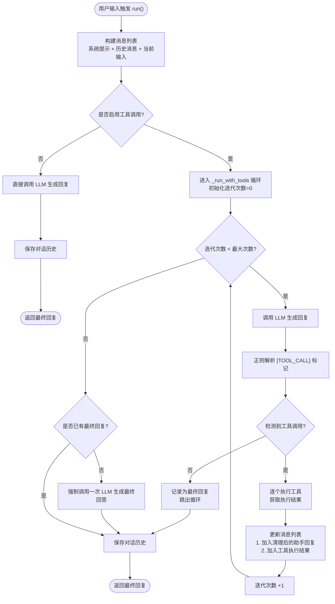
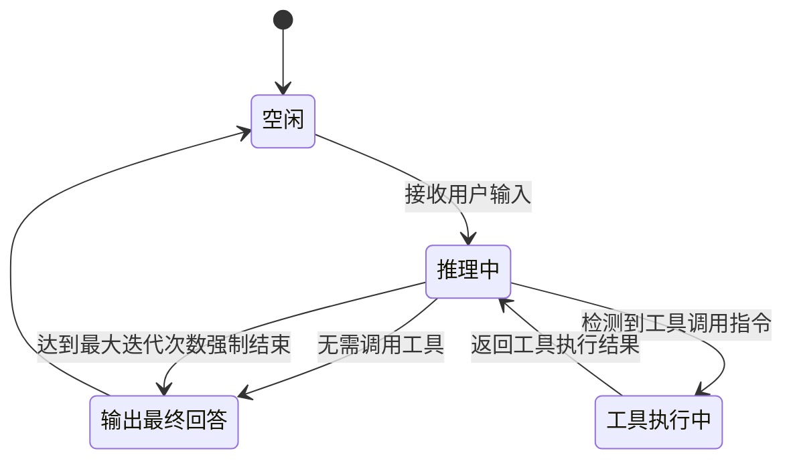
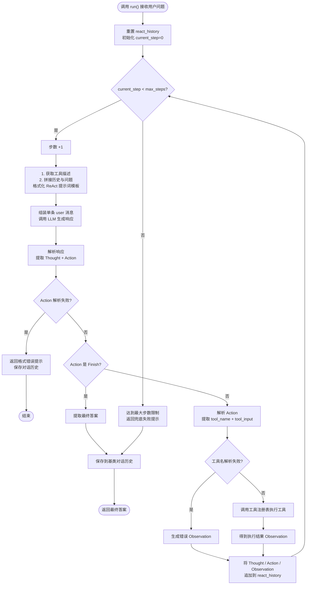
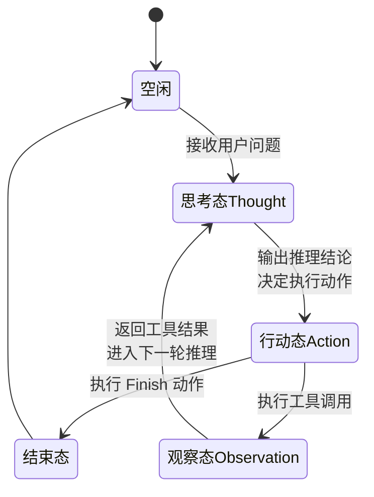
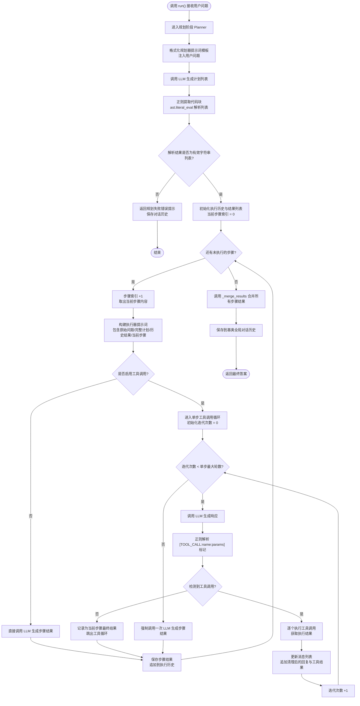
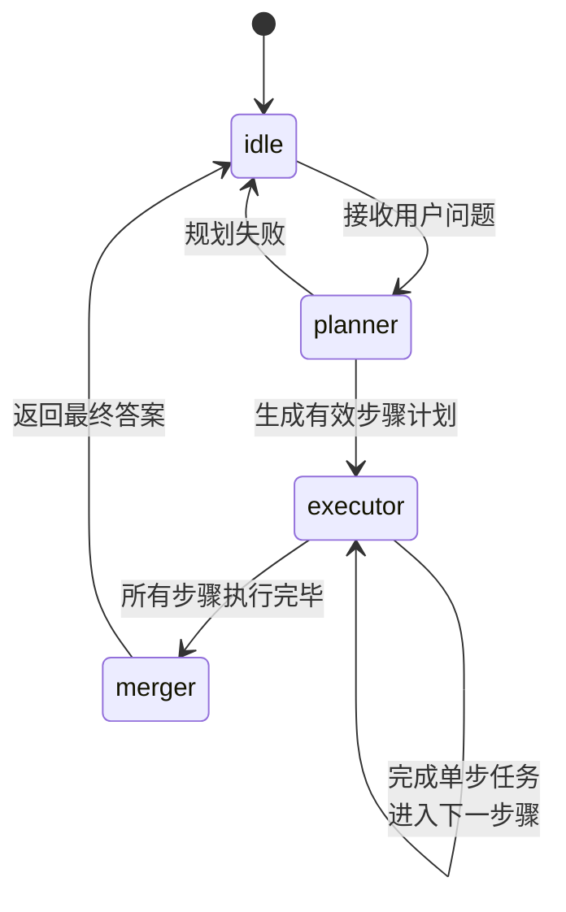
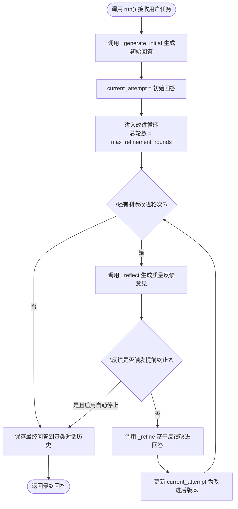
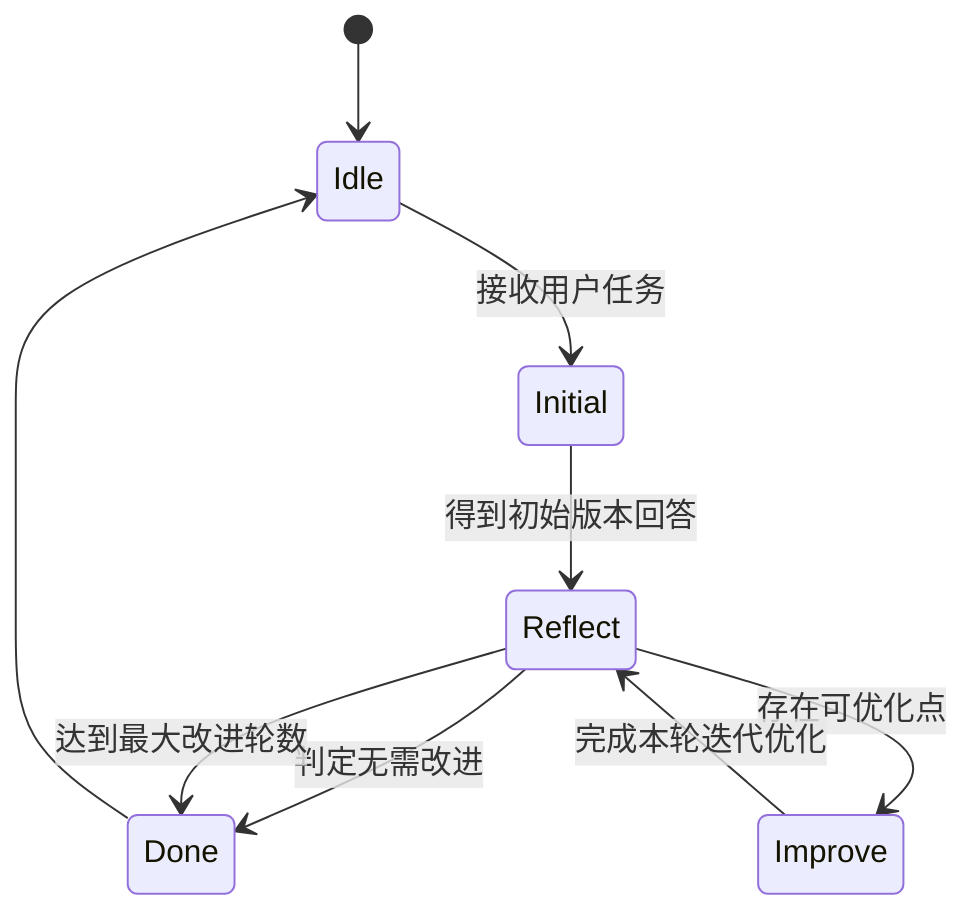

## 4.1 LLM引擎
主要实现了一个能识别各种provider的LLM客户端。
##### `@classmethod`
`@classmethod` 是 Python 原生的**类方法装饰器**，被它装饰的方法不再属于「类的实例」，而是属于「类本身」。
它有两个核心特征：
- 第一个固定参数是 `cls`（代表当前类本身，对应普通方法的 `self`），通过 `cls` 可以直接调用类的构造器、访问类属性。
- **无需先创建类的实例，直接通过「类名.方法名()」就能调用**。
举个调用例子：
```python
# 不用手动读环境变量、不用一个个传参
# 直接调用类方法，就能拿到初始化好的 Config 实例
config = Config.from_env()
print(config.temperature)  # 0.7
print(config.debug)        # 读取环境变量后的布尔值
```
普通实例方法必须先有实例才能调用（`config.xxx()`），但我们的需求是「用这个方法来创建实例」——如果必须先实例化才能调用创建方法，就陷入了死循环。
类方法不依赖实例，天然适合作为「对象创建入口」，把复杂的初始化逻辑封装起来，调用方无需关心内部实现细节。

| 方法类型 | 装饰器 | 第一个参数 | 调用方式 | 核心用途 |
| :--- | :--- | :--- | :--- | :--- |
| 实例方法 | 无 | `self`（实例本身） | `实例.方法()` | 操作/修改实例属性 |
| 类方法 | `@classmethod` | `cls`（类本身） | `类名.方法()` | 创建实例、操作类级属性 |

## 4.2 框架接口
### 4.2.1 消息基类
在智能体与大语言模型的交互中，对话历史是至关重要的上下文。为了规范地管理这些信息，我们设计了一个简易 `Message` 类。在后续上下文工程章节中，会对其进行扩展。

#### Pydantic
Pydantic 是 Python 生态中最主流的 **数据校验 + 数据序列化** 第三方库，核心设计理念是 **基于 Python 原生类型注解（Type Hints）实现运行时的数据结构管控**。

我们的目的是，让 Python 这种动态类型语言，也能拥有接近静态语言的类型安全能力，同时兼顾开发效率与运行性能。
目前 FastAPI、LangChain 等大量主流框架都深度依赖 Pydantic 作为数据层底座，自然我们实现代码里的消息模型、LLM 入参建模，都是需要它作为最典型的使用场景：`from pydantic import BaseModel`，然后我们的类继承自`BaseModel`。

##### 1. 运行时自动类型校验
这是 Pydantic 最核心的价值。普通 Python 类/字典不会校验数据类型，传错了只会在运行到深层逻辑时才报错，排查困难；而 Pydantic 模型在 **实例化的瞬间就会完成全字段校验**，类型不匹配直接抛出明确的 `ValidationError`。

```python
from pydantic import BaseModel

class User(BaseModel):
    name: str       # 声明：name 必须是字符串
    age: int        # 声明：age 必须是整数

# ✅ 正常实例化
user = User(name="张三", age=20)
print(user.name)  # 张三

# ❌ 类型错误，实例化时直接抛异常
user = User(name=123, age="二十")  
# 报错：1 validation error for User / name Input should be a valid string
```

对应到 `MyMessage`：
- `role: MessageRole` 配合 `Literal`，会强制校验角色只能是 `user/assistant/system/tool`，手误拼错直接拦截；
- `content: str` 会保证消息内容一定是字符串，不会传进来数字、列表等非法类型。

##### 2. 智能自动类型转换（宽松模式）
Pydantic 默认不是死板的“类型完全一致才行”，而是会在安全范围内做自动类型转换，兼顾严谨性和易用性。比如字符串形式的数字会自动转为数值类型，符合格式的字符串会自动转为 datetime 对象。

```python
# "20" 是字符串，但可以安全转为整数，Pydantic 会自动转换
user = User(name="张三", age="20")
print(type(user.age))  # <class 'int'>，自动转成了 int
```

如果需要严格类型校验（必须完全匹配类型，不允许转换），可以开启严格模式：
```python
from pydantic import ConfigDict

class User(BaseModel):
    model_config = ConfigDict(strict=True)  # 开启严格模式
    name: str
    age: int

User(name="张三", age="20")  # 直接报错，不允许字符串转整数
```

##### 3. 开箱即用的序列化能力
Pydantic 模型可以一键转为字典、JSON 字符串，不用自己手写转换方法，这也是我们代码里 `to_dict()` 方法的底层能力来源。

```python
user = User(name="张三", age=20)

# 转字典（V2 推荐用 model_dump，V1 是 .dict()）
print(user.model_dump())  
# {'name': '张三', 'age': 20}

# 转 JSON 字符串
print(user.model_dump_json())  
# '{"name":"张三","age":20}'
```

##### 4. 丰富的字段约束规则
除了基础类型，我们还可以给字段加更细的约束：长度、数值范围、正则表达式、默认值生成规则等，都通过声明式语法实现，不用自己写 `if/else` 校验。

最常用的是 `Field` 工具，用于精细化配置单个字段：
```python
from pydantic import Field

class User(BaseModel):
    # name：字符串，长度 2~20，字段描述为"用户名"
    name: str = Field(min_length=2, max_length=20, description="用户名")
    # age：整数，最小值 0，最大值 120，默认值 18
    age: int = Field(gt=0, lt=120, default=18)
    # 时间戳：默认值用工厂函数生成，每次实例化自动取当前时间
    create_time: datetime = Field(default_factory=datetime.now)
```

我们目前通过重写 `__init__` 来自动填充 `timestamp`，其实用 `Field(default_factory=datetime.now)` 是更标准、更简洁的 Pydantic 写法，完全不需要重写初始化方法：
```python
class MyMessage(BaseModel):
    content: str
    role: MessageRole
    timestamp: datetime = Field(default_factory=datetime.now)  # 自动填充当前时间
    metadata: Optional[Dict[str, Any]] = Field(default_factory=dict)  # 默认空字典
```

##### 5. 自定义校验规则
对于复杂的业务校验逻辑（比如手机号格式、密码强度、内容合法性），可以用 `@field_validator` 装饰器写自定义校验函数，校验失败直接抛异常。

```python
from pydantic import field_validator

class User(BaseModel):
    phone: str

    @field_validator("phone")
    @classmethod
    def validate_phone(cls, value: str) -> str:
        if not value.startswith("1") or len(value) != 11:
            raise ValueError("手机号格式不正确")
        return value
```

##### 6. 嵌套模型支持
Pydantic 支持模型套模型，自动完成多层级的数据校验与序列化，非常适合复杂的接口返回、结构化数据场景。

```python
class Address(BaseModel):
    city: str
    street: str

class User(BaseModel):
    name: str
    age: int
    address: Address  # 字段类型是另一个 Pydantic 模型

# 自动嵌套校验
user = User(
    name="张三", 
    age=20, 
    address={"city": "杭州", "street": "文三路"}
)
print(user.address.city)  # 杭州，自动转为 Address 对象
```

| 功能 | Pydantic V1 写法 | Pydantic V2 写法 |
| :--- | :--- | :--- |
| 转字典 | `instance.dict()` | `instance.model_dump()` |
| 转JSON | `instance.json()` | `instance.model_dump_json()` |
| 自定义校验器 | `@validator` | `@field_validator` |
| 模型配置 | `class Config:` 内部类 | `model_config = ConfigDict(...)` |
| 核心性能 | Python 实现，速度一般 | Rust 核心，性能提升数倍到数十倍 |

结合正在写的 LLM 客户端，Pydantic 的作用会体现在这些地方：
1. **消息格式统一管控**：保证所有对话消息都符合 `role + content` 的标准格式，避免因为手误、上游传参错误导致 LLM 接口调用失败。
2. **入参出参标准化**：后续如果扩展工具调用、函数调用能力，嵌套的参数结构可以直接用 Pydantic 建模，自动校验格式。
3. **降低调试成本**：数据格式错误会在实例化时立刻暴露，不用等到调用 LLM 接口报错再回溯，排查问题更快。
4. **无缝对接上下游**：转字典、转 JSON 都是原生能力，和 OpenAI SDK、数据库、API 接口交互时不用额外写转换逻辑。

### 4.2.2 配置基类
### 4.2.3 Agent抽象基类
`Agent` 类是整个框架的顶层抽象。它定义了一个智能体应该具备的通用行为和属性，但并不关心具体的实现方式。

我们通过 Python 的 `abc` (Abstract Base Classes) 模块来实现它，这强制所有具体的智能体实现（如后续章节的 `SimpleAgent`, `ReActAgent` 等）都必须遵循同一个“接口”。

##### Abstract Base Class
面向对象设计中「接口规范」的标准实现方式。

它的核心价值是**定义契约、强制规范**：
- 继承了 `ABC` 的类是「抽象基类」，**不能直接实例化**（你不能直接 `MyAgent()` 创建对象，必须编写子类继承它）。
- 配合 `@abstractmethod` 装饰器标记的方法叫「抽象方法」，只有方法签名、没有具体实现，**所有子类必须重写并实现这个方法**，否则子类实例化时会直接抛出语法错误。

这里我们未来会实现 SimpleAgent、ReActAgent、ToolAgent 等不同逻辑的智能体，但它们都应该有 `run()` 这个统一的调用入口。用 ABC 就能从语法层面强制所有子类都实现 `run()`，保证对外接口完全一致，不会出现某个子类漏写方法导致运行崩溃的情况。
```python
from abc import ABC, abstractmethod

class Animal(ABC):
    @abstractmethod
    def speak(self):
        pass

# ❌ 直接实例化抽象类会直接报错
# animal = Animal()  # 报错：Can't instantiate abstract class Animal

class Dog(Animal):
    # ✅ 子类必须实现所有抽象方法，才能正常实例化
    def speak(self):
        return "汪汪汪"

dog = Dog()
print(dog.speak())  # 汪汪汪
```


这是典型的**面向对象开闭原则**实践：
- 对扩展开放：后续新增任何类型的 Agent（比如带工具调用的、带长期记忆的、多轮反思的），都只需要继承这个基类、实现 `run` 方法，就能无缝融入现有框架。
- 对修改关闭：上层调用 Agent 的代码完全不用改，因为所有 Agent 的入口都是 `run()`，不会因为新增 Agent 类型就修改调用逻辑。

## 4.3 工具系统
### 4.3.1 工具基类
### 4.3.2 工具注册表
用于**集中管理、动态发现可插拔组件**的经典设计模式，核心思想是搭建一个统一的「注册中心」，所有组件（这里是工具）都主动注册到中心，使用者只需要通过名称就能查找和调用组件，无需关心组件的具体实现细节。
它的价值非常明确：
- **解耦**：Agent 只和注册表交互，不用硬编码每个工具的调用逻辑，新增工具时无需修改 Agent 核心代码
- **统一入口**：所有工具的注册、查询、执行、描述生成都走一套逻辑，规范统一
- **可扩展**：支持运行时动态增删工具，适配插件化的工具生态

分「工具对象」和「函数工具」两种注册方式，这是兼顾**规范性**和**灵活性**的设计：
- `MyTool` 类工具：有标准化结构（名称、描述、结构化入参、统一 run 方法），适合复杂工具（如搜索引擎、文件操作、API 调用），支持多参数、参数校验
- 函数工具：无需写类，传一个普通函数就能注册，开发成本极低，适合单参数的简单工具（如字符串处理、简单计算）

### 4.3.3 计算器工具
### 4.3.4 搜索工具
### 4.3.5 其他技巧
课程里提到的是 **链式调用机制** 和针对耗时操作的 **异步工具执行支持**。

### 4.4 Agent范式的框架化实现
#### `**kwargs`
Python 的函数参数语法，全称 **keyword arguments（关键字参数）**，作用是**接收任意数量的关键字参数，并将它们自动打包为一个字典（dict）**，在函数内部可以直接按字典操作。

> 补充：`kwargs` 只是行业约定俗成的变量名，并非语法强制。写成 `**params`、`**config` 都可以正常运行，但通用规范里统一用 `kwargs` 提升代码可读性。

函数定义时加上 `**kwargs`，调用时就可以传入任意个数的「键=值」形式参数：
```python
def print_info(**kwargs):
    # 函数内部 kwargs 是一个标准字典
    for key, value in kwargs.items():
        print(f"{key}: {value}")

# 传入任意数量的关键字参数
print_info(name="张三", age=20, major="计算机")
```
运行输出：
```
name: 张三
age: 20
major: 计算机
```
1. **必须放在参数列表末尾**
   函数参数的标准顺序为：普通位置参数 → `*args` → 默认值参数 → `**kwargs`，顺序错误会直接报语法错误。
   ```python
   # 正确写法
   def demo(pos_arg, *args, default_arg=10, **kwargs):
       pass
   ```

2. **两个星号不能省略**
   - 单个星号 `*args`：接收任意数量的位置参数，打包为**元组**
   - 两个星号 `**kwargs`：接收任意数量的关键字参数，打包为**字典**

3. **函数内支持所有字典操作**
   可以用 `kwargs.get("key")` 安全取值、`kwargs["key"]` 直接取值、`for` 遍历、`update()` 更新等所有字典原生方法。

`**` 不仅能在函数定义时打包参数，还能在**调用函数**时，把一个字典拆成关键字参数传入，这是工程开发里极常用的写法：
```python
def add(a, b):
    return a + b

params = {"a": 10, "b": 20}
# 等价于 add(a=10, b=20)
print(add(**params))  # 输出 30
```

| 语法 | 核心作用 | 打包后数据类型 |
|------|----------|----------------|
| `*args` | 接收任意数量的位置参数 | 元组（tuple） |
| `**kwargs` | 接收任意数量的关键字参数 | 字典（dict） |

典型使用场景包括：
1. **编写通用装饰器**：不知道被装饰的函数会有多少参数，用 `*args + **kwargs` 透传所有参数，兼容任意函数。
2. **类继承透传参数**：子类重写父类方法时，用 `**kwargs` 接收并向上传递参数，避免参数列表重复冗余。
3. **封装通用函数**：比如封装 API 请求、配置初始化这类参数不固定的函数，灵活接收额外配置项。

#### 4.4.1 SimpleAgent


1. **入口层** → 对应 `run()` 方法
   - 构建消息：拼接增强系统提示、历史上下文、当前用户输入
   - 分支判断：由 `enable_tool_calling` 变量控制两条路径
2. **核心循环层** → 对应 `_run_with_tools()` 方法
   - LLM 推理：`self.llm.invoke()`
   - 工具解析：`_parse_tool_calls()` 正则匹配标记
   - 工具执行：`_execute_tool_call()` 调用工具注册表
   - 消息回填：将清理后的助手回复、工具结果依次追加到消息列表
3. **边界兜底**
   - 最大迭代次数保护：防止无限循环
   - 超次数强制生成：保证一定返回最终回答
   - 统一历史持久化：存入 `_history` 列表


#### 4.4.2 ReAct
1. **思考过程从隐式变显式**
   - 上一个 Simple Agent：LLM 偷偷在内部决定要不要调用工具，思考过程不外露，只有 `[TOOL_CALL]` 标记。
   - 这个 ReAct Agent：强制要求 LLM 先输出 `Thought` 再输出 `Action`，推理逻辑可观测、可调试，复杂任务的稳定性大幅提升。

2. **历史管理分层设计**
   - 基类 `_history`：跨任务的对话历史，保存用户和助手的最终问答。
   - 实例 `react_history`：单轮任务内的推理步骤（Thought/Action/Observation），任务结束就重置，不污染长期对话。
   这是非常规范的工程化设计，后续做多轮复杂任务时优势会很明显。

3. **终止条件从「无工具调用」变「显式 Finish」**
   - Simple Agent：LLM 输出里没有工具标记，就默认是最终答案。
   - ReAct Agent：必须由 LLM 主动输出 `Finish[答案]` 才结束，可控性更强，也能避免 LLM 中途提前终止。



| 图中节点 | 对应代码位置 | 核心作用 |
|----------|--------------|----------|
| Reset | `run()` 开头 | 每轮任务清空推理链路历史，避免跨任务污染 |
| BuildPrompt | `prompt_template.format(...)` | 把工具、问题、历史全部塞进单条提示词 |
| Parse | `_parse_output()` 方法 | 正则提取 Thought 和 Action，兼容不标准输出 |
| ParseTool | `_parse_action()` 方法 | 解析 `工具名[参数]` 格式 |
| PushHistory | `self.react_history.append(...)` | 保存单轮任务内的推理链路，仅在本次 run 内有效 |
| SaveHistory | `_save_to_history()` | 把最终结果存入基类的全局对话历史 |


#### 4.4.3 Plan-and-Solve
1. **Simple Agent：隐式反应式**
   - 核心逻辑：边想边做，遇到问题再调用工具，没有提前规划
   - 适用场景：简单问答、单步工具调用
   - 缺点：复杂任务容易走偏、反复横跳

2. **ReAct Agent：单步推理式**
   - 核心逻辑：走一步想一步，每一步都先思考再行动，边执行边调整
   - 适用场景：探索类任务、不确定路径的问题（比如搜索调研）
   - 缺点：没有全局视角，容易在细节里绕圈，步数浪费严重

3. **Plan-and-Solve：全局规划式**
   - 核心逻辑：先定全局路线，再按计划一步步执行，最后汇总结果
   - 适用场景：结构清晰的复杂任务、多步骤固定流程任务
   - 缺点：计划一旦错了，后面全错，灵活性不如 ReAct



| 图中节点 | 对应代码位置 | 核心作用 |
|----------|--------------|----------|
| 规划阶段全流程 | `_plan()` 方法 | 调用 LLM 拆解问题，解析为结构化步骤列表 |
| 执行步骤循环 | `_execute_plan()` 方法 | 按顺序逐个执行计划中的子任务 |
| 单步工具调用循环 | `_execute_step_with_tools()` 方法 | 复用 Simple Agent 的工具调用逻辑，支持单步内多轮工具调用 |
| 结果合并 | `_merge_results()` 方法 | 将多步执行结果汇总为最终回答 |
| 全局历史保存 | `_save_to_history()` 继承逻辑 | 仅保存最终问答，不存储中间推理过程 |


#### 4.4.4 Reflection

1. **Reflection 的核心定位：自我迭代优化器**
   它不负责工具调用、不负责任务拆解，核心能力是**「自我审查 + 定向优化」**，通常不作为独立 Agent 处理复杂任务，而是作为「增强模块」嵌在其他 Agent 的输出环节——比如 ReAct 得到最终答案后，用 Reflection 再做一轮润色和校验，提升输出质量。

2. 和其他三种范式的核心差异
   - Simple / ReAct / Plan-and-Solve：都是**向外拓展**，通过工具、规划来获取信息、解决问题，核心是「做对事」。
   - Reflection：是**向内优化**，不新增外部信息，只通过自我反思提升回答的准确性、完整性和表达质量，核心是「把事做好」。

3. 典型适用场景
   - 文案写作、代码生成、报告输出等对最终质量要求高的场景
   - 作为其他 Agent 的后置增强模块，兜底输出质量
   - 不适合：需要外部信息、工具调用的探索类任务


| 图中节点 | 对应代码位置 | 核心逻辑 |
|----------|--------------|----------|
| 初始生成 | `_generate_initial()` | 基于初始提示词生成第一版回答，作为迭代基线 |
| 反思校验 | `_reflect()` + `_should_stop()` | 自检回答质量，通过关键词匹配判断是否达到终止条件 |
| 迭代改进 | `_refine()` | 结合反思反馈，定向优化上一版回答的不足 |
| 终止条件 | `stop_if_no_improvement` 配置 + 最大轮数限制 | 双重兜底：质量达标提前结束，轮数用完强制结束 |
| 历史保存 | `add_message()` 继承方法 | 仅保存最终版本，不存储中间迭代过程 |


#### 4.4.5 Function Call
原生 Function Calling 的核心本质就是：
> 模型在训练阶段就专门习得了「输出结构化工具调用指令」的能力，API 层通过标准 `tools` 参数传递工具定义，模型直接返回 JSON 格式的调用指令，全程不需要用正则从自然语言文本里提取标记。

之前 Simple Agent 里的 `[TOOL_CALL:xxx]` 正则解析方案，属于“无原生 FC 时代的文本约定方案”；而这个 FunctionCallAgent 是工业界标准的官方实现方式。


| 对比维度 | 文本正则解析（Simple Agent 方案） | 原生 Function Calling |
|----------|----------------------------------|--------------------------------|
| 输出形式 | 夹杂在自然语言中的自定义标记 | 模型输出独立的结构化 `tool_calls` 字段，和文本内容分离 |
| 解析方式 | 正则表达式匹配字符串，容错率低 | API 层直接返回结构化 JSON 对象，无需额外解析 |
| 格式稳定性 | 依赖模型遵守约定，经常漏写标记、格式出错 | 模型专门训练过格式输出，出错概率极低 |
| 多工具并发 | 只能串行逐个解析执行 | 原生支持一次响应调用多个工具，可并行执行 |
| 参数复杂度 | 只能传递简单字符串，复杂参数解析极易出错 | 支持对象、数组、数字、布尔值等完整 JSON 类型，自带参数校验 |
| 跨模型兼容性 | 理论上所有文本模型都能用 | 必须模型本身支持 Function Calling 能力 |
| 消息协议 | 自定义格式，非标准 | 遵循 OpenAI 标准协议，生态通用 |