前面为了学 MCP，我陆续写了协议地图、Mini-MCP、MCP Host、Tool Catalog 和 Selector 几组笔记。每一篇单独看都能解释一个局部问题，但放在一起就很碎：有些概念重复，有些实现细节藏在实验记录里，有些真正值得记住的工程结论反而被 TODO 和过程信息淹没了。

所以这一篇不再按提交顺序记流水账，而是重新从“**MCP 到底解决什么问题**”开始，把协议层、Host 层和 Context Engineering 串成一条完整路线。目标也很明确：以后复习 MCP 时只需要重新读这一篇，既能回答面试里的概念题，也能顺着代码重新找到 Hi-Agent 的实现边界。

---

## 1. 这一阶段做到什么程度，才算 MCP 学完了

我一开始担心两种极端：一种是只会 `pip install mcp`，调用几个 SDK API，却不知道 MCP 的 wire protocol 到底发生了什么；另一种是掉进“自己重写官方 SDK”的坑，花大量时间实现 transport、JSON Schema、认证和兼容层，最后学到的东西反而和真实 Agent Runtime 没有太大关系。

最后采用的是两层路线：

```text
Mini-MCP
    ↓
亲手理解协议骨架
    ↓
Official MCP Python SDK
    ↓
Hi-Agent MCP Host
    ↓
Tool Catalog / Selector / Policy / Trace
```

现在这两层都已经走通。Mini-MCP 负责让我看懂 2026-07-28 MCP 的核心 wire contract，正式 Host 则已经使用官方 Python SDK，把 MCP Server 暴露的能力接入 Hi-Agent 原有的 `ToolRegistry`、Context Selector、安全策略和 Trace。也就是说，这一阶段已经不再只是“会调用 MCP”，而是跑通了：

```text
discover
  → catalog
  → adapt
  → registry
  → retrieve/select
  → policy
  → call
  → trace
```

因此，MCP 这一阶段可以收口。没有实现 Resources、Prompts、完整 Authorization、MCP Apps、Tasks 或所有 MRTR 变体，并不意味着“没学完”，因为那些已经属于后续按需扩展；继续把 Mini-MCP 做成完整 SDK，反而会偏离 Hi-Agent 的学习目标。

---

## 1.1 先看一遍真实运行结果

这一阶段不只看架构图。我实际启动的是官方 SDK 的 in-process MCP Server，
Host 侧仍然经过 Manager、Catalog、Selector、Policy 和 Trace。下面是一次真实
运行的终端输出；随机的 trace_id、request_id 和耗时做了脱敏，避免读者误以为
它们是固定值。

    PS D:\MyLab\hi-agent> .\.venv\Scripts\python.exe -c "..."
    [selector] ['filesystem.grep_code']
    [reasons] {
      'filesystem.delete_file': 'no query overlap',
      'filesystem.fail_tool': 'no query overlap',
      'filesystem.grep_code': 'lexical overlap score=1',
      'filesystem.read_file': 'no query overlap'
    }
    [result] {"result": ["protocols/mcp/mini_mcp/protocol.py"]}
    [trace] {
      'server_id': 'filesystem',
      'canonical_tool_name': 'filesystem.grep_code',
      'original_tool_name': 'grep_code',
      'selected_by': 'context_selector',
      'selection_reason': 'lexical overlap score=1',
      'policy_decision': 'allow',
      'result_type': 'complete',
      'is_error': False,
      'status': 'completed',
      'duration_ms': '<variable>'
    }

这几行输出实际上已经把整条 Host 链路串起来了：

- Selector 选的是带 namespace 的 filesystem.grep_code；
- Adapter 最终还原给远端的是 grep_code；
- 返回值保留了 structured result；
- trace 能解释工具为什么被选中、是否放行以及最终状态。

紧接着检查危险工具：

    PS D:\MyLab\hi-agent> .\.venv\Scripts\python.exe -c "..."
    [policy] PolicyDecision(
      allowed=False,
      risk=<RiskLevel.DANGEROUS: 'dangerous'>,
      reason='dangerous tool denied by default',
      requires_confirmation=False
    )
    [catalog] [
      'filesystem.delete_file',
      'filesystem.fail_tool',
      'filesystem.grep_code',
      'filesystem.read_file'
    ]

注意这里 delete_file 仍然存在于 Catalog，但它没有因为“存在”就获得执行权限。
这正是 Catalog、Selector 和 Policy 分层的价值。

最后跑协议实验和 Host 测试：

    PS D:\MyLab\hi-agent> .\.venv\Scripts\python.exe -m pytest tests\protocol_lab -q
    .............................                                            [100%]
    29 passed, 2 warnings in 0.60s

warning 来自项目已有的 Pydantic 兼容性提示，不是 MCP Host 测试失败。全量测试
则使用仓库内的 pytest 临时目录运行，避免 Windows 环境默认临时目录权限问题：

    PS D:\MyLab\hi-agent> .\.venv\Scripts\python.exe -m pytest -q --basetemp .pytest-tmp-mcp-host-final
    ..............................................................           [100%]

---

## 2. 先把 CLI、API、Function Calling、Tool 和 MCP 分清楚

MCP 最容易和 CLI、Function Calling 混在一起。真正想清楚以后，会发现它们并不是竞争关系，而是位于不同层。

### 2.1 CLI 是什么

CLI 是一个程序暴露给人或脚本的命令行界面。例如 Git：

```bash
git status
git commit -m "feat: add mcp host"
git push origin main
```

调用 CLI 的人必须知道：

- 程序叫什么；
- 有哪些子命令；
- 参数怎么写；
- 输出是什么格式；
- 错误从 stdout 还是 stderr 返回；
- 哪个命令有副作用。

CLI 的主要消费者首先是人，也可以是 shell script，当然 Agent 也能通过 shell tool 去执行它。

### 2.2 MCP 是什么

MCP 解决的是另一个问题：**Agent 如何以标准方式发现、描述和调用外部能力**。

假设 Git 能力由一个 MCP Server 暴露，Agent 看到的可能不是：

```bash
git status
```

而是一个结构化工具：

```json
{
  "name": "get_status",
  "description": "Return the current Git working-tree status",
  "inputSchema": {
    "type": "object",
    "properties": {}
  }
}
```

然后调用：

```text
tools/call
```

发送：

```json
{
  "name": "get_status",
  "arguments": {}
}
```

MCP Server 内部仍然完全可以执行 CLI：

```text
Agent
  │ MCP
  ▼
Git MCP Server
  │ subprocess
  ▼
git CLI
  ▼
Git repository
```

所以 MCP 没有“取代 CLI”。CLI 是能力的底层接口之一，MCP 是 Agent 面向能力发现与调用的一层标准协议。

### 2.3 Function Calling 和 MCP 又是什么关系

Function Calling 解决的是：

> 模型怎样表达“我要调用某个函数，并生成参数”。

MCP 解决的是：

> 这些工具从哪里来、怎样被发现、schema 怎么传递、怎样真正发起调用。

完整链路更像：

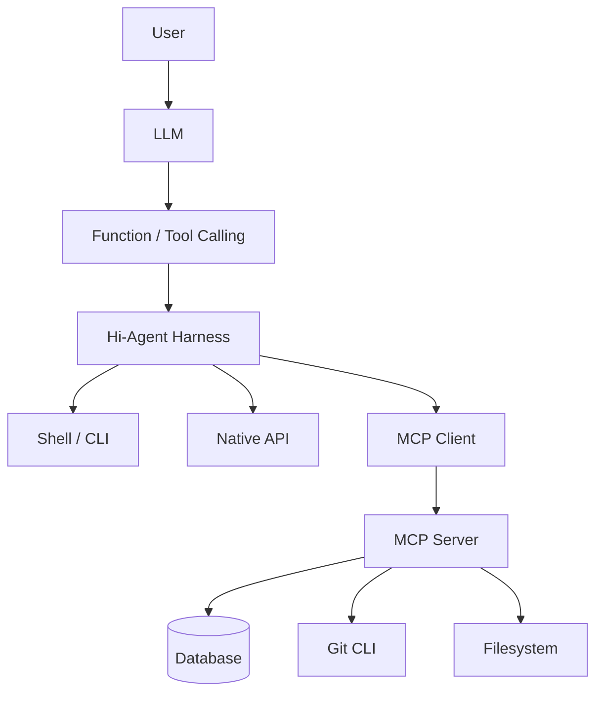

因此面试里如果有人问“Function Calling 和 MCP 有什么区别”，我现在会回答：

> Function Calling 是模型侧的工具调用能力，MCP 是工具侧的互操作协议。模型可以通过 Function Calling 决定“调用哪个工具”，Host 再通过 MCP 去发现并执行这个工具。二者通常是上下层关系，而不是替代关系。

---

## 3. MCP、A2A 和 ANP 的边界

这也是后面继续学 A2A 时最重要的一条线。

我现在用三句话区分：

```text
MCP：调用能力
A2A：委托任务
ANP：发现和验证 Agent / 服务
```

MCP 更像：

```text
请替我执行能力 X
```

A2A 更像：

```text
请你自主完成目标 Y，并返回成果
```

ANP 更像：

```text
网络里有哪些 Agent？
哪个 Agent 有我需要的能力？
我如何确认它是谁？
```

把三者组合起来可以画成：

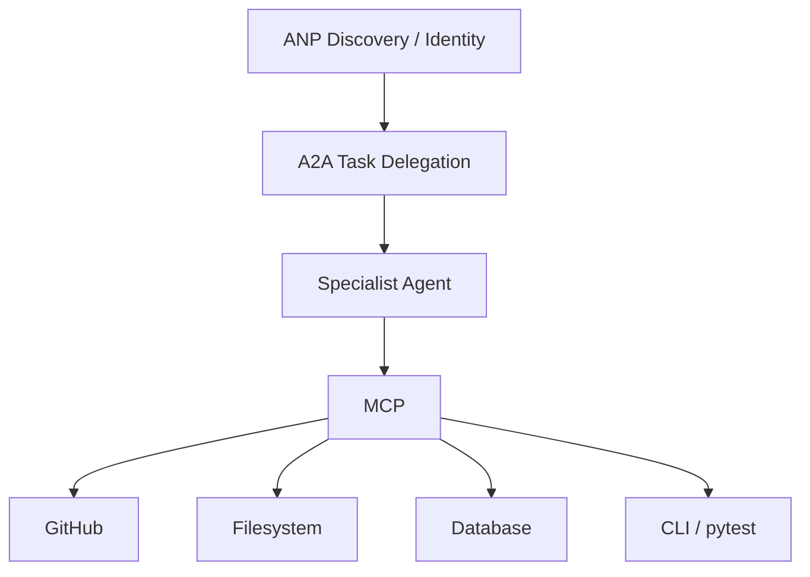

所以 MCP 做完以后，下一步进入 A2A 是自然的：前者把“能力调用边界”打通，后者开始解决“目标委托边界”。

---

# 4. 为什么先手搓 Mini-MCP，而不是直接读 SDK

直接用 SDK 很快，但很容易形成一种错觉：`client.list_tools()` 和 `client.call_tool()` 就是 MCP 的全部。实际上 2026 年的 MCP 有很多值得 Agent Infra 学习的设计，例如 stateless core、per-request metadata、HTTP routing headers、wire/application seam、cache hints 和 MRTR。

Mini-MCP 的目标因此一直很克制，只实现：

```text
server/discover
tools/list
tools/call
JSON-RPC 2.0
per-request metadata
resultType
serverInfo
cache hints
HTTP routing headers
基础 JSON Schema contract
```

再单独做一个 MRTR 小实验。它不是生产 SDK，也不应该继续膨胀成生产 SDK。

---

# 5. 2026-07-28 MCP 最值得记住的协议变化

## 5.1 没有 initialize，不再依赖协议 session

早期 MCP 很容易让人形成这种心智模型：

```text
initialize
  ↓
记住 protocolVersion
记住 clientInfo
记住 capabilities
  ↓
后续请求依赖 session
```

2026 modern era 的核心变化之一是：**请求自描述**。

每次请求都可以在 `params._meta` 中携带：

```text
io.modelcontextprotocol/protocolVersion
io.modelcontextprotocol/clientCapabilities
io.modelcontextprotocol/clientInfo
```

教学版构造请求的代码形状是：

```python
def make_request(
    request_id,
    method,
    params=None,
    *,
    client_info=None,
    client_capabilities=None,
):
    request_params = dict(params or {})
    meta = dict(request_params.get("_meta") or {})

    meta["io.modelcontextprotocol/protocolVersion"] = PROTOCOL_VERSION
    meta["io.modelcontextprotocol/clientCapabilities"] = dict(
        client_capabilities or {}
    )

    if client_info is not None:
        meta["io.modelcontextprotocol/clientInfo"] = dict(client_info)

    request_params["_meta"] = meta

    return {
        "jsonrpc": "2.0",
        "id": request_id,
        "method": method,
        "params": request_params,
    }
```

这里值得记住的不是字段本身，而是背后的系统设计：

> Stateless protocol 并不等于应用没有状态，而是不要把业务状态偷偷绑死在 transport session 上。

如果一个业务操作跨多个 round trip，需要状态，可以显式携带 `requestState` 或业务 handle。这样一个请求可以被负载均衡到任意 server instance，协议层更容易水平扩展。

---

## 5.2 wire layer 和 application layer 不是同一份 schema

2026 MCP 的另一个重要变化是 `resultType`。线上的成功结果可能是：

```json
{
  "jsonrpc": "2.0",
  "id": 1,
  "result": {
    "resultType": "complete",
    "content": [
      {"type": "text", "text": "done"}
    ]
  }
}
```

而应用层通常只想看到：

```python
{
    "content": [
        {"type": "text", "text": "done"}
    ]
}
```

所以客户端要有一个 wire seam：

```python
def _unwrap(response):
    if "error" in response:
        ...

    result = response["result"]

    result_type = result.get("resultType")
    if result_type != "complete":
        raise ...

    clean = dict(result)
    clean.pop("resultType", None)
    return clean
```

这件事让我第一次比较清楚地意识到：协议模型和业务模型不一定应该合并。真正的 SDK 很多价值就在于帮应用“吃掉”这些 wire-only 字段。

---

## 5.3 serverInfo 应该由协议出口统一补

Server identity 如果每个业务 handler 自己拼，会迅速产生重复逻辑。更合理的处理链是：

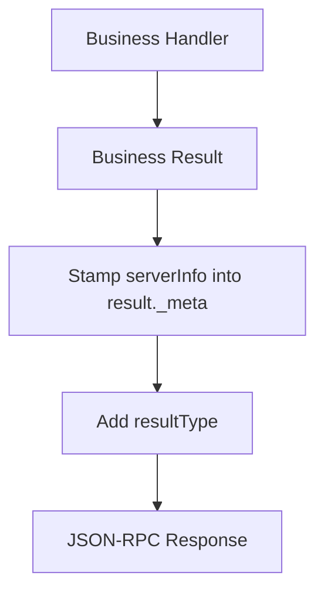

教学实现中：

```python
def _stamp_server_info(self, result):
    stamped = dict(result)
    meta = dict(stamped.get("_meta") or {})

    meta.setdefault(
        "io.modelcontextprotocol/serverInfo",
        {
            "name": self.name,
            "version": self.version,
        },
    )

    stamped["_meta"] = meta
    return stamped
```

这个看似只是“把字段放在哪里”，实际上对应的是很典型的 Infra 分层原则：**横切协议元数据应该集中在 protocol boundary 处理，而不是污染业务 handler。**

---

## 5.4 HTTP header 和 body 是两套不同用途的信息

2026 HTTP 路由里，一个工具调用可能同时有：

```text
MCP-Protocol-Version
Mcp-Method
Mcp-Name
```

body 里又有：

```json
{
  "method": "tools/call",
  "params": {
    "name": "grep_code"
  }
}
```

为什么重复？

因为 body 偏语义，而 header 偏基础设施：

```text
Body:
- RPC 真正语义
- tool arguments
- application data

Headers:
- gateway routing
- authorization
- rate limiting
- observability
- proxy policy
```

这样 Gateway 可以只看：

```text
Mcp-Method: tools/call
Mcp-Name: delete_file
```

就直接做 ACL，而不需要先解析完整 JSON body。

Header 和 body 不一致则是另一类错误：

```text
-32020 HeaderMismatch
```

而如果 header/body 一致，但 protocol version 本身不受支持，则是：

```text
-32022 UnsupportedProtocolVersion
```

这两个错误不能混成普通的 `-32602 Invalid Params`，因为它们表达的是完全不同的系统故障。

---

## 5.5 Tool error 和 Protocol error 也必须分开

这个边界很重要。

协议请求本身就不合法，例如：

```text
method 不存在
JSON-RPC envelope 错误
protocol version 不支持
header/body mismatch
```

应该返回 JSON-RPC `error`：

```json
{
  "jsonrpc": "2.0",
  "id": 1,
  "error": {
    "code": -32601,
    "message": "Method not found"
  }
}
```

但如果 RPC 合法进入了工具执行，工具自己失败，例如：

```text
read_file 找不到文件
grep_code 参数业务校验失败
数据库查询失败
```

这类错误应该让模型看到并自行恢复，因此仍是 result，只是：

```json
{
  "resultType": "complete",
  "content": [
    {
      "type": "text",
      "text": "file not found"
    }
  ],
  "isError": true
}
```

一句话记忆：

> Protocol error 表示“这次 RPC 本身不成立”；Tool error 表示“RPC 成立，但被调用的能力执行失败”。

---

# 6. Tools：MCP 真正进入 Agent Harness 的第一层

## 6.1 一个 Tool 至少是什么

Mini-MCP 的 Tool 定义保留：

```python
@dataclass
class Tool:
    name: str
    handler: Callable[[dict[str, Any]], Any]
    description: str = ""
    input_schema: dict[str, Any] = field(...)
    output_schema: dict[str, Any] | None = None
```

发给客户端时：

```python
def definition(self):
    definition = {
        "name": self.name,
        "inputSchema": self.input_schema,
    }

    if self.description:
        definition["description"] = self.description

    if self.output_schema is not None:
        definition["outputSchema"] = self.output_schema

    return definition
```

这个 schema 不是“给模型看的漂亮文案”，而是机器可验证契约。

---

## 6.2 inputSchema 和 outputSchema 为什么都重要

输入 schema：

```json
{
  "type": "object",
  "properties": {
    "query": {
      "type": "string",
      "minLength": 1
    }
  },
  "required": ["query"],
  "additionalProperties": false
}
```

可以约束：

```python
{"query": "MCP"}
```

而拒绝：

```python
{}
```

或者：

```python
{"query": "", "dangerous_extra": true}
```

output schema 同理，它防止一个工具“声明自己返回 A，实际上偷偷返回 B”。

因此调用链应该是：

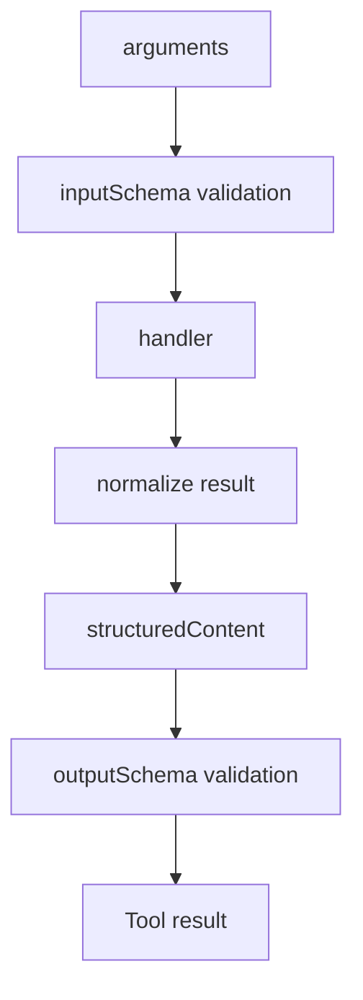

生产环境不应该继续自己手搓 JSON Schema validator。Mini-MCP 的 validator 只用于理解 contract，正式实现应该交给官方 SDK 和成熟 JSON Schema 库。

---

## 6.3 structuredContent 不只是 dict

一个容易忽略的点是 `structuredContent` 可以是任意 JSON value，例如：

```json
["protocols/mcp/mini_mcp/protocol.py", "protocols/mcp/mini_mcp/server.py"]
```

也可以是：

```json
42
```

甚至：

```json
null
```

这里会出现 Python 的一个小坑：`None` 既可能代表“没有 structuredContent”，也可能代表“工具真的返回了 JSON null”。所以严格实现要用 sentinel 区分“未提供”和“显式 null”。

这类细节不是必须拿来背，但很适合作为协议实现里的典型边界案例。

---

# 7. tools/list：为什么“列工具菜单”最后变成 Context Engineering

如果只连接一个 Server、两个工具，最简单的做法当然是：

```text
tools/list
  ↓
把所有 schema 塞进 prompt
```

问题在于工具规模一旦增长：

```text
100 MCP Servers
× 20 tools/server
= 2000 tool schemas
```

如果全部进入 prompt，会出现：

- token 占用暴涨；
- 相似工具之间更容易误选；
- 不相关能力污染上下文；
- 工具顺序变化导致 prompt prefix 不稳定；
- 每轮重复注入相同 schema；
- 危险工具可能无意义地暴露给模型。

所以 MCP discovery 和当前任务的 tool selection 必须分开。

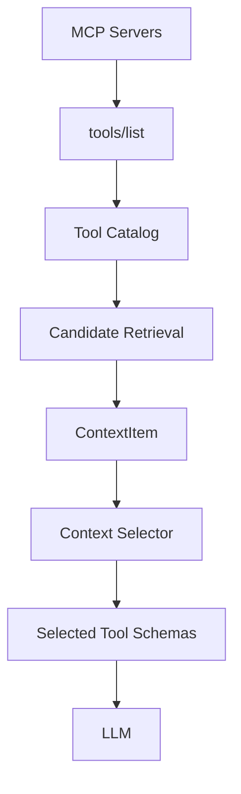

这里有一句我现在觉得特别值得记住：

> Catalog 保存“世界上有哪些能力”，Selector 决定“当前任务需要看见哪些能力”。

Discovery 不是 Selection。

---

# 8. 从 Mini-MCP 切回官方 SDK：Manager 才是工程入口

Mini-MCP 到这里就应该停。Hi-Agent 正式 Host 使用官方 MCP Python SDK，自己只做 framework-specific 的东西。

Manager 的职责可以压缩成：

```python
from mcp import Client, Implementation

async def list_tools(source):
    client = Client(
        source,
        client_info=Implementation(
            name="hi-agent-mcp-host",
            version="0.1.0",
        ),
    )

    async with client:
        page = await client.list_tools()
        return page.model_dump(
            by_alias=True,
            exclude_none=False,
        )
```

真实 `MCPManager` 再负责：

- Server 生命周期；
- 分页；
- 保存 serverInfo 和 protocolVersion；
- CallToolResult → Hi-Agent 内部结果模型；
- async API；
- 必要时提供同步兼容门面。

这里最值得记住的工程经验是：

> 协议 SDK 已经负责 wire contract，Host 不应该再次实现 JSON-RPC。Host 应该负责生命周期、路由、模型转换和与自身 runtime 的边界。

同步门面也只是迁移脚手架。Agent runtime 本身如果已经是 async loop，就应该直接调用 async API，否则很容易出现 event loop 嵌套问题。

---

# 9. Catalog：为什么一个工具要保存两个名字

一个 Catalog entry 至少保存：

```text
server_id
server_name
server_version
original_tool_name
canonical_tool_name
description
input_schema
output_schema
ttl_ms
cache_scope
risk
discovered_at
```

例如：

```text
canonical_tool_name = filesystem.grep_code
original_tool_name  = grep_code
```

为什么要存两份？

因为两个 MCP Server 都可能暴露：

```text
grep_code
```

对 Hi-Agent 来说，需要一个本地唯一名字：

```text
filesystem.grep_code
github.grep_code
```

但真正向某个远程 Server 发请求时，又必须恢复它原来的协议名：

```text
grep_code
```

这两者的关系更像：

```text
canonical name = Host 内部路由键
original name  = Remote protocol key
```

绝对不能偷懒合并成一个字段。

---

# 10. Adapter：让原来的 Agent 根本不知道 MCP 的存在

Hi-Agent 已经有 Chapter 7 风格的 `MyToolRegistry`。如果为了 MCP 再造一个平行工具系统，后面会变成：

```text
native tools 一套
MCP tools 一套
Agent 两套调用逻辑
两套 trace
两套 permission
```

所以正确做法是 Adapter。

```python
class MCPToolAdapter(MyTool):
    def run(self, parameters):
        result = self.call_result(parameters)
        return self.render_result(result)
```

完整调用链：

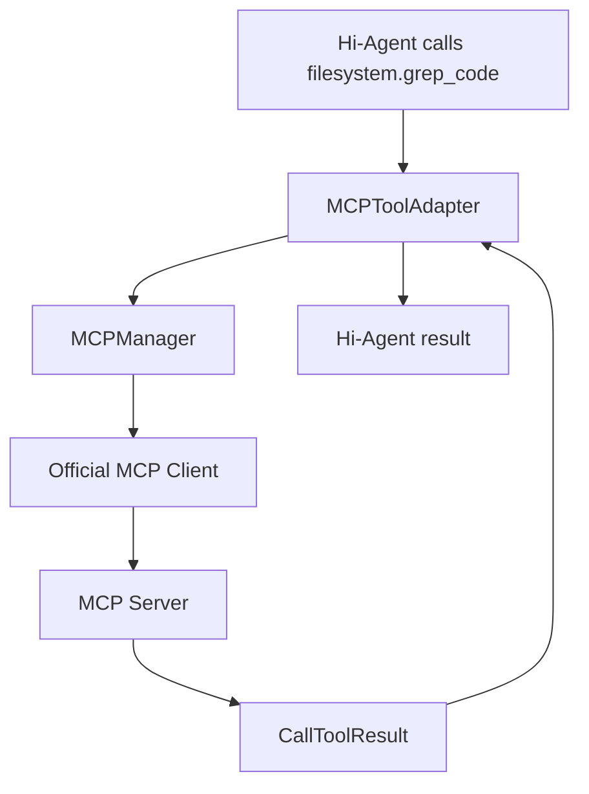

这里还有一个很隐蔽但重要的 bug：为了 trace 结果不能先调用一次工具，再调用 `Adapter.run()` 一次。远程工具可能不是幂等的，尤其是：

```text
delete_file
send_email
create_issue
charge_payment
```

调用两次就不是“多记录了一份日志”，而是产生两次真实副作用。

因此现在一次 `MCPCallResult` 同时服务：

```text
trace
+
render
```

一次工具执行只能有一个 side-effect boundary。

---

# 11. Selector：把 Context Engineering 复用到 Tool Retrieval

Hi-Agent 已经有：

```python
ContextItem
ContextBudget
select_items()
```

所以 MCP 工具选择没有重写一套 budget system，而是把 Tool Catalog 候选转换成 ContextItem，再复用已有 selector。

调用例子：

```python
selection = host.select_tools(
    "搜索项目中所有 Mini-MCP 相关代码",
    budget=ContextBudget(
        soft_limit=100,
        hard_limit=200,
        output_reserve=20,
    ),
)

selected = [
    entry.canonical_tool_name
    for entry in selection.selected
]

print(selected)
```

当前教学结果：

```python
["filesystem.grep_code"]
```

最小 retrieval 流程：

```text
query
 + tool name
 + description
 + tags
      ↓
lexical overlap
      ↓
candidate scores
      ↓
ContextItem(priority, token_count)
      ↓
select_items()
      ↓
selected / dropped / reason
```

这个 lexical retriever 不是终点。它的价值是先把接口和可观测性定住，未来可以替换成：

```text
embedding retrieval
hybrid retrieval
learned reranker
tool-use history prior
LLM router
```

上层 Host 不需要改。

---

# 12. Tool Catalog 为什么和 Prompt Cache 有关系

tools/list 看起来像配置数据，但最终 schema 会进入模型上下文。只要它进入 prompt，它就变成 Context Engineering 问题。

假设两次工具集合完全一样：

```text
A, B, C
```

下一轮变成：

```text
C, A, B
```

语义上没有变化，但 byte prefix 已经变了，可能导致：

- prompt cache miss；
- 模型注意力位置变化；
- 工具选择行为波动；
- eval 不稳定。

因此 stable ordering 不只是“测试方便”，而是 Host 运行时属性。

```text
deterministic ordering
        +
cache hints
        +
stable prefix
        +
dynamic tail
```

这几件事其实和前面学的 Context Engineering 是同一套思路。

---

# 13. Selector、Policy、Executor 是三个不同安全边界

测试 Server 故意放了：

```text
read_file
grep_code
delete_file
```

任务是：

```text
搜索项目中所有 Mini-MCP 相关代码
```

Selector 只应该选：

```text
filesystem.grep_code
```

但即使某个危险工具因为任务相关性被选中，也不意味着它已经可以执行。

因此必须分成：

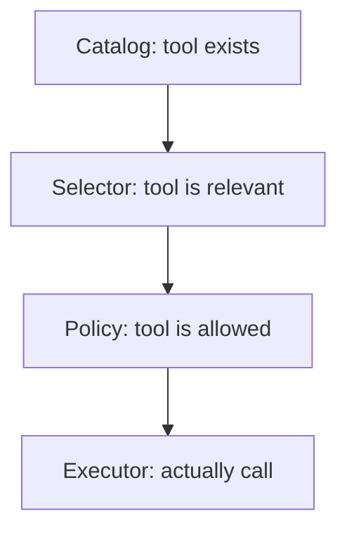

这三个问题分别是：

```text
Catalog:
能力存在吗？

Selector:
当前任务需要它吗？

Policy:
当前用户 / 当前环境允许执行吗？
```

一句八股：

> “可发现”不等于“可见”，“可见”不等于“可执行”。

---

# 14. Policy：模型不应该是最终授权者

当前教学策略：

```text
read_only  → 自动放行
write      → 需要确认
dangerous  → 默认拒绝
```

调用前：

```python
decision = policy.check(
    entry,
    confirmed=confirmed,
)

if not decision.allowed:
    trace.finish(
        status="policy_denied",
        error_kind="policy_denied",
    )
    raise MCPPolicyDenied(decision.reason)
```

一个非常重要的原则是：

> MCP Server 给出的 annotation 是提示，不是安全凭据。

远端 Server 完全可能：

```text
漏标
错标
恶意标注
```

所以 Host 仍然应该有自己的 fallback classification，例如检测明显危险动词：

```text
delete
exec
shell
drop
remove
write
send
```

生产系统还会进一步结合：

```text
用户身份
租户
scope
resource ownership
environment
human confirmation
allowlist / denylist
rate limit
```

安全策略应该在模型之外，而且最好在真正 tool execution 之前。

---

# 15. Trace：Agent Infra 最后要回答“到底哪一层坏了”

一次成功调用现在至少需要知道：

```text
server_id
canonical_tool_name
original_tool_name
selected_by
selection_reason
policy_decision
result_type
is_error
status
duration_ms
```

失败要区分：

```text
selection_error
policy_denied
adapter_error
connection_error
protocol_error
tool_error
transport_error
output_validation_error
```

为什么不能只记录：

```text
tool call failed
```

因为真实排障要区分：

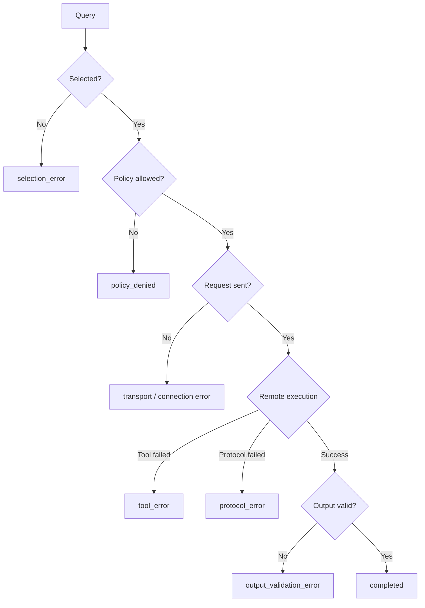

这就是为什么 Agent Infra 的可观测性不能只靠 `print()`。

---

# 16. Hi-Agent 当前 MCP Host 的核心组合

现在的 `MCPHost` 本身其实不复杂，这反而是好事。它只是把几层组合起来：

```python
class MCPHost:
    def __init__(
        self,
        *,
        policy=None,
        registry=None,
    ):
        self.policy = policy or MCPPolicy()
        self.registry = registry or MyToolRegistry()
        self.catalog = MCPToolCatalog()
        self.selector = MCPToolSelector()
        self.managers = {}
        self.last_traces = []
```

添加 Server：

```python
def add_server(self, config):
    manager = MCPManager(config)
    self.managers[config.server_id] = manager

    entries = self.catalog.refresh(manager)

    for entry in entries:
        self.registry.register_tool(
            MCPToolAdapter(manager, entry)
        )

    return entries
```

执行：

```python
def execute(
    self,
    canonical_tool_name,
    arguments,
    *,
    selected_by="explicit",
    selection_reason="",
    confirmed=False,
):
    entry = self.catalog.get(canonical_tool_name)

    trace = MCPTrace(
        server_id=entry.server_id,
        canonical_tool_name=entry.canonical_tool_name,
        original_tool_name=entry.original_tool_name,
        selected_by=selected_by,
        selection_reason=selection_reason,
    )

    decision = self.policy.check(
        entry,
        confirmed=confirmed,
    )

    if not decision.allowed:
        ...

    adapter = self.registry.get_tools(
        canonical_tool_name
    )

    call_result = adapter.call_result(arguments)
    result = adapter.render_result(call_result)

    ...
```

这里可以看到 Host 并没有重新实现协议，它真正拥有的是：

```text
composition
routing
catalog
selection
policy
trace
```

这才是属于 Hi-Agent 的工程价值。

---

# 17. MRTR：stateless 并不等于“一问一答”

Mini-MCP 主路径只接受：

```text
resultType=complete
```

但为了理解 2026 的多轮请求，单独实现了 Mini-MRTR 实验。

最小流程：

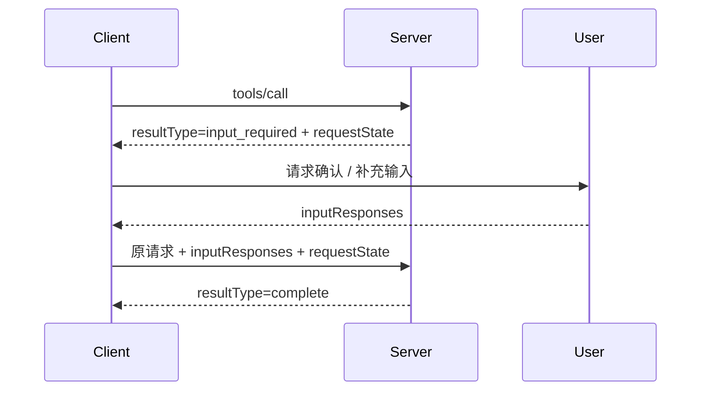

这里最关键的四个认识是：

1. stateless 不代表只能一轮；
2. `requestState` 由客户端原样回显；
3. 服务端必须验证 `requestState`，不能信任客户端；
4. 每轮请求依旧应该能够独立路由。

教学实现还用 HMAC `RequestStateCodec` 去说明：

```text
requestState 是 opaque state
而不是“客户端可以随便修改的 JSON”
```

这个实验到这里足够，不应该继续把 Mini-MCP 做成完整 MRTR SDK。

---

# 18. 为什么还要做 Official SDK differential test

自己写的 toy tests 全绿，只能证明：

> 我的实现满足了我自己写的测试。

它不能证明：

> 我的 MCP 心智模型和官方实现一致。

因此同一组核心 case 同时跑：

```text
Mini-MCP
Official MCP Python SDK
```

比较：

```text
method
params
protocol metadata
resultType
serverInfo
cache hints
tool result
error semantics
```

不要求字节完全一致，因为官方 SDK 还包含应用层适配。例如 Python handler 返回 list 时，官方 FastMCP 风格可能把它适配成：

```json
{
  "structuredContent": {
    "result": [
      "protocols/mcp/mini_mcp/protocol.py"
    ]
  }
}
```

Mini-MCP 可以直接把 list 当 structuredContent。这里真正要比较的是协议 contract，而不是 SDK 私有适配习惯。

这一步很重要，因为它给 Mini-MCP 一个明确的“停止条件”：核心 contract 对齐之后就停止继续扩展。

---

# 19. 当前 MCP 完成度

按“学习 MCP”和“实现 Hi-Agent Host”两个目标分别看，现在已经足够完成这一阶段。

```text
Mini-MCP protocol lab
├── JSON-RPC 2.0                     ✅
├── 2026 stateless core              ✅
├── per-request metadata             ✅
├── server/discover                  ✅
├── tools/list                       ✅
├── deterministic ordering           ✅
├── pagination                       ✅
├── cache hints                      ✅
├── tools/call                       ✅
├── inputSchema 教学验证             ✅
├── outputSchema 教学验证            ✅
├── structuredContent                ✅
├── resultType=complete              ✅
├── HTTP routing headers             ✅
├── HeaderMismatch                   ✅
├── UnsupportedProtocolVersion       ✅
├── raw wire contract tests          ✅
├── Mini-MRTR experiment             ✅
└── official SDK differential test   ✅

Hi-Agent MCP Host
├── official Python SDK              ✅
├── Manager                          ✅
├── Catalog                          ✅
├── canonical/original name          ✅
├── Adapter                          ✅
├── ToolRegistry integration         ✅
├── Tool Selector                    ✅
├── ContextBudget reuse              ✅
├── Policy                           ✅
├── dangerous tool denial            ✅
├── Trace                            ✅
└── E2E host test                    ✅
```

暂时没有实现：

```text
Resources
Prompts
完整 Authorization / OAuth
Mcp-Param-*
Tasks extension
MCP Apps
多 Server 生产级连接池
真实 embedding tool retriever
多租户 catalog
线上 prompt-cache benchmark
```

这些都可以以后因项目需要再补，不应该阻塞现在进入 A2A。

---

# 20. 面试 / 八股：MCP 高频问题

下面这一节不是追求“标准答案背诵”，而是把实现过的东西压缩成方便复习的问答。

## Q1：MCP 解决了什么问题？

MCP 解决模型 / Agent 与外部工具、资源和服务之间的标准化连接问题。它把“工具怎么发现、schema 怎么描述、怎样调用和返回结果”统一起来，避免每个 Agent Harness 为 GitHub、数据库、文件系统等能力重新定义一套私有协议。

---

## Q2：MCP 和 Function Calling 的区别？

Function Calling 是模型能力，负责产生：

```text
tool_name + arguments
```

MCP 是基础设施协议，负责：

```text
discover tool
describe schema
transport request
execute
return result
```

实际系统通常是 Function Calling 决定工具，Host 通过 MCP 执行工具。

---

## Q3：MCP 和 CLI 的区别？

CLI 是程序面向人 / shell 的命令接口，MCP 是 Agent 面向外部能力的标准协议。MCP Server 内部完全可以调用 CLI，所以二者是上下层关系，而不是互斥关系。

---

## Q4：为什么 2026 MCP 强调 stateless？

核心目的是让每个请求自描述，不依赖固定 transport session。这样请求更容易水平扩展、负载均衡、故障迁移和经过普通 HTTP infrastructure。应用仍然可以有状态，但状态应该显式携带，而不是偷偷保存在协议 session 中。

---

## Q5：stateless 如何支持多轮交互？

通过 MRTR。Server 返回：

```text
resultType=input_required
```

并附带 opaque `requestState`。Client 获取用户或模型补充输入后，把原请求、`inputResponses` 和 `requestState` 再次发送。Server 验证 state 后继续处理，最终返回：

```text
resultType=complete
```

---

## Q6：Tool error 和 JSON-RPC error 有什么区别？

JSON-RPC error 表示协议 / RPC 本身不成立，例如 method 不存在或协议版本错误。Tool error 表示工具调用本身成立，但工具执行失败，因此通常通过正常 result 中的 `isError=true` 返回，让模型能够看到失败并修正下一次调用。

---

## Q7：为什么 MCP Host 不能把所有 tools/list 结果直接塞 Prompt？

随着 MCP Server 增多，tool schema 会占用大量 context，造成 token 开销、误选工具、prefix 波动和缓存失效。因此应该分成：

```text
Discovery
→ Catalog
→ Retrieval
→ Context Budget
→ Selected schemas
```

---

## Q8：Catalog 和 Selector 有什么区别？

Catalog 管“有哪些工具”，Selector 管“当前 query 需要哪些工具”。Catalog 偏 discovery、metadata、TTL 和 cache，Selector 偏 relevance、priority 和 token budget。

---

## Q9：为什么 canonical tool name 和 original tool name 都要保存？

多个 Server 可以暴露同名工具。Host 需要：

```text
filesystem.grep_code
github.grep_code
```

作为本地唯一路由名，但真正发回 Server 时仍然只能调用原始名字：

```text
grep_code
```

所以它们属于两个命名域。

---

## Q10：MCP Tool annotation 能不能直接当权限判断？

不能。远端 annotation 只能作为提示，不是可信授权凭据。最终安全策略应该由 Host 根据用户、租户、工具风险、环境和确认状态决定。

---

## Q11：为什么 Tool Selection 和 Permission 要拆开？

相关性和授权是两个独立维度。一个工具可能非常相关但危险，例如用户要求“删除旧数据库”，`delete_database` 很相关，但仍然可能被 Policy 拒绝。

一句话：

> Selector 决定“该不该让模型看到”，Policy 决定“能不能真的执行”。

---

## Q12：MCP 为什么会和 Context Engineering 产生交叉？

因为 tool descriptions 和 schemas 最终是模型上下文的一部分。工具数量、排序、压缩、缓存、动态选择都会影响 token budget、prompt cache 和模型决策，因此大规模 MCP Host 本质上会出现 Tool Retrieval / Tool RAG 问题。

---

## Q13：为什么工具目录要 deterministic ordering？

即使工具集合不变，如果顺序每次变化，Prompt prefix 也会变化，可能导致缓存 miss 和模型行为波动。稳定排序可以提高可重复性，也为 prompt caching 提供稳定前缀。

---

## Q14：Adapter 模式在 MCP Host 里有什么意义？

Adapter 把 MCP 工具转换成 Hi-Agent 原有的 `MyTool`，因此 Agent、ToolRegistry 和旧测试不需要知道底层工具来自 MCP。这样协议集成不会污染既有 Agent 抽象。

---

## Q15：为什么调用工具时特别强调“只调用一次”？

因为 MCP 工具可能有副作用。为了 trace 而执行一次，再为了 render 结果执行一次，可能造成双删除、双发送、双扣款。正确做法是一次 remote call 产生一个内部 result，同时供 trace 和渲染使用。

---

## Q16：一个比较完整的 MCP Host 应该有哪些层？

至少：

```text
Transport / SDK
Manager
Catalog
Adapter / Registry
Tool Retrieval
Context Budget
Policy
Execution
Trace / Observability
```

生产级系统还会有认证、隔离、重试、熔断、cache、多租户和审计。

---

# 21. 这次实现里最值得留下的工程结论

这一轮最有价值的并不是“我实现了几百行 MCP 代码”，而是把一些以前模糊的 Agent Infra 边界弄清楚了。

第一，**协议实现和 Host Runtime 不是一件事**。Mini-MCP 帮我理解 wire contract，但真正属于 Hi-Agent 的能力是 Catalog、Selector、Policy 和 Trace。官方 SDK 应该负责 wire。

第二，**Discovery 和 Selection 不是一件事**。工具可被发现只说明能力存在，不说明它应该进入当前模型上下文。

第三，**Selection 和 Authorization 也不是一件事**。相关工具可以是危险工具，模型认为“有必要”不能自动推导出“允许执行”。

第四，**Context Engineering 不只管理聊天历史**。Tool schema、Memory、RAG、system instructions、runtime state 最终都在争抢有限 context，工具目录也是 context budget 的一等公民。

第五，**协议的工程价值经常出现在边界而不是 happy path**。真正让我理解 MCP 的不是 `tools/call` 成功返回，而是 HeaderMismatch、Tool error vs Protocol error、structured null、outputSchema、非幂等工具和 MRTR 这些边界。

---

# 22. 下一步：进入 A2A，但不要再做 calculator agent

MCP 已经解决了：

```text
当前 Agent 怎样调用外部能力
```

接下来真正值得学的是：

```text
一个 Agent 怎样把目标委托给另一个独立 Agent
```

所以 A2A 的第一个最小切片不应该再做：

```text
Calculator Agent
```

而应该直接复用现在已有的 MCP Host：

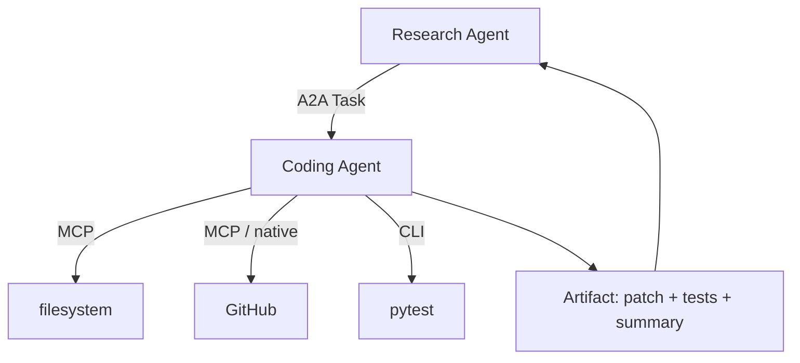

下一阶段真正要掌握的是：

```text
Agent Card
Message
Task
Task state
Artifact
streaming / progress
failure
capability discovery
```

这里最值得先回答的问题是：

> 为什么 Coding Agent 不能简单地被包装成一个 MCP Tool？

如果把 Coding Agent 当 Tool，Host 更像是在说：

```text
执行函数 coding_agent(...)
```

而 A2A 想表达的是：

```text
这里有一个目标。
你是一个独立 Agent。
你可以自己规划、调用工具、运行很多轮、汇报状态，
最后把 Artifact 交回来。
```

这就是“能力调用”和“任务委托”的真正分界。

---

# 23. 最后的学习地图

整个 Agent Protocol 路线现在可以收束成：

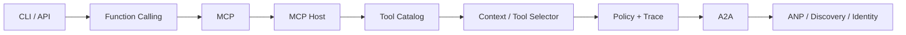

对 Hi-Agent 来说，各阶段目标不是重新造协议生态，而是：

```text
Mini-MCP
    学 wire contract

MCP Host
    学工具接入和 Runtime

Tool Selector
    学 discovery → context 的桥梁

Mini-A2A
    学 Task / Artifact / 生命周期

ANP
    学 discovery / identity / trust
```

MCP 到这里可以正式收口。下一篇开始进入 A2A，把“工具调用”升级成“Agent 任务委托”。
