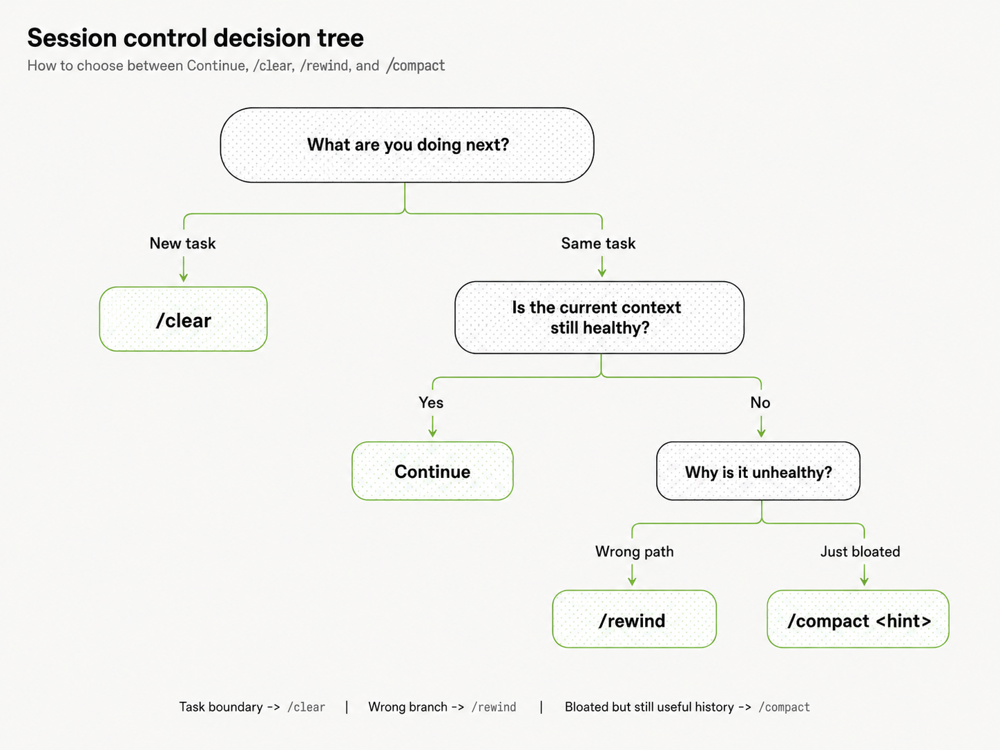

## 1. 规格驱动开发

Anthropic这六条建议很实用，尤其是/clear和/compact这两条。实际上最大的token浪费不在于单次对话的冗余，而是上下文滚雪球——每轮都拖着之前读过的文件继续走，请求越多token翻倍越厉害。我们最近也在算AI Agent的运营成本账，发现合理管理上下文窗口能眀60%以上的token开销。


我之前对 Vibe Coding 工程化的理解，其实一直挺朴素的。

先别急着让 Agent 写代码。把需求写成 PRD，把技术路线和模块边界写成 TRD 或 Spec，再把一个大任务拆成六到八个规模适中的子任务。每完成一项就跑测试、看 Diff，确认没有跑偏以后再继续下一项。

这套方法当然有用。

至少它解决了两个我自己很容易踩的问题。

第一个是，人自己都没想清楚要什么，就丢给 Agent 一句“帮我把这个功能做了”。这种时候所谓 Vibe Coding，很多时候只是把模糊需求换了一种方式外包出去。模型写得再快，最后也可能只是更快地抵达一个并不是我想要的结果。

第二个是任务跨度太大。一个 Agent 同时要理解需求、研究代码库、决定技术路线、修改十几个文件、跑测试、修 Bug，再回头检查最开始的约束，很容易做到后面已经和开局不是同一个问题了。

所以我一度觉得，只要做到：

```text
需求先写清楚
        ↓
技术方案先定下来
        ↓
大任务拆成小任务
        ↓
一次只让 Agent 做一个
        ↓
Test / Diff / Review
```

Vibe Coding 基本就从“聊天写代码”进入工程化了。

但这里其实还偷偷藏着一个假设：

> **只要任务拆得足够小，单个任务内部的 Agent Session 就可以放着它自己跑。**

我以前基本没有把这一层单独当成问题。

比如我要修一个 Bug，已经知道它只属于某一个子任务。那我自然会觉得，接下来无非就是让 Claude Code 搜代码、读文件、修改、跑测试。只要最后测试绿了，这一轮工作就结束了。

至于这中间 Claude 搜过多少无关文件、终端喷出了多少日志、试错留下了多少失败路径，以及这些东西为什么会一直跟着后面的请求往前走，我很少把它们看成一种需要主动管理的工程资源。

这也是 Anthropic 那篇 *Maximizing the value of your Claude Code sessions* 真正让我重新注意到的地方。

它讨论的并不是怎么把一个大项目拆成任务，也不是怎么写一份更好的 Spec。

它讨论的是更靠下一层的问题：

```text
任务已经确定了。
范围也已经确定了。

那么从这个 Session 开始，
到这个 Session 结束之间，

我到底应该怎样和 Coding Agent 一起工作？
```

这和“Prompt 怎么写”也不是一回事。

Prompt 主要决定当前这一轮我告诉 Agent 什么。

Session 则包含了从开局到现在不断累积下来的东西：之前的对话、Agent 已经读取的文件、工具调用产生的结果、Shell 输出、失败过的尝试，以及为了继续完成当前任务而留下的各种状态。

于是同样是一个已经拆好的 Bug fix，执行过程仍然可能长成完全不同的样子：

```text
Task A
→ 找到相关文件
→ 修改
→ Test
→ Done
```

也可能变成：

```text
Task A
→ 搜仓库
→ 读错文件
→ 再搜
→ 打一大段日志
→ 猜方案 A
→ 失败
→ 猜方案 B
→ 再读几个文件
→ 修改
→ Test
→ Done
```

两个流程最后甚至都可能把 Bug 修好。

但“最后都修好了”，并不意味着它们经历的是同一种 Agent 工作过程。

到这里，我才意识到自己原来把两个层次混在了一起：

```text
Task decomposition
解决：
这一轮 Agent 应该做多大的事情？

Session discipline
解决：
这一轮事情开始以后，
Agent 应该背着什么东西一路往前走？
```

前一个问题，我已经在 Spec、任务拆分和验收里反复折腾过。

后一个问题，才是这篇笔记真正想补上的那一层。

下一步要先回答一个非常具体的问题：

> **为什么同一个模型、同一个仓库、同一个 Bug，最后都修好了，Token 账单仍然可能差很多？**

要解释它，得先把 Claude Code 的一次“对话”拆开看看：一个 Coding Agent Session，其实并不是很多次彼此独立的模型调用。

## 2. 同一个 Bug，为什么会有不同成本

Anthropic 在 *Maximizing the value of your Claude Code sessions* 开头举的例子非常简单。

假设现在有一个失败的测试需要修。

一种情况是 Claude 很快找到了测试文件和它对应的实现文件，读完、修改、跑测试，问题解决。

另一种情况最后也修好了同一个问题，但 Claude 开局并不知道问题在哪里。它先在仓库里 grep，一路打开十几个文件，绕了一圈以后才找到前一种情况一开始就读到的那两个文件。

从 Git Diff 看，两次工作的结果可能几乎没有区别。

```text
Session A

相关测试
→ 相关实现
→ 修改
→ 测试通过


Session B

grep
→ 文件 A
→ 文件 B
→ 文件 C
→ ...
→ 文件 K
→ 终于找到相关测试
→ 相关实现
→ 修改
→ 测试通过
```

如果我还是用传统 IDE 的习惯看这件事，其实很容易觉得区别不大。

无非一个人找代码快一点，一个人找代码慢一点。

过去我自己查一个 Bug 也是这样：搜错几个文件最多浪费几分钟，终端多打印几百行东西也没什么，关掉窗口以后这段探索过程基本就过去了。

Coding Agent 不太一样。

Anthropic 特意强调，同一个已经完成的任务，本身就可能因为 Session 的运行方式不同而产生不同成本。前面多出来的 grep、文件读取和命令输出，并不只是“花了一点搜索时间”；它们还会进入当前 conversation，并继续影响后面的工作。

所以这里第一次出现了一个我以前没有认真算过的量：

> **完成结果相同，并不意味着完成路径的成本相同。**

甚至可以再往前一步。

对于 Coding Agent，我不能只看最终有没有把那几行代码改对，还得看它为了得到这几行 Diff，沿途建立了一个怎样的 Session。

比如下面两个 Prompt：

```text
测试挂了，帮我修一下。
```

和：

```text
修复 utils.test.ts 里的失败测试。
问题应该与 utils.ts 有关。
完成后运行对应测试确认。
```

它们最后完全可能产生同一个 Patch。

但第二个 Prompt 提前提供了问题范围，Agent 少做的可能不只是一两步操作。它不需要先回答“哪个测试挂了”“实现在哪里”“哪些文件可能有关”，自然也更少有机会把与当前修复无关的搜索结果和文件读进来。

Anthropic 在文章后面甚至把这个例子继续推进了一步：

```text
"the tests are failing"
```

需要 Claude 自己寻找失败测试；

```text
"Fix the failing test in utils.test.ts"
```

已经省掉了寻找测试文件的过程；

而：

```text
"Fix the failing test in @utils.test.ts"
```

连为了获取这个文件而额外执行一次 Read 都可以省掉。

这里真正有意思的并不是 `@` 这个 Claude Code 小技巧。

它让我开始用另一种方式理解给 Coding Agent 提供信息这件事：

```text
范围越不明确
        ↓
Agent 越需要自己探索
        ↓
探索产生更多中间结果
        ↓
Session 变得更大、更杂
```

当然，这并不意味着“探索”本身是一件坏事。

我不知道 Bug 在哪里时，Agent 就应该搜索；复杂问题也不可能靠我提前指定两个文件解决。如果为了省 Token 强迫模型不调查代码库，最后改错东西，那就属于为了账单优化账单。

真正应该区分的是两种搜索：

```text
问题本来就未知
→ 搜索是在获取完成任务所必需的信息

问题其实已知
→ 但我没有把已有信息告诉 Agent
→ Agent 又花一轮自己把它找回来
```

后者才是最没有必要的一类成本。

这也让我觉得“Vibe Coding 要写好 Prompt”这种说法其实太粗了。

问题并不是 Prompt 越长越好，也不是每次都要写一份小作文。

更准确一点应该是：

> **我已经知道、而且能够缩小 Agent 搜索空间的信息，不应该故意让 Agent 再花一次探索成本重新发现。**

到这里，我们已经能解释为什么两个相同的 Bug fix 会有不同账单：

一个 Session 更快地把 Token 花在了真正相关的测试、实现和验证上；另一个 Session 则在抵达相同工作集以前，先产生了更多探索过程。

但这里还有一个没解释的问题。

如果这些多读的文件只是“当时多花一次钱”，那无非类似多搜了几次 Google，影响似乎仍然有限。

Anthropic 真正强调的麻烦却是：

> 一个文件一旦被读进 Session，为什么后面的请求还会继续为它付出代价？

这就得把 Claude Code 的一次交互继续拆开。

表面上我们看到的是：

```text
Read
→ Edit
→ Test
```

底下真正发生的并不是三次彼此独立的动作。

下一节要看的，就是一次 Coding Agent Session 为什么会越跑越重。

## 3. 一次 Agent Turn 到底发生了什么

前面留下了一个问题：

一个文件明明已经读过了，为什么后面的请求还会继续为它付出代价？

我以前很容易把 Claude Code 的一次工作理解成这样：

```text
我：
“帮我修这个测试。”

Claude：
读文件
→ 改代码
→ 跑测试
→ 告诉我修好了
```

从聊天窗口看，这甚至只是“一问一答”。

于是很自然会产生一个错觉：

```text
Prompt
        ↓
Claude 在电脑里忙一会儿
        ↓
Answer
```

好像中间那些 `Read`、`grep`、`Edit` 和 `Bash` 都只是 Claude 在一次模型调用内部完成的小动作。

但 Coding Agent 真正的执行方式不是这样。

大模型本身并不会在一次推理过程中神奇地打开文件、修改代码，然后自己在本地执行 `pytest`。Claude Code 这个 Harness 能做的，是把模型产生的下一步意图转换成工具调用，真的去执行工具，再把执行结果重新交回模型。

所以一次表面上的：

```text
Read
→ Edit
→ Test
```

底下其实更接近：

```text
用户：
修这个 Bug
        ↓
Request 1
模型看到当前 conversation
        ↓
模型：
我要先读 utils.test.ts
        ↓
Claude Code 执行 Read
        ↓
得到文件内容
        ↓
Request 2
模型看到：
原 conversation
+ 刚才自己的 Read 请求
+ Read 返回的文件内容
        ↓
模型：
再读 utils.ts
        ↓
Claude Code 执行 Read
        ↓
得到第二个文件
        ↓
Request 3
模型看到：
前面所有 conversation
+ utils.test.ts
+ utils.ts
        ↓
模型：
修改 utils.ts
        ↓
Claude Code 执行 Edit
        ↓
得到修改结果
        ↓
Request 4
模型看到：
前面的 conversation
+ 两个文件
+ Edit 结果
        ↓
模型：
运行测试
        ↓
Claude Code 执行 Bash
        ↓
得到 test output
        ↓
Request 5
模型看到：
前面所有东西
+ test output
        ↓
模型：
测试通过，给出最终回答
```

Anthropic 在那篇文章里给的小修复正好被拆成了五次这样的请求。

这个“五次”很容易让人第一次看到时觉得奇怪。

因为站在用户视角，我明明只说了一句话：

> 修一下这个失败测试。

为什么 API 底下已经请求模型五次了？

关键就在工具调用形成的这个循环里：

```text
Model
  ↓
决定下一步动作
  ↓
Tool
  ↓
获得真实结果
  ↓
Model
  ↓
基于真实结果决定下一步
  ↓
Tool
  ↓
...
```

如果模型第一次请求读取一个文件，它在发出 `Read` 的那一刻，其实还不知道文件里面有什么。

必须等 Claude Code 真正执行读取以后，把文件内容作为 tool result 放回 conversation，模型才能进行下一次判断。

同理：

```text
“我准备修改代码”
```

和：

```text
“代码已经实际修改成这样”
```

是两种不同的状态。

```text
“我准备跑测试”
```

和：

```text
“pytest 实际返回了 3 passed”
```

也是两种不同的状态。

Coding Agent 能形成闭环，恰恰是因为模型不能靠自己想象这些外部动作的结果。

每做完一次真实动作，Harness 都要把世界刚刚发生了什么告诉它，然后模型才能继续。

所以，如果把聊天 UI 暂时拿掉，一次 Coding Agent 工作更像：

```text
                ┌───────────────┐
                │ 当前 messages │
                └───────┬───────┘
                        │
                        ▼
                     Model
                        │
                  我要 Read A
                        │
                        ▼
                      Tool
                        │
                  返回 A 的内容
                        │
                        ▼
              messages 继续增长
                        │
                        ▼
                     Model
                        │
                   我要 grep
                        │
                        ▼
                      Tool
                        │
                  返回 grep 结果
                        │
                        ▼
              messages 继续增长
                        │
                        ▼
                     Model
                       ...
```

这里最值得注意的不是循环本身。

真正重要的是：

> **每一次新的 Model request，并不是从一张白纸开始。**

第二次请求需要知道第一次为什么执行 `Read`，也需要知道 `Read` 回来了什么。

第三次请求不能只拿到第二个文件，否则模型会忘记第一个文件。

跑完测试以后，模型也不能只看到：

```text
3 passed
```

它还得知道刚才改了什么、为什么改、这个测试是在验证哪一次修改。

所以 conversation 会自然长成一条不断追加的消息链。

假设一开始只有：

```text
[User Prompt]
```

第一次读文件后变成：

```text
[User Prompt]
[Assistant: tool_use Read A]
[Tool Result: A]
```

又搜索一次以后：

```text
[User Prompt]
[Assistant: tool_use Read A]
[Tool Result: A]

[Assistant: tool_use Grep]
[Tool Result: grep output]
```

再修改、测试以后：

```text
[User Prompt]

[Read A]
[A content]

[Grep]
[grep output]

[Read B]
[B content]

[Edit]
[edit result]

[Bash]
[test output]
```

从用户界面看，我还是在处理“同一个 Bug”。

从模型请求的角度看，每一步却都建立在此前已经积累出来的这条消息链上。

这就解释了上一节那个看起来有点奇怪的现象。

假设两个 Agent 最终都只需要 `A.ts` 和 `A.test.ts`。

第一条路径：

```text
Prompt
→ Read A.test.ts
→ Read A.ts
→ Edit
→ Test
```

第二条路径：

```text
Prompt
→ Grep
→ Read B
→ Read C
→ Grep
→ Read D
→ Read E
→ 最后才 Read A.test.ts
→ Read A.ts
→ Edit
→ Test
```

多出来的区别并不只是：

> 第二条路径多执行了几次工具。

它还意味着，在真正开始修改 `A.ts` 的时候，两边模型拿到的 conversation 已经不一样了。

第一边可能接近：

```text
Prompt
A.test.ts
A.ts
```

第二边则可能已经是：

```text
Prompt
第一次 grep
B
C
第二次 grep
D
E
A.test.ts
A.ts
```

后面大家都执行 `Edit`，再执行 `Test`。

但它们是背着完全不同重量的历史走到这里的。

这也是为什么我现在觉得，用普通聊天软件里的“轮”来理解 Coding Agent 有一点误导。

在人的感受里：

```text
我问了一次
Claude 回了一次
```

是一轮。

而在 Agent Harness 内部，这一轮完全可能包含：

```text
Model Request
→ Tool
→ Model Request
→ Tool
→ Model Request
→ Tool
→ Model Request
...
```

我更愿意把这种结构记成：

> **一次用户 Turn，内部可以展开成多次 cumulative request。**

所谓 cumulative，不是什么特别复杂的新机制。

它只是提醒我：

```text
Request N
≠
只处理第 N 步新产生的信息
```

而更接近：

```text
Request N
=
当前任务到这一刻为止
模型仍然需要看到的 conversation
+
这一轮刚刚获得的新结果
```

理解这一点以后，“上下文滚雪球”就不再只是一个比喻了。

它其实是 Agent Loop 自然产生的结果。

为了让模型根据真实工具结果继续工作，历史必须被保留下来；而一旦某些内容进入这条历史，它就可能继续出现在后面的请求中。

不过，到这里还只解释了**为什么历史会累积**。

我们还没有真正算钱。

比如一份已经读过的 8K token 文件，在下一次请求里重新出现时，到底是不是又按 8K 的完整输入价格收费？

为什么 Anthropic 明明说 conversation 会被重复带上，又同时说 Prompt Cache 可以大幅降低这部分成本？

以及一次请求最终究竟可以拆成哪几笔账？

下一节再开始算这一层。

## 4. 一次请求的钱到底花在哪里

上一节把 Claude Code 的一个用户 Turn 拆开以后，会看到一个有点反直觉的结构：

```text
User Prompt
    ↓
Model Request 1
    ↓
Read
    ↓
Model Request 2
    ↓
Read
    ↓
Model Request 3
    ↓
Edit
    ↓
Model Request 4
    ↓
Test
    ↓
Model Request 5
```

于是接下来最自然的问题就是：

> 如果 Request 5 又要看到前面的 conversation，那前面读过的文件是不是每一轮都重新按完整 input 价格算一次？

如果真是这样，Coding Agent 的成本增长会非常恐怖。

第一次读进来 10K token，第二次又交 10K，第三次再交 10K。一个长 Session 跑几十轮以后，前面的历史几乎会像滚雪球一样不断重复收费。

实际情况没这么简单。

Anthropic 在解释 Claude Code 的 Session 成本时，可以把一次请求粗略拆成三块：

```text
一次 Model Request

=
已经存在的 conversation
    → cache read

+

这一轮新加入的信息
    → fresh input

+

模型这一轮新产生的内容
    → output
```

如果把上一节那个 Bug fix 套进去，会更直观。

假设 Request 1 开始时只有：

```text
User:
Fix the failing test in utils.test.ts
```

模型决定执行：

```text
Read utils.test.ts
```

工具真正把文件读回来以后，假设文件内容有 4K token。

那么 Request 2 大概面对的是：

```text
旧内容：
User Prompt
Assistant 的 Read 请求

新内容：
utils.test.ts 的 4K token 文件内容
```

Request 2 又决定读取 `utils.ts`，返回另外 6K token。

Request 3 此时面对的就是：

```text
旧 conversation
├── User Prompt
├── 第一次 tool_use
├── utils.test.ts
└── 第二次 tool_use

新增加
└── utils.ts：6K token
```

注意这里的区别。

`utils.test.ts` 并没有因为“上一轮已经付过钱”就从 Context 里消失。

模型仍然需要看到它。

但在能够命中 Prompt Cache 的情况下，这段已经存在而且没有变化的 conversation 可以作为 cache read 处理，而不是每一次都像第一次出现时那样重新做完整的输入计算。

所以一个更准确的脑内模型不是：

```text
Request 1
付 4K

Request 2
再付 4K + 6K 全价

Request 3
再付 4K + 6K + ...
```

而更接近：

```text
Request 1
fresh input
    ↓

Request 2
old prefix → cache read
new suffix → fresh input
    ↓

Request 3
larger old prefix → cache read
new suffix        → fresh input
    ↓

Request 4
even larger old prefix → cache read
new suffix             → fresh input
```

这也是为什么“Conversation 每轮都会被带上”和“长 Session 仍然可以工作”并不矛盾。

Prompt Cache 在中间兜住了相当一部分重复计算。

---

不过，这里很容易立刻滑向另一个误区：

> 既然历史大多可以 Cache，那 Context 大一点好像也没关系？

也不是。

Cache Read 首先仍然是一项成本。

它不是：

```text
cached
=
free
```

而只是：

```text
cached
=
这部分内容不必按照第一次输入时的方式重新处理
```

更关键的是，对 Claude Code 来说，Token 账单还不是唯一的问题。

假设我在调查 Bug 时不小心读进来一份 8K token 的无关日志。

这一轮结束以后它已经成为 Conversation 的一部分。

后面模型继续：

```text
Edit
→ Test
→ 再 Edit
→ 再 Test
→ Review
```

如果这份日志始终还留在有效 Context 中，那么它可能在后面的请求里继续作为历史前缀被读取。

所以：

```text
无关的 8K token
```

并不只是：

```text
第一次读进来时
产生 8K input
```

它还可能变成：

```text
下一轮的 cache read
再下一轮的 cache read
再下一轮的 cache read
...
```

这时候我才觉得“上下文滚雪球”这个说法真正准确了一点。

滚起来的不是一个简单的：

```text
Input Token 总数
```

而是 Session 中越来越大的历史工作集。

---

如果把账单再抽象一点，一轮请求可以先记成：

```text
               ┌─────────────────────────┐
               │      Old Context        │
               │                         │
               │ prompt                  │
               │ files                   │
               │ tool results            │
               │ previous answers        │
               └───────────┬─────────────┘
                           │
                      cache read
                           │
                           ▼
                    ┌─────────────┐
                    │   Model     │
                    └──────┬──────┘
                           ▲
                           │
                     fresh input
                           │
               ┌───────────┴─────────────┐
               │ 本轮刚获得的新信息       │
               │                         │
               │ 新文件                  │
               │ 新日志                  │
               │ 新用户消息              │
               │ 新 tool result          │
               └─────────────────────────┘
                           │
                           ▼
                  output / thinking
                  / tool request
```

这张图对我来说比单纯记 Input / Output Token 更有用。

因为它让我开始区分三个完全不同的问题。

第一种是：

```text
这一轮新塞进去了多少东西？
```

比如刚刚读了一份 20K token 的文件。

第二种是：

```text
前面已经积累了多少东西？
```

比如这个 Session 已经背着 80K token 的 Conversation 跑了十几步。

第三种是：

```text
模型这一轮自己又生成了多少？
```

比如进行了比较长的推理，或者连续发出很多工具调用。

它们最后都会变成成本，但优化方式完全不同。

如果是新输入太多，我应该问：

> 这份文件真的有必要整份读吗？

如果是旧历史太大，我应该问：

> 这些内容为什么还需要继续留在当前 Session？

如果是模型输出特别长，则是另一个问题：

> 当前任务真的需要这么多 reasoning 和生成吗？

所以“省 Token”如果只理解成：

```text
Prompt 写短一点
```

其实只盯住了很小的一角。

一条多写 100 token 的用户 Prompt，当然也是成本。

但在 Coding Agent 里，真正容易变大的东西往往是：

```text
文件
Shell output
搜索结果
tool result
失败尝试
历史回复
```

这些东西加起来可能是几千、几万甚至更多 token，而且它们不是只出现一次。

---

到这里还可以得到一个挺重要的结论。

假设我有两个 Session：

```text
Session A

开局 5K context
每轮新增 2K
很快解决
```

和：

```text
Session B

开局 5K context
第 2 轮误读 20K
后面每轮只新增 1K
但继续工作十几轮
```

单看：

```text
“每轮新增加多少 Token”
```

第二个 Session 后面甚至显得更节省。

但这并不能说明它便宜。

因为前面那 20K 已经进入了历史。

接下来的问题不再只是：

> **它当时为什么被读进来？**

还有另一个问题：

> **它被读进来以后，又在 Session 里活了多久？**

这两个问题必须分开。

```text
Context Volume
=
我让多少信息进入了工作集

Context Lifetime
=
这些信息进入以后，
又跟着后续请求走了多远
```

前两个 Beat 主要还在讨论 Volume：

为什么模糊任务会让 Agent 搜更多东西，为什么工具调用会让 Conversation 不断增加，以及这些内容如何进入一次请求的账单。

但真正让我觉得 `/clear`、`/compact` 这类命令不只是“省钱小技巧”的，是后面这个 **Lifetime**。

因为一段垃圾 Context 最麻烦的地方，可能根本不是它第一次进来时花了多少钱。

而是它进来以后，一直没走。

## 5. 一个 Session 到底背了哪些东西

前面一直在说 Context 变大。

但“Context”这个词很容易越说越虚。

我以前看 Claude Code 的 Token 使用量时，第一反应通常还是：

> 我这轮 Prompt 明明没写多少字，怎么已经吃掉这么多 Context 了？

问题就在这里。

用户自己打进聊天框里的文字，其实只是整个 Session 很小的一部分。

假设我开一个新的 Claude Code Session，只输入：

```text
帮我看看这个测试为什么失败。
```

我能直接看到的只有这一句话。

但随着 Agent 开始工作，真正进入当前 Conversation 的东西可能很快变成：

```text
用户：
帮我看看这个测试为什么失败。

Claude：
我要先搜索相关测试。

Grep：
tests/foo_test.py
tests/bar_test.py
...

Claude：
读取 foo_test.py。

Read：
<整个 foo_test.py>

Claude：
再看 foo.py。

Read：
<整个 foo.py>

Claude：
我怀疑是 normalize() 的边界条件。

Bash：
pytest tests/foo_test.py -v

Tool Result：
================ test session starts ================
...
FAILED ...
...
```

我在聊天框里还是只主动写了十几个字。

Agent 实际背着的东西却已经完全不是十几个字了。

所以我现在更愿意把一个 Session 的 Context 想成一个不断扩张的**工作台**。

刚开始桌上可能只有任务说明。

Agent 工作一会儿以后，上面逐渐堆进来：

```text
任务说明
+
之前的用户消息
+
Claude 自己之前的回复
+
tool_use
+
tool_result
+
读过的文件
+
搜索结果
+
Shell 输出
+
错误信息
+
已经形成的判断
+
失败过的尝试
+
……
```

其中最容易被我低估的，是工具结果。

因为站在人类视角，这些东西经常只是终端里一闪而过的中间产物。

比如我自己跑：

```bash
pytest -v
```

看到测试失败以后，我大概扫一眼关键报错，就继续改代码了。

那几百行输出对我来说没有什么“持久存在感”。

但对 Coding Agent 来说，情况不一样。

如果这几百行是它通过 Bash 工具得到的结果，那么至少在当下，它们就是模型下一步判断所依据的信息之一。

同理，我自己在 VS Code 里点开一个文件，读错了，关掉 tab 就行。

Claude Code 执行一次 `Read` 以后，那份文件内容却已经作为一次真实的 Tool Result 进入了这条 Conversation。

这也是为什么下面两个行为，从人的角度看差别可能很小：

```text
我：
点错一个文件
看两眼
关掉
```

和：

```text
Agent：
Read 错一个 8K token 文件
发现无关
继续
```

但从 Session 的角度看，它们不是同一种事情。

后者真的向当前工作集里增加了一块东西。

---

这里还可以再把 Context 分成两类来看。

一类是**任务运行过程中不断长出来的内容**：

```text
User message
Assistant message
Read result
Grep result
Bash output
Edit result
错误
失败路径
```

另一类则是在我正式开始工作以前，就可能已经存在的环境信息：

```text
system instructions
项目级说明
CLAUDE.md
工具定义
Skills
MCP 等能力描述
……
```

后一类我暂时不在这里展开。

因为那会马上进入另一个问题：

> 为什么一个刚打开、什么都还没聊的 Session，Context 就已经不是零？

以及：

> CLAUDE.md、Skills 和 MCP 到底应该放多少东西进去？

后面讲 `/context` 的时候再专门算这笔“开机成本”。

这一节先盯着运行过程中长出来的东西。

---

如果只从体积看，那么一个很粗糙的 Session 可以写成：

```text
Context Volume(t)

=
Initial Context

+
Σ User Messages

+
Σ Assistant Messages

+
Σ Tool Calls

+
Σ Tool Results
```

这里不是要建立什么精确的 API 计费公式。

我只是想用它提醒自己一件很容易忘掉的事情：

> **Agent 每多做一步，除了产生动作本身，还可能向未来的工作集增加信息。**

所以 `Read` 不是单纯：

```text
读取一个文件
```

它同时意味着：

```text
读取一个文件
+
把这个文件内容带进当前推理过程
```

`grep` 也不是单纯：

```text
找到文件
```

还可能意味着：

```text
找到文件
+
产生一长串搜索结果
+
让模型继续基于这些结果判断
```

Bash 更明显：

```text
执行命令
```

背后还跟着：

```text
stdout
stderr
exit code
错误栈
测试结果
```

这就是我现在理解的 **Context Volume**：

> **当前 Agent 为了继续完成任务，正在背着多少信息工作。**

---

这个定义还有一个挺实用的效果。

以前我看到一个 Session 已经用了很多 Context，第一反应可能是：

> 我是不是和 Claude 聊太久了？

现在我会先问得更具体一点：

```text
这里面到底是什么？
```

是因为：

```text
真的需要读十几个源码文件？
```

还是因为：

```text
pytest 打了五百行 PASS？
```

还是因为：

```text
前面已经试错三轮，
每一轮都留下了新的解释和错误？
```

还是：

```text
任务本身根本没说清楚，
Agent 一直在扩大搜索范围？
```

它们最后都会表现成：

```text
Context 很大
```

但工程上的原因完全不同。

因此单看：

```text
context usage = 72%
```

其实并不能直接告诉我这个 Session 健不健康。

如果那 72% 全是当前重构真正需要的代码、决策和测试信息，它可能完全合理。

反过来，一个只有 35% 的 Context，如果里面大半都是已经证伪的猜测、无关日志和读错的文件，也未必是一个更好的工作集。

所以到这里还不能得出：

> Context 越小越好。

真正应该追求的是：

```text
当前任务需要的信息
尽量留下

当前任务不再需要的信息
尽量不要继续占着工作集
```

而这恰好把问题从 **Volume** 推到了下一层。

假设有一份 8K token 的日志确实必须读。

那读进来本身没有任何问题。

关键在于：

```text
它解决完当前问题以后，
还需要继续跟着我走十几轮吗？
```

也就是说，决定一个 Context 成本的不只是：

> **它有多大？**

还有：

> **里面每一块东西活了多久？**

下一节就专门算这笔账。

## 6. Context Lifetime：8K Token 真正浪费的可能不止 8K

前一节把 Context Volume 拆开以后，有一个很自然的优化思路：

> 少往 Context 里塞东西。

这当然没错。

但它只解决了一半。

假设现在 Claude 在调查一个测试失败。

第 2 轮，它执行了一条很宽泛的日志命令：

```bash id="a9w31j"
docker logs api
```

结果一下返回了 8K token。

Claude 看完以后发现，其中真正有用的可能只有最后十几行：

```text id="jhu2pj"
ConnectionError: Redis unavailable
...
```

剩下的大部分都是：

```text id="aelg1l"
INFO ...
INFO ...
INFO ...
health check ok
INFO ...
request completed
INFO ...
```

如果这份日志只在这一刻出现一次，那么问题很好理解：

```text id="y28h6c"
读入 8K token
→ 其中大部分无用
→ 浪费了一次过大的输入
```

下次注意用：

```bash id="38d8wn"
docker logs api --tail 100
```

或者先 `grep` 一下，大概就解决了。

但 Coding Agent Session 麻烦的地方恰恰在于：

> **这 8K 不一定只活一轮。**

上一节已经看到，一次工具结果进入 Conversation 以后，后续 Model Request 往往需要继续携带前面的历史。

于是这份日志可能经历：

```text id="eofng5"
第 2 轮：
8K log 第一次进入 Context

第 3 轮：
Claude 修改配置
→ log 还在历史里

第 4 轮：
Claude 跑测试
→ log 还在历史里

第 5 轮：
测试又失败
→ log 还在历史里

第 6 轮：
Claude 读取另一个文件
→ log 还在历史里

...

第 20 轮：
任务终于结束
→ 这份早就没用的 log
   可能依然属于当前历史
```

于是我需要把两个问题拆开。

第一个问题是：

```text id="p6f369"
Context Admission

这 8K log
一开始该不该进入 Context？
```

第二个问题是：

```text id="qb55ou"
Context Lifetime

它既然已经进来了，
应该在这里活多久？
```

这两个问题看起来很像，其实控制的是完全不同的东西。

---

### 6.1 进入一次，和跟着走二十轮，不是一回事

为了建立一点直觉，可以先暂时不谈美元，自己造一个很粗糙的量。

假设一段内容大小为：

```text id="cpr44k"
S = 8K token
```

而它在进入以后，又跟着后面的 20 次 Model Request 一起出现。

那么可以把它造成的“历史暴露量”粗略想成：

```text id="1t7qjr"
Context Exposure
≈
Context Size × Surviving Requests
```

也就是：

```text id="c6uo9t"
8K × 20
=
160K token-request exposure
```

这里的 **160K 不是实际账单上的 input tokens**。

更不是说 Anthropic 会把这 8K 按完整 input 单价收二十遍。

前面已经讲过，如果历史前缀稳定，后续很大一部分可能命中 Prompt Cache。

这个乘法只是帮我回答另一件事情：

> **一块信息到底在多少次后续决策里继续占着工作集？**

如果同样一份 8K 日志在使用完以后立刻退出有效历史，它的 Lifetime 很短。

如果它一直跟着 Session 从调查阶段跑到实现、测试、Review，它的 Lifetime 就很长。

所以两个 Context 完全可能拥有相同的峰值大小：

```text id="s2rhzp"
Session A
曾经达到 80K

Session B
也曾经达到 80K
```

但实际形态完全不同。

A 可能是：

```text id="1lwdkh"
需要大量资料
→ 临时涨到 80K
→ 调查完成
→ 清理 / 压缩 / 交接
→ 后面回到更小的工作集
```

B 则是：

```text id="6wufr7"
一路增加
→ 80K
→ 82K
→ 85K
→ 88K
→ 一直背到任务结束
```

单看：

```text id="rjuh2o"
max context usage
```

它们差不多。

但从 Lifetime 看，完全不是同一种 Session。

---

这也是为什么我现在觉得下面这种优化有点过于简单：

```text id="v5rvfr"
目标：
让 Context 尽可能小
```

更准确的目标应该是：

```text id="6a1qx2"
相关信息
→ 该进来的时候进来
→ 还需要的时候留下

过程垃圾
→ 能不进来就不进来
→ 已经进来但失效以后
   不要无限续命
```

有些信息天然应该活得很久。

比如：

```text id="6zk890"
当前任务目标
关键验收条件
已经确认的架构约束
真正相关的接口定义
仍未解决的问题
```

这些东西即使占 Token，我也希望模型一直记得。

另外一些信息可能只在某个阶段有价值：

```text id="v3ms49"
一次 grep 的完整结果
几百行测试输出
临时诊断日志
已经证伪的猜测
某次失败 Patch 的详细过程
```

它们曾经有用，不等于永远有用。

这点很重要。

因为“垃圾 Context”并不一定从出生开始就是垃圾。

比如调查一个奇怪的 CI Failure 时，我确实需要：

```text id="sl5e0e"
完整 stack trace
```

当 Claude 根据它定位到：

```text id="su6a4b"
真正问题是数据库 fixture 没初始化
```

以后，后续实现阶段真正 load-bearing 的知识已经变成：

```text id="e0h6as"
Root cause:
database fixture 未初始化

Relevant:
tests/conftest.py
tests/integration/test_user.py
```

而不是原来那 300 行 stack trace 本身。

换句话说，一段信息可以经历：

```text id="oguu1m"
unknown
↓
调查时重要
↓
提炼出结论
↓
原始过程失去主要价值
```

如果 Harness 或用户没有任何 Context 管理动作，它却可能继续保持：

```text id="otfjfl"
调查时重要
=
后面二十轮仍然完整保留
```

这才是 Lifetime 问题真正麻烦的地方。

---

### 6.2 失败路径尤其容易“死了还占地方”

日志至少还比较容易看出来。

更隐蔽的是失败尝试。

比如 Claude 先形成一个假设：

```text id="em3i31"
Hypothesis A：
缓存失效是因为 key 生成错误。
```

接着：

```text id="1pmdxa"
读三个文件
→ 修改 key generation
→ 跑测试
→ 失败
```

后来又发现：

```text id="qrnoil"
真正原因其实是 TTL 配置。
```

从知识状态来说，A 已经死了。

但从 Conversation 历史来说，A 可能仍然完整存在：

```text id="9emwry"
关于 A 的推理
+
为 A 读取的文件
+
为 A 做的修改
+
A 的失败测试
+
“看来 A 不对”的解释
```

接下来 Claude 开始 B：

```text id="vnrmsy"
Hypothesis B：
TTL configuration
```

如果 B 又失败，就继续叠：

```text id="ymh4n0"
A 的历史
+
A 的失败

+
B 的历史
+
B 的失败

+
现在准备尝试 C
```

我以前遇到这种情况最自然的反应就是继续在后面说：

```text id="xkob89"
不对，好像不是这个。

再看看别的原因。
```

从人的对话习惯看完全正常。

但如果把 Session 看成工作集，就会发现我做的是：

> **不断声明旧路径已经死亡，却继续把尸体背在身上。**

这句话可能有点夸张，但确实很好记。

---

### 6.3 所以 Context Hygiene 管的其实是两个阀门

现在可以把前面几节合起来。

第一个阀门在入口：

```text id="jg9e4v"
Admission Control

这份信息
有必要进入主 Context 吗？
```

它对应我们之前已经看到的很多操作：

```text id="7yad1c"
Prompt 把范围说清楚
直接 @相关文件
Shell 输出尽量安静
没必要的搜索不要重复做
```

它们主要控制 **Context Volume**。

第二个阀门发生在信息已经进入以后：

```text id="ld9xrj"
Lifetime Control

这份信息
现在还需要继续存在吗？
```

它控制的是 **Context Lifetime**。

于是我会把这一阶段的工作模型写成：

```text id="zdhm3h"
Session Context Cost
不是只由：

“我塞进去了多少东西”

决定，

还取决于：

“这些东西背了多久”
```

如果一定想写成一个方便记忆、但不冒充真实计费公式的表达：

```text id="0dsydz"
Context Burden
∝
Volume × Lifetime
```

再考虑前面已经出现的并行 Subagent，后面还会扩展成：

```text id="2u8m0w"
Context Burden
∝
Volume
× Lifetime
× Number of Contexts
```

但目前先停在前两个变量。

---

这个视角也让我重新理解“上下文窗口很大”这件事。

假设模型支持 200K，甚至 1M Context。

最直觉的反应当然是：

```text id="btkqan"
太好了，
以前要清理，
现在都能塞下了。
```

但 Capacity 解决的只是：

> **最多装得下多少。**

它没有自动回答：

> **装进去的每一块信息，到任务后半程还剩多少价值。**

如果我的书桌从两平方米扩成二十平方米，我当然可以不扔任何草稿纸。

可“所有草稿纸都摆得下”和“我下一步找得到真正需要的那一张纸”，显然不是同一个问题。

所以到这里，Context 问题已经开始从单纯的 Token Economics 往另一个方向拐了：

```text id="brflw1"
Context Window
提供的是容量。

Working Context
追求的却应该是
当前任务的信息密度。
```

这也是为什么下一节还要专门讨论一个看起来非常反直觉的问题：

> **如果模型已经有 1M Context，为什么 Anthropic 还在提醒用户不要维护一个永生 Session？**

答案开始不只是“贵”。

还涉及 Context 变长以后，模型到底还能不能同样有效地利用里面的东西。

## 7. Context Window 是容量，不是工作集

走到这里，我原本还有一个很自然的疑问。

如果 Context Lifetime 的问题只是：

```text id="vbb8ue"
历史越来越大
→ cache read 越来越多
→ 钱花得更多
```

那随着模型 Context Window 越做越大，这个问题是不是会逐渐消失？

Claude Code 现在已经可以使用 1M Token 的 Context Window。

一百万 Token 是什么概念？

至少从“装不装得下”的角度看，以前很多必须中途压缩或者重新开 Session 的 Coding Task，现在确实可以一路跑得更久。

于是最直觉的使用方式好像应该是：

```text id="eiu3k4"
既然有 1M

那就别管了

能不 clear 就不 clear
能不 compact 就不 compact

反正装得下
```

但 Anthropic 自己在介绍 1M Context 时，给出的建议恰恰不是这样。

他们仍然建议：

> **真正开始一个新任务时，通常也应该开始一个新 Session。**

理由里除了成本，还有一个更重要的词：

**Context Rot。**

---

Context Rot 这个词听起来挺吓人。

第一次看到时，我很容易把它理解成：

```text id="mtbr03"
Context 越长
        ↓
模型越笨
        ↓
所以长 Context 不好
```

但这样理解又太粗暴了。

如果长 Context 天生不好，那模型厂商不断把窗口从几十 K 扩到几百 K、1M 就没有意义了。

真正的问题不是：

> Context 多是不是坏事？

而是：

> **Context 里多出来的东西，对当前决策到底还有多少价值？**

Anthropic 对 Context Rot 的解释是：随着 Context 变大，模型需要在更多 Token 之间分配注意力；较旧、已经不相关的内容可能开始干扰当前任务，因此模型利用当前 Context 的效果可能下降。

这个区别很重要。

例如现在我要修改一个比较大的编译器模块。

当前任务真的依赖：

```text id="u61ezj"
20 个源码文件
设计文档
接口定义
失败测试
几条历史决策
```

那它们合起来可能就是几十 K，甚至更多。

Context 很大，并不意味着 Context 很差。

它们都是当前任务的 load-bearing information。

真正麻烦的是另一种 80K：

```text id="e7l04c"
10K 当前代码
+
5K 当前测试
+
8K 两小时前的日志
+
12K 已经证伪的方案 A
+
15K 已经证伪的方案 B
+
20K 和当前实现无关的搜索结果
+
10K 各种聊天解释
```

这两个 Session 都可能显示：

```text id="r6r6mp"
Context Usage:
80K
```

但对模型来说，面对的根本不是同一种信息环境。

---

我很喜欢用电脑内存来类比这个区别。

假设一台电脑有：

```text id="m395jk"
RAM Capacity = 64 GB
```

这告诉我的只是：

> 最多可以放多少东西进去。

它并不会自动保证：

```text id="303tz3"
64 GB 里运行的每个东西
都和我现在要做的工作有关
```

同样：

```text id="wcex4h"
Context Window = 1M
```

回答的是：

> 模型一次最多能够接受多长的输入。

它没有回答：

> 这 1M Token 是否构成了一个高质量的当前工作集。

所以我现在会刻意区分两个概念：

```text id="q4fd08"
Context Window
=
Capacity
能装多少


当前 Context
=
Working Set
这一刻实际背着什么
```

1M Window 解决的是前者。

我们前面几节一直在折腾的，其实是后者。

---

Chroma 在 2025 年发布的 *Context Rot: How Increasing Input Tokens Impacts LLM Performance* 做了一组很适合作为旁证的实验。

它做的事情并不复杂：

```text id="bi5mr6"
任务保持大体可控

逐渐增加输入长度

观察模型完成任务的能力怎样变化
```

他们公开的复现实验包括：

```text id="m1eb0j"
NIAH Extension
LongMemEval
Repeated Words
```

结果至少支持一个对我很有用的结论：

> **模型声明支持某个 Context Length，不代表它在整个长度范围内利用信息的能力完全均匀。**

也就是说：

```text id="ay9rpp"
能把信息塞进去
```

和：

```text id="sqv1gl"
模型仍然能稳定地找到、
理解并使用正确的信息
```

不是同一个指标。

这里也不能进一步偷换成：

> “只要输入一长，准确率一定下降。”

Chroma 的实验任务、模型和输入构成都有限定；不同模型和任务受到的影响并不完全一样。

我在这篇笔记里真正需要拿走的，只是这个更保守的认识：

```text id="2qe7ze"
Maximum Context Length
≠
Uniform Effective Context
```

---

这让我重新理解了前面那份 8K 日志。

如果只从容量看：

```text id="zjv1mg"
1M - 8K

还剩很多。
```

我完全可以不管它。

如果只从 Prompt Cache 看：

```text id="jsuyxv"
后面大部分还是 cache read

也没有第一次那么贵。
```

似乎仍然可以不管它。

但如果从 Working Set 看，问题变成了：

```text id="7jgncm"
模型下一次判断时

为什么还需要在这 8K
已经没用的日志旁边工作？
```

这就是 `/clear`、`/compact`、`/rewind` 开始超出“省 Token 技巧”的地方。

它们也在改变模型下一轮看到的信息环境。

---

例如一个 Debug Session 跑了很久：

```text id="0vua3u"
目标：
修 auth middleware

↓
读代码

↓
Hypothesis A

↓
A 失败

↓
Hypothesis B

↓
B 失败

↓
读日志

↓
Hypothesis C

↓
终于确认 root cause
```

现在 Root Cause 已经明确：

```text id="gwi36r"
真正原因：
refresh token rotation
在并发请求时产生 race condition
```

下一步只是实施修复。

从 Capacity 的角度：

```text id="j4lwib"
Context 才用了 180K / 1M

继续完全装得下。
```

但从 Working Set 的角度，我真正希望下一阶段保留的可能只有：

```text id="onks5w"
任务目标

最终确认的 root cause

相关文件

已经排除 A / B

修复约束

验收测试
```

而不是：

```text id="p5hnuh"
A 为什么当时看起来合理
A 读过的全部日志
A 的失败 Patch

B 为什么当时看起来合理
B 读过的全部代码
B 的失败测试

三轮完整 Shell output
```

它们都是这次调查真实发生过的事情。

但：

> **真实发生过，不等于下一步仍然需要完整看到。**

这句对我理解 Context Hygiene 很重要。

---

于是前面那个书桌类比还可以继续。

以前我的目标是：

```text id="349xrj"
桌子太小

→ 经常不得不收拾
```

现在桌子突然从两平方米升级成两百平方米。

第一反应当然是：

```text id="f4bpc8"
终于不用收了。
```

可工作一周以后，上面可能出现：

```text id="iwuai6"
周一的草稿
周二的错误方案
三份打印日志
八本打开的资料
昨天已经解决的问题
今天正在写的代码
```

我当然仍然能够把今天的代码放进去。

问题变成了：

> 我为什么要让今天的工作一直淹没在过去所有过程材料之间？

所以：

```text id="07x67u"
更大的 Context Window

减少了
“因为放不下所以必须清理”

但没有消灭
“因为已经没用所以应该清理”
```

这是两个完全不同的理由。

---

Anthropic 在 1M Context 的 Session Management 指南里给了一个很好的判断标准。

如果：

```text id="qp5cgd"
还是同一个任务

而且旧 Context
仍然是 load-bearing
```

那就继续。

没有必要为了追求一个漂亮的 Context Usage 数字，每做一步都 `/clear`。

比如刚实现完一个 Feature，下一步就是给它写文档。

这时刚才读过的接口、代码和设计信息仍然高度相关。如果 `/clear`，Claude 反而得重新读取这些文件，既慢又重新产生输入成本。

所以这篇文章到这里并没有得到：

```text id="hc4z0n"
长 Session = 坏
```

而是：

```text id="ei1t6o"
Long Session
只有在旧信息仍然持续有价值时
才值得继续长
```

换句话说：

> **Session Length 应该跟 Task Continuity 走，而不是跟 Context Capacity 走。**

我觉得这比：

> “Context 到 70% 就 clear。”

有用得多。

---

到这里，前面三个问题终于连起来了：

```text id="h4z7zi"
Context Volume
我背了多少？


Context Lifetime
这些东西背了多久？


Context Rot
这些历史越来越多以后，
它们对当前判断还是帮助，
还是已经开始成为干扰？
```

这也终于把文章推到一个实际操作问题上。

假设现在我盯着 Claude Code：

```text id="lqglfw"
Context 已经很长了。
```

光知道这一点没有用。

下一步我到底该干什么？

继续？

`/clear`？

`/compact`？

还是 Claude 刚刚走错的时候，就应该直接 `/rewind`？

这几个命令表面上都能让 Context 发生变化，但它们处理的根本不是同一种问题。

下一节就把它们彻底拆开。

## 8. 什么时候 Continue，什么时候 `/clear`

前面几节讲了很多 Context 变大的坏处。

讲到这里，很容易得出一个看起来特别合理的操作习惯：

```text id="a1spbh"
Context 大了
→ /clear

Context 又大了
→ 再 /clear
```

甚至可以进一步给自己定一个阈值：

```text id="qzkwxx"
50%：正常

70%：开始警惕

80%：赶紧 /clear
```

但我现在反而觉得，这种规则有点把问题搞反了。

因为 `/clear` 真正需要回答的并不是：

> Context 已经用了百分之多少？

而是：

> **我接下来做的事情，还是不是刚才那个任务？**

Anthropic 在 Session Management 指南里给出的经验规则很简单：

```text id="hxqndq"
还是同一个任务
+
现有 Context 仍然有用

→ Continue
```

反过来：

```text id="c61mzo"
真正开始另一个任务

→ /clear
```

看起来只是两句话，但它实际上改变了我判断 Session 边界的方式。

---

假设我刚让 Claude 修完一个 API：

```text id="jhg6cf"
目标：
给 /users 增加 pagination
```

为了完成它，Claude 已经读过：

```text id="shtv44"
router
controller
service
schema
tests
```

现在代码刚写完，我接着说：

```text id="jf63p9"
把这个接口的文档也补一下。
```

从动作类型看，事情已经变了。

刚才在：

```text id="s38afn"
写代码
```

现在在：

```text id="s45547"
写文档
```

但从任务语义看，它们很可能还是同一件事。

Claude 刚刚积累起来的：

```text id="qe4io1"
这个接口为什么这样设计
有哪些参数
分页结构是什么
边界条件是什么
测试验证了什么
```

下一步写文档时全都还在用。

如果这个时候为了追求一个干净的 Context：

```text id="vvupyo"
/clear
```

新 Session 反而得重新做一遍：

```text id="cu70nk"
这个接口在哪？
↓
读 router
↓
读 controller
↓
读 schema
↓
重新理解返回结构
```

前面那些真正有价值的工作记忆被我亲手扔掉了。

所以：

> **Context 不是越新鲜越好。**

旧 Context 如果仍然承担下一步工作需要的信息，它就不是垃圾。

---

反过来再看另一种情况。

我刚修完：

```text id="4cb7rm"
pagination bug
```

测试已经通过。

然后突然想起：

```text id="yp7cl8"
对了，
顺便把登录页面那个按钮颜色也改一下。
```

两个任务可能都发生在同一个仓库里。

甚至都只需要修改几行代码。

但现在前面这些东西：

```text id="v86suw"
pagination 的 API 定义
数据库查询
分页边界
失败测试
刚才的调试过程
```

对登录按钮几乎没有任何帮助。

如果我继续在原 Session 里说：

```text id="gdwm49"
然后帮我把登录按钮改成……
```

那么新的工作会从这样一个起点开始：

```text id="mbkvma"
新的 UI Task

+
前一个 API Task 的完整历史
```

它当然还能做。

Context Window 甚至可能还有几十万 Token 空间。

问题只是：

> **为什么？**

为什么一个登录按钮的任务，需要背着分页接口刚才的全部历史开始？

这时 `/clear` 就不是因为：

```text id="1w4eqr"
Context 快满了
```

而是因为：

```text id="78yo9n"
旧 Context
和新的目标之间
已经没有足够强的任务连续性
```

这才是我觉得更稳定的 Session Boundary。

---

### 8.1 同一个仓库不是同一个任务

这一点对我挺重要。

因为我以前特别容易把：

```text id="a56b8r"
一个 Claude Code Session
```

下意识对应成：

```text id="8sjbyb"
我今天在这个 Repo 里干的活
```

于是可能出现：

```text id="n1t3af"
上午：
修 tokenizer

↓

继续：
顺手升级依赖

↓

继续：
看一个 CI failure

↓

继续：
重构 README

↓

继续：
改另一个 API
```

因为全都属于：

```text id="7knupe"
Bubblevan/某仓库
```

所以我一直没有 `/clear`。

这其实把 **Repository Boundary** 和 **Task Boundary** 混在了一起。

一个仓库里当然可以同时存在很多彼此几乎无关的任务。

同样，反过来也成立。

一个任务也可能跨越多个动作：

```text id="kt2x93"
调查
→ 实现
→ 测试
→ 修复
→ 补文档
```

只要这些动作仍然在解决同一个目标，而且前面获得的信息对下一步继续有用，就没有必要因为：

```text id="ma3a12"
“阶段变了”
```

机械地切 Session。

所以我现在会区分：

```text id="z1w93h"
Repo Boundary
代码放在哪里


Workflow Phase
现在是在调查、实现还是验证


Task Boundary
这些动作是否仍然服务于
同一个可描述的目标
```

真正更适合拿来决定 `/clear` 的，是最后一个。

---

### “这个 Context 以后还用不用得上？”

如果 Task Boundary 有时候不明显，我觉得还可以换一个更具体的问题。

假设我正准备输入下一条 Prompt。

先看一眼刚才 Session 里最重要的信息：

```text id="l40ndy"
目标
相关文件
Root Cause
设计选择
失败经验
当前 Patch
测试结果
```

然后问：

> **下一件事会大量复用这些东西吗？**

如果答案是：

```text id="a3ky3b"
会。
```

那继续当前 Session 通常很自然。

比如：

```text id="u6njaa"
实现 Feature
→ 补这个 Feature 的测试

修 Bug
→ 验证这个 Bug 的边界条件

完成重构
→ 修重构导致的类型错误

研究接口
→ 根据刚才的研究实现接口
```

前一步建立的工作集仍然是后一步的资产。

如果答案是：

```text id="dpu5hz"
基本不会。
```

那我就应该认真考虑：

```text id="o5ecsj"
/clear
```

比如：

```text id="iyl8pa"
修支付 Bug
→ 去写首页 SEO

研究数据库性能
→ 去升级前端组件

实现登录
→ 去查另一个不相关 Issue
```

此时旧 Context 已经从：

```text id="mf98gz"
asset
```

开始变成：

```text id="n42o5e"
baggage
```

这个判断比固定的 Token 百分比更接近我真正关心的问题。

---

### `/clear` 也不是免费的

这里还有个挺容易忽略的点。

讲 Context Hygiene 时，`/clear` 很容易被塑造成一个万能按钮：

```text id="wktygq"
乱了？
/clear

大了？
/clear

贵了？
/clear
```

但清空上下文以后，Agent 失去的并不只有垃圾。

它也会失去刚才已经花成本获得的有效信息。

比如：

```text id="mqm3wx"
刚刚读懂的模块关系
已经确认的需求
用户纠正过的约束
测试失败的真正原因
当前改到哪里
```

如果下一项工作仍然需要这些信息，新 Session 就必须重新建立这部分 Working Set。

于是 Context Hygiene 其实存在两个方向相反的浪费：

```text id="fzbww8"
清得太晚

→ 无关历史一直跟着走
```

以及：

```text id="qihg5j"
清得太早

→ 有用历史被扔掉
→ 后面重新搜索、重新读取、重新理解
```

真正想找的是中间那个边界：

```text id="w7pfxv"
        Context 仍然 load-bearing
                 │
                 │ Continue
                 │
─────────────────┼─────────────────
                 │
          Task 已经发生切换
                 │
                 │ /clear
                 ▼
```

所以 `/clear` 并不是：

> **清理 Token。**

我现在更愿意把它理解成：

> **声明“上一项任务的工作记忆，到这里为止”。**

---

这也解释了 Anthropic 为什么即使提供 1M Context，仍然建议：

```text id="mw77je"
new task
≈
new session
```

重点不是 1M 能不能把昨天、今天和明天的所有工作都装下。

当然能装更多。

重点是一个 Session 最好仍然存在一个相对清楚的语义中心：

```text id="2o8h1d"
这个 Context
为什么会在一起？
```

理想答案应该接近：

```text id="m9dfr0"
因为这些信息
都在帮助我完成当前任务。
```

而不是：

```text id="qwe132"
因为我今天一直没关 Claude Code。
```

这个区别对我来说已经足够成为一个非常简单的日常规则：

```text id="o9h0jh"
Same task
+ old context still useful
→ Continue

New task
+ old context mostly irrelevant
→ /clear
```

不过现实里还有一种情况，这个二分法处理不了。

任务根本没有换。

我仍然在修同一个 Bug。

相关文件也都还是相关文件。

只是 Claude 刚才已经沿着一个错误方案跑了很远：

```text id="sqtrw2"
正确调查
→ 错误假设 A
→ 改代码
→ 测试失败
```

这时直接 `/clear` 又太狠。

因为前面的调查结果其实是有价值的。

继续往后说：

```text id="tf2l45"
不对，再试试别的。
```

又会把整条失败路径继续背下去。

这就是 `/clear` 之外第二种完全不同的 Context 问题。

不是：

> **任务变了。**

而是：

> **任务没变，但刚刚走错分支了。**

下一节才轮到 `/rewind`。

## 走错路以后，为什么最好 Rewind，而不是继续追加“再试试”

`/clear` 解决的是任务切换。

但 Debug 时还有一种更常见、也更麻烦的情况：

```text
任务没变
相关文件没变
Root Cause 还在找

只是 Claude 刚才那条路走错了
```

这时候直接 `/clear` 往往太重。

因为前面的调查并不全是垃圾。

假设 Claude 已经做了这些事情：

```text
读 auth.ts
↓
读 session.ts
↓
读 refresh-token.ts
↓
看失败测试
↓
确认问题只在 token rotation 路径
```

到这里其实都很好。

然后 Claude 提出一个假设：

```text
Hypothesis A：

refresh token 的 key
在生成时发生碰撞
```

接下来它围绕 A 做了一大圈：

```text
读 key-generation.ts
↓
修改 key algorithm
↓
补日志
↓
跑测试
↓
失败
```

现在我们已经知道：

```text
A 不成立。
```

我以前最自然的操作就是在后面继续说：

```text
不是这个原因，再看看。
```

Claude 接着提出 B。

如果 B 又错：

```text
还是不对，再试试别的。
```

再进入 C。

从聊天体验来看，这非常正常。

我们和真人一起排查问题时也会这样：

```text
A 不对？
那试 B。

B 也不对？
那看看 C。
```

但前面几节把 Session 当成 Working Context 以后，这种写法就会暴露出一个问题。

---

### “已经否定”不等于“已经消失”

Conversation 可能已经长成：

```text
正确的调查
├── auth.ts
├── session.ts
├── refresh-token.ts
└── failing test

Hypothesis A
├── 关于 A 的推理
├── 为 A 新读的文件
├── A 的 Patch
├── A 的测试输出
└── A 被证伪

Hypothesis B
├── 关于 B 的推理
├── 为 B 读的内容
├── B 的 Patch
├── B 的测试输出
└── B 被证伪

现在：
准备尝试 C
```

模型当然可以理解：

```text
A 已经失败
B 已经失败
```

问题是，A 和 B 的完整轨迹仍然可能存在于当前 Conversation 中。

于是：

```text
“不要再做 A”
```

这条新知识和：

```text
A 为什么当时看起来合理
A 读了什么
A 改了什么
A 为什么失败
```

是一起被保留下来的。

这让我想到一个很形象但稍微残酷的说法：

> **我们不断给失败路径写死亡证明，却没有把尸体移出工作区。**

任务越难，这种情况越容易累积。

---

### 真正有价值的是哪一部分？

把 A 的失败轨迹拆开看看。

里面其实混着三类不同东西。

第一类是进入 A 以前就已经获得的可靠知识：

```text
auth.ts 的调用关系
refresh token 路径
失败测试的现象
问题发生的边界
```

这些应该保留。

第二类是 A 失败以后新获得的知识：

```text
key collision
不是 root cause
```

这个也应该保留。

但第三类是：

```text
围绕 A 展开的完整过程
```

比如：

```text
A 当时的详细推理
为 A 临时读入的几个文件
A 的中间 Patch
A 产生的大段测试输出
```

它们曾经帮助我们验证 A。

可在 A 已经被证伪以后，下一步真正需要的也许只剩一句：

```text
已排除：
key-generation collision

原因：
修改 key algorithm 后
失败测试保持不变
```

这就是一个很典型的信息压缩：

```text
完整失败过程
        ↓
提炼
        ↓
“这条路已排除，以及为什么”
```

而 `/rewind` 的价值就在这里开始出现。

---

### Rewind 不是回到最开始

第一次看到 `/rewind`，我很容易把它理解成：

> 后悔药。

好像 Claude 搞砸了，就一键回到之前。

但从 Context Hygiene 的角度，我觉得更准确的理解是：

> **找到最后一个仍然可信的 Context 边界，从那里重新分叉。**

还是刚才的例子。

当前轨迹：

```text
读 auth.ts
↓
读 session.ts
↓
读 refresh-token.ts
↓
看 failing test
↓
确认问题范围
↓
Hypothesis A
↓
修改
↓
测试失败
```

这里真正理想的回退点不是：

```text
Session 开头
```

而是：

```text
确认问题范围
```

因为前面的信息仍然都是有价值的。

所以操作变成：

```text
读 auth.ts
↓
读 session.ts
↓
读 refresh-token.ts
↓
看 failing test
↓
确认问题范围
        ↓
    Hypothesis A
        ↓
      失败
        ↓
     /rewind
        ↓
回到“确认问题范围”
```

然后重新给一句 Prompt：

```text
已排除 key-generation collision：

修改 key algorithm 后，
失败测试行为没有变化。

保留目前对 refresh-token 路径的调查，
从这里寻找其他原因。
```

于是新的 Context 路径更接近：

```text
正确调查
+
“A 已排除，因为 X”
+
新的 Hypothesis B
```

而不是：

```text
正确调查
+
A 的完整尸体
+
“A 不对”
+
B
```

这就是你上传材料里那句我觉得特别值得记住的话：

> **保留获得的知识，删除失败路径。**

---

### Rewind 管的不是 Context 大小，而是分支

这也是它和 `/clear` 很不一样的地方。

`/clear` 大致是在说：

```text
上一项任务结束了。

整个 Session 的工作记忆
都不再作为下一项任务的默认起点。
```

而 `/rewind` 说的是：

```text
任务还没结束。

前面的工作也没有作废。

只是从某一个时间点开始，
我们选错了一条分支。
```

所以可以画成：

```text
                    ┌─ A ─ 修改 ─ 失败
                    │
正确调查 ───────────┤
                    │
                    └─ B ─ 继续
```

Rewind 做的不是：

```text
把整棵树砍掉
```

而是：

```text
砍掉 A 这根已经证伪的枝条
```

于是我会把它记成：

> **Branch Pruning。**

这不是 Anthropic 的命令名称，只是我自己的理解方式。

因为它准确提醒我：

```text
/rewind
≠
“Context 太大了，缩一点”
```

真正触发它的信号是：

```text
最近这段历史
已经属于一个
我明确不想继续继承的分支
```

---

### 为什么“继续纠正”有时会越纠越乱

这里还有一个我以前经常碰到的现象。

Claude 走错以后，我开始不停补充：

```text
不是这个。

你忽略了 X。

也不是 X 的这个意思。

别改那里。

回到之前的方法。

但保留刚刚那个判断。
```

越聊越像在维护一个 Patch。

模型不仅要解决原问题，还要同时维护一份：

```text
哪些旧判断已经失效
哪些修改要撤销
哪些信息仍有效
哪些刚刚的纠正优先级更高
```

Conversation 于是开始变成：

```text
原任务
+
旧方案
+
对旧方案的纠正
+
对纠正的纠正
+
新方案
+
“新方案不要继承旧方案里的某一点”
```

人的短期记忆遇到这种对话都会开始吃力。

对 Agent 来说也至少意味着一件很明确的事：

> 当前 Working Context 的状态变得越来越难描述。

这时继续追加 Prompt 未必是在“提供更多信息”。

有时只是在增加更多状态修补。

---

我现在会给自己一个很简单的判断题：

```text
Claude 刚才走错以后，

我希望下一次推理继承：
```

如果答案是：

```text
前面的调查
+
刚刚失败带来的一个结论
```

那就很适合考虑：

```text
/rewind
+
重新 Prompt
```

如果答案是：

```text
前面的整条历史仍然有用，
只是需要补一个小纠正
```

那继续对话完全没问题。

所以 `/rewind` 也不应该变成新的机械规则。

并不是：

```text
Claude 一犯错
→ 必须 rewind
```

真正的问题仍然是：

> **我还希望它继承这段最近的历史吗？**

---

例如这种情况：

```text
Claude：
我认为 bug 在 A。

我：
不是，A 已经有测试覆盖。
重点看 B。
```

这只是一次很小的方向纠正。

没有大规模读取，没有 Patch，没有一堆 Tool Output。

继续就好。

但如果已经发展成：

```text
A
→ 读 8 个文件
→ 改 4 个地方
→ 跑两轮测试
→ 完整证伪
```

这时再把整段历史一直背到 B、C、D，意义就越来越小。

因此我更愿意把触发条件写成：

```text
错误分支很浅
→ 直接纠正

错误分支已经产生大量历史
→ 考虑 /rewind
```

这个判断标准比：

```text
“Claude 错了就 rewind”
```

实用得多。

---

现在 Session Control 已经出现了两个完全不同的动作：

```text
任务发生切换
→ /clear


任务没换
但最近一条分支已经证伪
→ /rewind
```

但还有第三种情况。

Claude 没有明显走错。

任务也完全没有换。

只是这个 Session 已经经历了：

```text
调查
调试
读日志
跑测试
修复
再调试
```

历史里有很多曾经有用、现在已经不需要保持原始形态的东西。

我又不想 `/clear`，因为 Root Cause、相关文件、当前 Patch 和验收条件仍然很重要。

也没有某一条干净的错误分支可以 `/rewind` 掉。

这种情况才真正轮到 `/compact`。

## `/compact`：同一个任务里的有损 GC

现在还剩一种情况。

任务没有换，所以不适合 `/clear`。

Claude 也没有刚刚沿着一条明确的错误分支一路跑偏，所以找不到一个特别干净的 `/rewind` 点。

但这个 Session 已经经历了很长一段时间：

```text
理解需求
↓
搜索代码
↓
调查
↓
读日志
↓
尝试
↓
测试
↓
修复
↓
再测试
↓
继续修改
```

一路积累下来，Conversation 里可能已经有：

```text
真正重要的 Root Cause

相关源码

当前 Patch

验收条件

+

早期搜索结果

几轮调试日志

已经解决的小问题

中间状态

旧测试输出

大量不再需要保持原样的过程
```

这时候我面临的并不是：

> “这些历史还有没有用？”

答案显然是有。

问题变成了：

> **我还需要它们以现在这么详细的原始形态继续存在吗？**

这就是 `/compact` 和前面两个命令真正分开的地方。

---

### Clear 是扔掉，Rewind 是剪枝，Compact 是压缩

先把三个动作放到一起看。

`/clear`：

```text
Task A 的 Context
        ↓
      丢掉
        ↓
Task B 从干净 Context 开始
```

它处理的是：

```text
任务边界
```

`/rewind`：

```text
正确调查
        ↓
      ┌─ 错误方案 A ─ 失败
      │
      └─ 回到这里重新分叉
```

它处理的是：

```text
错误分支
```

而 `/compact` 更像：

```text
一大段仍然有价值的历史
        ↓
      总结
        ↓
一个更短的工作状态
        ↓
继续同一个任务
```

它处理的是：

```text
历史整体仍然有价值，
但原始表示已经太重
```

所以我会把它记成一种：

> **Lossy GC。**

这里的 GC 只是我自己的类比，不是 Claude Code 的官方术语。

它像垃圾回收，是因为我们希望丢掉已经没有必要继续保持原状的过程材料。

但它又是 **lossy** 的，因为 `/compact` 并不是简单删除某几条确定无用的消息。

Claude 要先判断：

```text
过去发生了什么？

哪些结论值得留下？

哪些文件重要？

当前正在做什么？

哪些问题还没有解决？
```

然后把一段长历史重新表示成一个更短的摘要。

而“总结”这件事本身就意味着信息损失。

---

### 举个更像真实 Debug 的例子

假设我正在修一个并发登录问题。

前半程已经经历：

```text
用户报告：
偶发 refresh token 失效

↓

读 auth middleware

↓

读 refresh-token service

↓

看日志

↓

排除 key collision

↓

排除数据库事务问题

↓

最终确认：
token rotation 存在 race condition

↓

开始实现 lock
```

现在真正支撑后半程实现的知识可能只有：

```text
目标：
修复并发 refresh token rotation

Root Cause：
两个并发请求可能同时使用旧 token

已排除：
key collision
database transaction

相关文件：
auth.ts
refresh-token.ts
refresh-token.test.ts

当前方向：
在 rotation 边界增加 synchronization

验收：
并发测试必须稳定通过
```

但原始 Conversation 也许有几十 K Token：

```text
第一次 grep 的输出

三份完整日志

为什么一开始怀疑 key collision

为验证 key collision 读过的文件

两轮失败实验

数据库事务调查

每一次测试的 stdout

Claude 对每一步的解释
```

这些东西并不是“垃圾”。

它们曾经帮助我得到现在的 Root Cause。

可是当前已经进入实现阶段以后，我真正想继承的是：

```text
这些调查最终沉淀出了什么知识？
```

而不是：

```text
这些知识是怎样用两小时一点点调查出来的？
```

这正是一个适合 compact 的节点。

---

### Compact 实际做的是“重写工作记忆”

Anthropic 对 `/compact` 的描述非常直接：

Claude 会总结当前 Session，然后用这个摘要替换之前那段较长的历史，再在摘要之上继续工作。它不是简单砍掉最老的 N 条消息。

于是原本可能是：

```text
100K raw history
```

经过 compact 后变成：

```text
Task
Root Cause
Relevant Files
Decisions
Current State
Open Problems
...
```

然后继续：

```text
compact summary
+
新的 Edit
+
新的 Test
+
新的 Tool Result
```

所以如果 `/rewind` 是：

```text
回到历史上的某一个真实节点
```

那么 `/compact` 更像：

```text
根据整段历史
重新生成一个新的状态描述
```

这里的差别很大。

Rewind 对历史结构比较保守：

```text
这一点以前的东西留下
这一点以后的东西删除
```

Compact 则需要模型进行一次判断：

```text
什么值得成为未来？
```

因此它一定存在信息选择。

---

### 这也是为什么 Compact 可能“压坏”

假设一个 Session 前 95% 的时间都在修：

```text
auth race condition
```

中间 Claude 偶然发现：

```text
bar.ts 还有一个 warning
```

当时我说：

```text
先别管，等这个 Bug 修完再看。
```

然后继续调试 auth。

等 Context 很长以后，自动 Compact 触发。

模型看到过去绝大多数内容都围绕 auth，很合理地总结成：

```text
目标：
修复 auth race condition

已确认 Root Cause：
...

当前进度：
...
```

至于那句：

```text
以后还要看 bar.ts warning
```

可能就没有进入摘要。

结果我下一句突然说：

```text
好了，现在处理刚才 bar.ts 那个 warning。
```

Claude：

```text
哪个 warning？
```

这并不是 Compact “坏掉了”。

从当时的上下文分布看，它做了一个完全合理的信息选择：

```text
auth
auth
auth
auth
auth
bar.ts 一句
auth
auth
auth
```

问题是：

> **模型并不知道我下一阶段准备把哪条支线重新变成主线。**

Anthropic 也专门提醒过这种情况：当模型无法预测后续工作方向时，自动 Compaction 更容易遗漏下一阶段恰好需要的信息。

这让我对 Compact 的理解又往前了一步。

它不是：

```text
自动把无用信息删掉
```

因为“什么无用”根本不是一个完全客观的问题。

更准确一点是：

```text
根据当前任务状态
预测未来最值得保留的信息
```

而预测当然可能错。

---

### 所以 `/compact <hint>` 比裸 Compact 更有意思

如果我知道下一阶段准备做什么，就没必要完全让 Claude 猜。

例如刚刚结束漫长的 auth debugging，我准备进入实现：

```text
/compact focus on the auth refactor,
keep the confirmed root cause and relevant files,
drop detailed test-debugging history
```

这里 Hint 的作用不是“帮模型总结得更漂亮”。

它是在告诉 Compact：

```text
下一阶段的工作方向是什么
```

于是信息选择标准也跟着改变。

没有 Hint 时：

```text
请判断过去最重要的是什么
```

有 Hint 时：

```text
请判断为了“接下来这个目标”
过去最重要的是什么
```

我觉得这是 `/compact <hint>` 真正值得记的地方。

它其实把用户对未来任务的知识利用了起来。

---

### 为什么我不想每隔几轮就 Compact 一次

既然 Compact 能减 Context，很容易走向另一个极端：

```text
Context 稍微大一点
→ compact

再大一点
→ compact

再 compact
```

但这样也有问题。

每次 Compact 都意味着：

```text
原始历史
        ↓
模型总结
        ↓
摘要
```

再 Compact：

```text
上一次摘要
+
后来产生的新历史
        ↓
再次总结
        ↓
新的摘要
```

如果不断重复：

```text
raw evidence
↓
summary 1
↓
summary 2
↓
summary 3
```

我越来越依赖摘要对原始事实的保真。

而且如果当前历史本身还很短、信息密度也很高，本来就没有必要把它提前改写成摘要。

所以我更喜欢把 Compact 放在**阶段边界**。

例如：

```text
Investigation
        ↓
Root Cause 已确认
        ↓
/compact
        ↓
Implementation
```

或者：

```text
Implementation
        ↓
主功能跑通
        ↓
/compact
        ↓
Hardening / Verification
```

这种节点有一个好处：

> 我已经比较清楚上一阶段最终沉淀出了什么。

于是更容易告诉 Compact：

```text
什么必须保留
什么已经只是过程
下一阶段要做什么
```

这比：

```text
Context 到 63% 了，
随便 compact 一下
```

有意义得多。

---

### `/clear` 和 `/compact` 的真正取舍

到这里还能再回答一个容易混淆的问题。

既然 `/compact` 可以把历史压短，那为什么还需要 `/clear`？

因为两者承担的风险完全不同。

Compact：

```text
Claude 决定
哪些旧信息值得留下
```

优势是：

```text
省事
连续性强
Claude 可能记住一些
我自己没想到要写进 handoff 的细节
```

代价是：

```text
它是有损摘要

我没有完全控制
哪些东西会继续存在
```

Clear：

```text
我自己决定
新 Session 开始时带什么
```

优势是：

```text
Context 非常干净

留下什么
是我显式选择的
```

代价是：

```text
我要自己写 handoff

而且我也可能漏东西
```

所以：

```text
Same task
+
历史仍然整体有价值
+
只是太臃肿

→ /compact <hint>
```

而：

```text
真正进入新任务
+
我只想带少量明确知识过去

→ /clear
+ 自己写 brief
```

它们不是：

```text
轻度清理
vs
重度清理
```

而是两种不同的信息交接策略。

---

现在可以把前三个 Session Control 动作放在一起了：

```text
                     下一步做什么？
                           │
              ┌────────────┴────────────┐
              │                         │
           新任务？                  同一任务？
              │                         │
              ▼                         ▼
           /clear                Context 还健康？
                                        │
                              ┌─────────┴─────────┐
                              │                   │
                             是                  否
                              │                   │
                         Continue          为什么不健康？
                                                  │
                                      ┌───────────┴───────────┐
                                      │                       │
                                最近走错分支              历史整体太重
                                      │                       │
                                      ▼                       ▼
                                  /rewind             /compact <hint>
```

我觉得走到这里，这几个命令终于不再是一张：

```text
Claude Code Slash Commands Cheatsheet
```

而开始变成一个真正的 Session 状态机。

`/clear` 管任务边界。

`/rewind` 管分支边界。

`/compact` 管同一任务里的历史表示。

但这张图还缺最后一种情况。

有时候我在任务开始之前就已经知道：

```text
接下来会读二十个文件
会 grep 一大圈
会产生几万 Token 的过程输出

但主 Agent 最后其实只需要知道：

“结论是什么？”
```

如果我明知道这些过程最终不需要留在主 Context，却还是先让它们全部进来，再想着 `/compact` 清理，其实已经有点晚了。

> **能不能从一开始就不要让这些过程进入主 Session？**


也就是说我们要遵从上面这样的决策树：
```
下一步还是当前任务吗？
│
├─ 否 → /clear
│
└─ 是
   │
   ├─ Context 仍然 relevant → Continue
   │
   └─ 有垃圾
      │
      ├─ 最近走错路 → /rewind
      │
      └─ 历史仍有价值但太臃肿 → /compact <hint>
```
## Subagent 不只是“多一个 Agent”

前面一直在做一件有点被动的事情。

Context 已经脏了以后，再想办法处理：

```text
换任务
→ /clear

走错分支
→ /rewind

历史太重
→ /compact
```

但还有一种情况更简单。

我在任务开始之前，其实就已经知道：

```text
接下来会产生很多过程信息，

而主 Agent 最后根本不需要这些过程。
```

比如我要回答：

> 这个仓库以前有没有实现过类似的 retry 机制？

Claude 为了查清楚，可能要：

```text
grep 整个仓库
↓
打开十几个候选文件
↓
排除旧实现
↓
看几个 commit
↓
对比两套代码
↓
最后得到：

“有，主要参考 retry.ts，
旧版 queue.ts 那套已经废弃。”
```

如果所有这些工作都直接发生在主 Session 中，那么主 Context 得到的是：

```text
10 次搜索结果

十几个文件内容

几条错误线索

旧实现

废弃实现

历史代码

最终结论
```

但接下来真正写代码时，我可能只需要：

```text
结论：

参考 retry.ts。

不要参考 queue.ts，
那是已经废弃的旧方案。
```

这时候问题就出现了。

如果我从一开始就知道：

> **未来只需要结论，不需要调查现场。**

那为什么还要先把调查现场全部搬进主 Context，再等它变大以后 `/compact`？

---

### 有些 Token 本来就不该进入主 Session

这让我开始用另一个角度理解 Subagent。

以前看到 Subagent，我首先想到的通常是：

```text
多个 Agent
→ 可以同时干活
→ 更快
```

或者：

```text
一个写代码
一个 Review
一个查资料
```

这些当然都是用途。

但放到这篇讨论 Session Hygiene 的语境里，我觉得更值得记的是另一个作用：

> **Context Isolation。**

假设主 Agent 当前的工作集是：

```text
当前 Task
相关代码
设计约束
Patch
Tests
```

现在突然需要调查一个问题：

```text
为什么旧项目里的 parser
当年选择这种格式？
```

方案 A 是主 Agent 自己查：

```text
Main Context

当前 Task
相关代码
设计约束
Patch
Tests

+
grep old repo
+
Read A
+
Read B
+
Read C
+
旧 README
+
两条死线索
+
最终结论
```

方案 B 是把调查扔给一个独立 Context：

```text
Main Context
│
│  “调查旧 parser 为什么这么设计”
│
└──────────────→ Subagent Context
                  │
                  ├─ grep
                  ├─ Read A
                  ├─ Read B
                  ├─ Read C
                  ├─ 错误线索
                  └─ 历史资料
                         │
                         ▼
                 返回结构化结论
                         │
                         ▼
Main Context
+
“旧 parser 采用 X，
因为 Y；
不要复制 Z。”
```

右边那些过程并没有消失。

Agent 确实还是花 Token 做了调查。

区别在于：

> **它们的 Lifetime 被限制在了另一个 Context 里。**

主 Agent 只继承最后真正有用的结果。

---

### Subagent 不是省掉调查，而是改变调查结果的传播范围

这一点挺容易说错。

看到上面的图，很容易得出：

```text
用 Subagent
→ Token 更少
```

这并不一定成立。

如果一个 Subagent 为了调查问题读了二十个文件，那二十个文件照样需要 Token。

而且创建第二个 Agent Context 本身也有额外开销。

所以这里真正优化的不是：

```text
总共有没有读这二十个文件
```

而是：

```text
这二十个文件
会不会继续进入主 Agent
后面十几轮的工作历史
```

假设调查阶段产生：

```text
30K token process output
```

最后能压成：

```text
1K token conclusion
```

那么两种形态是：

```text
方案 A：主 Agent 调查

Main Context
+ 30K process
→ Implementation
→ Test
→ Fix
→ Review
```

和：

```text
方案 B：Subagent 调查

Subagent
+ 30K process
→ 结束

Main Context
+ 1K conclusion
→ Implementation
→ Test
→ Fix
→ Review
```

30K 的调查成本仍然发生过。

但在第二种情况下，这 30K 不需要一直陪主 Agent走完整个后半程。

这和前面讨论的 Context Lifetime 正好接上了。

---

### 我以后还需要 Tool Output，还是只需要答案？

Anthropic 给出的判断题其实非常好用：

> **后面我还需要这些 Tool Output，还是只需要它们最终导出的结论？**

如果后面真的需要原始材料：

```text
需要逐行修改这个文件

需要持续参考这个 API

需要根据完整测试输出反复定位

需要比较代码里的具体实现
```

那把材料留在主 Context 很合理。

因为它们是后续工作的 Working Set。

但如果任务更像：

```text
找出这个模块在哪里

总结另一套实现怎么做

从 5MB 日志里找到 Root Cause

调查某个历史设计决定

读另一个 Repo，
告诉我有哪些可借鉴部分
```

那么后续工作真正需要的经常只是：

```text
Location
Root Cause
Decision
Recommendation
Evidence pointer
```

而不是整个搜索过程。

这时我就应该考虑：

```text
Investigation
→ child context

Conclusion
→ parent context
```

---

比如大日志分析就是一个特别典型的例子。

假设生产环境留下：

```text
5 MB application.log
```

主 Agent 当前正在修代码。

如果它自己直接分析：

```text
Main
→ grep log
→ tail log
→ 搜 exception
→ 看时间窗口
→ 对比 request id
→ 得出 Root Cause
→ 修改代码
```

日志调查产生的大量中间信息，会和代码实现共享同一个工作集。

但我真正希望后半程继承的也许只是：

```text
Root Cause:
worker-3 在 retry 时重复提交 job。

Evidence:
14:31:08 和 14:31:09
具有相同 request_id。

Relevant code:
worker/retry.py
```

那就很适合：

```text
Subagent:
“分析这份日志，
只返回 Root Cause、证据位置和相关模块。”
```

主 Agent 拿到的是调查报告，而不是整个犯罪现场。

---

### 这里其实出现了一种新的边界

前面的三个命令都是在维护：

```text
一个 Session 内部的信息
```

而 Subagent 做的是：

```text
把不同性质的信息
放到不同 Session
```

所以前面可以理解成：

```text
/clear
管理 Task Boundary

/rewind
管理 Branch Boundary

/compact
管理 History Representation
```

而 Subagent 开始管理的是：

```text
Context Boundary
```

哪些过程应该属于：

```text
Main Context
```

哪些过程应该只存在于：

```text
Temporary Investigation Context
```

这已经比“多开一个 Claude 帮忙”更接近它的工程价值了。

---

我尤其喜欢把它和函数调用类比。

一个函数内部可能有：

```text
十几个临时变量
循环状态
中间数组
调试过程
```

调用方通常不需要得到这些东西。

它只需要：

```text
return result
```

如果一个函数把自己内部所有局部变量全都暴露给调用方：

```text
return {
    temp_a,
    temp_b,
    temp_c,
    loop_state,
    failed_attempt,
    debug_output,
    result
}
```

接口很快就会变得一团糟。

Subagent 在这里做的事情有点类似：

```text
复杂调查
发生在内部

↓

通过一个窄接口

↓

只把结果返回父 Context
```

于是：

```text
Subagent Context
≈
局部作用域

Final Report
≈
Return Value
```

这个类比当然不是实现上的等价关系，只是我自己用来判断 Context 边界的方法。

但它挺好用。

因为它会让我自然去问：

> **这个子任务的 Return Value 应该是什么？**

而不是：

> “帮我开个 Agent 随便研究一下。”

---

这也意味着，Subagent 的 Prompt 最好不要只写：

```text
看看这个问题。
```

如果目标是隔离 Context，那么它的返回接口反而应该更明确。

例如：

```text
调查旧版 retry 实现。

返回：
1. 当前仍然有效的实现位置；
2. 核心机制；
3. 已废弃方案；
4. 对当前任务最相关的 3 个文件；
5. 不要返回完整 grep 和日志过程。
```

这样主 Agent 收到的不是一坨新的研究记录，而是一份可以直接进入当前 Working Set 的结果。

---

所以到这里，我对 Subagent 的理解暂时不是：

> Agent 越多越好。

甚至也不是：

> 调研任务都应该扔给 Subagent。

因为开第二个 Context 本身也有成本。

如果只是：

```text
读一个 100 行文件
回答一个小问题
```

主 Agent 自己看完全可能更简单。

真正适合隔离的是那种明显具有：

```text
过程很重

但结果很窄
```

的工作。

可以粗略记成：

```text
Process Output 很大
        +
Parent 只需要 Summary
        ↓
考虑 Subagent
```

从 Context Hygiene 的角度看，这和前面那些事是一套连续的问题：

```text
能不让垃圾进入 Context
→ 一开始就别让它进

已经进来了
→ 控制 Lifetime

走错分支
→ /rewind

历史仍有价值但太重
→ /compact

这批过程本来就只需要结果
→ 隔离到 Subagent
```

这时我才真正开始觉得，所谓 Session Management 并不只是隔一会儿输入一个 Slash Command。

它实际上是在不断决定：

> **哪一类信息应该在哪个 Context 里活着。**

下一步还要再看一个容易误用的地方。

既然 Subagent 能隔离 Context，那是不是：

```text
搜索
日志
Review
研究
```

都应该尽量交给子 Agent？

也不是。

因为多一个 Context 就多一份模型调用、工具执行、同步和结果交接。

Context Isolation 有收益，也有它自己的成本。

## 主 Agent 不应该成为垃圾中转站，但 Subagent 也不是免费的

上一节把 Subagent 理解成了一个局部作用域：

```text
复杂调查
→ Child Context
→ 返回窄结果
→ Parent Context 继续工作
```

这个模型很好用。

但它也特别容易让我下一步走向另一个极端：

```text
搜索？
→ Subagent

查日志？
→ Subagent

读代码？
→ Subagent

Review？
→ Subagent

反正别污染主 Context。
```

如果真这么用，Context 确实被隔离了。

账单却未必会更好看。

因为 Subagent 并没有把那部分计算凭空消灭。

它只是把：

```text
发生在 Main Context 的工作
```

改成：

```text
发生在另一个 Context 的工作
```

模型仍然需要读文件。

仍然需要调用工具。

仍然需要推理。

最后还多了一次：

```text
Child
→ 总结
→ Parent
```

的信息交接。

所以这一节真正想解决的不是：

> **什么时候应该多开一个 Agent？**

而是更窄的问题：

> **中间过程产生以后，未来还有谁需要它？**

---

### 如果主 Agent 下一步马上要用，隔离反而可能绕远路

假设当前任务是：

```text
修复 tokenizer.py 的边界条件。
```

Claude 想知道：

```text
encode_special_tokens()
到底在哪里被调用？
```

整个调查可能只是：

```text
grep
→ 找到 3 处调用
→ Read 其中两个文件
```

而且紧接着主 Agent 就要：

```text
修改 tokenizer.py
+
同步修改两个调用方
```

如果这里强行开一个 Subagent：

```text
Parent：
“去调查 encode_special_tokens() 的调用关系。”

        ↓

Child：
grep
Read
Read

        ↓

Child summary：
“它在 A.py、B.py、C.py 被调用。”

        ↓

Parent：
好，那我要修改 B.py。

        ↓

Parent 再 Read B.py
```

就出现了一个很尴尬的情况。

Child 刚刚完整读过 `B.py`。

但 Parent 收到的只是：

```text
B.py 与这里有关
```

为了真正修改它，Parent 还是得把 `B.py` 再读一遍。

于是隔离确实成功了：

```text
Child 的过程没有污染 Parent。
```

但同时也产生了：

```text
第一次读取
→ Child

第二次读取
→ Parent
```

这就是为什么：

> **Context Isolation 本身不是目标。**

真正的目标应该是：

> **把未来不再需要的中间过程挡在主工作集之外。**

如果某份原始信息马上就会成为 Parent 的直接工作材料，那么它进入 Main Context 本来就合理。

---

### “过程很大”还不够，关键是“过程是否可丢弃”

所以我会把上一节的判断再收紧一点。

仅仅：

```text
Process Output 很大
```

还不足以决定用 Subagent。

还要加第二个条件：

```text
这些 Process Output
在得到结论以后
可以被丢弃。
```

两个条件同时成立时，Context Isolation 才真正有意思：

```text
Process 很重
+
过程可丢弃
+
Parent 只需要窄结果

→ Subagent 很合适
```

例如：

```text
分析 5MB 日志
```

最后可能只需要：

```text
Root Cause
时间戳
request_id
相关文件
```

原始日志调查过程可以结束在 Child 里。

再比如：

```text
研究另一个 Repo
有哪些实现值得借鉴
```

最后只需要：

```text
推荐方案
3 个关键文件
已知限制
```

Child 读过的几十个无关文件没有必要陪着 Parent 继续写代码。

这种情况下，中间结果确实具有很强的：

> **disposable**

属性。

---

### 反过来，有些东西根本不是“中间结果”

例如我要做：

```text
跨 6 个文件重构接口。
```

这 6 个文件也许很大。

但它们不是研究过程里的临时信息。

它们本身就是实现对象。

如果硬要先让一个 Subagent：

```text
读这 6 个文件，
告诉 Parent 怎么改
```

那么 Parent 最后大概率还是必须：

```text
重新读这 6 个文件
```

因为摘要无法代替：

```text
精确签名
控制流
局部变量
具体调用点
```

这时把源码隔离出去反而有点像：

```text
让别人替我读代码，
然后我根据他的读书笔记直接改代码。
```

可以辅助理解。

但不能替代一手材料。

所以我现在会区分：

```text
Evidence needed for action
```

和：

```text
Evidence needed only for conclusion
```

前者通常应该靠近执行者。

后者才特别适合被一个 Child Context 消化以后，只返回结果。

---

### 所以 Subagent 最值钱的地方是“把过程截断”

沿着前面的 Context Lifetime 再看，会发现 Subagent 真正改变的是这条传播链。

没有隔离：

```text
Investigation Process
        ↓
进入 Main
        ↓
Implementation
        ↓
Test
        ↓
Fix
        ↓
Review
```

于是 Investigation 的过程可能拥有很长 Lifetime。

用了 Subagent：

```text
Investigation Process
        ↓
Child Context
        ↓
Summary
        ↓
Child 结束

Main Context
只收到 Summary
        ↓
Implementation
        ↓
Test
        ↓
Fix
        ↓
Review
```

这里最关键的动作不是：

```text
创建 Child
```

而是：

```text
Child 结束。
```

因为它意味着那批中间状态的 Lifetime 到这里被截断了。

我觉得这比“Subagent 帮我并行完成了一项任务”更适合放在这篇 `session.md` 里。

这篇讨论的是 Session Hygiene。

所以真正关心的是：

> **过程信息应该在哪里结束生命。**

---

### 主 Agent 最容易变成垃圾中转站的几个场景

现在再回头看一些很常见的工作。

#### 1. 大仓库探索

目标其实只是：

```text
找到 auth middleware 的真正入口。
```

过程：

```text
grep 30 次
读 15 个文件
排除三套旧实现
```

最终：

```text
入口在 middleware/auth.ts
由 app.ts 注册
```

如果 Parent 后续只修改 `middleware/auth.ts` 和 `app.ts`，那么其他十几个文件的调查过程没有必要继续存在。

---

#### 2. 大日志排查

目标：

```text
找到这次 500 的 Root Cause。
```

过程：

```text
时间窗口
request id
stack trace
warning
retry
数据库日志
```

结果：

```text
DB connection pool exhausted
Relevant: db/pool.ts
```

Parent 需要的是诊断结果和证据定位。

不是几万行日志。

---

#### 3. 查历史实现

目标：

```text
我们过去为什么没采用方案 X？
```

过程可能涉及：

```text
旧代码
README
commit
PR
issue
```

最后真正 load-bearing 的是：

```text
当时因为 Y 放弃 X；
当前限制 Z 仍然存在。
```

过程信息很适合随着研究 Session 一起结束。

---

#### 4. 独立 Review

这个稍微特殊一点。

Reviewer 可能需要读大量代码和 Diff。

但 Writer 下一步真正需要的往往是：

```text
P0 问题
P1 问题
具体 locator
建议修改
```

不一定需要 Reviewer 的全部阅读轨迹。

所以 Review 也天然具有一个：

```text
宽输入
→ 窄输出
```

的形状。

后面 Harness 里可以讨论 Writer / Reviewer 为什么应该隔离。

在这里我只记住它对 Main Context 的意义。

---

### 什么时候不值得开 Subagent？

我现在会给自己几个反例。

如果任务只是：

```text
看看 foo.py 里这个函数做什么
```

一个 `Read` 就能解决。

没必要：

```text
启动 Child
→ Child Read
→ Child 总结
→ Parent 读总结
```

如果调查结果马上就要直接用于实现：

```text
找到这 3 个调用方
→ 马上逐个修改
```

Parent 自己拿到原始调用点往往更自然。

如果子任务和主任务之间来回依赖：

```text
Parent 改一点
→ Child 查一点
→ Parent 再问
→ Child 再查
```

那这个“隔离边界”本身就不够稳定。

两边可能不断同步状态：

```text
Parent 新 Patch
→ Child 需要知道

Child 新发现
→ Parent 需要知道
```

Context 没少多少，反而多出调度和交接。

所以 Subagent 最舒服的形状其实不是：

```text
两边持续协作
```

而是：

```text
给一个相对封闭的问题
        ↓
Child 自己完成调查
        ↓
一次性返回结构化结果
        ↓
结束
```

---

### 并发 Context 也是账单的一部分

这也是为什么我不想把 Multi-Agent 写成默认升级路线。

前面我们自己提炼过一个 Session 工作模型：

```text
Context Burden
≈
Volume
× Lifetime
× Number of Contexts
```

它不是 Anthropic 的严格计费公式。

但官方确实提醒过，决定一项 Session 工作成本的维度不仅包括多少 Token 进入 Context、这些 Token 留多少轮，还包括**同时运行多少个 Context**。

所以：

```text
Main
+
3 个 Subagents
```

不是：

```text
免费获得 4 倍工作能力
```

而是：

```text
同时维护 4 份不同的模型工作集
```

如果这三个 Child 都在做真正独立、过程很重的调查，可能非常值得。

如果只是把一个小问题拆成三份：

```text
一个查文件
一个看测试
一个总结 README
```

很可能只是为了 Multi-Agent 而 Multi-Agent。

---

### 我真正想优化的是 Intermediate Output 的去向

到这里，我觉得终于可以给这一 Beat 一个比较准确的名字：

> **Intermediate Output Disposal。**

Agent 工作必然会产生大量中间过程：

```text
搜索结果
临时猜测
日志
候选文件
失败线索
局部分析
```

问题从来不是：

> 能不能让这些东西完全不产生？

很多时候不能。

调查就是需要它们。

真正能设计的是：

```text
它们产生以后
最终去哪？
```

方案一：

```text
全部进入 Main Context
并陪着任务一路走到底
```

方案二：

```text
进入临时 Context
↓
提炼成结论
↓
原始过程在这里结束
```

这才是 Subagent 在这篇文章里的位置。

所以现在，我会用下面这个判断而不是：

```text
“这个工作能不能交给 Subagent？”
```

我会问：

```text
这项工作会产生很多中间输出吗？

        ↓ 是

Parent 后面还需要这些原始输出吗？

        ↓ 否

能不能把它压成一个稳定的 Return Value？

        ↓ 能

考虑 Subagent
```

如果第二个问题回答：

```text
需要原始输出。
```

那就别为了隔离而隔离。

---

到这里，Context Hygiene 已经开始从“事后清理”变成一个更完整的生命周期：

```text
进入前
→ 这份信息该不该进 Main？

进入后
→ 它还应该活多久？

走错以后
→ 能不能剪掉错误分支？

历史太重
→ 能不能压成更短表示？

过程本来可丢弃
→ 能不能让它只活在 Child Context？
```

但还有一类中间输出甚至不值得开 Subagent。

因为我们在它产生之前就能控制：

```text
不要打印那么多。
```

比如：

```bash
pytest -v
npm test
docker logs
git log
```

很多时候真正的问题根本不是“怎样清理这些输出”。

而是：

> **为什么一开始要把 500 行 PASS 打给 Agent 看？**

下一节就从 Shell Output 开始。

## Shell Output 也是 Context：别等垃圾进来以后才处理

前面已经有了一整套 Context Hygiene：

```text
垃圾已经进来了
→ 控制 Lifetime

走错分支
→ /rewind

历史太重
→ /compact

过程本来就只需要结论
→ Subagent
```

但还有一种更便宜的办法：

> **一开始就别产生那么多没用的输出。**

这个问题在 Coding Agent 里特别容易被我忽略。

因为我平时自己用终端时，几百行输出没有那么强的成本感。

比如：

```bash
pytest -v
```

终端刷出来：

```text
tests/test_a.py::test_a PASSED
tests/test_a.py::test_b PASSED
tests/test_a.py::test_c PASSED
tests/test_b.py::test_d PASSED
tests/test_b.py::test_e PASSED
...
tests/test_z.py::test_x FAILED
```

我自己看时，大概只会干一件事：

```text
快速滚到底部
↓
找到 FAILED
↓
看 traceback
```

前面那几百行 `PASSED` 几乎等于视觉噪音。

但如果这个命令是 Claude Code 通过 Bash 工具执行的，那么：

```text
终端里“我懒得看”的东西
```

和：

```text
模型根本没收到的东西
```

不是一回事。

那些 stdout / stderr 仍然可能成为 Tool Result。

于是 Agent 为了知道：

```text
“到底哪个测试失败了？”
```

可能先收到了：

```text
四百条
“这个测试没失败”
```

这就有点荒谬了。

---

### Tool Result 不是免费的终端背景

还是拿测试举例。

假设我要修：

```text
tests/test_tokenizer.py
```

最直接的验证当然可以跑：

```bash
pytest -v
```

但这个命令回答的问题其实非常宽：

> 整个测试套件里每一个测试发生了什么？

而我真正的问题可能只是：

> tokenizer 这几个测试现在过没过？

如果已经知道目标文件，那么：

```bash
pytest tests/test_tokenizer.py -q
```

产生的 Context 形状会完全不同。

一种是：

```text
PASS
PASS
PASS
PASS
PASS
...
FAIL
traceback
...
```

另一种可能只是：

```text
.....F

FAILED tests/test_tokenizer.py::test_special_token
1 failed, 5 passed
```

对人来说，两种命令都能找到失败。

对 Agent 来说，第二种还有一个额外价值：

> **它把信息压缩发生在 Tool Result 进入模型之前。**

这和 `/compact` 有本质区别。

`/compact` 是：

```text
大量信息已经进入 Conversation
        ↓
后来再总结
```

而 quiet output 是：

```text
命令执行
        ↓
只产生必要信息
        ↓
再进入 Conversation
```

所以我更愿意把这一类操作叫：

> **Context Compression at Source。**

这不是 Claude Code 的正式术语，只是一个方便我记忆的工作模型。

---

### 最便宜的垃圾，是从来没产生过的垃圾

这个思路其实很普通。

数据工程里，如果只需要某几列：

```sql
SELECT id, status
```

通常比：

```sql
SELECT *
```

然后在应用层再把 98 个字段丢掉更合理。

日志也是一样。

如果我只关心最后 100 行：

```bash
docker logs api --tail 100
```

比：

```bash
docker logs api
```

拿到几万行以后再让 Claude 总结要自然得多。

如果只关心 error：

```bash
grep -i "error" app.log
```

比先把整份日志读进去，再说：

```text
“帮我找里面的 error”
```

更像是在正确的位置做过滤。

如果 JSON 很大，而真正只要两个字段：

```bash
jq '.status, .error' result.json
```

也比把整个对象原样扔给 Agent 更干净。

所以这一 Beat 其实是在把 Context Hygiene 往工具层再推一步：

```text
模型拿到什么
```

并不只能等模型拿到以后再处理。

我还可以控制：

```text
工具一开始返回什么。
```

---

### `pytest -q` 不是终端洁癖

以前我看到这些写法：

```bash
pytest -q
vitest --reporter=dot
tail
grep
jq
```

很容易把它们理解成：

> 让终端看起来清爽一点。

放到 Coding Agent 里以后，它们突然有了另一个意义。

例如：

```bash
pytest -v
```

和：

```bash
pytest -q
```

对于人类工程师来说，可能只是不同的显示偏好。

对于 Agent 来说，它们改变的是：

```text
Tool Result 的信息密度
```

再比如：

```bash
git log
```

默认可能打印很多 commit。

但如果当前只想确认最近五次修改：

```bash
git log -5 --oneline
```

就够了。

甚至更具体：

```bash
git log -5 --oneline -- src/tokenizer.py
```

回答的问题变成：

> 这个文件最近发生了什么？

而不是：

> 这个仓库历史上发生过什么？

这和前面 Prompt Scope 的逻辑其实完全一样：

```text
问题越具体
↓
工具查询越窄
↓
中间输出越少
↓
进入 Context 的噪音越少
```

---

### “Agent 自己会筛”不是最好的理由

这里有一个我自己很容易犯的懒。

反正模型挺聪明的。

所以：

```bash
docker logs api
```

输出一大堆也没关系。

我可以接着说：

```text
只看和这个错误有关的部分。
```

Claude 确实可能筛得出来。

但这相当于：

```text
先把垃圾搬进办公室
↓
再雇 Claude 把垃圾分类
```

如果工具本身已经支持：

```text
tail
grep
filter
quiet
limit
```

那么很多噪音根本没有必要进入办公室。

这里不是在追求：

```text
Tool Output 越短越好
```

而是：

```text
Tool Output
应该尽量接近当前问题
所需的最小充分信息
```

“最小充分”这四个字挺重要。

因为过度压缩同样会出问题。

---

### 太安静也可能把证据删掉

比如测试失败以后，我直接跑：

```bash
pytest -q 2>/dev/null
```

当然很安静。

但也可能把真正重要的错误信息一起吞掉。

或者日志只：

```bash
grep "ERROR"
```

却忽略了错误发生前几十行：

```text
warning
retry
timeout
connection reset
```

这些上下文可能正好是 Root Cause 所需的因果链。

所以 Source-side Compression 不是：

```text
能删多少删多少
```

而是：

```text
先明确问题
↓
保留回答这个问题
所需要的证据
↓
压掉明显无关的重复信息
```

比如一个测试失败，我可能更喜欢：

```bash
pytest tests/test_tokenizer.py -q --tb=short
```

它同时做到：

```text
只跑相关测试
+
减少 PASS 噪音
+
仍然保留失败 traceback
```

这就比简单把所有 stderr 丢掉合理得多。

---

### 那个有点反直觉的“大输出反而会被保护”

Anthropic 在那篇 Session 成本文章里还提到了一个挺有意思的实现细节。

Claude Code 遇到特别大的 Bash 输出时，并不一定会把整个结果原封不动塞回模型。

超过一定规模的输出会被落盘，只在 Context 中留下预览以及可以继续访问的路径。

你上传的材料里记录的量级是：

```text
约 30,000 characters
```

这个细节让我第一次看到时觉得有点反直觉。

因为我们很容易想象：

```text
5 MB log
```

肯定是最危险的。

但 Harness 已经知道：

```text
这东西太大了，
不能整个塞进去。
```

于是它反而会触发保护机制。

真正比较阴险的可能是：

```text
15K characters
20K characters
25K characters
```

这种输出。

它们没有大到让系统立刻警觉。

却又足以在一个长 Session 里留下相当明显的 Context 负担。

例如：

```text
pytest -v

300 行 PASS
+
1 个 FAIL
```

从绝对体积看，还没有夸张到像一份巨型日志。

但其中 95% 的信息密度可能接近零。

所以：

> **最需要优化的不一定是最大的输出，而是那些“大到有成本、小到不会自动被保护”的输出。**

我觉得这算是一个挺好记的实践细节。

---

### Shell 命令本身也应该围绕问题设计

走到这里，我开始觉得 Agent 使用 Shell 的方式和写 Prompt 很像。

一个坏 Prompt 是：

```text
帮我看看代码有什么问题。
```

一个坏命令也可以是：

```bash
grep -R "token" .
```

它们的问题都是：

```text
搜索空间过宽
```

于是得到：

```text
大量候选
大量噪音
大量后续筛选工作
```

更好的方式可能是先问：

```text
我现在究竟缺什么证据？
```

如果缺的是：

```text
这个错误第一次出现在哪里？
```

那命令应该围绕时间、request id 或 error pattern。

如果缺的是：

```text
这个函数有哪些调用方？
```

就围绕 symbol 搜。

如果缺的是：

```text
刚才的修改是否破坏测试？
```

就先跑最相关的小测试集。

于是 Tool Use 也开始有一个很简单的原则：

```text
不要问工具：
“把你知道的都给我。”

而应该问：
“给我完成下一步所需的证据。”
```

这和这一整篇文章的方向其实越来越一致了。

---

到这里，Session Hygiene 已经有两种完全不同的“压缩”：

```text
Source-side compression

工具输出进入 Context 之前
就减少噪音
```

以及：

```text
/compact

历史已经进入 Context 以后
重新总结
```

前者通常更便宜。

因为根本不需要先让模型背着原始垃圾走一遍。

所以如果能选，我的优先级会更接近：

```text
先减少无意义输出
        ↓
再考虑 Context Isolation
        ↓
最后才做事后 Compact
```

当然，这个顺序不是绝对规则。

但它至少让我先问：

> **这份垃圾真的必须先产生吗？**

而不是每次等 Context 脏了以后，再研究怎么清。

下一节还会继续讨论“开局就已经存在”的那部分 Context。

因为 Shell Output 是运行过程中长出来的。

但 Claude Code 新开一个 Session、我还什么都没说的时候，实际上就已经背着一部分内容了：

```text
CLAUDE.md
tools
skills
MCP
system instructions
...
```

所以还有一个很实用的问题：

> **一个新 Session 到底是从多少 Context 开始的？**
## `@file` 的价值不是少打几个字符

前一节讲 Shell Output 时，我得到的结论是：

```text
不要先制造一大堆信息，
再想办法让 Claude 从里面筛。

能在源头缩小，
就尽量在源头缩小。
```

文件引用其实也是同一个问题。

假设我已经很明确地知道：

```text
失败测试：
tests/test_tokenizer.py

对应实现：
src/tokenizer.py
```

然后我对 Claude 说：

```text
修一下 tests/test_tokenizer.py 里的失败测试，
问题应该在 src/tokenizer.py。
```

对我来说已经说得很具体了。

文件名、位置、问题范围都有。

但站在 Agent Harness 的角度，还有一步没有发生：

> Claude 现在只是**知道文件叫什么**，并不等于它已经**看到文件内容**。

因此执行路径仍然可能是：

```text
User Prompt
↓
Model Request 1

“我要先看 test_tokenizer.py”
↓
Read
↓
Tool Result: test_tokenizer.py

↓
Model Request 2

“再看 tokenizer.py”
↓
Read
↓
Tool Result: tokenizer.py

↓
Model Request 3
开始判断怎么修
```

而如果我一开始写：

```text
修一下 @tests/test_tokenizer.py 里的失败测试，
问题应该在 @src/tokenizer.py。
```

Claude Code 会在消息发给模型以前，把引用文件直接加入当前请求的 Context。

路径变成：

```text
User Prompt
+
test_tokenizer.py
+
tokenizer.py

↓
Model Request 1

直接开始分析
```

少掉的并不是：

```text
我打了几个字符
```

而是：

```text
Model
↓
决定 Read
↓
Harness 执行 Read
↓
Tool Result 回来
↓
再次 Model Request
```

这一整个 Agent Loop。

---

### `@file` 没有让文件变小

这一点特别容易理解错。

比如：

```text
tokenizer.py
=
8K token
```

无论我是：

```text
让 Claude 自己 Read
```

还是：

```text
@tokenizer.py
```

模型最终真要看到完整文件时，这 8K 本身都还是 8K。

所以：

```text
@file
≠
文件压缩
```

它优化的是：

```text
文件怎样进入 Context
```

而不是：

```text
文件进入以后占多少 Context
```

我会把两条路径画成：

```text
路径 A：只告诉文件名

Prompt
↓
Model
↓
“我要读它”
↓
Read
↓
file content
↓
Model


路径 B：@file

Prompt + file content
↓
Model
```

从 Context Volume 的最终结果看：

```text
两边都包含这个文件
```

但从 Session Path 看：

```text
A 多一次决策
+ 一次 Tool Call
+ 一次 Tool Result
+ 一次后续 Model Request
```

这就是它真正省掉的东西。

---

### 更重要的是，它可能连“找文件”都一起省掉

如果文件路径本身都没有说清楚，差距还会更大。

例如：

```text
测试挂了，帮我修一下。
```

Claude 首先甚至不知道：

```text
哪个测试？
```

于是可能：

```text
grep
↓
测试 A
↓
测试 B
↓
Read A
↓
发现不是
↓
Read B
↓
找到真正失败测试
```

然后还得继续问：

```text
对应实现在哪里？
```

再搜索一次。

这其实就是文章开头那个 Bug 例子的缩小版。

Prompt 越模糊：

```text
Agent 就越需要自己建立搜索空间。
```

如果我已经知道：

```text
问题就在 utils.test.ts
```

却只说：

```text
tests are failing
```

那 Agent 后面的搜索并不是在发现我不知道的东西。

它是在：

> **重新发现我脑子里已经知道、但没有交给它的信息。**

这种探索成本特别可惜。

所以 Anthropic 在原文里给的三级例子其实很漂亮：

```text
"The tests are failing"

↓
Claude 先找哪个测试失败


"Fix the failing test in utils.test.ts"

↓
知道文件在哪里
但仍需要 Read


"Fix the failing test in @utils.test.ts"

↓
文件第一轮就已经在 Context
```

这三条 Prompt 的差别，并不是越来越“会写 Prompt”。

它们是在逐步减少 Agent 必须自己补全的信息。

---

### 所以“Prompt 越详细越好”仍然不是结论

这里我还是不想把文章写成：

```text
Prompt 要写得越具体越好。
```

因为有时候我确实不知道问题在哪。

比如：

```text
应用启动以后内存一直上涨，
但我不知道是哪个模块。
```

这时候强行给 Claude 指定：

```text
@cache.py
@worker.py
```

未必是在帮它。

甚至可能给它一个错误锚点：

```text
“用户特意给了这两个文件，
问题大概就在这里。”
```

真正合理的情况应该是：

```text
我已经知道相关文件
→ 直接提供

我只知道可能的范围
→ 提供范围

我确实不知道
→ 让 Agent 探索
```

也就是说：

> **不要假装知道，也不要隐瞒已经知道的东西。**

我觉得这比“Prompt 写详细一点”准确得多。

---

### `@file` 还有一个容易踩的反向坑

既然 `@file` 可以直接把文件带进 Context，很容易顺手养成：

```text
每轮提到这个文件
就再 @ 一次
```

比如第一轮：

```text
看看 @src/tokenizer.py
```

下一轮：

```text
那 @src/tokenizer.py 这里为什么……
```

再下一轮：

```text
继续修改 @src/tokenizer.py
```

直觉上这很正常。

因为我们平时写 Markdown 链接、引用文档时，多引用几次没什么。

但 Claude Code 的 `@file` 不是一个纯视觉 hyperlink。

它的意义是：

```text
把文件内容附到当前消息
```

Anthropic 特意提醒：

> 文件第一次进入 Conversation 以后，本来就已经留在当前 Context 中；后面的 Turn 再 `@` 一次，通常会把第二份内容重新附进去。

于是可能出现：

```text
Turn 1

tokenizer.py
[8K]

↓


Turn 5

又 @tokenizer.py

tokenizer.py
[8K]
+
tokenizer.py
[8K]
```

这就变成了一个很有意思的反例。

本来 `@file` 是为了：

```text
少一次 Read
```

结果因为重复使用，反而：

```text
在同一个 Session
塞了第二份文件内容
```

所以规则不是：

```text
提文件就 @
```

而更接近：

```text
第一次需要一个明确文件
→ @它

文件已经在当前 Conversation
→ 不要为了“提醒 Claude”
反复重新 @
```

---

### “Claude 还记得这个文件吗？”和“再塞一份文件”不是一回事

这里其实暴露了一个很典型的人类聊天习惯。

比如和真人讨论文档时，我可能说：

```text
就刚才那个 tokenizer.py，
我们继续看里面的 encode。
```

这是一个**指代**。

意思是：

```text
你已经知道那个对象，
我只是在重新把注意力指向它。
```

但：

```text
@tokenizer.py
```

在 Claude Code 里还有一个数据操作语义：

```text
把这个内容加入消息
```

所以：

```text
“刚才那个 tokenizer.py”
```

和：

```text
“@tokenizer.py”
```

并不完全等价。

前者主要是在调整注意方向。

后者可能真的在改变 Context Payload。

这又回到整篇文章一直在强调的区别：

> UI 里看起来像聊天动作的东西，底下可能对应实际的 Context 操作。

---

### 目录 `@` 和文件 `@` 也不是一回事

Claude Code 现在也支持：

```text
@src/components/
```

但目录引用并不是：

```text
把目录下所有文件全文
一次性灌进 Context
```

官方文档说明，目录引用提供的是目录列表和文件信息；而文件引用才会把文件内容直接加入 Conversation。

这个设计其实挺合理。

否则：

```text
@src/
```

可能直接变成：

```text
恭喜，
整个项目进入 Context。
```

那就和我们这一整篇文章的方向完全反着来了。

所以它实际上也隐含了一种层次：

```text
我只需要知道这里有什么
→ @directory

我已经知道要看哪个文件
→ @file
```

还是同一句话：

> **给 Agent 完成下一步所需的最小充分信息。**

---

### IDE 里甚至可以把范围缩到具体行

如果在 Claude Code 的 VS Code 集成里，我已经明确知道：

```text
问题就在 app.ts 第 5～10 行
```

还可以通过 selection / `@app.ts#5-10` 一类引用把范围进一步缩小。

这时信息路径可以从：

```text
整个仓库
```

缩成：

```text
一个目录
```

再缩成：

```text
一个文件
```

甚至：

```text
一段代码
```

具体缩到哪一级，不应该由：

```text
“越少 Token 越好”
```

决定。

而应该由：

```text
我现在能确定到哪一级
+
完成任务还需要多少周边 Context
```

决定。

如果问题涉及整个类的状态机，我只给 5 行代码，当然不够。

但如果只是：

```text
这里为什么类型报错？
```

也没必要为了显得“给 Context 给得足”，先扔一个 3000 行文件进去。

---

到这里，Macro 6 已经出现了两种非常基础、但方向完全一致的操作：

```text
Shell

控制：
Tool Result 返回多少


@file

控制：
已知信息通过什么路径进入 Context
```

它们都发生在：

```text
Context 污染之前
```

而不是等后面再 `/compact`。

所以现在我的优先级越来越像：

```text
能直接提供已知信息
→ 直接提供

能让 Tool 返回更窄的结果
→ 在 Tool 端过滤

过程很重但只需要结论
→ Subagent

历史已经太重
→ /compact

任务变了
→ /clear
```

但现在还缺一块。

前面一直在讨论：

```text
我主动做了什么以后
Context 怎样增长
```

实际上一个 Claude Code Session 在我输入第一句话之前，Context 就已经不为空了。

里面可能已经存在：

```text
CLAUDE.md
auto memory
MCP tool names
Skill descriptions
system instructions
……
```

如果这一块本身就很大，那么我前面辛苦省下：

```text
一次 Read
几百行 pytest output
```

可能只是优化了后半截。

所以下一步得先回答：

> **Claude Code 新开一个 Session 时，到底已经背上了什么？**

## `/context`：一个新 Session 到底从多少 Token 开始

前两节讨论的东西都有一个共同特点：

```text id="bc0f08"
我做了某件事
        ↓
Context 才开始增长
```

比如：

```text id="8rmq2h"
跑 pytest
→ 产生 Shell Output

Read 文件
→ 文件进入 Conversation

@file
→ 文件直接进入第一轮请求
```

所以很容易形成一个默认印象：

```text id="medl37"
新 Session

Context = 0

↓

我开始聊天

↓

Context 慢慢增长
```

但 Claude Code 实际并不是从一张真正的白纸开始。

哪怕我刚执行：

```bash id="y8oy1e"
claude
```

进入一个全新的 Session，还一个字都没有输入，模型真正收到第一条请求时，背后也可能已经准备好了不少东西。

Anthropic 当前的 Context Window 文档列出来的启动内容包括：

```text id="be94uj"
system prompt

CLAUDE.md

auto memory

MCP tool information

Skill names / descriptions

以及我的配置可能额外加入的
output style
append-system-prompt
……
```

所以一个更真实的开局其实是：

```text id="fl4hg9"
New Session

        ↓

┌──────────────────────────────┐
│        Startup Context       │
│                              │
│ system instructions          │
│ CLAUDE.md                    │
│ auto memory                  │
│ tool definitions             │
│ MCP tools                    │
│ skill descriptions           │
│ ...                          │
└──────────────────────────────┘

        ↓

我终于输入第一句话
```

也就是说：

> **用户 Prompt 不是 Context 的起点，只是我第一次看得见的输入。**

这个区别挺重要。

---

### 为什么我什么都没聊，Context 已经不是零？

拿 `CLAUDE.md` 举例最直观。

假设项目根目录里有：

```text id="8dfd36"
CLAUDE.md
```

里面写了：

```markdown id="yzi4t1"
# Project

- Python 3.12
- Use uv
- Run tests with pytest
- src/ is application code
- Never edit generated files
- All API handlers validate input
...
```

这些规则的目的当然非常合理。

我希望 Claude 一开工就知道：

```text id="dm53ar"
项目怎么跑

目录怎么组织

哪些约束不能违反
```

于是 root `CLAUDE.md` 会在 Session 开始时进入 Context，并在这个 Session 中持续存在。

这意味着它的成本形态和：

```text id="mty4pn"
临时 Read 一个文件
```

非常不一样。

一个临时文件也许只在某个阶段进入。

但 root `CLAUDE.md` 更接近：

```text id="z65v2c"
Session 一出生
它就在

Session 继续
它还在
```

所以如果我往里面塞：

```text id="q60s7p"
项目介绍

代码规范

部署手册

Release Checklist

Debug SOP

二十种历史坑

常用 Prompt

架构长文

API 教程

个人偏好

……
```

每一项单独看都像：

> “这个以后可能有用。”

最后它却会变成一种非常昂贵的：

```text id="l3j0rj"
Always-on Context
```

Anthropic 在 2026 年 6 月那篇关于 `CLAUDE.md`、Rules、Skills 和 Subagents 的文章里把这件事说得非常直接：

> root `CLAUDE.md` 在 Session Start 加载，而且每一行都会持续占 Context，不管当前任务到底需不需要它。

所以现在我再看到：

```text id="cpkyos"
“把重要知识全写进 CLAUDE.md”
```

会本能地多问一句：

> **重要到什么程度，值得每一个任务都背着？**

---

### Always-on 和 On-demand 应该分开

这一点也正好和 Skills 的设计形成对比。

假设我有一个：

```text id="3zqp6f"
deployment skill
```

完整 `SKILL.md` 可能有：

```text id="w98u4g"
发布流程

检查清单

命令

回滚步骤

验证办法
```

如果这些内容和 `CLAUDE.md` 一样，在每个 Session 开始时全文加载，那么我今天只是：

```text id="7obyc9"
修一个 tokenizer 测试
```

也得背着整套部署手册。

这显然有点浪费。

所以 Claude Code 的 Skills 采用了更像渐进加载的方式。

Session 开始时先放：

```text id="qun04e"
Skill name
+
description
```

也就是让 Claude 知道：

```text id="7fl7ou"
“我有这么一种能力。”
```

真正调用 Skill 时，再加载它的完整内容。

于是：

```text id="1hy150"
CLAUDE.md
更接近 always-on knowledge

Skill
更接近 on-demand procedure
```

当然现实机制比这两句话复杂一些。

但对我决定“东西应该放哪”已经够用了。

如果某条信息是：

```text id="nwzz0o"
任何任务都必须知道
```

它才更像 `CLAUDE.md`。

如果是：

```text id="4jghcj"
只有部署时才需要知道
```

把它塞进全局 Context 就不太合理。

这也是为什么我前面那句：

> **永久规则、按需知识和一次性上下文，不应该全都塞进 `CLAUDE.md`。**

现在终于不只是文件组织洁癖。

它们对应的加载生命周期本来就不一样。

---

### MCP 也有“没调用之前的成本”

MCP 更容易给我一种错觉。

比如我接了：

```text id="flwc76"
GitHub MCP

Postgres MCP

Slack MCP

Playwright MCP

Sentry MCP

Notion MCP
```

直觉上会觉得：

```text id="irwbqf"
没调用
=
没有成本
```

至少在外部 API 请求或工具执行意义上，这往往没错。

但从模型选择工具的角度看，还有一个问题：

> Claude 怎么知道这些工具存在？

模型至少需要获得相应的工具信息，才能在推理时决定：

```text id="hpj4kl"
这一步用 GitHub？

还是 Bash？

还是数据库？

还是浏览器？
```

所以连接更多工具不只是：

```text id="kgoqkm"
Capabilities ↑
```

也可能意味着：

```text id="9n27jc"
Startup Context ↑
```

Claude Code 当前 `/context` 的 Breakdown 里就会单独显示：

```text id="ex5kxa"
MCP tools
```

这一类占用了多少 Context。

这意味着：

```text id="0wphnq"
我今天根本不会碰 Slack
```

但如果 Session 已经加载了一大组 Slack MCP 工具定义，它们仍然可能属于启动预算。

于是“装了多少工具”和“当前任务需要多少工具”也开始变成两个不同的问题。

---

### Skills 也不是完全零启动成本

Skills 已经比把全文塞进 `CLAUDE.md` 节省很多。

但：

```text id="iy6kjm"
按需加载完整 Skill
```

也不等于：

```text id="4svsfh"
启动时完全不存在。
```

Claude 至少得知道有哪些 Skills 可以调用。

Anthropic 当前说明是：

```text id="0d6vp5"
Session Start

Skill:
name
description
```

真正命中时：

```text id="tscaiz"
Invoke

↓

完整 SKILL.md body
```

所以假设我装：

```text id="1bx32u"
10 个 Skill
```

和：

```text id="defwk3"
300 个 Skill
```

哪怕一个都没调用，启动形态也不完全一样。

这倒不是要我开始患：

```text id="ps5c60"
“Skill 太多焦虑症”
```

而是提醒：

> **渐进加载能降低 Context 成本，但任何可发现机制通常都需要某种 metadata。**

所以“按需”也仍然有层级。

---

### `/context` 就像给 Session 做一次开机自检

这些东西如果只靠猜其实挺痛苦。

到底现在：

```text id="eq2zyh"
CLAUDE.md 占多少？

Skills 占多少？

MCP tools 占多少？

Conversation 又占多少？
```

Claude Code 已经提供了一个非常直接的办法：

```text id="zuv8qb"
/context
```

当前文档把它描述成：

> 显示当前 Context Window 到底被什么占用，并按类别给出 Breakdown 和优化建议。

所以我现在更愿意把 `/context` 理解成一次：

> **Session Startup Diagnostics。**

尤其在一个配置比较复杂的 Repo 里，开局先跑一次很有价值。

可能看到：

```text id="uc17qu"
System prompt       ███████
Memory files        ████
Skills              ██
MCP tools            ██████
Messages
```

这时候我还一句业务 Prompt 都没输入。

但已经能知道：

```text id="kpgv6s"
这个 Session
开局背得重不重
```

然后再问：

```text id="pb16ek"
为什么？
```

---

### `/memory` 和 `/context` 查的是两个不同问题

Claude Code 现在还有：

```text id="h4sej3"
/memory
```

它和 `/context` 很容易混。

我会这么记：

```text id="zg1r1w"
/context

问：
“现在是谁在占我的 Context？”
```

而：

```text id="3qgjim"
/memory

问：
“到底加载了哪些 CLAUDE.md
和 auto memory？”
```

比如我看到 `/context`：

```text id="mlekg6"
Memory files
占用异常大
```

那下一步就可以：

```text id="8p60pi"
/memory
```

检查到底加载了：

```text id="9do17c"
~/.claude/CLAUDE.md

project/CLAUDE.md

某个项目 memory
```

是不是有一份自己早忘记存在的全局说明，每次 Session 都默默带进来。

这种东西特别符合：

```text id="xtwdd8"
“我什么都没做，
钱怎么已经花出去了？”
```

的直觉来源。

---

### 一个很现实的例子：万能 CLAUDE.md

假设我最开始觉得 Claude 老是犯错。

于是每犯一次错，就往 `CLAUDE.md` 加一句：

```text id="5h1esx"
不要修改 generated files。
```

过几天：

```text id="yzcsll"
测试必须用 uv run pytest。
```

又过几天：

```text id="szy2gw"
写新模块以前先读 architecture.md。
```

然后：

```text id="lxvfj1"
所有异常都必须记录结构化日志。
```

再后来干脆塞进去：

```text id="1s5zzx"
完整 Debug 流程

完整 Deployment 流程

完整 Code Review Checklist
```

每一条的来源都是真实问题。

半年以后，这个文件可能已经变成：

```text id="x3f51t"
400 行
```

我打开 Claude 修一处 README typo。

它还是先背完这 400 行。

这时问题已经不是：

```text id="xkyqnp"
这些规则有没有价值？
```

很多规则都有价值。

而是：

```text id="vmx85z"
这些规则是否值得
对所有任务 always-on？
```

这正是 Context Engineering 开始介入的地方：

```text id="3sj095"
always-on
path-scoped
on-demand
isolated
```

应该怎样分。

但这一篇先不往下展开。

---

### 因为这已经开始越过 `session.md` 的边界了

如果继续追：

```text id="19juaf"
CLAUDE.md 怎么分层？

Path-scoped Rules 怎样设计？

Skill progressive disclosure 怎么优化？

MCP Tool Definition 怎么动态加载？

Memory 怎样压缩？

System Prompt 怎么瘦身？
```

那文章就已经不再是：

```text id="b1bwz4"
“人在一次 Claude Code Session 里怎么工作”
```

而是在研究：

```text id="tjj7db"
“系统应该怎样为 Agent
设计信息环境”
```

这应该留给后面的 Context Engineering。

Anthropic 今年甚至专门把这些问题称作 Context Engineering，并在 Claude 5 generation 模型上进一步精简 Claude Code 的 System Prompt。([claude.com](https://claude.com/blog/the-new-rules-of-context-engineering-for-claude-5-generation-models))

所以这一节我只拿走一个用户侧动作：

```text id="m7in05"
新 Session
↓
如果感觉开局就很重
或者配置很多
↓
/context
↓
看看钱和 Context
是不是还没开始干活
就已经被占掉一块
```

---

到这里，Macro 6 可以收起来了。

我们已经处理了三种 **Context Admission**：

```text id="j9e86g"
Shell Output

→ 工具应该返回多少？


@file

→ 已知信息通过什么路径进入？


Startup Context

→ 我还没开口时，
系统已经自动加载了什么？
```

所以“Context Hygiene”现在不再只是：

```text id="ltqh87"
Context 快满了怎么办？
```

而开始覆盖整个生命周期：

```text id="b8jjim"
Session 启动时
→ 别背不必要的 always-on Context

工作过程中
→ 尽量让 Tool 返回高信息密度结果

已知信息
→ 直接注入，不重复搜索

过程很重
→ 考虑 Context Isolation

历史失效
→ 控制 Lifetime

错误分支
→ Rewind

历史臃肿
→ Compact

任务切换
→ Clear
```

但这里还有一个之前一直故意没有细讲的机制。

前面我已经反复说：

```text id="pbri6i"
旧 Conversation
虽然每轮继续发送，

但很多历史
可以命中 Prompt Cache。
```

于是会出现几个特别实际的问题：

```text id="4po7mu"
为什么有时候长 Session
其实没有想象中那么贵？

为什么中途换模型
账单可能突然不一样？

为什么 Anthropic 建议
离开键盘以前 compact？
```

这些都得把 Prompt Cache 真正拆开才能解释。

下一 Macro 开始算这一层。

## Prompt Cache：为什么长 Session 没有想象中那么贵

前面几节一直在强调一件事：

```text
文件进入 Conversation
↓
后面的请求还会继续带着它

Shell Output 进入 Conversation
↓
后面的请求还会继续带着它

失败路径进入 Conversation
↓
后面的请求还会继续带着它
```

如果只看到这里，其实很容易得出一个非常吓人的成本模型。

假设当前 Session 已经有：

```text
100K token history
```

然后 Claude 又执行一次小工具调用，只新增：

```text
1K token
```

如果下一次请求真的要把：

```text
101K
```

全部当作第一次出现的新输入重新计算，

那长 Session 基本很快就会变得无法接受。

因为：

```text
Request 1
10K

Request 2
20K

Request 3
30K

Request 4
40K

...
```

看起来像每一轮都在重新买一遍前面的历史。

但这并不是理解 Prompt Cache 的正确方式。

---

### 真正被复用的是“稳定前缀”

假设当前 Conversation 已经长成：

```text
User Prompt

Read A
A content

Read B
B content

Edit
edit result
```

现在 Claude 跑了一次测试：

```text
Bash
test output
```

下一次模型请求面对的是：

```text
┌────────────────────────────┐
│ 已经存在的历史             │
│                            │
│ User Prompt                │
│ Read A                     │
│ A content                  │
│ Read B                     │
│ B content                  │
│ Edit                       │
│ edit result                │
└────────────────────────────┘

+

┌────────────────────────────┐
│ 这一轮刚新增               │
│                            │
│ Bash                       │
│ test output                │
└────────────────────────────┘
```

前面那大段内容如果保持稳定，就构成了一个很长的：

> **prefix**

也就是请求开头那段没有变化的前缀。

Prompt Cache 的核心价值，就在于这个前缀不必每次都从头重新处理。

于是可以把一次请求画成：

```text
Request N

[ Stable old prefix ]
[ New suffix        ]

        ↓

Stable prefix
→ cache read

New suffix
→ fresh input
```

下一轮又新增一点：

```text
Request N+1

[ Even larger stable prefix ]
[ New suffix               ]
```

原来新增的那部分，现在又可能成为下一次请求稳定前缀的一部分。

所以一个 Coding Agent Session 的 Conversation 虽然不断增长，但其中大量历史并不是每轮都以同一种成本重新进入。

---

### 这其实很像“增量编译”

我自己觉得可以类比成编译。

假设有一个大项目：

```text
1000 个源文件
```

只改：

```text
1 个文件
```

如果每次都：

```text
把 1000 个文件
从头编译一次
```

当然很浪费。

所以构建系统会尽量复用：

```text
之前没有变化的结果
```

只重新处理变化的部分。

Prompt Cache 的感觉有点类似。

不是说：

```text
模型完全不看旧内容
```

旧内容依然属于当前输入语义的一部分。

而是：

```text
那些没有变化的前缀
不需要每一轮都做同样的重复计算
```

这也解释了为什么长 Session 并不会像：

```text
Context Length × Request Count
```

这么粗暴地线性按 fresh input 全价叠加。

---

### 但“被 Cache”不等于“不在 Context”

这里必须马上踩一脚刹车。

因为 Prompt Cache 很容易产生另一个相反的误区：

```text
既然都 Cache 了，
那之前那些垃圾其实无所谓。
```

不对。

我们前面一直讲的：

```text
Context Volume
Context Lifetime
Context Rot
```

并没有因为 Cache 出现就失效。

因为：

```text
cache read
```

解决的是：

> **重复计算成本。**

它没有自动解决：

> **这段信息是否仍然属于模型当前需要处理的工作集。**

假设第 2 轮误读了一份：

```text
20K token 无关日志
```

后面它一直留在 Conversation。

Prompt Cache 可以让它后续不必每次都按 fresh input 的方式重新处理。

但它仍然是：

```text
当前请求历史的一部分
```

于是两个问题仍然存在。

第一：

```text
它仍然有 cache read 成本。
```

第二：

```text
它仍然占 Context Window。
```

第三个更重要：

```text
模型仍然需要在包含它的
信息环境里继续工作。
```

所以：

```text
cached
≠
free
```

更不是：

```text
cached
≠
irrelevant information disappears
```

Prompt Cache 只是让“旧东西继续存在”这件事没那么昂贵。

它没有替我决定：

```text
旧东西到底该不该继续存在。
```

---

### 为什么前面的 Context Lifetime 仍然成立

这时再回头看我们前面那个教学模型：

```text
Context Burden
∝
Volume × Lifetime
```

有人可能会问：

> 有 Prompt Cache 以后，这个乘法是不是就不成立了？

如果把它理解成：

```text
真实美元成本
=
Token 数 × 后续轮数
```

那当然不成立。

我们之前也专门强调过，它不是计费公式。

它真正描述的是：

```text
一段信息
在多少次后续请求里
继续属于有效工作集
```

Prompt Cache 改变的是：

```text
每一次重复出现
到底有多贵
```

但没有改变：

```text
它出现了多少次
```

所以：

```text
8K irrelevant log
×
20 subsequent requests
```

仍然可以帮助我理解：

> 这段信息的 Lifetime 很长。

只是不能再偷偷把：

```text
160K
```

直接解释成：

> “Anthropic 按 160K fresh input 收费。”

这两个概念必须分开。

---

### 所以一次请求最好看成三块

现在终于可以把前面的成本模型画完整一点。

```text
                  Current Request
                         │
          ┌──────────────┼──────────────┐
          │              │              │
          ▼              ▼              ▼

   Stable History     New Input       Model Output
        │                │                │
        ▼                ▼                ▼

   cache read        fresh input      output /
                                    thinking /
                                    tool calls
```

例如一个正在 Debug 的 Session：

```text
Stable History
────────────────
任务目标
已经读过的文件
前面的 Tool Results
之前的对话
当前 Patch 状态


New Input
────────────────
刚刚跑出来的新测试结果


Output
────────────────
Claude 的下一步分析
以及新的 tool call
```

所以真正影响下一轮账单的，不只是：

```text
“Context 有多大”
```

而是：

```text
有多少旧前缀能被复用？

这一轮又新增了多少？

模型自己输出了多少？
```

这也是为什么后面用 `ccusage` 做实验时，不能只看一个：

```text
input tokens
```

而应该把：

```text
input
cache read
output
```

分开记录。

否则一个 Context 很长但 Cache 命中很高的 Session，和一个不断破坏 Prefix、持续产生 fresh input 的 Session，会被混成同一种东西。

---

### 一个很简单的例子

假设两个 Session 都跑到了：

```text
100K Context
```

Session A：

```text
前面 95K 基本稳定
这一轮只新增 5K

→ 大量 prefix 可以复用
```

Session B：

```text
由于某种操作
前面的请求结构发生变化

→ 原来那段 prefix
不能继续以同样方式复用
```

从：

```text
Context Window Used
```

这个单一数字看，两边都差不多。

但成本形态完全可能不同。

这也是 Prompt Cache 真正值得单独拿出来讲的原因。

Context Size 告诉我：

```text
“模型这一轮背了多少东西？”
```

Prompt Cache 还在回答另一个问题：

```text
“这些东西里，
有多少是稳定复用的旧前缀？”
```

---

### Cache 的关键不是“内容一样”，而是前缀稳定

这里还有一个很重要的直觉。

我一开始听“Prompt Cache”，很容易想成普通 KV：

```text
这段文字以前见过
→ 从缓存拿出来
```

于是会觉得：

```text
只要内容没变，
缓存就应该命中。
```

但 Prompt Cache 更应该从：

```text
prefix
```

去理解。

也就是请求从头开始的那一段结构是否能够稳定复用。

这意味着：

```text
相同内容还存在
```

和：

```text
相同前缀仍然保持可复用
```

并不一定完全等价。

这个区别现在先记住就够了。

因为它正好会解释下一节几个非常实际的操作：

```text
/model

/effort

fast mode

/compact
```

为什么有时会让 Cache 行为突然发生变化。

---

### 于是长 Session 的成本问题终于完整了一点

前面如果只讲 Context Lifetime，会让人感觉：

```text
长 Session
=
越来越贵
```

Prompt Cache 补上了一块很重要的现实：

```text
长 Session
不等于
每一轮都按完整历史的 fresh input
重新付一遍
```

因为：

```text
稳定历史
可以被 Cache 复用
```

但另一边也不能滑到：

```text
有 Cache
=
长 Session 可以无限养
```

更准确的关系应该是：

```text
Prompt Cache
降低了
“旧历史重复存在”的计算成本

但没有消灭：

Context Volume
Context Lifetime
Context Rot
```

所以我们前面的操作仍然有意义：

```text
/clear
/rewind
/compact
Subagent
quiet output
@file
```

它们不是因为 Claude Code “没有缓存”。

而是在优化：

```text
什么进入 Context

什么留在 Context

什么被隔离

什么被压缩

以及哪些内容值得成为
未来请求稳定前缀的一部分
```

---

现在真正有意思的问题来了。

如果 Prompt Cache 依赖一个稳定的 Prefix，那么：

```text
我在 Session 中途换模型
```

为什么可能有影响？

```text
我把 reasoning effort 改掉
```

为什么也可能有影响？

以及最反直觉的：

```text
/compact
```

明明是为了降低 Context，

为什么它反而会让原来的 Cache Prefix 失效？

下一节就专门看：

> **什么东西会破坏这条稳定前缀。**

## 为什么中途切 `/model`、`/effort` 会让 Cache 行为改变

上一节留下了一个关键条件：

```text
Prompt Cache
依赖稳定 Prefix
```

所以现在可以反过来问：

> 什么操作会让 Claude Code 觉得“这已经不是刚才那份可复用的请求前缀了”？

我一开始最容易想到的是：

```text
改 Prompt
```

但现实里更容易踩坑的，反而是那些看起来不像 Context 的配置操作：

```text
/model

/effort

/fast

/compact
```

UI 上看起来只是：

```text
换个模型
调个思考强度
开个加速
压一下历史
```

可对于 Prompt Cache 来说，它们可能改变：

```text
Cache Key
```

或者直接改变：

```text
Cached Prefix 本身
```

于是下一轮不再能够沿用刚才那份缓存。

这就是我这一节想记住的概念：

> **Cache Invalidation。**

---

### `/model` 最好理解：每个模型有自己的 Cache

假设一个 Session 已经跑了很久：

```text
Claude Sonnet

System
+
CLAUDE.md
+
80K Conversation
```

而且这 80K 大部分已经形成稳定 Cache。

所以平时下一轮可能是：

```text
[ 80K cached prefix ]
+
[ 2K new input ]
```

这时候我突然：

```text
/model
```

切到另一个模型。

从人的角度：

```text
Conversation 没变啊。
```

文件还是那些文件。

Prompt 还是那些 Prompt。

历史也一个字没改。

但 Claude Code 当前文档明确说明：

> **Cache 按模型区分。**

不同模型拥有不同的 Cache。

所以新模型面对的不是：

```text
“哦，这 80K 我刚才已经算过了。”
```

而更接近：

```text
“对另一个模型来说算过，
对我来说没有。”
```

于是第一次切过去：

```text
Model A

[ 80K cached ]
      │
      │ /model
      ▼

Model B

[ 80K uncached prefill ]
```

然后 Model B 才建立自己的 Cache：

```text
Model B
Request 1
→ full prefill

Model B
Request 2
→ cached prefix + new suffix
```

所以中途换模型真正贵的通常不是：

```text
“以后所有轮都失去 Cache”
```

而是：

> **切换后的第一轮需要为新模型重建这份长历史的 Cache。**

之后如果继续稳定使用这个模型，Cache 又能重新热起来。

---

### 这解释了为什么“什么时候换”比“能不能换”更重要

假设我有两个选择。

方案 A：

```text
Session 刚开始

Context = 8K

/model
```

需要重新 Prefill 的历史只有：

```text
8K
```

方案 B：

```text
调试两个小时以后

Context = 180K

/model
```

现在需要重新建立的是：

```text
180K
```

所以：

```text
都是一次 /model
```

但落在 Session 生命周期中的位置不同，代价可能差很多。

这也是 Anthropic 8 月 14 日那篇文章为什么建议：

```text
开局就把 Model 定好
```

真正想表达的并不是：

> 中途绝对不能换模型。

而是：

> **如果本来就知道要用哪个模型，不要等 Context 已经很长以后才做这项决定。**

---

### 换模型有时当然完全值得

这里不能走向另一个机械规则：

```text
永远不能 /model
```

比如我一开始用比较便宜的模型调查：

```text
读文件
定位问题
确认范围
```

后来发现真正的修复涉及：

```text
复杂并发

跨模块状态机

非常难的架构决策
```

这时候更强模型带来的质量收益完全可能大于那一次 Cache Rebuild。

或者反过来。

复杂设计已经完成：

```text
Plan
Architecture
Interfaces
```

后面只剩：

```text
机械修改
简单测试
格式修复
```

切便宜模型也可能有价值。

问题从来不是：

```text
Cache > 一切
```

而是：

```text
切换模型获得的收益
是否值得
这一次 Cache Rebuild？
```

知道 Cache 机制以后，我至少不会再把切模型理解成：

```text
只是点一下菜单
```

它是一次可能有真实 Context 成本的状态变化。

---

### `/effort` 更麻烦，因为规则已经变过

`/effort` 是这里特别值得谨慎写的一项。

2026 年 8 月 14 日 Anthropic 那篇文章给出的建议很简单：

```text
Set your model and effort level
before you start.
```

原因也是：

```text
中途改变
可能 bust prompt cache
```

这个建议作为 Session Discipline 仍然很好用。

但如果把它写成：

> `/effort` 永远一定会清空 Cache。

现在已经不准确了。

Claude Code 最新 Prompt Caching 文档写得更细：

```text
大多数模型：
改变 effort
→ 下一次请求无法命中原 Conversation Cache

Fable 5.1：
在部分 Anthropic API / Claude subscription 场景下
→ 改 effort 可以保持 Cache
```

而且文档还明确记录了版本演进：在较早版本里，Fable 5.1 改 effort 也会使 Cache 失效，后来才增加了保持 Cache 的行为。

这其实是一个挺好的博客例子。

它说明：

> **使用原则可以相对稳定，实现细节却会随着 Harness 更新。**

所以这篇笔记最好把两层分开。

稳定层：

```text
开局决定合理的 reasoning effort

不要在一个长 Session
毫无目的地频繁切旋钮
```

实现层：

```text
某个具体模型
某个 Claude Code 版本
某种接入方式

切 effort 到底会不会 cache miss

→ 看当前文档
```

我觉得这样比背：

```text
/effort = bust cache
```

更适合以后面试和自己复习。

---

### Effort 本来还影响另一笔钱：Output

而且 `/effort` 和 `/model` 还有一点不一样。

就算先不考虑 Cache，Effort 本身也控制：

```text
模型愿意花多少 reasoning
```

也就是前面成本模型里的：

```text
Output / Thinking
```

所以 `/effort` 实际同时碰两个维度：

```text
               /effort
                  │
        ┌─────────┴─────────┐
        │                   │
        ▼                   ▼

某些配置下          reasoning / output
影响 Cache            本身发生变化
```

例如一个很机械的任务：

```text
把 20 个同类 API
统一加同一个字段
```

如果我让模型一直用高 Effort 深度思考，每轮都生成大量 reasoning，

即使 Cache 命中完美：

```text
cache read 很漂亮
```

Output 侧依然可能很贵。

所以：

> **Prompt Cache 只优化 Input 的重复计算，不会替我优化模型自己想了多久。**

这也解释了为什么 Anthropic 会把：

```text
/model
+
/effort
```

一起放在 Session 开局需要主动确认的旋钮里。

---

### Fast Mode 又是第三种情况

Fast Mode 看起来特别像：

```text
“同一个模型跑快一点”
```

Claude Code 当前文档也确实强调，它并不是一个不同模型，而是一种优先低延迟的运行配置。

但开启 Fast Mode 时，会加入一个属于 Cache Key 的请求 Header。

所以第一次：

```text
/fast ON
```

以后，下一次请求需要重新读取整段 Conversation，而不能继续命中之前那份 Cache。

于是：

```text
Standard

[ cached conversation ]

        │
        │ enable fast mode
        ▼

Fast

[ one uncached rebuild ]

        ↓

后续 Fast turns

[ cached again ]
```

这也是为什么：

```text
Session Start
→ 开 Fast
```

通常比：

```text
180K Context
→ 突然开 Fast
```

更自然。

---

### 但 Fast Mode 的当前实现还有个反直觉细节

如果只看 8 月 14 日那篇文章，我可能会写成：

```text
Fast ON
→ Cache bust

Fast OFF
→ 又 bust
```

但当前文档已经不是这样。

现在的行为是：

```text
第一次打开 Fast
→ cache miss

之后关闭 Fast
→ 保持 cache

以后再打开 Fast
→ 仍可以保持 cache
```

Claude Code 会保持相应 Header，并通过另一个速度设置切换执行模式；后者不是 Cache Key 的一部分。

这又一次证明：

> **不要把某一篇产品博客里的实现细节永久化。**

我真正应该从中抽象出的还是：

```text
某些运行配置
属于 Cache Identity 的一部分。

第一次改变这种 Identity，
就可能需要重新建立 Cache。
```

至于具体哪些参数属于 Cache Key，会随着产品实现演进。

---

### `/compact` 更有意思：它不是换 Key，而是把 History 改写了

前面三个还可以理解成：

```text
Conversation 还是那份 Conversation

但 Cache Identity 变了
```

`/compact` 不一样。

它直接做：

```text
Original Conversation

User
Assistant
Read
Tool Result
Assistant
Bash
Tool Result
...
80K

        ↓

/compact

        ↓

Summary
8K
```

下一次请求的 Conversation 已经不是：

```text
原来的 80K prefix
```

而变成：

```text
一个新的 8K summary
```

所以 Conversation Layer 的 Prefix 天然不再匹配旧历史。

Claude Code 当前文档因此直接把 Compaction 列为 Cache Invalidation 行为：它会使 **Conversation Layer** 失效；不过更前面的 System Prompt 层仍可以复用，项目 Context 也可能继续命中，前提是相应内容没有变化。

这比简单说：

```text
/compact 会清 Cache
```

准确得多。

实际更像：

```text
System Prompt
██████████████████   still reusable

Project Context
████████████         may remain reusable

Old Conversation
████████████████████████████
               ↓ compact
               X

New Summary
██████
→ build new conversation cache
```

也就是说 Cache 并不是一块：

```text
ON / OFF
```

它是分层的。

前面哪一层发生变化，后面的可复用范围就跟着变化。

---

### 这也是 Prefix Match 真正有用的地方

不用背 Claude Code 的所有实现细节，我现在可以自己推很多东西。

假设请求结构大致是：

```text
System Prompt
↓
Tools
↓
Project Context
↓
Conversation
↓
Current Turn
```

如果只在最后：

```text
追加一个 User Message
```

前面都没动：

```text
Cache 很开心。
```

如果修改：

```text
Conversation 中后段
```

那么前面 System / Project 还有机会保留。

如果最前面的：

```text
System Prompt / Tool Definitions
```

发生变化，

后面所有东西都位于一个新的 Prefix 后面，

潜在影响就会更大。

所以可以把它想成：

```text
Prefix 越前面发生变化
        ↓
需要重建的后缀越长
```

这比死记：

```text
A 会 bust
B 不会 bust
C 半 bust
```

更有解释力。

---

### 甚至 MCP / Plugin 变化也可以用这个逻辑解释

这一篇不准备展开 MCP 和 Plugin。

但最新 Claude Code Prompt Caching 文档已经把它们列进了 Cache 行为讨论。

原因很自然。

如果 MCP Tool Definitions 被放在前面的 System Prompt Layer：

```text
新增一个 Tool
```

意味着：

```text
前面的 Tool Definition Set 变了
```

那后面的 Prefix 也可能需要重新建立。

不过 Claude Code 现在又有 deferred tool loading / tool search，所以并不是每一次 MCP 变化都一定破坏整个 Prefix。

这部分再往下已经明显是 Harness / Context Engineering 了。

在 `session.md` 里知道：

> **越靠前、越结构性的配置变化，越可能影响 Cache。**

就够了。

---

### 所以我现在会把“Session 开局定旋钮”理解成 Cache Hygiene

Anthropic 那六条建议里：

```text
Set your model and effort level
before you start.
```

第一次看很像普通使用技巧：

```text
早点决定，
免得中途折腾。
```

现在再看，它背后其实有一套很完整的成本逻辑。

假设任务开始时：

```text
Context = 10K
```

我决定：

```text
Model
Effort
Fast or not
```

哪怕需要建立新的 Cache：

```text
也只是在 10K 附近建立
```

而不是等：

```text
Context = 200K
```

以后再反复：

```text
/model
/effort
/fast
```

一次一次让长历史发生昂贵的 Re-prefill。

所以我的实际规则会变成：

```text
Session Start

先看：
/model
/effort
fast mode

        ↓

确定这项任务
大概需要什么配置

        ↓

开始工作

        ↓

中途如果没有明确收益
不要为了“试试看”
来回切换
```

不是禁止调整。

只是把调整看成：

> **一次有成本的 Session 状态变化。**

---

### Cheap Moment 和 Expensive Moment

Anthropic 当前文档里有一个我觉得特别适合拿走的思维方式。

很多 Cache-sensitive 操作并不是：

```text
能做 / 不能做
```

而是：

```text
什么时候做便宜？
什么时候做贵？
```

例如换模型：

```text
刚 /clear
Context 很短
→ cheap moment
```

而：

```text
长 Session 中途
Context 180K
Cache 正热
→ expensive moment
```

Compact 也是。

如果上一阶段正好结束：

```text
Investigation
→ milestone
→ /compact
→ Implementation
```

虽然 Conversation Cache 要重建，

但我本来就想丢掉大量旧历史。

这笔成本有意义。

反过来：

```text
Context 健康
任务还在连续进行

只是因为“70% 了”
随手 /compact
```

就可能为了一个并不存在的问题主动破坏稳定 Prefix。

所以 Cache Hygiene 并不是：

```text
永远维持 Cache
```

而是：

> **不要在没有收益的时候主动破坏一个已经很值钱的长 Prefix。**

---

现在可以把这一节压成一张简单的心智表：

```text
/model
→ 新模型拥有自己的 Cache
→ 长 Session 中切换会有一次 Re-prefill


/effort
→ 大多数模型/配置可能切换 Cache Identity
→ 但当前实现已有例外，别写死


/fast ON
→ 第一次进入 Fast Cache Identity
→ 一次 Re-prefill
→ 当前版本后续 OFF / ON 可保持 Cache


/compact
→ 直接改写 Conversation
→ Conversation Layer Cache 需要重建
→ 更前面的层可能继续复用
```

这四个动作的机制并不完全一样。

但用户侧有一个共同结论：

```text
在 Session 很长以后
随意改变运行状态

往往比开局决定
更贵。
```

而这里还缺最后一个变量。

前面这些 Cache 都有一个默认前提：

```text
它还活着。
```

如果我离开电脑很久，

回来以后 Cache 已经过期，

那么：

```text
旧 Session + 很长 Conversation
```

第一次恢复时就可能需要重新 Prefill。

这时候 Anthropic 那条看起来很奇怪的建议：

> **离开键盘之前 `/compact`。**

才真正说得通。

下一节就看 Cache TTL。
## 为什么离开键盘之前 `/compact`：时间本身也是成本变量

前面一直在讨论什么操作会改变 Cache。

还有一种操作特别容易被忽略：

```text id="z7o9f3"
什么都不做。
```

我离开电脑。

去吃饭。

去开会。

晚上睡觉。

第二天再回来。

Conversation 一个字都没有变。

Model 没换。

Effort 没换。

Tools 没换。

理论上：

```text id="hd9ghj"
Prefix 不是完全一样吗？
```

为什么回来以后第一轮有时还是会突然变慢、变贵？

因为 Prompt Cache 还有一个维度：

> **TTL。**

也就是：

```text id="0jkjr4"
Time To Live
```

Cache 并不会永久存在。

它需要：

```text id="zhrtz6"
最近仍然有人在使用
```

才能保持 warm。

---

### Warm Cache 和 Cold Cache

假设现在已经工作了两个小时。

Conversation：

```text id="lz967e"
150K
```

而且刚刚每一轮都在稳定命中 Prompt Cache。

此时大致可以理解成：

```text id="8j4a8v"
[ 145K cached prefix ]
+
[ 5K new suffix ]
```

我继续工作：

```text id="6xooq2"
Request
↓
cache hit
↓
TTL 重新计时

Request
↓
cache hit
↓
TTL 再重新计时
```

所以只要持续工作，Cache 可以一直保持：

```text id="0uoc4d"
warm
```

问题发生在我停下来以后。

```text id="c6zy9d"
最后一次 Request
        │
        │
        │  没有任何请求
        │
        │
        ▼
     TTL 到期
```

这时服务器上的这份 Cached Prefix 可能过期。

等我回来：

```text id="aajm3p"
“继续。”
```

Conversation 在逻辑上还是：

```text id="njra1v"
150K
```

但 Cache 已经：

```text id="6cv240"
cold
```

于是这一轮需要：

```text id="x86fow"
重新处理长 Prefix
↓
重新建立 Cache
↓
再继续
```

所以：

> **同一个 Session 的成本，不只和 Context 多长有关，也和我隔了多久回来有关。**

这是我以前完全没有放进 Coding Agent 心智模型里的变量。

---

### 不过“TTL = 一小时”现在已经不是完整说法

Anthropic 8 月 14 日那篇文章直接写：

```text id="b46ih5"
the prompt cache expires after an hour
```

所以那篇文章给出的操作建议也很自然：

```text id="ij7cyi"
离开键盘以前
→ /compact
```

但当前 Claude Code 文档已经把这件事拆得更细了。

现在 API 提供两种 TTL：

```text id="e3vji0"
5 minutes

1 hour
```

具体 Claude Code 使用哪一种，和认证方式有关。

如果我是 Claude subscription 用户：

```text id="ed32uq"
Main Conversation
→ 默认 1h TTL
```

而如果是：

```text id="lgqmcf"
API key

Bedrock

Vertex AI

Foundry
```

这类按 Token 计费的场景，

默认通常是：

```text id="d8vht2"
5 min TTL
```

因为更长的 1h Cache 在写入时本身收费更高。

所以今天再写这篇笔记，不能死记成：

```text id="gqhjga"
Claude Code Cache
=
1 小时
```

更准确的是：

> **Cache 存在 inactivity TTL；当前 Claude Code 会根据接入方式选择不同 TTL。**

至于具体数字，以当前版本文档为准。

---

### 这反而让“离开前 Compact”更容易理解了

现在假设我有一个：

```text id="9kmd86"
180K Context
```

并且：

```text id="m0618a"
Cache 还是 warm
```

我已经知道：

```text id="cfw6rm"
接下来要离开很久。
```

而且回来以后还想继续这个任务。

有两条路线。

#### 路线 A：直接离开

```text id="m5xlbc"
180K warm conversation
        ↓
离开
        ↓
TTL expired
        ↓
回来
        ↓
第一次请求
        ↓
重新 Prefill 180K
```

也就是：

```text id="x80j9n"
在最冷的时候
重新处理最长的历史。
```

---

#### 路线 B：趁 Cache 还热时 Compact

```text id="ca9qrj"
180K warm conversation
        ↓
/compact
        ↓
利用现有历史生成 summary
        ↓
得到例如 15K continuation state
        ↓
离开
        ↓
TTL expired
        ↓
回来
        ↓
重新 Prefill 15K
```

当然，

```text id="ao89wa"
/compact
```

本身不是免费操作。

模型要读历史、生成 Summary。

而且前面已经说过，它会改写 Conversation Layer，因此新的摘要需要重新建立自己的 Conversation Cache。

但关键区别在于：

> **生成摘要这一步发生在旧 Prefix 还 warm 的时候。**

Claude Code 当前 Prompt Caching 文档甚至专门说明，Compaction 的 summarization call 会复用父 Conversation 的 Prefix。

所以可以把它想成：

```text id="x5klne"
Warm 180K
↓
便宜地读旧 Prefix
↓
生成 15K summary
```

而不是等：

```text id="q7z9jz"
Cold 180K
```

以后再支付一次长 Prefill，只为了接着聊几句。

---

### 这其实是在选择“哪一份状态值得跨越时间”

我觉得这比：

> “离开前记得输入 `/compact`。”

更有解释力。

因为 Compact Before Break 本质上是在问：

```text id="grhpuj"
下一次回来时，

我是希望恢复：
```

```text id="z7akh1"
180K 原始过程
```

还是：

```text id="0ffqha"
15K 已压缩工作状态
```

如果前面的 180K 里有：

```text id="ls042c"
搜索过程
旧日志
已经解决的小问题
测试历史
失败尝试
```

而真正需要跨过这几个小时保存的只是：

```text id="tm0xni"
任务
Root Cause
当前 Patch
关键文件
约束
下一步
```

那 Compact 就很自然。

所以这里开始出现一个很有意思的概念：

> **Temporal Boundary。**

前面我们已经有：

```text id="4udmc6"
Task Boundary
→ /clear

Branch Boundary
→ /rewind

Milestone / Representation Boundary
→ /compact
```

现在又多了一种：

```text id="8mf590"
Time Boundary
→ 是否值得在离开前
把工作状态压缩成更适合恢复的形态
```

---

### 但我也不会因此每次上厕所前都 `/compact`

这个反例必须写。

因为一旦知道：

```text id="n6eilx"
Cache 会过期
```

很容易产生新焦虑：

```text id="hrc63w"
我要离开十分钟！

赶紧 /compact！
```

实际上没有必要。

首先，现在不同接入方式的 TTL 不一样。

如果我是 Claude subscription：

```text id="grx5cq"
主 Conversation 默认 1h
```

我出去接杯水二十分钟：

```text id="u7q4hx"
Cache 很可能还活着。
```

这时候主动 `/compact` 反而会：

```text id="3k2duv"
改写 Conversation
↓
让当前 Conversation Cache 失效
↓
生成一次有损摘要
```

我本来什么都不做就可以继续命中 Cache。

结果为了“保护 Cache”，自己先把它破坏了。

这就很滑稽。

---

### 所以真正的判断不是“我要不要离开”

而是两个问题。

第一：

> **我预计离开的时间，会不会超过当前 Cache TTL？**

第二：

> **回来以后，我还需要完整原始历史，还是只需要压缩后的任务状态？**

可以粗略写成：

```text id="k454r1"
预计短暂离开
+
Cache 大概率仍 warm

→ 不用因为离开而 compact
```

而：

```text id="o3e6c1"
预计长时间离开
+
Context 已经很大
+
大量过程历史已不需要原样保留
+
回来还要继续同一个 Task

→ compact 很有吸引力
```

如果：

```text id="nv19i6"
回来以后根本是另一个 Task
```

那甚至可能不是 `/compact` 的问题了。

直接：

```text id="3t06md"
/clear
```

或者第二天开一个 fresh Session，

用一个明确 handoff 开始，

可能更干净。

---

### 这也解释了为什么 Compact 最适合 Milestone

假设今晚做到这里：

```text id="9yk67a"
Investigation
✓

Root Cause
✓

Implementation
还没开始
```

这其实是个非常漂亮的暂停点。

因为前一阶段已经可以压成：

```text id="69g1iz"
我们发现了什么？

排除了什么？

真正原因是什么？

接下来要改哪里？

验收条件是什么？
```

于是：

```text id="dg4y9g"
Investigation
        ↓
     milestone
        ↓
    /compact
        ↓
       break
        ↓
Implementation
```

比：

```text id="n0xrlk"
Debug 到一半
Claude 正在比较两个 Hypothesis
↓
突然 compact
↓
睡觉
```

安全得多。

后者正处在一个：

```text id="dnx46k"
信息尚未收敛
```

的阶段。

很多原始证据仍然可能在下一步有用。

如果这时强行压缩，摘要反而更容易提前丢掉东西。

所以：

> **离开前 Compact 最舒服的时机，不只是“离开前”，而是“恰好跨过一个已经收敛的 Milestone 时”。**

---

### Cache Write 本身也有价格

这里还需要再纠正一个很容易出现的“缓存 = 免费”直觉。

Prompt Cache 大致有：

```text id="2519bd"
Cache Creation / Write

Cache Read
```

两种行为。

Cache Read 比重新处理普通 Input 便宜。

但第一次建立 Cache 也有成本。

而且当前 Claude API 的：

```text id="jcloky"
1h TTL
```

Cache Write 比：

```text id="v6ux36"
5min TTL
```

Write 更贵。

所以 API 用户可以选择：

```text id="izn1cv"
ENABLE_PROMPT_CACHING_1H=1
```

用更贵的 Cache Write，换取更长的复用窗口。

这也是为什么官方默认策略不同：

```text id="hj93ds"
subscription
→ 自动 1h

按量 API
→ 默认较便宜的 5min
```

因为对后者来说：

```text id="i5710d"
“Cache 活多久”
```

本身也是一个 Economics Trade-off。

不过这个配置层已经开始超出日常 Vibe Coding 需要记的范围了。

我这里只需要知道：

> **Cache Lifetime 并不是一个免费无限拉长的参数。**

---

### 时间让 Context Lifetime 这个词有了第二层意思

前面说 Context Lifetime 时，我主要指：

```text id="h7x5p2"
一段信息
在后面多少轮 Request 里
继续被携带。
```

现在 Prompt Cache 又让“Lifetime”多了一层：

```text id="x29cbb"
这些 Stable Prefix
在服务器 Cache 里
还能活多久。
```

两者不是一回事。

可以分开记：

```text id="wb1ggv"
Semantic Lifetime

这段信息在 Session 中
还应不应该继续存在？


Cache Lifetime

这段 Prefix 的缓存副本
还是否 warm？
```

第一种决定：

```text id="fdtiye"
/clear
/rewind
/compact
Subagent
```

第二种影响：

```text id="w3oi4n"
下一次请求
能不能便宜地复用 Prefix。
```

这两个 Lifetime 一起决定了一件很现实的事：

```text id="dcr5ie"
这个长 Session
明天恢复起来
到底舒服不舒服。
```

---

### 到这里，Prompt Cache 这一 Macro 才算闭环

现在我终于可以把这一整节压成三句话。

第一：

```text id="42juh4"
Stable Prefix
→ Cache Read
```

所以：

> 长 Session 不等于每一轮都把完整历史按 fresh input 重算。

第二：

```text id="7vx1fr"
Cache Identity / Prefix 改变
→ Rebuild
```

所以：

> `/model`、某些运行配置变化、`/compact` 等操作应该放在真正有收益的节点，而不是长 Session 中随手乱切。

第三：

```text id="b87251"
时间超过 TTL
→ Warm Cache 变 Cold
```

所以：

> 一个已经很长、但只剩少量有效工作状态的 Session，如果马上要跨越很长的时间间隔，趁 Cache 仍 warm 时 Compact 可能更划算。

最后那句话也终于让我理解了 Anthropic 8 月 14 日博客里的：

```text id="2fcpwa"
/compact before you take a break
```

它不是某种 Claude Code 民间玄学。

背后真正发生的是：

```text id="12e9qm"
现在：

Long History
+
Warm Cache

        ↓

/compact

        ↓

Short Summary


以后：

Short Summary
+
Cold Prefill
```

而不是：

```text id="o49n7t"
现在：

Long History
+
Warm Cache

        ↓

直接离开


以后：

Long History
+
Cold Prefill
```

当然，当前实现已经比那篇文章复杂：

```text id="sz8jgw"
5min / 1h TTL

不同认证方式

不同 Cache Write 成本
```

所以我真正拿走的并不是：

```text id="mgvroe"
“离开一小时前必须 Compact。”
```

而是：

> **如果我准备跨过一个足够长的时间边界，就应该主动考虑下一次恢复 Session 时，究竟值得重新加载哪一份工作状态。**

这比记一条 Slash Command 有用得多。

---

到这里，我们已经把：

```text id="wiz8li"
Context Volume

Context Lifetime

Context Rot

Session Boundary

Branch Pruning

Compaction

Context Isolation

Source-side Compression

Startup Context

Prompt Cache

Cache Invalidation

Cache TTL
```

串成了一套挺完整的 Session 心智模型。

但还有最后一个问题。

前面所有这些东西目前都只是：

```text id="2d5vmb"
Anthropic 告诉我

+
我根据机制做出的推理
```

它们到底能省多少？

对我自己的 Claude Code 工作流有没有明显差异？

是不是：

```text id="2cgd33"
Prompt Cache 已经把问题解决得很好，
其实根本没必要这么折腾？
```

这个问题不能继续靠文章回答。

得看自己的 Usage。

所以下一节开始，不再继续发明原则。

直接上：

```text id="sjv151"
ccusage
```

看钱到底烧在哪里。
## 别再猜 Token 花在哪：我第一次跑了 `ccusage`

前面已经讲了很久：

```text
Input
Cache Read
Output

Context Volume
Context Lifetime

Prompt Cache
```

但讲到这里其实还有一个问题。

这些概念听起来都挺合理。

可我的 Coding Agent 日常真的是这样吗？

还是说：

```text
Anthropic 写了一篇成本优化博客

↓

我顺着它构造了一整套
看起来很漂亮的解释
```

如果最后连自己的 Usage 都没看过，这篇文章其实还是差一口气。

所以我直接在 Windows 里跑了一次：

```powershell
npx ccusage@latest
```

第一次运行时 `npx` 临时安装了：

```text
ccusage@20.0.20
```

然后它直接识别出了我本地使用过的两个 Coding Agent：

```text
Detected: Codex, Hermes
```

输出按天拆成：

```text
Date
Agent
Models

Input
Output
Cache Create
Cache Read

Total Tokens
Cost
```

也就是说，前面文章里一直抽象讨论的：

```text
fresh input
cached history
model output
```

现在终于变成了我自己的数字。

---

### 第一眼最离谱的不是 Cost，而是 Cache Read

先看我写这篇文章当天，也就是：

```text
2026-09-04
```

`ccusage` 给出的总记录是：

```text
Input         976,280
Output        121,950
Cache Read 24,507,776
Total      25,606,006
Cost            $0.85
```

其中 Codex 是：

```text
Input         910,384
Output        119,429
Cache Read 24,135,552
Total      25,165,365
Cost            $0.81
```

Hermes 则是：

```text
Input          65,896
Output          2,521
Cache Read    372,224
Total         440,641
Cost            $0.04
```

光看 Codex 这一行，已经很能说明问题了。

把它换成比例：

```text
Cache Read
24,135,552
────────────
25,165,365

≈ 95.9%
```

而 Fresh Input：

```text
910,384
────────────
25,165,365

≈ 3.6%
```

Output：

```text
119,429
────────────
25,165,365

≈ 0.5%
```

也就是说，我这一天看到：

```text
25.2M Total Tokens
```

第一反应如果是：

> “我今天给 Codex 输入了两千五百万 Token？”

那就完全理解错了。

真正的新 Input 只有：

```text
0.91M
```

大头是：

```text
24.1M Cache Read
```

换句话说：

> **我真正大量消费的不是“新 Prompt”，而是在不断复用已经积累起来的 Session Prefix。**

前面讲 Prompt Cache 时还是一个模型。

现在它直接出现在我自己的账单里了。

---

### 这也解释了为什么 Total Tokens 看起来会特别吓人

我以前看到 Coding Agent 的 Token 数，很容易把：

```text
Total Tokens
```

理解成类似普通聊天：

```text
我输入多少
+
模型输出多少
```

但 Agent Session 明显不是这种形状。

例如：

```text
User
“修这个 bug”
```

本身可能只有几十 Token。

但 Agent 接下来：

```text
Read
↓
Model
↓
Grep
↓
Model
↓
Edit
↓
Model
↓
Test
↓
Model
```

每次模型调用都继续带着越来越长的历史。

于是一次用户看起来只有：

```text
“修一下。”
```

背后可能累计出：

```text
几百万
几千万
甚至上亿
```

的 Cache Read。

这不是因为我真的手打了上亿 Token。

而是因为：

> **同一批 Working Context 被反复拿来支撑后续决策。**

这正是前面一直讨论的 Context Lifetime。

---

### 我自己的记录里，Cache Read 经常比 Input 大一个数量级

9 月 4 日还不算最夸张。

比如 8 月 28 日，Codex 的记录是：

```text
Input          ≈ 3.08M
Output            604K
Cache Read       131.25M
Total            134.93M
Cost               $3.97
```

Cache Read 占 Total 的比例已经接近：

```text
97%
```

8 月 30 日：

```text
Input          ≈ 2.97M
Output            487K
Cache Read       109.25M
Total            112.71M
Cost               $7.98
```

还是一样：

```text
Cache Read
远远大于
Fresh Input
```

所以对我自己的 Coding Agent 使用习惯来说：

```text
“Prompt 别写太长”
```

当然不是完全没意义。

但它显然不是成本优化里最大的一块。

如果某个 Session 已经长到几十 K、上百 K，然后内部持续发生：

```text
Model
Tool
Model
Tool
Model
Tool
```

真正不断被复用的，是整段已有 Working Context。

这也让前面那个工作模型终于有了现实依据：

```text
一段信息的负担
不只取决于它第一次多大

还取决于：
它后来活了多少轮
```

---

### 一个 8K 垃圾日志为什么值得在意，现在能看见了

前面我举过一个例子：

```text
第 2 轮

误读进来一份
8K token 无关日志
```

当时我强调：

```text
8K
×
后面很多 Request
```

不能直接理解成真实美元计费公式。

因为其中很多会命中 Prompt Cache。

现在 `ccusage` 正好把这个区别展示出来了。

假设那 8K 一直留在一个很长的 Session 里。

后面每次请求：

```text
它可能已经不是 fresh input
```

而是成为：

```text
Cache Read Prefix
```

所以它不会每次都按“刚输入 8K”的成本形态重新出现。

但它仍然会参与：

```text
Cache Read
```

而我的真实 Usage 又证明：

```text
Cache Read
恰恰可以累计到
几十 M、上百 M
```

所以：

```text
“反正 Cache 了”
```

仍然不是可以无限养垃圾 Context 的理由。

缓存只是让它：

```text
便宜地活着
```

而不是：

```text
没有活着
```

---

### 更有意思的是：Token 多，不一定 Cost 就高

然后我在自己的记录里还看到一个挺反直觉的东西。

8 月 28 日 Codex：

```text
Total Tokens
≈ 134.9M

Cost
$3.97
```

8 月 29 日：

```text
Total Tokens
≈ 20.2M

Cost
$7.92
```

8 月 30 日：

```text
Total Tokens
≈ 112.7M

Cost
$7.98
```

如果只看：

```text
Total Tokens
```

8 月 28 日远远大于 8 月 29 日。

但估算 Cost 反而只有后者的一半左右。

为什么？

先看 `Models` 一列。

8 月 28 日 Codex 记录的是：

```text
gpt-5.6-luna
```

8 月 29 日出现：

```text
gpt-5.6-luna
gpt-5.6-sol
```

8 月 30 日则出现：

```text
gpt-5.6-luna
gpt-5.6-terra
```

所以这几天不能直接拿：

```text
Cost / Total Tokens
```

反推一个统一的 Token 单价。

模型组合已经不一样了。

而且：

```text
Input
Cache Read
Output
```

本来就可能拥有不同计价方式。

于是这里又得到一个挺重要的反例：

> **Total Tokens 不是 Cost。**

更不能看到：

```text
100M Tokens
```

就自动觉得：

```text
一定比 20M Tokens 贵五倍。
```

真实账单至少还要知道：

```text
哪些 Token 是 Input？

哪些是 Cache Read？

哪些是 Output？

用了什么 Model？
```

这正好解释了为什么前面拆成本时不能只留一个：

```text
Token Count
```

---

### 所以我以后看 Usage，第一眼不会再看 Total

如果只是想知道：

```text
“今天烧了多少钱？”
```

当然直接看：

```text
Cost
```

就行。

但如果我想诊断：

> **为什么贵？**

那我觉得至少应该按这个顺序看。

```text
1. Model
```

先确认今天到底用了什么模型。

然后：

```text
2. Input
```

看看真正新增了多少内容。

再看：

```text
3. Cache Read
```

看看已有 Working Context 被复用了多少。

再看：

```text
4. Output
```

看看模型本身是不是输出 / reasoning 很重。

最后才是：

```text
5. Total Tokens
```

因为 Total 只是上面几项累积后的结果。

它本身很难解释原因。

---

### `Cache Create = 0` 也不能乱解释

我的这份表里还有一个特别显眼的地方。

从 7 月 25 日一直到 9 月 4 日：

```text
Cache Create
=
0
```

但与此同时：

```text
Cache Read
```

又可以达到：

```text
24M
50M
100M
甚至几百 M
```

显然不能简单写成：

> “我的 Agent 从来没有创建过 Cache。”

否则：

```text
这些 Cache Read
到底在读什么？
```

更稳妥的解释应该是：

> **这份本地 Usage 数据里，`Cache Create` 没有被对应 Agent / Provider 的日志可靠地提供给 `ccusage`，或者当前适配没有把它统计出来。**

至少仅凭这张表，我没法进一步区分：

```text
真实没有 cache creation
```

和：

```text
cache creation metric
没有出现在本地记录里
```

所以这一列我暂时不拿来下结论。

这个小地方反而很适合提醒我：

> **Observability 不等于 Ground Truth。**

工具能看到什么，取决于上游日志暴露了什么。

---

### `ccusage` 更像我的 Agent 仪表盘，而不是优化器

到这里我也不会得出：

```text
Cache Read 越少越好。
```

这是错的。

比如一个非常健康的 Session：

```text
目标很明确

读了正确的文件

Context 高度相关

后面连续实现和测试
```

它完全可能产生非常高的：

```text
Cache Read
```

因为那些旧 Context 每一轮确实都有用。

这反而说明 Prompt Cache 在很好地工作。

另一方面，一个非常差的 Session：

```text
搜索了一堆错文件

留下几十 K 日志

失败方案 A

失败方案 B

一路不 clear
```

也可能有很高的：

```text
Cache Read
```

区别只是它在便宜地重放一堆垃圾。

所以：

```text
Cache Read 高
```

本身既不是：

```text
好
```

也不是：

```text
坏
```

它只是告诉我：

> **这个 Agent 正在大量复用历史 Context。**

要判断这种复用是否值得，还得回到：

```text
Context 里到底是什么？
```

这也是为什么 `/context` 和 `ccusage` 很适合搭配着看。

一个回答：

```text
现在 Context 被谁占着？
```

另一个回答：

```text
这些 Context 最后形成了多少 Usage？
```

---

### 但只有 Daily Report 还不能验证前面的工作法

到这里我其实只能确认一件事：

```text
我的真实 Coding Agent 使用中，
Prompt Cache / Context Reuse
确实是一个非常大的量。
```

例如今天 Codex：

```text
24.1M Cache Read
vs
0.91M Input
```

这个量级差已经足够让我确信：

> Context Lifetime 不是一个只存在于 Anthropic 博客里的理论问题。

但它还不能证明：

```text
@file
到底省多少？

pytest -q
到底有没有明显差别？

fresh session
是不是一定更便宜？

Subagent
有没有真正降低 Main Context 的长期负担？

/compact
应该在什么节点使用？
```

因为我现在看的只是：

```text
Daily Aggregate
```

一天里面同时混着：

```text
很多任务

很多 Session

不同模型

不同 Agent

不同工作流
```

所以没法从：

```text
8 月 30 日 $8
```

直接推导：

```text
“因为我没 /clear。”
```

这种因果关系根本不存在。

---

这也让我觉得，这一节真正有价值的结果不是：

```text
我总共用了多少 Token。
```

而是把原本模糊的感觉变成了一个可以观测的问题。

之前我只能说：

> “我感觉长 Session 很烧 Token。”

现在至少可以具体问：

```text
这个 Session 有多少 Input？

多少 Cache Read？

多少 Output？

用了哪个 Model？

花了多少钱？

跑了多久？

最后有没有一次修对？
```

也就是说：

> **Agent Cost 从感觉，变成了可以观测的工程量。**

我会把这个东西叫：

```text
Observable Agent Cost
```

它还不是 Evaluation。

更不是严谨 Benchmark。

只是先把：

```text
“到底发生了什么？”
```

变成可记录。

---

而一旦能记录，下一步就很自然了。

不能拿：

```text
今天
```

和：

```text
昨天
```

直接比较。

因为任务根本不一样。

真正应该做的是找一个可复现 Bug。

控制：

```text
Model
Repo
Bug
Acceptance Criteria
```

然后只改变 Session Discipline。

例如：

```text
A：
“帮我修这个 bug”
让 Agent 自己探索


B：
明确问题
+ @相关文件
+ 验收条件


C：
同 B
+ fresh session
+ quiet test output
+ investigation 放 Subagent
```

每组重复几次。

最后再比较：

```text
requests

files read

Input

Cache Read

Output

estimated cost

wall time

是否一次修对
```

这样才能真正回答这篇文章最开头的问题：

> **同一个模型、同一个仓库、同一个 Bug、最后都修好了，Session Discipline 到底能让成本差多少？**

这个实验我还没有做。

所以这里先不编一个漂亮的：

```text
“节省 60%+”
```

出来。

下一节只设计实验。

等真的跑完，再让数据决定这篇文章最后能写多大的数字。

## 把感觉变成实验：同一个 Bug 跑三组 Session

上一节我终于拿自己的 Usage 看到了：

```text
Cache Read
真的可以比 Fresh Input
大一个数量级甚至两个数量级。
```

但这还只是：

```text
observational data
```

它能告诉我：

> 我的 Coding Agent 确实在大量复用历史 Context。

却不能告诉我：

> 如果我按照前面这篇文章的方法去管理 Session，到底能省多少？

因为每天做的事情都不一样。

8 月 28 日可能在：

```text
写博客
改代码
跑测试
研究仓库
```

8 月 29 日可能又换了：

```text
另一个项目
另一个模型
另一个任务
```

所以直接比较：

```text
8 月 28 日：$3.97

8 月 29 日：$7.92
```

几乎没有因果意义。

如果真想回答文章开头那个问题：

> **同一个模型、同一个仓库、同一个 Bug，为什么两次 Session 的账单会差很多？**

那最直接的办法就是：

> **真的拿同一个 Bug 跑几遍。**

---

### 先控制那些我不想研究的东西

实验最容易犯的错是：

```text
A 便宜
B 贵

↓
所以 A 的 Prompt 更好
```

但实际上：

```text
A 用 Luna
B 用 Sol

A 第一次就修对
B 碰巧遇到 flaky test

A Repo 是 clean
B 工作区还有旧修改
```

那最后什么也说明不了。

所以第一步不是设计 Prompt。

而是把实验环境锁住。

至少固定：

```text
Repository
Commit / Snapshot
Bug
Model
Effort
Agent version
Acceptance Criteria
```

每次实验都从同一个 Git 状态开始。

例如：

```bash
git reset --hard <experiment-commit>
git clean -fd
```

当然前提是我明确知道这个实验工作区里没有需要保留的修改。

然后确保 Bug 确实存在：

```bash
pytest tests/test_x.py -q
```

应该稳定得到同一个失败。

这样三个 Session 面对的起点才大致一样。

---

### Bug 本身也要选对

我不想拿那种：

```text
改一个拼写错误
```

做实验。

因为它几乎不会触发：

```text
search
Read
debug
test
```

Session Discipline 根本没有发挥空间。

但也不能挑一个：

```text
需要半天架构设计
结果高度随机
```

的问题。

否则三次实验可能只是：

```text
第一次 Claude 灵光一现
第二次 Claude 没想到
```

最终测成模型随机性。

比较理想的是：

```text
Bug 范围不大
但如果不给 locator，
Agent 确实需要搜索

存在明确相关文件

有稳定 failing test

有唯一或至少比较明确的修复方向

5～20 分钟左右可以完成
```

例如一个比较典型的：

```text
test_special_token
稳定失败

Root Cause 在 tokenizer.py

相关文件大约 2～4 个

修完以后
指定测试 + 全量测试
都可以验证
```

这种任务非常适合。

因为它既允许：

```text
Agent 自己乱搜
```

又允许我：

```text
直接把正确文件给它
```

于是差异有机会真正显现。

---

### A 组：什么都不帮，让 Agent 自己找

第一组作为 Baseline。

Prompt 尽量接近我平时最偷懒的写法：

```text
这个项目有个测试失败了，帮我找出原因并修复。
修完后运行测试确认。
```

不给：

```text
文件名
Root Cause
相关模块
locator
```

也不主动：

```text
@file
```

让 Agent 自己：

```text
发现哪个测试失败
↓
搜索实现
↓
读文件
↓
建立假设
↓
修复
↓
验证
```

这一组并不是故意把 Prompt 写成垃圾。

它代表一种很真实的工作方式：

> **我把目标交给 Agent，但把自己已经知道的定位信息也一起省略了。**

我要观察的就是：

```text
Agent 为了重新发现这些信息，
额外走了多少路？
```

---

### B 组：把我已经知道的东西直接交出去

第二组保持：

```text
同一个 Bug
同一个模型
同一个 Repo Snapshot
同一个 Acceptance Criteria
```

只改变初始信息。

例如：

```text
修复 tests/test_tokenizer.py 中
test_special_token 的失败。

相关实现位于 @src/tokenizer.py，
失败与 special token handling 有关。

验收条件：

1. 该失败测试通过；
2. tokenizer 相关测试全部通过；
3. 不修改测试来绕过问题。
```

这里加入了前面文章一直讨论的三件事：

```text
明确 Outcome

直接 @相关文件

明确 Acceptance Criteria
```

这不是给 Claude：

```text
更多废话
```

而是在减少：

```text
它本来需要自己重新发现的搜索空间
```

所以 A / B 真正比较的是：

```text
A
Agent Discovery

vs

B
User-provided Scope
```

如果文章前面的判断成立，我希望看到的并不一定只是：

```text
B 的 Input Tokens 更低
```

更可能是：

```text
requests ↓

files read ↓

tool output ↓

wall time ↓

错误分支 ↓
```

最终这些差异才传导到：

```text
Input
Cache Read
Output
Cost
```

---

### C 组：整套 Session Discipline

第三组沿用 B 的 Prompt。

但是再加入前面整篇文章的工作习惯：

```text
fresh session

quiet test output

明显重调查才使用 Subagent

不需要的 Shell Output
在 source side 过滤

如果走错长分支
考虑 rewind

达到明显 milestone
才 compact
```

这里有一个方法学问题必须明说：

> **C 组一次改变了多个变量。**

所以如果：

```text
C 比 B 便宜 30%
```

我不能说：

```text
“quiet test output
贡献了其中 18%。”
```

也不能说：

```text
“Subagent 是关键。”
```

我能说的只有：

> **这一整套 Session Discipline，在这个任务上，相比只优化初始 Prompt，产生了多少综合差异。**

这其实已经足够回答这篇 `session.md` 的问题。

因为这篇文章不是一篇严谨的 Prompt Cache 机制论文。

我想验证的是：

```text
我按照这套工作法使用 Coding Agent，
有没有实际价值？
```

至于每一项具体贡献多少，

那是下一层实验。

---

### 所以第一版实验其实是一个阶梯

三组不是三个随机技巧。

它们应该形成一个很清楚的阶梯：

```text
A
Agent 自己发现一切

        ↓

B
人提供已经知道的 Scope

        ↓

C
Scope
+
Session Hygiene
+
Context Admission Control
```

也就是：

```text
A
Baseline

B
Better Initial Context

C
Better Context Lifecycle
```

如果结果符合预期，

理论上应该逐步看到：

```text
探索浪费减少

↓

Context Volume 降低

↓

无用 Context Lifetime 缩短

↓

总 Request / Cache Exposure 降低
```

当然，

数据也完全可能不给我这个面子。

比如：

```text
B 和 A 几乎没区别
```

那说明这个 Bug 太简单，

Agent 自己定位几乎不花成本。

或者：

```text
C 反而比 B 贵
```

也可能发生。

比如为了一个很小的调查强行开 Subagent：

```text
Main
→ Child
→ Summary
→ Main
```

调度成本反而超过隔离收益。

这同样是有价值的结果。

---

### 每组不要只跑一次

Coding Agent 不是确定性编译器。

即使：

```text
temperature 很低
```

也仍然可能因为：

```text
模型路径选择

Tool Call 顺序

搜索结果

环境状态
```

出现变化。

所以我原来给自己定的最低配置是：

```text
A × 3

B × 3

C × 3
```

总共：

```text
9 sessions
```

这当然远远够不上学术 Benchmark。

但至少比：

```text
“我昨天感觉 B 比 A 省”
```

靠谱一点。

真正写博客时也应该诚实叫：

> **small controlled experiment**

而不是：

```text
benchmark
```

更不是：

```text
“证明”
```

---

### 每轮记录什么？

最基本的表我会保留：

| Metric             |  A |  B |  C |
| ------------------ | -: | -: | -: |
| Requests           |    |    |    |
| Files read         |    |    |    |
| Input tokens       |    |    |    |
| Cache Read tokens  |    |    |    |
| Output tokens      |    |    |    |
| Estimated cost     |    |    |    |
| Wall time          |    |    |    |
| First-pass success |    |    |    |

不过现在真的跑过 `ccusage` 以后，我还想多加几列：

```text
Model

Session ID

是否发生 /rewind

是否发生 /compact

Subagent count

最终 diff 是否一致
```

于是原始记录最好长这样：

| Run | Group | Input | Cache Read | Output | Cost | Requests | Files | Time | Success |
| --- | ----- | ----: | ---------: | -----: | ---: | -------: | ----: | ---: | ------- |
| A1  | A     |       |            |        |      |          |       |      |         |
| A2  | A     |       |            |        |      |          |       |      |         |
| A3  | A     |       |            |        |      |          |       |      |         |
| B1  | B     |       |            |        |      |          |       |      |         |
| B2  | B     |       |            |        |      |          |       |      |         |
| B3  | B     |       |            |        |      |          |       |      |         |
| C1  | C     |       |            |        |      |          |       |      |         |
| C2  | C     |       |            |        |      |          |       |      |         |
| C3  | C     |       |            |        |      |          |       |      |         |

最后再算：

```text
median
```

而不是只盯平均值。

只有三次实验时，

一次异常长的 Agent wandering 就足够把 Mean 拉歪。

所以我更愿意先看：

```text
Median Cost

Median Cache Read

Median Requests

Median Wall Time
```

然后再把三次原始值一起保留下来。

---

### `ccusage session` 比 Daily Report 更适合这件事

上一节我跑的是：

```powershell
npx ccusage@latest
```

它默认给我 Daily Report。

这适合看：

```text
“我平时到底怎么花 Token？”
```

但实验需要：

```text
“这一轮 Session 到底花了多少？”
```

`ccusage` 当前已经支持按 Session 查看：

```bash
ccusage session
```

也可以只看某一个 Source：

```bash
ccusage codex session
ccusage hermes session
```

还可以通过 Session ID 查询单次 Session，并导出 JSON：

```bash
ccusage session --id <session-id> --json
```

这样就不用再从一整天的 Aggregate 里猜哪部分属于 A1。([GitHub](https://github.com/ccusage/ccusage/blob/main/docs/guide/session-reports.md))

JSON 里至少可以直接拿到：

```text
inputTokens
outputTokens
cacheCreationTokens
cacheReadTokens
totalTokens
totalCost
```

正好对应我要记录的核心 Usage。([GitHub](https://github.com/ccusage/ccusage/blob/main/docs/guide/session-reports.md))

---

### 但 Cost 只能写 Estimated Cost

这里也需要留一个限制。

`ccusage` 自己明确说明：

```text
它读取本地 Coding Agent 日志
```

并据此生成 Usage 和 Cost 报告。

但 Cost 是：

> **estimate**

不保证和供应商最后真正结算的账单完全一致；有些外部 Tool/API Usage 也可能不在这些本地模型 Token 统计里。([GitHub](https://github.com/ccusage/ccusage/blob/main/docs/guide/index.md))

所以实验结果以后应该写：

```text
Estimated Cost
```

而不是：

```text
Actual API Bill
```

这也和上一节的：

```text
Cache Create = 0
```

一样。

观测工具告诉我的是：

```text
日志里能够观测到的世界
```

不是宇宙真理。

---

### 还有一个更麻烦的问题：怎样算“修好了”？

只比较：

```text
Cost
```

会产生一个特别危险的优化。

假设：

```text
A = $0.50
一次修对

C = $0.20
但改错了
```

然后我宣布：

```text
“Session Hygiene
节省了 60%。”
```

那当然没有意义。

所以 Cost 必须和 Outcome 放在一起。

我至少要求：

```text
目标 failing test 通过

相关测试通过

最终 diff 满足约束
```

如果三组最终产出的 Patch 差异很大，

还应该做一次最基本的 Review：

```text
是否真正修 Root Cause？

是否只是绕过测试？

有没有引入明显副作用？
```

所以真正比较的不是：

```text
Cheapest Session
```

而是：

> **Cost to a Valid Fix。**

甚至如果某组失败：

```text
第一次没有修好
```

也不应该简单把这次成本丢掉。

因为：

```text
第一次失败
+
第二次继续纠错
```

恰恰就是 Session Discipline 想观察的成本之一。

---

### 我真正想看的可能不是“便宜多少”，而是“钱花在哪”

假设最终得到：

```text
A
Input       100K
Cache Read  2.0M
Output       40K
Cost        $0.30

B
Input        70K
Cache Read  1.1M
Output       32K
Cost        $0.20

C
Input        65K
Cache Read  600K
Output       30K
Cost        $0.16
```

当然，

```text
C 比 A 便宜 46.7%
```

会是一个很好看的标题数字。

但我其实更想知道：

```text
差异从哪里来的？
```

如果：

```text
Input
只下降一点

Cache Read
下降很多
```

那正好支持这篇文章的核心：

> **真正的差异不是 Prompt 少写几十个字，而是更少的无关信息被拖过后续请求。**

如果：

```text
Files Read
从 12 个降到 3 个

Requests
从 18 降到 7 个
```

也能说明：

```text
@file + clear scope
```

减少的是 Discovery Loop。

如果：

```text
C 的 Subagent
让 Total Token 反而上升
但 Main Session Cache Read 下降
```

那又会出现一个更有意思的结论：

```text
Context Isolation
≠ Total Cost Reduction
```

它可能换来的是：

```text
主 Agent 工作集更干净
```

而不是单纯更便宜。

这类结果反而比一句：

```text
“省 60%”
```

更值得写。

---

### 如果以后真想知道“到底是哪一项有效”，再做 Ablation

第一轮 A/B/C 跑完以后，

如果我真的对结果感兴趣，

第二轮可以固定 B，然后一次只加一个变量：

```text
B0
Scope only


B1
B0 + fresh session


B2
B0 + quiet output


B3
B0 + subagent


B4
B0 + rewind policy


B5
B0 + milestone compact
```

这时候才能开始回答：

```text
quiet output 单独贡献多少？

fresh session 单独贡献多少？

Subagent 在这个任务上
到底省还是烧？
```

这就是很普通的：

> **Ablation。**

但我暂时不准备把一篇学习博客做成 50 次 Agent Run 的论文。

第一版只需要：

```text
A / B / C
各 3 次
```

把这篇文章最重要的工作流假设测一遍，就已经比引用一条官方“最佳实践”强很多了。

---

所以这一节现在最重要的是：

```text
Protocol 已经写下来了。
```

而不是：

```text
Result 已经有了。
```

截至写这篇笔记时，我拥有的真实数据只有：

```text
自己的历史 ccusage
```

它证明：

```text
Cache Read
在我的真实工作负载里
确实是一个巨大变量。
```

但我还没有完成这个 Controlled Experiment。

所以这里我不会提前写：

```text
节省 40%

节省 60%

节省 3 倍
```

等我真的跑完：

```text
A1 A2 A3

B1 B2 B3

C1 C2 C3
```

再把表填回来。

如果结果只有：

```text
7%
```

那就写 7%。

如果几乎没有区别，

那也写：

```text
在这个 Bug 上
没有观察到明显收益。
```

如果 C 反而贵，

那更值得研究为什么。

至少这样到了最后，

文章里的数字终于不是：

```text
“官方说”
```

或者：

```text
“我感觉”
```

而是：

> **我自己真的让 Agent 跑过。**
## 最后：Vibe Coding 到底在这张工程地图的哪一层？

写到这里，我反而发现最开始对这篇文章的定位有点偏了。

一开始我只是想整理 Anthropic 那篇：

```text
Maximizing the value
of your Claude Code sessions
```

然后把六条建议记下来：

```text
/clear

/model + /effort

@file

quiet output / subagent

/context

/compact
```

这样以后面试问：

> Claude Code 怎么省 Token？

至少能答得出来。

但一路把这些操作背后的机制拆完以后，我觉得如果最后只记住六个命令，反而有点浪费。

因为它们真正共同指向的是一个更大的问题：

> **一次 Coding Agent Session 应该怎样被管理？**

---

### 我以前的 AI-Native 开发流程里，其实漏了一层

我之前对 Vibe Coding 工程化的理解，大概是：

```text
PRD
↓
TRD / Spec
↓
拆成 6～8 个 Task
↓
逐个交给 Coding Agent
↓
Test / Diff / Review
```

这个框架本身没有错。

而且我现在仍然认为：

```text
先把需求写清楚
再把工作拆到合理粒度
```

是 Agent 工程最重要的基础之一。

问题在于，它默认了一件我以前没有认真想过的事情：

```text
Task 已经拆好了

↓

Agent 自己就会
以一种健康的方式
完成这个 Task
```

现在看来，中间其实还有一层。

```text
Spec
已经告诉 Agent：
“做什么”

↓

但这个 Task 真正开始以后：

读哪些文件？

什么时候继续当前 Session？

什么时候 /clear？

走错以后继续纠正还是 /rewind？

Shell Output 要不要全塞进去？

调查是否应该隔离到 Subagent？

Context 太重什么时候 compact？

Prompt Cache 什么时候还热？

↓

这些都还没有答案
```

所以我现在会把整个流程拆成四层。

---

### 第一层：SDD——先把“要做什么”说清楚

`spec.md` 解决的是：

> **Agent 到底要完成什么？**

它负责把：

```text
“给我加一个登录功能”
```

这种模糊需求，

收敛成：

```text
Goal

Scope

Technical Design

Constraints

Tasks

Acceptance Criteria
```

最后得到的不是：

```text
一段更长的 Prompt
```

而是一份可以检查的执行契约。

所以这一层我会叫：

```text
Task Definition Layer
```

它决定：

```text
什么叫完成？
```

如果这一层都没搞清楚，

后面 Session 管得再漂亮也没意义。

因为 Agent 可能非常高效地：

```text
做错一件事。
```

---

### 第二层：Vibe Coding Session Discipline——这一项任务到底怎么一起做？

这就是这篇 `session.md` 真正占的位置。

Spec 已经存在。

Task 已经明确。

现在我和 Coding Agent 真正坐到一起开始干活。

这时候关心的是：

```text
已知相关文件
→ 直接 @file


Tool 输出太多
→ source-side compression


同一个 Task
+ Context 仍然 load-bearing
→ Continue


新 Task
→ /clear


同一个 Task
但走错长分支
→ /rewind


同一个 Task
历史仍有价值但太重
→ /compact <hint>


过程很重
但 Parent 只需要结论
→ Subagent
```

这一层并没有改变：

```text
项目架构
CI
测试框架
工具权限
Repository 结构
```

它主要改变的是：

> **人在一项任务中，怎样维护 Agent 当前的 Working Context。**

所以我会叫它：

```text
Personal Workflow Layer
```

或者更具体一点：

```text
Session Discipline
```

这大概就是我以前漏掉的那一层。

---

### 第三层：Harness Engineering——不能每次都靠人手动管

接下来马上会冒出一个问题。

假设我已经知道：

```text
Shell Output 应该尽量安静

Agent 应该优先跑相关测试

失败 Patch 应该被及时发现

大仓库应该给 Agent 更好的 locator

实现以后应该独立 Review
```

那这些事情难道每一次都要靠我在 Prompt 里提醒？

比如每次手敲：

```text
不要跑全量 verbose test。

先读这个文档。

改完记得 lint。

不要改 generated files。

请看这个 architecture 文件。

最后再找一个 fresh reviewer。
```

显然很快就会烦。

这时候问题已经从：

> 我这一轮应该怎么和 Agent 聊？

变成：

> **Repository 本身能不能把正确行为变成默认路径？**

这就是 Harness。

```text
Tests
Lint
Types
CI
Repo Rules
AGENTS.md / CLAUDE.md
Skills
Tools
Observability
Verification
```

开始一起工作。

所以 Harness Engineering 解决的是：

> **怎样改造 Agent 所处的工程环境，让它更容易稳定地完成 Spec？**

我会把它叫：

```text
Environment Layer
```

这也是为什么我不想把：

```text
Subagent

Skills

Rules

CLAUDE.md
```

在 `session.md` 里无限展开。

它们一旦从：

```text
“我这一轮怎么使用”
```

开始变成：

```text
“整个 Repo 应该怎样设计”
```

就已经进入 Harness 了。

---

### 第四层：Context Engineering——开始正式设计 Agent 的信息环境

而再往下一层，

会发现我们整篇文章其实已经不断碰到一个更底层的问题。

比如：

```text
什么应该 always-on？

什么应该按需加载？

什么应该放 Memory？

什么应该只存在于 Child Context？

Tool Result 多久以后应该清掉？

历史应该什么时候 compact？

哪些信息应该跨 Session 持久化？

Retrieval 应该把什么送回来？
```

这时候 `/clear`、`@file`、Subagent 已经不够用了。

因为问题变成了：

> **Agent 有限的工作记忆应该装什么？**

以及：

> **信息怎样被选择、压缩、路由和持久化？**

这就是我准备放到后面 `context.md` 的内容。

也就是：

```text
Information Management Layer
```

所以整张地图最终变成：

```text
┌────────────────────────────────────┐
│ SDD / Spec                         │
│                                    │
│ Agent 到底要做什么？               │
│                                    │
│ Task Definition Layer              │
└──────────────────┬─────────────────┘
                   │
                   ▼
┌────────────────────────────────────┐
│ Vibe Coding Session Discipline     │
│                                    │
│ 这一项任务里，                     │
│ 我怎样和 Coding Agent 一起工作？   │
│                                    │
│ Personal Workflow Layer            │
└──────────────────┬─────────────────┘
                   │
                   ▼
┌────────────────────────────────────┐
│ Harness Engineering                │
│                                    │
│ 工程环境怎样让 Agent               │
│ 更稳定地完成这些任务？             │
│                                    │
│ Environment Layer                  │
└──────────────────┬─────────────────┘
                   │
                   ▼
┌────────────────────────────────────┐
│ Context Engineering                │
│                                    │
│ 有限的信息预算怎样被               │
│ 选择、路由、压缩和持久化？         │
│                                    │
│ Information Management Layer       │
└────────────────────────────────────┘
```

这个划分也是我现在觉得 `session.md` 最有存在价值的地方。

如果没有第二层，

知识地图会直接变成：

```text
Spec
↓
Harness
```

于是一个非常现实的问题被跳过去了：

> **Spec 已经写好了、Harness 也还没有完善时，我今天坐在 Claude Code 前到底该怎么工作？**

这篇文章就是回答这个问题。

---

### 同一个 Bug，把四层串起来就更清楚了

比如还是前面的 tokenizer Bug。

#### SDD / Spec

先告诉 Agent：

```text
目标：
修复 special token handling

约束：
不能通过修改测试绕过

验收：
相关测试 + 全量测试通过
```

这一层确保：

```text
目标正确
```

---

#### Session Discipline

真正开始 Coding：

```text
@相关文件

quiet test output

错误分支及时 rewind

同 Task 保留有效 Context

新 Task clear

重调查隔离到 Subagent
```

这一层确保：

```text
这一轮工作过程
不要无意义膨胀
```

---

#### Harness

如果这个项目已经做得更成熟：

```text
测试命令已经标准化

相关目录有 Rules

generated files 有 guardrail

lint / typecheck 自动执行

Agent 能看到结构化日志

Review 有独立验证路径
```

这时很多原来需要我手动提醒的东西，

开始变成：

```text
Repository Properties
```

这一层确保：

```text
正确工作方式
不用全靠我的临场发挥
```

---

#### Context Engineering

再进一步：

```text
哪些规则 always-on？

哪些 Skill progressive disclosure？

历史经验怎样进入 Memory？

Tool Result 怎样自动清理？

长任务怎样压缩和恢复？

多 Agent Context 怎样路由？
```

这一层开始研究：

```text
信息环境本身。
```

四层处理的是同一个 Agent Task，

只是控制点完全不同。

---

### 所以我现在不太想把所有东西都叫“Vibe Coding”

“Vibe Coding”这个词太方便了。

方便到最后很容易变成：

```text
写 Prompt
是 Vibe Coding

写 Spec
也是 Vibe Coding

开 Subagent
也是 Vibe Coding

配 CLAUDE.md
也是 Vibe Coding

做 Harness
还是 Vibe Coding
```

最后这个词什么都能解释，

也就什么都解释不清了。

我现在更愿意在面试里把问题拆开。

面试官如果问：

> 你平时怎么用 Coding Agent？

我会先判断他到底在问哪一层。

是在问：

```text
需求怎么拆？
```

那讲 SDD。

是在问：

```text
一次 Claude Code Session 怎么管理？
```

那讲这篇。

是在问：

```text
你怎么让 Agent 在项目里长期稳定工作？
```

那讲 Harness。

如果继续追问：

```text
长任务的 Memory、Compaction、Retrieval 怎么设计？
```

那才进入 Context Engineering。

这样一来，“我会用 Claude Code”终于可以拆成几项真正能讨论的工程能力。

---

### 如果面试只有一分钟，我会这样讲

我大概不会从：

```text
我会 /clear、/compact、/rewind……
```

开始背命令。

会先说我的心智模型。

```text
我把 Coding Agent 的 Session
看成一个不断增长的 working set。

成本和效果不只取决于
单轮 Prompt 有多长，

还取决于：

什么进入 Context，
这些信息活多少轮，
是否被 Cache 反复复用，
以及哪些过程其实应该隔离出去。
```

然后再给操作映射：

```text
所以我会：

新任务开 fresh session；

同任务继续复用 load-bearing context；

错误长分支 rewind；

milestone 后按需 compact；

已知文件直接 @；

高噪声 tool output 在源头过滤；

宽输入窄输出的调查放 Subagent。
```

最后补一句：

```text
我最近还用 ccusage
看自己的 Codex / Hermes 日志。

在 9 月 4 日那天，
Codex 统计的约 25.2M Total Tokens 中，
约 24.1M 是 Cache Read。

所以我现在更关注
Context Lifetime，
而不是只关注 Prompt 长度。
```

如果以后 A/B/C Controlled Experiment 真跑出来，

再接：

```text
我还拿同一个 Bug
比较过 baseline、
scoped context 和完整 session hygiene，
同时记录 cost、cache read、wall time
和 first-pass success。
```

这时候它就不再是：

```text
“我看过一些 Claude Code 技巧。”
```

而变成：

```text
“我对 Coding Agent 的使用成本
做过一次小型工程实验。”
```

这大概也是我写这篇笔记真正想积累的东西。

---

回到文章最开始。

我原来的判断是：

```text
把需求写清楚
+
把任务拆小
=
Coding Agent 就比较可控了。
```

现在我会再补上一层：

```text
Spec 决定
Agent 要完成什么。

Session Discipline 决定
这一项工作以什么 Context 状态完成。

Harness 决定
正确行为能不能成为工程环境的默认路径。

Context Engineering 决定
有限的信息预算最终怎样被系统管理。
```

而这篇文章真正让我改掉的一个习惯，

可能还是最简单的那个：

> **不要再把 Coding Agent Session 当成一串聊完就过去的消息。**

它更像一个一直在变化的工作台。

每一次：

```text
Read
Grep
Bash
失败尝试
@file
Subagent
Compact
```

都在决定：

```text
下一轮 Agent
会在什么样的信息环境里继续工作。
```

所以所谓 Session Hygiene，

到最后也不只是：

```text
省几个 Token。
```

它是在维护：

> **Agent 下一步做决定时，桌面上究竟摆着什么。**
