盲走，即机器人无需感知地形细节，仅凭本体感知（Proprioception）与控制律即可在非结构化环境中保持稳定。

```mermaid
flowchart TD
    A[<b>根：动态平衡的物理本源与解耦控制</b><br>确立无需地形感知<br>仅凭本体感知保持稳定的可行性]
    
    A --> B1[<b>M1: Legged Robots That Balance</b><br><i>Raibert, 1986</i><br>• 动态稳定范式奠基<br>• 三部分解耦控制<br>• 落足点规划公式]

    B1 --> B2[<b>M2: BigDog</b><br><i>Boston Dynamics, 2008</i><br>• 虚拟模型控制<br>• 液压驱动与力控<br>• 确立工程鲁棒性范式]
    
    B2 --> Branch1
    B2 --> Branch2
    
    subgraph Branch1 [<b>分支 I：高动态模型预测控制</b>]
        direction LR
        C1[<b>M3: MIT Cheetah 2</b><br><i>2017</i><br>• 冲量缩放力控<br>• 本体感知驱动器]
        C1 --> C2[<b>M4: MIT Cheetah 3</b><br><i>2018</i><br>• 凸模型预测控制<br>• 实时QP求解<br>• 高频重规划反应]
    end

    subgraph Branch2 [<b>分支 II：深度强化学习的爆发</b>]
        direction LR
        D1[<b>M5: Sim-to-Real</b><br><i>Google, 2018</i><br>• 高保真执行器建模<br>• 域随机化标准范式]
        D1 --> D2[<b>M6: Learning Agile Skills</b><br><i>ETH RSL, 2019</i><br>• 数据驱动执行器网络<br>• 混合仿真突破Sim-to-Real]
    end

    D2 --> Branch3
    
    subgraph Branch3 [<b>分支 III：特权学习与本体感知历史</b>]
        direction LR
        E1[<b>M7: Learning over Terrain</b><br><i>Science Robotics, 2020</i><br>• 教师-学生蒸馏框架<br>• TCN处理感知历史<br>• 隐式地形推断]
        E1 --> E2[<b>M8: Learning by Cheating</b><br><i>2020</i><br>• 形式化“作弊学习”<br>• 分解探索与表示难度]
    end

    E2 --> Branch4
    
    subgraph Branch4 [<b>分支 IV：在线适应与大规模并行</b>]
        direction LR
        F1[<b>M9: RMA</b><br><i>2021</i><br>• 快速电机适应<br>• 隐式环境编码<br>• 异步适应模块]
        F2[<b>M10: Legged Gym</b><br><i>2022</i><br>• GPU大规模并行仿真<br>• 分钟级训练<br>• 地形课程]
        F3[<b>M11: Walk These Ways</b><br><i>2022</i><br>• 步态条件策略<br>• 行为多样性<br>• 连续步态流形]
        F1 & F2 & F3 --> Branch5
    end

    subgraph Branch5 [<b>分支 V：前沿演进——隐式感知与去特权化</b>]
        direction TB
        G1[<b>M12: DreamWaQ</b><br><i>2023</i><br>• 隐式地形想象<br>• 非对称Actor-Critic<br>• “触觉扫描”地形]
        G2[<b>M13: Concurrent Teacher-Student</b><br><i>2024</i><br>• 并发师生训练<br>• 缩小蒸馏损失<br>• 寻找可模仿策略]
        G3[<b>M14: Extreme Parkour Baseline</b><br><i>2024</i><br>• 界定盲走能力边界<br>• 视觉规划，本体稳定<br>• 定义反应型障碍SOTA]
        G4[<b>M15: SLR</b><br><i>2025</i><br>• 自监督潜在表示<br>• 去特权化训练<br>• 基于状态转换的监督]
        G5[<b>M16: Proprioceptive State Estimation</b><br><i>2024</i><br>• 不变扩展卡尔曼滤波<br>• 打滑检测与鲁棒估计<br>• 纯本体感知定位SOTA]
        
        G1 --> G2
        G2 --> G3
        G3 --> G4
        G4 -.-> G5
    end
    
    %% 关键连接与注释
    B1 -.-> C1
    C2 -.-> D1
    C2 -.-> E1
```

## 传统控制(1986-2018)
[Legged Robots That Balance](https://github.com/legged-robots-that-balance/-legged-robots-that-balance-/blob/master/Legged-Robots-That-Balance.pdf)

作为现代动态足式机器人的鼻祖，Marc Raibert（后来的Boston Dynamics创始人）在CMU Leg Lab和MIT Leg Lab的这项工作是整个领域的基石。在此之前，步行机器人多采用静态平衡（Static Stability），即重心始终投影在多边形支撑区域内，导致运动缓慢且僵硬。Raibert通过单腿跳跃机器人（One-Legged Hopper）证明了动态稳定（Dynamic Stability）的可行性，并提出了至今仍具影响力的三部分解耦控制器（Three-Part Control Decomposition）。

[Milestone 1] Legged Robots That Balance (1986)核心文献：Raibert, M. H. (1986). Legged Robots That Balance. MIT Press. 1作为现代动态足式机器人的鼻祖，Marc Raibert（后来的Boston Dynamics创始人）在CMU Leg Lab和MIT Leg Lab的这项工作是整个领域的基石。在此之前，步行机器人多采用静态平衡（Static Stability），即重心始终投影在多边形支撑区域内，导致运动缓慢且僵硬。Raibert通过单腿跳跃机器人（One-Legged Hopper）证明了动态稳定（Dynamic Stability）的可行性，并提出了至今仍具影响力的三部分解耦控制器（Three-Part Control Decomposition）。这一控制架构将复杂的动力学耦合问题巧妙地拆解为三个独立的单输入单输出（SISO）伺服回路，这种思想贯穿了盲走控制的早期发展：跳跃高度控制（Hopping Height）：通过调节腿部气压或液压推力（Thrust），在支撑相（Stance Phase）补充系统因地面撞击和机械摩擦损失的能量，维持周期性的跳跃高度。姿态控制（Attitude Control）：利用支撑相的髋关节力矩（Hip Torque），像倒立摆一样在地面施加力矩来校正机身的俯仰（Pitch）和侧滚（Roll）角度，确保机身在飞行相（Flight Phase）保持水平。速度控制（Forward Speed）：这是盲走稳定性的核心机制。Raibert提出了著名的落足点规划公式（CG-Print）：$$x_f = \frac{\dot{x} T_s}{2} + k_{\dot{x}}(\dot{x} - \dot{x}_d)$$其中 $x_f$ 是足端相对于重心的落点位置，$T_s$ 是支撑时长，$\dot{x}$ 是当前速度，$\dot{x}_d$ 是期望速度。该公式揭示了盲走的一个基本真理：为了加速，必须把脚落在重心后方；为了减速，必须落在重心前方。这一简单的启发式控制律证明了，只要控制频率足够高，机器人不需要知道地面的微小起伏，依靠本身的机械阻抗和落足点调整就能“盲目”地通过不平整地面。这直接启发了后续所有基于模型的落足点规划算法。
[Milestone 2] BigDog: Virtual Model Control & Hydraulics (2008)核心文献：Raibert, M., et al. (2008). BigDog, the Rough-Terrain Quadruped Robot. IJRR. 5如果说1986年的工作是理论验证，那么BigDog则是盲走技术在工程鲁棒性上的巅峰展示。作为Boston Dynamics的第一款野外四足机器人，BigDog在没有使用任何视觉地形重建的情况下，仅依靠本体感知就在泥泞、乱石、冰雪路面展示了惊人的适应力。技术核心：虚拟模型控制（Virtual Model Control, VMC）BigDog并未显式求解复杂的动力学方程，而是采用了一种直观的力控方法——VMC。虚拟组件映射：控制器在机器人的机身与环境之间“想象”出一系列的虚拟弹簧、阻尼器和力源。例如，为了维持机身高度，在机身重心与地面间连接一个虚拟弹簧；为了推动机器人前进，在躯干上施加一个虚拟牵引力。雅可比转置力分配：计算出的虚拟力（Virtual Forces） $F_v$ 通过运动学雅可比矩阵的转置 $J^T$ 映射到各关节的力矩 $\tau$ 上：$$\tau = J^T F_v$$这种方法不需要复杂的逆动力学模型，计算效率极高，且天然具有柔顺性。硬件层面的盲走支撑BigDog的成功在很大程度上归功于其液压驱动系统。高压液压（3000 PSI）驱动器提供了极高的功率密度和力带宽，配合关节处的力传感器（Load Cells）和足底触觉传感器，使得BigDog能够瞬间感知打滑并调整步态。虽然VMC在应对极端动态动作时显得力不从心（因为它基于准静态假设），但它确立了**阻抗控制（Impedance Control）**作为盲走机器人底层控制的标准范式。分支 I：高动态模型预测控制 (Model-Based Optimization)随着算力的提升，仅仅依靠启发式的VMC已无法满足更高速度和更复杂动作的需求。该分支致力于将物理模型转化为实时的数值优化问题，使机器人能够“预见”未来短时间内的状态，从而在盲走中抵抗巨大的外部扰动。
[Milestone 3] MIT Cheetah 2: Impulse Scaling (2017)核心文献：Park, H.-W., Wensing, P. M., & Kim, S. (2017). High-speed bounding with the MIT Cheetah 2: Control design and experiments. IJRR. 12MIT Cheetah 2打破了电驱动四足机器人的速度记录（6.4 m/s），其核心贡献在于解决高速盲走时的**地面反作用力规划（GRF Planning）**问题。技术核心：脉冲缩放（Impulse Scaling）在高速奔跑（如Bounding步态）中，脚与地面的接触时间极短（小于100ms）。传统的力矩控制难以在如此短的时间内精确跟踪位置轨迹。Wensing和Kim提出，控制的核心不在于瞬时力，而在于冲量（Impulse）——即力在时间上的积分。根据动量定理，机器人在一个步态周期内的动量变化量等于足端施加的总冲量与重力冲量的矢量和。控制器预先计算出为了维持期望速度所需的总垂直和水平冲量，然后根据当前的支撑相进度（Stance Phase Progression）将这一冲量分配成特定的力轮廓（Force Profile）。贝塞尔曲线摆动轨迹：摆动腿采用贝塞尔曲线进行参数化，这种平滑的轨迹规划使得机器人在盲走触地瞬间能减少冲击，防止反弹。硬件里程碑：本体感知驱动器（Proprioceptive Actuator）Cheetah 2在硬件上定义了现代“本体感知”的标准：准直驱（Quasi-Direct Drive）。通过使用大扭矩密度的无刷电机配合极低减速比（6:1）的行星减速机，电机电流可以直接反映外部接触力，无需昂贵且易坏的力矩传感器。这种“透明”的传动系统使得机器人能够通过监测电机电流极其灵敏地感知地面的微小不平，是后续所有“本体感知盲走”算法的物理基础。
[Milestone 4] MIT Cheetah 3: Convex MPC (2018)核心文献：Di Carlo, J., et al. (2018). Dynamic Locomotion in the MIT Cheetah 3 Through Convex Model-Predictive Control. IROS. 16这是基于模型控制（Model-Based Control）的集大成者，也是目前大多数商业四足机器人（如Unitree、宇树科技早期算法）底层控制器的标准配置。它解决了如何在几毫秒内实时求解复杂的动力学优化问题。技术核心：动力学方程的凸松弛（Convexification）完整的刚体动力学方程是非线性的，包含复杂的旋转矩阵和科里奥利力项，难以实时求解全局最优。Di Carlo等人提出了一种简化的假设：假设机身在预测时域内（Prediction Horizon，通常为0.5秒）的角度变化较小，可以将旋转矩阵线性化（利用小角度近似 $\sin(\theta) \approx \theta, \cos(\theta) \approx 1$）。这一假设将非线性的MPC问题转化为了一个**凸二次规划（Convex Quadratic Program, QP）**问题：$$\min_{x, f} \sum_{k=0}^{N} \| x_{k+1} - x_{ref} \|_Q + \| f_k \|_R$$$$s.t. \quad x_{k+1} = A x_k + B f_k + g$$$$\quad \quad |f_{x,y}| \le \mu f_z \quad (\text{摩擦锥约束})$$盲走的极限表现虽然名为“预测”控制，但在盲走场景下，Convex MPC表现出了极强的反应能力。实验展示了MIT Cheetah 3在布满乱石和台阶的环境中盲走。当机器人踢到台阶边缘时，MPC求解器会检测到状态（速度、位置）与参考轨迹的巨大偏差，并在下一个控制周期（30ms内）计算出剧烈变化的足端反力来将机身“弹”回稳定状态。这种基于高频重规划（Re-planning）的策略，证明了只要控制带宽足够高，仅仅依靠本体感知的被动反应足以应对人类楼梯级别的障碍。分支 II：深度强化学习的爆发与Sim-to-Real (RL Revolution)2018年左右，随着深度强化学习（DRL）在游戏领域的成功，机器人学家开始尝试用神经网络替代手动设计的MPC控制器。这一分支的核心挑战在于Sim-to-Real Gap——如何让在完美物理仿真中训练的策略在充满噪声和未建模动态的现实世界中工作。

## RL + Sim-to-Real 突破(2018-2021)
[Milestone 5] Sim-to-Real: Learning Agile Locomotion (2018)核心文献：Tan, J., et al. (2018). Sim-to-Real: Learning Agile Locomotion for Quadruped Robots. RSS. 21Google Robotics团队的这项工作是端到端RL在四足机器人盲走上的首次重大突破。它打破了“RL无法控制复杂动力学系统”的偏见，并指出了盲走RL成功的关键不在于网络架构，而在于仿真器的保真度。技术核心：精细化的系统辨识与延迟建模在此之前，仿真通常只考虑刚体动力学（Rigid Body Dynamics）。Jie Tan等人发现，导致Sim-to-Real失败的主因是执行器（Actuator）模型的不准确。执行器建模：他们不再假设电机是完美的力矩源，而是显式建模了电机的PD控制回路、反电动势（Back-EMF）、电池电压压降以及干摩擦。延迟注入（Latency Injection）：在仿真观察中强制加入历史帧的延迟，迫使策略学会处理现实世界中的通信滞后。结果：在Minitaur机器人上，仅通过本体感知（电机编码器），端到端训练出的策略学会了小跑（Trotting）和疾驰（Galloping）。这项工作确立了“高保真仿真 + 域随机化（Domain Randomization）”作为盲走RL的标准范式。
[Milestone 6] Learning Agile and Dynamic Motor Skills (2019)核心文献：Hwangbo, J., Lee, J., et al. (2019). Learning Agile and Dynamic Motor Skills for Legged Robots. Science Robotics. 26这是ETH Zurich Robotic Systems Lab (RSL) 的成名作，被誉为ANYmal机器人的“高光时刻”。它解决了一个更深层的问题：即便物理建模再精确，复杂的液压或串联弹性驱动器（SEA）仍然难以用解析方程完美描述。技术核心：Actuator Net（执行器网络）Hwangbo等人提出了一种混合仿真方法。数据驱动的执行器模型：他们没有使用物理公式，而是收集了大量真实执行器的输入输出数据（位置、速度、力矩误差），训练了一个多层感知机（MLP）来拟合执行器的动力学特性（即所谓的Actuator Net）。混合仿真：在刚体物理引擎（如ODE或Raisim）中，刚体碰撞部分使用物理引擎计算，但关节力矩的产生则调用Actuator Net进行预测。这使得仿真器能以极高的精度复现真实机器人的非线性特性。成本函数工程：该工作还展示了精心设计的Reward Function对于生成自然步态的重要性，包括惩罚脚部滑移、惩罚关节剧烈加速度等。最终，ANYmal在完全盲走的情况下实现了跌倒后自动翻身站起（Recovery）和高速奔跑，其鲁棒性远超当时的MPC方法。分支 III：特权学习与本体感知历史 (Privileged Learning & Proprioceptive History)这一分支解决了盲走领域的一个核心哲学问题：没有视觉，机器人如何知道脚下的路是软是硬、是平是陡？ 答案在于时间序列中的隐式信息。
[Milestone 7] Learning Quadrupedal Locomotion over Challenging Terrain (2020)核心文献：Lee, J., et al. (2020). Learning Quadrupedal Locomotion over Challenging Terrain. Science Robotics. 30这项工作定义了现代盲走RL的标准架构——教师-学生（Teacher-Student）蒸馏框架。它证明了本体感知历史（Proprioceptive History）包含了推断地形所需的所有信息。技术核心：两阶段特权学习（Privileged Learning）教师策略（Teacher Policy）训练：在仿真中，教师网络可以访问“特权信息”（Privileged Information），包括地面的精确摩擦系数、每只脚下的地形高度图、甚至施加在机身上的外部扰动力。拥有全知视角的Teacher可以轻松学会穿越复杂地形。学生策略（Student Policy）蒸馏：现实中的机器人无法获得特权信息。因此，训练一个学生网络，其输入仅为本体感知的时间序列（过去1-2秒的关节位置、速度、动作历史）。TCN架构：学生网络使用时序卷积网络（TCN）处理长序列历史。监督信号不仅是模仿教师的动作，还要求学生网络的中间层能够重构出特权信息（隐式系统辨识）。洞察：当机器人的脚踩在泥潭里和水泥地上时，即便执行相同的动作，关节速度和力矩的响应曲线是不同的。TCN通过分析这些微小的动态差异，能够“感觉”出地形属性。这项工作使得ANYmal能够在森林、雪地、流动的碎石堆等极端非结构化环境下盲走，其表现至今仍是盲走领域的标杆。
[Milestone 8]  "Concurrent Training of a Control Policy and a State Estimator" (2022, RA-L)
[Milestone 9] RMA: Rapid Motor Adaptation (2021)核心文献：Kumar, A., et al. (2021). RMA: Rapid Motor Adaptation for Legged Robots. RSS. 37RMA是Sim-to-Real适应性方面的一个里程碑。它摒弃了复杂的显式系统辨识，转而使用隐式环境编码。技术核心：异步适应模块RMA架构包含两个部分：Base Policy ($\pi$)：一个通用的运动控制器，输入状态和环境外参编码 $z_t$。Adaptation Module ($\phi$)：一个轻量级卷积网络，输入最近的历史本体感知数据，输出隐变量 $z_t$。训练机制：在仿真中，训练Adaptation Module去预测由环境生成器提供的真实物理参数（摩擦、负载质量）的压缩编码。这意味着 $z_t$ 被强制包含了物理意义。部署：在真实机器人上，Adaptation Module以较低频率（如10Hz）运行，不断根据机器人的反应调整 $z_t$；Base Policy以高频（如100Hz）运行。这使得Unitree A1机器人能够在负重变化、被泼油的塑料板上行走时，在几分之一秒内调整步态（例如步频和步宽），展现了惊人的自适应能力。

## 大规模训练 + 适应性增强(2022-2025)
[Milestone 10] Legged Gym (2022)核心文献：Rudin, N., et al. (2022). Learning to Walk in Minutes using Massively Parallel Deep Reinforcement Learning. CoRL. 42虽然这是一篇侧重于系统实现的论文，但它彻底改变了盲走研究的生态。技术核心：利用NVIDIA Isaac Gym提供的GPU物理仿真能力，在单张消费级显卡上并行仿真数千个机器人环境。这不仅将训练时间从数天缩短到分钟级，更重要的是它允许使用海量的域随机化（Domain Randomization）。地形课程（Terrain Curriculum）：论文定义了一套标准化的地形难度递增机制（从平地到离散台阶、斜坡）。影响：由于极高的采样效率，Legged Gym训练出的基线策略（Baseline Policy）往往比之前精心设计的复杂算法更鲁棒。它成为了后续几乎所有盲走研究（包括下文的Walk These Ways, Extreme Parkour）的底层代码库。
[Milestone 11] Walk These Ways (2022)核心文献：Margolis, G., & Agrawal, P. (2022). Walk These Ways: Tuning Robot Control for Generalization with Multiplicity of Behavior. CoRL. 47之前的盲走策略往往收敛到单一的“最稳”步态（通常是高频小碎步）。Walk These Ways提出，盲走不应只有一种模式，而应具备行为多样性（Multiplicity of Behavior）。步态条件策略（Gait-Conditioned Policy）：Reward函数中引入了对步态参数（步频、相位偏移、摆动高度、站立宽度）的追踪奖励。人机协作盲走：通过向策略输入不同的指令，操作员可以让盲走机器人实时切换为“高抬腿模式”（过草地）、“低姿态模式”（钻洞）或“大跨步模式”（提速）。洞察：这项工作证明了单个神经网络可以编码连续变化的步态流形（Gait Manifold）。在盲走遇到困难时（例如腿被卡住），简单地切换步态参数（如提高抬腿高度）往往比复杂的重规划更有效。分支 V：前沿演进——隐式感知与去特权化 (Implicit Perception & De-Privileging)2023年至今，盲走领域进入了深水区。研究者开始挑战本体感知的极限：能不能不依赖特权信息？能不能通过本体感知“想象”出地形？
[Milestone 12] DreamWaQ: Implicit Terrain Imagination (2023)核心文献：Nahrendra, I. M. A., et al. (2023). DreamWaQ: Learning Robust Quadrupedal Locomotion With Implicit Terrain Imagination. ICRA. 51DreamWaQ将本体感知的应用推向了地形重建的边缘。Context-Aided Estimator Network (CENet)：不同于RMA只估计物理参数（摩擦力、质量），DreamWaQ试图从本体感知历史中“想象”出周围的地形几何特征。非对称Actor-Critic：Critic在训练时能看到真实的Height Map，Actor只能看到本体感知。CENet作为中间桥梁，被训练去预测Critic所看到的特征向量。结果：机器人在完全没有视觉传感器的情况下，能够盲走通过非常复杂的楼梯和甚至一定程度的断层。这表明本体感知数据中蕴含的地形几何信息比之前预想的要丰富得多——脚接触地面的时间差、关节的压缩量，本质上就是对地形的一次“触觉扫描”。
[Milestone 13] Concurrent Teacher-Student (CTS) (2024)核心文献：ClearLab / SUSTech (2024). CTS: Concurrent Teacher-Student Reinforcement Learning for Legged Locomotion. RA-L. 56CTS挑战了自Lee (2020)以来统治领域的“先训练Teacher，后蒸馏Student”的两阶段范式。问题：传统的Teacher往往会收敛到一些极其依赖特权信息的动作（例如利用绝对地形高度进行完美的边缘落足），这些动作对于只能依靠模糊本体感知的Student来说是无法模仿的，导致蒸馏损失（Distillation Gap）。解决方案：并发训练（Concurrent Training）。Teacher和Student网络在同一个PPO循环中更新。Teacher利用特权信息探索最优策略，但Student会实时尝试模仿。如果Teacher做出了Student学不会的动作，正则化项会惩罚Teacher。效果：这迫使Teacher寻找那些“既高效又容易被盲走策略模仿”的轨迹。实验表明，CTS在速度跟踪误差上比传统两阶段方法降低了20%。
[Milestone 14] Extreme Parkour (Blind Baseline) (2024)核心文献：Cheng, X., & Pathak, D. (2024). Extreme Parkour with Legged Robots. Science Robotics. 59虽然这是一篇主打视觉跑酷的论文，但其设定的**Blind Baseline（盲走基线）**成为了衡量盲走极限的新标尺。盲走的边界：该工作通过大规模实验界定了盲走的能力边界。对于必须“预判”的障碍（如前方1米处的深坑，或者高于机器人身高的垂直墙壁），盲走彻底无能为力（Success Rate = 0%）。盲走的惊人能力：但对于必须“反应”的障碍（如乱石堆、倾斜坡面、甚至半个身位高的台阶），经过极致蒸馏的盲走策略表现甚至优于视觉策略。因为视觉处理存在延迟和遮挡，而本体感知是即时且高频的。这一发现确立了**“视觉用于规划，本体感知用于稳定”**的分层理念。
[Milestone 15] SLR: Self-learning Latent Representation (2025)核心文献：Chen, S., et al. (2025). SLR: Learning Quadruped Locomotion without Privileged Information. CoRL. 61这是一项反直觉的最新突破，由腾讯Robotics X和清华大学提出。它质疑了RMA和Lee(2020)的核心假设：我们真的需要特权信息（摩擦系数、地形真值）来训练盲走吗？去特权化（De-Privileging）：在现实世界中，获取精确的地形真值（Ground Truth）不仅昂贵，甚至是不可能的。依赖特权信息训练会导致Sim-to-Real的偏差。自监督目标：SLR利用状态转换（State Transition）作为监督信号。如果编码器提取的隐变量 $z_t$ 能够准确预测下一时刻的本体感知状态 $s_{t+1}$，那么 $z_t$ 就一定包含了环境的关键物理信息（因为物理规律决定了 $s_{t+1}$）。意义：这消除了设计复杂的“特权信息”的工程负担，使得盲走策略可以在没有任何环境真值的数据集上进行自监督微调，极大提升了在未知环境的泛化潜力。
[Milestone 16] Proprioceptive State Estimation with Invariant EKF (2024)核心文献：Santana, H., et al. (2024). Proprioceptive State Estimation for Quadruped Robots using Invariant Kalman Filtering. Humanoids. 65盲走不仅关乎控制，也关乎定位。在极度湿滑（如涂油地面或冰面）的环境中，传统的状态估计会因为脚部打滑而产生巨大的漂移。不变扩展卡尔曼滤波（Invariant EKF, IEKF）：利用李群（Lie Group）理论，将误差定义在群切空间上，保证了滤波器在不同朝向和位置的一致性。尺度可变鲁棒代价函数：Santana等人设计了一种能够在线检测打滑的机制。一旦检测到某条腿打滑，其在里程计更新中的权重会被动态降低。数据支撑：在超过450米的长距离盲走实验中，该方法将位置漂移降低了40%，代表了目前纯本体感知状态估计的SOTA水平。总结：盲走技术演进的数据化对比下表总结了从VMC到SLR的关键技术指标与范式转移，展示了盲走技术如何一步步摆脱对人工先验的依赖，向完全自适应演进。里程碑 (年份)核心方法地形感知方式训练/优化时间关键突破点局限性Raibert (1986)Decoupled PID无 (Heuristic)N/A (Manual Tuning)动态平衡可行性验证仅限平地/微扰动BigDog (2008)VMC (Virtual Model)触觉反馈 (Reactive)N/A (Manual Tuning)野外高鲁棒性工程化无法处理高动态动作Cheetah 3 (2018)Convex MPC状态偏差反馈< 1ms (Online QP)实时最优力分配需简化模型，无预判ANYmal (2019)RL + Actuator Net隐式 (Implicit)数天 (CPU Cluster)Sim-to-Real 突破需精确系统辨识Lee / RMA (2020/21)Teacher-Student / Adaptation历史信息编码 ($z_t$)数小时 (GPU)在线适应环境参数需特权信息监督Legged Gym (2022)PPO + Isaac Gym历史信息编码数分钟 (GPU Parallel)大规模并行，极低门槛策略单一DreamWaQ (2023)Actor-Critic + CENet隐式地形想象数小时本体感知地形重建仍依赖特权TeacherSLR (2025)Self-Learning Repr.自监督预测数小时去特权化，自演进极度依赖数据分布
深度洞察 (Second-Order Insight)纵观盲走领域近40年的发展，本质上是**信息压缩（Information Compression）**效率的提升过程：VMC/MPC时代：工程师手动压缩物理世界，将其简化为虚拟弹簧或线性方程。RMA时代：神经网络通过特权学习，被迫将环境物理参数压缩进一个低维隐变量 $z_t$ 中。SLR时代：网络开始自发地从本体感知流中压缩出地形几何信息，无需人类定义什么是“摩擦力”或“高度”。未来的盲走可能会与**世界模型（World Models）**结合，即机器人不仅根据历史反应（Reaction），还能在“脑中”推演本体感知的未来序列（Prediction），从而在纯盲走状态下实现一定程度的“直觉”规划。

## 专题
### Motion Priors (AMP)

### Teacher-Student 方法演进 (HIM)

### 状态估计 (IEKF)

## 回顾总路线
不得不说[博客园这篇文章](https://www.cnblogs.com/myleaf/p/18687156#224-%E9%83%A8%E7%BD%B2)还是很厉害。这篇博客基本把「基于深度强化学习的腿式 Locomotion」里最主线的一条技术脉络都扫了一遍，重点是**四足机器人在复杂地形上的运动控制 + 感知融合 + 适应/泛化 + Loco-manipulation**。

子方向可以粗略分成 5 大块：

- **(A) 纯本体感知 + RL 的基础框架**  
  - 2.1 Learning Quadrupedal Locomotion over Challenging Terrain：  
    建立了“特权观测 + Teacher–Student + 课程学习 + sim2real”这一整套 pipeline，是后面大部分工作（包含 CTS、HIM 等）的基石。  
  - 2.7 Learning to walk in minutes using massively parallel deep RL、2.13 A Walk in the Park 等：  
    主要是**样本效率 / 快速在实机上学走路**方向，强调大规模并行模拟、短时间实机训练。

- **(B) 感知增强 Locomotion（视觉 / 激光 / 高程图 / egocentric vision）**  
  - 2.2 Robust Perceptive Locomotion、2.4 Egocentric Vision、2.5 ANYmal Parkour、2.18/2.19 等：  
    涵盖了从“只用本体 → 加高程图 → egocentric vision → 点云 + latent map → vision-proprioception 融合”的发展路线。  
  - 这些工作强调：
    - 外界感知（exteroception）编码方式（高程图、点云、scandots、egocentric depth）。  
    - 感知模块与 Locomotion 策略的解耦与联合训练。  
    - 对感知噪声和缺失的鲁棒性设计（门控、高度扰动等）。

- **(C) 适应性与模仿 / 对抗先验（RMA、AMP、Teacher-Student、HIM 等）**  
  - 2.6 RMA、2.10 DreamWaQ、2.11/2.12 CTS、2.17 Hybrid Internal Model、2.14 AMP：  
    - RMA / DreamWaQ：历史窗口 + latent context，隐式推断地形属性、摩擦等，实现快速适应。  
    - Teacher–Student 系列（2.1、2.2、CTS、HIM 对其总结）：用特权信息训练教师，再蒸馏给学生；CTS 把“两阶段”合并成并行训练。  
    - AMP：用对抗的 motion prior 纠正 RL 产生的「抖、假、丑」的步态，兼顾**高速度 + 自然性**。  
  - 这些是「自适应 / 模仿 / 对抗先验」三个主线，非常适合在综述中单列一节。

- **(D) Navigation + Locomotion 与 Whole-body / Loco-manipulation**  
  - 2.5 ANYmal Parkour、2.18、2.20、2.23、2.24、2.25：  
    - 把 Locomotion 从“怎么走”提升到“往哪走 + 怎么走 + 同时干别的事（操作）”。  
    - 体现为：  
      - 感知模块（生成地图/latent belief）  
      - Navigation 模块（规划子目标、技能调用）  
      - Locomotion 模块（执行多技能步态）  
      - Loco-manipulation / Whole-body control（腿 + 臂统一策略）。

- **(E) 训练技巧 & 通用方法**  
  - 2.15 DAgger、2.22 RND、2.13 DayDreamer (world model)、以及多步态的 Walk These Ways：  
    - DAgger：模仿学习里常被引用的方法论基础。  
    - RND：探索奖励设计，在稀疏奖励、高维 Locomotion 里常用。  
    - DayDreamer：model-based RL + world model，在真实机器人上减少试错成本。  
    - Walk These Ways：多样行为（MoB），解决**多步态、多风格**、泛化和下游任务可迁移。

整体看，这篇博客对「基于 RL 的腿式 Locomotion（含感知、适应、导航、操作融合）」这一块覆盖度非常高，但**不太涉及**的还有：  
- 传统模型控制 / Hybrid MPC 细节（只在 1.3 和个别地方点到）。  
- 人形 / 双足 Locomotion 的专门工作。  
- 安全 / 形式化验证、能耗优化等工程向主题。

从“写综述”的角度，这篇博客已经做了两件事：选了代表性工作 + 按主题大致分了块。可以借用的方法主要有：

### 论文选取与时间线

- 按时间和代表性选 paper：  
  - 早期本体 RL（如 2.1、2.8） →  
  - 感知引入（2.2、2.4、2.5） →  
  - 适应与 latent（RMA、DreamWaQ、CTS、HIM） →  
  - 高级行为（Parkour、Walk These Ways、高速 Locomotion） →  
  - Whole-body / 操作融合（2.20、2.23–2.25）。  
- 你写综述时可以在每一类中再补几篇你觉得缺的代表性工作，但这个列表已经够做一个“主干 + 典型 representative”的 backbone。

### 章节结构可以怎么借用

可以把博客的结构「略微正规化」成一篇综述的大纲，例如：

1. **Introduction & Problem Setup**  
   - 定义 legged locomotion 任务：本体 + 感知、sim2real、复杂地形、鲁棒性与泛化目标。  
   - 简要对比传统 MPC / model-based 与 RL。

2. **Proprioceptive RL Locomotion**  
   - 以 2.1 为核心，介绍 privileged information + Teacher–Student + curriculum + sim2real 框架。  
   - 引出快速学习、并行训练（2.7、A Walk in the Park 等）。

3. **Perceptive Locomotion: Vision/LiDAR/Egocentric Perception**  
   - 2.2、2.4、2.5、2.18、2.19 等，按照：  
     - 感知模态（高程图、点云、深度图、egocentric vision）  
     - 策略结构（单体 vs 解耦，scandots、latent map、cross-modal transformer）  
     - 对噪声/丢失鲁棒性的设计。

4. **Adaptation, Motion Priors, and Multi-Behavior Controllers**  
   - RMA、DreamWaQ、CTS、HIM：适应与隐变量；  
   - AMP / Adversarial Motion Priors：高速度 + 自然性；  
   - Walk These Ways、多步态 MoB、Parkour 系列。

5. **Navigation and Whole-Body / Loco-Manipulation**  
   - ANYmal Parkour 的三模块架构（Perception–Navigation–Locomotion）、时间尺度分离、子目标规划。  
   - Whole-body control & Loco-manipulation（2.20、2.23–2.25）：统一策略空间、任务分解、约束学习。

6. **Training Techniques and Auxiliary Methods**  
   - DAgger、RND、world models (DayDreamer)：  
     - 如何用于提升采样效率、探索能力、分布移位鲁棒性。  
   - Practical training pipeline 总结（仿真平台、并行训练框架、reward 设计范式）。

7. **Open Problems & Future Directions**  
   - 泛化到未知地形 / 极端天气；  
   - 长时间任务中的安全与疲劳；  
   - 人形、多足、多机器人协同；  
   - Foundation policy / 大模型 + Locomotion。  

### 可以直接借鉴的“分类与对比角度”

博客在 2.17 HIM 那里已经帮你做了一个小型 taxonomy，把模仿/适应相关方法分了类：

- Teacher–Student 类（Miki et al. 这支线）、  
- MONO 架构（整体网络）、  
- AMP 类（对抗先验）、  
- RMA（Adaptation 类）。

你写综述时，可以把这种“由某一篇工作顺带总结前人”的内容扩展成：  
- 一个方法学对比表（比如按：是否用特权信息、是否两阶段、是否需要离线先验数据、是否显式估计地形参数等维度列表）。  
- 然后用 AMP / RMA / CTS / HIM 这些作 representative。

同理，ANYmal Parkour 这篇的三模块结构（Perception / Navigation / Locomotion）非常适合作为「具身智能系统分层结构」的一个标准图示与对比角度。

### 建议在现有博客基础上补充 / 强化的点

如果打算把这篇博客升级成正式综述，可以考虑：

- **补：传统控制与 RL 的系统对比**  
  - 现在博客只在 1.3 点到 MPC。可以多写一小节：  
    - 模型精度依赖、在线优化开销、鲁棒性设计方式；  
    - 与 RL 在 sim2real、复杂不确定扰动下的优缺点对比。

- **补：更系统的“任务维度”分类**  
  比如用表格把现有工作按以下维度组织：  
  - 机器人平台（ANYmal / Go1 / Mini Cheetah / Raibo 等）；  
  - 感知模态（本体、视觉、LiDAR、混合）；  
  - 环境（室内/户外/自然地形/极端场景）；  
  - 是否需要地图 / 是否在线构图；  
  - 是否支持 Loco-manipulation / Whole-body。  

- **补：评价指标与 Benchmark**  
  - 速度、能耗、成功率、恢复能力、自然度（human-likeness）、训练样本量/时间等。  
  - 现有哪些公开 benchmark / 仿真环境（legged-gym、RaiSim、Isaac Gym 等）。
