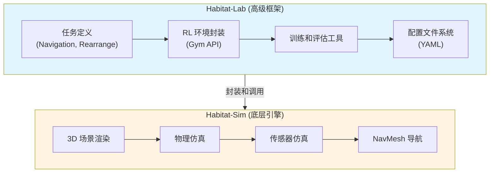

本文档将指导你如何在 `habitat-lab` 项目中通过实际代码来学习 Habitat-Sim 的核心概念和使用方法。

## Habitat-Sim 与 Habitat-Lab 的关系



**关键理解**：
- **Habitat-Lab 内部使用 Habitat-Sim**：`habitat-lab/habitat/sims/habitat_simulator/habitat_simulator.py` 中的 `HabitatSim` 类继承自 `habitat_sim.Simulator`
- **学习路径**：要深入理解 Habitat，需要同时学习两者
  - 使用 **Habitat-Lab** 快速上手和训练模型
  - 学习 **Habitat-Sim** 理解底层原理和自定义功能
- **选择建议**：
  - **快速实验和训练**：使用 Habitat-Lab
  - **研究底层机制**：直接使用 Habitat-Sim
  - **自定义功能**：在 Habitat-Lab 基础上扩展，或直接使用 Habitat-Sim


本文档主要关注 **Habitat-Sim 的学习**，因为：
1. 理解底层原理有助于更好地使用 Habitat-Lab
2. 自定义功能通常需要直接操作 Habitat-Sim
3. Habitat-Lab 的封装细节也依赖于 Habitat-Sim 的知识

但文档中的示例代码大多来自 `habitat-lab` 项目，因为 Habitat-Lab 项目包含了大量 Habitat-Sim 的使用示例。

## 学习路径概览

Habitat-Sim 的学习可以分为以下几个层次：

1. **基础概念理解**：Agent、Sensor、Scene、Simulator
2. **配置和初始化**：如何创建和配置 Simulator
3. **Agent 操作**：如何初始化和控制 Agent
4. **传感器使用**：如何配置和获取传感器观察
5. **导航和路径规划**：NavMesh 的使用
6. **高级功能**：物理交互、对象操作等

## 一、基础示例代码位置

### 1.1 最简单的入门示例

**文件位置**：`examples/example.py`

这是最基础的示例，展示了如何使用 Habitat-Lab 的高级 API：

```python
import gym
import habitat.gym

with gym.make("HabitatRenderPick-v0") as env:
    observations = env.reset()
    terminal = False
    while not terminal:
        observations, reward, terminal, info = env.step(
            env.action_space.sample()
        )
```

这个示例虽然简单，但它隐藏了 Habitat-Sim 的底层细节。要真正理解 Habitat-Sim，我们需要查看更底层的代码。

### 1.2 直接使用 Habitat-Sim API 的示例

**文件位置**：`test/test_robot_wrapper.py` (第 62-290 行)

这个文件包含了直接使用 Habitat-Sim API 的完整示例，展示了如何：

1. 创建 `SimulatorConfiguration`
2. 配置传感器（CameraSensorSpec）
3. 创建 `AgentConfiguration`
4. 初始化 `Simulator`
5. 操作 Agent 和获取观察

**关键代码片段**：

```python
# 创建 SimulatorConfiguration
sim_cfg = habitat_sim.SimulatorConfiguration()
sim_cfg.scene_id = settings["scene"]
sim_cfg.enable_physics = settings.get("enable_physics", False)

# 创建传感器配置
camera_sensor_spec = habitat_sim.CameraSensorSpec()
camera_sensor_spec.sensor_type = habitat_sim.SensorType.COLOR
camera_sensor_spec.resolution = [height, width]
camera_sensor_spec.position = [0.0, sensor_height, 0.0]

# 创建 Agent 配置
agent_cfg = habitat_sim.agent.AgentConfiguration()
agent_cfg.sensor_specifications = [camera_sensor_spec]

# 创建并初始化 Simulator
hab_cfg = habitat_sim.Configuration(sim_cfg, [agent_cfg])
sim = habitat_sim.Simulator(hab_cfg)
```

## 二、核心概念的实际代码实现

### 2.1 Simulator 的创建和配置

**参考文件**：
- `habitat-lab/habitat/sims/habitat_simulator/habitat_simulator.py` (第 311-400 行)
- `test/test_robot_wrapper.py` (第 62-160 行)
- `habitat-lab/habitat/datasets/rearrange/rearrange_generator.py` (第 875-904 行)

**关键步骤**：

1. **创建 SimulatorConfiguration**：
   - 指定场景文件路径
   - 配置物理引擎
   - 设置 GPU 设备

2. **配置传感器**：
   - 使用 `CameraSensorSpec` 创建相机传感器
   - 可以配置 RGB、深度、语义等多种传感器类型

3. **配置 Agent**：
   - 使用 `AgentConfiguration` 定义 Agent
   - 将传感器附加到 Agent 上

4. **创建 Simulator**：
   - 使用 `Configuration` 组合所有配置
   - 实例化 `Simulator` 对象

### 2.2 Agent 的初始化和控制

**参考文件**：
- `test/test_robot_wrapper.py` (第 290-350 行)
- `examples/shortest_path_follower_example.py`

**关键操作**：

```python
# 初始化 Agent
agent = sim.initialize_agent(agent_id)

# 设置 Agent 状态
agent_state = habitat_sim.AgentState()
agent_state.position = np.array([0.0, 0.0, 0.0])
agent_state.rotation = quaternion.from_euler_angles(0, -np.pi/2, -np.pi/2)
agent.set_state(agent_state)

# 执行动作
observations = sim.step(action)

# 获取观察结果
rgb_obs = observations["color_sensor"]
depth_obs = observations["depth_sensor"]
```

### 2.3 传感器配置和使用

**参考文件**：
- `test/test_robot_wrapper.py` (第 85-150 行)
- `habitat-lab/habitat/sims/habitat_simulator/habitat_simulator.py` (第 373-400 行)

**传感器类型示例**：

1. **RGB 相机**：
```python
color_sensor_spec = habitat_sim.CameraSensorSpec()
color_sensor_spec.sensor_type = habitat_sim.SensorType.COLOR
color_sensor_spec.resolution = [height, width]
color_sensor_spec.hfov = 90.0
```

2. **深度传感器**：
```python
depth_sensor_spec = habitat_sim.CameraSensorSpec()
depth_sensor_spec.sensor_type = habitat_sim.SensorType.DEPTH
depth_sensor_spec.resolution = [height, width]
```

3. **语义传感器**：
```python
semantic_sensor_spec = habitat_sim.CameraSensorSpec()
semantic_sensor_spec.sensor_type = habitat_sim.SensorType.SEMANTIC
semantic_sensor_spec.resolution = [height, width]
```

### 2.4 NavMesh 的使用

**参考文件**：
- `examples/shortest_path_follower_example.py`
- `habitat-lab/habitat/tasks/nav/shortest_path_follower.py`
- `habitat-lab/habitat/datasets/rearrange/navmesh_utils.py`

**关键操作**：

```python
# 检查点是否可导航
is_navigable = sim.pathfinder.is_navigable(nav_point)

# 获取随机可导航点
random_point = sim.pathfinder.get_random_navigable_point()

# 将点吸附到最近的导航点
snapped_point = sim.pathfinder.snap_point(position)

# 查找最短路径
path = habitat_sim.ShortestPath()
path.requested_start = start_point
path.requested_end = end_point
found_path = sim.pathfinder.find_path(path)

# 获取 top-down 视图
topdown_view = sim.pathfinder.get_topdown_view(
    meters_per_pixel=0.1,
    height=1.5
)

# 计算到最近障碍物的距离
distance = sim.pathfinder.distance_to_closest_obstacle(
    nav_point, 
    max_search_radius=2.0
)
```

## 三、个人代码学习

| 属性 | `learn_habitat_sim_basic.py` - 基础学习示例 | `learn_habitat_sim_navmesh.py` - NavMesh 学习示例 |
|------|--------------------------------------------|---------------------------------------------------|
| **作用** | 通过实际代码学习 Habitat-Sim 的基础概念 | 深入学习 NavMesh 和路径规划 |
| **主要内容** | 创建和配置 Simulator；配置 Agent 和传感器；执行动作并获取观察；多种动作序列模式（探索、直线、螺旋、随机）；生成多个不同配置的视频 | NavMesh 的加载和检查；可导航点查询；障碍物查询；路径规划（最短路径查找）；Top-down 视图生成；多个不同参数的路径视频生成 |
| **使用场景** | 学习 Habitat-Sim 的基础 API；理解 Simulator、Agent、Sensor 的概念；学习如何配置和使用传感器 | 学习导航网格（NavMesh）的使用；理解路径规划算法；学习导航相关的 API |


### 3.1 基础 Simulator 使用示例

**文件位置**：`examples/learn_habitat_sim_basic.py`

这是一个完整的基础学习示例，包含：

1. **场景加载**：如何配置和加载 3D 场景
2. **Agent 初始化**：如何创建和初始化 Agent
3. **传感器配置**：如何配置 RGB、深度、语义传感器
4. **基本动作执行**：如何执行移动和旋转动作
5. **观察结果获取**：如何从传感器获取观察数据
6. **NavMesh 基础操作**：可导航点查询、点吸附等

**运行方法**：
```bash
cd /root/autodl-tmp/habitat-lab
python examples/learn_habitat_sim_basic.py
```

这个示例详细注释了每个步骤，是学习 Habitat-Sim 基础概念的最佳起点。

### 3.2 NavMesh 和路径规划示例

**文件位置**：`examples/learn_habitat_sim_navmesh.py`

这是一个专门针对 NavMesh 和路径规划的深入学习示例，包含：

1. **NavMesh 加载和检查**：如何检查 NavMesh 是否加载，获取边界信息
2. **可导航点查询**：随机采样、可导航性检查、点吸附
3. **障碍物查询**：计算到障碍物的距离，获取障碍物表面点
4. **路径查找**：在 NavMesh 上查找两点之间的最短路径
5. **Top-down 视图**：生成和可视化 NavMesh 的俯视图
6. **NavMesh 重新计算**：如何根据 Agent 参数重新计算 NavMesh

**运行方法**：
```bash
cd /root/autodl-tmp/habitat-lab
python examples/learn_habitat_sim_navmesh.py
```

### 3.3 导航任务示例

**文件位置**：`examples/shortest_path_follower_example.py`

这个示例展示了：
- 如何使用 ShortestPathFollower
- 如何可视化导航路径
- 如何获取 top-down map

### 3.4 交互任务示例

**文件位置**：
- `examples/tutorials/nb_python/Habitat2_Quickstart.py`
- `examples/interactive_play.py`

这些示例展示了：
- 如何配置物理引擎
- 如何进行物体操作
- 如何实现抓取和放置

## 四、个人深入学习

### 4.1 Habitat-Lab 如何封装 Habitat-Sim

**关键文件**：`habitat-lab/habitat/sims/habitat_simulator/habitat_simulator.py`

这个文件展示了 Habitat-Lab 如何将 Habitat-Sim 封装成更高级的接口：

- `HabitatSim` 类继承自 `habitat_sim.Simulator`
- `create_sim_config` 方法展示了如何从配置创建 Simulator
- `_update_agents` 方法展示了如何更新 Agent 状态

### 4.2 传感器封装

**关键文件**：`habitat-lab/habitat/sims/habitat_simulator/habitat_simulator.py` (第 100-250 行)

展示了如何将 Habitat-Sim 的传感器封装成 Habitat-Lab 的传感器接口。

### 4.3 动作空间实现

**关键文件**：
- `habitat-lab/habitat/tasks/nav/nav.py`
- `habitat-lab/habitat/tasks/rearrange/actions/actions.py`

展示了如何实现不同的动作空间，包括：
- 离散动作（turn_left, turn_right, move_forward）
- 连续动作（arm control, base velocity）

## 五、参考资源

- `README.md`：项目概述和安装说明
- `examples/tutorials/`：各种教程示例
- `test/`：测试文件包含大量使用示例
