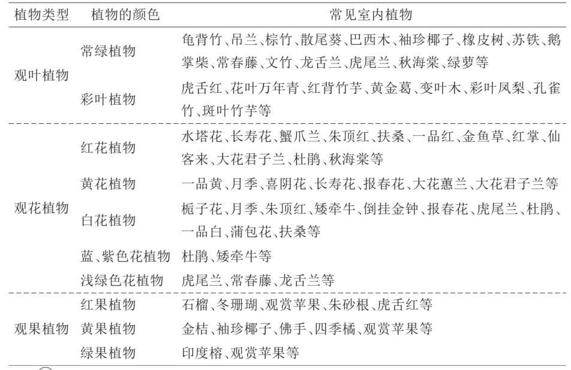

# 新农科实践-生活园艺
## 课程论文

**课程号**：**(2023-2024-1)-1617N007-0093229-1**

**开课学院**： **农学院**

**提交日期**：**2023**年 **11** 月 **5** 日

|          |                                                           |
| :------- | :-------------------------------------------------------- |
| **得分** |                                                           |
| **评语** |                                                           |
| **评卷人** |                                                           |

---

> **课程论文的任务要求（选题范围、格式要求、评分标准等）：**

1.  论文包括中文标题、摘要、关键词、正文、参考文献等；
2.  正文字数：3000字以上，或根据任课教师要求；
3.  论文字体：仿宋(小四号)；
4.  论文行距：1.5倍；
5.  论文页边距：左右2.5厘米；
6.  论文层次的编号采用1, 1.1, 1.1.1；2, 2.1, 2.1.1的形式；
7.  参考文献一律用阿拉伯数字分别依序连续编排序号，同时在文中相应处用右上标标出，如`[1]`、`[2]`等
8.  参考文献格式如下：
    > [1] 陈怀满, 郑荣春, 周东美. 关于我国土壤环境保护研究中一些值得关注的问题[J]. 农业环境科学学报, 2004(6): 1244-1245.
    >
    > [2] Zhang HZ, Luo YM, Xia JQ. Some thoughts of the comparison of risk based soil environmental standards between different countries[J]. Environmental Science, 2011, 32(3): 795-802.

---

# 生物医学工程在园艺治疗中的应用

**摘要**: 本文探讨了生物医学工程技术在医院园艺治疗应用中的可能应用，从园艺疗法的历史和现代价值出发，详细讨论了花卉和植物在改善患者生理和心理状态方面的重要作用，同时突出了生物医学工程技术在精确监测和评估这些效应方面的关键作用。通过结合计算机视觉和生理信号传感器的数据来指导园艺环境的设计和选择，从而设计提高病患的参与度和治疗效果。

**关键词**: 生物医学工程; 园艺疗法；病患互动；治疗环境设计；个性化医疗

## 1 园艺疗法的定义与历史

### 1.1 园艺疗法的起源和发展

园艺疗法，或称为康复园艺，是一种利用园艺活动进行身心康复的疗法。它的起源可以追溯到古代文明，当时人们认识到与大自然的互动对人的健康有着积极的影响。

进入19世纪，园艺疗法开始在医疗体系中得到正式的认可，被用于帮助受伤士兵的物理和心理康复。20世纪70年代，随着西方国家医学核心焦点从疾病向健康的转变，园艺疗法逐渐兴盛起来，通过利用植物栽培与园艺操作帮助人舒缓情绪、激发动力，改善体能和运动协调，同时治疗心理障碍，增加社会联系和道德感的价值[1]。

### 1.2 现代园艺疗法的价值与意义

在现代社会，园艺疗法被认为是一种整合性治疗方法，不仅关注身体健康，也关注心理和社会福祉。

对于病人来说, 由于客观存在的缺陷, 他们与植物的关系被切断。然而生物本身是有变化的, 这些变化带给人们平静。有的人在长期与病魔做斗争的过程中, 突然发现窗外的植物在摇晃或发芽时, 看到了自然的丰富性和生命的喜悦, 从而获得了生活的力量[2]。

研究表明，园艺疗法可以降低压力水平，改善情绪状态，增加自我效能感，并促进社会交往。

### 1.3 园艺疗法与病患的互动重要性

与园艺环境的互动是园艺疗法成功的关键。患者通过播种、浇水、修剪和收获等活动，不仅能够感受到生命的成长和变化，也在无形中加强了自己对健康的掌控感。更重要的是，这种互动促使患者转移焦点，从疾病的负面影响中解脱出来，找到积极面对生活的动力。此外，通过与植物的互动，患者可以重新建立与周围世界的联系，这对于身处孤立环境的患者来说尤为重要。

*图1 园艺活动中感觉体验和动作体验的相互作用*

## 2 绿色设计的生理与心理效应

### 2.1 花卉、植物和颜色对病患情绪和生理状态的影响

花卉和植物自古以来就被用作提升心情和改善生理状态的天然治疗剂。现代研究也证实了这一点，指出特定的植物和花卉，如薰衣草和玫瑰，能够降低心率，减缓呼吸速率，从而减轻压力和焦虑。

通过刺激人体包括视觉、嗅觉、听觉、味觉和触觉的五感以及园艺手作活动是植物在园艺疗法中作用于人体而达到积极治疗效果的主要方式。五感花园通过五感作用进而调节人体身心健康，分为视觉花园、嗅觉花园、听觉花园、味觉花园和触觉花园。

*图2 常见植物颜色的心理效应*

这里以视觉花园举例，如红色花卉如木瓜海棠、红掌等能增进人的食欲；赭色的花卉如鸡冠花、大丽花等可稳定低血压患者的血压；花卉的绿叶使人产生舒适的感觉，可解除焦虑，舒畅心情[3]。

植物的气味、色彩以及整体的观感可以影响病患的内分泌系统，导致激素如皮质醇的水平变化，进而影响情绪状态。同时，植物通过释放负离子和净化空气的方式，改善环境质量，对患者的呼吸健康产生积极作用。

### 2.2 选择适当的园艺环境提升疗效

选择合适的园艺环境对于疗效的提升至关重要。在设计园艺疗法环境时，应当综合考虑患者的具体需求、病状以及个人偏好。对于生理上需要恢复和放松的患者，使用色彩柔和、结构简单、维护要求低的植物和花卉。而对于需要情绪激励和心理刺激的患者，则可以选择色彩鲜明、花香浓郁的品种。

*图3 花卉园艺活动(花卉创意栽培、干花书签制作)*

此外，可以根据病房的光线条件、空间大小以及患者的活动能力，进行植物种类和布置方式的个性化选择。例如，对于光线不足的病房，可以选择耐阴植物；而对于有轮椅患者的病房，则应确保植物布置不会阻碍行动。

在选择过程中，还应注意植物的安全性和无过敏反应。所有的园艺环境都应该定期进行维护，以保持其美观及疗效。

## 3 生物医学工程技术的应用

生物医学工程作为一个工科专业，运用工程学的技术和手段，结合生物学知识，为人类的健康服务和为疾病的防治提供依据，最终解决医学问题[4]。但是在这里，我们可以更多的运用医疗器械的工科技术手段，来为园艺治疗的疗效提供更为精确的判断。

### 3.1 功能磁共振成像：监测病患的行为和表情

生物医学工程的一项重要应用是利用功能磁共振成像(functional magnetic resonance imaging,f MRI)技术来监测和评估病患的行为和表情。现阶段研究发现面部表情的加工过程主要与以下结构有关:视觉皮质(梭状回、枕叶的内侧及下方、舌回),边缘结构(杏仁核、海马、后扣带回),颞叶,颞顶区(顶叶、颞中回、岛叶),额叶,皮质下区(壳核)以及小脑[5]。因此，我们可以通过分析病患与园艺环境互动时的面部表情和身体语言来评价情绪状态和舒适度。该种系统可以安装在病房内，实时收集数据，通过机器学习算法分析病患的微表情和动作，以判断其情绪变化。

这类技术的应用不仅能够帮助医疗人员了解患者在接触不同类型的植物时的心理变化，还可以监测长期趋势，从而调整治疗方案，使园艺疗法更加个性化和精确。

### 3.2 生理信号传感器：监测园艺环境中的生理响应

生理信号传感器如心电图(ECG)、心率变异性(HRV)和皮肤电导率(GSR)是生物医学工程中常用的工具，它们能够提供有关病患生理状态的详尽信息。在园艺疗法中，这些传感器可以用来监测患者在接受治疗前后的生理变化。

通过ECG监测心率和节律，可以评估病患对园艺环境的心脏反应；HRV是反映压力水平和自主神经系统活动的重要指标；而GSR可以显示出患者的情绪激动程度。将这些传感器的数据进行综合分析，可以为病患提供更加定制化的园艺疗法方案，例如，当监测到某种植物使患者的生理指标变得更加稳定时，可以将此类植物更多地集成到病患的环境中。

## 4 园艺环境的设计与选择

在建立了植物和颜色对病人心理和生理影响的基础，并通过生物医学工程技术精确监测了病人的反应之后，我们的重点转向如何根据所收集到的数据来设计和选择最适合的园艺环境。这涉及到综合患者的生理和心理需求，以及他们与环境的互动反应，来创建一个有助于恢复和治疗的空间。

### 4.1 基于病患的需求和反应的园艺作物选择

园艺环境的设计应以病患的需求为中心。选择园艺作物时，需要考虑植物的香气、大小、维护要求以及它们所能带来的心理和生理上的益处。生物医学工程可以通过分析患者的反应数据，为每位患者推荐适宜的植物类型。

*图4 病房内可选的观赏植物*

这种个性化的方法能够确保植物的选择最大限度地符合患者的治疗需求，如选择能够带来镇静效果的植物为失眠患者服务，或是挑选能够激发感官刺激的植物帮助促进神经系统疾病患者的康复[6]。

### 4.2 植物形态与颜色的综合应用

通过对患者心情和生理状态监测的数据分析，可以确定哪些植物种类和颜色最能引起正面的反应。例如，如果数据显示某些颜色的花朵能够稳定心率或减轻焦虑，那么这些花朵应被优先考虑纳入病房的园艺设计中。选择园艺作物不仅仅是根据患者的喜好，更是基于科学数据对其健康影响的理解。

### 4.3 病患的参与度的考量

为了提高病患的积极参与度，园艺环境的设计需要考虑如何让病患更容易地与植物互动。这可以是通过可移动的植物床，触感友好的植物选择，或是引入可进行简单园艺活动的空间设计。

*图5 武汉市武东医院园艺治疗师带领精神残疾患者及家属播种[7]*

利用生物医学工程技术收集的数据，可以识别出哪些互动类型对于患者的恢复更有帮助，并相应地调整园艺环境。

## 5 总结与未来展望

研究表明，结合生物医学工程技术可以大幅提高园艺疗法的个性化水平和效果。通过实时监测和分析病患的生理和心理状态，医疗团队能够调整治疗环境，以最大化其恢复潜力。采用这种技术，园艺治疗变得更加精细化和动态化，从而为病患提供了一个更加支持性和有益的康复环境。

展望未来，生物医学工程与园艺治疗结合的领域有巨大的发展潜力。随着技术的进步，监测设备将变得更加微型化、智能化和成本效益高。预期未来的研究将进一步优化数据分析算法，提高预测病患反应的准确性，从而实现更加个性化的治疗方案。同时，随着对患者心理和生理影响更深入的理解，园艺疗法的应用范围和效果都有望得到显著扩展。

总体而言，生物医学工程的应用将为传统园艺疗法带来创新，增强科学性和有效性。未来，我期望这种跨学科的合作不仅能够为患者提供更优质的治疗环境，同时为医院设计提供新的理念，使得园艺治疗在医疗保健领域的重要性得到更广泛的认识和应用。

---

**参考文献**

[1] 薛滨夏,李同予.园艺疗法体系的组成、内涵与实施应用[J].园林,2023,40(04):51-57.

[2] 李树华.园艺疗法的特征[J].园林,2013(11):12-17.

[3] 贾俊丽,罗海蓉,梅雪莹等.花卉在园艺疗法中的应用[J].安徽农业科学,2022,50(22):114-118.

[4] 黄素琴,高斌.生物医学工程专业研究生医工交叉培养方式探索[J].中国教育技术装备,2021(20):134-136.

[5] 李晓凡,范国光.抑郁症病人面部表情刺激的脑功能磁共振研究现状与进展[J].国际医学放射学杂志,2010,33(05):421-423+450.

[6] 杨婷婷,赵艺玥.基于园艺疗法的室内植物色彩选择[J].现代园艺,2023,46(05):172-175.DOI:10.14051/j.cnki.xdyy.2023.05.072.

[7] 荆楚网.武汉市武东医院开展园艺疗法 用植物护佑特殊患者心理健康[EB/OL].(2023-3-24)[2023-11-3].https://baijiahao.baidu.com/s?id=1728174748473947119&wfr=spider&for=pc