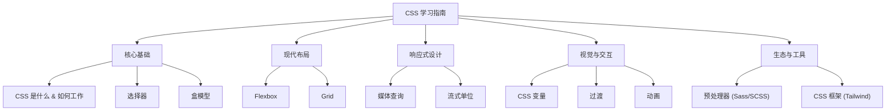

CSS属于前端里最牢的知识了，有点像编程界的C++，你永远没法说自己精通了CSS，而且前端开发和UI设计本身也在合流，这样一来就更牢了。
这里大纲先这样写着，后面再来补充。

- [核心基础](./bedrock)
- [现代布局](./layouts)
- [响应式设计](./responsive)
- [视觉与交互](./interactivity)
- [生态与工具](./ecosystem)
