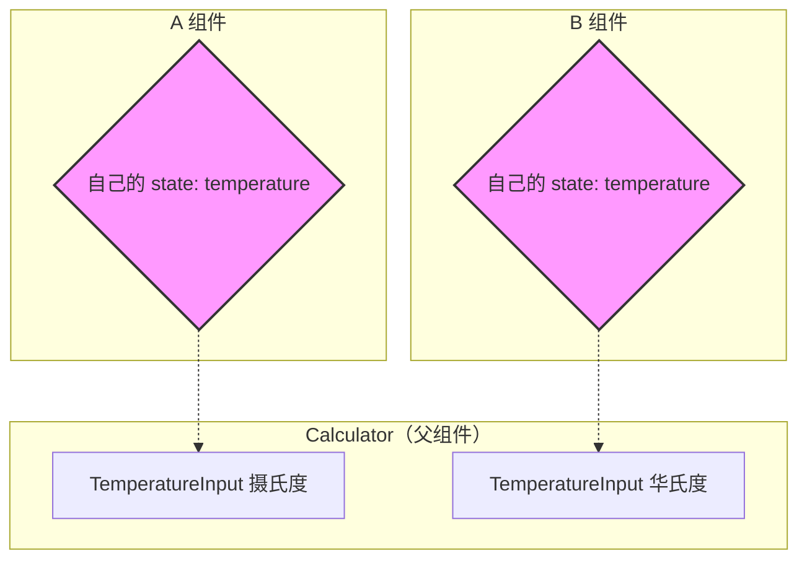
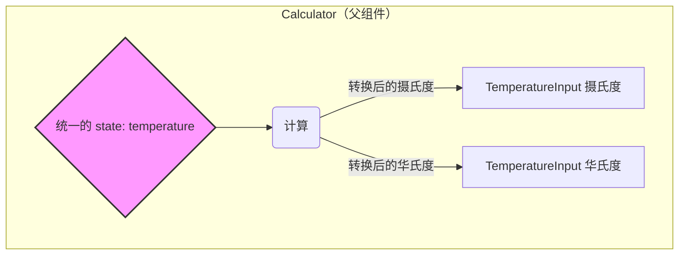

我们已经学过组件内的 `useState`，现在需要进一步回答这些问题：什么时候单纯的本地 state 就够用？什么时候要把 state 提升或抽到全局？副作用怎么处理？常见的第三方状态库应该如何选择？

## 为什么需要状态管理

状态描述了 UI 的当前展示形态。React 把视图看成「状态 → UI」的映射，所以管理好状态就等于掌控了界面。

`useState` 会返回一个包含两个元素的数组：
- 第一个元素：当前的状态值。
- 第二个元素：更新状态的函数。

```jsx
const [count, setCount] = useState(0);
// React：请给我一个名为 count 的状态，初始值为 0；
// 同时返回 setCount，以便我更新 count 并触发重新渲染。
```

对于单个组件来说，这已经足够。但一旦多个组件需要共享数据，就需要新的策略。

## 本地状态共享：状态提升

当兄弟组件需要读取同一份数据时，可以把 state 提升到它们的最近公共父组件，再通过 props 下发。这就是 **Lifting State Up**。

想象一个温度转换组件，需要同时展示摄氏度和华氏度：

```jsx
function TemperatureInput(props) {
  // ...
}

class Calculator extends React.Component { 
   // 1. 状态被“提升”到了父组件 Calculator 里
   this.state = {temperature: '', scale: 'c'}; 

   render() { 
     // 2. 父组件根据统一的 state，计算出两个需要的值
     const celsius = scale === 'f' ? tryConvert(temperature, toCelsius) : temperature; 
     const fahrenheit = scale === 'c' ? tryConvert(temperature, toFahrenheit) : temperature; 

     return ( 
       <div> 
         {/* 3. 将计算好的值，通过 props 传给子组件去显示 */}
         <TemperatureInput 
           scale="c" 
           temperature={celsius} 
            /> 
         <TemperatureInput 
           scale="f" 
           temperature={fahrenheit} 
            /> 
       </div> 
     ); 
   } 
}
```

<div style={{ display: 'flex', flexWrap: 'wrap', gap: '1.5rem', alignItems: 'flex-start' }}>
  <div style={{ flex: '1 1 320px', minWidth: '280px' }}>



  </div>
  <div style={{ flex: '1 1 320px', minWidth: '280px' }}>



  </div>
</div>

通过将 state 提升到 `Calculator` 组件，我们可以在两个 `TemperatureInput` 之间同步温度。

## React 内建状态工具箱

除了 `useState` 与状态提升，React 还提供了几种内建手段应对更复杂的场景：

- **`useReducer`**：适用于状态更新逻辑复杂、涉及多步操作或需要可预测状态转换的组件。
- **Context**：用来在组件树中向深层传递数据，避免多层级 props drilling。
- **自定义 Hook**：把状态逻辑抽离成独立函数，在多个组件间复用。

这些工具组合使用，通常能覆盖中小型项目的绝大多数需求。

## 使用 `useEffect` 处理副作用

**副作用**是指在组件渲染之外执行的操作，例如：

- 数据获取（fetching data）
- 设置订阅（subscriptions）
- 手动更改 DOM

`useEffect` 让函数组件可以在渲染完成后执行这些操作：

```jsx
import React, { useState, useEffect } from 'react';

function Example() {
  const [count, setCount] = useState(0);

  // 相当于 componentDidMount 和 componentDidUpdate:
  useEffect(() => {
    // 使用浏览器 API 更新文档标题
    document.title = `你点击了 ${count} 次`;
  });

  return (
    <div>
      <p>你点击了 {count} 次</p>
      <button onClick={() => setCount(count + 1)}>
        点我
      </button>
    </div>
  );
}
```

### 清除 Effect

有些副作用需要清除。例如设置订阅、计时器等，都要在组件卸载时取消。

`useEffect` 的回调可以返回一个**清理函数**：

```jsx
useEffect(() => {
  const subscription = props.source.subscribe();
  return () => {
    // 清除订阅
    subscription.unsubscribe();
  };
});
```

### 依赖项数组

默认情况下，`useEffect` 在每次渲染后都会运行。通过传递**依赖项数组**可以控制触发时机：

```jsx
useEffect(() => {
  document.title = `你点击了 ${count} 次`;
}, [count]); // 仅在 count 更改时更新
```

如果依赖项数组为空 `[]`，则 effect 只会在组件挂载和卸载时运行一次。

| 代码                | 含义                            | 比喻                           |
| ------------------- | ------------------------------- | ------------------------------ |
| `useEffect(fn)`     | 每次渲染后都运行                | 强迫症保安，每次都检查         |
| `useEffect(fn, [])` | 只在首次渲染后运行              | 挂画，只做一次                 |
| `useEffect(fn, [dep])` | 首次渲染，以及 `dep` 变化后运行 | 智能空调，按需启动             |
| `return cleanup`    | 组件卸载或 effect 重跑前运行     | 搬家时取画，换新空调前拆旧的   |
