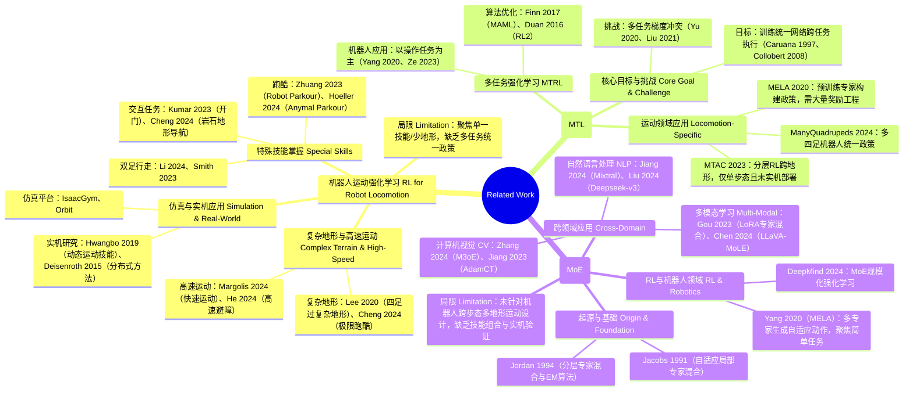

> https://arxiv.org/abs/2503.08564
> IROS 2025

在大语言模型（LLM）中，**MoE（混合专家模型）**往往被视为一种在维持推理成本不变的情况下通过堆叠参数量来换取性能的手段，我觉得类似某种程度上的逃课。

但在 **MoE-Loco** 这种机器人运动控制（Locomotion）任务中，MoE 的引入与其说是为了"增加规模"，不如说是为了解决多任务强化学习中一个非常骨感的物理痛点：**梯度冲突（Gradient Conflicts）**。

在传统的单神经网络（如普通的 MLP）中，如果你试图让一个机器人同时学会"像狗一样爬行"和"像人一样双足行走"，这两项任务的物理特性是截然不同的：

- **奖励函数冲突**：双足行走需要极高的重心平衡，而四足爬行可能需要贴地。
- **动力学差异**：终止条件、触地逻辑在两种模式下完全不同。

如果你强行用一个全连接网络去学，优化任务 A 的梯度可能会抵消掉任务 B 的进度，导致模型发散或陷入平庸（即所谓的 **"负迁移"**）。

MoE 在这里通过**门控网络（Gating Network）**将不同的物理场景路由给不同的专家。实验显示，MoE 显著提高了**余弦相似度（Cosine Similarity）**，降低了**梯度负项比例（Negative entry ratio）**。这证明了它不是在偷懒，而是在物理逻辑层面实现了"术业有专攻"，避免了不同运动模态之间的互相干扰。

回到 Related Works 中，这里对应的是其实是 **MultiTask Reinforced Learning，多任务强化学习**。$\pi_0$ 依赖海量的跨任务数据，在 Scaling Law 加持下吸收不同任务的差异，而且处理的还不是硬实时反应任务（当然 Flow Matching 也足够快）而是语义任务（如何理解指令并操控物体）。而**多任务 RL 中存在严重的负迁移**，学习 A 地形（如跨越横杆）产生的梯度更新，会直接破坏 B 模式（如双足平衡）的参数稳定性。它没有去硬刚"如何用一个黑盒容纳物理矛盾"这个难题。但对于机器人来说，**动力学一致性**是一个极其严苛的物理约束。

### Related Works

### Methodology

#### Task Definition

MoE-Loco 将任务定义为在一个统一框架下处理 **9 种具有挑战性的运动任务**。

##### 任务分类与覆盖范围

这些任务被划分为两大步态模式，涵盖了从简单的平面行走到了极具挑战性的非结构化地形：

- **四足步态 (Quadrupedal Gait)**：包括跨越横杆 (Bar Crossing)、跨越地坑 (Pit Crossing)、匍匐通过挡板 (Baffle Crawling)、爬楼梯 (Stair Climbing) 以及斜坡行走 (Slope Walking)。
- **双足步态 (Bipedal Gait)**：包括站立准备 (Standing Up)、平面行走 (Plane Walking)、斜坡行走 (Slope Walking) 以及下楼梯 (Stair Descending)。

| 步态类型 | 任务数量 | 具体任务示例 |
|---------|---------|-------------|
| 四足步态 | 5 | 过杆、过坑、爬挡板、上楼梯、走斜坡 |
| 双足步态 | 4 | 站立、平面行走、上下坡、下楼梯 |

##### 马尔可夫决策过程 (MDP) 的形式化

作者将多任务运动建模为一个元组 $\langle S_{\tau},A_{\tau},T_{\tau},R_{\tau},\gamma_{\tau}\rangle$。这里体现"多任务"特性的关键在于：

- **状态子集 $S_{\tau}$**：不同的地形对应状态空间的不同子集。例如，在斜坡上行走的状态分布与在横杆上跨越的状态分布是截然不同的。
- **变动的奖励函数 $R_{\tau}$**：奖励函数随步态指令 $g$ 的不同而变化，以体现任务特定的目标。
- **动力学转移 $T$**：终止条件（如摔倒的判定）取决于步态类型，导致了截然不同的转移状态。

其最终优化目标是最大化跨所有任务的累积期望奖励：

$$J(\pi)=\mathbb{E}[\sum_{\tau}\sum_{t=0}^{\infty}\gamma^{t}R_{\tau}(s_{t},a_{t},s_{t+1})]$$

#### MoE Based Multitask Learning

这是本文的核心贡献，旨在通过 **Mixture of Experts (MoE)** 架构缓解多任务 RL 中的**梯度冲突 (Gradient Conflicts)**。

##### 状态空间与动作空间

为了让模型在"**盲动**"（Blind Locomotion，即仅依靠本体感知）的情况下完成任务，系统整合了四类信息：

- **本体感知 ($p_t$，proprioception)**：包括投影重力、基座角速度、关节位置、关节速度及上一次动作。
- **显式特权状态 ($e_t$)**：包含基座线速度和地面摩擦力（这些在现实中难以直接获得，仅在训练阶段使用）。
- **隐式特权状态 ($i_t$)**：包含机器人不同连杆的接触力，这些信息被编码为低维潜变量以减少 **sim2real gap**。
- **指令 ($c_t$)**：包括通过遥控器输入的线速度/角速度指令，以及一个独热码用于切换四足（$g=0$）或双足（$g=1$）模式。

| 空间类型 | 具体构成 |
|---------|---------|
| **状态空间** | 1. **本体感受**（$p_t$）：IMU 重力 / 角速度、关节位置 / 速度、上一动作 2. **显式特权状态**（$e_t$）：基线性速度、地面摩擦 3. **隐式特权状态**（$i_t$）：关节接触力（编码为低维向量） 4. **指令**（$c_t$）：速度指令$(v_x,v_y,v_{yaw})$ + 步态 one-hot 向量（0 = 四足，1 = 双足） |
| **动作空间** | $a_t \in \mathbb{R}^{12}$：12 个关节的目标位置 |

将三类输入（$e_t$、$i_t$、$p_t$）整合为统一的输入特征 $l_t$，和 command $c_t$ 一起送入 **LSTM** 输出时序特征 $h_t$ 到 **Actor-Critic** 网络中去。

##### MoE in Actor-Critic

**LSTM** 输出的 $h_t$ 分 3 路流向以下模块：

- **Actor MoE**：包含多个"专家网络"（$f_i$），每个专家负责特定技能 / 任务（如"四足过杆专家"、"双足行走专家"）
- **Critic MoE**：对应价值函数的 **MoE** 模块，用于评估当前状态的价值
- **Gating Network（门控网络）**：根据 $h_t$ 生成专家权重 $l_i$（通过 **softmax** 确保权重和为 1，实现"任务 - 专家"的动态匹配）

**Actor-Critic 基础**

- **Actor（策略网络）**：
  - **输入**：当前环境状态 $s_t$
  - **输出**：动作 $a_t$（离散任务输出动作概率，连续任务输出动作分布的参数，如均值和方差）
  - **作用**：直接决定智能体"做什么动作"
  - **训练**：用"策略梯度"调整策略，让"Critic 认为好的动作"出现概率更高；梯度方向由优势函数 $A(s_t,a_t)$ 决定：
    $$A(s_t,a_t) = r_t + \gamma V(s_{t+1}) - V(s_t)$$
    优势函数表示"当前动作比平均水平好多少"，能减少策略梯度的方差

- **Critic（价值网络）**：
  - **输入**：当前环境状态 $s_t$（或 $s_t+a_t$，即动作价值）
  - **输出**：状态价值 $V(s_t)$（或动作价值 $Q(s_t,a_t)$）
  - **作用**：评估 Actor 选的动作"好不好"（即当前状态 / 动作能带来的长期奖励）
  - **训练**：用"时序差分（TD）误差"更新价值估计：
    $$\text{TD误差} = r_t + \gamma V(s_{t+1}) - V(s_t)$$
    其中 $r_t$ 是当前步奖励，$\gamma$ 是折扣因子；Critic 的损失通常是 TD 误差的均方误差（**MSE**）

**MoE 架构设计**

这里作者用了 **6 个专家**，每个专家是独立的小型 **MLP**，输出是该专家对应的"动作预测"（12 维关节目标位置）。**Actor MoE 和 Critic MoE 共享同一个门控网络**，这种设计确保了策略评估（价值函数）与动作生成（策略函数）在任务理解上的一致性。

**动作生成逻辑**

对于给定的输出 $h_t$，动作生成逻辑如下：

1. **门控得分计算**：

$$\hat{g_i} = \text{softmax}(g(h_t))[i]$$

门控网络以 $h_t$ 为输入，输出 6 个专家的权重（经 **softmax** 归一化，和为 1）。训练时，不同任务（比如"四足过杆"、"双足行走"）的梯度会被门控导向对应的专家，避免跨任务梯度冲突。

2. **专家输出加权和**：

$$a_t = \sum_{i=1}^{N} \hat{g}_i \cdot f_i(h_t)$$

这意味着最终的动作 $a_t$ 不是由某一个神经网络决定的，而是所有专家 $f_i$ 根据门控网络给出的"话语权"（权重）加权求和的结果。

**推理过程**：
- 推理时，门控网络会根据当前状态（本体感受、任务指令）输出 6 个专家的权重
- **Actor 的最终动作** = 6 个专家的动作输出 × 对应权重，再求和
- **Critic 的最终价值** = 6 个专家的价值输出 × 对应权重，再求和

**损失函数（Loss Function）**

模型最终的损失函数由三部分组成：

$$L = L_{surro} + L_{value} + L_{recon}$$

1. **策略损失 $L_{surro}$（Actor）**：采用 **PPO** 的 Clip Surrogate 损失，避免策略更新幅度过大：

$$L_{surro} = \mathbb{E}\left[ \min\left( \frac{\pi(a|s)}{\pi_{old}(a|s)} A(s,a), \text{clip}\left(\frac{\pi(a|s)}{\pi_{old}(a|s)}, 1-\epsilon, 1+\epsilon\right) A(s,a) \right) \right]$$

其中 $A(s,a)$ 是优势函数（由 Critic 输出的价值计算），$\epsilon=0.2$（**PPO** 标准参数）。

2. **价值损失 $L_{value}$（Critic）**：预测价值与目标价值（TD 误差）的均方误差：

$$L_{value} = \mathbb{E}\left[ \left( V(s_t) - \left( r_t + \gamma V(s_{t+1}) \right) \right)^2 \right]$$

3. **重构损失 $L_{recon}$（估计器）**：**L2** 损失，对齐估计器重构的隐式特权状态与真实值：

$$L_{recon} = \mathbb{E}\left[ \| \hat{i}_t - i_t \|_2^2 \right]$$

##### 奖励设计
奖励设计：按步态区分，核心构成如下：

| 步态类型 | 奖励组成 | 关键项 | 作用 |
|---------|---------|--------|------|
| 四足步态 | $r^{quad}=r_{track}^{quad}+r_{reg}^{quad}$ | 跟踪奖励（速度 / 角速度）+ 正则化（关节位置 / 速度） | 保持运动稳定性和平滑性 |
| 双足步态 | $r^{bip}=r_{track}^{bip}+r_{stand}^{bip}+r_{reg}^{bip}$ | 跟踪奖励 + 站立奖励（平衡）+ 正则化 | 保持平衡和运动稳定性 |

**终止条件**：
- **四足步态**：滚转角 $\theta_{roll}>1.0$ 或俯仰角 $\theta_{pitch}>1.6$
- **双足步态**：1 秒后除后腿 / 小腿外其他部位触地

##### 两阶段训练范式 (Two-stage Training)

该模型遵循了从"先知"到"学生"的演化路径：

**第一阶段：先知策略 (Oracle Policy) 训练**

由于“特权状态”在现实世界中是无法直接获取的（你没法实时知道地面的精确摩擦力），所以在这一仿真环境（**IsaacGym**）中，机器人可以访问所有的特权信息，目的是先训练出一个在完美信息下表现极好的策略（Oracle Policy）
与此同时同步训练一个估计器 (Estimator)。这个估计器的作用是：尝试只根据普通的传感器数据 ($p_t$)，去预测那些看不见的特权状态 ($e_t, i_t$)。 

- **数据流**：隐式状态通过编码器处理，并与显式状态和本体感知拼接成双状态表示 $l_{t}=[Enc(i_{t}),e_{t},p_{t}]$。
- **时序整合**：下游的 **LSTM 模块**负责将历史信息整合进状态 $h_t$。
- **MoE 路由**：$h_t$ 被输入到**门控网络（Gating Network）**，输出每个专家的权重值。

**第二阶段：学生策略与估计器 (Estimator)**
到了这一步，机器人不再能直接读取特权状态，只能使用本体感知信息 ($p_t$)。 

- **估计器预训练**：它会利用第一阶段练好的估计器来“猜”当前的物理环境（比如猜现在的路滑不滑），使用 **L2 损失函数**将 $(p_t, c_t)$ 映射到特权潜变量。
- **概率退火选择 (PAS)**：通过 **PAS 技术**逐渐让策略适应不准确的估计值，刚开始训练时，机器人还是多看一眼正确答案；随着训练进行，它被强制越来越多地依赖估计器的猜测值，直到完全适应“盲操”环境。

#### Skill Decomposition and Composition

它赋予了模型**可解释性以及零样本迁移的能力**。

##### 专家的自然专业化 (Natural Specialization)

实验观察到，通过多任务训练，不同的专家自发地学会了不同的物理技能，而不需要人工指定：

- **平衡专家**：某些专家负责维持重心的稳定，提供向上的支撑力，但牺牲了灵活性。
- **跨越专家**：某些专家负责大幅度抬起前腿，用于跨越横杆或障碍。
- **步态聚类**：通过 **t-SNE** 可视化门控权重可以发现，双足任务和四足任务形成了截然不同的聚类，这证明了 MoE 确实成功实现了物理逻辑的路由解耦。

##### 零样本技能重组 (Zero-shot Composition)

研究者发现可以通过手动干预门控权重来创造新技能，公式如下：

$$g_i = w[i] \cdot softmax(g(h_t))[i]$$

其中 $w[i]$ 是人工定义的权重系数。

**案例：带球 (Dribbling) 技能**

- **原理**：选取"平衡专家"和"抬腿跨越专家"，手动加倍跨越专家的权重并屏蔽其他专家。
- **结果**：机器人在完全没有经过"踢球"训练的情况下，实现了一种可以一边稳健行走、一边有节奏地用前腿踢球的新步态。这种能力的涌现是传统黑盒神经网络难以实现的。

##### 快速任务适配 (Adaptation Learning)

当面临完全未知的极端任务（如三条腿走路）时，MoE 展现了其极高的扩展性：

- **引入新专家**：添加一个新的随机初始化专家。
- **冻结旧专家**：保持原有的 **6 个专家参数**不变，保护已有的行走和平衡能力。
- **局部更新**：仅训练门控网络和新专家。

结果显示，机器人能迅速利用原有专家的平衡知识，并由新专家习得"始终抬起一只伤腿"的特殊逻辑，从而在平地和斜坡上完成三足行走。

### Experiment

#### Setup

- **仿真环境**：**IsaacGym** 进行大规模并行训练，单台 **NVIDIA RTX 3090 GPU** 可同时模拟 **4096 台机器人**。
- **训练流程**：分为三个阶段：
  - **平面预训练**：**40,000 次迭代**，学习基础的双足与四足行走。
  - **挑战性地形训练**：**80,000 次迭代**，学习跨越横杆、地坑、挡板等。
  - **PAS 适配**：**10,000 次迭代**，通过概率退火选择（PAS）让策略适应纯本体感知输入。
- **硬件部署**：控制频率为 **50Hz**。策略部署在 **Unitree Go2** 机器人上，机载计算设备为 **NVIDIA Jetson Orin**，使用 **PD 控制器**执行关节指令。
- **模型参数**：专家数量 $N_{exp}$ 设为 **6**。

#### Multitask Performance

**仿真表现 (Table I)**

- **混合任务测试**：在包含所有障碍的 **100 米长跑道**上，MoE 策略的成功率、平均通过时间和行驶距离均显著优于基准模型。
- **单项任务**：除了极其简单的四足斜坡行走外，MoE 在所有挑战性地形（如 **22cm 挡板**、**20cm 地坑**）中均排名第一。
- **失败分析**：普通网络在多任务环境下表现糟糕（成功率从 MoE 的 **87.9%** 跌至 **57.1%**），主因是梯度冲突导致模型无法同时兼顾矛盾的运动模态。

**真实世界验证 (Figure 4 & 5)**

- **零样本迁移**：模型无需针对实机微调（Zero-shot），直接部署即可完成混合地形穿越。
- **复杂任务链**：机器人成功演示了连续跨越 **20cm 横杆**、**22cm 挡板**，随后站立切换为双足模式爬上 **30° 斜坡**并转身下坡。
- **鲁棒性**：在户外复杂环境下，MoE-Loco 展现了极高的泛化能力。

#### 梯度冲突缓解 (Gradient Conflict Alleviation)

这是回答"是否投机取巧"的关键证据。作者通过数学指标量化了 MoE 的作用：

- **余弦相似度 (Table III)**：计算不同任务梯度之间的点积。值越大，冲突越小。MoE 策略显著提高了双足与四足任务间的梯度一致性。
- **负梯度占比 (Table IV)**：衡量一个任务的更新对另一个任务产生负面干扰的比例。MoE 大幅降低了这一比例，尤其是在物理逻辑截然不同的任务之间（如跨栏 vs. 爬行）。

#### 专家分工分析 (Expert Specialization)

通过对门控网络输出的分析，发现专家确实产生了"专业化"分工：

- **步态聚类 (Figure 8)**：利用 **t-SNE** 对门控权重进行降维可视化发现，双足任务和四足任务形成了完全分离的簇。有趣的是，四足斜坡和四足地坑因为步态相似，聚在了一起。
- **权重分布 (Figure 7)**：不同任务激活的专家组合完全不同，证明了专家之间存在差异化的"专业技能"。

#### 技能组合与适配 (Composition & Adaptation)

这是本实验中最具亮点的部分，展示了 MoE 的可解释性和灵活性：

**零样本"带球"步态：**

- **原理**：研究者识别出一个专家负责"平衡"，另一个负责"抬起前腿"。
- **操作**：手动将抬腿专家的权重加倍，屏蔽其他专家。
- **结果**：机器人在未经过踢球训练的情况下，学会了边走边踢球的新技能。

**三足行走适配：**

- **方法**：为了应对机器人断腿的极端情况，研究者加入一个新专家，冻结原有 **6 个专家**的参数，仅更新门控网络和新专家。
- **结果**：机器人迅速利用旧专家的行走能力和新专家的抬腿逻辑，学会了三足行走。

