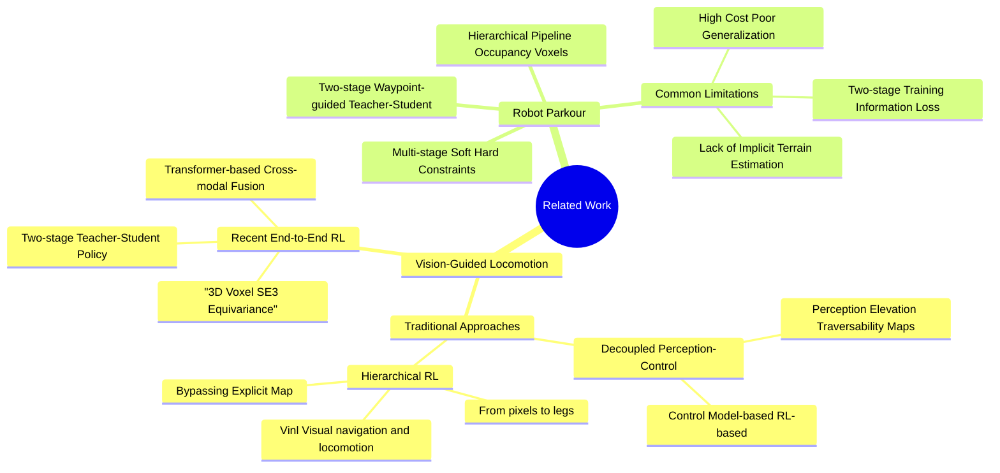

腿式机器人的跑酷问题在于：
- 外感受器的延迟和噪声无法应对一些边缘地带和摔倒情况
- 现有的两阶段训练范式使训练过程复杂化，IL存在信息丢失
- RL训练过程和奖励函数将多种行为无缝集成到神经网络比较麻烦

而这篇工作属于A+B，来源于下面的两篇：
| 参考文献 | 作者 | 来源 | 核心内容 | PIE 的关系 |
|---------|------|------|---------|-----------|
| **[3] Extreme Parkour with Legged Robots** | X. Cheng, K. Shi, A. Agarwal, 和 D. Pathak | arXiv 预印本，2023年 | 展示了四足机器人利用深度相机在具有挑战性的地形中进行"极端跑酷"的能力 | **改进点**： • PIE 指出，[3] 中的方法采用两阶段训练范式（先训练特权老师，再训练学生），这可能导致信息丢失和性能下降 • [3] 引入的路标（waypoints）需要根据地形手动指定，具有一定的局限性 |
| **[5] DreamWaQ: Learning Robust Quadrupedal Locomotion with Implicit Terrain Imagination via Deep Reinforcement Learning** | L. M. A. Nahrendra, B. Yu, 和 H. Myung | 2023 IEEE 国际机器人与自动化会议 (ICRA) | 提出了通过隐式地形想象（Implicit Terrain Imagination）来学习鲁棒的四足行走 | **借鉴点**： • PIE 借鉴了其**非对称 Actor-Critic 架构**，将两阶段训练简化为一阶段 • 在特征提取上，PIE 效仿了其使用 **VAE（变分自编码器）**结构来提取隐向量 $z_t$ 的方法 |

[3] (Extreme Parkour) 证明了使用低成本深度相机实现高性能跑酷的可行性 ，但也暴露了显式地形估计在面对边缘和延迟时的脆弱性 。

[5] (DreamWaQ) 提供了“隐式估计”的思路，即通过本体感知来推断地形 。

PIE 的创新之处在于将这两者结合，形成了双层显隐估计机制：既要 [3] 的视觉预判（显式），也要 [5] 的本体感知稳健性（隐式），以此推向更高的跑酷极限 。

### Related Work

#### Vision-Guided Locomotion
传统解耦方法：将问题拆分为感知（生成高度图或可通行地图）和控制（基于模型的控制或强化学习 RL）两个独立模块。这种解耦方式会导致信息丢失和系统延迟。

端到端学习方法：近年来，视觉引导的强化学习（RL）展现了更好的前景。

Agarwal 等人 [10]：设计了两阶段学习框架，学生策略通过模拟老师的特权信息来学习 joint angles。

Yang 等人 [11, 12]：利用 Transformer 结构融合本体感知和视觉输入，或使用 3D 像素（voxel）表征来精确理解地形。

#### Robot Parkour
重点在于如何在高度动态的情况下构建对环境的精确理解。
研究工作,核心方法,论文指出的局限性
Hoeller 等人 [1],分层导航流水线,占据体素（Occupancy voxels）可能不准确，训练成本高，扩展性低。
Zhuang 等人 [2],利用软/硬约束的多阶段方法,特权物理信息过度依赖模拟中的几何属性，难以处理非几何特征的地形。
Cheng 等人 [3],在老师策略中引入路标（Waypoints）指导学生,路标需要根据地形人工指定，限制了自动化程度。

#### Research Gaps

两阶段训练范式的弊端：上述工作大多采用“老师-学生”两阶段训练，这不仅增加了训练复杂度，还会导致部署时的信息损失和性能下降。

缺乏隐式估计：现有方法主要侧重于对地形的显式蒸馏（显式地形估计），缺乏对环境和自身状态的隐式推理，这限制了机器人的极限性能。

PIE 框架正是为了打破这些限制，通过单阶段端到端训练和双层显隐估计，在低成本硬件上实现了超越前作的跑酷表现。

### Methodology

**PIE 框架**包含三个子网络：**actor 网络**、**critic 网络**和**estimator 网络**。

为将两阶段训练范式简化为单阶段，采用了**非对称的 actor-critic 架构**：
- **Actor 网络**：仅接收部署期间可获取的本体感觉和外感受数据作为输入
- **Critic 网络**：可整合额外的特权信息，用于更精准的状态价值评估

优化过程包含两个并行部分：
1. **Actor-Critic 的优化**：采用**近端策略优化（PPO）**算法
2. **Estimator 的优化**：训练估计器网络

#### Policy Network (Actor)

**输入**：45 维本体感受观测 $o_t$（关节编码器 + **IMU** 实测，含身体角速度 $\omega_t$、重力向量 $g_t$ 等 6 类信息）+ 估计器输出（基速度 $\hat{v}_t$、足间隙 $\hat{h}_t^f$、编码高度图 $z_t^m$、latent 向量 $z_t$）

$$o_t = [\omega_t, g_t, c_t, \theta_t, \dot{\theta}_t, a_{t-1}]^T$$

**输出**：12 维关节动作 $a_t$（对应四足机器人 12 个关节）

#### Value Network (Critic)

**输入**：本体感受 $o_t$ + 特权信息（真实基速度 $v_t$、高度图扫描点 $m_t$）

$$s_t = [o_t, v_t, m_t]^T$$

**目的**：更精准评估当前状态价值，辅助 **actor** 网络优化

#### Action Space

12 维动作 $a_t$ 作为机器人**静止姿态** $\theta_{\text{stand}}$ 的**偏置（残差）**，最终目标关节角度为：

$$\theta_{\text{target}} = \theta_{\text{stand}} + a_t$$

**设计优势**：
- **稳定性**：叠加静止姿态 $\theta_{\text{stand}}$ 以保证稳定性，避免输出极端角度
- **学习效率**：网络只需学习相对于静止姿态的偏移量，而不是绝对角度，降低学习难度

#### Reward Function

| Reward | Equation ($r_i$) | Weight ($w_i$) |
|--------|------------------|----------------|
| Lin. velocity tracking | $\exp\{-4(v_{\text{cmd}}^{xy} - v^{xy})^2\}$ | 1.5 |
| Ang. velocity tracking | $\exp\{-4(\omega_{\text{cmd}}^{\text{yaw}} - \omega^{\text{yaw}})^2\}$ | 0.5 |
| Linear velocity ($z$) | $v_z^2$ | -1.0 |
| Angular velocity ($xy$) | $\omega_{xy}^2$ | -0.05 |
| Orientation | $\|g\|^2$ | -1.0 |
| Joint accelerations | $\|\ddot{\theta}\|^2$ | $-2.5 \times 10^{-7}$ |
| Joint power | $\|\tau\| \|\dot{\theta}\|$ | $-2 \times 10^{-5}$ |
| Collision | $-n_{\text{collision}}$ | -10.0 |
| Action rate | $(a_t - a_{t-1})^2$ | -0.01 |
| Smoothness | $(a_t - 2a_{t-1} + a_{t-2})^2$ | -0.01 |

**奖励设计说明**：
- **正向奖励**：聚焦速度跟踪（线速度权重 1.5、角速度 0.5）
- **惩罚项**：覆盖姿态偏移（$\|g\|^2$ 权重 -1.0）、碰撞（-10.0）、动作不平滑等
- **目标**：平衡敏捷性与稳定性

#### Estimator

核心任务是把原始传感器数据（深度图 + 本体感受）转化为策略网络（**Actor**）能直接用的 4 个关键向量（$\hat{v}_t$、$\hat{h}_t^f$、$z_t^m$、$z_t$），通过**双级隐式 - 显式估计**解决"深度相机噪声 / 延迟"和"单相机视野局限"问题，最终提升机器人对自身状态和环境的理解精度。

**1. 输入数据（时间序列数据，保证时序关联性）**

- **时间序列本体感受**：$o_t^{H_1}$，即最近 $H_1=10$ 个时刻的本体感受数据（拼接成向量）
- **时间序列深度图**：$d_t^{H_2}$，即最近 $H_2=2$ 个时刻的深度图像（堆叠在通道维度）

**2. 数据处理步骤（从原始数据到有效特征）**

- **特征提取**：用 **CNN（卷积神经网络）** 提取深度图的视觉特征，用 **MLP（多层感知机）** 提取本体感受的运动特征
- **跨模态融合**：用 **Transformer 编码器**把"当前 / 近期的视觉特征（深度图）+ 运动特征（本体感受）"做跨模态融合，但这些特征只包含"当下信息"，没有历史记忆
- **记忆补充**：因为机器人只有 1 个第一视角深度相机，看不到身体下方 / 后方地形，所以把 **Transformer** 输出的融合特征送入 **GRU（门控循环单元）**，利用 **GRU** 的时序记忆能力，把"过去的状态 / 地形信息"和"当下的融合特征"结合，生成"状态 + 地形记忆"—— 相当于让机器人"记住"之前走过的地形、自身的运动状态，从而推断出当前视野外（比如脚下、身后）的环境情况，弥补单相机的视野缺陷

**估计器的 4 个输出向量（Dual-Level Estimation）**

估计器的 4 个输出向量（$\hat{v}_t$、$\hat{h}_t^f$、$z_t^m$、$z_t$），按"两层标准"划分隐式 / 显式，既保证感知精度，又提升鲁棒性。这两级估计对应图中 **Estimator** 里的两个 **MLP Decoder** 和 **GRU** 直接输出的 4 个核心向量。

**第一级：按"对状态 / 环境的理解方式"划分（状态 / 地形理解层面）**

这一级是 **"从原始数据到'环境 / 自身状态'的理解方式"** 的双级划分：

- **显式估计（直接感知，对应蓝色 Decoder）**：$z_t^m$（编码高度图向量）
  - **流程**：**GRU** 输出的编码向量 $z_t^m$ → 蓝色 **MLP Decoder** → 重构出 $\hat{m}_t$（高度图）
  - **作用**：直接对"环境地形"做显式描述（相当于让机器人"看见"周围地形的高低分布），是对环境的显性感知

- **隐式估计（间接推断，对应红色 Decoder）**：$z_t$（纯潜在向量）
  - **流程**：**GRU** 输出的编码向量 $z_t$ → 红色 **MLP Decoder** → 重构出 $\hat{o}_{t+1}$（后续时刻的本体状态，比如下一时刻的关节角度、角速度）
  - **作用**：用 **VAE** 结构提取，不直接"看地形"，而是通过历史数据间接推断自身后续状态，从而隐含理解环境规律（比如预判台阶高度、提前调整姿态），是对环境的隐性感知

**第二级：按"向量本身的类型"划分（向量类型层面）**

这一级是 **"输出向量本身的类型"** 的双级划分，对应图中 **GRU** 直接输出的 4 个核心向量：

- **显式向量（物理实体）**：$\hat{v}_t$（估计的机器人基速度）+ $\hat{h}_t^f$（估计的足部与地面间隙）
  - **特点**：都是具体的物理量，直接服务于跑酷动作
    - $\hat{v}_t$：保证速度跟踪，保证机器人按指令速度移动（比如匀速跑、转弯）
    - $\hat{h}_t^f$：避免踩空，判断足部与地面的距离（比如在台阶边缘、间隙处）

- **隐式向量（编码压缩）**：$z_t$（latent 向量）+ $z_t^m$（编码高度图的向量）
  - **特点**：都是"编码后的潜在向量"，经过压缩降维，能过滤传感器噪声，同时携带环境 / 状态的隐式规律，是对显式信息的"补充与鲁棒化"，提升数据鲁棒性

**输出整合**

这两级估计的输出（$\hat{v}_t$、$\hat{h}_t^f$、$z_t$、$z_t^m$）会被送入 **Actor（策略网络）**，与"当前本体感受观测 $o_t$"结合，最终生成机器人的关节动作 $a_t$—— 相当于 **Estimator** 把"杂乱的原始传感器数据"转化为"策略网络能直接用的、兼顾精度与鲁棒性的决策依据"。

**损失函数**

估计器通过以下损失函数，让输出向量尽可能接近真实值：

$$\mathcal{L} = D_{KL}(q(z_t|o_t^{H_1},d_t^{H_2})\|p(z_t)) + \text{MSE}(\hat{o}_{t+1},o_{t+1}) + \text{MSE}(\hat{m}_t,m_t) + \text{MSE}(\hat{v}_t,v_t) + \text{MSE}(\hat{h}_t^f,h_t^f)$$

- **$D_{KL}$（KL 散度）**：约束 $z_t$ 的分布为标准正态分布，保证潜在向量的稳定性
- **MSE（均方误差）**：让"估计值"（如 $\hat{o}_{t+1}$、$\hat{m}_t$）与"真实值"（如 $o_{t+1}$、$m_t$）尽可能接近，校准估计精度

### Experiment

#### 仿真设置

- **平台**：采用 **Isaac Gym** 仿真环境，搭配 **NVIDIA Warp** 加速物理计算
- **硬件**：单张 **NVIDIA RTX 4090** 显卡
- **并行规模**：4096 个并行机器人环境，提升训练效率
- **训练效率**：20 小时内完成 10000 次迭代，覆盖跑酷地形的课程学习

**DEEP Robotics Lite3 四足机器人**：**体重**12.7kg；**大腿关节高度**：25cm（自身身高）；**体长**：约 33cm；**峰值膝关节力矩**30.5Nm

#### 训练策略

- **课程学习**：地形难度逐步提升
  - 间隙：0 → 1m
  - 台阶：0 → 0.75m
  - 楼梯：0 → 0.25m
  - 速度指令范围：线速度 [0.0, 1.5] m/s，角速度 [-1.2, 1.2] rad/s

- **领域随机化**：为提升仿真到真实的迁移性，随机化以下参数（部分关键项）：

| 参数 | 随机化范围 |
|------|-----------|
| 负载质量 | [-1, 2] kg |
| 质心偏移 | [-50, 50] mm |
| 地面摩擦系数 | [0.2, 1.2] |
| 系统延迟 | [0, 15] ms |

#### 消融实验（Ablation Study）

| 实验组别 | 间隙终止难度 | 楼梯终止难度 | 台阶终止难度 |
|---------|------------|------------|------------|
| **PIE（完整框架）** | 9.9 | 9.86 | 9.81 |
| **PIE w/o $\hat{o}_{t+1}$（隐式状态估计）** | 9.51 | 9.45 | 9.62 |
| **PIE w/o $\hat{h}_t^f$（足间隙估计）** | 7.41 | 7.36 | 3.09 |
| **PIE w/o $\hat{m}_t$（高度图估计）** | 9.75 | 4.25 | 1.67 |

**实验结果分析**：

- **双级估计组件缺一不可**：去掉任意组件后，性能均有明显下降
- **显式估计对复杂地形至关重要**：
  - 去掉足间隙估计 $\hat{h}_t^f$ 后，台阶终止难度骤降（9.81 → 3.09）—— 说明 $\hat{h}_t^f$ 是台阶穿越的核心依据
  - 去掉高度图估计 $\hat{m}_t$ 后，楼梯终止难度大幅下降（9.86 → 4.25）—— 说明 $\hat{m}_t$ 是楼梯攀爬的关键感知信息
- **隐式状态估计提升鲁棒性**：去掉 $\hat{o}_{t+1}$ 后性能小幅下降，说明其能补充环境隐式规律，提升任务稳定性

#### 室内实验：高难度地形穿越

测试 **PIE** 在"超自身比例地形"的表现（与现有方法对比）：

| 地形类型 | PIE 表现（Lite3） | 现有方法最优表现（如 Cheng et al. 2023） |
|---------|-----------------|----------------------------------------|
| 台阶高度 | 0.75m（3× 身高） | 2× 身高（Unitree A1，约 0.52m） |
| 间隙长度 | 1m（3× 体长） | 2× 体长（Unitree A1，约 0.67m） |
| 楼梯攀爬高度 | 0.25m（1× 身高） | 无明确数据（多数方法未支持） |

**结果**：**PIE** 在 10 次测试中成功率 **100%**，性能较现有方法提升 **≥50%**。

#### 室外实验：复杂场景鲁棒性

- **任务 1：2km 徒步**
  - **路线**：从浙江大学玉泉校区至老和山往返，海拔从 27m 升至 180m，含连续楼梯、陡坡、湿滑地面
  - **结果**：40 分钟无中断完成，未出现摔倒或卡顿

- **任务 2：夜间低光测试**
  - **场景**：在光照不足环境中跨越岩石、高台阶
  - **结果**：稳定完成动作，未受低光下深度相机噪声影响

