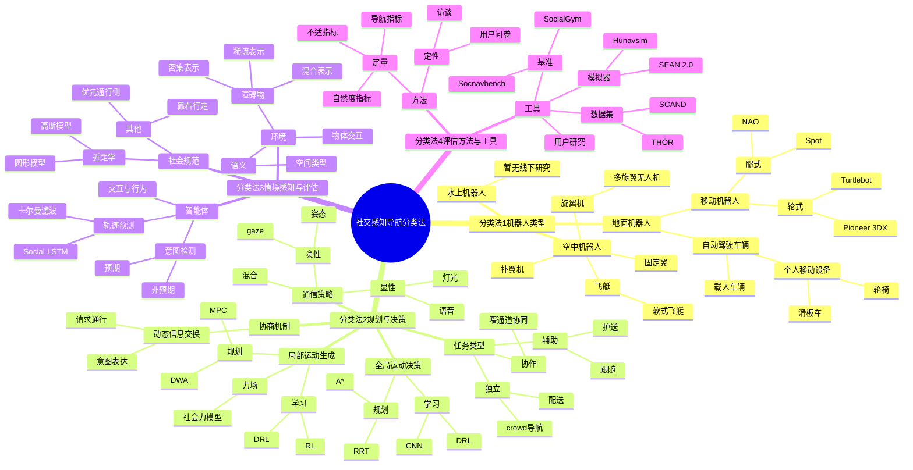

这些综述对我去写开题报告的文献综述也是有用的。这一篇主要是覆盖 2013-2024 的工作

## 预备知识

### Definition

### 导航定义

导航是**具身智能体**（机器人或人类）在环境中改变位置以达成目标的行为，过程中可能遇到其他共享该环境的智能体。

### 三类导航术语辨析

#### 1. Human-aware navigation（人类感知导航）

算法需专门考虑机器人附近人类的存在、活动及偏好，但不要求机器人表现出自然或社交行为。

- 它只强调"考虑到人"，但不假设机器人的行为必须表现得自然或符合社交规范
- 简单来说，只要机器人能避开人并尊重人的基本偏好（如不撞到人），就可以称之为 **Human-aware**

#### 2. Social navigation（社交导航）

整合人类互动时的社交规则、协议和角色，但存在无法区分人机社交行为与能力的表述风险。

- 这个词的风险在于，它在字面上很难区分机器人表现出的社交行为是由于其能力限制，还是在模仿人类的真实社交行为

#### 3. Socially aware navigation（社交感知导航）

强调在人类附近导航的社交属性，却不强制机器人社交行为与人类完全一致，因此本文选用该术语，相关智能体称为"**社交（导航）智能体**"。

- 这是一个更具包容性的定义，至少作者是这么认为的

### 社交感知机器人的核心属性

满足以下属性则可称具有"**社交感知**"能力：

1. **检测人类并将其视为特殊实体**，安全为首要优先级
2. **行为设计以最小化对人类的干扰、不适和困惑**为目标
3. **显性或隐性地表达自身导航意图**
4. **冲突时以社交方式解决**（可能牺牲自身任务），需理解人类意图与协商能力

**关键补充**：

- "**人类智能体**"含个体人类及人类控制的车辆/机器人
- 因人类意图受场景影响难预测，现有研究多聚焦前 **3 个属性**，而最低要求是满足前 **2 个属性**

> **BTW**，目前主流的中文翻译趋势是将 **Socially Aware** 翻译为"社会感知"或"社会意识"；而将 **Social Navigation** 翻译为"社交导航"

## Proposed Taxonomies

### Robot Types

随着配送、物流、自动化和服务领域的进步，各种类型的机器人被部署在人类环境中。虽然每种机器人类型都有共同规范，但也有区分它们的特定规范。这些特性影响了其社交感知导航策略的设计。

| 一级分类 | 二级分类 | 三级分类 | 定义 | 示例 |
| --- | --- | --- | --- | --- |
| **地面机器人 (Ground)** | **移动机器人 (Mobile Robots)** | **轮式机器人 (Wheeled Robots)** | 具有自主感知和移动能力的机器人，移动时不载人。轮式机器人指任何带轮子的移动机器人 | 差速驱动、全向轮、阿克曼转向等（如 Pioneer 3DX、Turtlebot） |
| | | **腿式机器人 (Legged Robots)** | 具有自主感知和移动能力的机器人，移动时不载人。腿式机器人指任何类型的腿式机器人 | 双足、三足、四足等（如 Spot、NAO） |
| | **自动驾驶车辆 (Autonomous Vehicles)** | - | 能够在人类环境中感知和移动，同时载人或运输人类乘客的自主系统。包括个人移动设备（**PMVs**） | 载人车辆、轮椅、滑板车等 |
| **空中机器人 (Aerial)** | **旋翼机 (Rotorcraft)** | - | 使用旋翼产生推力的机器人。包括单旋翼系统（如直升机）和多旋翼无人机 | 直升机、多旋翼无人机 |
| | **飞艇 (Aerostat)** | - | 比空气轻的飞行机器人，漂浮在空中并使用小型推进系统移动 | 软式飞艇、热气球 |
| | **固定翼 (Fixed Wing)** | - | 所有固定翼无人机 | 飞机、滑翔机 |
| | **扑翼机 (Flapping Wing)** | - | 所有使用鸟类或昆虫类型扑翼机制的"扑翼机"无人机 | 仿鸟/仿昆虫无人机 |
| **水上机器人 (Aquatic)** | - | - | 处理在水面或水下移动的机器人的社交感知导航的文章。目前尚未包含进一步分类，因为此类机器人尚无社交感知导航相关研究 | 暂无线下研究 |
### Planning and Decision-Making

此分类包括规划和运动决策，这是机器人导航的核心主题。与不同类型决策相关的其他特征也包含在此分类中，即任务类型、通信和协商策略。

| 一级分类 | 二级分类 | 定义 | 示例 |
| --- | --- | --- | --- |
| **通信策略 (Communication)** | **隐性 (Implicit)** | 接收者需要从隐性信号（如身体运动、姿态、力或注视）推断消息的通信形式 | 姿态、**gaze** |
| | **显性 (Explicit)** | 通过语音、视频或手势明确传达意图的通信形式 | 语音、灯光、手势 |
| | **混合 (Both)** | 使用隐性和显性通信形式混合的策略 | 同时使用多种通信方式 |
| **导航任务类型 (Types of Navigation Task)** | **独立 (Independent)** | 机器人执行社交感知导航且不紧密绑定任何人类的任务。行人被视为社交动态障碍，但不发生交互 | **crowd** 导航、配送 |
| | **辅助 (Assistive)** | 机器人或车辆为一个或多个人提供辅助或支持的导航任务。辅助可以通过多种方式提供，如跟随或陪伴某人，或采取运输服务的形式 | 跟随、护送、推轮椅、运行班车 |
| | **协作 (Collaborative)** | 机器人和人类智能体协作协调并成功导航通过复杂环境（如狭窄走廊或门口），需要合作努力和协调才能到达期望目的地 | 窄通道协同 |
| **协商机制 (Negotiation)** | - | 基于某种形式的动态信息交换来调整机器人导航的文章 | 请求通行、意图表达、不同形式的诱导 |
| **局部运动生成 (Local Motion Generation)** | **规划 (Planning)** | 依赖轨迹生成或前向仿真来获取机器人命令速度的方法 | **DWA**、**MPC**、**Elastic Bands** |
| | **力场 (Force)** | 依赖势场和物体力来为机器人生成速度命令的方法 | **社会力模型**、**Artificial Potential Fields** |
| | **学习 (Learning)** | 使用数据和/或学习模型直接从观察（或输入）生成速度命令的方法 | **RL**、**DRL** |
| | **其他 (Others)** | 无法归入上述策略的任何其他方法 | - |
| **全局运动决策 (Global Motion Decision-Making)** | **规划 (Planning)** | 使用几何或形式规划方法的方法 | **A***、**RRT** |
| | **学习 (Learning)** | 数据驱动和/或使用学习模型的方法 | **DRL**、**CNN** |

### Situation Awareness and Assessment

此分类涵盖情境感知，遵循 Ensley (1995) 的定义："在时间和空间范围内感知环境中的元素，理解其含义，并预测其在不久的将来的状态"。由于"理解"一词的含义在涉及机器人时存在争议，此分类将主要关注为社交感知导航目的而建模的智能体和其他项目的状态表示和预测。这包括与环境物理元素相关的其他方面，以及涉及社交感知导航并可能影响决策的无形元素，如社会规范。

| 一级分类 | 二级分类 | 定义 | 表示方式/示例 |
| --- | --- | --- | --- |
| **环境 (Environment)** | **语义 (Semantics)** | 考虑与社交感知导航发生区域类型或目的相关的信息的方法 | 空间类型 |
| | **物体交互 (Object Interactions)** | 考虑人-物体或机器人-物体关系的方法 | 物体交互关系 |
| | **障碍物 (Obstacles)** | 表示不可用于导航的空间区域的方法，无论表示是纯度量（如占用网格）、符号还是混合 | 密集表示、稀疏表示、混合表示 |
| | **其他 (Others)** | 除上述之外的环境其他方面 | - |
| **智能体 (Agents)** | **轨迹预测 (Trajectory Prediction)** | 使用未来人体姿态估计的方法 | **Social-LSTM**、**卡尔曼滤波** |
| | **交互与行为 (Interactions and Actions)** | 考虑行为表示和使用，以及人-人和人-机器人交互的方法 | 交互与行为表示 |
| | **意图 (Intentions)** | 使用或检测智能体意图以进行社交感知导航的方法 | 预期、非预期 |
| | **其他 (Others)** | 可用于导航的智能体其他方面 | - |
| **社会规范 (Social Norms)** | **近距学 (Proxemics)** | 考虑社交距离而不仅仅是碰撞避免的方法 | 圆形模型、高斯模型 |
| | **其他 (Others)** | 包括人类导航中其他常用约定的方法 | 靠右行走、优先通行侧 |

### Evaluation and Tools

此分类考虑用于评估社交感知导航方案的策略。用于评估机器人行为的各种评估方法，以及支持或评估所需的工具都包含在此分类中。

| 一级分类 | 二级分类 | 定义 | 示例 |
| --- | --- | --- | --- |
| **方法 (Methods)** | **定性 (Qualitative)** | 使用数值/非数值数据并使用主观或比较分析进行评估的方法 | 用户问卷、访谈 |
| | **定量 (Quantitative)** | 使用数值数据并基于客观分析（基于指标或基准）进行评估的方法 | 导航指标、不适指标、自然度指标 |
| **工具 (Tools)** | **模拟器 (Simulators)** | 提出新模拟器或策略以改进模拟中的人-机器人导航交互的文章 | **SEAN 2.0**、**Hunavsim** |
| | **数据集 (Datasets)** | 提出可以推进社交感知导航的新数据集的文章。可以是人-机器人导航数据或丰富的人-人交互数据形式 | **SCAND**、**THÖR** |
| | **用户研究 (Studies)** | 包含在野外或受控空间中进行用户研究的文章，分析人-机器人交互，可用于改进社交感知导航 | 用户研究 |
| | **指标和基准 (Metrics and Benchmarks)** | 提出新指标或基准的文章 | **SocialGym**、**Socnavbench** |

## Planning and Decision-Making
**社交感知机器人**的"规划与决策"不仅包含经典技术（**局部运动生成**、**全局运动技术**），还涵盖 **3 个关键影响因素**：**通信**、**导航任务类型**（协作/辅助/独立）、**协商**，核心目标是让机器人在人类环境中（如拥挤区域、护送场景）兼顾**安全性**、**效率**与**社交适配性**。

- **局部运动生成**：靠传感/感知生成轨迹/速度指令（如避障时的实时速度调整）
- **全局运动决策**：依赖大范围空间表征制定整体路径/决策（如从 A 到 B 的最优路线规划）
- **双向通信与协商是核心**：人机需相互理解意图，才能实现无缝协作或自主导航，**149 篇**相关方法论文均符合该框架

### Communication

即**人机交互**。核心是"**人机双向理解意图**"，直接影响导航**安全**与**舒适度**，分为**显性通信**和**隐性通信**两类：

| 通信类型 | 核心定义 | 具体方式 | 典型研究案例 | 优势与局限 |
| --- | --- | --- | --- | --- |
| **显性通信** | 通过明确信号传递意图，易被直接理解 | 口头（语音）、视觉（文字/灯光/手势/显示屏） | 1. 无人机用 **LED** + 手势确认人类存在（Jensen et al. 2018） 2. 移动机器人靠语音清路（Dugas et al. 2020） 3. 轮椅通过头部运动解读用户意图（Rios-Martinez et al. 2012） | **优势**：决策场景中精准高效（如复杂路口沟通） **局限**：需额外硬件（**LED**/屏幕），依赖明确场景 |
| **隐性通信** | 通过自然线索间接传递意图，无需刻意表达 | 机器人姿态、运动趋势、**gaze（视线）** | 1. 机器人提前展示避让意图（走廊穿行，Khambhaita et al. 2017） 2. 靠运动模式传递让行意图（过门场景，Hetherington et al. 2021） | **优势**：交互更自然，适配低挑战环境 **局限**：机器人难解读复杂线索，易误判，相关研究较少 |

#### 当前挑战

- 多数研究仅聚焦一种通信类型，缺乏对"**显性 + 隐性结合**"的探索
- 机器人难以像人类一样通过肢体语言/面部表情传递共情等非语言信号，影响人机信任建立
- **隐性通信**在复杂决策场景（如拥挤路口协商）的应用仍不成熟

### Type of Navigation Task
导航任务的核心分类依据是**人机交互模式**与**目标一致性**：

- **协作型**：目标共建（人机同目标），需双向沟通
- **辅助型**：目标服务（机器人服务人类目标），单向辅助
- **独立型**：目标独立（机器人自有目标），无直接交互

| 任务类型 | 核心定义 | 人机交互特点 | 核心技术方法 | 典型应用场景 | 关键挑战 |
| --- | --- | --- | --- | --- | --- |
| **协作型（Collaborative）** | 人机共享同一导航目标，需共同配合完成 | 主动沟通、双向协作，目标一致 | 1. **基于规则**：预定义社交规范（如避障优先级） 2. **基于学习**：**强化学习（RL）**、**深度学习（GCN）** 建模交互 | 窄通道共行、协作搬运、多人陪同 | 1. 精准建模人类意图 2. 动态调整行为适配人类 3. 需大量训练数据（学习方法） |
| **辅助型（Assistive）** | 机器人协助人类完成导航，无需人类主动配合 | 单向辅助、人类被动接受，目标为人类需求 | 1. **深度学习**：生成自然语言指令 2. **强化学习**：适配动态环境（如人群、障碍物） | 自主轮椅、行人跟随、城市导航指引 | 1. 解读人类隐性需求 2. 适配复杂城市场景 3. 平衡辅助效率与舒适度 |
| **独立型（Independent）** | 机器人自主导航，无直接人机交互 | 无主动交互，人类仅为"社交动态障碍物" | 1. 人群轨迹预测（**Social-LSTM**） 2. 防冻结策略、高级避障算法 | 仓库配送、拥挤人群穿梭、无人配送 | 1. 适配多元文化/社交环境 2. 多模态感知融合 3. 保障安全与隐私 |

#### 协作型任务重点

- **两种核心方法**：
  - （1）**基于规则**（如工厂机器人按预设路线协作，可预测性强但适应性弱）
  - （2）**基于学习**（如 **RL** 通过试错学习最优协作路径，适配动态环境但需大量数据）
- **典型案例**：机器人与人类共同穿过狭窄走廊（Khambhaita and Alami, 2017）、协作完成搬运任务（Kollmitz et al., 2020）

#### 辅助型任务重点

- **技术核心是 AI 赋能**：**深度学习**生成个性化导航指令（如"左转 50 米后过马路"），**强化学习**适配突发场景（如行人突然变向）
- **典型案例**：自主轮椅避开人群（Morales et al., 2017）、室内机器人跟随老人并避障（Yao et al., 2019）

#### 独立型任务重点

- **核心策略**：预测子目标（Narayanan et al., 2018）、防冻结（Sathyamoorthy et al., 2020）、多模态通信清路（Dugas et al., 2020）
- **典型案例**：仓库机器人自主分拣（Guldenring et al., 2020）、城市配送机器人穿梭人群（Chen et al., 2020）

### Negotiation
导航场景下的"**协商**"，是指机器人与人类、其他机器人等实体通过**动态交互**与**信息交换**，协调动作、解决潜在冲突（如路径占用、通行优先级），最终实现**高效**、**安全**移动的过程——既包括"请求穿过拥挤区域"这类简单动作，也涵盖平衡多目标（如自身任务效率 + 人类舒适度）的复杂决策。

| 类型 | 核心定义 | 具体表现 | 典型案例 |
| --- | --- | --- | --- |
| **显性协商（Explicit）** | 通过明确信号传递意图、发起沟通 | 请求通行权限、清晰展示导航计划、主动征求反馈 | 1. 机器人生成人机共同路径并供人类确认（Dalmasso et al. 2021，基于 **MCTS** 算法） 2. 用蜂鸣提示人类让路（Nishimura and Yonetani 2020） |
| **隐性协商（Implicit）** | 不直接沟通，通过检测意图动态调整行为 | 感知人类避让趋势后减速、根据交互历史适配策略 | 1. 用最小模型解读人类意图并调整动作（Hsu et al. 2020） 2. 拥挤场景中通过接触式诱导达成通行（Shrestha et al. 2015） |

### 核心特征

机器人需**双向适配**：

1. 解读协商对象（如行人）的需求与动机
2. 清晰传达自身目标与约束（如"需优先送达快递"）

**两大核心特征**：

- **自适应**：协商是"双向互动"，机器人需根据场景线索（如人类停留、突然变向）动态调整策略（Trautman et al. 2015；Bera et al. 2018）
- **多目标**：不仅解决冲突（如路口会车），还需协调资源（如与其他机器人共享通道）、平衡效率与社交适配性（Evens et al. 2022）

### 典型研究方向

| 研究方向 | 核心方法 | 文献案例 |
| --- | --- | --- |
| **算法支撑协商** | 用规划算法（如 **MCTS**）、空间推理技术搭建协商框架 | Dondrup and Hanheide (2016)：定性空间推理 Vega et al. (2019)：动态环境协商规划 |
| **意图编码与解读** | 构建模型捕捉人类意图，让协商动作更精准 | Hsu et al. (2020)：最小模型编码人类意图 Chen et al. (2020)：图策略预测人类行为辅助协商 |
| **自适应协商策略** | 基于用户偏好、交互历史调整协商方式 | Bera et al. (2018)：社交自适应框架 Ratsamee et al. (2013)：持续学习适配协商行为 |

### Local Motion Generation
**局部运动生成**是机器人导航的低层级核心技术，基于局部传感与感知（如 **LiDAR**、视觉传感器），直接生成轨迹或速度指令，指导机器人实时避障、适配环境动态（如行人移动），核心目标是兼顾**安全性**、**实时性**与**社交适配性**（Boldrer et al. 2022）。

| 分类 | 核心逻辑 | 关键方法 | 典型案例 | 优势与局限 |
| --- | --- | --- | --- | --- |
| **基于规划的方法（Planning-based）** | 先生成可执行轨迹，再转换为速度指令，适配复杂动态环境 | 1. **模型预测控制（MPC）**：有限时间域内优化轨迹（考虑运动学/动力学约束） 2. **动态窗口法（DWA）**：生成可达速度集，选最优避障速度 3. **弹性带（Elastic Bands）**：模拟弹性带平滑路径，绕障伸缩 4. **动态避障技术**（如加速度障碍、广义速度障碍） | 1. **MPC**：Che et al. 2020（结合显性通信生成运动） 2. **DWA**：Dondrup et al. 2016（优化人类接受度） 3. **弹性带**：Khambhaita et al. 2017（定时弹性带处理人机协作场景） 4. **避障**：Gonon et al. 2022（加速度障碍适配人群导航） | **优势**：逻辑清晰、可解释性强 **局限**：复杂环境下计算成本可能升高 |
| **基于力的方法（Force-based）** | 基于"吸引力 + 排斥力"生成速度指令，模拟自然交互 | 1. **人工势场（APF）**：目标产生吸引力，障碍物产生排斥力 2. **社会力模型（SFM）**：融合人机/人人交互力（如行人相对速度产生的排斥力） | 1. **APF**：Araujo et al. 2015（办公室动态环境导航） 2. **SFM**：Ferrer et al. 2013（拥挤环境导航）、Garrell et al. 2017（空中机器人陪伴的"空中社会力模型"） | **优势**：实时性好、实现简单 **局限**：易陷入局部最优（如 **APF**），需适配社交规则 |
| **基于学习的方法（Learning-based）** | 无需精确轨迹，直接通过数据驱动生成速度指令 | 1. **强化学习（RL/DRL）**：试错学习最优策略（如人群交互、避障） 2. **模仿学习**：克隆人类/专家行为（如无人机飞行） 3. **深度学习**：直接建模环境-速度映射 4. **逆强化学习**：从人类行为中提炼奖励函数 | 1. **DRL**：Chen et al. 2020（捕捉人群交互）、Guldenring et al. 2020（仓库避障的 **ROS** 规划器） 2. **模仿学习**：Garrell et al. 2019（无人机陪伴人类） 3. **逆强化学习**：Ramirez et al. 2016（机器人合理接近人类） | **优势**：适配复杂社交场景、能捕捉交互细节 **局限**：需大量训练数据、可解释性弱 |
| **其他方法（Others）** | 不归属上述三类，聚焦特殊场景需求 | 1. 飞行机器人安全感知框架 2. 社交线索建模（贝叶斯人格特质模型） 3. 防冻结控制器（碰撞后速度调制） 4. 行人密度适配速度控制器 | 1. Yoon et al. 2019（飞行机器人人机安全交互） 2. Bera et al. 2017（预测人类轨迹与社交距离） 3. Paez-Granados et al. 2022（避免机器人碰撞后停滞） 4. Jiang et al. 2022（自动驾驶车辆的行人密度适配） | **优势**：针对性解决特殊问题 **局限**：通用性较弱 |

#### 方法特点与趋势

- **方法融合趋势**：部分研究结合多类方法，如 Gil et al. 2021（**SFM+DRL**）、Qiu et al. 2022（监督学习 + **DRL**），平衡性能与社交适配性
- **应用场景侧重**：
  - **基于规划的方法**适配协作/辅助任务（如人机共行）
  - **基于力的方法**适配独立任务（如仓库导航）
  - **基于学习的方法**适配复杂人群场景
- **核心目标**：除了避障，需满足社交规则（如**近距学**），避免"**机器人冻结**"（Sathyamoorthy et al. 2020）、提升人类舒适度

### Global Motion Decision-Making

**全局运动决策**是**社交感知导航**的高层级规划技术，核心是在粗粒度层面计算机器人的有效轨迹——需兼顾社交导航需求（如人类舒适度、旁观者需求）、碰撞避免，依赖环境全局表征（而非即时传感），与依赖传感器和周边环境的"**局部运动决策**"形成互补（前者定整体路线，后者管实时调整）。

#### 全局运动决策 vs 局部运动决策

| 维度 | 全局运动决策 | 局部运动决策 |
| --- | --- | --- |
| **决策粒度** | 粗粒度（整体路径规划） | 细粒度（实时速度/轨迹指令） |
| **依赖信息** | 环境全局表征（全局地图） | 即时传感数据（**LiDAR**、视觉） |
| **核心目标** | 确定高效、符合社交规则的整体路线 | 避障、适配动态环境（如行人移动） |
| **典型应用** | 从 A 到 B 的最优路径规划（含社交偏好） | 狭窄通道实时避让、人群中微调方向 |

#### 方法分类

| 方法类型 | 核心逻辑 | 关键技术/算法 | 典型案例 | 优势与局限 |
| --- | --- | --- | --- | --- |
| **基于规划的方法（Planning-based）** | 通过搜索或采样生成初始路径，适配全局约束 | 1. **搜索类**：**A***、**D***、**Dijkstra**、扩散映射 2. **采样类**：**PRM**（概率路线图）、**RRT**（快速探索随机树）、**Risk-RRT**、**PRM-RRT**、快速行进法 | 1. **A***：Luo et al. 2018（自动驾驶车辆路径规划） 2. **RRT**：Shrestha et al. 2015（拥挤环境协作导航） 3. **Risk-RRT**：Narayanan et al. 2018（行人感知导航） | **优势**：可解释性强、适配明确社交规则 **局限**：动态环境（如突发障碍）适应性弱 |
| **基于学习的方法（Learning-based）** | 数据驱动训练模型，预测未来状态或决策，生成初始路径/子目标 | 1. **深度强化学习（DRL）** 2. **深度学习**（如 **CNN**） 3. **逆强化学习** | 1. **DRL**：Brito et al. 2021（动态环境子目标选择） 2. **CNN**：Pérez-Higueras et al. 2018（人类感知路径规划） 3. **逆强化学习**：Vasquez et al. 2014（从人类行为提炼社交规则） | **优势**：能学习复杂社交模式、适配新场景 **局限**：需大量训练数据、泛化性弱、可解释性差 |

#### 主要挑战与应对方案

**主要挑战**：机器人难以适应动态环境（如突然出现的行人）或意外障碍（Repiso et al. 2020）。

**应对方案**：

1. **融入实时反馈/传感数据**：提升全局规划的动态适配性（Peddi et al. 2020）
2. **全局 + 局部地图融合**：全局地图提供宏观视角，局部地图捕捉细节，平衡效率与适应性（Singamaneni et al. 2022）
3. **持续重规划**：动态调整全局路径，应对环境变化（Korkmaz 2021）

#### 其他研究方向与选择策略

- **除两大主流方法外，部分研究关注**：环境表征优化（Arndt and Berns 2015）、社交线索融入、多模态传感/通信整合（Che et al. 2020）、**Wizard-of-Oz** 研究（模拟人类控制优化决策逻辑）
- **方法选择依赖任务需求**：
  - 固定场景（仓库）选**基于规划的方法**
  - 复杂动态场景（城市人群）可考虑**基于学习的方法**
- **核心价值**：为**局部运动决策**提供"初始路线/子目标"，确保整体导航既高效又符合社交规范（如优先选择人类舒适度高的路径）

## Situation Awareness and Assessment

多数研究会涉及 “环境、智能体、社会规范” 三大分支，但无研究覆盖全部；其中最受关注的三大方向是：环境障碍物、智能体轨迹预测、近距学约束（社会规范核心）。

### Environment
"**环境**"分类聚焦机器人导航的物理空间要素（不含人类/其他智能体），包括**环境语义**、**物体交互**、**障碍物**、**其他**（如人群密度）四个子项，核心影响机器人对空间的理解与导航策略适配。

| 子项 | 核心定义 | 研究特点 | 典型案例 |
| --- | --- | --- | --- |
| **环境语义（Semantics）** | 导航空间的"类型/用途/上下文"信息（如办公室、走廊） | 研究较少，多为特定场景适配 | 1. Banisetty et al. 2021：上下文分类模块（**4 类场景**）指导社交目标选择 2. Renault et al. 2019：语义地图标记"可移动障碍物禁忌区" 3. Hsu et al. 2020：用语义信息预测行人意图（如过马路） |
| **物体交互（Object Interactions）** | 人类-物体、机器人-物体的关系（如人类挡门、使用物品） | 多建模"禁止穿越区域"，部分预测人类目标 | 1. Lobato et al. 2019：将交互区建模为对称梯形 2. Truong et al. 2017：用圆形区域标记需避让的物体交互空间 3. Bruckschen et al. 2020：通过人类-物体交互预测人类导航目标 4. Vega et al. 2019：针对"人类挡门"场景，机器人主动请求通行 |
| **障碍物（Obstacles）** | 物理空间中阻碍导航的实体（不含人类/智能体） | 最受关注的子项，分 **3 种表征方式** | 见下文"障碍物三大表征方式" |
| **其他（Others）** | 上述子项未覆盖的环境属性 | 研究极少（仅 **4 篇论文**） | 1. 人群密度：Pérez-Higueras et al. 2018（适配导航策略） 2. 通道/网关：Johnson and Kuipers 2018（纳入导航地图） |

#### 障碍物三大表征方式

| 表征类型 | 核心定义 | 常用方法 | 优势与局限 | 典型案例 |
| --- | --- | --- | --- | --- |
| **密集表征（Dense）** | 用度量地图（如占据栅格、代价地图）标记"不可通行区域"，不区分单个障碍物 | **占据栅格（Occupancy Grids）**、**代价地图（Cost Maps）** | **优势**：应用最广、适配复杂环境 **局限**：无法识别单个障碍物属性 | 主流社交导航算法（如仓库机器人避障） |
| **稀疏表征（Sparse）** | 每个障碍物作为独立实体，仅关注核心属性（位置、尺寸），多假设为圆形 | 圆形障碍物建模 | **优势**：计算简单、实时性好 **局限**：精度较低，适配简单场景 | Ferrer et al. 2013（拥挤环境导航）、Bera et al. 2018（社交避障） |
| **混合表征（Hybrid）** | 结合密集与稀疏模型，分别适配不同需求（如密集建模整体空间，稀疏标记关键物体） | 栅格 + 符号图、**2D 度量地图** + 可移动障碍物迭代 | **优势**：平衡精度与效率 **局限**：实现复杂 | 1. Lobato et al. 2019：符号图（稀疏）标记物体节点 + 密集模型标记占用空间 2. Renault et al. 2019：**2D 度量地图**（密集）生成初始路径 + 迭代优化可移动障碍物（稀疏） |

#### 当前挑战与未来方向

- 无障碍物的导航算法仅适用于简单场景（如模拟环境中仅需避人，Nishimura and Yonetani 2020）
- 部分障碍物感知算法仅用"实时传感数据"（如 **LiDAR** 瞬时信息），不整合历史数据（de Vicente and Soto 2021）
- **环境语义**、**物体交互**的研究仍较薄弱，未来需更多结合场景上下文优化导航策略

### Agents

"**智能体（Agents）**"是**情境感知与评估**的核心分支，核心定义：不仅指人类，还涵盖所有"涉及人类的活跃实体"（如自动驾驶场景中的其他车辆），分类聚焦智能体的"非基础姿态表征"——忽略位置、朝向等通用属性，重点关注**轨迹预测**、**交互与行为**、**意图**、**其他属性**四大子项，其中**轨迹预测**是最受关注的方向。

| 子项 | 核心定义 | 主流研究方法 | 典型案例 |
| --- | --- | --- | --- |
| **轨迹预测（Trajectory Prediction）** | 基于智能体历史位置、环境信息，估算其未来位置/运动轨迹 | 1. **学习型方法**：**RNN/Social-LSTM**（Alahi et al. 2016）、混合密度网络（Eiffert et al. 2020） 2. **简单传统方法**：假设匀速直线运动（Guzzi et al. 2013）、平均速度估算（Carretero 2017） 3. **复杂传统方法**：**卡尔曼滤波**（Truong et al. 2018）、概率模型（Bera et al. 2019）、**社会力模型**（Boldrer et al. 2022） 4. **结合额外信息**：转向指示（Unhelkar et al. 2015）、人类意图（Park et al. 2016）、关系图模型（Chen et al. 2020） | 1. **Social-LSTM**：联合预测场景中所有人的轨迹（Alahi et al. 2016） 2. 自动驾驶场景：结合 **SFM** 的行人轨迹预测（Prédhumeau et al. 2021） 3. 目标位置预测：替代轨迹预测（Bruckschen et al. 2020） |
| **交互与行为（Interactions and Actions）** | ① **交互**：智能体间"有意的联合行动"（区分人机交互、人人交互） ② **行为**：智能体当前活动状态（如坐/站/交谈） | 1. **交互检测**：人群聚类（Vega-Magro et al. 2017）、**F-formation** 图割（Truong et al. 2017）、**GCN** 计算交互特征（Chen et al. 2020） 2. **行为适配**：根据人类活动调整机器人路径（Mateus et al. 2019） | 1. 人人交互：识别面对面站立的两人（Manso et al. 2019） 2. 人机交互：检测人类是否可能阻碍机器人（Park et al. 2016） 3. 行为适配：避开交谈中的人群（Charalampous et al. 2016） |
| **意图检测（Intentions）** | 识别智能体的行动目的，分"**预期意图**"（常规场景，如过马路）和"**非预期意图**"（异常场景，如阻碍机器人） | 1. **预期意图检测**：合作倾向估算（Kabtoul et al. 2020）、过马路意图预测（Chandra et al. 2020） 2. **意图信号解读**：避让偏好识别（Mavrogiannis et al. 2018） 3. **模拟预测**：通过政策模拟推导意图（Cunningham et al. 2019） | 1. 自动驾驶：预测车辆是否愿意让行（Evens et al. 2022） 2. 移动机器人：检测人类是否愿意配合通行（Skrzypczyk 2021） |
| **其他属性（Others）** | 除上述外，影响导航的智能体特征（人格、情绪、利他性等） | 1. **心理属性**：人格特质估算（Bera et al. 2017）、情绪检测（Bera et al. 2019） 2. **社会属性**：利他主义（Toghi et al. 2021）、合作倾向（Toghi et al. 2022） 3. **几何/动作属性**：手势（Truong et al. 2017）、朝向（视线范围代理，Ratsamee et al. 2013） | 1. 情绪适配：机器人根据人类情绪调整行为（Jiang et al. 2016） 2. 自动驾驶：考虑其他车辆的利他行为（Toghi et al. 2021） |

#### 轨迹预测的核心趋势

- **学习型方法**（如 **Social-LSTM** 及其变体）因能捕捉人群交互，成为主流
- 部分研究不预测完整轨迹，仅预测目标位置（如人类要去的路口），简化计算（Ferrer et al. 2017）
- **简单方法**（假设匀速）仍用于低复杂度场景（如模拟环境），但真实场景需结合额外信息（如意图、转向）

#### 交互的定义澄清

文本明确"**交互**"≠"相互影响"（如**社会力模型**中的动态干扰），而是"**有意的联合行动**"（如两人协作开门、人类配合机器人通行）。

#### 意图检测的局限

现有研究仅覆盖"**预期意图**"，"**非预期意图**"（如人类故意阻碍、破坏）尚无相关论文，是未来空白。

#### 其他属性的价值

虽研究较少，但能提升社交适配性——如机器人根据人类情绪（开心/烦躁）调整避让距离（Bera et al. 2019），根据朝向判断视线范围（避免从背后突然接近）。

### Social Norms
**社会规范**是**情境感知与评估**的核心分类之一，核心目的是让机器人导航符合人类社交习惯，避免不适，分为两大分支：**近距学（Proxemics）**（绝大多数研究的核心）和**其他社会规则（Other Social Rules）**

#### 核心分支 1：近距学（Proxemics）—— 个人/群体空间建模

**近距学**是**社交导航**的核心基础，指机器人对"人类个人空间/群体交互空间"的建模，避免入侵人类舒适距离，主要有两种建模方式，且可结合额外因素优化：

| 建模方式 | 核心定义 | 典型案例 | 优势与特点 |
| --- | --- | --- | --- |
| **均匀圆形区域（Uniform Circular Area）** | 以人类为中心，划定固定半径的圆形"禁止穿越区"，所有方向舒适距离一致 | Bruckschen et al. 2020、Qiu et al. 2022 | 实现简单、计算高效，适配通用场景 |
| **高斯函数（Gaussian Functions）** | 用高斯分布建模，距离人类越近，"不适度"越高（非固定阈值），可灵活融入多因素 | 1. **基础应用**：Lobato et al. 2019、Singamaneni et al. 2021 2. **结合相对速度**：Chen et al. 2020（方差与人类速度成正比） 3. **结合性别/社会关系**：Patompak et al. 2016（区分熟人/陌生人、男女） 4. **结合人类状态**：Truong et al. 2018（坐/站/移动、物体交互） | 适配复杂场景，更贴合人类真实舒适感知 |

##### 近距学在运动状态调节中的应用

除了"避区划定"，**近距学**还用于调节机器人运动状态：

- **核心逻辑**：根据与人类的距离限制/调制机器人速度（距离越近，速度越慢）
- **作用**：提升人类安全感，解决"**机器人冻结**"问题（复杂场景中停滞不前）
- **典型案例**：Garrell et al. 2017（空中机器人陪伴）、Teja S. and Alami 2020（人机共行）

##### 群体空间建模

**高斯函数**还可扩展到人类群体，建模"群体交互空间"（如交谈群体的专属区域），典型案例：Rios-Martinez et al. 2012、Vega-Magro et al. 2017。

#### 核心分支 2：其他社会规则（Other Social Rules）

除**近距学**外，适配人类特定社交习惯的规则，覆盖场景更具体，典型类型如下：

| 规则类型 | 核心定义 | 典型案例 |
| --- | --- | --- |
| **通行侧规范** | 沿导航区域特定侧行走（如靠右），或从人类偏好侧通行（如左侧） | 1. **固定侧行走**：Cunningham et al. 2019、Mateus et al. 2019 2. **偏好侧通行**：Dondrup et al. 2016、Chen et al. 2017 |
| **运动稳定性规范** | 避免不规则运动（如 **zigzag**），提升机器人行为可预测性 | Morales et al. 2017（自动驾驶车辆防 **zigzag**） |
| **方向约束规范** | 惩罚"人机对向直行"等易冲突运动 | Khambhaita et al. 2017（图优化规划，规避对向运动） |
| **群体交互规范** | 融入"群体实体性（**entitativity**）"，提升多机器人系统的"社交隐身性"（不干扰人类群体） | Bera et al. 2018（多机器人导航） |
| **意图沟通规范** | 遵循"交叉意图沟通"的社交礼仪 | Hsu et al. 2020（路口交叉时的意图传递规则） |
| **人群适配规范** | 针对不同人群（年龄、关系）调整规则 | 1. **年龄适配**：Kästner et al. 2022（儿童/成人/老人） 2. **关系适配**：Patompak et al. 2016（熟人/陌生人） |
| **访谈衍生规范** | 基于人类访谈数据提炼的个性化社交规则 | Shahrezaie et al. 2022（通过访谈定义机器人社交行为） |

#### 总结与趋势

- **近距学**是**社交导航**的"基础标配"，绝大多数方案都会包含（原文强调"vast majority"），而**其他社会规则**是"场景化补充"
- **近距学建模**的趋势是"从简单圆形到复杂高斯函数"，且越来越多研究融入额外因素（情绪：Bera et al. 2019；场景：Lu et al. 2013），提升适配性
- **社会规范**的核心价值是"降低人类不适、提升机器人接受度"，而非仅满足避障等基础需求
- **其他社会规则**的研究更关注"文化/场景/人群差异"，是未来**社交导航个性化**的关键方向

## Evaluation

### Methods
由于**社交感知导航**具有主观性和多面性（如人类舒适度、信任度难以统一衡量），评估需结合两种互补方法——**定性**（非数值分析）和**定量**（数值化客观分析）。

#### 定性评估（Qualitative Method）

##### 核心定义

用非数值数据分析机器人的社交行为与导航表现，聚焦"人类感知与交互细节"，无客观量化标准，以主观推断为主。

##### 核心做法与案例

| 做法类型 | 具体方式 | 典型案例 |
| --- | --- | --- |
| **行为轨迹分析** | 系统分析机器人/人类的路径、轨迹、速度曲线，结合模拟/真实场景截图，对比不同导航方案 | Khambhaita and Alami 2017（用截图对比 **3 种规划系统**的优势）；Qian et al. 2013（分步解析导航场景细节） |
| **用户研究** | 通过问卷（如 **Godspeed 量表** + **李克特评分**）、访谈收集人类反馈，分析舒适度、预期、感知 | 1. **问卷**：Lichtenthäler et al. 2012（用 **ANOVA** 分析问卷数据） 2. **访谈**：Duncan and Murphy 2013（调研无人机与人类的舒适距离） |

##### 适用场景、优势与局限

- **适用场景**：导航标准未明确的开发初期（如新型社交机器人），或需捕捉"人类主观体验"的场景
- **优势**：能挖掘细微交互细节（如机器人转向对人类的影响），为设计提供直观洞察
- **局限**：主观性强、难以复制，需组织真实人类实验，成本较高
- **数据支撑**：约一半论文采用，其中 **33 篇**包含用户研究
| Metric Type | Metrics |
| --- | --- |
| Navigation | success, efficiency, collisions, time to reach the goal (or completion time), distance traveled (or path length), velocity and acceleration ( Chen et al. 2017 , 2019 ; Bera et al. 2018 , 2019 ; Sathyamoorthy et al. 2020 ) |
| Discomfort | human-robot distance, number of social space intrusions (personal and interaction spaces), time spent in social spaces (personal and interaction spaces), human safety and comfort indices (SII, SGI, RMI), performance metrics ( Vega et al. 2019 ; Kollmitz et al. 2020 ; Truong and Ngo 2017 ; Kostavelis et al. 2017 ; Ferrer et al. 2013 ; Talebpour et al. 2016 ; Singamaneni et al. 2021 ; Manso et al. 2019 ; Bachiller et al. 2022 ) |
| Naturalness | average displacement error, final displacement error, non-linear displacement error, cumulative Heading changes ( Vega et al. 2019 ; Alahi et al. 2017 ) |
#### 定量评估（Quantitative Method）

##### 核心定义

用数值数据量化导航性能与社交适配性，核心是"客观可计算"，便于不同系统对比。

##### 三大核心指标

| 指标类型 | 核心作用 | 具体指标 | 典型应用 |
| --- | --- | --- | --- |
| **导航指标（Navigation）** | 衡量导航的效率与安全性（基础需求） | 成功率、碰撞次数、目标到达时间、路径长度、速度/加速度 | Chen et al. 2020（统计人群导航的碰撞率）；Sathyamoorthy et al. 2020（计算防冻结策略的路径效率） |
| **不适指标（Discomfort）** | 量化人类的舒适度与社交接受度（核心社交需求） | 人机距离、社交空间入侵次数、舒适度指数（**SII** 个体舒适度/**SGI** 群体舒适度/**RMI** 相对运动指数）、碰撞时间（**ttc**） | 1. Truong and Ngo 2018（用 **SII/SGI** 评估人机交互） 2. Repiso et al. 2022（融合多指标为单一性能 **metric**） |
| **自然度指标（Naturalness）** | 衡量机器人行为与人类习惯的相似度 | 位移误差、航向变化次数、路径不规则度 | Alahi et al. 2017（用位移误差评估轨迹模仿效果）；Vega et al. 2019（统计不必要的航向变化） |

##### 适用场景、优势与局限

- **适用场景**：新导航系统提案、多方案对比，或需验证"量化性能"的场景
- **优势**：可自动计算、结果可复现，便于跨系统对比；指标多基于**近距学**理论，逻辑清晰
- **局限**：部分社交指标（如信任度）难以完全量化；需自定义指标（如 Cunningham et al. 2019）适配特定场景
- **数据支撑**：**100+ 篇论文**采用，占比超一半

##### 指标使用灵活度

- **可计算"率值"**：如成功率、碰撞率（Luo et al. 2018），而非单条轨迹的指标
- **可随时间演变**：速度、舒适度指数等可动态展示（Mavrogiannis et al. 2019），更直观反映交互过程
- **可融入主观数据**：少数研究用人类评分生成量化指标（Manso et al. 2019），平衡客观与主观

#### 两种方法的结合与趋势

- **两种方法可结合使用**：如 Qian et al. 2013（先定性分析截图，再定量对比成功率）；部分论文仅用定量（如 Deshpande et al. 2020）
- **定性与定量的核心互补**：定性抓"人类体验细节"，定量抓"客观性能对比"，共同覆盖评估的完整性
- **定量指标的趋势**：从单一指标（如碰撞次数）向"**融合指标**"（如 Repiso et al. 的性能 **metric**）、"**学习型指标**"（如 Bachiller et al. 2022）发展

### Tools
这类工具（**Studies/Simulators/Datasets/Benchmarks**）的核心作用是支撑**社交感知导航系统**的开发、测试与评估，共分为四类，每类工具的定位、作用及典型案例如下：

| 工具类型 | 核心定义 | 核心作用 | 典型案例 | 关键特点 |
| --- | --- | --- | --- | --- |
| **研究（Studies）** | 聚焦特定主题的专项探索（含用户研究、交互分析），提供理论/实践洞察 | 1. 揭示人类对机器人行为的感知（如意图表达、舒适度阈值） 2. 为导航策略设计提供依据 3. 验证策略的人类接受度 | 1. **通信策略研究**：Szafir et al. 2014（无人机意图传达）、Boos et al. 2022（配送机器人语音清路） 2. **人车交互研究**：Rasouli and Tsotsos 2019（自动驾驶与行人交互） 3. **舒适度研究**：Neggers et al. 2022（机器人通行距离/速度阈值） 4. **行为设计研究**：Shahrezaie et al. 2022（基于访谈设计社交行为） | 提供"人类需求"依据，是**社交适配性**的核心支撑 |
| **模拟器（Simulators）** | 虚拟测试环境，可模拟人机导航场景、生成虚拟人类/机器人，支持快速迭代 | 1. 低成本测试不同场景（拥挤/稀疏人群、多模态交互） 2. 规避真实部署风险 3. 高效收集测试数据 | 1. **人群场景模拟**：Tsoi et al. 2022（**SEAN 2.0**，半拥挤/拥挤场景） 2. **多模态交互模拟**：Mizuchi and Inamura 2017（人机多模态交互） 3. **少量智能人类模拟**：Favier et al. 2022（复杂行为虚拟人类） 4. **经典工具**：**Pedsim**、**ORCA**（基础人群模拟） | 多数机器人模拟器不支持 **HRI（人机交互）**，新型模拟器聚焦社交场景适配 |
| **数据集（Datasets）** | 存储导航相关数据（轨迹、交互反馈、环境信息），用于模型训练/测试 | 1. 训练学习型导航算法（如轨迹预测、社交行为建模） 2. 对比不同系统性能 3. 捕捉人类对机器人的自然反应 | 1. **机器人-人类交互数据**：**THÖR**（Rudenko et al. 2020，受控室内）、**SCAND**（Karnan et al. 2022，室内+室外） 2. **模拟反馈数据**：**SocNav1**（Manso et al. 2020）、**SocNav2**（Bachiller et al. 2022，基于 **GNN** 学习社交规范） 3. **增强行人数据**：Wang et al. 2022（第一人称视角，更自然） 4. **传统数据**：**ETH**、**UCY**（人类-人类导航，用于行为对比） | **趋势**：从"人类-人类"数据转向"机器人-人类"数据，更贴合真实应用 |
| **基准与新指标（Benchmarks and Metrics）** | 统一的评估标准（指标）与测试框架（基准），用于量化系统性能 | 1. 设定最低部署标准（安全、社交适配性） 2. 客观对比不同导航框架 3. 标准化测试流程 | 1. **基准工具**：**SocialGym**（Holtz and Biswas 2022）、**Socnavbench**（Biswas et al. 2022）、**SEAN 2.0**（Tsoi et al. 2022，整合 **Socnavbench**） 2. **测试协议**：Wang et al. 2022（人群导航算法基准协议） | 解决"评估标准不统一"问题，支持跨系统数值对比 |

#### 工具间的关联与趋势

- **工具间的关联**：
  - 数据集可用于基准测试（如 **SCAND** 支撑算法对比）
  - 模拟器可生成数据集（如 **SEAN 2.0** 收集测试数据）
  - 研究结果可优化指标设计（如 Neggers 的研究为舒适度指标提供阈值）

- **现有局限**：
  - 支持 **HRI** 的模拟器较少
  - 早期数据集多为"人类-人类"（与"机器人-人类"感知差异大）

- **发展趋势**：工具向"**社交场景专属化**"演进
  - 模拟器聚焦人机交互
  - 数据集捕捉机器人引发的人类自然反应
  - 基准整合社交相关指标（如舒适度、自然度）

## Proposals
针对现有研究缺口，文章提出了 **8 条可落地的改进提案**，覆盖"**人类建模**、**用户适配**、**标准建立**、**机器人特性**、**通信**、**评估**、**舒适度**、**动态适配**"八大核心方向。

| 提案序号 | 核心目标 | 现有研究问题 | 具体解决方向 |
| --- | --- | --- | --- |
| **提案 1：增强人类模型（含意图预测）** | 让机器人更精准适配人类行为，减少意外动作 | 1. 多数研究仅用"瞬时位置"建模人类，少数考虑速度/简单意图 2. 无法捕捉人类反应、心理状态等复杂因素 | 1. 补充"**行动-反应循环**"数据（通过用户研究） 2. 融入**人类心理模型** 3. 强化**人类意图预测**（尤其是非预期意图） |
| **提案 2：设计用户自适应行为** | 让机器人根据人类特征调整策略，提升个性化适配性 | 机器人对人类的感知有限，未充分利用年龄、性别、情绪等特征 | 1. 优化机器人感知模块，精准识别人类关键特征 2. 结合**计算机视觉**的 **AI 技术**，实现"**在线自适应**"（实时调整行为） |
| **提案 3：建立基于语境的基准与通用标准** | 解决算法对比难的问题，统一评估框架 | 1. 缺乏通用标准，不同研究的语境、指标不统一 2. 同一环境下人类行为不同（悠闲/匆忙），机器人未适配 | 1. 定义"**标准语境 + 人类行为库**"（如不同场景下的典型动作） 2. 借助**人类动作识别技术**，让机器人适配动态行为 3. 制定跨场景通用的评估基准 |
| **提案 4：关注机器人自身参数（形状/大小）** | 利用机器人特性优化人机交互，填补现有算法空白 | 多数导航算法忽略机器人形状、大小对人类交互偏好的影响（已有研究证实该影响存在） | 1. 量化机器人参数（形状、尺寸、外观）对交互的影响 2. 开发适配不同机器人特性的导航策略（如**大型配送机器人** vs **小型服务机器人**） |
| **提案 5：建立意图通信协议** | 清晰传达机器人意图，提升人机信任与协作效率 | 1. 现有通信研究（显性/隐性）有限 2. 缺乏对"通信时机、通信方式"的深入探索 | 1. 完善**显性**（语音/灯光）与**隐性**（姿态/运动）通信的融合 2. 通过更多用户研究，明确不同场景下的最优通信策略（何时说、怎么说） |
| **提案 6：探索近距学指标的替代方案** | 解决现有评估指标的局限性，优化评估体系 | 1. 多数不适度指标基于**近距学理论**，很多场景不适用 2. 指标阈值依赖语境，无统一标准，难以跨算法对比 | 1. 通过人机交互研究，挖掘影响人类舒适度的其他因素（如机器人运动流畅度、意图透明度） 2. 开发**非近距学**的评估指标，丰富评估维度 |
| **提案 7：优先考虑舒适度与信任（而非仅安全）** | 平衡"安全"与"体验"，提升机器人接受度 | 现有研究重点聚焦安全（避障、不碰撞），对舒适度、信任度关注不足 | 1. 导航设计中融入"**机器人运动可预测性**、**决策透明度**、**行为可靠性**" 2. 针对不同机器人类型（如**自动驾驶**、**服务机器人**），定制舒适度与信任度优化方案 |
| **提案 8：整合其他智能体的动态模型** | 适配高速场景，应对复杂城市场景的风险 | 现有研究假设"人类/机器人低速移动"，未考虑高速智能体（自行车、摩托车、汽车）的动态特性 | 1. 将高速智能体的运动动态（如加速度、转向惯性）纳入导航规划 2. 针对城市环境中多类型智能体共存的场景，优化风险预判与避障策略 |

#### 提案总结

- **提案的共性**：所有提案均针对前文指出的"现有综述/研究缺口"——如**机器人类型差异**、**社会语境**、**人类心理建模**、**评估标准**等，具有明确的问题导向

- **技术依赖**：多个提案依赖**计算机视觉**（如人类特征识别、动作识别）、**用户研究**（如交互偏好、通信策略），体现"**技术 + 人文**"的跨学科融合趋势

- **核心目标**：最终都是为了让**社交感知导航**更"实用"——提升机器人在真实人类环境中的**接受度**、**安全性**、**舒适度**与**效率**，推动技术落地

## Future Challenges
前文 **8 条提案**在当前技术水平下可实现，但仍存在**四类需长期攻关的挑战**，覆盖"**人机关系**、**城市适配**、**法规建设**、**AI 与评估**"。

| 挑战类别 | 核心子挑战 | 具体内容 | 原文关键依据 |
| --- | --- | --- | --- |
| **一、人机关系挑战**（最核心，5 个子项） | **1. 文化差异适配** | 不同文化的社会规范（如个人空间、通行礼仪）差异大，需研究其对导航行为的影响，才能让机器人跨文化适配 | "cultural differences can influence social norms... study how these norms affect navigational behaviors" |
| | **2. 个体偏好适配** | 人类的行为和感知受个人偏好影响（如有人接受机器人近距离通行，有人不接受），需将偏好融入机器人设计，提升接受度 | "individual preferences influence human behavior and perception... fostering human acceptance" |
| | **3. 多维度保障**（可接受性/安全/信任/隐私） | 导航系统不仅要安全，还需满足人类对"**可接受性**"（不违反社交习惯）、"**信任度**"（行为可预测）、"**隐私**"（不侵犯个人空间/数据）的需求，四者缺一不可 | "guarantee human acceptability, safety, trust, and privacy" |
| | **4. 人类意图深度理解** | 协作任务（如并肩导航）中，机器人需精准预估人类意图，但现有研究（如**感知-意图-行动模型**）仍不足，需进一步突破 | "estimate the intentions of humans being accompanied... perception and understanding of human intentions remain" |
| | **5. 异常人类行为应对** | 需处理人类对机器人的异常行为（如破坏、阻碍导航），机器人需动态调整策略，确保自身安全与功能正常 | "abnormal human behaviors... vandalism or attempts to obstruct... adapt their navigation strategies" |
| **二、城市设计挑战** | **1. 城市空间适配** | 现有城市未考虑机器人通行（如历史街区窄路、新建城市宽路），需调整允许通行的机器人类型，或划定专属导航区域（如配送机器人通道） | "cities are not prepared for robot deployment... segregation of areas where robots can freely navigate" |
| | **2. 多类型智能体共存** | 城市中除人类外，还有自行车、摩托车、汽车等智能体，它们的运动特性（如速度、转向）不同，会引发新场景，机器人需适配 | "personal mobility devices, bicycles... have particularities that provoke new situations" |
| **三、法规挑战** | **专属法规缺失** | 多数城市禁止自主机器人通行，需制定类似**自动驾驶汽车**的专门法规，覆盖货物配送、个人机器人等场景，保障安全与社会接受度 | "most urban regulations prohibit... specific regulations similar to those for autonomous cars need to be established" |
| **四、AI 与决策 + 评估挑战** | **1. 辅助领域知识获取不足** | **AI 学习技术**虽有进展，但缺乏"人类偏好、意图、社会规范"的足够知识，限制社交导航性能 | "limited by the lack of sufficient work in the helper domains... acquiring knowledge about human preferences" |
| | **2. 场景理解与冲突检测** | ① 机器人需精准理解当前场景（如拥挤路口、狭窄走廊） ② 需检测潜在冲突状态（如与人对向直行），通过短期预测提前应对 | "comprehend the current situation... detection and understanding of conflict states" |
| | **3. 协作/协商中的预测能力** | 协作或协商任务中，需预测任务动态、人类行为后果，才能适配行为、提升协调效率（如轨迹规划时预判人类下一步动作） | "prediction skills play an important role... foreseeing possible future outcomes" |
| | **4. 评估体系不完善** | 传统导航指标（如路径长度、碰撞次数）无法体现"**社交属性**"，需纳入用户体验、社会接受度、信任度等主观指标，建立完善评估流程 | "Traditional metrics... may not represent the social side... develop strong assessment procedures including social characteristics" |

#### 挑战的本质与影响

- **挑战的本质**：这些挑战并非"技术不成熟"，而是"**跨领域、多维度的复杂问题**"——需结合**社会学**（文化/偏好）、**城市规划**（空间设计）、**法学**（法规）、**AI**（意图预测）、**心理学**（信任/隐私）等多学科，无法短期解决

- **与前文提案的区别**：
  - **提案**是"当前技术可落地的改进"
  - 而这些**挑战**是"需长期跨学科研究的底层问题"，是推动领域从"能用"到"**好用、通用**"的关键

- **核心矛盾**：机器人的"**标准化算法**"与人类社会的"**多样性**（文化/偏好）、**动态性**（异常行为/多智能体）、**主观性**（信任/体验）"之间的矛盾，需通过长期研究平衡
