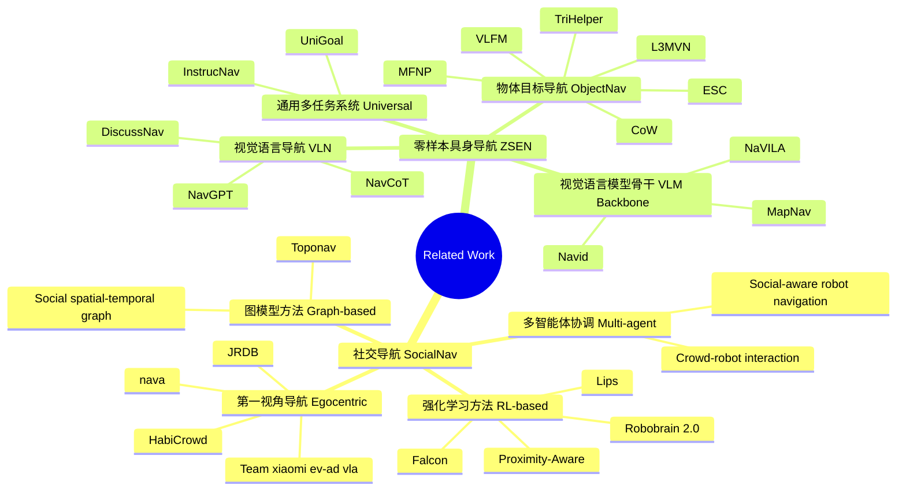

虽然 **Falcon** 引入了**显式**轨迹预测，但它本质上还是一个**强化学习（RL）**方法，需要 2,396 个 GPU 小时的预训练和微调。而 **SocialNav-Map** 实现了在完全不进行环境特定训练的情况下，直接在未知场景中完成社交导航任务——也就是 **Zero-shot Embodied Navigation**。

## 批判强化学习

**强化学习方法的主要问题**：

- **训练成本高昂**：需要数周的漫长训练时间，才能为特定环境制定有效的策略
- **泛化能力差**：这些策略难以泛化到具有不同布局、人员密度或行为模式的新场景，必须进行代价高昂的重新训练
- **反应式特性**：大多数强化学习系统的"反应式"特性加剧了这种泛化难题——它们往往优先考虑即时避障，而非长期战略规划

**在复杂场景中的表现**：在复杂场景（如繁忙的交叉路口或人流密集的走廊）中，这种短视策略可能导致：
- 导航效率低下
- 陷入僵局
- 出现让周围人员不适的社交不当行为

## 基线与不足

近年来，人体轨迹预测技术的进步提供了一种有前景的替代方案：通过预测人类未来的运动，机器人能够从被动导航转向主动导航，从而提升社交接受度和导航效率。

**然而，室内环境中的轨迹预测仍面临挑战**：

- 频繁变向导致的预测范围有限
- 复杂布局对运动的限制
- 需要精准避障的高交互密度

## 贡献梗概

**SocialNav-Map** 框架的核心设计：

1. **地图构建与目标转换**：首先将任务目标位置转换到构建的地图坐标系中
2. **动态占用地图**：创建具有社交感知的动态占用地图，将预测的人体运动轨迹作为动态障碍物整合其中，通过结构化流程提升导航效率和安全性

**双重轨迹预测方法**：

- **历史预测法**：通过分析观察到的人体运动模式进行预测
- **方向预测法**：基于当前人体姿态和方向推断未来轨迹

**主动导航决策**：

利用这些预测结果，我们将人类的过往轨迹和预期轨迹均视为占用地图中的动态障碍物，使机器人能够做出主动导航决策，而非仅仅被动避障。

**时间衰减机制**：

人类的过往位置和预测位置会作为动态障碍物纳入占用地图，并随时间逐步更新。这种设计确保导航决策能考虑到人类未来的潜在位置，同时避免过时预测形成持续障碍物（否则可能导致机器人行为过于保守或低效）。

## Related Work

## Methodology

### Problem Formulation

#### 场景定义

该任务定义于场景 $S$ 中，场景内包含 $N$ 个移动的人类 $H=\{h_1, h_2, ..., h_N\}$，每个人类 $h_i$ 遵循轨迹 $\tau_i(t)$，其位置和方向随时间变化。

#### 智能体初始化

在每个任务回合开始时，智能体被随机初始化于场景 $S$ 内的位置 $p_0$，并被分配特定目标位置 $g \in G$。

#### 观测空间

在每个离散时间步 $t$，智能体接收观测向量 $O_t=(V_t, P_t, H_t)$，其中：

- $V_t$：视觉输入（深度图像）
- $P_t$：智能体当前姿态（站在哪、面朝哪）
- $H_t$：可观测的人类位置和方向

#### 动作空间

基于这些输入，智能体需选择动作 $a_t \in A$，动作空间 $A$ 包含四个动作：
- **前进**
- **左转**
- **右转**
- **停止**

#### 任务目标

智能体需向目标导航，同时与静态障碍物和动态人类保持安全距离。

1. **到达目标**：智能体到达目标位置的距离阈值 $d_g$ 范围内（通常为 0.2 米）
2. **避免碰撞**：在整个任务回合中避免与人类碰撞，即与任何人类保持最小距离 $d_h$（通常为 0.1 米）

#### 时间限制

每个导航回合的最大时间步限制为 $T_{\text{max}}$（通常为 500 步）。

### Pipeline
分 4 步把 “观测信息”（看到的环境、自己的位置、行人的状态）变成 “走路动作”，全程不用提前训练也没有用到VLM，实时处理

#### Step 1 Static Map Construction

**输入**：机器人的深度图像 $V_t$（比如"前方 5 米有墙、2 米有桌子"）

**输出**：2D 占用图 $M_{\text{occ}}$（一张黑白图：黑色是墙、桌子这种"固定障碍"，白色是能走的路）

静态地图构建过程通过一系列几何变换将 RGB-D 观测 $V_t$ 转换为 2D 占用图：

##### 1. 深度图像转 3D 点云

相当于把平面的"距离照片"，变成立体的"点集合"——每个点都知道自己离机器人有多远、在哪个方位（比如"前方 3 米、左边 1 米有个点，是桌子的角"）。

给定深度图像 $D \in \mathbb{R}^{H \times W}$（其中 $H$ 和 $W$ 是图像尺寸），使用相机内参矩阵 $K$ 生成 3D 点云：

$$P_{\text{cam}} = K^{-1} \begin{bmatrix} u \cdot D(u, v) \\ v \cdot D(u, v) \\ D(u, v) \end{bmatrix}$$

其中 $(u, v)$ 是像素坐标，$D(u, v)$ 是像素 $(u, v)$ 处的深度值。

##### 2. 坐标系转换到智能体视角

把 3D 点云"转到机器人视角"：调整这些点的坐标，让机器人知道"障碍相对于自己的位置"（比如"桌子在我左前方 2 米"，而不是抽象的"世界坐标"）。

使用相机高度 $h_{\text{agent}}$ 和仰角 $\theta_{\text{eve}}$ 将相机坐标系点 $P_{\text{cam}}$ 转换到智能体坐标系：

$$P_{\text{agent}} = R_x(\theta_{\text{eve}}) \cdot P_{\text{cam}} + \begin{bmatrix} 0 \\ 0 \\ h_{\text{agent}} \end{bmatrix}$$

其中 $R_x(\theta_{\text{eve}})$ 是绕 $x$ 轴的旋转矩阵。

##### 3. 姿态变换居中视角

接下来，应用姿态变换以智能体视角为中心，使用偏移位置 $s = [\frac{r \cdot \text{res}}{2}, 0, \frac{\pi}{2}]$（其中 $r$ 是视觉范围，$\text{res}$ 是分辨率）：

$$P_{\text{centered}} = R_z(s_2) \cdot P_{\text{agent}} + \begin{bmatrix} s_0 \\ s_1 \\ 0 \end{bmatrix}$$

##### 4. 体素化（将立体空间"切成小方块"）

把机器人周围的空间分成一个个 tiny 小格子，标记"哪个格子里有障碍、不能走"。

将居中的 3D 点离散化为体素坐标，通过归一化到范围 $[-1, 1]$：

$$P_{\text{voxel}} = 2 \cdot \frac{P_{\text{centered}} - \text{center}}{\text{range}} - 1$$

其中 $\text{center}$ 和 $\text{range}$ 定义体素网格边界。

##### 5. 投影成 2D 地图

只保留机器人"能走的高度范围"（比如地面以上 0.1 米到机器人身高 1.5 米），把立体的"小格子障碍"压成平面地图——这样机器人就有了一张"实时更新的静态路况图"。

将 3D 体素表示投影到 2D 占用图，通过在智能体可通行高度范围 $[z_{\text{min}}, z_{\text{max}}]$ 内对高度层求和：

$$M_{\text{occ}}(x, y) = \sum_{z=z_{\text{min}}}^{z_{\text{max}}} V_{\text{voxel}}(x, y, z)$$

生成的占用图 $M_{\text{occ}}$ 将障碍物表示为高置信度区域，其中深度测量表明在智能体导航高度范围内存在固体表面。

#### Step 2 Coordinate Transformation

**输入**：世界坐标系的目标位置（比如"3 号房间在世界地图的 X=10、Y=20 处"）、行人的世界坐标

**输出**：地图坐标系的目标 / 行人位置（比如"目标在我画的静态地图的 X=5、Y=8 处"）

**核心作用**：避免机器人"迷路"——不管机器人自己走到哪，都以"刚开始的位置"为原点，给目标和行人定固定的"地图坐标"。比如机器人走了 5 米，它画的地图不会跟着动，目标和行人的位置在地图上只会按实际移动更新，机器人永远知道"目标在地图的哪个方向"。

坐标变换阶段通过将目标位置从世界坐标转换为地图坐标并保持固定的空间关系，建立一致的空间参考系。

##### 1. 世界坐标到仿真器坐标转换

给定世界坐标系中的目标位置 $g_{\text{world}} = [x_w, y_w, z_w]$ 和智能体的初始位置 $p_{\text{init}} = [x_{\text{init}}, y_{\text{init}}, z_{\text{init}}]$，系统首先将世界坐标转换为仿真器坐标：

$$g_{\text{sim}} = \begin{bmatrix} -z_w \\ -x_w \\ y_w \end{bmatrix}, \quad p_{\text{sim}} = \begin{bmatrix} -z_{\text{init}} \\ -x_{\text{init}} \\ y_{\text{init}} \end{bmatrix}$$

##### 2. 计算相对偏移

在仿真器坐标系中，目标与智能体之间的相对偏移计算为：

$$\Delta_{\text{sim}} = g_{\text{sim}} - p_{\text{sim}} = \begin{bmatrix} -(z_w - z_{\text{init}}) \\ -(x_w - x_{\text{init}}) \\ y_w - y_{\text{init}} \end{bmatrix}$$

##### 3. 映射到全局地图坐标系

然后将此偏移映射到全局地图坐标系，其中智能体的初始位置固定在地图中心 $p_{\text{map center}} = [\frac{W_{\text{map}}}{2}, \frac{H_{\text{map}}}{2}]$（$W_{\text{map}}$ 和 $H_{\text{map}}$ 表示地图尺寸，单位为米）。目标的全局地图位置计算为：

$$g_{\text{global map}} = p_{\text{map center}} + \begin{bmatrix} -\Delta_{\text{sim}}[0] \\ \Delta_{\text{sim}}[1] \end{bmatrix}$$

##### 4. 行人位置变换

对于动态轨迹预测，行人位置 $h_{\text{world}} = [x_h, y_h, z_h]$ 使用相同的变换流程，基于固定的初始智能体参考系：

$$h_{\text{global map}} = p_{\text{map center}} + \begin{bmatrix} -(-z_h + z_{\text{init}}) \\ -(-x_h + x_{\text{init}}) \end{bmatrix}$$

##### 5. 中间目标处理

**补充**：如果目标太远（超出当前画的地图范围），就先设个"中间目标"（比如先走到当前地图的边缘，朝着最终目标的方向），一步步推进，不会因为目标太远而乱走。

当变换后的目标位置落在当前局部地图边界之外时，系统在真实目标方向上放置一个中间目标以保持导航进度。系统计算从智能体当前位置到越界目标的方向向量，并在距离 $d_{\text{intermediate}} = \min(W_{\text{local}}/3, H_{\text{local}}/3)$ 处放置中间目标：

$$g_{\text{intermediate}} = a_{\text{local}} + \frac{g_{\text{local}} - a_{\text{local}}}{\|g_{\text{local}} - a_{\text{local}}\|} \times d_{\text{intermediate}}$$

其中坐标被限制在安全地图边界 $[3, \text{mapsize} - 4]$ 内。

这种坐标变换通过保持以智能体初始位置为锚点的固定参考系来确保空间一致性，使目标定位和人类轨迹预测准确，无论智能体在导航过程中的当前位置如何。

#### Step 3 SocialNav-Map Construction

**本工作的核心**：预测行人走位，标记"动态障碍"

**输入**：行人的历史位置（之前走了哪几步）、当前朝向

**输出**：融合了"静态障碍 + 动态行人"的最终地图

**SocialNav-Map** 构建过程如图 2 和图 3 所示。**SocialNav-Map** 构建整合了双重轨迹预测方法来预测人类运动。系统为每个人类智能体 $i$ 维护历史位置数据 $H_i = \{(p_t, t)\}$，其中 $p_t = [x_t, y_t]$ 表示时间步 $t$ 的位置。

机器人不光要知道"现在行人在哪"，还要猜"接下来 5 步行人会走到哪"，把这些"未来走位"也当成"临时障碍"画在地图上——比如预测到行人 1 秒后会走到左边 3 米处，机器人现在就会绕开那个位置，而不是等快撞上了才反应。

##### 1. 历史预测（History Prediction）

对于具有足够轨迹历史（长度 $\geq 2$）的智能体，系统对历史位置执行线性回归。给定位置序列 $\{p_{t-n}, ..., p_{t-1}, p_t\}$ 和对应的时间步 $\{t-n, ..., t-1, t\}$，使用以下公式预测未来轨迹：

$$\hat{p}_{\text{hist}}^{t+k} = \begin{bmatrix} a_x \cdot (t + k) + b_x \\ a_y \cdot (t + k) + b_y \end{bmatrix}$$

其中 $(a_x, b_x)$ 和 $(a_y, b_y)$ 是通过对历史轨迹数据进行最小二乘拟合得到的线性系数。

##### 2. 朝向预测（Orientation Prediction）

对于每个具有当前朝向 $\theta_i$ 的人类，系统沿航向方向预测未来位置：

$$\hat{p}_{\text{orient}}^{t+k} = p_t + k \cdot d_{\text{step}} \cdot \begin{bmatrix} \cos(\theta_i + \pi/2) \\ -\sin(\theta_i + \pi/2) \end{bmatrix}$$

其中 $d_{\text{step}}$ 是步长距离，角度调整考虑了坐标系变换。

##### 3. 轨迹融合（Trajectory Fusion）

两种预测方法使用自适应权重进行融合，对于更长的预测范围，偏向朝向预测。融合轨迹计算为：

$$\hat{p}_{\text{fused}}^{t+k} = w_k^{\text{hist}} \cdot \hat{p}_{\text{hist}}^{t+k} + w_k^{\text{orient}} \cdot \hat{p}_{\text{orient}}^{t+k}$$

其中：
- $w_k^{\text{hist}} = w_{\text{base}} \cdot \alpha^k$ 表示历史影响随衰减因子 $\alpha$ 递减
- $w_k^{\text{orient}} = 1 - w_k^{\text{hist}}$ 确保互补权重

这种融合方法利用历史模式进行短期预测，同时依赖基于朝向的外推进行长期预测，在不同预测范围内提供鲁棒的轨迹估计。

##### 4. 动态人类障碍物（Dynamic Human Obstacles）

系统通过形态学操作和时间衰减机制，将预测轨迹和历史人类存在整合到占用图中。人类障碍物整合在两个层面操作：即时存在跟踪和预测障碍物放置。

当前人类位置和预测轨迹点使用半径为 $r_{\text{human}} = 0.25$ 米的形态学膨胀转换为占用图障碍物。对于全局地图坐标中的每个人类位置 $p_{\text{human}}$，系统创建圆形障碍物区域：

$$O_{\text{human}}(x, y) = \{(x, y) : \|[x, y] - p_{\text{human}}\|_2 \leq r_{\text{human}}\}$$

占用图通过使用半径为 $r_{\text{pixels}} = r_{\text{human}} \cdot 100/\text{res}_{\text{map}}$ 的盘形结构元素 $S_{\text{disk}}$，将所有膨胀区域内的位置设置为 $M_{\text{occ}}(x, y) = 1$ 来更新。

##### 5. 时间衰减机制（Temporal Decay）

**关键**：这些"动态障碍"会"过期作废"（时间衰减）——如果 5 个时间步后，行人没按预测的路线走，机器人就会删掉这个"临时障碍"，避免一直绕路。

为了防止过时的障碍物阻碍导航，系统采用时间衰减机制。每个障碍物位置都标记有时间戳 $t_{\text{create}}$，并在衰减周期 $T_{\text{decay}} = 5$ 个时间步后移除：

$$M_{\text{occ}}(x, y) = \begin{cases} 1 & \text{if } t_{\text{current}} - t_{\text{create}} \leq T_{\text{decay}} \\ 0 & \text{if } t_{\text{current}} - t_{\text{create}} > T_{\text{decay}} \end{cases}$$

过期的障碍物通过逆形态学操作主动清除，确保先前被占用的区域再次变为可通行。系统分别跟踪活动障碍物（最近观察到的）和过期障碍物（超过衰减时间），对活动区域应用膨胀，对过期区域进行显式清除。这种方法通过在最近人类活动周围保持障碍物来平衡安全性，同时通过移除过时的限制来确保长期可导航性。

#### Step 4 Path and Action Prediction

**输入**：融合后的最终地图、目标的地图坐标

**输出**：具体动作（前进 / 左转 / 右转 / 停止）

路径和动作预测阶段通过分层规划将社交感知占用图转换为可执行的导航命令。系统采用**快速行进法（Fast Marching Method, FMM）** [54] 进行最优路径生成，然后进行确定性动作选择。

用"快速行进法"（相当于"找最短路径的算法"）在地图上找一条"不碰静态障碍、也不碰预测行人"的路，然后看"当前朝向和目标方向差多少"——差超过 15 度就左转 / 右转，没差就前进，到目标了就停止。

##### 1. 路径规划器（Path Planner）

路径规划器在增强的占用图 $M_{\text{occ}}$ 上操作，该图整合了静态障碍物、动态人类障碍物和碰撞历史。规划器首先通过应用形态学腐蚀来考虑机器人尺寸，创建可通行性地图 $T(x, y)$：

$$T(x, y) = \neg(\text{binary dilation}(M_{\text{occ}}, S_{\text{robot}}))$$

其中 $S_{\text{robot}}$ 是表示机器人足迹的盘形结构元素。

目标区域 $G$ 使用结构元素 $S_{\text{goal}}$ 进行膨胀以创建多目标，路径规划算法通过求解 Eikonal 方程 $|\nabla D| = 1/T$（边界条件为对所有 $g \in G$ 有 $D(g) = 0$）来计算距离场 $D(x, y)$。最优路径沿着距离场的负梯度方向，提供到目标的最短无碰撞轨迹。

##### 2. 动作生成（Action Generation）

从路径解中，系统在固定前瞻距离处沿最优路径提取短期目标（**STG**）点 $p_{\text{stg}}$。离散动作 $a_t \in \{\text{move forward}, \text{turn left}, \text{turn right}, \text{stop}\}$ 通过比较机器人当前朝向 $\theta_{\text{robot}}$ 和到 **STG** 的方向之间的相对角度 $\theta_{\text{rel}}$ 来确定：

$$\theta_{\text{rel}} = (\theta_{\text{robot}} - \arctan 2(p_{\text{stg}}[0] - p_{\text{robot}}[0], p_{\text{stg}}[1] - p_{\text{robot}}[1])) \bmod 360$$

动作选择遵循以下规则：
- **右转**：如果 $\theta_{\text{rel}} > 15°$
- **左转**：如果 $\theta_{\text{rel}} < -15°$
- **前进**：如果 $|\theta_{\text{rel}}| \leq 15°$
- **停止**：如果到达目标或不存在有效路径

这种确定性策略确保了一致的导航行为，同时保持了实时执行的计算效率。

我挺喜欢这个Zero-Shot方法的，不用提前在某个环境试错几千小时，而是靠 “实时画地图（静态）+ 猜行人走位（动态）+ 统一坐标（不迷路）+ 实时规划（选动作）”，相当于给机器人一套 “万能导航工具”，不管换哪个陌生环境，只要能 “看到”（传感器工作），就能直接用，不用重新训练。

## Experiment

### 实验环境与数据集

我看完发现还得详细看两个地方的工作：

- **Habitat 3.0**：仿真平台
- **Episode Dataset HM3D-Social & MP3D-Social**：
  - **Social-HM3D** 大一点（844 个场景、1087 次测试）
  - **Social-MP3D** 小一点（72 个场景、317 次测试）

### 实验设置

#### 地图构建规则

- **地图精度**：5 厘米 / 像素（相当于每个小格子 5cm，能看清桌子、行人的细节）
- **地图范围**：覆盖 20 米 × 20 米的范围（够逛一个小大厅）

#### 轨迹预测规则

- **历史预测**：看行人之前 10 步的路线，预测接下来 10 步会去哪
- **更新频率**：每 10 步更新一次预测（避免越猜越不准）
- **方向预测**：按行人当前面朝的方向，往前猜 0.5 米的路线，猜的范围宽 0.25 米（允许行人稍微变向，不用猜太死）

#### 避障规则

- **安全半径**：把行人当成"半径 0.25 米的安全圈"（机器人不能靠近这个圈）
- **时间衰减**：如果 5 步之后行人没按预测路线走，就删掉这个"安全圈"（避免机器人一直绕着空地方走）

#### 路径规划规则

- **算法**：用"快速找最短路径"的算法（**Fast Marching Method**）
- **机器人尺寸**：用 3 像素的"圆圈"模拟机器人大小，避免机器人卡墙

#### 测试结束条件

- **最大步数**：最多走 500 步（不能磨磨蹭蹭）
- **成功标准**：
  - 走到离目标 0.2 米内（差不多伸手碰到）
  - 全程和行人保持至少 0.1 米距离（不撞人）

### Metrics

#### 任务完成分（占 60% 权重）

- **成功率（SR, Success Rate）**：100 次测试里，机器人成功到目标的次数（比如 51.71 就是 51.71 次成功）
- **路径长度加权成功率（SPL, Success weighted by Path Length）**：不光看能不能到，还看走的路绕不绕（走直线到的得分高，绕远路的得分低）

#### 社交礼仪分（占 40% 权重）

- **人机碰撞率（H-coll, Human Collision Rate）**：100 次测试里，机器人撞人的次数（越低越好，比如 30.36 就是 30.36 次撞人）
- **个人空间合规率（PSC, Personal Space Compliance）**：机器人保持"不打扰行人"的次数（行人碰撞半径 0.3 米 + 机器人 0.25 米，所以设 1 米为安全距离，机器人离行人 ≥ 1 米就算合规）

#### 综合得分（Final Score）

$$\text{Final Score} = 0.4 \times \text{SR} + 0.2 \times \text{SPL} + 0.2 \times \text{PSC} + 0.2 \times (1 - \text{H-coll})$$

重点看"能不能完成任务"（**SR** 权重最高），同时兼顾"不撞人、懂礼貌"。

### 实验结果

| Dataset | Method Type | Method | SR ↑ | SPL ↑ | PSC ↑ | H-Coll ↓ | Final Score ↑ |
| --- | --- | --- | --- | --- | --- | --- | --- |
| **Social-HM3D** | Rule-Based | A* [55] | 46.14 ± 0.7 | 46.14 ± 0.7 | 90.56 ± 0.2 | 53.50 ± 0.9 | 55.09 ± 0.7 |
| | | ORCA [56] | 38.91 ± 0.1 | 38.91 ± 0.1 | 90.55 ± 0.4 | 47.52 ± 1.7 | 51.95 ± 0.9 |
| | RL-Based | Proximity-Aware [22] | 20.11 ± 1.3 | 18.57 ± 1.9 | 92.91 ± 0.5 | 33.99 ± 0.7 | 43.54 ± 1.0 |
| | | **Falcon** [18] | 53.84 ± 0.6 | 49.30 ± 0.7 | 89.47 ± 1.4 | 41.58 ± 1.1 | 60.39 ± 0.8 |
| | Zero-Shot | **SocialNav-Map (Ours)** | **51.71 ± 0.3** | **43.91 ± 0.5** | **89.12 ± 0.7** | **30.36 ± 0.9** | **61.21 ± 0.5** |
| **Social-MP3D** | Rule-Based | A* [55] | 43.85 ± 0.3 | 43.85 ± 0.3 | 86.74 ± 3.4 | 57.94 ± 1.5 | 52.07 ± 0.8 |
| | | ORCA [56] | 40.38 ± 0.3 | 40.38 ± 0.3 | 91.76 ± 0.4 | 47.16 ± 0.2 | 53.15 ± 0.6 |
| | RL-Based | Proximity-Aware [22] | 18.45 ± 1.4 | 17.09 ± 2.8 | 93.37 ± 0.9 | 32.18 ± 3.3 | 43.04 ± 0.8 |
| | | **Falcon** [18] | 48.47 ± 0.8 | 42.08 ± 0.4 | 90.48 ± 0.2 | 48.53 ± 1.2 | 56.19 ± 0.9 |
| | Zero-Shot | **SocialNav-Map (Ours)** | **43.53 ± 0.9** | **37.09 ± 0.5** | **89.30 ± 0.2** | **30.54 ± 1.0** | **56.58 ± 0.6** |

#### 结果分析

- **在 Social-HM3D 上**：
  - 综合得分：**61.21** vs **Falcon** 的 60.39
  - 撞人率：**30.36%** vs **Falcon** 的 41.58%（少撞 10% 以上）

- **在 Social-MP3D 上**：
  - 综合得分：**56.58** vs **Falcon** 的 56.19
  - 撞人率：**30.54%** vs **Falcon** 的 48.53%（少撞近 18%）

### Ablation Study

| Methods | SR ↑ | SPL ↑ | PSC ↑ | H-Coll ↓ | Final Score ↑ |
| --- | --- | --- | --- | --- | --- |
| **SocialNav-Map (Full)** | **51.71** | **43.91** | **89.12** | **30.36** | **61.21** |
| w/o Intermediate Goal | 49.24 | 41.18 | 88.95 | 32.47 | 59.15 |
| w/o History Prediction | 50.13 | 42.26 | 88.74 | 31.89 | 59.82 |
| w/o Orientation Prediction | 45.87 | 41.95 | 88.46 | 38.12 | 55.94 |
| w/o Trajectory Fusion | 48.69 | 40.81 | 88.32 | 34.58 | 57.73 |
| w/o Dynamic Obstacles | 47.35 | 39.67 | 87.29 | 36.94 | 56.16 |

#### 消融分析

- **w/o Intermediate Goal**（拆"中间目标"）：得分从 61.21 降到 59.15——有点影响，但不大
- **w/o History Prediction**（拆"历史预测"，只靠方向预测）：得分 59.82——影响不大，但少了一个预测逻辑，还是差点
- **w/o Orientation Prediction**（拆"方向预测"，只靠历史预测）：得分 55.94——掉得明显，说明方向预测对"猜行人长远走位"很重要
- **w/o Trajectory Fusion**（拆"轨迹融合"，不把两个预测结合）：得分 57.73——掉分，说明"近未来看历史、远未来看方向"的融合逻辑有用
- **w/o Dynamic Obstacles**（拆"动态障碍物"，不把预测的行人走位当障碍）：得分 56.16——掉分最多！证明核心就是"提前把行人未来走位当障碍"，这是安全导航的关键

#### 超参数设置

- **行人障碍半径**：0.25 米（太小不安全，太大绕路）
- **轨迹融合权重**：0.5（历史和方向预测各占一半，平衡最好）

### Qualitative Analysis

