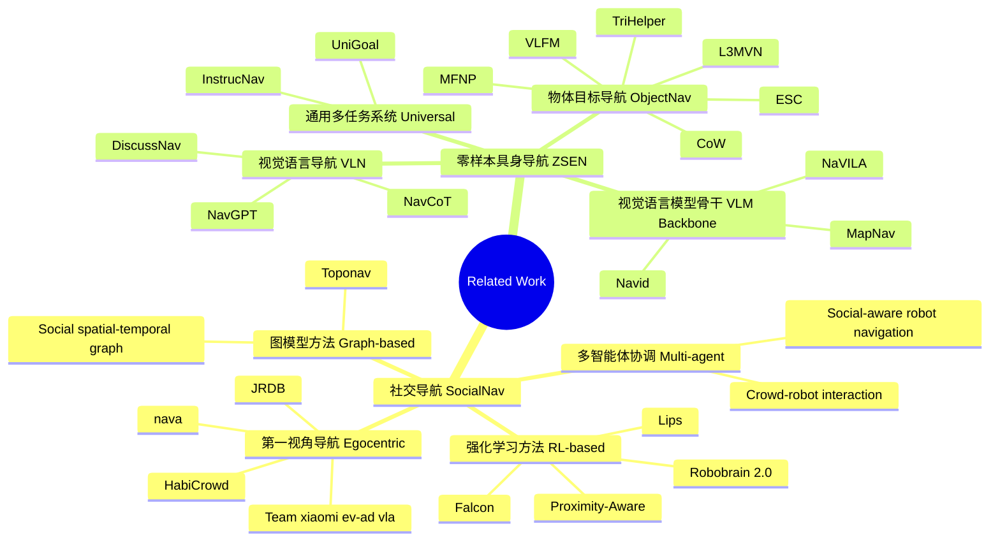

虽然 Falcon 引入了**显式**轨迹预测，但它本质上还是一个强化学习（RL）方法，需要 2,396 个 GPU 小时的预训练和微调。而 SocialNav-Map 实现了在完全不进行环境特定训练的情况下，直接在未知场景中完成社交导航任务——也就是 Zero-shot Embodied Navigation。

## 批判强化学习

需要数周的漫长训练时间，才能为特定环境制定有效的策略，且这些策略难以泛化到具有不同布局、人员密度或行为模式的新场景，必须进行代价高昂的重新训练

大多数强化学习系统的 "反应式" 特性加剧了这种泛化难题 —— 它们往往优先考虑即时避障，而非长期战略规划。在复杂场景（如繁忙的交叉路口或人流密集的走廊）中，这种短视策略可能导致导航效率低下、陷入僵局，或出现让周围人员不适的社交不当行为

## 基线与不足

近年来，人体轨迹预测技术的进步提供了一种有前景的替代方案：通过预测人类未来的运动，机器人能够从被动导航转向主动导航，从而提升社交接受度和导航效率。然而，室内环境中的轨迹预测仍面临挑战，包括频繁变向导致的预测范围有限、复杂布局对运动的限制，以及需要精准避障的高交互密度

## 贡献梗概
该框架首先将任务目标位置转换到构建的地图坐标系中，然后创建具有社交感知的动态占用地图，将预测的人体运动轨迹作为动态障碍物整合其中，通过结构化流程提升导航效率和安全性
具体而言整合了两种互补方法：历史预测法（通过分析观察到的人体运动模式）和方向预测法（基于当前人体姿态和方向推断未来轨迹）

利用这些预测结果，我们将人类的过往轨迹和预期轨迹均视为占用地图中的动态障碍物，使机器人能够做出主动导航决策，而非仅仅被动避障

人类的过往位置和预测位置会作为动态障碍物纳入占用地图，并随时间逐步更新。这种设计确保导航决策能考虑到人类未来的潜在位置，同时避免过时预测形成持续障碍物（否则可能导致机器人行为过于保守或低效）

## Related Work

## Methodology

### Problem Formulation
该任务定义于场景S中，场景内包含N个移动的人类\(H=\{h_1, h_2, ..., h_N\}\)，每个人类\(h_i\)遵循轨迹\(\tau_i(t)\)，其位置和方向随时间变化。在每个任务回合开始时，智能体被随机初始化于场景S内的位置\(p_0\)，并被分配特定目标位置\(g \in G\)。在每个离散时间步t，智能体接收观测向量\(O_t=(V_t, P_t, H_t)\)，其中\(V_t\)表示视觉输入（深度图像），\(P_t\)表示智能体当前姿态，\(H_t\)表示可观测的人类位置和方向。基于这些输入，智能体需选择动作\(a_t \in A\)，动作空间A包含四个动作：前进、左转、右转和停止。智能体需向目标导航，同时与静态障碍物和动态人类保持安全距离。任务成功定义为两个标准：（1）智能体到达目标位置的距离阈值\(d_g\)范围内（通常为 0.2 米）；（2）在整个任务回合中避免与人类碰撞，即与任何人类保持最小距离\(d_h\)（通常为 0.1 米）。每个导航回合的最大时间步限制为\(T_{max}\)（通常为 500 步）。

### 双重轨迹预测融合（Dual Trajectory Prediction）

该框架提出了一套互补的预测机制，用于精准预判行人的未来位置：

- **历史预测（History Prediction）**：通过最小二乘法对行人过去 10 个时间步的坐标进行线性回归，捕捉长期运动趋势。
- **朝向预测（Orientation Prediction）**：基于行人当前的姿态和朝向进行线性外推，捕捉即时的方向意图。
- **加权融合**：采用自适应权重，公式如下：

$$\hat{p}_{t+k}^{fused}=w_{k}^{hist}\cdot\hat{p}_{t+k}^{hist}+w_{k}^{orient}\cdot\hat{p}_{t+k}^{orient}$$

这种设计利用历史模式进行短期预测，利用朝向进行长期预测，比单一预测更鲁棒。

### 带时间衰减的动态障碍物管理（Dynamic Obstacle Management）

这是该项目与 InstructNav 等纯导航方法最大的区别。它将预测出的行人轨迹直接映射到 2D 占用图（Occupancy Map）中：

- **主动避障**：机器人不仅避开行人当前位置，还避开其预测的未来轨迹点，将"反应式"避障升级为"主动式"规避。
- **时间衰减机制**：设置了一个衰减周期 $T_{decay} = 5$ 步。过时的预测点会被自动清除，防止地图中充斥着"幽灵障碍物"，从而避免机器人表现得过于保守或陷入死锁。
