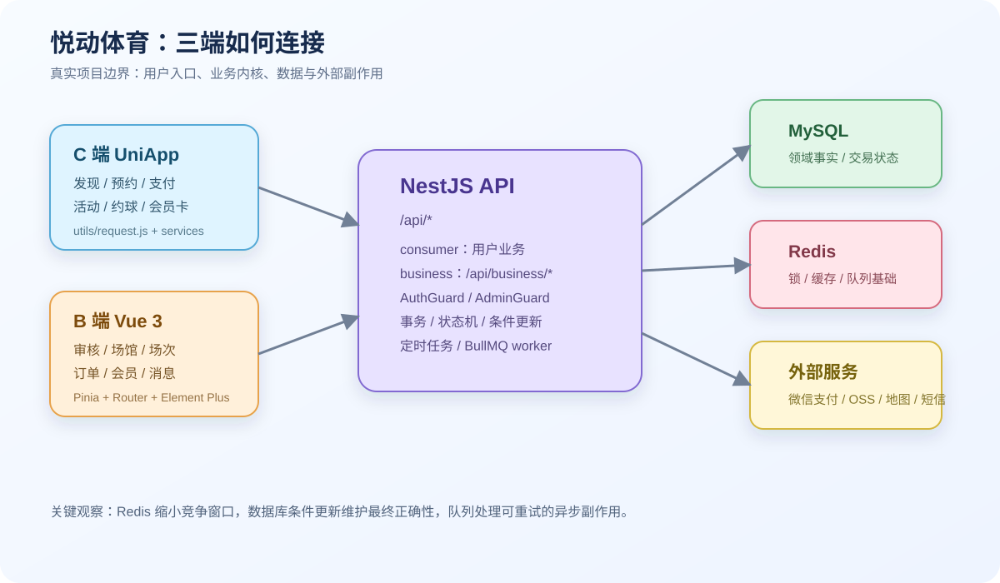
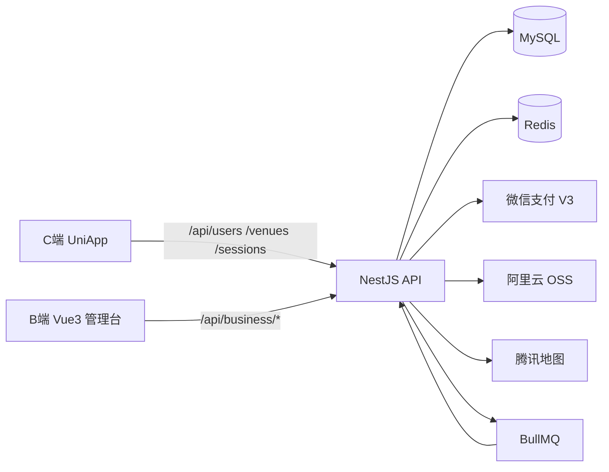
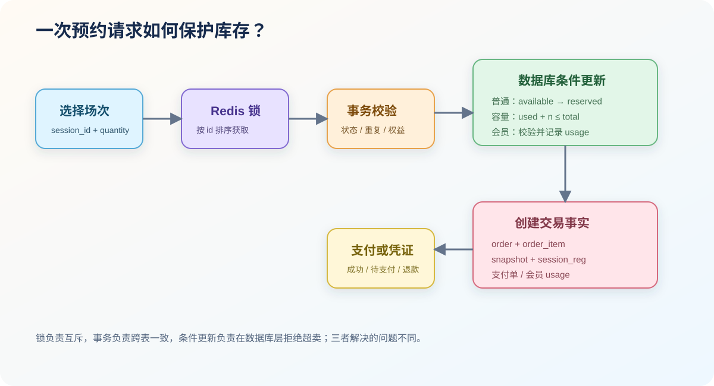
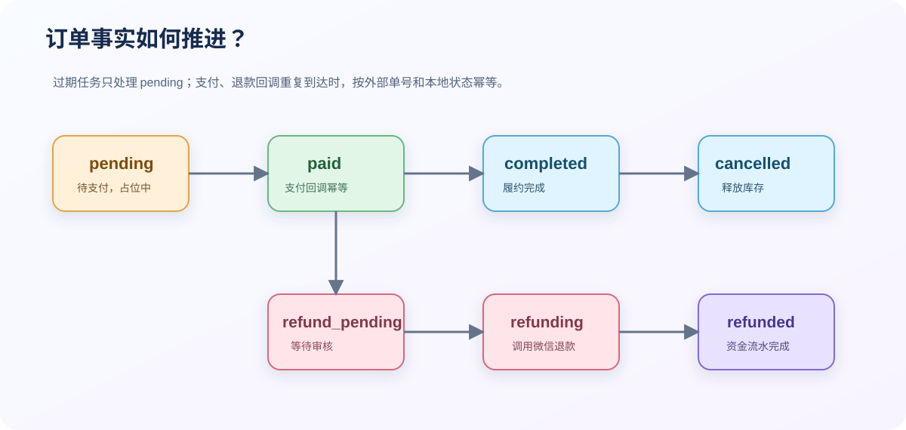

# 悦动体育项目

这页从一次仓库盘点开始。当前工作区里，悦动体育不是单个小程序，而是三个互相约束的工程：`yuedong_nestjs` 提供 C 端和 B 端 API，`yuedong-v2-frontend` 提供 UniApp 小程序，`yuedong_front` 提供 Vue 3 管理台。

我在整理时没有把提交标题直接当成结论，而是交叉读取了 controller、service、Prisma schema、前端页面、API 封装、已有设计文档和部署文件。下面的 `[已验证]` 来自当前源码或配置，`[推断]` 表示根据源码关系归纳，`[选择]` 表示项目采用的设计，`[计划]` 和 `[未知]` 不表示功能已经完成。



## 这个项目到底解决什么问题？

用户在 C 端查找运动场馆和活动，选择具体日期、场地和时间段，完成预约、支付或会员卡抵扣；商户和平台人员在 B 端维护场馆、价格、场次、活动、会员产品和订单。后端还要处理库存竞争、支付回调、退款审核、资金流水和运营消息。

项目的难点不在页面数量，而在有限资源会被多个用户同时修改。一个场次可能是普通预约，也可能是容量型场次；一笔订单可能还处于待支付，但它已经占用了活动名额；一张会员卡既有有效期，又可能有剩余次数和当天使用限制。

当前代码快照中，Prisma schema 有 43 个 model 和 41 个 enum。[已验证] 这说明数据库并非简单的用户表、商品表和订单表，而是已经形成了资源、交易、活动社交、会员、商户运营和消息几个领域。

## 三个仓库如何拼成一条请求链路？



后端启动时设置全局 `/api` 前缀，监听 8080。下面的片段来自 `yuedong_nestjs/src/main.ts`：

```ts
import { NestFactory } from '@nestjs/core';
import { AppModule } from './app.module';

async function bootstrap() {
    const app = await NestFactory.create(AppModule);

    app.enableCors({
        origin: [
            'http://localhost:5173',
            'http://localhost:3000',
            'http://localhost:3344',
            'https://localhost:3344', // 添加 HTTPS 的前端地址
            'http://127.0.0.1:5173',
            'http://127.0.0.1:3344',
            'https://127.0.0.1:3344',
            'https://yuedongjump.com'
        ],
        credentials: true,
        methods: ['GET', 'POST', 'PUT', 'DELETE', 'PATCH', 'OPTIONS'],
        allowedHeaders: ['Content-Type', 'Authorization', 'Accept', 'Origin', 'X-Requested-With']
    });

    app.setGlobalPrefix('api');

    const port = process.env.PORT ?? 8080;
    await app.listen(port, '0.0.0.0');

    console.log('\n🚀 NestJS 应用启动成功！');
    console.log(`📡 服务监听地址: http://0.0.0.0:${port}`);
    console.log(`🌐 本地访问: http://localhost:${port}/api`);
    console.log(`📝 API 前缀: /api`);
    console.log(`⏰ 启动时间: ${new Date().toLocaleString('zh-CN')}\n`);
}
bootstrap();
```

B 端有一个容易被忽略的路由层：controller 自身写的是 `venues`，但 `BusinessModule` 通过 `RouterModule.register` 加了 `business`。所以 B 端真实地址是 `/api/business/venues`，不是 `/api/venues`。下面的片段来自 `yuedong_nestjs/src/business/business.module.ts`。

```ts
RouterModule.register([
    {
        path: 'business',
        module: AdminModule
    },
    {
        path: 'business',
        module: MerchantModule
    },
    {
        path: 'business',
        module: MerchantVenueModule
    },
    {
        path: 'business',
        module: CourtModule
    },
    {
        path: 'business',
        module: PricePlanModule
    },
    {
        path: 'business',
        module: EventModule
    },
    {
        path: 'business',
        module: SessionModule
    },
    {
        path: 'business',
        module: BusinessOrderModule
    },
    {
        path: 'business',
        module: MembershipModule
    },
    {
        path: 'business',
        module: MessageModule
    }
])
```

这条结论是源码直接确认的。它也是我认为最适合写进复盘的第一个坑：接口文档必须由最终路由生成或测试验证，不能只读 controller 装饰器。

## 用户预约时，库存是怎样被保护的？



C 端确认页根据场次是否有容量字段，选择普通预约或容量型预约接口：

```text
普通场次：POST /api/sessions/reserve
容量场次：POST /api/sessions/reserve-capacity/:sessionId
会员卡预约：POST /api/sessions/reserve-membership/:sessionId
```

这三个接口不能只看名字。普通场次竞争的是 `available → reserved` 的状态；容量型场次竞争的是 `capacity_used + quantity <= capacity_total`；会员卡预约还要加入会员卡归属、有效期、范围和次数校验。

后端对 session id 排序后加锁，减少多场次预约时的锁顺序反转。下面的片段来自 `yuedong_nestjs/src/common/inventory/booking-inventory.service.ts`：

```ts
async withSessionLocks<T>(sessionIds: number[], callback: () => Promise<T>): Promise<T> {
    const locked = await this.lockMany(
        Array.from(new Set(sessionIds))
            .sort((a, b) => a - b)
            .map((id) => `booking:session:${id}`)
    );
    try {
        return await callback();
    } finally {
        await this.releaseMany(locked);
    }
}
```

Redis 锁本身使用随机 value，释放时通过 Lua 脚本比较 value，避免删除其他请求刚刚取得的锁。实现位于 `yuedong_nestjs/src/common/inventory/redis-lock.service.ts`：

```ts
async tryLock(key: string, value: string, ttlSeconds: number): Promise<boolean> {
    const result = await this.redisService.getClient().set(key, value, 'EX', ttlSeconds, 'NX');
    return result === 'OK';
}

async unlock(key: string, value: string): Promise<boolean> {
    const script = `
        if redis.call("get", KEYS[1]) == ARGV[1] then
            return redis.call("del", KEYS[1])
        end
        return 0
    `;
    const result = await this.redisService.getClient().eval(script, 1, key, value);
    return result === 1;
}
```

但锁不是最终正确性边界。活动容量使用数据库条件更新：

```ts
const updateResult = await tx.$executeRaw`
    UPDATE event
    SET capacity_used = capacity_used + ${quantity}
    WHERE event_id = ${eventId}
      AND status = 'open'
      AND is_hidden = false
      AND is_deleted = false
      AND capacity_used + ${quantity} <= capacity
`;

if (updateResult === 0) {
    throw new HttpException('活动名额不足或不可报名', HttpStatus.BAD_REQUEST);
}
```

这里的变量含义是：`capacity_used` 为已经占用的人数，`quantity` 为这次报名人数，`capacity` 为活动总容量。`UPDATE` 的条件和写入在数据库中一次完成，两个并发请求即使都读到旧值，也只能有满足条件的请求成功更新。

当前结果：[已验证] 活动报名有 event 锁和原子容量更新；场次预约也有锁和条件更新。[待验证] 约球加入流程仍需要补同等级的并发测试，因为它在事务外做了满员预检查，源码中尚未看到等价的原子容量保护。

## 一笔订单为什么不只是 order 表？



订单主表保存高频查询字段，具体商品和支付事实分散在结构化表中：

```text
order
├── order_item
├── venue_order_item / event_order_item / membership_order_item
├── order_snapshot
├── payment_order
│   └── payment_allocation
├── refund_order
└── fund_flow
```

这是一次从 `order.metadata` 向结构化订单模型的演进。当前 service 仍保留 metadata 兼容读取，所以它属于 `[部分实现]`：新数据可以走结构化表，历史数据和旧分支仍需要兼容。复盘时不能只说“完成了订单重构”，更准确的说法是“完成了结构化模型和主链路迁移，但兼容代码尚未退出”。

支付回调需要幂等。可以把成功处理理解为下面这组不变量：

```text
payment_order.status = success
payment_allocation.status = paid
order.status ∈ {paid, completed, refund_pending, refunding, refunded}
对应 fund_flow 只存在一份支付入账事实
```

退款则是另一条状态机：

```text
pending → paid → refund_pending → refunding → refunded
                         └──────────────→ refund_rejected
```

订单过期和支付成功可能同时发生，因此“过期任务只取消 pending 订单”很重要；支付回调重复到达，因此“已成功支付单直接返回”很重要；退款回调重复到达，因此退款单号和资金流水必须具备幂等键。

## 会员卡、活动和约球有什么不同？

| 业务 | 竞争对象 | 主要事实 | 主要风险 |
|---|---|---|---|
| 普通场次 | 一个 session 状态 | session_reg + order | 重复预约、过期释放 |
| 容量场次 | session 的剩余容量 | capacity_used + session_reg | 超卖、取消补偿 |
| 活动报名 | event 的剩余容量 | event_reg + order | 待支付占位和重复回调 |
| 会员卡 | 次数/有效期/范围 | membership_card_usage | 重复核销、退款恢复 |
| 约球 | meetup 参与名额 | meetup_reg + participants | 并发加入超额 |

会员产品描述商品，会员卡描述用户持有的权益，使用记录描述每次消耗。入场卡与场次卡的限制不同，单馆与连锁范围也不同；因此会员卡不能只保存一个余额字段。

活动还支持动态报名字段。B 端设计字段，C 端渲染表单，报名记录保存提交内容。这里尚未形成明确的字段版本策略，[待验证] 活动修改报名字段后，历史报名数据的解释和导出应再补一条契约测试。

## C 端如何避免把网络问题散落到每个页面？

小程序的 `yuedong-v2-frontend/utils/request.js` 负责 token、加载态、业务状态码、401 和 502；页面通过 payment、membership、dashboard 等 service 使用它。

```js
export const request = async (options = {}) => {
  const {
    url,
    method = 'GET',
    data = {},
    header = {},
    showLoading = true,
    showError = true,
    needAuth = false,
    retryCount = 0, // 添加重试次数参数
    maxRetries = 2  // 最大重试次数
  } = options;

  const fullUrl = url.startsWith('http') ? url : CONFIG.API.BASE_URL + url;
  
  // 构建请求头
  const requestHeaders = {
    'Content-Type': 'application/json',
    ...header
  };

  // 添加认证token
  if (needAuth) {
    const token = uni.getStorageSync('token');
    if (token) {
      requestHeaders.Authorization = `Bearer ${token}`;
      // console.log('🔐 添加认证token:', token.substring(0, 20) + '...');
    } else {
      console.warn('⚠️ 需要认证但token不存在');
    }
  }
```

当前错误处理允许 401、404、500 以业务响应形式返回给调用方，并对 502 做有限重试。这种兼容方式解决了历史接口的实际问题，但也说明三端的 HTTP 错误协议还没有完全统一。

另外，C 端 `yuedong-v2-frontend/utils/config.js` 的环境配置中，`develop`、`trial` 和 `release` 可能都返回 `production`：

```js
case 'develop': 
  // 开发环境也使用生产API，避免域名白名单问题
  return 'production'; 
case 'trial': 
  return 'production';
case 'release': return 'production';
default: return 'production';
```

这段代码是 `[已验证]`，但“是否允许继续这样发布”属于项目治理问题。它降低了小程序域名白名单配置的阻力，也增加了开发数据写入生产服务的风险。后续应有独立测试环境和发布前环境检查，而不是依赖注释提醒。

## B 端为什么要单独记录？

B 端不是 C 端的附属页面。它包含商户注册审核、场馆删除审核、价格策略、场次矩阵、活动报名表设计、会员卡核销、退款审核和消息轮询，是业务规则真正被运营人员操作的地方。

管理台 `yuedong_front/src/api/index.js` 默认使用 `/api`，由 Vite 开发代理转发到 8080：

```js
// 根据环境变量选择 API 基址：
// - Vite 开发：使用 /api（由 devServer 代理转发到后端）
// - 生产构建：优先使用 VITE_API_BASE，未设置则回退到相对路径 /api
const BASE_URL = (typeof import.meta !== 'undefined' && import.meta.env?.VITE_API_BASE)
  ? import.meta.env.VITE_API_BASE
  : '/api'

const pad2 = (value) => String(value).padStart(2, '0')

const toDateTimeQueryValue = (date) => {
  const y = date.getFullYear()
  const m = pad2(date.getMonth() + 1)
  const d = pad2(date.getDate())
  const hh = pad2(date.getHours())
  const mm = pad2(date.getMinutes())
  const ss = pad2(date.getSeconds())
  return `${y}-${m}-${d} ${hh}:${mm}:${ss}`
}
```

管理员登录后把 JWT 放在 `localStorage.jwt_token`，并通过 `/business/admin/profile` 获取资料。前端菜单会根据角色隐藏，但真正的授权仍在后端 `AdminGuard` 和角色/商户/场馆范围判断中。

## 图片、代码和证据应该如何继续补？

这页的图片不是装饰素材，而是把当前源码中难以线性阅读的关系画出来：

- `architecture.svg`：三端、数据库、Redis、队列和外部服务的边界。
- `booking-flow.svg`：选择场次、加锁、事务、库存更新、订单和支付的路径。
- `order-state.svg`：订单、支付和退款状态的关系。

后续每个专题都保持同样的记录方式：先放真实现象或请求，再给最小但完整的代码片段，随后解释输入、处理、输出、不变量和失败路径。代码块只引用仓库中已经存在的实现；如果某个设计还没有源码或测试，就标记 `[计划]` 或 `[未知]`。

## 当前状态与下一步

当前页面已经把三端定位、核心业务、数据库关系、库存并发、订单支付、会员卡、C 端网络层和 B 端运营边界放进同一篇项目总览中。它仍然不是逐个接口的完整 API 手册，详细接口和源码证据计划继续放在同目录后续专题页中。

下一步按优先级是：

1. 为约球加入补一个两个并发请求的集成测试，确认不会超过 `total_participants`。
2. 为普通场次、容量场次、活动报名和会员卡核销补状态不变量测试。
3. 清理订单 metadata 兼容分支，写明迁移完成条件和回滚方案。
4. 统一 C 端、B 端和后端的 HTTP/业务错误码以及日期时间格式。
5. 建立独立测试环境，检查 C 端生产域名配置和 B 端证书文件是否包含真实私钥。
