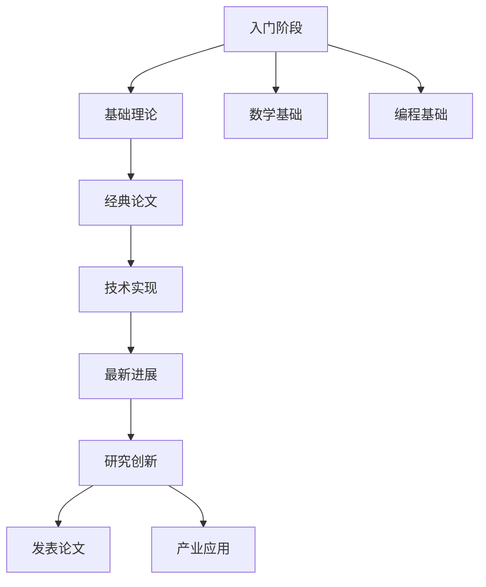

# 论文阅读

:::info
论文阅读是科研的重要组成部分。通过系统学习经典论文，可以深入理解前沿技术的发展脉络和核心思想。
:::

## 📚 阅读重点

### 具身智能 (Embodied Intelligence)

具身智能强调智能体与物理世界的交互，通过身体感知和行动来学习和理解环境。

#### 核心问题
- 如何让AI理解物理世界？
- 如何实现智能体与环境的有效交互？
- 如何将感知、认知和行动有机统一？

### 世界模型 (World Model)

世界模型是智能体对环境的内部表示，能够预测环境的变化和自身行动的结果。

#### 研究方向
- **生成式世界模型**：使用生成模型预测环境变化
- **基于物理的世界模型**：融入物理规律约束
- **多模态世界模型**：整合视觉、语言、动作等多模态信息

## 📖 论文分类

### 🏗️ 基础理论
- 世界模型的基本概念 - 待补充
- 具身智能的核心原理 - 待补充
- 强化学习在具身智能中的应用 - 待补充

### 🤖 经典论文
- Dreamer系列 - 待补充
- MuJoCo物理引擎 - 待补充
- Habitat仿真环境 - 待补充
- BEHAVIOR基准测试 - 待补充

### 🛠️ 技术实现
- 视觉感知模块 - 待补充
- 动作规划与控制 - 待补充
- 多智能体协作 - 待补充
- 安全与鲁棒性 - 待补充

### 🔬 最新进展
- 大语言模型在具身智能中的应用 - 待补充
- 多模态学习 - 待补充
- 持续学习与适应 - 待补充
- 神经符号AI - 待补充

## 🎯 阅读方法

### 1. 论文结构分析
```
📄 论文阅读流程
├── 🔍 快速浏览：标题、摘要、结论
├── 📝 详细阅读：引言、相关工作
├── 🔬 深入研读：方法、实验、结果
├── 💭 批判思考：优势、局限、创新点
└── 📋 总结笔记：核心思想、贡献点
```

### 2. 笔记系统
- **理论笔记**：概念定义、公式推导
- **实现笔记**：算法流程、代码结构
- **实验笔记**：数据集、评价指标
- **思考笔记**：个人见解、扩展思路

### 3. 实践建议
- **多读经典**：从奠基性论文入手
- **跟踪最新**：关注顶会论文（CVPR、ICCV、ICML、NeurIPS等）
- **动手实现**：尝试复现核心算法
- **跨领域学习**：结合计算机视觉、NLP、机器人学

## 🛠️ 工具推荐

### 论文阅读工具
- **Zotero**：文献管理
- **Notion**：笔记整理
- **Obsidian**：知识图谱
- **DeepL**：翻译辅助

### 代码实现工具
- **PyTorch**：深度学习框架
- **MuJoCo**：物理仿真引擎
- **OpenAI Gym**：强化学习环境
- **ROS**：机器人操作系统

### 学术资源
- **arXiv**：预印本论文
- **Google Scholar**：学术搜索
- **Semantic Scholar**：智能推荐
- **Papers with Code**：代码实现

## 📊 学习路径



## 🎓 学术交流

### 学术会议
- **CVPR**：计算机视觉与模式识别
- **ICCV**：国际计算机视觉大会
- **ICML**：国际机器学习大会
- **NeurIPS**：神经信息处理系统大会
- **ICRA**：国际机器人与自动化大会

### 研究社区
- **OpenReview**：论文评审平台
- **Reddit r/MachineLearning**：机器学习社区
- **Twitter学术圈**：前沿动态
- **GitHub**：开源代码

## 📝 贡献指南

欢迎大家一起完善这个论文阅读库！

- 📚 **分享笔记**：优质论文阅读笔记
- 🔬 **代码实现**：算法复现和改进
- 💡 **研究思路**：前沿方向探索
- 🤝 **学术合作**：共同研究项目

---

> "读万卷书，行万里路。" —— 刘彝

系统性的论文阅读不仅能拓宽知识视野，更能培养批判性思维和创新能力。让我们一起探索具身智能和世界模型的奥秘！