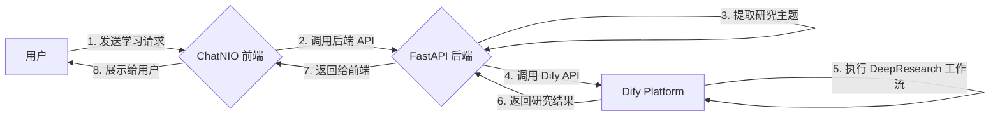

## 1. 项目目标与痛点

在日常学习和研究中，我们常常需要花费大量时间来搜集、整理和消化信息。为了提高学习效率，我们希望构建一个能够理解我们需求、主动提供深度研究材料的智能助手。

**核心痛点**:

*   **信息过载**: 难以从海量信息中快速找到高质量、高相关性的内容。
*   **学习路径不清晰**: 对于一个新领域，不知道从何学起，缺乏结构化的学习路径。
*   **工具链繁杂**: 需要在不同的工具（搜索引擎、笔记软件、翻译工具等）之间频繁切换。

**项目目标**:

*   **一站式学习**: 提供一个统一的交互界面，完成从提出问题到获取深度研究报告的全过程。
*   **智能化研究**: 利用大型语言模型（LLM）的能力，自动完成信息检索、筛选、整合和总结。
*   **个性化服务**: 能够根据用户的特定需求，动态调整研究方向和内容。

## 2. 技术选型

为了实现上述目标，我们选择了以下技术栈：

*   **[Dify](https://dify.ai/)**: 一个开源的 LLM 应用开发平台。它提供了可视化的 Prompt 编排、运营、数据集管理等功能，让我们可以快速构建和迭代复杂的 AI 应用。在本项目中，我们主要使用其 `DeepResearch` 工作流。
*   **[FastAPI](https://fastapi.tiangolo.com/)**: 一个现代、高性能的 Python Web 框架。我们用它来构建后端服务，作为连接前端和 Dify 的桥梁。它提供了自动化的 API 文档、数据验证和异步支持，非常适合快速开发。
*   **[ChatNIO](https://github.com/Deeptrain-Community/chatnio)**: 一个开源的、支持多种大模型后端的 WebUI。我们将其作为项目的前端界面，为用户提供一个美观、易用的对话窗口。

## 3. 系统工作流

整个系统的工作流程如下图所示：



**流程解析**:

1.  **用户请求**: 用户在 ChatNIO 界面输入学习需求，例如“我想了解一下 Transformer 的原理”。
2.  **前端交互**: ChatNIO 将用户的输入打包，通过 HTTP 请求发送给 FastAPI 后端。
3.  **后端处理**:
    *   FastAPI 接收到请求后，首先会调用 `extract_research_theme` 函数，从用户原始输入中提炼出核心的研究主题（例如“Transformer 原理”）。
    *   然后，它将该主题作为参数，构造一个对 Dify API 的请求。
4.  **Dify 执行**: Dify 平台接收到请求后，会触发预设的 `DeepResearch` 工作流。该工作流会自动在网络上搜索相关信息，进行筛选、整理，并生成一份结构化的研究报告。
5.  **结果返回**: Dify 完成任务后，将结果返回给 FastAPI 后端，后端再将其转发给前端，最终呈现给用户。

通过这个工作流，我们实现了一个从用户简单输入到系统深度研究报告输出的闭环。在下一章节中，我们将深入探讨后端 FastAPI 的具体实现。

然后，我们就来简单的介绍一下一个最最最基础的FastAPI如何搭建：

### 第一阶段：基础语法
1. **基本应用**
```python
from fastapi import FastAPI
from pydantic import BaseModel

app = FastAPI(title="我的 API", version="1.0.0")

class User(BaseModel):
    id: int
    name: str
    email: str
    age: int | None = None

@app.get("/")
async def root():
    return {"message": "Hello World"}

@app.get("/users/{user_id}")
async def get_user(user_id: int):
    return {"user_id": user_id, "name": "包博文"}

@app.post("/users/")
async def create_user(user: User):
    return user
```

2. **路径参数和查询参数**
```python
from typing import Optional
from fastapi import Query, Path

@app.get("/items/{item_id}")
async def read_item(
    item_id: int = Path(..., title="商品ID", ge=1),
    q: Optional[str] = Query(None, max_length=50),
    skip: int = Query(0, ge=0),
    limit: int = Query(10, ge=1, le=100)
):
    return {
        "item_id": item_id,
        "q": q,
        "skip": skip,
        "limit": limit
    }
```

3. **请求体模型**
```python
from pydantic import BaseModel, EmailStr, Field
from typing import List

class UserCreate(BaseModel):
    name: str = Field(..., min_length=1, max_length=50)
    email: EmailStr
    age: int = Field(..., ge=0, le=150)
    is_active: bool = True

class UserResponse(BaseModel):
    id: int
    name: str
    email: str
    age: int
    is_active: bool

    class Config:
        from_attributes = True

@app.post("/users/", response_model=UserResponse)
async def create_user(user: UserCreate):
    # 模拟创建用户
    return UserResponse(
        id=1,
        name=user.name,
        email=user.email,
        age=user.age,
        is_active=user.is_active
    )
```