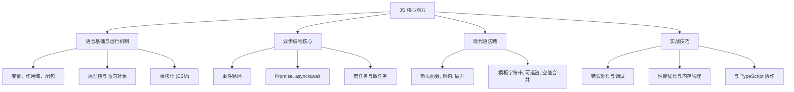

## 学习导读

- **强调“内功”属性**：事件循环、Promise、async/await 等属于 JavaScript 运行时机制，与 TypeScript 的类型系统相互独立。将两者拆开学习，可以清晰认知哪些是语言本身的能力，哪些是类型层的辅助。
- **通用性**：这些知识不仅在前端（浏览器环境）必不可少，在后端（Node.js、Deno 等）同样适用。整理成独立“JS 核心能力”文档，遇到异步或执行机制问题时可随时回溯。
- **学习路径**：建议先理解 JavaScript 的同步/异步原理，再学习 TypeScript 如何为 Promise、async 函数补充类型信息，让学习路线更平滑。

## 内容大纲



以上条目将逐步完善，作为在 React、Node.js 等技术栈中回顾 JS 核心的入口。

## 箭头函数与 this

### 为何需要箭头函数？

传统函数的 `this` 指向依赖调用方式，回调函数中常出现 “`const self = this`” 或显式 `bind` 的写法。箭头函数（Arrow Function）以词法作用域捕获 `this`，使回调代码更简洁、语义更稳定。

### 基本语法

```js
const add = (a, b) => a + b;

const sayHello = name => {
  console.log(`Hello, ${name}!`);
};
```

- 只有一个参数时可以省略括号；无参数需使用 `() =>`。
- 表达式体默认返回该表达式的值；若需要多条语句必须显式使用花括号并通过 `return` 返回。

### this 的差异

| 写法 | this 绑定规则 | 典型场景 |
| --- | --- | --- |
| 普通函数 `function () {}` | 由调用方决定，可用 `call/apply/bind` 修改 | 构造函数、对象方法、需要动态切换上下文 |
| 箭头函数 `() => {}` | 定义时捕获外层的 `this`，无法被重新绑定 | 数组迭代、Promise 回调、事件监听中的闭包 |

```js
const teacher = {
  name: 'Bubblevan',
  students: ['Alice', 'Bob'],
  callRoll() {
    this.students.forEach(student => {
      console.log(`${this.name} 点名：${student}`);
    });
  },
};

teacher.callRoll();
```

如果在 `forEach` 中使用普通函数，需要手动绑定 `this`，否则调用时 `this` 为 `undefined`（严格模式）或指向 `window`（非严格模式）。

### 适合与不适合的场景

- ✅ **适合**：继承外层 `this` 的回调、链式调用、简短函数表达式、工具型函数。
- ❌ **不适合**：需要作为构造函数、依赖 `arguments` 对象、期望通过 `bind/call/apply` 动态改变 `this` 的场景。

### 记忆口诀

> 箭头函数：**定义时确定 this**；普通函数：**调用时决定 this**。

理解以上差异，可以在 React 等框架中更自如地书写事件处理、异步回调以及自定义 Hook 内部的逻辑。
