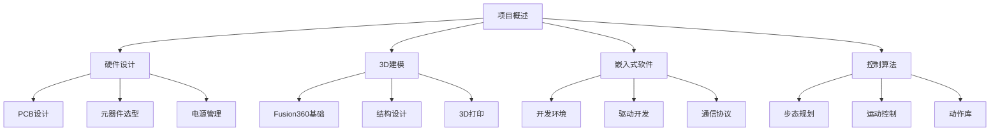

# 嵌入式系统学习

> 通过复刻小智AI四足桌宠项目，深化本科嵌入式知识，从硬件到软件，从理论到实践。

## 学习目标

- 掌握嵌入式系统硬件设计（PCB设计、元器件选型）
- 学习Fusion360进行3D建模和3D打印
- 深入理解四足机器人控制算法和步态规划
- 实践嵌入式软件开发（实时控制、通信协议）
- 完成一个完整的嵌入式项目从设计到实现

## 项目概述

**小智AI四足桌宠**是一个桌面级四足机器人项目，具有以下特点：

- 🦵 **四足结构**：12自由度（每条腿3个舵机）
- 🎮 **交互控制**：支持多种交互方式（蓝牙、WiFi等）
- 🤖 **智能行为**：实现基础步态和动作库
- 🎨 **个性化**：可自定义外观和动作

## 学习路径

## 技术栈

### 硬件
- **PCB设计**：嘉立创EDA
- **主控**：ESP32 / STM32
- **执行器**：舵机（SG90/MG90S等）
- **传感器**：IMU、触摸传感器等
- **通信**：蓝牙、WiFi

### 软件
- **开发环境**：Arduino IDE / PlatformIO / Keil
- **编程语言**：C/C++
- **控制算法**：逆运动学、步态规划

### 3D建模
- **软件**：Fusion360
- **制造**：3D打印（FDM/SLA）

## 文档结构

## 参考资料

- 小智AI开源项目
- 嘉立创开源硬件平台
- Fusion360官方教程
- 四足机器人相关论文和资料

