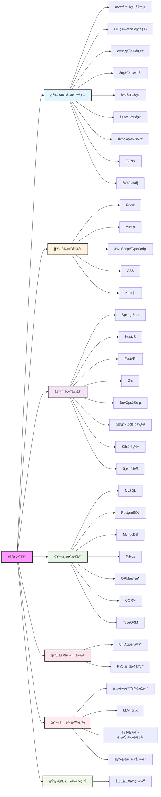

# 自学笔记

```mermaid
graph LR
    A[自学笔记] --> B[🤖 AI人工智能]
    A --> C[💻 å‰ç«¯å¼€å‘]
    A --> D[âš™ï¸ å端开å‘]
    A --> E[ğŸ—„ï¸ æ•°æ®åº“]
    A --> F[📱 客户端开å‘]
    A --> G[🤖 具身智能]
    A --> H[🔧 嵌入å¼ç³»ç»Ÿ]
    
    B --> B1[机器学习基础]
    B --> B2[计算机视觉]
    B --> B3[自然语言处ç†]
    B --> B4[大语言模å‹]
    B --> B5[强化学习]
    B --> B6[多模æ€å­¦ä¹ ]
    B --> B7[图ç¥ç»ç½‘络]
    B --> B8[EGNN]
    B --> B9[图形学]
    
    C --> C1[React]
    C --> C2[Vue.js]
    C --> C3[JavaScript/TypeScript]
    C --> C4[CSS]
    C --> C5[Next.js]
    
    D --> D1[Spring Boot]
    D --> D2[NestJS]
    D --> D3[FastAPI]
    D --> D4[Gin]
    D --> D5[DevOpså®è·µ]
    D --> D6[容器化部署]
    D --> D7[K8s集群]
    D --> D8[中间件]
    
    E --> E1[MySQL]
    E --> E2[PostgreSQL]
    E --> E3[MongoDB]
    E --> E4[Milvus]
    E --> E5[ORM框æ¶]
    E --> E6[GORM]
    E --> E7[TypeORM]
    
    F --> F1[UniApp跨平å°]
    F --> F2[PyQtæ¡Œé¢åº”用]
    
    G --> G1[具身智能概述]
    G --> G2[LLM for X]
    G --> G3[视觉语言动作模å‹]
    G --> G4[视觉语言导航]
    
    H --> H1[嵌入å¼ç³»ç»Ÿ]

    click B1 "./ai/dl" "深度学习笔记"
    click B2 "./ai/cv" "计算机视觉"
    click B3 "./ai/nlp" "自然语言处ç†"
    click B4 "./ai/llm" "大语言模å‹"
    click B5 "./ai/rl" "强化学习"
    click B6 "./ai/multimodal" "多模æ€å­¦ä¹ "
    click B7 "./ai/gat" "图ç¥ç»ç½‘络"
    click B8 "./ai/egnn" "EGNN"
    click B9 "./ai/graphics" "图形学"
    
    click C1 "./frontend/react" "Reactå¼€å‘"
    click C2 "./frontend/vue" "Vue.js"
    click C3 "./frontend/javascript" "JavaScript/TypeScript"
    click C4 "./frontend/css" "CSSæ ·å¼"
    click C5 "./frontend/n_xtjs" "Next.js"
    
    click D1 "./backend/springboot" "Spring Boot"
    click D2 "./backend/nestjs" "NestJS"
    click D3 "./backend/fastapi" "FastAPI"
    click D4 "./backend/gin" "Gin框æ¶"
    click D5 "./backend/devops/ci-cd" "DevOpså®è·µ"
    click D6 "./backend/devops/docker" "容器化部署"
    click D7 "./backend/devops/k8s" "K8s集群"
    click D8 "./backend/middleware/redis" "中间件"
    
    click E1 "./database/mysql" "MySQL"
    click E2 "./database/postgresql" "PostgreSQL"
    click E3 "./database/mongodb" "MongoDB"
    click E4 "./database/milvus" "å‘é‡æ•°æ®åº“Milvus"
    click E5 "./database/prisma" "ORM框æ¶"
    click E6 "./database/gorm" "GORM"
    click E7 "./database/typeorm" "TypeORM"
    
    click F1 "./client/uniapp" "UniApp跨平å°"
    click F2 "./client/pyqt" "PyQtæ¡Œé¢åº”用"
    
    click G1 "./embodied/intro" "具身智能概述"
    click G2 "./embodied/llm4x" "LLM for X"
    click G3 "./embodied/vla" "视觉语言动作模å‹"
    click G4 "./embodied/vln" "视觉语言导航"
    
    click H1 "./embeded/" "嵌入å¼ç³»ç»Ÿ"

    style A fill:#f9f,stroke:#333,stroke-width:4px
    style B fill:#e1f5fe,stroke:#333,stroke-width:2px
    style C fill:#fff3e0,stroke:#333,stroke-width:2px
    style D fill:#f3e5f5,stroke:#333,stroke-width:2px
    style E fill:#e8f5e8,stroke:#333,stroke-width:2px
    style F fill:#fce4ec,stroke:#333,stroke-width:2px
    style G fill:#ffebee,stroke:#333,stroke-width:2px
    style H fill:#f1f8e9,stroke:#333,stroke-width:2px
```