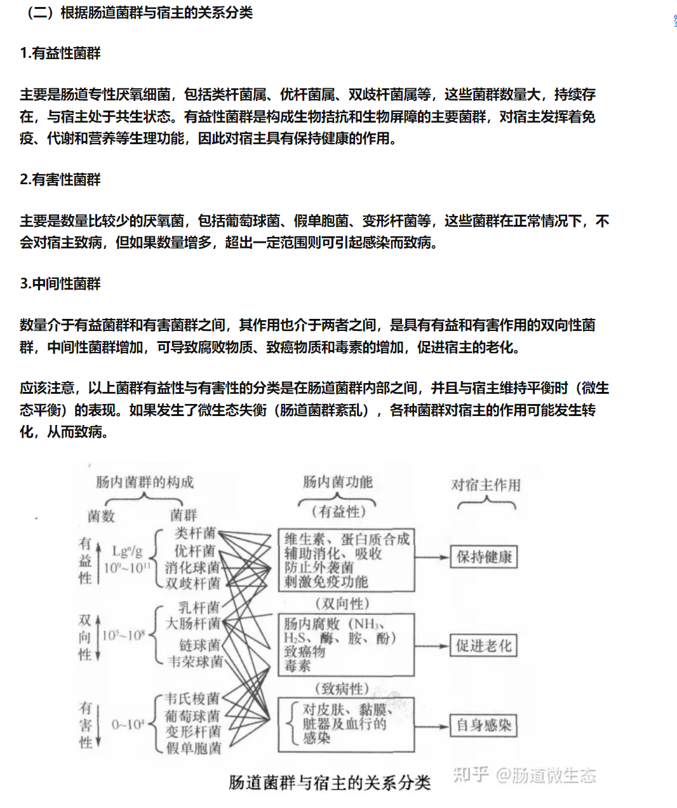
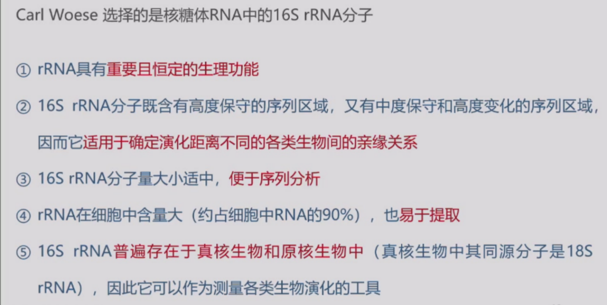
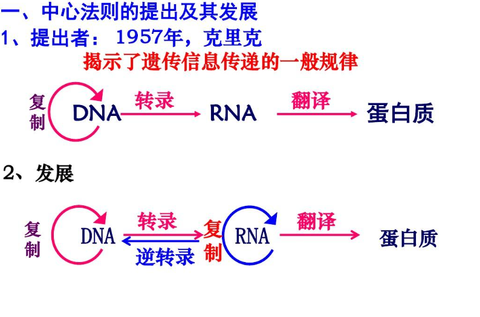
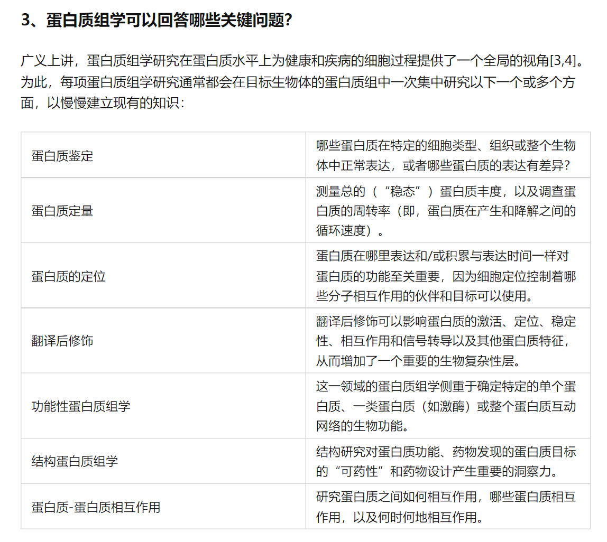
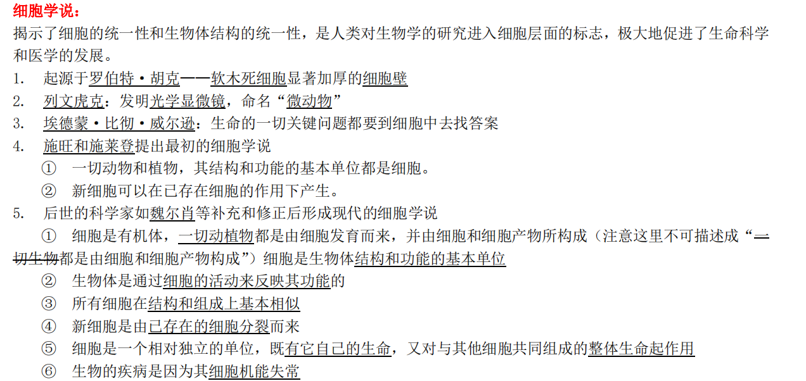

# 大学生物学

下面内容非原创。

## 一、期末考试题型和分数组成

### 1. 考试形式
- 期末闭卷统考（卷面100分）
- 题型构成：
  - **名词解释**（40分）
    - 题量：8题（从小分享主题词中选取）
    - 分值：5分/题
  - **问答题**（60分）
    - 题量：6选4（多答仅计前4题）
    - 分值：15分/题

## 二、期末考试时间
- **日期**：2023年1月11日（周一）
- **时段**：10:30-12:30
- **形式**：线上考试（具体安排待后续通知）

## 三、课程总成绩构成
| 考核项目          | 权重 | 说明                  |
|-------------------|------|-----------------------|
| 线上学习和测试    | 30%  | MOOC平台完成情况      |
| 课后作业/小测验   | 10%  | 各章节随堂检测        |
| 讨论发言（小分享）| 10%  | 课堂主题讨论参与度    |
| 主题演讲（大分享）| 20%  | 小组汇报与材料提交    |
| 期末考试          | 30%  | 闭卷统考              |

## 四、主题演讲材料提交
### 提交要求
1. **文件类型**：
   - 演示文稿（PPT格式）
   - 讲解文稿（Word文档）
2. **内容规范**：
   - PPT需包含完整演讲框架
   - Word文档需详细说明各幻灯片讲解要点
3. **提交方式**：
   - 通过"学在浙大"平台提交
   - 截止时间：演讲结束后48小时内

## 五、复习范围
### （一）平时课堂小分享题目

1.  构件生物、光合作用、双受精、生活史

2.  动物的孤雌生殖、动物的再生、黑腹果蝇与模式动物、动物的变态

3.  疫苗、人类肠道微生物与健康、酿酒微生物与风味、16S rRNA

4.  细胞凋亡与动物发育、干细胞与癌细胞、线粒体疾病、内吞作用与信号传导

5.  母源基因、神经胚形成、性别决定基因、全能干细胞和多潜能干细胞

6.  内稳态、生物节律、激素、细胞免疫

7.  微量元素、饮食模式、蛋白质折叠、酶

8.  中心法则、基因敲除、基因沉默、蛋白质组学

9.  反向遗传学、核外遗传、遗传标记、转基因生物

10. 趋同演化、协同演化、基因水平转移、分子钟理论

11. 盖亚假说、生态位与生态幅、营养级、生态足迹

### （二）名词解释

#### 构件生物

由一个合子发育而成的由一套相似的构件组成个体的一类生物。

在其生长发育的各个阶段，可通过其基本的结构单位的反复形成得到进一步发育，其组织、器官等各个部分是可以改变的。由构件生物组成的种群，受精卵首先发育成一整套构体或构件，然后发育成更多的构件，形成分支结构发育的形式和时间是不可预测的。如大多数高等植物、海绵、水螅和珊瑚是构件生物，构件包括叶子、芽和茎，花也是一种类型的构件。

构件生物是生物有机体结构对环境的适应，如果说对于单体生物以个体数就能反映种群大小，那么对于构件生物就必须进行多个层次的数量统计，即从合子产生的个体数（它与单体生物的个体数相当）和组成每个个体的构件数。只有同时有这数个层次的数量及其变化，才能掌握构件生物的种群动态。

#### 光合作用

[植物](https://zh.wikipedia.org/wiki/%E6%A4%8D%E7%89%A9)、[藻类](https://zh.wikipedia.org/wiki/%E8%97%BB%E9%A1%9E)和[蓝菌](https://zh.wikipedia.org/wiki/%E8%93%9D%E8%8F%8C)等[生产者](https://zh.wikipedia.org/wiki/%E7%94%9F%E7%94%A2%E8%80%85)利用[光能](https://zh.wikipedia.org/wiki/%E5%85%89%E8%83%BD)把[一氧化二氢](https://zh.wikipedia.org/wiki/%E4%B8%80%E6%B0%A7%E5%8C%96%E4%BA%8C%E6%B0%AB)、[二氧化碳](https://zh.wikipedia.org/wiki/%E4%BA%8C%E6%B0%A7%E5%8C%96%E7%A2%B3)或[硫化氢](https://zh.wikipedia.org/wiki/%E7%A1%AB%E5%8C%96%E6%B0%AB)等[无机物](https://zh.wikipedia.org/wiki/%E6%97%A0%E6%9C%BA%E7%89%A9)转变成可以储存[化学能](https://zh.wikipedia.org/wiki/%E5%8C%96%E5%AD%A6%E8%83%BD)的[有机物](https://zh.wikipedia.org/wiki/%E6%9C%89%E6%9C%BA%E7%89%A9)（比如[碳水化合物](https://zh.wikipedia.org/wiki/%E7%A2%B3%E6%B0%B4%E5%8C%96%E5%90%88%E7%89%A9)）的[生物过程](https://zh.wikipedia.org/wiki/%E7%94%9F%E7%89%A9%E8%BF%87%E7%A8%8B)。

植物的光合作用可分为光反应和暗反应。
* **光反应**：2H2O→4[H]+O2↑，发生在叶绿体囊状结构薄膜。
* **暗反应**：利用光反应生成[H]和ATP进行碳的同化作用，使气体二氧化碳还原为糖，发生在叶绿体基质。

光合作用的意义:
1.  **能量转换**: 植物在同化无机碳化物的同时，把太阳能转变为化学能，储存在所形成的有机化合物中。
2.  **调节大气**: 大气之所以能经常保持21%的氧含量，主要依赖于光合作用。

#### 双受精

是被子植物特有的受精现象，指被子植物的雄配子体形成的两个精子，一个与卵融合形成二倍体的合子，另一个与中央细胞的极核（通常两个）融合形成初生胚乳核的现象。双受精后由合子发育成胚，中央细胞发育成胚乳。

被子植物胚囊中极核同卵一样受精产生了具有父本和母本遗传性的通常是三倍体的胚乳，由这种胚乳"哺育"胚可能使后代更加巩固它双亲的特性并更富有生命力，因此有人认为双受精是被子植物繁盛的一个重要原因。

#### 生活史

生活史是在演化生物学以及生态学上是指有关生物体生活史及**生命周期**的理论。经过长时间的演化，不同的生物体往往会在繁殖期以及繁殖行为、寿命等方面取得一定平衡，拥有从**出生、生长、繁殖，再到死亡的独特生活史**。

根据生活史理论，生物体的生活史有7个最重要的特征（trait）：出生时的大小；生长模式；成熟时的年龄和大小；后代的性别比例、大小，以及数量；繁殖投资（按大小和年龄）；死亡时间分布（按大小和年龄）；寿命。

为了适应生存的环境，生物体会拥有具独特特征的生活史。这个过程称为"权衡"（trade-off），比如，生物体在进化上会倾向于获得最大的体型或最大的寿命，或倾向于繁殖更多后代或提升后代的生存率。在生活史中的繁殖上，会分为两种模式：r模式和K模式。

* **r模式**：种群密度很不稳定，通常出生率高、寿命短、个体小，缺乏保护后代的机制，子代死亡率高、有较强的扩散能力，适应于多变的栖息生境。
* **K模式**：其种群密度比较稳定，经常处于K值周围。这类动物通常出生率低、寿命长、个体大多具有较完善的保护后代的机制，子代死亡率低多不具较强的扩散能力，它们适应于稳定的栖息生境。

#### 孤雌生殖

也称单性生殖，即卵不经过受精也能发育成正常的新个体。

与无性生殖不同，是由生殖细胞而非体细胞完成的繁殖现象。产生的个体多数为单倍体，或者是进行重组之后的2倍体，而非无性生殖产生的和母体遗传物质完全相同的个体，所以通常把孤雌生殖归类于有性生殖，而非无性生殖。

* **均等分裂型孤雌生殖**：即卵原细胞正常进行减数分裂，产生3个极体和1个卵细胞，其中卵细胞独立发育为后代个体的现象。（后代为单倍体）
* **卵核与极体融合型孤雌生殖**：即卵原细胞正常进行减数分裂，产生3个极体和1个卵细胞，其中卵细胞与任意极体随机结合，形成"极体-卵细胞-受精卵"，并由此细胞发育成后代个体的现象（后代为2倍体）

孤雌生殖可以在环境**适宜的情况下迅速扩大**种群数量，但不能提高后代的基因多样性。

#### 动物的变态

又称间接发育，指动物**胚后发育过程中所出现形态和习性上一系列显著变化的过程**。大多数[无脊椎动物](https://baike.baidu.com/item/%E6%97%A0%E8%84%8A%E6%A4%8E%E5%8A%A8%E7%89%A9/149803?fromModule=lemma_inlink)门类中都有进行变态的种类，在脊椎动物中变态仅见于鱼类和两栖类。通过变态，不仅动物**成体形态建立**，同时其**生理特性、行为、活动方式和生态表现**都与幼虫期有显著差别。

昆虫类的变态：其多样化在动物界突出，可分为[不完全变态](https://baike.baidu.com/item/%E4%B8%8D%E5%AE%8C%E5%85%A8%E5%8F%98%E6%80%81/7373906?fromModule=lemma_inlink)和完全变态。
* **完全变态**的昆虫一生要经历**卵、幼虫、蛹和成虫**4个阶段。此类昆虫的幼虫与成虫在外观上有较大的差别，比如毛虫和蝴蝶或[蛴螬](https://baike.baidu.com/item/%E8%9B%B4%E8%9E%AC?fromModule=lemma_inlink)和甲虫。完全变态昆虫被认为是昆虫纲中进化程度最高的一群，种类也最繁多。
* **不完全变态**的昆虫一生经历卵、[若虫](https://baike.baidu.com/item/%E8%8B%A5%E8%99%AB?fromModule=lemma_inlink)和成虫3个阶段。它们的幼虫在外观上与成虫差别一般不大，通常只是体型稍小，没有翅。

**意义**：**同一个[物种](https://www.zhihu.com/search?q=%E7%89%A9%E7%A7%8D&search_source=Entity&hybrid_search_source=Entity&hybrid_search_extra={)，在生存的不同阶段，形态完全不同，占据不同[生态位](https://www.zhihu.com/search?q=%E7%94%9F%E6%80%81%E4%BD%8D&search_source=Entity&hybrid_search_source=Entity&hybrid_search_extra={)，增加生存概率，有效地降低种内斗争，便于种群的繁衍**。

研究昆虫变态类型有以下生物学意义：
1.  对于控制昆虫的危害有很大的用处，主要在消灭害虫，控制害虫的数量，在生物防治害虫有很大的作用，减少农药的使用量，和对益虫的毒害和杀害的减少。
2.  可以知道害虫在什么时候变态，变态的弱点，可以在最佳时期采取有利的措施，使害虫不能变态，也就是生物制剂来控制大面积大范围的虫害，比如蝗虫、斜纹夜蛾，蚜虫、水稻螟虫等等。
3.  生物制剂的仿制，如保幼素的制剂的人的运用于化妆品，是皮肤娇嫩，皮肤的再生长等。
4.  生物防治害虫，干扰害虫的发育，减少害虫的危害。

#### 疫苗

是指由**免疫原性物质制成的用于预防接种的生物制品**，可以诱导宿主产生特异性、主动性、保护性的宿主免疫。疫苗保留了病原菌刺激动物体免疫系统的特性。当动物体接触到这种不具伤害力的病原菌后，免疫系统便会产生一定的保护物质，如免疫激素、活性生理物质、特殊抗体等；当动物再次接触到这种病原菌时，动物体的免疫系统便会依循其原有的记忆，制造更多的保护物质来阻止病原菌的伤害。疫苗分为**减毒疫苗、灭活疫苗、亚单位疫苗、核酸疫苗、基因工程疫苗**等。疫苗接种的意义在于接种后机体摆脱相应的传染病或不受感染,人工接种的疫苗和注射的特异性免疫物质,都属于免疫制剂。可以对一些引起传染性疾病的病毒或细菌产生免疫力，提高抗病能力，减少或消灭传染病的传播，为人类创造一个健康的生存环境。

#### 人类肠道微生物与健康

是指人肠道中数量庞大的微生物，他们依靠肠道生存，同时帮助人类完成一些生理生化功能，从多方面影响人体的健康。肠道不仅是人体消化吸收的重要场所，同时也是**最大的免疫器官**，在维持正常免疫防御功能中发挥着极其重要的作用。人体肠道为微生物提供了良好的栖息环境，具有人体自身不具备的代谢功能。影响微生物菌群差异的因素包括宿主的地域、年龄、生理状况、饮食习惯等因素。膳食因素也是改变肠道微生物的重要因素之一，更是最容易改变或控制的因素。不同人群由于膳食习惯的不同，对于膳食因子的摄入有很大不同，由此引起的肠道微生物组成、结构与功能也会存在较大差异。肠道微生物是人体代谢的重要参与者，肠道微生物基因组中富含**参与碳水化合物、氨基酸、甲烷、维生素和短链脂肪酸代谢的基因**，其中很大一部分是人体自身所不具备的。由于肠道是人体内最大的免疫器官，肠道微生物与宿主在肠道黏膜表面的交流**促进了[免疫系统](https://baike.baidu.com/item/%E5%85%8D%E7%96%AB%E7%B3%BB%E7%BB%9F/668170?fromModule=lemma_inlink)的建立和发展**，成为人体重要的免疫屏障。 另外，肠道微生物还通过形成"**菌膜屏障**"而为人体提供保护功能。 滥用抗生素导致的肠道微生物失调会提高肠道疾病发生的几率。同时肠道微生物也与肥胖、糖尿病、渐冻症、心血管疾病有关。**作为人体最庞大、最复杂的[微生态系统](https://baike.baidu.com/item/%E5%BE%AE%E7%94%9F%E6%80%81%E7%B3%BB%E7%BB%9F/5265687?fromModule=lemma_inlink)，肠道微生物本身及其代谢产物不仅能调节人体健康，更在膳食和宿主之间起到了重要的桥梁作用。**

#### 酿酒微生物与风味

利用微生物发酵生产含一定浓度酒精饮料，其风味随酿酒微生物的不同而各异。酿酒微生物按照其功能,大致可以分为三类：
1.  **糖化菌**：把淀粉等营养基质分解为**可发酵性糖**的微生物菌群,主要为**霉菌**。（霉菌代谢产生的淀粉水解酶在酿酒过程中作为酿酒发酵中的糖化剂，将酿酒原料的主要成分------淀粉,分解为短链糊精和可发酵性糖(葡萄糖、果糖等),提供给发酵过程中不能直接利用淀粉的微生物,作为前驱物质被利用,使整个酿酒发酵过程得以顺利进行。）
2.  **发酵菌**：利用**葡萄糖等小分子营养物质**进一步分解代谢,生成以**乙醇**为主的小分子发酵产物的微生物菌群,主要为酵母菌类。
3.  **生香菌**：利用各种营养基质,生成**酯、酸、醇、醛**等丰富复杂的香味成分的微生物菌群,主要是各种来源的细菌。

研究酿酒微生物群落结构及其生物代谢过程，对于揭示酒的风味形成、品质提升以及工艺优化都具有重要意义。目前，研究人员利用各类微生物分析技术，使其更好地服务于酿酒工业中。

#### 16S rRNA

**是细菌上编码rRNA相对应的DNA序列，存在于所有细菌的基因组中。**

**可用于构建细菌系统树。**

是细菌中**特有的核糖体30s亚基的组成部分**。16S rRNA具有多项功能：
* 对于**[核糖体蛋白](https://baike.baidu.com/item/%E6%A0%B8%E7%B3%96%E4%BD%93%E8%9B%8B%E7%99%BD/7221387?fromModule=lemma_inlink)的固定起到脚手架的作用**。
* 3'末端包含反向的[SD序列](https://baike.baidu.com/item/SD%E5%BA%8F%E5%88%97?fromModule=lemma_inlink)，用来与[mRNA](https://baike.baidu.com/item/mRNA?fromModule=lemma_inlink)的AUG[起始密码子](https://baike.baidu.com/item/%E8%B5%B7%E5%A7%8B%E5%AF%86%E7%A0%81%E5%AD%90?fromModule=lemma_inlink)结合。
* 16S rRNA的3'端与S1、S21的结合被发现与[蛋白质合成](https://baike.baidu.com/item/%E8%9B%8B%E7%99%BD%E8%B4%A8%E5%90%88%E6%88%90/7043821?fromModule=lemma_inlink)的开始有关系。
* 与23S进行交互，帮助两个[核糖体](https://baike.baidu.com/item/%E6%A0%B8%E7%B3%96%E4%BD%93?fromModule=lemma_inlink)子单元的结合。（50S+30S）
* 在A site 稳定密码子与反密码子的正确配对。

#### 细胞凋亡与动物发育

**细胞凋亡**（apoptosis）指为维持[内环境](https://baike.baidu.com/item/%E5%86%85%E7%8E%AF%E5%A2%83?fromModule=lemma_inlink)稳定，由**[基因](https://baike.baidu.com/item/%E5%9F%BA%E5%9B%A0/227875?fromModule=lemma_inlink)控制的细胞自主的有序的死亡**。细胞凋亡与[细胞坏死](https://baike.baidu.com/item/%E7%BB%86%E8%83%9E%E5%9D%8F%E6%AD%BB/9564115?fromModule=lemma_inlink)不同，细胞凋亡不是一件被动的过程，而是主动过程，它涉及一系列基因的激活、表达以及调控等的作用，它并不是[病理](https://baike.baidu.com/item/%E7%97%85%E7%90%86/4266030?fromModule=lemma_inlink)条件下，自体损伤的一种现象，而是为更好地适应生存环境而主动争取的一种死亡过程。它涉及染色质凝聚和外周化、细胞质减少、核片段化、细胞质致密化、与周围细胞联系中断、内质网与细胞膜融合(最终细胞片段化形成许多细胞凋亡体)被其他细胞吞入。
* **细胞凋亡的意义**：由**基因控制细胞有目的，有选择性的自我消亡过程**，这种淘汰机制是保证生命进化的基础。生物适应环境的需要，使各种细胞的生存时限达到平衡。

**发育**：一个细胞 (受精卵 zygote) **不断分裂和分化**, 即一个有机体**从其生命开始到性成熟的变化过程**称为发育。它是从**单个细胞演变成复杂的多细胞生物**的过程, 是生命现象的发展、生物有机体以遗传信息为基础的自我构建和自我组织的过程, 是基因按照特定的时间和空间选择性表达并逐步转化为特征表型的过程。
* **动物发育的主要特征**:
    1.  具有**严格的时间和空间的次序性**，这种次序性由发育的遗传程序控制。
    2.  发育是**机体各细胞协同作用的结果**, 是一系列基因网络性控制的结果。细胞分裂、分化、迁移、凋亡、生长、衰老和死亡等。

#### 干细胞与癌细胞

**干细胞**是一类具有**无限的或者永生的自我更新能力的细胞**、**能够产生至少一种类型的、高度分化的子代细胞**。
**癌细胞**，是一种变异的细胞，是产生癌症的病源。癌细胞与正常细胞不同，有**无限增殖、可转化和易转移**三大特点，能够无限增殖并破坏正常的细胞组织。癌细胞除了分裂失控外（能进行无限分裂），还会局部侵入周围正常组织甚至经由体内循环系统或淋巴系统转移到身体其他部分。癌细胞分恶性和良性两种。

肿瘤干细胞与正常干细胞同属于干细胞范畴，具有许多相同的特点：
1.  均处于未分化状态，具有自我更新和多向分化潜能，增殖的同时可诱导血管形成。
2.  都具有对称分裂和不对称分裂两种分裂方式。
3.  具有相似的调节生长的信号通路。
4.  两者都具有端粒酶活性和扩增端粒酶重复序列，而人类终末分化体细胞不具有端粒酶活性。

**肿瘤干细胞并不等同于正常干细胞、有其自身特性：**
1.  干细胞自我更新具有**负反馈调节机制**，其增殖与分化处于平衡状态，是有序的。而肿瘤干细胞的这种负反馈机制已被破坏，其增殖分化是无序和失控的。
2.  与正常干细胞相比，肿瘤干细胞分化成熟能力缺乏，因此肿瘤细胞往往是**低分化**的。
3.  肿瘤干细胞具有**积累复制错误**的倾向，而正常干细胞可通过多种途径防止这种情况发生。
4.  两者某些**信号传导通路**不同，可作为治疗的靶点，如肿瘤抑制蛋白通路在正常造血干细胞的自我更新和白血病的形成中具有不同的作用途径。

#### 线粒体疾病

线粒体病是遗传缺损引起**线粒体代谢酶缺陷**，致使**ATP合成障碍、能量来源不足**导致的一组异质[性病](https://baike.baidu.com/item/%E6%80%A7%E7%97%85/292397?fromModule=lemma_inlink)变。[线粒体脑肌病](https://baike.baidu.com/item/%E7%BA%BF%E7%B2%92%E4%BD%93%E8%84%91%E8%82%8C%E7%97%85/7043851?fromModule=lemma_inlink)的不同类型发病年龄不同。

线粒体是密切与能量代谢相关的细胞器，无论是**细胞的成活（氧化磷酸化）和细胞死亡（凋亡）均与线粒体功能有关**，特别是呼吸链的氧化磷酸化异常与许多人类疾病有关。根据线粒体病变部位不同可分为：线粒体[肌病](https://baike.baidu.com/item/%E8%82%8C%E7%97%85/9964527?fromModule=lemma_inlink)，线粒体病变侵犯骨骼肌为主；线粒体脑肌病，病变同时侵犯骨骼肌和中枢神经系统。
* **病因**：线粒体是细胞内提供能量的细胞器，人类mtDNA是长16569bp的环状双链分子，分轻链和重链，含37个基因，主要编码呼吸链及与能量代谢有关的蛋白。mtDNA缺失或点突变使编码线粒体氧化代谢过程必需的酶或载体发生障碍，糖原和脂肪酸等不能进入线粒体充分利用和产生足够的ATP，导致能量代谢障碍和产生复杂的临床症状。

#### 内吞作用与信号传导

**内吞作用**又称[入胞作用](https://baike.baidu.com/item/%E5%85%A5%E8%83%9E%E4%BD%9C%E7%94%A8/4899457?fromModule=lemma_inlink)或[胞吞作用](https://baike.baidu.com/item/%E8%83%9E%E5%90%9E%E4%BD%9C%E7%94%A8/6814282?fromModule=lemma_inlink)，是通过**[质膜](https://baike.baidu.com/item/%E8%B4%A8%E8%86%9C/7939156?fromModule=lemma_inlink)的[变形运动](https://baike.baidu.com/item/%E5%8F%98%E5%BD%A2%E8%BF%90%E5%8A%A8/320612?fromModule=lemma_inlink)将细胞外[物质转运](https://baike.baidu.com/item/%E7%89%A9%E8%B4%A8%E8%BD%AC%E8%BF%90/6800271?fromModule=lemma_inlink)入细胞内的过程**。根据入胞物质的不同大小，以及入胞机制的不同可将内吞作用分为三种类型：[吞噬作用](https://baike.baidu.com/item/%E5%90%9E%E5%99%AC%E4%BD%9C%E7%94%A8/5331409?fromModule=lemma_inlink)、[吞饮作用](https://baike.baidu.com/item/%E5%90%9E%E9%A5%AE%E4%BD%9C%E7%94%A8?fromModule=lemma_inlink)、[受体介导的内吞作用](https://baike.baidu.com/item/%E5%8F%97%E4%BD%93%E4%BB%8B%E5%AF%BC%E7%9A%84%E5%86%85%E5%90%9E%E4%BD%9C%E7%94%A8/7911155?fromModule=lemma_inlink)。

**信号传导**：可以**把各种信号通过细胞膜进入细胞, 逐步引起细胞物质主要是蛋白质变化的过程**，称为信号传导。它是一个多酶级联反应过程, 各条信号通路之间通过细胞间[信号蛋白](https://baike.baidu.com/item/%E4%BF%A1%E5%8F%B7%E8%9B%8B%E7%99%BD/7991457?fromModule=lemma_inlink)的相互作用在体内组成一高度有序的[调控网络](https://baike.baidu.com/item/%E8%B0%83%E6%8E%A7%E7%BD%91%E7%BB%9C/5844691?fromModule=lemma_inlink)。哺乳动物维持正常的活动需要多种信号转导通路以**维持机体细胞对信号刺激反应的完整性和协调性**。有许多内吞作用与信号转导有关。

#### 母源基因

受精前即卵子发育时**母体细胞转录的RNA甚至翻译的蛋白质**，产物定位在**成熟的卵的细胞质**中。母体基因产物量和活性形成空间差异并激活不同的合子基因，使躯体轴线不同区域里呈现一定的活性谱。

在[卵子发生](https://baike.baidu.com/item/%E5%8D%B5%E5%AD%90%E5%8F%91%E7%94%9F?fromModule=lemma_inlink)（oogenesis）过程中表达，并将其产物（mRNA或蛋白质）储存在卵母细胞中的基因称为[母源基因](https://baike.baidu.com/item/%E6%AF%8D%E6%BA%90%E5%9F%BA%E5%9B%A0?fromModule=lemma_inlink)。在**胚胎发育的决定中起重要作用**。

#### 神经胚形成

**神经胚形成：胚胎在3个胚层建立之后进入神经胚形成阶段，形成[脑和脊髓的原基-神经管](neural tube)，是脊椎动物器官形成的前奏。随后各种器官原基相继形成。**

神经胚（neurula）亦称髓胚。主要是指[脊椎动物](https://baike.baidu.com/item/%E8%84%8A%E6%A4%8E%E5%8A%A8%E7%89%A9?fromModule=lemma_inlink) 的发生中在**原肠形成**（或者原条期）**之后**，从出现**中枢神经系统**原基的**神经板**时期开始，到**神经板闭合变成[神经管](https://baike.baidu.com/item/%E7%A5%9E%E7%BB%8F%E7%AE%A1?fromModule=lemma_inlink)期间**的胚胎。在这一时期**外胚层分化出神经板及表皮区**，在神经板之下的为头肠、前索板、脊索原基、预定体节的位置，在多数情况下，表皮区的外胚层被侧板的[体壁中胚层](https://baike.baidu.com/item/%E4%BD%93%E5%A3%81%E4%B8%AD%E8%83%9A%E5%B1%82/5956452?fromModule=lemma_inlink)反包着。主要器官原基在各胚层已开始出现，但组织分化尚未开始。

#### 性别决定基因

**决定个体性别发育的基因**被称为性别决定基因。最主要的是**Y染色体短臂末端的SRY基因**，这个基因决定了男性的性发育，如果由于染色体易位等原因如果女性核型的人（女性核型为46,XX，男性核型为46,XY）携带了SRY基因，就会表现出男性的性特征，如果男性的SRY基因出了问题，就会表现出女性的性特征，也就是所谓的假两性畸形。

#### 全能干细胞

**全能干细胞是能够分化发育成为各种[组织器官](https://baike.baidu.com/item/%E7%BB%84%E7%BB%87%E5%99%A8%E5%AE%98/4536359?fromModule=lemma_inlink)的细胞**，其全能性很强。全能干细胞是指**受精卵到[卵裂](https://baike.baidu.com/item/%E5%8D%B5%E8%A3%82/2938533?fromModule=lemma_inlink)期32细胞前**的所有细胞。全能干细胞是指**具有无限分化潜能，能分化成所有组织和器官的[干细胞](https://baike.baidu.com/item/%E5%B9%B2%E7%BB%86%E8%83%9E/301672?fromModule=lemma_inlink)**。具有形成完整个体分化潜能。但由于伦理与免疫排斥的原因，目前仅做科学研究，在临床医学上并没有被广泛应用。

#### 多潜能干细胞

多能干细胞种类繁多，其中间充质干细胞是目前应用最广泛的干细胞类型，临床上主要应用于解决多种血液系统疾病、心血管疾病、神经系统疾病、自身免疫性疾病以及关节修复等。**多能干细胞分为两类，一类称为多潜能干细胞**，与全能干细胞相比，多潜能干细胞已经**失去了发育成完整个体的能力，但仍具有分化为体内全部200多种类型细胞的潜能**。如囊胚内细胞团细胞和原始生殖细胞。又如存在于人体骨髓中的造血干细胞，可以分化成红细胞、血小板、粒细胞和淋巴细胞等十种以上的血细胞，但它们都不能分化出体内全部类型的细胞。

#### 内稳态

是指身体内部所保持的理化状态及化学成分、其他一些生命活动存在一定的**动态平衡**。细胞由细胞膜与其周围环境隔开，细胞内部情况与细胞周围液体有很大差别，细胞与周围液体不断进行物质交换并保持其内部的恒定性，这就是**细胞稳态**。保持整个身体的稳态，在高等动物要靠激素和神经系统的整合作用。激素保持身体的稳态，它可有及时使激素释放和停止分泌的能力，这就是**激素分泌的稳态**的保持。**[中枢神经系统](https://baike.baidu.com/item/%E4%B8%AD%E6%9E%A2%E7%A5%9E%E7%BB%8F%E7%B3%BB%E7%BB%9F/2217606?fromModule=lemma_inlink)**在保持身体稳态中起重要作用，而其本身也要保持稳态。中枢神经系统的稳态依赖于其所接触的内环境的恒定性。
* **意义**：具有内稳态机制的生物借助于内环境的稳定而相对独立于外界条件，大大提高了生物对[生态因子](https://baike.baidu.com/item/%E7%94%9F%E6%80%81%E5%9B%A0%E5%AD%90/1286472?fromModule=lemma_inlink)的耐受范围。

#### 生物节律

生物周期现象又叫生物节律（biological clock），亦称"生物钟"。有机体内部发生的周期性变化过程。最典型的例子是睡眠与觉醒的周期性交替。交替之所以表现出准确的周期性，一方面决定于**身体器官和细胞机能状态的周期性变化**，另一方面是**环境的影响**，如太阳和月亮升起、下落的周期变化。太阳、月亮的运动规律直接影响地球上生物的周期性变化，如谷物随季节生长；候鸟随潮汛变化而迁栖（潮汛是月亮对海洋的引力引起的）；人的体温在一昼夜内出现周期性升降等。生物钟现象使人在一天的不同时刻工作效率不一。**骤然改变正常的昼夜周期（如从地球的东部迁到西部居住）会使人的机体功能混乱，情绪烦躁，工作效率降低**。

即生物钟，是由生物体生命活动所产生的一种内在节律。人体生物节律是指体力节律、情绪节律和智力节律。 每个人从他出生那天起一直到生命终结,都存在着体力23天、情绪28天、智力33天的**[周期性](https://baike.baidu.com/item/%E5%91%A8%E6%9C%9F%E6%80%A7/6458545?fromModule=lemma_inlink)波动规律**,称为人体生物节律。每一个周期中又存在着高潮期、低潮期和临界期。 由于它具有准确的时间性，因此，也称之为人体生物钟。在我们日常生活中，有人会觉得自己的[体力](https://baike.baidu.com/item/%E4%BD%93%E5%8A%9B/9480397?fromModule=lemma_inlink)、情绪或[智力](https://baike.baidu.com/item/%E6%99%BA%E5%8A%9B/129379?fromModule=lemma_inlink)有时很好，有时很坏，人从他诞生之日起，直至生命终结，其自身的体力、情绪和智力都存在着由强至弱、由弱至强的周期性起伏变化。人们把这种现象称作生物节律，或[生物节奏](https://baike.baidu.com/item/%E7%94%9F%E7%89%A9%E8%8A%82%E5%A5%8F/3839629?fromModule=lemma_inlink)、[生命节律](https://baike.baidu.com/item/%E7%94%9F%E5%91%BD%E8%8A%82%E5%BE%8B/8264565?fromModule=lemma_inlink)等。产生这种现象的原因是生物体内存在着[生物钟](https://baike.baidu.com/item/%E7%94%9F%E7%89%A9%E9%92%9F/439601?fromModule=lemma_inlink)，它自动地调节和控制着人体的行为和活动。 
* **意义**：是分析事故原因、预防事故发生的有力措施；利用生物节律规律来指导运动训练是十分重要的；同时也可以根据节律研发药物治疗疾病。

#### 激素

激素是高度分化的内分泌细胞合成并直接分泌入血的**化学信息物质**，它通过调节各种组织细胞的代谢活动来影响人体的生理活动。

内分泌细胞产生的可以**影响机体内其他细胞活动的化学物质**。仅需很小剂量的激素便可以改变细胞的新陈代谢。

激素的种类较多而数量极微(多数为毫微克甚至微微克水平)，它**既非机体的能量来源又非组成机体的结构物质**，但通过传递信息，在协调新陈代谢、生长发育等生理过程方面充当了重要的角色。激素的传递方式主要有三种：大多数激素分泌后直接进入血液，随血液循环到达一定的组织细胞才发挥作用，这种细胞叫**靶细胞**，靶细胞上有具特殊立体构型的物质(激素受体)与相应的激素结合，并识别激素所携带的信息，把它转化为细胞内一系列复杂的化学反应，从而产生特定的生理效应。这种方式的激素要随血流到达靶细胞，所以叫"远距分泌"。有些激素分泌出来以后通过细胞间隙液就近扩散，作用于邻近细胞(如某些消化道激素)，这种方式叫"旁分泌"。还有一些激素是由神经细胞(如下丘脑)分泌的，叫"神经激素"，沿轴突借轴浆流动而到达靶细胞，这种方式叫"神经分泌"。激素按其化学本质可分为**含氮的蛋白类激素**(由氨基酸、肽、蛋白衍生而成)和**[类固醇](https://baike.baidu.com/item/%E7%B1%BB%E5%9B%BA%E9%86%87/2692781?fromModule=lemma_inlink)类激素**两大类；而就其生理功能来说可分为三大类：一类是调控机体新陈代谢和维持内环境相对稳定的，如胰岛素、胃肠激素、甲状旁腺激素等；一类是促进细胞增殖分化，控制机体生长发育和生殖机能，并影响其衰老过程的，如生长激素、性激素等；还有一类与神经系统密切配合，增强机体对环境的适应，如肾上腺皮质激素和垂体激素等。激素分泌量**过多或过少都会引起机体功能的紊乱**，所以临床上常以激素水平的测定做为诊断某些疾病的依据，并将许多激素做为治疗药物应用于临床。

#### 细胞免疫

细胞免疫又称[细胞介导免疫](https://baike.baidu.com/item/%E7%BB%86%E8%83%9E%E4%BB%8B%E5%AF%BC%E5%85%8D%E7%96%AB/5547249?fromModule=lemma_inlink)。狭义的细胞免疫仅指**[T细胞](https://baike.baidu.com/item/T%E7%BB%86%E8%83%9E/111834?fromModule=lemma_inlink)介导的免疫应答**，即T细胞**受到抗原刺激后，分化、[增殖](https://baike.baidu.com/item/%E5%A2%9E%E6%AE%96/9171601?fromModule=lemma_inlink)、转化为[致敏T细胞](https://baike.baidu.com/item/%E8%87%B4%E6%95%8FT%E7%BB%86%E8%83%9E/6200244?fromModule=lemma_inlink)**，对抗原的直接杀伤作用及致敏T细胞所释放的**[细胞因子](https://baike.baidu.com/item/%E7%BB%86%E8%83%9E%E5%9B%A0%E5%AD%90/658581?fromModule=lemma_inlink)**的协同杀伤作用。T细胞介导的免疫应答的特征是出现以[单核细胞](https://baike.baidu.com/item/%E5%8D%95%E6%A0%B8%E7%BB%86%E8%83%9E/10319973?fromModule=lemma_inlink)浸润为主的炎症反应和/或特异性的细胞毒性。广义的细胞免疫还应该包括原始的吞噬作用以及NK细胞介导的细胞毒作用。细胞免疫是**清除细胞内寄生微生物的最为有效的防御反应**，也是排斥同种移植物或肿瘤抗原的有效手段。

细胞免疫的产生也分为**感应、反应和效应**三个阶段。其作用机制包括两个方面：
1.  致敏T细胞的**直接杀伤**作用。当[致敏T细胞](https://baike.baidu.com/item/%E8%87%B4%E6%95%8FT%E7%BB%86%E8%83%9E/6200244?fromModule=lemma_inlink)与带有相应抗原的[靶细胞](https://baike.baidu.com/item/%E9%9D%B6%E7%BB%86%E8%83%9E?fromModule=lemma_inlink)再次接触时，两者发生[特异性](https://baike.baidu.com/item/%E7%89%B9%E5%BC%82%E6%80%A7?fromModule=lemma_inlink)结合，产生刺激作用，使靶细胞膜通透性发生改变，引起靶细胞内渗透压改变，靶细胞肿胀、溶解以致死亡。致敏T细胞在杀伤靶细胞过程中，本身未受伤害，可重新攻击其他靶细胞。参与这种作用的致敏T细胞，称为杀伤[T细胞](https://baike.baidu.com/item/T%E7%BB%86%E8%83%9E?fromModule=lemma_inlink)。
2.  通过**[淋巴因子](https://baike.baidu.com/item/%E6%B7%8B%E5%B7%B4%E5%9B%A0%E5%AD%90?fromModule=lemma_inlink)相互配合**、协同杀伤靶细胞。如[皮肤反应](https://baike.baidu.com/item/%E7%9A%AE%E8%82%A4%E5%8F%8D%E5%BA%94/12729872?fromModule=lemma_inlink)因子可使血管通透性增高，使吞噬细胞易于从血管内游出；[巨噬细胞](https://baike.baidu.com/item/%E5%B7%A8%E5%99%AC%E7%BB%86%E8%83%9E?fromModule=lemma_inlink)趋化因子可招引相应的[免疫细胞](https://baike.baidu.com/item/%E5%85%8D%E7%96%AB%E7%BB%86%E8%83%9E?fromModule=lemma_inlink)向抗原所在部位集中，以利于对抗原进行吞噬、杀伤、清除等。由于各种淋巴因子的协同作用，扩大了[免疫效果](https://baike.baidu.com/item/%E5%85%8D%E7%96%AB%E6%95%88%E6%9E%9C?fromModule=lemma_inlink)，达到清除抗原异物的目的。

#### 微量元素

约有70种，指的是在人体中含量低于人体质量0.005%~0.01%的元素。包括铁、铜、锰、锌、钴、钼、铬、镍、钒、氟、硒、碘、硅、锡。微量元素在人体内含量虽然极微小，但具有强大的生物学作用，它们参与酶、激素维生素和核酸的代谢过程，其生理功能主要表现为协助输送宏量元素；作为酶的组成成分或激活剂；在激素和维生素中起独特作用;影响核酸代谢等。

#### 饮食模式

指饮食中不同食物的数量、比例、种类或者组合，以及习惯性消费的频率。膳食模式不仅反映人们的饮食习惯和生活水平的高低，同时也反映一个民族的传统文化，一个国家的经济发展和一个地区的环境和资源等多方面的情况。

* **DASH饮食**是由1997年美国的一项大型高血压防治计划发展出来的饮食，在这项计划中发现，饮食中如果能摄食足够的蔬菜、水果、低脂(或脱脂)奶，以维持足够的钾、镁、钙等离子的摄取，并尽量减少饮食中油脂量(特别是富含饱和脂肪酸的动物性油脂)，可以有效地降低血压。因此，常以DASH 饮食来作为预防及控制高血压的饮食模式。
* **地中海饮食**泛指希腊、西班牙、法国和意大利南部等处于地中海沿岸的南欧各国以蔬菜水果、鱼类、五谷杂粮、豆类和橄榄油为主的饮食风格。研究发现地中海饮食可以减少患心脏病的风险，还可以保护大脑免受血管损伤，降低发生中风和记忆力减退的风险。有数据统计，地中海地区居民平均寿命高居于全球之冠，且生活质量较高。现在也用"地中海式饮食"代指有利于健康的，简单、清淡以及富含营养的饮食。

#### 蛋白质折叠

**蛋白质获得其功能性结构和构象的过程**。通过这一物理过程，蛋白质**从无规则卷曲折叠成特定的功能性三维结构**。在从mRNA序列翻译成线性的肽链时，蛋白质都是以去折叠多肽或无规则卷曲的形式存在。

蛋白质的基本单位为氨基酸，而蛋白质的一级结构指的就是其氨基酸序列。蛋白质会由所含氨基酸残基的亲水性、疏水性、带正电、带负电等特性通过残基间的相互作用而折叠成一立体的三级结构。一般三级才有生物活性。

#### 中心法则

是指遗传信息从DNA传递给RNA，再从RNA传递给蛋白质，即完成遗传信息的转录和翻译的过程。也可以从DNA传递给DNA，即完成DNA的复制过程。这是**所有有细胞结构**的生物所遵循的法则。在某些病毒中的RNA自我复制（如烟草花叶病毒等）和在某些病毒中能以RNA为模板逆转录成DNA的过程（某些致癌病毒）是对中心法则的补充。

**意义：**
中心法则是**现代生物学中最重要最基本的规律**之一， 其在探索生命现象的本质及普遍规律方面起了巨大的作用，极大地推动了现代生物学的发展，是现代生物学的理论基石，并为生物学基础理论的统一指明了方向，在生物科学发展过程中占有重要地位。 [遗传物质](https://baike.baidu.com/item/%E9%81%97%E4%BC%A0%E7%89%A9%E8%B4%A8?fromModule=lemma_inlink)可以是DNA，也可以是RNA。细胞的遗传物质都是DNA，只有一些病毒的遗传物质是RNA。这种以RNA为遗传物质的病毒称为反转录病毒（retrovirus），在这种病毒的感染周期中，单链的RNA分子在反转录酶（reverse transcriptase）的作用下，可以反转录成单链的DNA，然后再以单链的DNA为模板生成双链DNA。双链DNA可以成为[宿主细胞](https://baike.baidu.com/item/%E5%AE%BF%E4%B8%BB%E7%BB%86%E8%83%9E?fromModule=lemma_inlink)基因组的一部分，并同宿主细胞的基因组一起传递给[子细胞](https://baike.baidu.com/item/%E5%AD%90%E7%BB%86%E8%83%9E?fromModule=lemma_inlink)。在反转录酶催化下，RNA分子产生与其序列互补的DNA分子，这种DNA分子称为互补DNA（complementary DNA），简写为cDNA，这个过程即为逆转录（reverse transcription）。

由此可见，[遗传信息](https://baike.baidu.com/item/%E9%81%97%E4%BC%A0%E4%BF%A1%E6%81%AF?fromModule=lemma_inlink)并不一定是从DNA单向地流向RNA，RNA携带的遗传信息同样也可以流向DNA。但是DNA和RNA中包含的遗传信息只是单向地流向蛋白质，迄今为止还没有发现蛋白质的信息逆向地流向核酸。这种遗传信息的流向，就是[克里克](https://baike.baidu.com/item/%E5%85%8B%E9%87%8C%E5%85%8B?fromModule=lemma_inlink)概括的中心法则(central dogma)的遗传学意义。

任何一种假设都要经受科学事实的检验。[反转录酶](https://baike.baidu.com/item/%E5%8F%8D%E8%BD%AC%E5%BD%95%E9%85%B6?fromModule=lemma_inlink)的发现，使中心法则对关于遗传信息从DNA单向流入RNA做了修改，遗传信息是可以在DNA与RNA之间相互流动的。那么，对于DNA和RNA与蛋白质分子之间的信息流向是否只有核酸向蛋白质分子的单向流动，还是蛋白质分子的信息也可以流向核酸，中心法则仍然肯定前者。可是，病原体[朊粒](https://baike.baidu.com/item/%E6%9C%8A%E7%B2%92?fromModule=lemma_inlink)(Prion)的行为曾对中心法则提出了严重的挑战。

实验证明，朊粒确实是不含DNA和RNA的蛋白质颗粒，但它不是传递遗传信息的载体，也不能[自我复制](https://baike.baidu.com/item/%E8%87%AA%E6%88%91%E5%A4%8D%E5%88%B6?fromModule=lemma_inlink)，而仍是由[基因](https://baike.baidu.com/item/%E5%9F%BA%E5%9B%A0?fromModule=lemma_inlink)编码产生的一种正常蛋白质的异构体。

#### 基因敲除

指利用外源的已突变的基因通过**同源重组**的方法替换掉内源的正常同源基因，从而使**内源基因失活而表现突变体**的性状的技术或方法。它是针对某个序列已知但功能未知的序列，改变生物的遗传基因，令**特定的基因功能丧失作用，从而使部分功能被屏蔽**，并可进一步对生物体造成影响，进而推测出该基因的生物学功能。

**步骤：**
1.  **获得干细胞**：用于打靶。
2.  **载体构建**：把目的基因和与细胞内靶基因特异片段同源的DNA分子都重组到带有标记基因（如neo基因，TK基因等）的载体上，此重组载体即为打靶载体。
3.  **导入基因**：将基因打靶载体通过一定的方式（常用电穿孔法）导入同源的胚胎干细胞（EScell）中，使外源DNA与胚胎干细胞基因组中相应部分发生同源重组，将打靶载体中的DNA序列整合到内源基因组中从而得以表达。
4.  **性状改变**。

基因敲除就是通过同源重组将外源基因定点整合入靶细胞基因组上某一确定的位点，以达到定点修饰改造染色体上某一基因的目的的一种技术。它**克服了随机整合的盲目性和偶然性**，是一种**理想的修饰、改造生物遗传物质的方法**。这项技术的诞生可以说是**分子生物学技术上继转基因技术后的又一革命**。尤其是条件性、诱导性基因打靶系统的建立，使得对基因靶位时间和空间上的操作更加明确、效果更加精确、可靠，它的发展将为发育生物学、分子遗传学、免疫学及医学等学科提供了一个全新的、强有力的研究、治疗手段，具有广泛的应用前景和商业价值。基因敲除技术主要应用于动物模型的建立，而最成熟的实验动物是小鼠，对于大型哺乳动物的基因敲除模型还处于探索阶段。

#### 基因沉默

泛指生物细胞藉**各种基因表现调控机制抑制某一基因表现的现象**，机制包括DNA甲基化、位置效应、基因组铭印、**遗传印记**、基因转应、重复序列诱导点突变、副突变、RNA静默（包括RNA干扰、基因压制与非配对DNA介导的减数分裂沉默等，由miRNA、siRNA、piRNA与rasiRNA等小RNA引导）和mRNA降解等，例如许多mRNA的3'非转译区（3'UTR）即可和miRNA结合，以降低mRNA的转译达成基因静默。

生物研究中，研究人员为研究一个基因的功能，会以RNA干扰或CRISPR等基因敲落技术达成基因静默，**大幅降低目标基因的表现**以检测其影响，进而推得目标基因的功能。相较于基因剔除完全移除目标基因的表现，基因敲落后目标基因表现虽被抑制，但仍保有一定程度的表现量。

总之，基因沉默是基因表达调控的一种重要方式，是生物体在基因调控水平上的一种自我保护机制，在外源DNA侵入、病毒侵染和DNA转座、重排中有普遍性。对基因沉默进行深入研究，可帮助人们进一步揭示生物体基因遗传表达调控的本质，在基因克服基因沉默现象，从而使外源基因能更好的按照人们的需要进行有效表达；利用基因沉默在基因治疗中有效抑制有害基因的表达，达到治疗疾病的目的，所以研究基因沉默具有极其重要的理论和实践意义。

#### 蛋白质组学

* **蛋白质组**：指的是一个生物体可以表达的所有蛋白质。每个物种都有自己的、独特的蛋白质组。与基因组（每个生物体内的全套基因）不同，蛋白质组的组成随着时间和整个生物体的变化而不断变化。因此，当科学家提到蛋白质组时，他们有时也是指某一特定时间点的蛋白质组（如胚胎与成熟生物体），或指生物体内某一特定细胞类型或组织的蛋白质组。
* **蛋白质组学**：是对蛋白质组的研究，研究不同的蛋白质之间如何相互作用以及它们在生物体内发挥的作用。

通过研究在**大规模水平上**研究蛋白质的特征，包括蛋白质的**表达水平**，翻译后的**修饰**，蛋白与蛋白**相互作用**等，由此获得蛋白质水平上的关于疾病发生，细胞代谢等过程的整体而全面的认识。

在蛋白质组学中，有多种方法可以研究蛋白质。 通常，可以通过使用抗体（免疫测定）或质谱法检测蛋白质。 如果分析复杂的生物样品，需要在定量斑点印迹分析(quantitative dot blot analysis) (缩写：qdb) 中使用非常特异的抗体，或者在检测步骤之前需要使用生化分离，因为样品中的分析物太多而无法进行 准确的检测和量化。

不同的mRNA翻译成不同的蛋白质，而且很多蛋白质被翻译后也在细胞中会有非常多样的化学修饰。这些化学修饰都对蛋白质的功能非常关键。例如磷酸化修饰，甲基化修饰，乙酰基化修饰，糖基化修饰，氧化修饰，硝基化修饰等。

**意义：**

#### 酶
由[活细胞](https://baike.baidu.com/item/%E6%B4%BB%E7%BB%86%E8%83%9E/6368522?fromModule=lemma_inlink)产生的、对其底物具有高度特异性和高度催化效能的[蛋白质](https://baike.baidu.com/item/%E8%9B%8B%E7%99%BD%E8%B4%A8/309120?fromModule=lemma_inlink)或[RNA](https://baike.baidu.com/item/RNA/98142?fromModule=lemma_inlink)。
1.  酶具有高效率的催化能力；其效率是一般无机催化剂的10的7次幂～10的13次幂。
2.  酶具有专一性；（每一种酶只能催化一种或一类化学反应。）
3.  酶在生物体内参与每一次反应后，它本身的性质和数量都不会发生改变（与催化剂相似）；
4.  酶的作用条件较温和。
    * 酶所催化的化学反应一般是在比较温和的条件下进行的。
    * 在最适宜的温度和PH条件下，酶的活性最高。温度和PH偏高或偏低，酶活性都会明显降低。一般来说，动物体内的酶最适温度在35～40℃之间；植物体内的酶最适温度在40～50℃之间；动物体内的酶最适PH大多在6.5～8.0之间，但也有例外，如胃蛋白酶的最适PH为1.5；植物体内的酶最适PH大多在4.5～6.5之间。
    * 过酸、过碱或温度过高，会使酶的空间结构遭到破坏，使酶永久失活。0℃左右时，酶的活性很低，但酶的空间结构稳定，在适宜的温度下酶的活性可以升高。
5.  活性可调节性。
6.  有些酶的催化性与辅因子有关。
7.  易变性：大多数酶都是蛋白质，因而会被高温、强酸、强碱等破坏。

酶对化学反应的催化效率称为酶活性。

#### 反向遗传学

广义的反向遗传学泛指从生物基因组及其所含生物信息出发，**采用"基因→性状"的研究路线**，对生物体进行**遗传和变异规律的研究**，揭示生物的**表现型与基因型之间的关系**，探讨生命遗传规律的分子遗传学分支学科。从方法学的角度而言，反向遗传学是在**获得生物基因信息的基础上，对基因进行修饰，如基因定点突变、基因插入/缺失和基因置换等，来研究生物基因结构和功能的策略**。

**研究方法：**
反向遗传学，又称DNA分析遗传学，常采用离体定向诱变技术来制造和分析突变。离体定向诱变与一般的诱变不同，通常所讲的自发突变和各种诱发突变都是在细胞内发生的，要先从表现型上的变化发现突变，继而分离突变体，再采用遗传学方法和其他方法进行分析，才能知道突变的性质。包括基因突变，基因置换，基因重组，基因敲除、基因沉默等方法。

**意义**：与反向遗传学操作相关的各种技术统称为反向遗传学技术，包括RNA干扰（RNA interference，RNAi）技术、基因沉默技术、基因体外转录技术等，是DNA[重组技术](https://www.zhihu.com/search?q=%E9%87%8D%E7%BB%84%E6%8A%80%E6%9C%AF&search_source=Entity&hybrid_search_source=Entity&hybrid_search_extra={)应用范围的扩展与延伸。随着基因组序列测定技术的日渐成熟，反向遗传学技术的应用将越来越广泛。

目前反向遗传学技术已广泛应用于生命科学研究的各个领域，病毒研究方面的作用尤其明显，特别是RNA病毒研究方面。

#### 核外遗传

又称细胞质遗传。指由核外（细胞质）的遗传物质所控制的遗传。真核细胞生物在核外的细胞器，如线粒体、叶绿体中也存在少量的DNA，分别称为线粒体DNA (mtDNA)和叶绿体DNA (ctDNA)，这些遗传单位统称为核外遗传因子。

核外遗传因子存在于线粒体和叶绿体基因组中，他们能够自主复制，其遗传行为的传递不按核基因的方式进行，也不出现相应的分离比，故又称之为非孟德尔式遗传。核外遗传的特点是：细胞器基因组通过细胞质由一代传给另一代；亲本等位基因的分离比是4:0，而不同于细胞核基因中的2:2分离比；正反交的结果不同，杂交子代的某些性状只具有母本的表现型。

**核外遗传有五项主要特点：**
1.  **正反交的结果不同**。核外基因通常显示逐代出现单亲遗传（uniparental inheritance）的现象，即所有的后代不论雌雄都只有一个亲体的某一表型（此和性连锁是不同的）。最典型的是高等真核生物中，仅母亲的性状在后代中得到表达，这种现象称母体遗传（maternal inheritance）。这是由雌性配子一卵中含有大量的细胞质，而雄性配子一精子几乎不含细胞质，因此合子的细胞质基本上来自母本，而细胞质中含有大量的细胞器，如线粒体和叶绿体等。有的细胞器带有核外基因，形成了母体遗传。核基因的正反交第一代结果相同都显示显性亲本性状，性-连锁基因正反交第一代结果不同；性状和性染色的组合有关；核外基因正反交第一代结果不同，但F1都显示母本的情况，和显隐性及性染色体的组合无关。
2.  **不出现分离比**，即非孟德尔式遗传；
3.  **母本的表型决定了所有F1代的表型**；
4.  **遗传物质在细胞器上**，不受核移植的影响；
5.  **不能进行遗传作图**。

**核外遗传的分类：**
1.  **线粒体遗传**：如酵母菌的小菌落突变。
2.  **叶绿体遗传**：如衣藻的叶绿体遗传。
3.  **细胞内敏感性物质的遗传**：如草履虫放毒性的遗传，果蝇的感染性遗传。
4.  **母体影响**：包括短暂的母体影响和持久的母体影响。（由于母体中核基因的某些产物积累在卵母细胞地细胞质中,使子代表型不由自身的基因型所决定而出现与母体表型相同的遗传现象,称母体影响）

#### 遗传标记

指在遗传分析上用作标记的基因，也称为标记基因。指**可追踪染色体、染色体某一节段、某个基因座在家系中传递的任何一种遗传特性**。它具有两个基本特征，即**可遗传性和可识别性**，因此生物的任何有差异表型的基因突变型均可作为遗传标记。

包括形态学标记(morphological marker，肉眼可见的或仪器测量动物的外部特征 )、细胞学标记(cytological marker，对处理过的动物个体染色体数目和形态进行分析)、生物化学标记(biochemical marker，以动物体内的某些生化性状为遗传标记)、免疫学标记(Immune Genetic Markers，以动物的免疫学特征为遗传标记)和分子标记(molecular marker，以个体间遗传物质内核苷酸序列变异为基础的遗传标记)五种类型。

* **Wiki定义**：**遗传标记**（英语：**genetic marker**）是已知**在[染色体](https://zh.m.wikipedia.org/wiki/%E6%9F%93%E8%89%B2%E4%BD%93)上位置的一种基因或[DNA序列](https://zh.m.wikipedia.org/wiki/DNA%E5%BA%8F%E5%88%97)**，可被用于**鉴定[生物](https://zh.m.wikipedia.org/wiki/%E7%94%9F%E7%89%A9)[个体](https://zh.m.wikipedia.org/wiki/%E4%B8%AA%E4%BD%93)或[物种](https://zh.m.wikipedia.org/wiki/%E7%89%A9%E7%A7%8D)**。其可被描述为**可观测变异**（可因位于基因组基因座中的突变或改变而产生）。遗传标记可能是一段短的DNA序列，例如单个碱基对改变的周围序列（[单核苷酸多态性](https://zh.m.wikipedia.org/wiki/%E5%96%AE%E6%A0%B8%E8%8B%B7%E9%85%B8%E5%A4%9A%E6%85%8B%E6%80%A7)，SNP）或一段长序列，例如[小卫星序列](https://zh.m.wikipedia.org/wiki/%E5%B0%8F%E8%A1%9B%E6%98%9F%E5%BA%8F%E5%88%97)。

#### 转基因生物

通过**分子生物学技术**，人为的**分离或修饰**具有特定遗传性状的优质目的基因，将其通过**特定途径导入到靶标生物体的基因组中**，由于导入基因的表达会引起靶标生物体的特定性状发生可遗传的修饰改变，从而达到改造生物特性、获得新的生物体的目的，这种技术称之为人工转基因技术。

也指能够在不导入外源基因的情况下，通过对生物体本身遗传物质的加工、敲除、屏蔽等方法也能改变生物体的遗传特性，获得人们希望得到的性状。"基因修饰生物"。

#### 趋同演化

源自不同祖先的生物，由于**相似的生活方式**，**整体或部分形态结构向着同一方向改变**。

趋同是指两种或两种以上**亲缘关系甚远**的生物，由于栖居于同一类型的环境之中，从而演化成具有相似的形态特征或构造的现象。

* **机制**：在[形态学](https://zh.m.wikipedia.org/wiki/%E7%94%9F%E7%89%A9%E5%BD%A2%E6%85%8B%E5%AD%B8)中，不同物种身处相似环境或生活习性相近时，可能会演化出同功特征。占据相似的[生态位](https://zh.m.wikipedia.org/wiki/%E7%94%9F%E6%80%81%E4%BD%8D)（也就是说有独特的生活方式），物种面临的类似问题可能会引出类似的解决方案。

飞行的**多次演化**是趋同演化的典型案例，带翅[昆虫](https://zh.m.wikipedia.org/wiki/%E6%98%86%E8%99%AB)、[鸟类](https://zh.m.wikipedia.org/wiki/%E9%B8%9F)、[翼龙](https://zh.m.wikipedia.org/wiki/%E7%BF%BC%E9%BE%8D%E7%9B%AE)和[蝙蝠](https://zh.m.wikipedia.org/wiki/%E8%9D%99%E8%9D%A0)都各自独立演化出了飞行能力。由趋同演化产生的相似特征称为同功，而有共同起源的结构或特征则被称为[同源](https://zh.m.wikipedia.org/wiki/%E5%90%8C%E6%BA%90)，不同生物之间同源特征可能具备不同的功能。鸟类、翼龙、蝙蝠的[翅膀](https://zh.m.wikipedia.org/wiki/%E7%BF%85%E8%86%80)是同功结构，负责达成飞行这一能力，而其[前肢](https://zh.m.wikipedia.org/wiki/%E8%82%A2)是同源结构，尽管功能不同，但有共同的起源。

#### 协同演化

**两个或多个[无亲缘]关系的物种共同生活，在各自演化的过程中相互影响，包括它们的演化方向、速率等。**

**两种生物可以是空间上生活在一起，也可以是一方生活在另一方的体内或体表**等，但也不会给另一方造成严重的危害。协同演化还表现在**生物与环境**之间，即生物为了**适应某种特定的环境条件**而使自身产生了一系列的演化变化，当生活的环境发生改变时，生物随之**发生一些主动调整而更好地与生活环境和谐相处**。研究显示，在生物与环境的协同演化中，不光是生物为适应其生活的环境做出调整，环境也会因为其中的生物发生的演化而发生一定程度的改变，以使生物与环境高度统一。地质历史中不乏这样的实例。

这种演化行为是生物在环境的选择压力下出现的。环境因素包括非生物的（无机的）也包括其他生物的（有机的）。因此，它是一种进化机制，可以发生在不同的生物学层次：既可以出现在分子水平上（如DNA和蛋白质序列的突变），也可以出现在宏观水平上（如物种形态性状、行为等的变化）。比如，对于捕食者和被捕食者来说，被捕食者会演化出更好的逃脱机制以逃生，而捕食者则会演化出相应的猎取能力，这些都属于典型的协同演化。

作为各种生物群落的一个基本特征，协同演化在自然界无处不在，时刻发生着。它对于地球生态系统的多样性也发挥了非常重要的作用，许多动物（如鸟类）和植物之间就存在协同演化关系，比如蜜蜂与兰花。

#### 基因水平转移

指**生物将遗传物质传递给[其他细胞而非其子代]的过程**，例如：接合、转导及转化。与此相对，"基因垂直传递"指生物由其祖先继承遗传物质。它打破了亲缘关系的界限，使基因流动的可能变得更为复杂。

* **接合**：指两个细菌之间发生的一种遗传物质交换现象，属于细菌有性生殖的一个重要阶段。在接合现象发生时，两个细胞**直接接合**或者通过类似于桥一样的通道接合，并且发生基因的转移。
* **转导**：因**病毒**（即噬菌体）**入侵**而将一个细菌的DNA片段转置到另一细菌中的过程，亦可指透过病毒载体把外来DNA带入到细菌中的过程。
* **转化**：细胞通过**摄取外源遗传物质**(DNA或RNA)而发生遗传学改变的过程。

水平基因转移是细菌[抗生素抗药性](https://zh.m.wikipedia.org/wiki/%E6%8A%97%E7%94%9F%E7%B4%A0%E6%8A%97%E8%97%A5%E6%80%A7)的主要原因，并且在细菌可降解新型化合物例如人类创建的杀虫剂进化中起著重要作用，并在进化，维护和传输毒性的重要原因。这种基因水平转移经常涉及温和的[噬菌体](https://zh.m.wikipedia.org/wiki/%E5%99%AC%E8%8F%8C%E9%AB%94)和[质粒](https://zh.m.wikipedia.org/wiki/%E8%B3%AA%E7%B2%92)。

人工的基因水平转移属于[基因工程](https://zh.m.wikipedia.org/wiki/%E5%9F%BA%E5%9B%A0%E5%B7%A5%E7%A8%8B)的一种。

#### 分子钟理论

任意两个物种，**自从分化成两个物种后，它们之间的遗传差异（DNA或者蛋白序列）的进化速度应该与分化的时间时保持相对稳定的。**某一蛋白在不同物种间的取代数与所研究物种间的分歧时间接近正线性关系，这一理论便是分子钟理论。同理也可以推导，两个物种的遗传差异与它们上一次从共同祖先分离出来的时间，也应该是成正相关比例的。

* **机制**："中性演化理论"使得分子钟得到了解释：基因会发生随机突变，而这些突变中存在着很多中性突变------它对于个体没有好处也没有坏处，因此会被保留下来。这样一来，分子钟的现象就很好理解了：在进化过程中很多突变被保留了下来，而进化距离差得越远，那么分子上的突变就会差的越多，因此我们就可以根据分子上的差距，去推算它们过去进化的过程。

**分子钟理论的生物学意义主要有：**
* 提供了一种研究物种间关系的新方法：利用分子钟理论，可以用分子遗传学方法来研究物种之间的距离和演化关系。
* 提供了一种研究物种演化时间的新工具：分子钟理论可以用来估算物种演化的时间，进而帮助我们了解物种演化的进程。
* 为系统发育研究提供了理论依据：分子钟理论通过研究DNA序列的变化，为我们理解物种演化的进程和系统发育关系提供了重要的理论依据。
* 帮助我们更好的了解物种之间的联系，探究物种的演化脉络。

**缺陷**：分子钟假说成立的条件DNA或者蛋白质序列的替代速率是恒定的。20世纪80年代以来，随着DNA序列数据快速积累，大量的证据表明：在长期进化过程中，很多类群的绝大多数基因或蛋白质的序列替换速率根本不符合分子钟假说。对于蛋白质序列，在物种适应辐射过程中，其进化速度可能会大大加快。因此，以蛋白质为基础的恒定进化速率并非理想的分子钟；对于核酸分子，不同基因的分子钟速率不同；并且同一基因在不同的生物类群间可能有显著差异，因此同一基因的分子异速进化现象是显而易见的。

#### 盖亚假说

盖亚假说认为，**地球上的生物圈就是可以维持地球内稳态的一个活跃的自适应控制系统**。这样的一个可以自我调节的整体（包括但不限于生物）就被视为盖亚。盖亚假说指**在生命与环境的相互作用之下，能使得地球适合生命持续的生存与发展**。也就是说，生命不是为了自己才让地球变得宜居。"这种调节"让地球更适合生存，是包括生命、空气、海洋和岩石在内的整个进化系统的特点"。

**把地球比作一个自我调节的有生命的有机体**。但这并不意味着世界是有生命的，而是说明生命体与自然环境------包括大气、海洋、极地冰盖以及我们脚下的岩石------之间存在着复杂连贯的相互作用。

**意义**：全球生态环境恶化是人类当今面临的最严重的问题之一。盖亚假说启示人们，环境问题是涉及整个地球生态系统的问题，要解决这个问题不仅需要用系统的或整体的观点和方法来认识人类生产和生活方式对生态环境影响，而且需要人类共同行动。同时，盖亚假说也从道义上启示人们，包括人类在内的所有生物都是地球母亲的后代，人类既不是地球的主人，也不是地球的管理者，只是地球母亲的后代之一。因此，人类应该热爱和保护地球母亲，并与其他生物和睦相处。

#### 生态位

生态位是一个物种**所处的环境**以及其**本身生活习性**的总称。每个物种都有自己独特的生态位，借以跟其他物种作出区别。**生态位包括该物种觅食的地点，食物的种类和大小，还有其每日的和季节性的生物节律**。

* **特征**：生态位的环境因素（**温度，食物，地表湿度，生存环境等**）的综合，构成概念生态位空间。这是一种n维超体积，但出于可视化的原因会将它简化为二维或三维龛位图进行显示。每种环境因素成为一个维度。在两个生态龛位中，考虑观察的维度越多，两个生态龛位的差别就越明显，越容易被区分开来。

**生态位的生物学意义包括：**
* 帮助我们理解物种如何在其环境中生存和繁殖。
* 帮助我们预测物种如何对其环境和其他物种产生影响。
* 帮助我们设计保护和管理生态系统的策略。
* 帮助我们理解为什么某些物种会灭绝，而其他物种却能够繁衍生息。

#### 生态幅

指**某一生物对环境因子的耐受范围，即其生态上的最高点与最低点之间的范围**。主要由该物种的遗传特性决定。

生态幅度是有机体或有机体的某一生理过程，对生态环境或其中一个或多个生态因素变化的适应范围。生态幅度在种内、种间不同，同一个体的不同生育阶段，生态幅度也不同。

在生态最适域（最适范围）中，生物生活能力及数量达到最高水平，由于需求能得到满足，生物对该生态因子的变化不敏感；一旦超出最适范围，该生态因子的轻度变化即可引起生物生活能力及分布数量的剧烈变化。

根据生物对各种生态因子适应的生态幅度，可分为很多类型，对温度因子的有狭温性和广温性；对光因子的有狭光性和广光性；对水因子的有狭水性和广水性；对盐因子的有狭盐性和广盐性；对湿度因子的有狭湿性和广湿性；对食物因子的有狭食性和广食性；对栖息地有狭栖性和广栖性等。而且，同一生物在不同发育阶段，其生态幅度不相同。还可分为广生型生物，狭生性生物。

#### 营养级

生物在食物链之中所占的位置。

**营养级的生物学意义：**
* **揭示生物之间的相互关系，帮助我们理解生态系统的运作**
* **帮助我们预测生态系统对外界变化的响应**
* **帮助我们设计保护和管理生态系统的策略**
* **为生物多样性的研究提供重要的理论框架**

#### 生态足迹

指能够持续地提供资源或消纳废物的、具有生物生产力的地域空间，**维持一个人、地区、国家的生存**所需要的或者指能够**容纳人类所排放的废物的、具有生物生产力的地域面积**。

生态足迹越大，证明其对生态的破坏越严重。生态足迹既反映了**个人或地区的资源消耗强度**，又反映了**某个区域的资源供给能力和资源消耗总量**。

**意义：**
生态足迹分析方法首先通过引入生态生产性土地概念实现了对各种自然资源的统一描述，其次通过引入等价因子和生产力系数进一步实现了各国各地区各类生态生产性土地的可加性和可比性。这使得生态足迹分析具有广泛的应用范围，既可以计算个人、家庭、城市、地区、国家乃至整个世界这些不同对象的生态足迹，对它们的足迹进行纵向的、横向的比较分析。

总之，生态足迹分析指标为度量可持续性程度提供了一杆"公平秆"，它能够对时间、空间二维的可持续性程度做出客观量度和比较，使人们能明确知晓现实距离可持续性目标尚有多远，从而有助于监测可持续方案实施的效果。另外，生态足迹计算具有很强的可复制性。这使得将生态足迹计算过程制作成一个软件包成为可能，从而可以推动该指标及方法的普及化。

### （二）各章课后思考题

#### 1. 生命的基本特征是什么？生命科学的重要性是什么？生命科学（本课程内容）的基本模块有哪些，彼此之间是怎样的逻辑联系（内容体系或知识图谱）？

#### 2. 植物特有的特征有哪些，由此塑造了哪些关联特征？如何从基因繁衍的角度，理解植物生活史的关键阶段和过程？层级分类系统对生物多样性信息的存储和提取有什么优点？

**植物特有的特征**
* 自养 (Autotrophic, or self-feeding)
* 光合作用 (Photosynthesis)
* 固着生长 (sessile, or immobile)
* 具细胞壁 (纤维素 Cellulose)
* 具无限生长 (Indeterminate growth)，具有连续发育的特点（发育模式：无限发育与重复分化）
* 具有性和无性繁殖 (reproduce asexually and sexually)

#### 3. 动物在演化过程中多次发生了生活方式的变化，比如：从漂浮生活到游泳生活、从水生到陆生生活、从身体贴地爬行到离地奔跑，在每一次变化过程中出现了哪些关键性的特征变化？目前，利用动物的形态特征构建的动物系统树与利用基因组信息构建的系统树之间具有非常大的区别，原因有哪些？

#### 4. 微生物与人类的关系及其发生原因。古菌与细菌的区别。

#### 5. 熟悉细胞学说，了解细胞与病毒的区别。细胞中存在多种不同的程序性死亡方式有何生物学意义？

在胚胎发育阶段通过细胞凋亡清除多余的和已完成使命的细胞，保证了胚胎的正常发育；在成年阶段通过细胞凋亡清除衰老和病变的细胞，保证了机体的健康。

#### 6. 从母源-胚胎转换的角度，如何理解"母源基因"？从个体发育的角度看，原肠运动的作用有哪些？举例说明胚胎诱导在器官形成中的作用和意义。

卵母细胞向早期胚胎的基因表达模式转换，即"母源-合子过渡（Maternal-to-zygotic transition，MZT）"，是早期胚胎发育过程中的第一个关键事件。在模式生物（如果蝇、斑马鱼、非洲爪蟾）和实验动物（小鼠）中的研究都表明"母源-合子过渡"过程中母源mRNA的适时降解是胚胎自身基因组转录激活的一个重要前提。

**原肠作用**是指**囊胚**细胞有规则地移动，**使未来的内胚层和中胚层细胞迁入胚胎内部**，而**未来的外胚层细胞铺展在胚胎的表面，从而形成原肠胚**，也称为原肠运动。是早期胚胎由囊胚形成原肠胚的发育过程。囊胚表面一定区域迁移到胚胎内部形成内、中、外三胚层，**为后继的器官形成奠定基础**。通过原肠作用，胚胎细胞首先**从未分化状态出现最早的3胚层分化**。

动物在一定的胚胎发育时期, 一部分细胞影响相邻细胞**使其向一定方向分化**的作用称为**近旁组织的相互作用**, 或称为胚胎诱导。诱导相邻细胞发育的信号分子是可扩散的蛋白质，称为成型素。能对其他细胞的分化起诱导作用的细胞，即分泌成型素的细胞称为诱导者或组织者(organizer)。如将正常的能够发育成神经组织的细胞从两栖类原肠期的早期胚胎中切下，然后移植到另一个胚胎的可以发育成表皮的区域中，结果，移植来的细胞发育成了表皮而不是神经细胞。 同样，将可以分化发育成表皮组织的细胞移植到能够发育成神经组织的胚胎中，移植的细胞发育成了神经细胞。胚胎诱导一般发生在**内胚层和中胚层**或**外胚层和中胚层**之间。

#### 7. 下丘脑是如何实现对机体内稳态平衡的调节的？以心血管系统为例，简介机体维持其稳态的调节机制。

1.  **体温调节**
    **调节体温的中枢**在下丘脑。破坏哺乳动物的下丘脑后，体温不能保持恒定。下丘脑的体温调节机构除有中枢性温度感受器外，还有控制产热和散热功能的中枢。
2.  **摄食行为的调节**
    动物实验证明，下丘脑的腹内侧区接近正中隆起的两侧受损伤时， 动物的食量大增；如以电流刺激这一部位，则食量大减。因此，这一部位被称为饱中枢(satiety center)。相反，下丘脑外侧区损毁时，动物食量减少，甚至拒食；若刺激这一部位，则食量大增。因而被认为是摄食中枢(feeding center)的所在。在正常机体，这两部位之间可能是互相制约的。至于摄食中枢的自然刺激是什么，有人认为血糖水平的降低是引起摄食中枢兴奋的主要传入信息。实验征明，动物在饥饿状态下。摄食中枢神经元放电频率较高而饱中枢神经元放电频率较低，静脉注入葡萄糖后，摄食中枢神经元放电频率减少而饱中枢神经元放电频率增多。进一步实验证明，饱中枢的活动还与该中枢内神经细胞的糖利用水平有关。糖尿病患者血糖水平增高，但因缺乏胰岛素，饱中枢神经细胞的糖利用率减少，因此其活动降低而使食欲增加。
3.  **水平衡的调节**
    损坏下丘脑外侧区除可引起动物拒食外，饮水也明显减少；刺激下丘脑外侧区某些部位，则可引起动物饮水增多。但控制饮水中枢的确切位置目前还不清楚。
    下丘脑控制排水是通过**抗利尿激素**的分泌来完成的。抗利尿激素是由视上核和室旁核的神经元合成的。神经分泌颗粒沿下丘脑-垂体束的神经纤维向外周运输而贮存于神经垂体内，以高渗盐水注入动物的颈内动脉，可刺激抗利尿激素的分泌。下丘脑内的**渗透压感受器**可能在视上核和室旁核内。电生理研究观察到，当颈内动脉注入高渗盐水时，视上核内某些神经元放电增多。一般认为，下丘脑控制摄水的区域与抗利尿激素分泌的核团在功能上是有联系的，两者协同调节着水平衡。
4.  **腺垂体激素分泌的调节**
    下丘脑内有些神经元能合成调节腺垂体激素分泌的肽类物质，包括促甲状腺素释放激素、促性腺激素释放激素、生长素释放抑制激素、生长素释放激素、促肾上腺皮质激素释放激素、促黑素细胞激素释放因子、促黑素细胞激素释放抑制因子、催乳素释放因子、催乳素释放抑制因子等。这些肽类物质合成后经轴突运输到正中隆起，由此经垂体门脉系统到达腺垂体，促进或抑制某种腺垂体激素的分泌。此外，下丘脑还有一些神经元对血液中某些激素浓度的变化比较敏感，这种神经元称为觉察细胞(detector cell)，能感受血液中激素浓度变化的信息，反馈调节上述肽类物质的分泌，从而更好地控制腺垂体的激素分泌活动。
5.  **对情绪反应的影响**
    在间脑水平以上切除大脑的猫，常出现一系列**交感神经系统过度兴奋**的现象，并且张牙舞爪，好似正常猫在搏斗时一样，故称之为"假怒"。平时下丘脑的这种活动受到大脑皮层的抑制而不易表现，但切除大脑皮层以后，则这种抑制解除了，以致在微弱的刺激下就能激发强烈的假怒反应。近年来的研究指出，下丘脑内存在所谓"防御反应区"，它主要位于下丘脑的腹内侧区。在动物麻醉条件下，电刺激该区可引起血压上升，皮肤及胃肠血管收缩，心率加速等交感神经兴奋性反应。在动物清醒状态下，电刺激该区还可出现防御性行为。下丘脑腹内侧区与杏仁核之间有功能联系，两者与情绪反应活动有关。此外，电刺激下丘脑外侧区可引致动物出现攻击行为，电刺激下丘脑背侧区则出现逃避行为。可见，下丘脑与情绪反应的关系非常密切。

**心血管活动的调节**：
* **一、神经调节：**
    1.  **心脏的神经支配**：心脏受**植物神经（交感神经和副交感神经）的支配**。交感神经节节后纤维支配窦房结、心房肌、房室交界区、房室束及其分支和心室肌。**交感神经节后纤维释放的递质为去甲肾上腺素**，与心肌上的肾上腺素能β1受体相结合，**引起心脏兴奋，使心率加快**（正性变时作用），房室传导速度加快（正性变传导作用），心肌收缩能力加强（正性变力作用），结果心输出量增加。副交感神经是迷走神经，节后纤维支配窦房结、心房肌、房室交界区、房室束及其分支。副交感神经节后纤维释放的递质是乙酰胆碱，与心肌上的胆碱能M受体相结合，抑制心脏的活动，作用结果与交感神经兴奋的结果相反。
    2.  **血管的神经支配**：从机能上分为缩血管神经纤维和舒血管神经纤维两大类。缩血管神经纤维均属交感神经纤维，故称交感缩血管神经纤维。体内大部分血管仅受交感缩血管神经纤维的单一支配。
    3.  **心血管中枢**：调节心血管活动的基本中枢在延髓。
    4.  **心血管反射**：颈动脉窦、主动脉弓压力感受性反射，该反射对血压的调节机制为负反馈调节。颈动脉体和主动脉体化学感受性反射。
* **二、体液调节：**
    1.  **肾上腺素和去甲肾上腺素**：肾上腺素的心血管效应是心率加快，心输出量增加，动脉血压上升，内脏等处血流量减少，肝、冠脉血流量上升。去甲肾上腺素的心血管效应是心率减慢，外周阻力上升，动脉血压上升。
    2.  **血管紧张素**：最重要的是血管紧张素II，升压效应约为去甲肾上腺素的40倍。
    3.  **血管加压素**
    4.  **心房钠尿肽**

#### 8. 新陈代谢中酶的基本特征和催化原理及生物学意义。

#### 9. 蛋白质组学的特征及其与生物表型相关性。癌症发生的原因，主要治疗手段及其基本机理。

#### 10. 如何理解遗传与变异在生物多样性和生物进化中的意义？如何看待经典遗传学对近代生物学发展的贡献？在分子生物学和生物信息学高度发展的今天，经典遗传学手段还能应用于哪些方面的研究？

经典遗传学包括分离定律和独立分配定律。
* **分离定律**指一对遗传因子在杂合状态下并不相互影响，而在配子形成中又按原样分配到配子中去。
* **独立分配定律**指两对或两对以上的基因在配子形成过程中的分配彼此独立。由于雌雄配子的随机组合，因而在子代中出现各种性状的各种组合，而且按一定的比例出现。

#### 11. 拉马克演化论vs.达尔文演化论的比较，演化的主要驱动力。

#### 12. 地球生态系统碳循环，碳达峰、碳中和与生态学的关系，生物多样性丧失的原因和保护对策。

生物碳循环是指生物体通过光合作用将二氧化碳吸收并转化为有机物，生物体死亡或燃烧后，二氧化碳又释放到大气中。而地球物理化学碳循环是指二氧化碳在大气、海洋和土壤中的运动和相互作用。

* **碳达峰**，就是指在**某一个时点，二氧化碳的排放不再增长达到峰值，之后逐步回落**。
* **碳中和**则是在**一定时间内直接或间接产生的二氧化碳排放总量，通过植树造林、节能减排等形式，以抵消自身产生的二氧化碳排放量，实现二氧化碳"零排放"**。