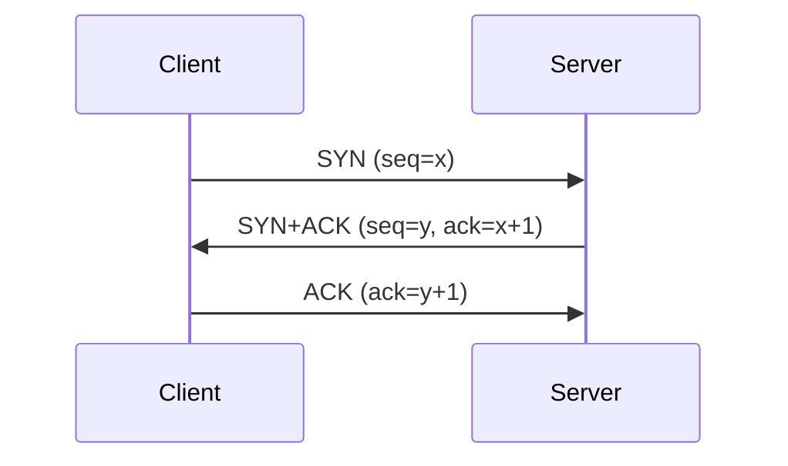
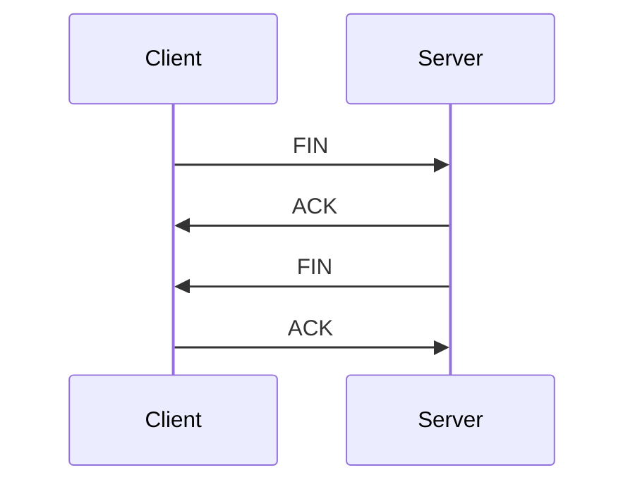

```markdown
# TCP/IP协议

import DocumentMetadata from '@site/src/components/DocumentMetadata';

<DocumentMetadata />

## TCP/IP分层模型

```
应用层(Application Layer)
传输层(Transport Layer)
网络层(Network Layer)
链路层(Link Layer)
物理层(Physical Layer)
```

## 传输层协议

### TCP (Transmission Control Protocol)

#### TCP头部结构
```
 0                   1                   2                   3
 0 1 2 3 4 5 6 7 8 9 0 1 2 3 4 5 6 7 8 9 0 1 2 3 4 5 6 7 8 9 0 1
+-+-+-+-+-+-+-+-+-+-+-+-+-+-+-+-+-+-+-+-+-+-+-+-+-+-+-+-+-+-+-+-+
|          Source Port          |       Destination Port        |
+-+-+-+-+-+-+-+-+-+-+-+-+-+-+-+-+-+-+-+-+-+-+-+-+-+-+-+-+-+-+-+-+
|                        Sequence Number                        |
+-+-+-+-+-+-+-+-+-+-+-+-+-+-+-+-+-+-+-+-+-+-+-+-+-+-+-+-+-+-+-+-+
|                    Acknowledgment Number                      |
+-+-+-+-+-+-+-+-+-+-+-+-+-+-+-+-+-+-+-+-+-+-+-+-+-+-+-+-+-+-+-+-+
|  Data |           |U|A|P|R|S|F|                               |
| Offset| Reserved  |R|C|S|S|Y|I|            Window             |
|       |           |G|K|H|T|N|N|                               |
+-+-+-+-+-+-+-+-+-+-+-+-+-+-+-+-+-+-+-+-+-+-+-+-+-+-+-+-+-+-+-+-+
|           Checksum            |         Urgent Pointer        |
+-+-+-+-+-+-+-+-+-+-+-+-+-+-+-+-+-+-+-+-+-+-+-+-+-+-+-+-+-+-+-+-+
|                    Options                    |    Padding    |
+-+-+-+-+-+-+-+-+-+-+-+-+-+-+-+-+-+-+-+-+-+-+-+-+-+-+-+-+-+-+-+-+
|                             data                              |
+-+-+-+-+-+-+-+-+-+-+-+-+-+-+-+-+-+-+-+-+-+-+-+-+-+-+-+-+-+-+-+-+
```

#### TCP连接建立 (三次握手)



**三次握手的目的**：
1. 确认双方的发送和接收能力正常
2. 交换初始序列号
3. 防止旧的重复连接请求

#### TCP连接释放 (四次挥手)



#### TCP状态机

**客户端状态**：
- CLOSED → SYN_SENT → ESTABLISHED → FIN_WAIT_1 → FIN_WAIT_2 → TIME_WAIT → CLOSED

**服务端状态**：
- CLOSED → LISTEN → SYN_RCVD → ESTABLISHED → CLOSE_WAIT → LAST_ACK → CLOSED

#### TCP流量控制

**滑动窗口机制**：
- 发送窗口：已发送但未确认的数据
- 接收窗口：可以接收的数据量

```js
// 简单滑动窗口实现
class SlidingWindow {
    constructor(size) {
        this.size = size;
        this.window = [];
        this.sent = 0;
        this.acked = 0;
    }

    canSend() {
        return this.sent - this.acked < this.size;
    }

    send(data) {
        if (this.canSend()) {
            this.window.push(data);
            this.sent++;
            return true;
        }
        return false;
    }

    ack(sequence) {
        while (this.window.length > 0 && this.window[0].seq <= sequence) {
            this.window.shift();
            this.acked++;
        }
    }
}
```

#### TCP拥塞控制

**拥塞控制算法**：
1. **慢启动**：指数增长拥塞窗口
2. **拥塞避免**：线性增长拥塞窗口
3. **快速重传**：收到3个重复ACK立即重传
4. **快速恢复**：收到重复ACK后进入快速恢复状态

```js
class TCPConnection {
    constructor() {
        this.cwnd = 1;  // 拥塞窗口
        this.ssthresh = 16;  // 慢启动阈值
        this.state = 'slow_start';
    }

    onPacketLoss() {
        this.ssthresh = Math.max(this.cwnd / 2, 2);
        this.cwnd = 1;
        this.state = 'slow_start';
    }

    onAck() {
        if (this.state === 'slow_start') {
            this.cwnd *= 2;
            if (this.cwnd >= this.ssthresh) {
                this.state = 'congestion_avoidance';
            }
        } else {
            this.cwnd += 1;
        }
    }
}
```

## 网络层协议

### IP (Internet Protocol)

#### IPv4头部结构
```
 0                   1                   2                   3
 0 1 2 3 4 5 6 7 8 9 0 1 2 3 4 5 6 7 8 9 0 1 2 3 4 5 6 7 8 9 0 1
+-+-+-+-+-+-+-+-+-+-+-+-+-+-+-+-+-+-+-+-+-+-+-+-+-+-+-+-+-+-+-+-+
|Version|  IHL  |Type of Service|          Total Length         |
+-+-+-+-+-+-+-+-+-+-+-+-+-+-+-+-+-+-+-+-+-+-+-+-+-+-+-+-+-+-+-+-+
|         Identification        |Flags|      Fragment Offset    |
+-+-+-+-+-+-+-+-+-+-+-+-+-+-+-+-+-+-+-+-+-+-+-+-+-+-+-+-+-+-+-+-+
|  Time to Live |    Protocol   |         Header Checksum       |
+-+-+-+-+-+-+-+-+-+-+-+-+-+-+-+-+-+-+-+-+-+-+-+-+-+-+-+-+-+-+-+-+
|                       Source Address                          |
+-+-+-+-+-+-+-+-+-+-+-+-+-+-+-+-+-+-+-+-+-+-+-+-+-+-+-+-+-+-+-+-+
|                    Destination Address                        |
+-+-+-+-+-+-+-+-+-+-+-+-+-+-+-+-+-+-+-+-+-+-+-+-+-+-+-+-+-+-+-+-+
|                    Options                    |    Padding    |
+-+-+-+-+-+-+-+-+-+-+-+-+-+-+-+-+-+-+-+-+-+-+-+-+-+-+-+-+-+-+-+-+
```

#### IP地址分类

| 类别 | 地址范围 | 网络位 | 主机位 | 用途 |
|------|----------|--------|--------|------|
| A类 | 0.0.0.0 ~ 127.255.255.255 | 8 | 24 | 大型网络 |
| B类 | 128.0.0.0 ~ 191.255.255.255 | 16 | 16 | 中型网络 |
| C类 | 192.0.0.0 ~ 223.255.255.255 | 24 | 8 | 小型网络 |
| D类 | 224.0.0.0 ~ 239.255.255.255 | - | - | 组播 |
| E类 | 240.0.0.0 ~ 255.255.255.255 | - | - | 保留 |

#### 子网掩码和CIDR

```
192.168.1.0/24 表示：
网络地址：192.168.1.0
子网掩码：255.255.255.0
可用主机：192.168.1.1 ~ 192.168.1.254
广播地址：192.168.1.255
```

### ARP (Address Resolution Protocol)

**工作原理**：
1. 主机广播ARP请求"谁是IP地址192.168.1.1？"
2. 目标主机单播回复"我是，MAC地址是XX:XX:XX:XX:XX:XX"
3. 请求主机缓存MAC地址

## 应用层协议

### HTTP (HyperText Transfer Protocol)

#### HTTP请求方法

| 方法 | 描述 | 安全性 | 幂等性 |
|------|------|--------|--------|
| GET | 获取资源 | 是 | 是 |
| POST | 创建资源 | 否 | 否 |
| PUT | 更新资源 | 否 | 是 |
| DELETE | 删除资源 | 否 | 是 |
| PATCH | 部分更新 | 否 | 否 |
| HEAD | 获取头部 | 是 | 是 |
| OPTIONS | 预检请求 | 是 | 是 |

#### HTTP状态码

**1xx - 信息响应**
- 100 Continue：继续发送请求

**2xx - 成功响应**
- 200 OK：请求成功
- 201 Created：资源创建成功
- 204 No Content：无内容返回

**3xx - 重定向**
- 301 Moved Permanently：永久重定向
- 302 Found：临时重定向
- 304 Not Modified：资源未修改

**4xx - 客户端错误**
- 400 Bad Request：请求错误
- 401 Unauthorized：未授权
- 403 Forbidden：禁止访问
- 404 Not Found：资源不存在
- 429 Too Many Requests：请求过于频繁

**5xx - 服务端错误**
- 500 Internal Server Error：服务器内部错误
- 502 Bad Gateway：网关错误
- 503 Service Unavailable：服务不可用

## 网络编程基础

### Socket编程

```python
# Python TCP服务器
import socket

def tcp_server():
    server_socket = socket.socket(socket.AF_INET, socket.SOCK_STREAM)
    server_socket.bind(('localhost', 8080))
    server_socket.listen(5)

    print("服务器启动，监听端口8080...")

    while True:
        client_socket, address = server_socket.accept()
        print(f"接受连接：{address}")

        data = client_socket.recv(1024)
        print(f"接收数据：{data.decode()}")

        client_socket.send("Hello from server!".encode())
        client_socket.close()

# Python TCP客户端
def tcp_client():
    client_socket = socket.socket(socket.AF_INET, socket.SOCK_STREAM)
    client_socket.connect(('localhost', 8080))

    client_socket.send("Hello from client!".encode())

    response = client_socket.recv(1024)
    print(f"服务器响应：{response.decode()}")

    client_socket.close()
```

## 网络安全

### 常见攻击类型

1. **DDoS攻击**：分布式拒绝服务
2. **SYN洪水**：利用TCP三次握手漏洞
3. **IP欺骗**：伪造源IP地址
4. **中间人攻击**：窃听和篡改通信

### 防护措施

1. **防火墙**：过滤网络流量
2. **入侵检测系统**：监控异常活动
3. **加密通信**：使用HTTPS/TLS
4. **访问控制**：限制IP和端口访问

## 总结

- **TCP/IP核心**：分层架构，各层职责明确
- **TCP连接管理**：三次握手、四次挥手、状态机
- **流量拥塞控制**：滑动窗口、慢启动算法
- **网络编程**：Socket API、异步I/O
- **安全意识**：常见攻击类型和防护措施

掌握这些基础概念，对理解现代网络应用至关重要。
```